# 一、TCP/IP协议族

## 1.协议族体系结构


### 1.数据链路层

数据链路层实现了网卡接口的网络驱动程序，以处理数据在物理媒介（以太网，令牌环）上的传输。有两个常用协议ARP（地址解析协议）和RARP（逆地址解析）协议。网络层必须先把目标机器的ip地址转换为物理地址，才能使用数据链路层提供的服务。

### 2.网络层

网络层实现数据报的选路和转发。任务是选择中间节点（路由器）来确定两台主机的通信路径。重要协议是ip协议，数据报根据目的ip地址决定下一跳。

另一个重要协议是ICMP（因特网控制报文）协议，主要用来检测网络连接。


8位类型：用来区分报文类型，ICMP分为**差错报文**（用来回应网络错误，比如目标不可到达（3）和重定向（5）和**查询报文**（用来查询网络信息，比如ping用来查看目标是否到达（8））。

8位代码：有的ICMP用这个来进一步细分不同的条件。比如重定向报文用代码0表示网络重定向，用代码1表示主机重定向。

16位校验和：用来对整个报文（包括头部和内容）进行循环冗余校验（CRC），以检验报文在传输过程中是否损坏。

### 3.传输层

为两台主机的应用程序提供端到端的通信。只在乎端到端，不在乎数据包的中转过程。主要有TCP，UDP，SCTP

TCP：为应用层提供可靠的，面向连接的，基于流的服务，使用超时重传，数据确认确保数据正确发送到目的端。内核中会维持一些必要的数据结构，比如连接的状态，读写缓冲区，定时器等。

UDP：为应用层提供不可靠的，无连接的基于数据报的服务。每个UDP数据报都有一个长度，接收端必须以该长度为最小单位将所有内容一次性读出，否则数据会被截断。

### 4.应用层

负责应用程序的逻辑。上面三层在内核空间实现，该层在用户空间实现，主要协议：

ping：是应用程序而不是协议，利用ICMP报文检测网络连接
telnet：远程登录协议，在本地完成远程任务
OSPF：开放最短路径优先，动态路由更新协议，用于路由器之间的通信告知各自的路由信息。
DNS：提供机器域名到ip地址的转换

## 2.封装


TCP报文段：


UDP无须为应用层数据提供副本，当一个UDP数据报被发送成功之后，UDP内核缓冲区的该数据报也就被丢弃了

以太网帧：

类型：来标识上层协议

CRC：对帧的其他部分进行循环冗余校验

MTU：帧的最大传送大院，即帧最多携带多少上层协议数据（比如IP数据报），图上所示最大为1500字节

## 3.分用

当帧到达主机时，将沿着协议栈自底向上一次传递，各层协议一次处理头部数据，以获取所需的信息，并最终处理后的帧交给应用程序，这个过程叫分用。


TCP和UDP通过其头部的16位的端口号字段来区分上层应用程序

## 4.ARP协议工作原理

ARP协议能够实现任意网络层地址到物理地址的转换，IP地址到以太网地址（MAC地址）的转换工作原理：主机向自己所在的网络广播一个ARP请求，以请求包含目标机器的网络地址，此网络上的其他机器都会受到这个请求，但只有被请求的目标机器会回应一个ARP应答，其中包含自己的物理地址。

**以太网ARP请求报文/应答报文：**


硬件类型：定义物理地址的类型，它的值为1表示MAC地址
协议类型：表示要映射的协议地址类型，值为0x800，表示IP地址
硬件地址长度和协议地址长度：MAC地址长度：6，IP地址长度：4
操作字段：ARP请求1，ARP应答2，RARP请求3，RARP应答4

### 1.ARP高速缓存

通常ARP维护一个高速缓存，其中包含经常访问（比如网关地址）或最近访问的ip地址到物理地址的映射，这就避免了重复的ARP请求，提高了发送数据包的速度。

`arp -a`：查看和修改ARP高速缓存
`sudo arp -d 192.168.1.109`：删除某个机器对应的ARP缓存项
`sudo arp -s 192.168.1.109 08:00:27:53:10:67`：添加某个机器对应的ARP缓存项2.

### 2.使用tcpdump观察ARP通信过程

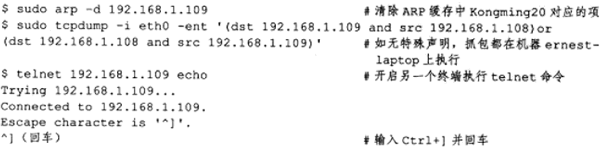


抓取的数据包本质上是以太网帧


## 6.DNS工作原理


**16位标识**：用于标记一对DNS查询和应答
**16位标志**：用于协商具体的通信方式和反馈通信状态，如下：


QR：查询/应答标志。0和1
opcode：定义查询和应答的类型：标准查询0，反向查询1（ip->主机域名)，请求服务器状态2
AA：授权应答标志，仅由应答报文使用，1表示域名服务器是授权服务器
TC：截断标志，仅当DNS报文使用UDP服务时使用，1表示DNS报文超过512字节会被截断
RD：递归查询标志。1表示递归查询，0表示迭代查询
RA：允许递归标志，仅由应答报文使用，1表示DNS支持
zero：未用必须都设置0
rcode：4位返回码，表示应答的状态，0无错误，3域名不存在

**查询问题**的格式：


查询名以一定的格式封装了要查询的主机域名。查询类通常为1。16位查询类型表示如何进行查询操作：
A：值是1表示获取目标主机的ip地址
CNAME，值是5，表示获得目标主机的别名
PTR：值是12，表示反向查询

**剩下三个采用资源记录格式：**


### socket的功能：

1.将应用程序数据从用户数据缓冲区中复制到TCP/UDP内核发送缓冲区，以交给内核发送数据，或者从内核TCP/UDP接收缓冲区复制数据到用户缓冲区，以读取数据

2.应用程序可以通过它们来修改内核中各层协议的某些头部信息和其他数据结构，从而精细的控制底层通信的行为，比如socketopt函数设置ip数据报在网络上的存活时间。

# 二、IP协议详解

IP头部信息：用来指定IP通信的源端IP地址、目的端IP地址，指导IP分片和重组，指定部分通信行为

IP数据报的路由和转发：发生在除目标机器外的所有主机和路由器上，他们决定数据报是否应该转发以及何时转发

## 1.IP服务的特点

**无状态，无连接，不可靠**

无状态：IP通信双方不同步传输数据的状态信息，因此所有IP数据报的发送传输和接收都是相互独立没有上下文的

无连接：IP通信双方都不长久地维持对方的任何信息

不可靠：IP协议不能保证IP数据报准确到达接收端

## 2.IPv4头部结构

长度通常为20字节


4位头部长度：标识IP头部有多少个32bit字（4字节），最长为60字节

8位服务类型：3位优先选段（忽略），4位TOS字段，1位保留字段（必须置0）
	4位TOS分别表示：最小延时，最大吞吐量，最高可靠性，最小费用，其中最多一个能置1，根据实际需要设置

16位总长度：整个IP数据报的长度，最大长度65535字节

16位标识：唯一的标识主机发送的每一个数据报，没发送一个数据报，值就+1

3位标志字段：第一位保留，第二包表示进制分片，第三位表示更多分片

13位分片位移：分片相对原始IP数据报开始处的偏移

8位生存时间TTL：数据报到达目的地之前允许经过的路由器跳数

8位协议：用来区分上层协议

16位头部校验和：有发送端填充，接收端对其使用CRC算法检验IP数据报头部在传输过程中是否损坏

选项字段包括：记录路由，时间戳，松散源路由选择，严格源路由选择

## 3.IP分片

分片可能发送在发送端，也可能发生在中转路由器上


## 4.IP路由


1.当IP模块接收到来自数据链路层的IP数据报时，它首先对该数据报的头部做CRC校验，准确无误之后就分析其头部的具体信息。
2.如果IP数据包的头部设置了源站选路选项，则IP模块调用数据报转发子模块来处理该数据报
3.如果目标IP是本机的某个IP或者广播地址，就决定派发给哪个上层应用
4.如果不是发送给本机的也调用数据报转发子模块
5.数据报转发子模块首先检查系统是否允许转发，如果不允许，IP数据报就会被丢弃，如果允许就执行一些操作然后交给IP数据报输出子模块
6.计算下一跳路由
7.IP输出队列存放所有等待发送的IP数据报，还包括封装了本机上层数据的IP数据报

### 1.路由机制

1.查找路由表中和数据包的目标IP地址完全匹配的主机IP地址，如果找到，就使用该路由项，没找到转步骤2
2.查找路由表中和数据报的目标IP地址具有相同网路ID的网络IP地址，比如相同网关地址，找到使用否则转3
3.选择默认路由项，通常意味着下一跳路由是网关

## 5.IP转发

1.检查头部TTL，如果TTL是0，则丢弃
2.查看头部严格源路由选择选项，如果该选项被设置，则检测数据报的目标IP地址是否是本机的某个IP地址，如果不是，则发送一个ICMP源站选路失败给发送端
3.如果有必要，给源端发送一个ICMP重定向报文，以告诉下一跳更合理的路由器
4.TTL-1
5.处理头部选项
6.如果有必要则执行IP分片操作

## 6.重定向


# 三、TCP协议详解

在应用程序中具有很强的可操作性，以下从四方面讨论：

TCP头部信息，TCP状态转移过程，TCP数据流，TCP数据流的控制


## 1.TCP头部结构


4位头部长度：标识该TCP头部有多少个32bit字（4字节），最长是60

16位窗口：是TCP控制流量的一个手段


# 四、TCP/IP实例:访问Internet上的Web服务器


## 1.HTTP代理服务器的工作原理

在HTTP通信链上，客户端和目标端服务器之间通常存在某些中转代理服务器，他们提供对目标资源的中转访问，一个HTTP请求可能被多个代理服务器转发，后面的服务器成为前面服务器的上游服务器，代理服务器按照使用方式和作用分为正向代理，反向代理和透明代理

**正向代理：**要求客户端自己设置代理服务器的地址，客户的每次请求都会发送到该服务器，比如处于防火墙内的局域网机器要访问Internet或者要访问一些外国网站。

**反向代理**：被设置在服务器端，因为客户端无法设置。是指用代理服务器来接收Internet上的连接请求，**然后将请求转发给内部网络上的服务器**，并将从内部服务器上得到的结果返回给客户端。

正向代理服务器和客户端主机处于同一个逻辑网络，该网络可以是一个本地LAN，也可以是一个更大的网络。
反向代理服务器和真正的Web服务器也位于同一个逻辑网络中，这通常是由提供网站的公司来配置和管理。


**透明代理：**只能设置在网关上。

## 2.访问DNS服务器


## 3.本地名称查询

Linux将目标主机名和对应的IP地址存放在/etc/hosts配置文件中，当需要查询某个对应时，程序先检查该文件

## 4.HTTP通信


### 1.HTTP请求


**第一行**：请求行，GET是请求方法，表示客户端以只读的方式来申请资源


安全：GET,HEAD,OPTIONS,TRACE		不安全：POST,PUT,DELETE,PATCH
等幂的：GET,HEAD,OPTIONS,TRACE,PUT,DELETE,即多次连续的，重复的请求和只发送一次该请求具有完全相同的效果。

**第二行**：表示客户端使用的程序时wget		**第三行：**表示目标主机名    
**第四行：**告诉服务器当处理完这个HTTP请求之后就关闭连接

### 2.HTTP应答


**第一行：**状态行，200 OK是状态码和状态信息


**第二行：**表示目标Web服务器程序的名字是BWS    **第三行：**表示目标文档的长度为8024字节
**第四行：**表示目标文档index.html是text类型中的html文档，charset是text文档类型的一个参数，用来指定编码
**第五行：**表示服务器传送一个Cookie给客户端，BAIDUID指定Cookie名字，expires指定生存时间，domain和path指定Cookie生效的域名和路径

# 五、Linux网络编程基础API

三个方面：socket地址API，socket基础API，网络信息API

## 1.socket地址API

**主机字节序：**现代PC大多采用小端字节序，因此也叫小端字节序

**网络字节序：**大端字节序


### 1.通用socket地址


- 地址族协议sa_family：

- sa_data成员用于存放socket地址值

14字节的sa_data根本无法完全容纳多数协议族的地址值，因此Linux定义了下面这个新的通用socket地址结构体


### 2.专用socket地址

- **Unix本地域协议族：**
  

- **TCP/IP协议族：**

### 3.IP地址转换函数


**点分十进制转和网络字节序的转换：**


## 2.创建socket


- domain：告诉系统使用哪个底层协议
- type：指定服务类型
- protocol：在前两个参数构成的协议集合下，再选择一个具体的协议，通常是0表示默认协议

## 3.命名socket

socket和socket地址绑定称为给socket命名


bind成功返回0，失败返回-1

## 4.监听socket


- backlog：内核监听队列的最大长度

SIGTERM：程序结束信号，由assert调用产生

```c
//test_backlog.c
#include <sys/socket.h>
#include <netinet/in.h>
#include <arpa/inet.h>
#include <signal.h>
#include <unistd.h>
#include <stdlib.h>
#include <assert.h>
#include <stdio.h>
#include <string.h>

static bool stop = false;
/*SIGTERM信号的处理函数，触发时结束主程序中的循环*/
static void handle_term( int sig )
{
    stop = true;
}

int main( int argc, char* argv[] )
{
    signal( SIGTERM, handle_term );

    if( argc <= 3 )
    {
        printf( "usage: %s ip_address port_number backlog\n", basename( argv[0] ) );
        return 1;
    }
    const char* ip = argv[1];
    int port = atoi( argv[2] );
    int backlog = atoi( argv[3] );

    int sock = socket( PF_INET, SOCK_STREAM, 0 );
    assert( sock >= 0 );

    struct sockaddr_in address;
    bzero( &address, sizeof( address ) );
    address.sin_family = AF_INET;
    inet_pton( AF_INET, ip, &address.sin_addr );
    address.sin_port = htons( port );

    int ret = bind( sock, ( struct sockaddr* )&address, sizeof( address ) );
    assert( ret != -1 );

    ret = listen( sock, backlog );
    assert( ret != -1 );
	/*循环等待连接，知道SIGTERM信号打断*/
    while ( ! stop )
    {
        sleep( 1 );
    }

    close( sock );
    return 0;
}
```

## 5.接受连接


accept只是从监听队列中取出连接，而不论连接处于何种状态，如ESTABLISHED状态和CLOSE_WAIT状态

## 6.发起连接


- sockfd：是本地的套接字

## 7.关闭连接


可见，shutdown能够分别关闭socket上的读和写，或者全部关闭，而close只能将socket上的读和写同时关闭

## 8.数据读写

### TCP数据读写


### UDP数据读写


### 通用数据读写函数


msghdr的定义如下：


msg_iovec成员是iovec结构体类型的指针，iovec结构体的定义如下：


## 9.带外标记

内核通知应用程序带外数据到达的两种常见方式：I/O复用产生的异常事件和SIGURG信号，即使受到通知，还需要带外数据在数据流中为具体位置，才能准确接收带外数据，通过

## 10.地址信息函数

获得一个连接socket的本端socket地址，以及远端socket地址：


## 11.socket选项

如果说fcntl系统调用是用来控制文件描述符属性的通用方法，那么下面俩系统调用是用来专门读取和设置socket文件描述符属性的方法：


### 1.SO_REUSEADDR选项

设置该选项来强制使用被处于TIME_WAIT状态的连接占用的socket地址

```c
int sock = socket( PF_INET, SOCK_STREAM, 0 );
    assert( sock >= 0 );
    int reuse = 1;
    setsockopt( sock, SOL_SOCKET, SO_REUSEADDR, &reuse, sizeof( reuse ) );

    struct sockaddr_in address;
    bzero( &address, sizeof( address ) );
    address.sin_family = AF_INET;
    inet_pton( AF_INET, ip, &address.sin_addr );
    address.sin_port = htons( port );
    int ret = bind( sock, ( struct sockaddr* )&address, sizeof( address ) );
```

### 2.SO_RCVBUF和SO_SNDBUF选项

分别用来表示TCP接收缓冲区和发送缓冲区的大小，TCP接收缓冲区的最小值是256字节，而发送缓冲区最小值是2048字节

### 3.SO_RCVLOWAT和SO_SNDLOWAT选项

分别用来表示TCP接收缓冲区和发送缓冲区的低水位标记，他们一般被I/O复用系统调用用来判断socket是否刻度或可写。默认情况下，低水位标记为1字节。

### 4.SO_LINGER选项

用于控制close系统调用在关闭TCP连接时的行为，设置该选项的值时，我们需要getsetsocketopt传递一个linger类型的结构体：


- l_onoff=0：此时该选项不起作用，close用默认行为
- l_onoff!=0&&l_linger=0：此时close立即返回，TCP模块将丢弃被关闭的socket对应的TCP发送缓冲区中残留的数据，同时给对方发送一个复位报文段，这是提供了异常终止一个连接的方法
- l_onoff!=0&&l_linger>0：
  - 对于阻塞的socket：close将等待一段长为l_linger的时间，直到TCP模块发送完所有残留数据并得到对方的确认，失败返回-1并设置errno为EWOYLDBLOKC
  - 对于非阻塞的socket：close立即返回，此时需要根据返回值判断残留数据是否发送完毕

## 12.网络信息API

### 1.gethostbyname和gethostbyaddr

**gethostbyname函数**：根据主机名来获取主机的完整信息，通常先在本地的/etc/hosts配置文件中查找主机，如果没有找到再去访问DNS服务器

**gethostbyaddr函数**：根据IP地址来获取主机的完整信息


这俩函数返回的都是hostent结构体类型的指针，定义如下：


```c
#include <sys/socket.h>
#include <netinet/in.h>
#include <netdb.h>
#include <stdio.h>
#include <unistd.h>
#include <assert.h>

int main( int argc, char *argv[] )
{
	assert( argc == 2 );
	char *host = argv[1];
	//获取目标主机地址信息
	struct hostent* hostinfo = gethostbyname( host );
	assert( hostinfo );
	//获取daytime服务信息
	struct servent* servinfo = getservbyname( "daytime", "tcp" );
	assert( servinfo );
	printf( "daytime port is %d\n", ntohs( servinfo->s_port ) );

	struct sockaddr_in address;
	address.sin_family = AF_INET;
	address.sin_port = servinfo->s_port;
	//本身就是网络字节序，所以不需要转换
	address.sin_addr = *( struct in_addr* )*hostinfo->h_addr_list;

	int sockfd = socket( AF_INET, SOCK_STREAM, 0 );
	int result = connect( sockfd, (struct sockaddr* )&address, sizeof( address ) );
	assert( result != -1 );

	char buffer[128];
	result = read( sockfd, buffer, sizeof( buffer ) );
	assert( result > 0 );
	buffer[ result ] = '\0';
	printf( "the day tiem is: %s", buffer );
	close( sockfd );
    return 0;
}
```

### 3.getaddrinfo

该函数既能通过主机名获得IP地址，也能通过服务名获得端口号


hostname接收主机名或者IP地址，service可以接收服务名或端口号，hints是应用程序给getaddrinfo的一个提示，以对getaddrinfo的输出进行更精确的控制，result指向一个链表用来存储getaddrinfo反馈的结果。

该函数反馈的每一条结果都是addrinfo结构体类型的对象，定义如下：


### 4.getnameinfo

该函数通过socket地址同时获得以字符串表示的主机名和服务名


该函数将返回的主机名存储在host参数指向的缓存中，将服务名存储在serv参数指向的缓存中，flags参数控制该函数的行为：


# 六、高级I/O函数

- 用于创建文件米描述符的函数：pipe、dup/dup2函数
- 用于读写数据的函数：readv/writev、sendfile、mmap/munmap、splice和tee函数
- 用于控制I/O行为和属性的函数，fcntl函数

## 1.pipe

创建管道实现进程间通信，其中读写两头的文件描述符都有引用计数，管道容量的默认大小是65536字节，可以用fcntl函数修改管道容量。


**创建双向管道：**这俩文件描述符既可读又可写


## 2.dup和dup2

可以把标准输入重定向到文件，或者把标准输出重定向到一个网络连接


dup函数创建一个新的文件描述符，该新文件描述符和原有文件描述符file_descriptor指向相同的文件、管道或者网络连接，并且返回的文件描述符总是当前系统可用最小的。

而dup2函数返回第一个不小于file_descriptor_two的整数值。

```c
//利用dup函数实现一个基本的CGI服务器
#include <sys/socket.h>
#include <netinet/in.h>
#include <arpa/inet.h>
#include <assert.h>
#include <stdio.h>
#include <unistd.h>
#include <stdlib.h>
#include <errno.h>
#include <string.h>

int main( int argc, char* argv[] )
{
    if( argc <= 2 )
    {
        printf( "usage: %s ip_address port_number\n", basename( argv[0] ) );
        return 1;
    }
    const char* ip = argv[1];
    int port = atoi( argv[2] );

    struct sockaddr_in address;
    bzero( &address, sizeof( address ) );
    address.sin_family = AF_INET;
    inet_pton( AF_INET, ip, &address.sin_addr );
    address.sin_port = htons( port );

    int sock = socket( PF_INET, SOCK_STREAM, 0 );
    assert( sock >= 0 );

    int ret = bind( sock, ( struct sockaddr* )&address, sizeof( address ) );
    assert( ret != -1 );

    ret = listen( sock, 5 );
    assert( ret != -1 );

    struct sockaddr_in client;
    socklen_t client_addrlength = sizeof( client );
    int connfd = accept( sock, ( struct sockaddr* )&client, &client_addrlength );
    if ( connfd < 0 )
    {
        printf( "errno is: %d\n", errno );
    }
    else
    {
        close( STDOUT_FILENO );
        dup( connfd );		//返回文件描述符1
        printf( "abcd\n" );	//输出的内容会发送到与客户连接对应的socket上
        close( connfd );
    }

    close( sock );
    return 0;
}
```

## 3.readv和wirtev

readv函数将文件描述符读到分散的内存块中，即分散读；writev函数将多块分散的内存数据一并写入到文件描述符中，即集中写。


一个http请求包含1个状态行，多个头部字段，1个空行和文档的内容，其中前三行的内容可能被web服务器放在一块内存中，而文档的内容通常被读入到另外一块内存中。

```c
//web服务器上的集中写
#include <sys/socket.h>
#include <netinet/in.h>
#include <arpa/inet.h>
#include <assert.h>
#include <stdio.h>
#include <unistd.h>
#include <stdlib.h>
#include <errno.h>
#include <string.h>
#include <sys/stat.h>
#include <sys/types.h>
#include <fcntl.h>

#define BUFFER_SIZE 1024
/*定义两种HTTP状态码和状态信息*/
static const char* status_line[2] = { "200 OK", "500 Internal server error" };

int main( int argc, char* argv[] )
{
    if( argc <= 3 )
    {
        printf( "usage: %s ip_address port_number filename\n", basename( argv[0] ) );
        return 1;
    }
    const char* ip = argv[1];
    int port = atoi( argv[2] );
	/*目标文件作为程序的第三个参数*/
    const char* file_name = argv[3];

    struct sockaddr_in address;
    bzero( &address, sizeof( address ) );
    address.sin_family = AF_INET;
    inet_pton( AF_INET, ip, &address.sin_addr );
    address.sin_port = htons( port );

    int sock = socket( PF_INET, SOCK_STREAM, 0 );
    assert( sock >= 0 );

    int ret = bind( sock, ( struct sockaddr* )&address, sizeof( address ) );
    assert( ret != -1 );

    ret = listen( sock, 5 );
    assert( ret != -1 );

    struct sockaddr_in client;
    socklen_t client_addrlength = sizeof( client );
    int connfd = accept( sock, ( struct sockaddr* )&client, &client_addrlength );
    if ( connfd < 0 )
    {
        printf( "errno is: %d\n", errno );
    }
    else
    {
		/*用于保存HTTP应答的状态行，头部字段和一个空行的缓冲区*/
        char header_buf[ BUFFER_SIZE ];
        memset( header_buf, '\0', BUFFER_SIZE );
		/*用于存放目标文件内容的应用程序缓存*/
        char* file_buf;
		/*用于获取目标文件的属性，比如是否为目录，文件大小等*/
        struct stat file_stat;
		/*记录目标文件是否是有效文件*/
        bool valid = true;
		/*缓存区header_buf目前已经使用了多少字节的空间*/
        int len = 0;
        if( stat( file_name, &file_stat ) < 0 )			//目标文件不存在
        {
            valid = false;
        }
        else
        {
            if( S_ISDIR( file_stat.st_mode ) )			//目标文件是一个目录
            {
                valid = false;
            }
			/*当前用户有读取目标的权限*/
            else if( file_stat.st_mode & S_IROTH )
            {
				/*动态分配file_buf,并指定其大小为目标文件的大小
				file_stat.st_size加1，然后将目标文件读入缓存区file_buf中*/
                int fd = open( file_name, O_RDONLY );
                file_buf = new char [ file_stat.st_size + 1 ];
                memset( file_buf, '\0', file_stat.st_size + 1 );
                if ( read( fd, file_buf, file_stat.st_size ) < 0 )
                {
                    valid = false;
                }
            }
            else
            {
                valid = false;
            }
        }
        
		/*如果目标文件有效，则发送正常的HTTP应答*/
        if( valid )
        {
			//往header_buf里面填充内容
            ret = snprintf( header_buf, BUFFER_SIZE-1, "%s %s\r\n", "HTTP/1.1", status_line[0] );
            len += ret;
            ret = snprintf( header_buf + len, BUFFER_SIZE-1-len, 
                             "Content-Length: %d\r\n", file_stat.st_size );
            len += ret;
            ret = snprintf( header_buf + len, BUFFER_SIZE-1-len, "%s", "\r\n" );
			//利用writev将header_buf和file_buf的内容一并写出
            struct iovec iv[2];
            iv[ 0 ].iov_base = header_buf;			//内存起始地址
            iv[ 0 ].iov_len = strlen( header_buf );	//这块内存的长度
            iv[ 1 ].iov_base = file_buf;
            iv[ 1 ].iov_len = file_stat.st_size;
            ret = writev( connfd, iv, 2 );			//将这块内存的内容写到connfd中
        }
        else		//如果目标文件无效，则通知客户端服务器发生内部错误
        {
            ret = snprintf( header_buf, BUFFER_SIZE-1, "%s %s\r\n", "HTTP/1.1", status_line[1] );
            len += ret;
            ret = snprintf( header_buf + len, BUFFER_SIZE-1-len, "%s", "\r\n" );
            send( connfd, header_buf, strlen( header_buf ), 0 );
        }
        close( connfd );
        delete [] file_buf;
    }

    close( sock );
    return 0;
}
```

## 4.sendfile

sendfile函数在两个文件描述符中传递数据（完全在内核中操作），从而避免了内核缓冲区和用户缓冲区之间的数据拷贝，效率很高，成为零拷贝。


in_fd：待读出内容的文件描述符，必须是一个支持类似mmap函数的文件描述符，必须指向真实的文件
out_fd：待写入内容的文件描述符，必须是一个socket

```c
//使用sendfile将服务器的一个文件传送到客户端
#include <sys/socket.h>
#include <netinet/in.h>
#include <arpa/inet.h>
#include <assert.h>
#include <stdio.h>
#include <unistd.h>
#include <stdlib.h>
#include <errno.h>
#include <string.h>
#include <sys/types.h>
#include <sys/stat.h>
#include <fcntl.h>
#include <sys/sendfile.h>

int main( int argc, char* argv[] )
{
    if( argc <= 3 )
    {
        printf( "usage: %s ip_address port_number filename\n", basename( argv[0] ) );
        return 1;
    }
    const char* ip = argv[1];
    int port = atoi( argv[2] );
    const char* file_name = argv[3];

    int filefd = open( file_name, O_RDONLY );
    assert( filefd > 0 );
    struct stat stat_buf;			//保存文件信息
    fstat( filefd, &stat_buf );		//获取文件信息

    struct sockaddr_in address;
    bzero( &address, sizeof( address ) );
    address.sin_family = AF_INET;
    inet_pton( AF_INET, ip, &address.sin_addr );
    address.sin_port = htons( port );

    int sock = socket( PF_INET, SOCK_STREAM, 0 );
    assert( sock >= 0 );

    int ret = bind( sock, ( struct sockaddr* )&address, sizeof( address ) );
    assert( ret != -1 );

    ret = listen( sock, 5 );
    assert( ret != -1 );

    struct sockaddr_in client;
    socklen_t client_addrlength = sizeof( client );
    int connfd = accept( sock, ( struct sockaddr* )&client, &client_addrlength );
    if ( connfd < 0 )
    {
        printf( "errno is: %d\n", errno );
    }
    else
    {
        sendfile( connfd, filefd, NULL, stat_buf.st_size );
        close( connfd );
    }

    close( sock );
    return 0;
}
```

## 5.mmap和munmap

mmap函数用于申请一段内存空间，我们可以将这段内存作为进程间通信的共享内存，也可以将文件直接映射到其中。		munmap函数则释放有mmap创建的这段内存空间。


start：用户使用某个特定的地址作为这段内存的起始地址，如果是NULL则系统自动分配一个地址。
prot：设置内存段的访问权限

flag：控制内存段内容被修改后程序的行为。

fd：被映射文件对应的文件描述符

## 6.splice

splice函数用于在两个文件描述符中**移动**数据，也是零拷贝操作。


fd_in：是待输入数据的文件描述符，如果他是管道文件描述符，则off_in参数被设置成NULL，如果不是管道描述符，则off_in表示从何处开始读取数据，若他还是NULL就表示从当前偏移位置读入


```c
//splice回射服务器，服务器将客户端发送的数据原样发送给客户端
#include <sys/socket.h>
#include <netinet/in.h>
#include <arpa/inet.h>
#include <assert.h>
#include <stdio.h>
#include <unistd.h>
#include <stdlib.h>
#include <errno.h>
#include <string.h>
#include <fcntl.h>

int main( int argc, char* argv[] )
{
    if( argc <= 2 )
    {
        printf( "usage: %s ip_address port_number\n", basename( argv[0] ) );
        return 1;
    }
    const char* ip = argv[1];
    int port = atoi( argv[2] );

    struct sockaddr_in address;
    bzero( &address, sizeof( address ) );
    address.sin_family = AF_INET;
    inet_pton( AF_INET, ip, &address.sin_addr );
    address.sin_port = htons( port );

    int sock = socket( PF_INET, SOCK_STREAM, 0 );
    assert( sock >= 0 );

    int ret = bind( sock, ( struct sockaddr* )&address, sizeof( address ) );
    assert( ret != -1 );

    ret = listen( sock, 5 );
    assert( ret != -1 );

    struct sockaddr_in client;
    socklen_t client_addrlength = sizeof( client );
    int connfd = accept( sock, ( struct sockaddr* )&client, &client_addrlength );
    if ( connfd < 0 )
    {
        printf( "errno is: %d\n", errno );
    }
    else
    {
        int pipefd[2];
        assert( ret != -1 );
        ret = pipe( pipefd );			//创建管道
		/*将connfd上流入的客户数据定向到管道写中*/
        ret = splice( connfd, NULL, pipefd[1], NULL, 32768, SPLICE_F_MORE | SPLICE_F_MOVE ); 
        assert( ret != -1 );
		/*将管道的读出数据到connfd客户连接的文件描述符，写回给客户端*/
        ret = splice( pipefd[0], NULL, connfd, NULL, 32768, SPLICE_F_MORE | SPLICE_F_MOVE );
        assert( ret != -1 );
        close( connfd );
    }

    close( sock );
    return 0;
}
```

## 7.tee

tee函数在两个管道文件描述符之间**复制**数据，也是零拷贝操作，不消耗数据，因此源文件描述符上的数据仍然可以用于后序的读操作。

```c
//Linux下tee程序：同时输出数据到终端和文件的程序
#include <assert.h>
#include <stdio.h>
#include <unistd.h>
#include <errno.h>
#include <string.h>
#include <fcntl.h>

int main( int argc, char* argv[] )
{
	if ( argc != 2 )
	{
		printf( "usage: %s <file>\n", argv[0] );
		return 1;
	}
	int filefd = open( argv[1], O_CREAT | O_WRONLY | O_TRUNC, 0666 );
	assert( filefd > 0 );

	int pipefd_stdout[2];
        int ret = pipe( pipefd_stdout );
	assert( ret != -1 );

	int pipefd_file[2];
        ret = pipe( pipefd_file );
	assert( ret != -1 );
	/*将标准输入内容输入管道pipe_stdout*/
	ret = splice( STDIN_FILENO, NULL, pipefd_stdout[1], NULL, 32768, SPLICE_F_MORE | SPLICE_F_MOVE );
	assert( ret != -1 );
	//将管道pipe_stdout的读端输出复制到pipefd_file的写端
	ret = tee( pipefd_stdout[0], pipefd_file[1], 32768, SPLICE_F_NONBLOCK ); 
	assert( ret != -1 );
	ret = splice( pipefd_file[0], NULL, filefd, NULL, 32768, SPLICE_F_MORE | SPLICE_F_MOVE );
	assert( ret != -1 );
	ret = splice( pipefd_stdout[0], NULL, STDOUT_FILENO, NULL, 32768, SPLICE_F_MORE | SPLICE_F_MOVE );
	assert( ret != -1 );

	close( filefd );
    close( pipefd_stdout[0] );
    close( pipefd_stdout[1] );
    close( pipefd_file[0] );
    close( pipefd_file[1] );
	return 0;
}
```

## 8.fcntl

file control：提供对文件描述符的各种控制，另一个函数ioctl比fcntl能够执行更多的控制


cmd是操作。

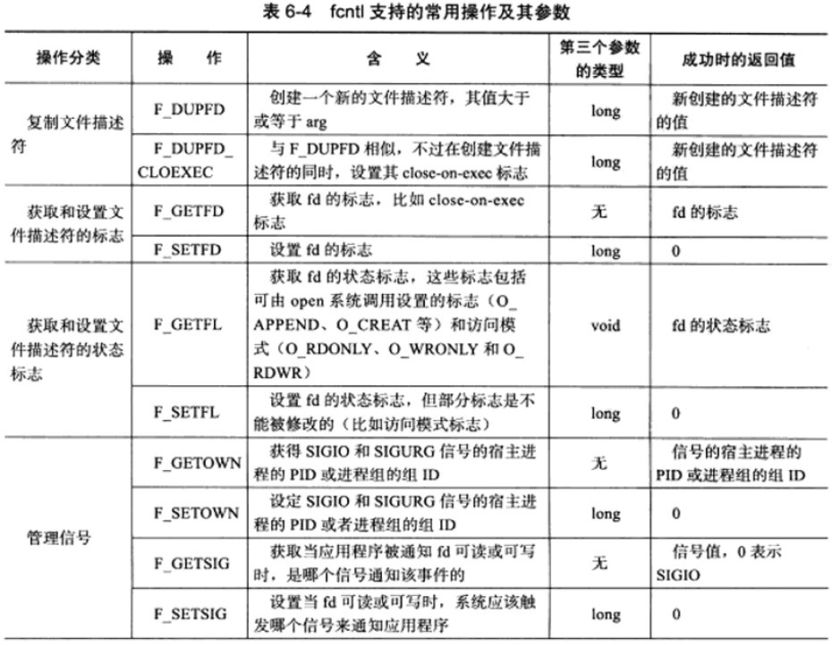


# 七、Linux服务器程序规范

## 1.日志

Linux提供一个守护进程来处理日志----syslogd，不过现在使用的额都是升级版----rsyslogd。该守护进程既能接收内核日志，又能接收用户进程输出日志，输出到/dev/log中

Linux日志体系：


### syslog

应用程序使用syslog函数与rsyslog守护进程通信。采用可变参数来结构化输出。


priority：设施值和日志级别的按位或，默认为LOG_USER，日志级别有如下几个：

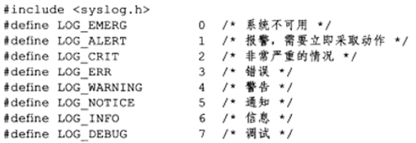

**openlog函数改变syslog的默认输出方式，进一步结构化日志内容：**


ident：指定的字符串将添加到日志消息的日期和时间之后，通常被设置为程序的名字

logopt：对后序syslog调用的行为进行配置，取下列值按位或


facility：用来修改syslog函数中的默认设施值

**setlogmask函数用来设施syslog的日志掩码：**maskpri指定日志掩码值


使用完关闭日志功能：

## 2.用户信息

### 1.UID、EUID、GID和EGID

下面一组函数用来设置上面的这些ID：


一个进程有俩用户ID：UID和EUID。EUID存在的目的是方便资源访问，它使得运行程序的用户拥有该程序的有效用户的权限，比如su程序，su程序的所有者就是root,有效进程为root的进程为特权进程。

### 2.切换用户

```c
//以root身份启动的进程切换为以一个普通用户身份运行
static bool switch_to_user( uid_t user_id, gid_t gp_id )
{
    //先确保目标用户不是root
    if ( ( user_id == 0 ) && ( gp_id == 0 ) )
    {
        return false;
    }

    //确保当前用户是合法用户
    gid_t gid = getgid();
    uid_t uid = getuid();
    if ( ( ( gid != 0 ) || ( uid != 0 ) ) && ( ( gid != gp_id ) || ( uid != user_id ) ) )
    {
        return false;
    }
	//如果不是root，则已经是目标用户
    if ( uid != 0 )
    {
        return true;
    }
	//切换到目标用户
    if ( ( setgid( gp_id ) < 0 ) || ( setuid( user_id ) < 0 ) )
    {
        return false;
    }

    return true;
}
```

## 3.进程间关系

### 1.进程组

Linux下每个进程都隶属于一个进程组，因此他们除了PID信息外还有进程组ID（PGID），用如下函数获取PGID：


每个进程组都有一个首领进程，其PGID和PID相同，进程组一直存在，知道所有进程都退出。下面设置PGID：


一个进程只能设置自己活其子进程的PGID，并且当子进程调用exec系列函数后，我们也不能再在父进程中对他设置PGID。

### 2.会话

一些关联的进程组形成一个会话，下面函数创建会话：


该函数不能由进程组首领调用，否则会产生错误，其他进程调用后的效果：
	1.调用进程成为会话的首领，此时该进程是新会话的唯一成员
	2.新建一个进程组，其PGID就是调用进程PID，调用进程成为新组的首领
	3.调用进程将甩开终端

### 3.ps命令查看进程关系


## 4.系统资源限制

Linux系统资源的限制可以通过如下函数来读取和设置：


rlimit:是一个rlimit结构体类型的指针，结构体定义如下：

rlimit_t是一个整数类型来描述资源级别，rlimit_cur成员指定资源的软限制,rlimit_max指定资源的硬限制。

软限制是一个建议性的最好不要超过的限制，如果超越的话可能会向进程发送信号终止运行：
	当进程cpu时间超过软限制，系统向进程发送SIGXCPU信号。
	当文件尺寸超过软限制，发送SIGXFSZ信号。

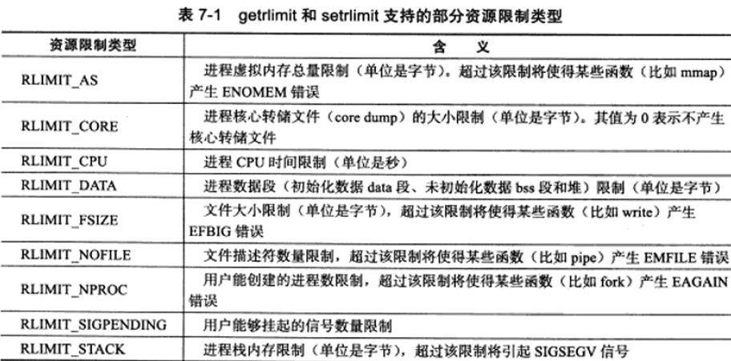

## 5.改变工作目录和根目录

一般来说，Web服务器的逻辑根目录并非文件系统的根目录“/“，而是站点的根目录（对于Linux的Web服务器一般来说是/var/www）。获取进程当前工作目录和改变进程工作目录的额函数分别是：


buf：存储进程当前工作目录的绝对路径名，大小由size指定

改变根目录的函数：

## 6.服务器程序后台化

```c
//将服务器以守护进程的方式运行
bool daemonize()
{
    pid_t pid = fork();
    if ( pid < 0 )
    {
        return false;
    }
    else if ( pid > 0 )		//创建子进程，关闭父进程，这样可以让程序在后台运行
    {
        exit( 0 );
    }
	/*设置文件权限掩码，当进程创建新文件时，文件权限是mode&0777*/
    umask( 0 );
	/*创建新的会话，设置本进程为进程组的首领*/
    pid_t sid = setsid();
    if ( sid < 0 )
    {
        return false;
    }
	/*切换工作目录*/
    if ( ( chdir( "/" ) ) < 0 )
    {
        /* Log the failure */
        return false;
    }
	/*关闭各种设备*/
    close( STDIN_FILENO );
    close( STDOUT_FILENO );
    close( STDERR_FILENO );
	/*关闭其他已经打开的文件描述符，此处省略*/
	/*将标准输入输出都定向到/dev/null文件中*/
    open( "/dev/null", O_RDONLY );
    open( "/dev/null", O_RDWR );
    open( "/dev/null", O_RDWR );
    return true;
}
```

实际上，Linux提供了完成同样功能的库函数：

nochdir：用于指定是否改变工作目录，如果是0，则工作目录是“/“，否则继续使用当前工作目录
noclose：为0时标准设备都被输出重定向到/dev/null文件

# 八、高性能服务器程序框架

我们按照服务器的一般原理，解构为三个主要模块：

- I/O处理单元：本章介绍四种I/O模型和两种高效事件处理模式
- 逻辑单元：本章介绍逻辑单元的两种高效并发模式，以及高效处理方式---有限状态机
- 存储单元

## 1.服务器模型

### 1.C/S模型


由于客户连接请求时随机到达的异步事件，所以服务器需要使用某种I/O模型来监听这一事件。


该模型适合资源相对集中的场合，并且实现简单，但是缺点很明显，服务器是通信的核心，当访问量过大时，所有客户都会得到很慢的响应，P2P模型解决了这个问题。

### 2.P2P模型

点对点模型，云计算机群是一个P2P模型的典范，缺点是当用户间的传输请求过多时网络的负载加重。


主机之间很难相互发现，所以需要一个发现服务器，使每个客户都能尽快找到自己需要的资源。每台主机既是服务器又是客户端。

## 2.服务器编程框架

基本框架：

该图既能来描述一台服务器，又能来描述一个服务器机群，各个部件的含义和功能如下：


负载均衡：从所有逻辑服务器中选取负荷最小的一台为新客户服务

## 3.I/O模型

socket在创建的时候默认是阻塞的，通过第二个参数SOCK_NONBLOCK标志，调用函数fcntl设置F_SETFL命令设置为非阻塞。我们称阻塞的文件描述符为阻塞I/O，非阻塞的文件描述符为非阻塞I/O。

非阻塞的I/O执行系统调用总是立即返回，不管事件是否发生，如果事件没有发生，都返回-1，非阻塞I/O要和其他通知机制一起使用，比如I/O复用和SIGIO信号。

**I/O复用：**指的是应用程序通过I/O复用函数向内核注册一组事件，内核通过I/O复用函数把其中就绪的时间通知给应用程序，Linux常用的I/O复用函数就是select，pool和epoll_wait，I/O复用函数本身是阻塞的，他们能提高程序效率的原因在于他们具有同时监听多个I/O事件的能力。

**SIGIO信号**：我们可以为一个目标文件描述符指定宿主进程，那么被指定的宿主进程将捕获到SIGIO信号，这样，当文件描述符上有事件发生时，SIGIO信号的信号处理喊出被触发，我们就可以在目标文件描述符指向非阻塞I/O


## 4.两种高效的事件处理模式

服务器程序通常要处理三种事件：I/O事件，信号和定时事件。同步I/O模型常用于实现Reactor模式，异步I/O模型常用于Proactor模式。

### 1.Reactor模式

它要求主线程（I/O处理单元）只负责监听文件描述符上是否有事件发生，有的话就立即将该事件通知给工作线程，读写、接受新连接以及处理客户请求都在工作线程中完成。

使用**同步I/O模型**（epoll_wait为例）实现的Reactor模式的工作流程：
	1.主线程往epoll内核事件表中注册socket的读就绪事件
	2.主线程调用epoll_wait等待socket上有数据可读
	3.当socket上有数据可读时，epoll_wait通知主线程。主线程则将socket**可读事件放入请求队列**
	4.睡眠在请求队列上的某个工作线程被唤醒，它从socket读取数据，并处理客户请求，然后往epoll内核事件注册表中注册该socket上的写就绪事件
	5.主线程调用epoll_wait等待socket可写
	6.当socket可写时，epoll_wait通知主线程。主线程将socket**可写事件放入请求队列**
	7.睡眠在请求队列上的某个工作进程被唤醒，它从socket上写入服务器处理客户请求的结果


### 2.Proactor模式

与Reactor模式不同，Proactor模式将所有的I/O操作都交给主线程和内核来处理，工作线程仅仅负责业务逻辑，更符合服务器编程框架。

使用**异步I/O模型**（以aio_read和aio_write为例）实现的Proactor模式的工作流程：
	1.主线程调用aio_read函数向内核注册socket上的读完成事件，并告诉内核用户读缓冲区的位置，以及读操作完成时如何通知应用程序
	2.主线程继续处理其他逻辑
	3.当socket上的数据被读入用户缓冲区后，内核将向应用程序发送一个信号，以通知应用程序数据可用
	4.应用程序预先定义好的信号处理函数选择一个工作线程来处理客户请求。工作线程处理完客户请求之后，调用aio_write函数向内核注册一个socket上的写完成事件，并告诉内核用户缓冲区写的位置，以及写操作完成时如何通知应用程序
	5.主线程继续处理其他逻辑
	6.当用户缓冲区的数据被写入socket之后，内核将向应用程序发送一个信号，以通知应用程序数据以及发送完毕
	7.应用程序预先定义好的信号处理函数选择一个工作线程来做善后处理，比如决定是否关闭socket

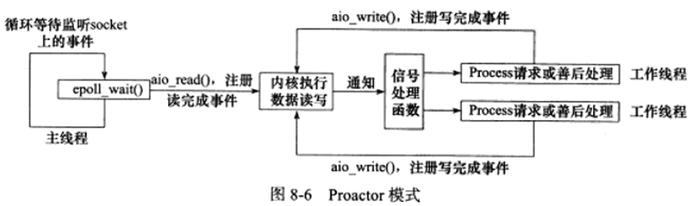

主线程的epoll_wait调用仅能用来检测监听socket上的连接请求时间，而不能用来检测socket上的读写事件。socket上的读写事件是通过aio_read/aio_write向内核注册的，因此应用程序将通过信号来向应用程序报告连接socket上的读写事件。

### 3.模拟Proacator模式

原理：主线程执行数据读写操作，读写完成后，主线程向工作线程通知这一个“完成事件”，那么从工作线程的角度来看，他们就直接获得了数据读写的结果，接下来要做的就是对读写的结果进行逻辑处理。

使用同步I/O模型模拟出的Proactor模式的工作流程如下：
	1.主线程往epoll内核事件中注册socket上的读就绪事件
	2.主线程调用epoll_wait等待socket上有数据可读
	3.当socket上有数据可读时，epoll_wait通知主线程。主线程从socket循环读取数据直到没有更多数据可读，然后读取到的数据封装成一个请求对象并插入请求队列。
	4.睡眠在请求队列上的某个工作线程被唤醒，他获得请求对象并处理客户请求，然后往epoll内核事件表中注册socket上的写就绪事件
	5.主线程调用epoll_wait等待socket可写
	6.当socket可写时，epoll_wait通知主线程，主线程往socket上写入服务器处理客户请求的结果


## 5.两种高效的并发模式

并发是为了让程序同时执行多个任务，让被阻塞I/O的执行线程主动放弃cpu并且将执行权转移到其他线程，这样一来cpu可以干其他事情，利用率显著提升。

并发模式是指I/O处理单元和多个逻辑单元之间协调完成任务的方法，服务器主要有两种并发编程模式：半同步/半异步模式和领导者/追随者模式。

### 1.半同步/半异步模式

在I/O模型中，同步和异步区分的是内核向应用进程通知的是何种事件（是读就绪事件还是完成事件），以及该由谁来完成读写（是应用程序还是内核）。

在并发模式中，同步指的是程序完全按照代码序列的顺序执行；异步指的是程序的执行需要由系统事件来驱动。常见的系统事件包括中断，信号等。


对于服务器来说既要求较好的实时性又要求同时处理多个用户请求的应用程序，我们要同时使用同步线程和异步线程，即采用半同步/半异步模式来实现。同步线程用来处理用户逻辑，异步线程用来处理I/O事件。

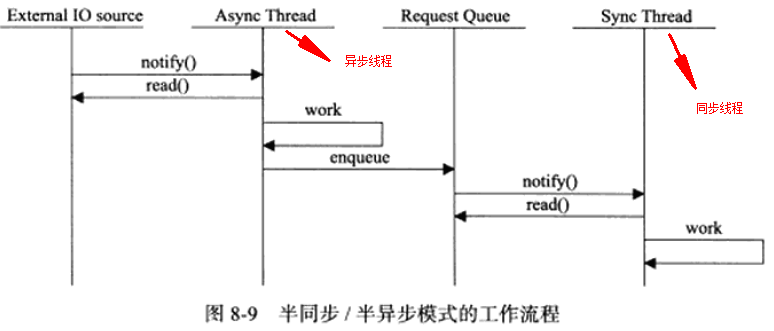

如果结合考虑两种事件处理模式和几种I/O模型，则半同步/半异步模式就存在多种变体，其中一种变体就是半同步/半反应堆模式，如图：

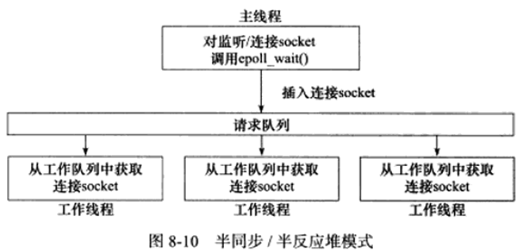

该图表示异步线程只有一个由主线程来充当，负责监听所有socket上的事件。

**半同步/半反应堆模式存在如下缺点：**

- 主线程和工作线程共享请求队列。主线程往请求队列添加任务或者工作线程从请求队列取出任务都需要对请求队列加锁保护，从而白白浪费cpu时间。
- 每个工作线程在同一时间只能处理一个客户请求。如果客户数量较多，而工作线程较少，则请求队列会堆积很多任务，客户端相应速度会越来越慢，如果通过增加工作线程来解决，则工作线程切换也会耗费大量cpu时间。

**一种相对高效的半同步/半异步模式：**它的每个工作线程可以同时处理多个客户连接

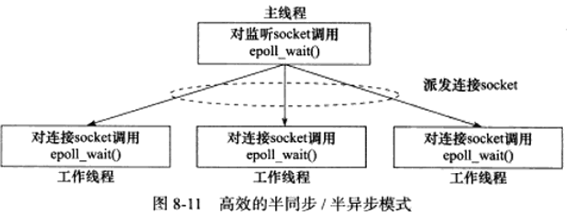

该图描述主线程只负责监听socket，主线程向工作线程派发socket的最简单的方式是往它和工作线程之间的管道里写数据，工作线程检测到管道有数据可读，就分析是否是一个新的客户连接请求到来，如果是，就把新socket上的读写事件注册到自己的epoll内核事件表中。

### 2.领导者/追随者模式

指多个工作线程轮流获得事件源集合，轮流监听、分发并处理事件的一种模式。在任意时间点，程序都仅有一个领导者线程，它负责监听I/O事件，而其他线程都是追随者，他们休眠在线程池中等待成为新的领导者。

当前的领导者如果检测到I/O事件，首先从线程池中推选出新的领导者线程，然后自己再处理I/O事件。此时新的领导者继续等待新的I/O事件，而原来的领导者则处理I/O事件，实现了并发。

该模式包含如下组件：句柄集（HandleSet）、线程集（ThradSet）、事件处理器（EvenHandler）和具体的事件处理器（ConcreteEventHandler），关系如下：

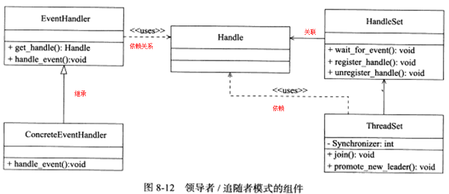

#### 1.句柄集

句柄用于便是IO资源，在Linux下通常是一个文件描述符，句柄集就是众多句柄，它使用wait_for_event方法来监听这些句柄上的IO事件，并将其中的就绪事件通知给领导者线程，领导者则调用绑定到Handle上的事件处理器来处理事件。领导者将Handle和事件处理器绑定是通过调用句柄几种的register_handle方法实现的。

#### 2.线程集

这个组件是所有工作线程的管理者。它负责各个线程的同步以及新领导者线程的推选，线程集中的线程在任一时间必处于如下三种状态之一：

- **Leader**：当前线程处于领导者身份，负责等待句柄集中上的IO事件
- **Processing**：线程正在处理事件，领导者检测到IO事件后可以转移到该状态来处理该事件，并调用promote_new_leader方法推选新的领导者：也可以指定其他追随者来处理事件。当处于该状态的线程处理完事件后，如果当前线程集中没有领导者，则它将成为新的领导者，否则直接变为追随者。
- **Follower：**线程当前处于追随者身份，通过调用线程集的join方法成为新的领导者，也可能被当前的领导者来指定处理新的任务。

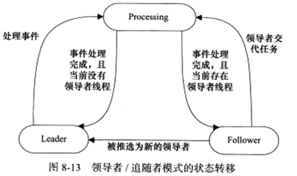

领导者推选新的领导者和追随者等待成为新的领导者这两个操作都会修改线程集，因此线程集提供一个成员Synchronizer来同步这俩操作，避免竞态。

#### 3.事件处理器和具体的事件处理器

事件处理器通常包含一个或多个回调函数handle_event。这些回调函数用于处理事件对应的业务逻辑。事件处理器使用前需要被绑定到某个句柄上，句柄事件发生就会调用回调函数，具体的事件处理器是事件处理器的派生类，他们必须重新实现基类的handle_event方法以处理特定的任务。

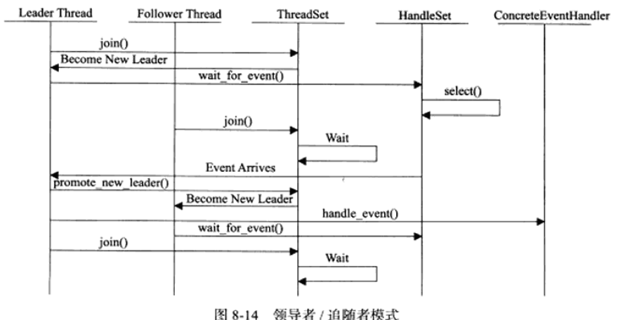

## 6.有限状态机

这一节是介绍逻辑单元内部的一种高效编程方法：有限状态机

根据应用层协议头部包含的数据包类型来映射为逻辑单元的一种执行状态，服务器根据它来编写相应的处理逻辑：

**有限状态机应用的一个实例：HTTP请求的读取和分析**。我们判断HTTP头部结束的依据是遇到一个空行，该空行仅包含一堆回车换行符(<CR><LF>)。如果一次读操作没有读入HTTP请求的整个头部，即没有遇到空行，那么我们就必须等待客户继续写数据并再次读入，因此，我们每完成一次读操作就要分析新读入的数据是否有空行。

**实例**：HTTP请求的读取和分析，空行前面是请求行和头部域

```c
#include <sys/socket.h>
#include <netinet/in.h>
#include <arpa/inet.h>
#include <assert.h>
#include <stdio.h>
#include <stdlib.h>
#include <unistd.h>
#include <errno.h>
#include <string.h>
#include <fcntl.h>

/*读缓冲区大小*/
#define BUFFER_SIZE 4096
/*主状态机的三种可能：当前正在分析请求行，正在分析头部字段，分析内容*/
enum CHECK_STATE { CHECK_STATE_REQUESTLINE = 0, CHECK_STATE_HEADER, CHECK_STATE_CONTENT };
/*从状态机的三种可能状态，分别表示读到一个完整的行，行出错和行数据不完整*/
enum LINE_STATUS { LINE_OK = 0, LINE_BAD, LINE_OPEN };
/*服务器处理HTTP请求的结果：NO_REQUESE表示请求不完整，需要继续读取客户数据,
GET_REQUEST:表示获得了一个完整的客户请求，BAD_REQUEST:表示客户请求有语法错误,
FORBIDDEN_REQUEST:表示客户对资源没有足够的访问权限，INTERNAL_ERROR:表示服务器内部错误,
CLOSED_CONNECTION:表示客户端已经关闭连接*/
enum HTTP_CODE { NO_REQUEST, GET_REQUEST, BAD_REQUEST, FORBIDDEN_REQUEST, INTERNAL_ERROR, CLOSED_CONNECTION };
/*为了简化问题，我们没有给客户端发送一个完整的HTTP应答报文，只是根据服务器的处理结果发送成功或失败信息*/
static const char* szret[] = { "I get a correct result\n", "Something wrong\n" };

/*从状态机，用于解析一行内容*/
LINE_STATUS parse_line( char* buffer, int& checked_index, int& read_index )
{
    char temp;
	/*check_index指向buffer应用程序缓冲区中当前正在分析的字节，
	read_idex指向buffer中客户数据的尾部的下一字节，buffer中0~checked_index的字节都已经分析完毕，
	第checked_index~(read_index-1)字节由下面的程序挨个分析*/
    for ( ; checked_index < read_index; ++checked_index )
    {
        temp = buffer[ checked_index ];						//当前要分析的字节
        if ( temp == '\r' )									//回车符说明可能读取到一个完整的行，说明可能读到一个完整的行
        {
			/*如果"\r"字符碰巧是buffer中的最后一个被读入的客户数据，那么这次分析没有读取到一个完整的行，返回LINE_OPEN
			以表示还需要继续读取客户数据才能进一步分析*/
            if ( ( checked_index + 1 ) == read_index )
            {
                return LINE_OPEN;
            }
			/*如果下一个字符是"\n*，则说明我们成功读取到一个完整的行*/
            else if ( buffer[ checked_index + 1 ] == '\n' )
            {
                buffer[ checked_index++ ] = '\0';
                buffer[ checked_index++ ] = '\0';
                return LINE_OK;
            }
			//否则说明客户发送的HTTP请求存在语法问题
            return LINE_BAD;
        }
		/*如果当前字符是换行符也说明可能读取到一个完整的行*/
        else if( temp == '\n' )
        {
            if( ( checked_index > 1 ) &&  buffer[ checked_index - 1 ] == '\r' )
            {
                buffer[ checked_index-1 ] = '\0';
                buffer[ checked_index++ ] = '\0';
                return LINE_OK;
            }
            return LINE_BAD;
        }
    }
	/*如果所有内容分析完毕也没有遇到"\r"字符则返回表示还需要继续读取客户数据才能进一步分析*/
    return LINE_OPEN;
}

//分析请求行
HTTP_CODE parse_requestline( char* szTemp, CHECK_STATE& checkstate )
{
	/*如果请求行中没有空白字符或"\t"字符，则HTTP请求毕有问题*/
    char* szURL = strpbrk( szTemp, " \t" );
    if ( ! szURL )
    {
        return BAD_REQUEST;
    }
    *szURL++ = '\0';

    char* szMethod = szTemp;
    if ( strcasecmp( szMethod, "GET" ) == 0 )				//仅支持GET方法
    {
        printf( "The request method is GET\n" );
    }
    else
    {
        return BAD_REQUEST;
    }

    szURL += strspn( szURL, " \t" );
    char* szVersion = strpbrk( szURL, " \t" );
    if ( ! szVersion )
    {
        return BAD_REQUEST;
    }
    *szVersion++ = '\0';
    szVersion += strspn( szVersion, " \t" );
    if ( strcasecmp( szVersion, "HTTP/1.1" ) != 0 )			//仅支持HTTP/1.1
    {
        return BAD_REQUEST;
    }

    if ( strncasecmp( szURL, "http://", 7 ) == 0 )			//检查URL是否合法
    {
        szURL += 7;
        szURL = strchr( szURL, '/' );
    }

    if ( ! szURL || szURL[ 0 ] != '/' )
    {
        return BAD_REQUEST;
    }

    //URLDecode( szURL );
    printf( "The request URL is: %s\n", szURL );
    checkstate = CHECK_STATE_HEADER;						//HTTP请求行处理完毕，状态转移到头部字段的分析
    return NO_REQUEST;
}

/*分析头部字段*/
HTTP_CODE parse_headers( char* szTemp )
{
    if ( szTemp[ 0 ] == '\0' )								//遇到一个空行，说明得到了一个正确的HTTP请求
    {
        return GET_REQUEST;
    }
    else if ( strncasecmp( szTemp, "Host:", 5 ) == 0 )		//处理HOST头部字段
    {
        szTemp += 5;
        szTemp += strspn( szTemp, " \t" );
        printf( "the request host is: %s\n", szTemp );
    }
    else
    {														//其他头部字段都不处理
        printf( "I can not handle this header\n" );
    }

    return NO_REQUEST;
}

/*分析HTTP请求的入口函数*/
HTTP_CODE parse_content( char* buffer, int& checked_index, CHECK_STATE& checkstate, int& read_index, int& start_line )
{
    LINE_STATUS linestatus = LINE_OK;						//记录当前行的读取状态
    HTTP_CODE retcode = NO_REQUEST;							//记录HTTP请求的处理结果
	/*主状态机，用于从buffer中取出所有完整的行*/
    while( ( linestatus = parse_line( buffer, checked_index, read_index ) ) == LINE_OK )
    {
        char* szTemp = buffer + start_line;					//startline是行在buffer中的起始位置
        start_line = checked_index;							//记录下一行的起始地址
		/*checkstate记录主状态机的当前的状态*/
        switch ( checkstate )
        {
            case CHECK_STATE_REQUESTLINE:					//第一个状态，分析请求行
            {
                retcode = parse_requestline( szTemp, checkstate );
                if ( retcode == BAD_REQUEST )
                {
                    return BAD_REQUEST;
                }
                break;
            }
            case CHECK_STATE_HEADER:						//第二个状态：分析头部字段
            {
                retcode = parse_headers( szTemp );
                if ( retcode == BAD_REQUEST )
                {
                    return BAD_REQUEST;
                }
                else if ( retcode == GET_REQUEST )
                {
                    return GET_REQUEST;
                }
                break;
            }
            default:										//有错误
            {
                return INTERNAL_ERROR;
            }
        }
    }															
	/*若没有读取到一个完整的行，则表示还需要继续读取客户数据才能进一步分析*/
    if( linestatus == LINE_OPEN )
    {
        return NO_REQUEST;
    }
    else
    {
        return BAD_REQUEST;
    }
}

int main( int argc, char* argv[] )
{
    if( argc <= 2 )
    {
        printf( "usage: %s ip_address port_number\n", basename( argv[0] ) );
        return 1;
    }
    const char* ip = argv[1];
    int port = atoi( argv[2] );
    
    struct sockaddr_in address;
    bzero( &address, sizeof( address ) );
    address.sin_family = AF_INET;
    inet_pton( AF_INET, ip, &address.sin_addr );
    address.sin_port = htons( port );
    
    int listenfd = socket( PF_INET, SOCK_STREAM, 0 );
    assert( listenfd >= 0 );
    
	/*绑定服务器的套接字和ip端口号*/
	int ret = bind(listenfd, (struct sockaddr*)&address, sizeof(address));	
    assert( ret != -1 );
    
    ret = listen( listenfd, 5 );
    assert( ret != -1 );
    
    struct sockaddr_in client_address;
    socklen_t client_addrlength = sizeof( client_address );
    int fd = accept( listenfd, ( struct sockaddr* )&client_address, &client_addrlength );
    if( fd < 0 )
    {
        printf( "errno is: %d\n", errno );
    }
    else
    {
        char buffer[ BUFFER_SIZE ];						//读缓冲区
        memset( buffer, '\0', BUFFER_SIZE );			//初始化每个位置都是结束符
        int data_read = 0;								//一次读取的字节数
        int read_index = 0;								//当前已经读取了多少字节的客户数据
        int checked_index = 0;							//当前已经分析完了多少字节的客户数段
        int start_line = 0;								//行在buffer中的起始位置
        CHECK_STATE checkstate = CHECK_STATE_REQUESTLINE;	//设置主状态机的起始位置
        while( 1 )										//循环读取客户数据并分析
        {
            data_read = recv( fd, buffer + read_index, BUFFER_SIZE - read_index, 0 );
            if ( data_read == -1 )
            {
                printf( "reading failed\n" );
                break;
            }
            else if ( data_read == 0 )
            {
                printf( "remote client has closed the connection\n" );
                break;
            }
    
            read_index += data_read;
			//分析目前已经获得的所有客户数据
            HTTP_CODE result = parse_content( buffer, checked_index, checkstate, read_index, start_line );
            if( result == NO_REQUEST )					//尚未得到一个完整的HTTP请求
            {
                continue;
            }
            else if( result == GET_REQUEST )			//得到一个完整正确的HTTP请求
            {
                send( fd, szret[0], strlen( szret[0] ), 0 );
                break;
            }
			else{										//其他情况表示发生错误
                send( fd, szret[1], strlen( szret[1] ), 0 );
                break;
            }
        }
        close( fd );
    }
    
    close( listenfd );
    return 0;
}
```

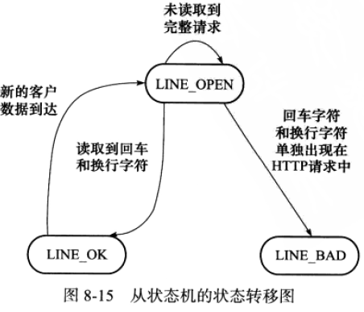

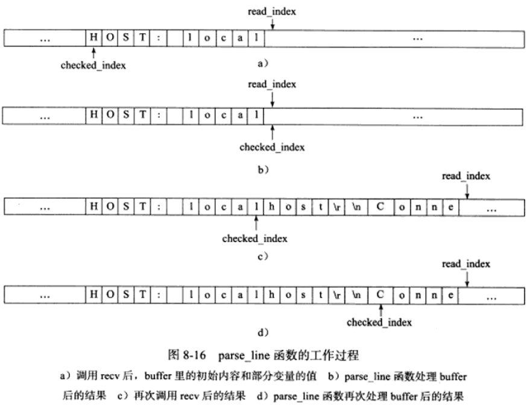

## 7.提供服务器性能的其他建议

### 1.池

因为服务器硬件资源充裕所以就要以空间换时间，这就是池的概念。池是一组资源的集合，这组资源在服务器启动之初就被创建好并初始化，这叫静态资源分配。当客户请求时需要的资源就直接从池中获取，不用动态分配，避免了服务器对内核的频繁访问。

根据不同的资源类型，池分为：内存池，进程池，线程池，连接池等。

内存池用于socket的接收缓存和发送缓存。进程池和线程池都是并发编程的常用伎俩，当我们需要一个工作时直接从池里取得一个执行实体就不用动态fork和pthread_create了。连接池用于服务器或机群的内部永久连接

### 2.数据复制

高性能服务器应该避免不必要的数据复制，尤其是数据复制发生在用户代码和内核之间的时候。另外，当两个工作进程要传递大量数据时，应该考虑使用共享内存来共享数据

### 3.上下文切换和锁

并发程序必须考虑上下文切换，即进程切换或线程切换导致的系统开销。每个客户都创建一个线程的服务器工作模型是不可取的，半同步/半异步模式是一个比较合理的解决方案，它允许一个线程同时处理多个客户连接。

另一个问题就是对共享资源的加锁保护。尽可能避免锁或者减小锁的粒度。

# 九、I/O复用

IO复用使得程序可以同时监听多个文件描述符。通常网络程序在以下情况要使用IO复用技术：

- 客户端要同时处理多个socket。比如本章的非阻塞connect技术
- 客户端要同时处理用户输入和网络连接。比如本章聊天室程序
- 服务器要同时监听socket和链接socket
- 服务器要同时处理TCP请求和UDP请求
- 服务器要同时监听多个端口，或者多个服务

## 1.select系统调用

用途：在一段指定时间内，监听用户感兴趣的文件描述符上的可读、可写和异常事件

### 1.select的API

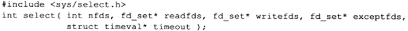

- nfds：指定被监听的文件描述符的总数，通常被设置成select监听的所有描述符中最大值+1，因为文件描述符从0开始计数。

- readfds，writefds和exceptfds参数分别指向可读可写和异常等事件对应的文件描述符的集合。

  - fd_set结构体是一个整型数组，每一位标记一个文件描述符。fd_set容纳的文件描述符的数量由FD_SETSIZE指定，这就限制了select能同时处理文件描述符的数量
    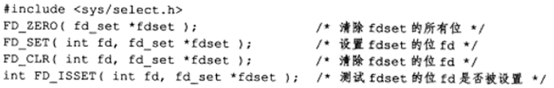

- timeout：用来设置select的超时时间。调用失败是timeout的值是不确定的。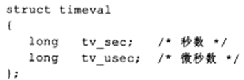

  结构体成员都传0表示select立即返回，timeout传NULL表示一直阻塞直到某个文件描述符就绪。

### 2.文件描述符就绪条件

网络编程中，下列情况socket可读：
	1.socket内核缓冲区的字节数大于或等于其低水位标记SO_RCVLOWAT，此时可以无阻塞的读
	2.socket通信的对方关闭连接，此时读操作返回0
	3.监听socket上有新的连接请求
	4.socket上有未处理的错误，此时用getsockopt来读取和清除错误

下列情况socket可写：
	1.socket内核发送缓冲区的可用字节数大于或等于低水位标记SO_SNDLOWAT，此时可以无阻塞的写
	2.socket的写操作被关闭
	3.socket使用非阻塞connect连接成功或者失败以后
	4.socket上有未处理的错误，此时用getsockopt来读取和清除错误

### 3.处理带外数据

```c
//同时处理普通数据和带外数据
#include <sys/types.h>
#include <sys/socket.h>
#include <netinet/in.h>
#include <arpa/inet.h>
#include <assert.h>
#include <stdio.h>
#include <unistd.h>
#include <errno.h>
#include <string.h>
#include <fcntl.h>
#include <stdlib.h>

int main( int argc, char* argv[] )
{
	if( argc <= 2 )
	{
		printf( "usage: %s ip_address port_number\n", basename( argv[0] ) );
		return 1;
	}
	const char* ip = argv[1];
	int port = atoi( argv[2] );
	printf( "ip is %s and port is %d\n", ip, port );

	int ret = 0;
    struct sockaddr_in address;
    bzero( &address, sizeof( address ) );
    address.sin_family = AF_INET;
    inet_pton( AF_INET, ip, &address.sin_addr );
    address.sin_port = htons( port );

	int listenfd = socket( PF_INET, SOCK_STREAM, 0 );
	assert( listenfd >= 0 );

    ret = bind( listenfd, ( struct sockaddr* )&address, sizeof( address ) );
	assert( ret != -1 );

	ret = listen( listenfd, 5 );
	assert( ret != -1 );

	struct sockaddr_in client_address;
    socklen_t client_addrlength = sizeof( client_address );
	int connfd = accept( listenfd, ( struct sockaddr* )&client_address, &client_addrlength );
	if ( connfd < 0 )
	{
		printf( "errno is: %d\n", errno );
		close( listenfd );
	}

	char remote_addr[INET_ADDRSTRLEN];
	printf( "connected with ip: %s and port: %d\n", inet_ntop( AF_INET, &client_address.sin_addr, remote_addr, INET_ADDRSTRLEN ), ntohs( client_address.sin_port ) );

	char buf[1024];
	fd_set read_fds;
	fd_set exception_fds;

	FD_ZERO(&read_fds);
	FD_ZERO(&exception_fds);

	int nReuseAddr = 1;		//设置socket选项，向普通数据一样读取带外数据
	setsockopt( connfd, SOL_SOCKET, SO_OOBINLINE, &nReuseAddr, sizeof( nReuseAddr ) );
	while( 1 )
	{
		memset( buf, '\0', sizeof( buf ) );
		/*每次调用select前都要重现在read_fds和exception_fds中设置connfd，因为事件发生后文件描述符集合被内核修改*/
		FD_SET( connfd, &read_fds );
		FD_SET( connfd, &exception_fds );

        ret = select( connfd + 1, &read_fds, NULL, &exception_fds, NULL );
		printf( "select one\n" );
        if ( ret < 0 )
        {
                printf( "selection failure\n" );
                break;
        }
		/*对于可读事件采用普通的recv来读取数据*/
        if ( FD_ISSET( connfd, &read_fds ) )
		{
        	ret = recv( connfd, buf, sizeof( buf )-1, 0 );
			if( ret <= 0 )
			{
				break;
			}
			printf( "get %d bytes of normal data: %s\n", ret, buf );
		}
		/*对于异常事件采用MSG_OOB标志的recv函数来读取带外数据*/
		else if( FD_ISSET( connfd, &exception_fds ) )
        {
        	ret = recv( connfd, buf, sizeof( buf )-1, MSG_OOB );
		if( ret <= 0 )
		{
			break;
		}
		printf( "get %d bytes of oob data: %s\n", ret, buf );
        }

	}

	close( connfd );
	close( listenfd );
	return 0;
}
```

## 2.poll系统调用

和select类似，在指定时间内轮询一定数量的文件描述符，测试其中是否有就绪。

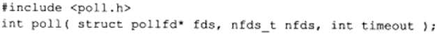

- fds是一个pollfd的结构体的数组，指定我们感兴趣的文件描述符发送可读、可写和异常事件
  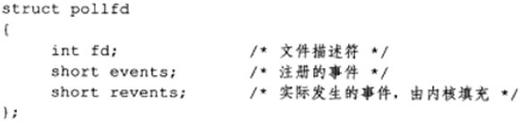

  - events告诉poll监听fd上的哪些事件
    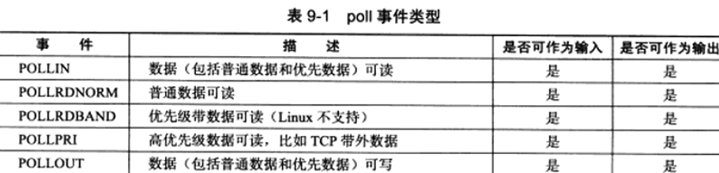

    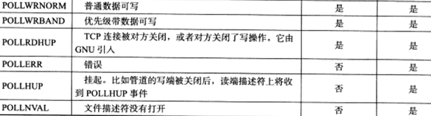

- nfd：指定被监听事件集合fds的大小
  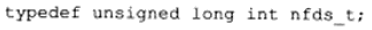
- timeout：指定poll的超时值，单位ms，=-1表示永久阻塞

## 3.epoll系列系统调用

### 1.内核事件表

epoll使用一组函数来完成任务而不是一个函数，epoll把用户关心的文件描述符上的事件放在内核里的一个事件表中，不像select和poll那样每次调用都重复传入文件描述符集或事件集，但epoll需要一个额外的文件名来表示内核中这个事件表。这个文件描述符有epoll_create创建：

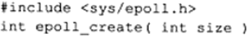

- size：并不起什么作用，只是给内核一个提示，他告诉事件表需要多大

下面的函数操作epoll的内核事件表：

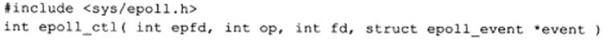

- fd：要操作的文件描述符

- op：指定操作类型

  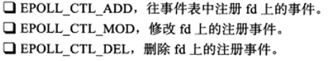

- event：指定事件，是epoll_event结构体指针类型，定义如下

  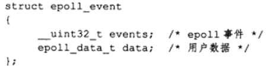

  - events：描述事件类型
  - 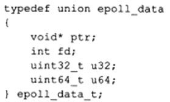

### 2.epoll_wait

在一段超时时间内等待一组文件描述符上的事件

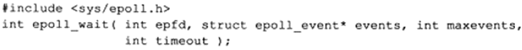

返回就绪的文件描述符的个数，失败返回-1并设置errno，如果检测到事件，就将所有就绪的事件从内核事件表（epfd）复制到第二个参数events指向的数组

```c
//poll和epoll在使用上的差别
/*如何索引poll返回的就绪文件描述符*/
int ret=poll(fds,MAX_EVENT_NUMBER,-1);
/*必须遍历所有已注册的文件描述符并且找到其中的就绪态*/
for(int i=0;i<MAX_EVENT_NUMBER;i++){
    if(fds[i].revents&POLLIN){
        int sockfd=fd[i].fd;
    }
}
/*如何索引epoll返回的就绪文件描述符*/
int ret=epoll_wait(epollfd,events,MAX_EVENT_NUMBER,-1);
/*仅遍历就绪的ret个文件描述符*/
for(int i=0;i<ret;i++){
    int sockfd=events[i].data.fd;
    /*sockfd肯定就绪，直接处理*/
}
```

### 3.LT和ET模式

epoll对文件描述符的操作有两种模式：LT水平触发，ET边沿触发，LT默认。当向epoll内核事件表中注册一个文件描述符上的EPOLLET事件时，epoll将以ET模式来操作该文件描述符。ET模式很大程度上降低了同一个epoll事件被重复触发的次数，所以效率高。

**水平：**如果文件描述符已经就绪可以非阻塞的执行IO操作了,此时会触发通知.允许在任意时刻重复检测IO的状态.select,poll就属于水平触发。只有在高电平或者低电平时才触发。

**边缘：**如果文件描述符自上次状态改变后有新的IO活动到来,此时会触发通知.在收到一个IO事件通知后要尽可能多的执行IO操作,因为如果在一次通知中没有执行完IO那么就需要等到下一次新的IO活动到来才能获取到就绪的描述符.信号驱动式IO就属于边缘触发。只有在电平发生变化时才触发。

```c
#include <sys/types.h>
#include <sys/socket.h>
#include <netinet/in.h>
#include <arpa/inet.h>
#include <assert.h>
#include <stdio.h>
#include <unistd.h>
#include <errno.h>
#include <string.h>
#include <fcntl.h>
#include <stdlib.h>
#include <sys/epoll.h>
#include <pthread.h>

#define MAX_EVENT_NUMBER 1024
#define BUFFER_SIZE 10

/*将文件描述符设置为非阻塞的*/
int setnonblocking( int fd )
{
    int old_option = fcntl( fd, F_GETFL );
    int new_option = old_option | O_NONBLOCK;
    fcntl( fd, F_SETFL, new_option );
    return old_option;
}

/*将文件描述符fd上的EPOLLIN注册到epollfd指示的epoll内核事件表中，参数enable_et指定是否对fd启用ET模式*/
void addfd( int epollfd, int fd, bool enable_et )
{
    epoll_event event;
    event.data.fd = fd;
    event.events = EPOLLIN;
    if( enable_et )
    {
        event.events |= EPOLLET;
    }
    epoll_ctl( epollfd, EPOLL_CTL_ADD, fd, &event );
    setnonblocking( fd );
}

/*LT模式的工作流程*/
void lt( epoll_event* events, int number, int epollfd, int listenfd )
{
    char buf[ BUFFER_SIZE ];
    for ( int i = 0; i < number; i++ )
    {
        int sockfd = events[i].data.fd;
        if ( sockfd == listenfd )
        {
            struct sockaddr_in client_address;
            socklen_t client_addrlength = sizeof( client_address );
            int connfd = accept( listenfd, ( struct sockaddr* )&client_address, &client_addrlength );
            addfd( epollfd, connfd, false );
        }
		/*只要读缓冲区还有未读出的数据，这段代码就被触发*/
        else if ( events[i].events & EPOLLIN )
        {
            printf( "event trigger once\n" );
            memset( buf, '\0', BUFFER_SIZE );
            int ret = recv( sockfd, buf, BUFFER_SIZE-1, 0 );
            if( ret <= 0 )
            {
                close( sockfd );
                continue;
            }
            printf( "get %d bytes of content: %s\n", ret, buf );
        }
        else
        {
            printf( "something else happened \n" );
        }
    }
}

/*ET模式的工作流程*/
void et( epoll_event* events, int number, int epollfd, int listenfd )
{
    char buf[ BUFFER_SIZE ];
    for ( int i = 0; i < number; i++ )
    {
        int sockfd = events[i].data.fd;
        if ( sockfd == listenfd )
        {
            struct sockaddr_in client_address;
            socklen_t client_addrlength = sizeof( client_address );
            int connfd = accept( listenfd, ( struct sockaddr* )&client_address, &client_addrlength );
            addfd( epollfd, connfd, true );
        }
		/*这段代码不会重复触发，所以我们循环读取数据，以确保把socket读缓冲区中的所有数据读出*/
        else if ( events[i].events & EPOLLIN )
        {
            printf( "event trigger once\n" );
            while( 1 )
            {
                memset( buf, '\0', BUFFER_SIZE );
                int ret = recv( sockfd, buf, BUFFER_SIZE-1, 0 );
                if( ret < 0 )
                {
					/*对于非阻塞IO，下面条件成立表示数据全部读取完毕*/
                    if( ( errno == EAGAIN ) || ( errno == EWOULDBLOCK ) )
                    {
                        printf( "read later\n" );
                        break;
                    }
                    close( sockfd );
                    break;
                }
                else if( ret == 0 )
                {
                    close( sockfd );
                }
                else
                {
                    printf( "get %d bytes of content: %s\n", ret, buf );
                }
            }
        }
        else
        {
            printf( "something else happened \n" );
        }
    }
}

int main( int argc, char* argv[] )
{
    if( argc <= 2 )
    {
        printf( "usage: %s ip_address port_number\n", basename( argv[0] ) );
        return 1;
    }
    const char* ip = argv[1];
    int port = atoi( argv[2] );

    int ret = 0;
    struct sockaddr_in address;
    bzero( &address, sizeof( address ) );
    address.sin_family = AF_INET;
    inet_pton( AF_INET, ip, &address.sin_addr );
    address.sin_port = htons( port );

    int listenfd = socket( PF_INET, SOCK_STREAM, 0 );
    assert( listenfd >= 0 );

    ret = bind( listenfd, ( struct sockaddr* )&address, sizeof( address ) );
    assert( ret != -1 );

    ret = listen( listenfd, 5 );
    assert( ret != -1 );

    epoll_event events[ MAX_EVENT_NUMBER ];
    int epollfd = epoll_create( 5 );
    assert( epollfd != -1 );
    addfd( epollfd, listenfd, true );

    while( 1 )
    {
        int ret = epoll_wait( epollfd, events, MAX_EVENT_NUMBER, -1 );
        if ( ret < 0 )
        {
            printf( "epoll failure\n" );
            break;
        }
    
        lt( events, ret, epollfd, listenfd );
        //et( events, ret, epollfd, listenfd );
    }

    close( listenfd );
    return 0;
}
```

### 4.EPOLLONESHOT事件

两个线程同时操作一个socket不是我们期望的，我们期望一个socket的连接在任意时刻都只被一个线程处理，可以使用EPOLLONESHOT事件实现。对于注册了该事件的文件描述符，操作系统最多触发其上一个可读可写或异常事件，且只触发一次。

```c
//EPOLLONESHOT事件的使用
#include <sys/types.h>
#include <sys/socket.h>
#include <netinet/in.h>
#include <arpa/inet.h>
#include <assert.h>
#include <stdio.h>
#include <unistd.h>
#include <errno.h>
#include <string.h>
#include <fcntl.h>
#include <stdlib.h>
#include <sys/epoll.h>
#include <pthread.h>

#define MAX_EVENT_NUMBER 1024
#define BUFFER_SIZE 1024
struct fds
{
   int epollfd;
   int sockfd;
};

int setnonblocking( int fd )
{
    int old_option = fcntl( fd, F_GETFL );
    int new_option = old_option | O_NONBLOCK;
    fcntl( fd, F_SETFL, new_option );
    return old_option;
}

/*将fd上的EPOLLIN和EPOLLET事件注册到epollfd指示的epoll内核事件表中，
参数oneshot指定是否注册fd上的EPOLLONESHOT事件*/
void addfd( int epollfd, int fd, bool oneshot )
{
    epoll_event event;
    event.data.fd = fd;
    event.events = EPOLLIN | EPOLLET;
    if( oneshot )
    {
        event.events |= EPOLLONESHOT;
    }
    epoll_ctl( epollfd, EPOLL_CTL_ADD, fd, &event );
    setnonblocking( fd );
}

/*重置fd上的事件，让以后的线程可以处理这个socket，
这样以后尽管fd上的EPOLLONESHOT事件被注册，但是操作系统
仍会触发fd上的EPOLLIN事件，且只触发一次*/
void reset_oneshot( int epollfd, int fd )
{
    epoll_event event;
    event.data.fd = fd;
    event.events = EPOLLIN | EPOLLET | EPOLLONESHOT;
    epoll_ctl( epollfd, EPOLL_CTL_MOD, fd, &event );
}
/*工作线程*/
void* worker( void* arg )
{
    int sockfd = ( (fds*)arg )->sockfd;
    int epollfd = ( (fds*)arg )->epollfd;
    printf( "start new thread to receive data on fd: %d\n", sockfd );
    char buf[ BUFFER_SIZE ];
    memset( buf, '\0', BUFFER_SIZE );
	/*循环读取socketfd上的数据，直到遇到EAGAIN错误*/
    while( 1 )
    {
        int ret = recv( sockfd, buf, BUFFER_SIZE-1, 0 );
        if( ret == 0 )
        {
            close( sockfd );
            printf( "foreiner closed the connection\n" );
            break;
        }
        else if( ret < 0 )
        {
            if( errno == EAGAIN )
            {
                reset_oneshot( epollfd, sockfd );	//重置
                printf( "read later\n" );
                break;
            }
        }
        else
        {
            printf( "get content: %s\n", buf );
            sleep( 5 );
        }
    }
    printf( "end thread receiving data on fd: %d\n", sockfd );
}

int main( int argc, char* argv[] )
{
    if( argc <= 2 )
    {
        printf( "usage: %s ip_address port_number\n", basename( argv[0] ) );
        return 1;
    }
    const char* ip = argv[1];
    int port = atoi( argv[2] );

    int ret = 0;
    struct sockaddr_in address;
    bzero( &address, sizeof( address ) );
    address.sin_family = AF_INET;
    inet_pton( AF_INET, ip, &address.sin_addr );
    address.sin_port = htons( port );

    int listenfd = socket( PF_INET, SOCK_STREAM, 0 );
    assert( listenfd >= 0 );

    ret = bind( listenfd, ( struct sockaddr* )&address, sizeof( address ) );
    assert( ret != -1 );

    ret = listen( listenfd, 5 );
    assert( ret != -1 );

    epoll_event events[ MAX_EVENT_NUMBER ];
    int epollfd = epoll_create( 5 );
    assert( epollfd != -1 );
    addfd( epollfd, listenfd, false );

    while( 1 )
    {
        int ret = epoll_wait( epollfd, events, MAX_EVENT_NUMBER, -1 );
        if ( ret < 0 )
        {
            printf( "epoll failure\n" );
            break;
        }
    
        for ( int i = 0; i < ret; i++ )
        {
            int sockfd = events[i].data.fd;
            if ( sockfd == listenfd )
            {
                struct sockaddr_in client_address;
                socklen_t client_addrlength = sizeof( client_address );
                int connfd = accept( listenfd, ( struct sockaddr* )&client_address, &client_addrlength );
                addfd( epollfd, connfd, true );
            }
            else if ( events[i].events & EPOLLIN )
            {
                pthread_t thread;
                fds fds_for_new_worker;
                fds_for_new_worker.epollfd = epollfd;
                fds_for_new_worker.sockfd = sockfd;
                pthread_create( &thread, NULL, worker, ( void* )&fds_for_new_worker );
            }
            else
            {
                printf( "something else happened \n" );
            }
        }
    }

    close( listenfd );
    return 0;
}
```

## 4.三组IO复用函数的比较

**select**：它的参数类型fd_set没有将文件描述符和事件绑定，仅仅是一个文件描述符集合，因此select需要提供3个这种类型的参数来分别传入和输出可读、可写和异常等事件。这使得select不能处理更多类型的事件，另外由于内核对fd_set的在线修改，程序下次调用不得不重置3个fd_set集合。

**poll**：把文件描述符和事件都定义其中，任何事件都统一处理，无需重置pollfd，并且内核每次修改的是pollfd结构体的revents成员，而events成员保持不变，因此下次调用poll时程序无需重置pollfd类型的事件集参数，但是和select一样都返回整个用户注册的事件集合。

**epoll**：在内核中维护一张事件表，无需从用户空间读入这些事件，无需反复从用户空间读取这些事件

还有select和poll支持低效LT模式，并且epoll还支持EPOLLONESHOT事件。select和epoll采用轮询的方式扫描整个文件描述符集合，并将就绪的文件描述符返回用户程序，而epoll_wait采用回调的方式，内核检测到就绪事件就会触发回调函数，回调函数把文件描述符对应的时间插入内核就绪事件队列。epoll_wait适用于连接数量多，但是连接活动少的情况。

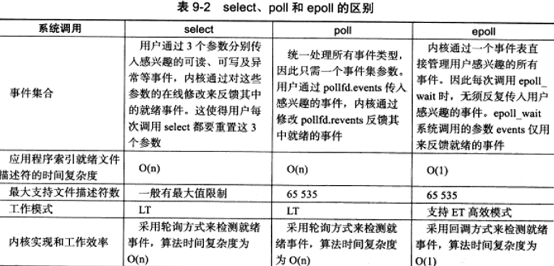

## 5.IO复用的高级应用一：非阻塞connect

connect出错时的一种errno值：EINPROGRESS。是对非阻塞的socket调用connect而连接有没有立即建立时产生的。

```c
//非阻塞connect的一种实现
#include <sys/types.h>
#include <sys/socket.h>
#include <netinet/in.h>
#include <arpa/inet.h>
#include <stdlib.h>
#include <assert.h>
#include <stdio.h>
#include <time.h>
#include <errno.h>
#include <fcntl.h>
#include <sys/ioctl.h>
#include <unistd.h>
#include <string.h>

#define BUFFER_SIZE 1023

int setnonblocking( int fd )
{
    int old_option = fcntl( fd, F_GETFL );
    int new_option = old_option | O_NONBLOCK;
    fcntl( fd, F_SETFL, new_option );
    return old_option;
}

/*超时连接函数，成功就返回处于连接状态的socket*/
int unblock_connect( const char* ip, int port, int time )
{
    int ret = 0;
    struct sockaddr_in address;
    bzero( &address, sizeof( address ) );
    address.sin_family = AF_INET;
    inet_pton( AF_INET, ip, &address.sin_addr );
    address.sin_port = htons( port );

    int sockfd = socket( PF_INET, SOCK_STREAM, 0 );
    int fdopt = setnonblocking( sockfd );			//设置非阻塞
    ret = connect( sockfd, ( struct sockaddr* )&address, sizeof( address ) );
    if ( ret == 0 )
    {
        printf( "connect with server immediately\n" );
        fcntl( sockfd, F_SETFL, fdopt );	//如果连接成功则恢复sockfd的属性并且立即返回
        return sockfd;
    }
	//如果连接没有立即建立，那么只有多有当errno是EINPROGRESS的时候表示连接还在进行，否则出错返回
    else if ( errno != EINPROGRESS )
    {
        printf( "unblock connect not support\n" );
        return -1;
    }
	//错误是EINPROGRESS，表示连接不能马上建立成功
    fd_set readfds;
    fd_set writefds;
    struct timeval timeout;

    FD_ZERO( &readfds );
    FD_SET( sockfd, &writefds );

    timeout.tv_sec = time;
    timeout.tv_usec = 0;

    ret = select( sockfd + 1, NULL, &writefds, NULL, &timeout );
    if ( ret <= 0 )
    {	//select超时出错立即返回
        printf( "connection time out\n" );
        close( sockfd );
        return -1;
    }

    if ( ! FD_ISSET( sockfd, &writefds  ) )
    {
        printf( "no events on sockfd found\n" );
        close( sockfd );
        return -1;
    }

    int error = 0;
    socklen_t length = sizeof( error );
	//使用getsocktopt来获取并清除sockfd上的错误
    if( getsockopt( sockfd, SOL_SOCKET, SO_ERROR, &error, &length ) < 0 )
    {
        printf( "get socket option failed\n" );
        close( sockfd );
        return -1;
    }
	/*错误号不为0表示连接出错*/
    if( error != 0 )
    {
        printf( "connection failed after select with the error: %d \n", error );
        close( sockfd );
        return -1;
    }
    //连接成功
    printf( "connection ready after select with the socket: %d \n", sockfd );
    fcntl( sockfd, F_SETFL, fdopt );
    return sockfd;
}

int main( int argc, char* argv[] )
{
    if( argc <= 2 )
    {
        printf( "usage: %s ip_address port_number\n", basename( argv[0] ) );
        return 1;
    }
    const char* ip = argv[1];
    int port = atoi( argv[2] );

    int sockfd = unblock_connect( ip, port, 10 );
    if ( sockfd < 0 )
    {
        return 1;
    }
    shutdown( sockfd, SHUT_WR );
    sleep( 200 );
    printf( "send data out\n" );
    send( sockfd, "abc", 3, 0 );
    //sleep( 600 );
    return 0;
}
```

存在移植性问题，非阻塞的socket会导致connect始终失败。

## 6.IO复用的高级应用二：聊天室程序

阐释IO复用技术如何同时来处理网络连接和用户输入，该聊天室会让所有用户同时在线群聊

### 1.客户端

使用poll同时监听用户输入和网络连接，并且利用splice函数将用户输入内容重定向到网络连接来发送，从而实现零拷贝。

功能：从标准输入读入数据发送到服务器，向标准输出打印服务器发送给他的数据

```c
//聊天室客户端程序
#define _GNU_SOURCE 1
#include <sys/types.h>
#include <sys/socket.h>
#include <netinet/in.h>
#include <arpa/inet.h>
#include <assert.h>
#include <stdio.h>
#include <unistd.h>
#include <string.h>
#include <stdlib.h>
#include <poll.h>
#include <fcntl.h>

#define BUFFER_SIZE 64

int main( int argc, char* argv[] )
{
    if( argc <= 2 )
    {
        printf( "usage: %s ip_address port_number\n", basename( argv[0] ) );
        return 1;
    }
    const char* ip = argv[1];
    int port = atoi( argv[2] );

    struct sockaddr_in server_address;
    bzero( &server_address, sizeof( server_address ) );
    server_address.sin_family = AF_INET;
    inet_pton( AF_INET, ip, &server_address.sin_addr );
    server_address.sin_port = htons( port );

    int sockfd = socket( PF_INET, SOCK_STREAM, 0 );
    assert( sockfd >= 0 );
    if ( connect( sockfd, ( struct sockaddr* )&server_address, sizeof( server_address ) ) < 0 )
    {
        printf( "connection failed\n" );
        close( sockfd );
        return 1;
    }

    pollfd fds[2];
	/*注册文件描述符0和文件描述符sockfd上的可读事件*/
    fds[0].fd = 0;
    fds[0].events = POLLIN;		//标准输入有输入时，poll会返回
    fds[0].revents = 0;
    fds[1].fd = sockfd;
    fds[1].events = POLLIN | POLLRDHUP;		//socket有数据到达|TCP连接被对方关闭
    fds[1].revents = 0;
    char read_buf[BUFFER_SIZE];
    int pipefd[2];
    int ret = pipe( pipefd );
    assert( ret != -1 );

    while( 1 )
    {
        ret = poll( fds, 2, -1 );
        if( ret < 0 )
        {
            printf( "poll failure\n" );
            break;
        }

        if( fds[1].revents & POLLRDHUP )
        {
            printf( "server close the connection\n" );
            break;
        }
        else if( fds[1].revents & POLLIN )
        {
            memset( read_buf, '\0', BUFFER_SIZE );
			recv(fds[1].fd, read_buf, BUFFER_SIZE - 1, 0);//服务器端有数据发送来
            printf( "%s\n", read_buf );
        }

        if( fds[0].revents & POLLIN )
        {
			/*使用solice将用户输入的数据之间写到sockfd上，零拷贝*/
            ret = splice( 0, NULL, pipefd[1], NULL, 32768, SPLICE_F_MORE | SPLICE_F_MOVE );
            ret = splice( pipefd[0], NULL, sockfd, NULL, 32768, SPLICE_F_MORE | SPLICE_F_MOVE );
        }
    }
    
    close( sockfd );
    return 0;
}
```

### 2.服务器

使用poll同时管理socket和链接socket，并且牺牲空间换时间。

```c
//聊天室服务器程序
#define _GNU_SOURCE 1
#include <sys/types.h>
#include <sys/socket.h>
#include <netinet/in.h>
#include <arpa/inet.h>
#include <assert.h>
#include <stdio.h>
#include <unistd.h>
#include <errno.h>
#include <string.h>
#include <fcntl.h>
#include <stdlib.h>
#include <poll.h>

#define USER_LIMIT 5		//用户最大数量
#define BUFFER_SIZE 64		//读写缓冲区大小
#define FD_LIMIT 65535		//文件描述符的数量限制
/*客户数据：客户端socket地址，待写到客户端的数据的位置，从客户端读入的数据*/
struct client_data
{
    sockaddr_in address;
    char* write_buf;
    char buf[ BUFFER_SIZE ];
};

int setnonblocking( int fd )
{
    int old_option = fcntl( fd, F_GETFL );
    int new_option = old_option | O_NONBLOCK;
    fcntl( fd, F_SETFL, new_option );
    return old_option;
}

int main( int argc, char* argv[] )
{
    if( argc <= 2 )
    {
        printf( "usage: %s ip_address port_number\n", basename( argv[0] ) );
        return 1;
    }
    const char* ip = argv[1];
    int port = atoi( argv[2] );

    int ret = 0;
    struct sockaddr_in address;
    bzero( &address, sizeof( address ) );
    address.sin_family = AF_INET;
    inet_pton( AF_INET, ip, &address.sin_addr );
    address.sin_port = htons( port );

    int listenfd = socket( PF_INET, SOCK_STREAM, 0 );
    assert( listenfd >= 0 );

    ret = bind( listenfd, ( struct sockaddr* )&address, sizeof( address ) );
    assert( ret != -1 );

    ret = listen( listenfd, 5 );
    assert( ret != -1 );

	/*每个可能的socket连接都可以获得一个这样的对象，并且socket的值可以直接用来索引*/
    client_data* users = new client_data[FD_LIMIT];
    pollfd fds[USER_LIMIT+1];
    int user_counter = 0;
    for( int i = 1; i <= USER_LIMIT; ++i )
    {
        fds[i].fd = -1;
        fds[i].events = 0;
    }
    fds[0].fd = listenfd;
    fds[0].events = POLLIN | POLLERR;
    fds[0].revents = 0;

    while( 1 )
    {
        ret = poll( fds, user_counter+1, -1 );		//fds监听的事件会不断添加，初始只有listenfd
        if ( ret < 0 )
        {
            printf( "poll failure\n" );
            break;
        }
    
        for( int i = 0; i < user_counter+1; ++i )
        {
            if( ( fds[i].fd == listenfd ) && ( fds[i].revents & POLLIN ) )	//有新的客户连接
            {
                struct sockaddr_in client_address;
                socklen_t client_addrlength = sizeof( client_address );
                int connfd = accept( listenfd, ( struct sockaddr* )&client_address, &client_addrlength );
                if ( connfd < 0 )
                {
                    printf( "errno is: %d\n", errno );
                    continue;
                }
                if( user_counter >= USER_LIMIT )
                {
                    const char* info = "too many users\n";
                    printf( "%s", info );
                    send( connfd, info, strlen( info ), 0 );
                    close( connfd );		//如果请求太多就关闭新到的连接
                    continue;
                }
                user_counter++;
                users[connfd].address = client_address;
                setnonblocking( connfd );
                fds[user_counter].fd = connfd;
                fds[user_counter].events = POLLIN | POLLRDHUP | POLLERR;
                fds[user_counter].revents = 0;
                printf( "comes a new user, now have %d users\n", user_counter );
            }
            else if( fds[i].revents & POLLERR )
            {
                printf( "get an error from %d\n", fds[i].fd );
                char errors[ 100 ];
                memset( errors, '\0', 100 );
                socklen_t length = sizeof( errors );
                if( getsockopt( fds[i].fd, SOL_SOCKET, SO_ERROR, &errors, &length ) < 0 )
                {
                    printf( "get socket option failed\n" );
                }
                continue;
            }
            else if( fds[i].revents & POLLRDHUP )		//某个客户端关闭
            {
                users[fds[i].fd] = users[fds[user_counter].fd];
                close( fds[i].fd );
                fds[i] = fds[user_counter];
                i--;
                user_counter--;
                printf( "a client left\n" );
            }
            else if( fds[i].revents & POLLIN )
            {
                int connfd = fds[i].fd;
                memset( users[connfd].buf, '\0', BUFFER_SIZE );
                ret = recv( connfd, users[connfd].buf, BUFFER_SIZE-1, 0 );
                printf( "get %d bytes of client data %s from %d\n", ret, users[connfd].buf, connfd );
                if( ret < 0 )
                {
                    if( errno != EAGAIN )	//因为非阻塞连续读可能会读不到数据，关闭连接
                    {
                        close( connfd );
                        users[fds[i].fd] = users[fds[user_counter].fd];
                        fds[i] = fds[user_counter];
                        i--;
                        user_counter--;
                    }
                }
                else if( ret == 0 )
                {
                    printf( "code should not come to here\n" );
                }
                else           //接收到客户数据，则通知其他socket连接准备写数据
                {
                    for( int j = 1; j <= user_counter; ++j )
                    {
                        if( fds[j].fd == connfd )
                        {
                            continue;
                        }
                        
                        fds[j].events |= ~POLLIN;
                        fds[j].events |= POLLOUT;
                        users[fds[j].fd].write_buf = users[connfd].buf;
                    }
                }
            }
            else if( fds[i].revents & POLLOUT )
            {
                int connfd = fds[i].fd;
                if( ! users[connfd].write_buf )
                {
                    continue;
                }
                ret = send( connfd, users[connfd].write_buf, strlen( users[connfd].write_buf ), 0 );
                users[connfd].write_buf = NULL;
                fds[i].events |= ~POLLOUT;
                fds[i].events |= POLLIN;
            }
        }
    }

    delete [] users;
    close( listenfd );
    return 0;
}
```

## 7.IO复用的高级应用三：同时处理TCP和UDP服务

超级服务inetd的调试服务adbd的可以监听多个端口，一个socket只能和一个socket绑定，要监听多个socket就要创建多个socket，并且绑定到多个端口上。

```c
//同时处理TCP请求和UDP请求的回射服务器
#include <sys/types.h>
#include <sys/socket.h>
#include <netinet/in.h>
#include <arpa/inet.h>
#include <assert.h>
#include <stdio.h>
#include <unistd.h>
#include <errno.h>
#include <string.h>
#include <fcntl.h>
#include <stdlib.h>
#include <sys/epoll.h>
#include <pthread.h>

#define MAX_EVENT_NUMBER 1024
#define TCP_BUFFER_SIZE 512
#define UDP_BUFFER_SIZE 1024

int setnonblocking( int fd )
{
    int old_option = fcntl( fd, F_GETFL );
    int new_option = old_option | O_NONBLOCK;
    fcntl( fd, F_SETFL, new_option );
    return old_option;
}

void addfd( int epollfd, int fd )
{
    epoll_event event;
    event.data.fd = fd;
    //event.events = EPOLLIN | EPOLLET;
    event.events = EPOLLIN;				//设置要监听什么事件
    epoll_ctl( epollfd, EPOLL_CTL_ADD, fd, &event );
    setnonblocking( fd );				//设置为非阻塞，立马返回
}

int main( int argc, char* argv[] )
{
    if( argc <= 2 )
    {
        printf( "usage: %s ip_address port_number\n", basename( argv[0] ) );
        return 1;
    }
    const char* ip = argv[1];
    int port = atoi( argv[2] );

    int ret = 0;
    struct sockaddr_in address;
    bzero( &address, sizeof( address ) );
    address.sin_family = AF_INET;
    inet_pton( AF_INET, ip, &address.sin_addr );
    address.sin_port = htons( port );

    int listenfd = socket( PF_INET, SOCK_STREAM, 0 );
    assert( listenfd >= 0 );

    ret = bind( listenfd, ( struct sockaddr* )&address, sizeof( address ) );	//监听TCP
    assert( ret != -1 );

    ret = listen( listenfd, 5 );
    assert( ret != -1 );

    bzero( &address, sizeof( address ) );
    address.sin_family = AF_INET;
    inet_pton( AF_INET, ip, &address.sin_addr );
    address.sin_port = htons( port );
    int udpfd = socket( PF_INET, SOCK_DGRAM, 0 );
    assert( udpfd >= 0 );

    ret = bind( udpfd, ( struct sockaddr* )&address, sizeof( address ) );		//监听UDP
    assert( ret != -1 );

    epoll_event events[ MAX_EVENT_NUMBER ];
    int epollfd = epoll_create( 5 );
    assert( epollfd != -1 );
    addfd( epollfd, listenfd );	//添加到树上
    addfd( epollfd, udpfd );

    while( 1 )
    {
        int number = epoll_wait( epollfd, events, MAX_EVENT_NUMBER, -1 );
        if ( number < 0 )
        {
            printf( "epoll failure\n" );
            break;
        }
    
        for ( int i = 0; i < number; i++ )		//挨个遍历监听到的事件
        {
            int sockfd = events[i].data.fd;
            if ( sockfd == listenfd )			//是tcp的套接字
            {
                struct sockaddr_in client_address;
                socklen_t client_addrlength = sizeof( client_address );
                int connfd = accept( listenfd, ( struct sockaddr* )&client_address, &client_addrlength );
                addfd( epollfd, connfd );
            }
            else if ( sockfd == udpfd )			//是udp的套接字,有新的udp连接请求
            {
                char buf[ UDP_BUFFER_SIZE ];
                memset( buf, '\0', UDP_BUFFER_SIZE );
                struct sockaddr_in client_address;
                socklen_t client_addrlength = sizeof( client_address );

                ret = recvfrom( udpfd, buf, UDP_BUFFER_SIZE-1, 0, ( struct sockaddr* )&client_address, &client_addrlength );
                if( ret > 0 )
                {
                    sendto( udpfd, buf, UDP_BUFFER_SIZE-1, 0, ( struct sockaddr* )&client_address, client_addrlength );
                }
            }
            else if ( events[i].events & EPOLLIN )	
            {
                char buf[ TCP_BUFFER_SIZE ];
                while( 1 )
                {
                    memset( buf, '\0', TCP_BUFFER_SIZE );
                    ret = recv( sockfd, buf, TCP_BUFFER_SIZE-1, 0 );
                    if( ret < 0 )
                    {
                        if( ( errno == EAGAIN ) || ( errno == EWOULDBLOCK ) )
                        {
                            break;
                        }
                        close( sockfd );
                        break;
                    }
                    else if( ret == 0 )
                    {
                        close( sockfd );
                    }
                    else
                    {
                        send( sockfd, buf, ret, 0 );
                    }
                }
            }
            else
            {
                printf( "something else happened \n" );
            }
        }
    }

    close( listenfd );
    return 0;
}
```

## 8.超级服务xinetd

Linux因特网服务inetd是超级服务，它同时管理多个子服务，即监听多个端口。

### 1.xinetd配置文件

xinetd采用/etc/xinetd.conf主配置文件和/etc/xinetd.d目录下的子配置文件来管理所有服务。

**/etc/xinetd.d/telnet的典型内容如下：**

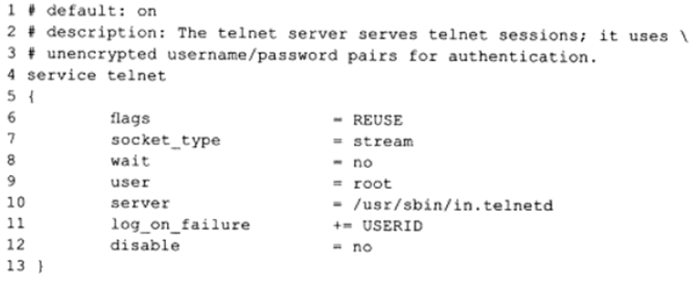

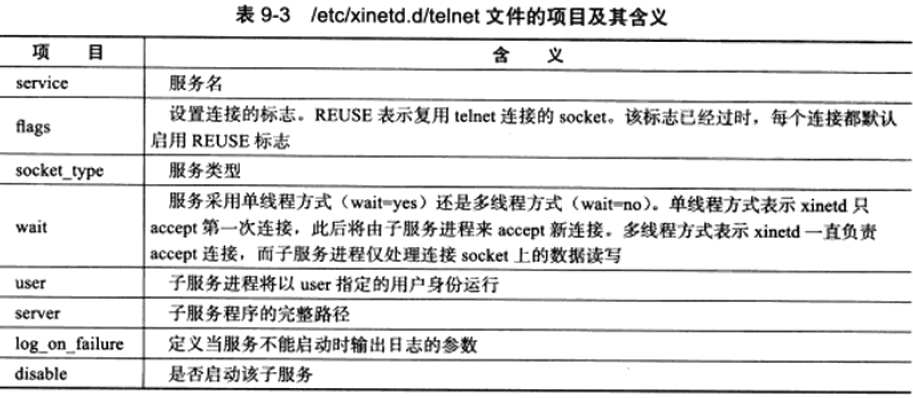

### 2.xinetd工作流程

其管理的子服务中有的是标准服务，如daytime日期服务，echo回射服务和discard丢弃服务，xinetd在内部直接处理这些服务。还有的子服务需要调用外部的服务器程序来处理，通过fork和exec函数来加载运行这些服务器程序，比如telnet，ftp这种类型的子服务。

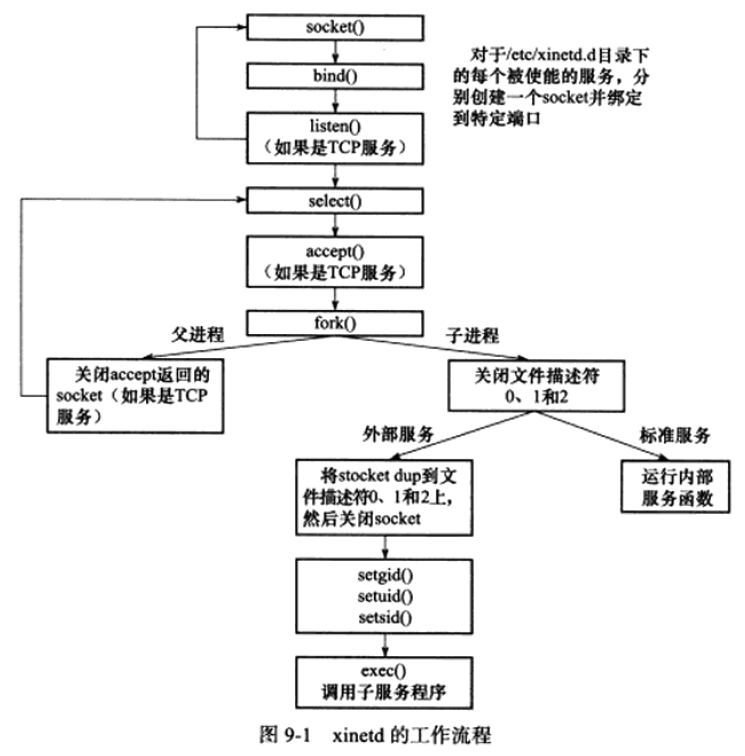

# 十、信号

信号可由如下条件产生：终端字符、系统异常、系统状态变化、运行kill命令或kill函数

## 1.信号概述

### 1.发送信号

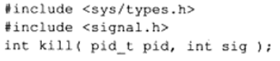

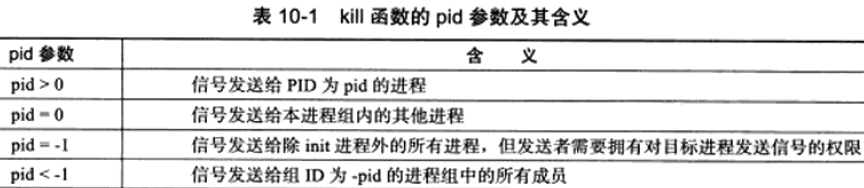

如果sig为0表示不发送任何信号，用sig设置为0可以用来检测目标进程或进程组是否存在，因为检查工作总在信号发送之前执行，但是这种检测是不可靠的，一方面进程PID的回绕，另一方面不是原子操作。

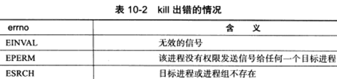

### 2.信号处理方式

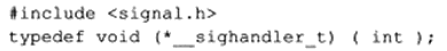

信号处理函数应该是可重入的，除了用户自定义信号处理函数外，bits/signum.h文件还定义了信号的两种处理方式：
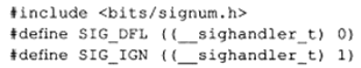

SIG_IGN：表示忽略目标信号			SIG_DFL：表示使用信号默认的处理方式（结束进程Term，忽略信号Ign，结束进程并生成核心转储文件Core，暂停进程Stop，继续进程Cont）

### 3.Linux信号

都定义在bits/signum.h中

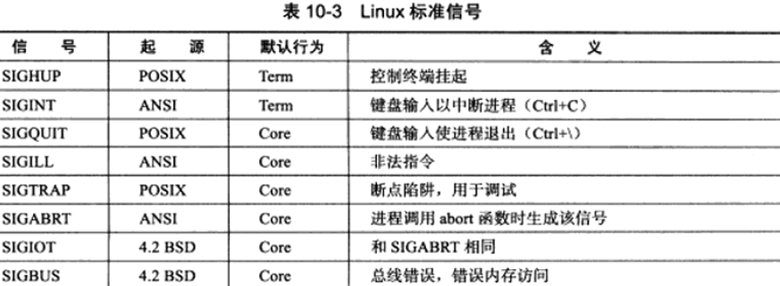

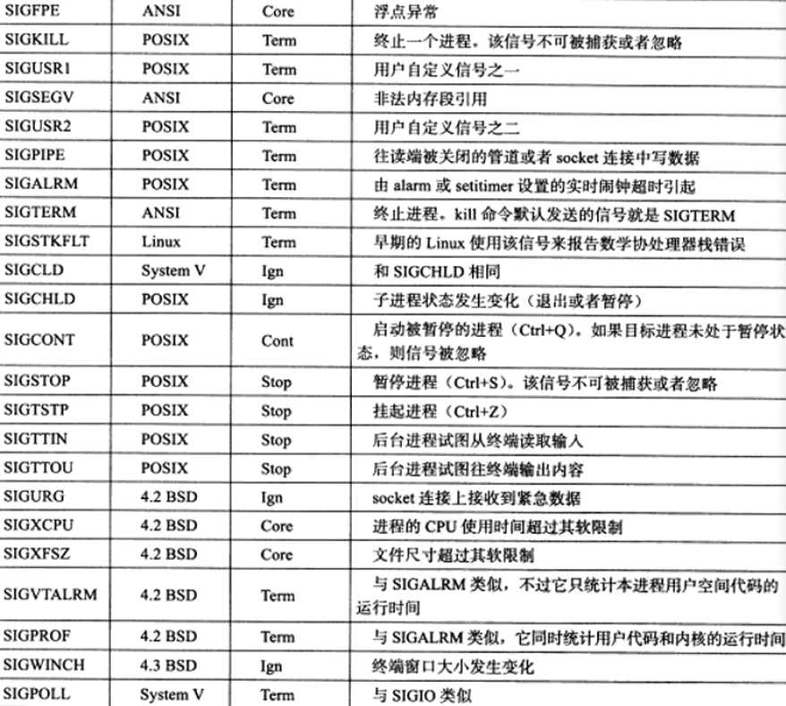
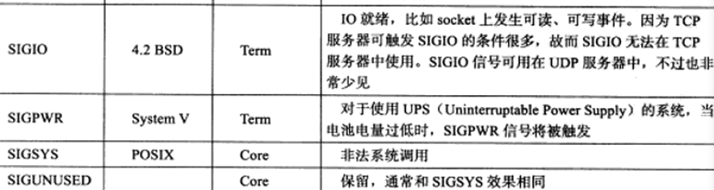

### 4.中断系统调用

程序在执行处于阻塞状态的系统调用时接收到信号，默认情况下系统调用会被中断，并且errno设置为EINTR，我们可以使用sigaction函数为信号设置SA_RESTART标志以自动重启被该信号中断的系统调用。

## 2.信号函数

### 1.signal

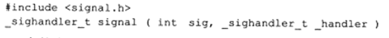

调用成功返回一个函数指针，也就是信号处理函数。

### 2.sigaction

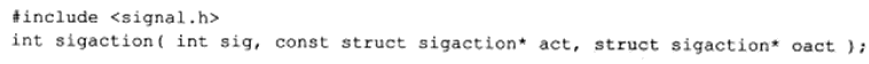

- oact：输出信号先前的处理方式（如果不为NULL）

  sigaction结构体定义如下：
  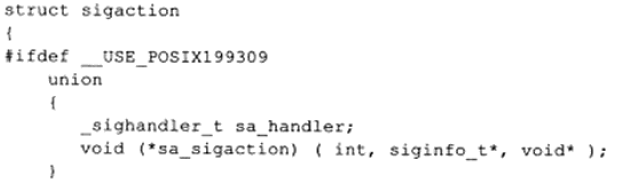
  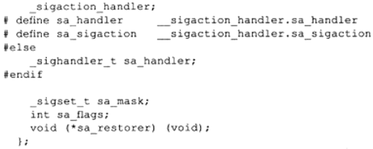

  - sa_handler：信号处理函数

  - sa_mask：设置进程的信号掩码，是信号集类型

  - sa_flag：设置接收到信号时的行为

    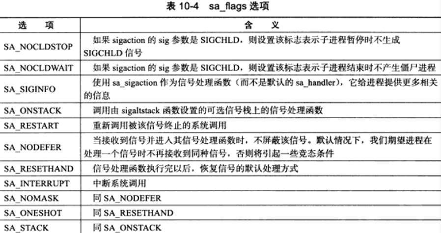

## 3.信号集

### 1.信号集函数

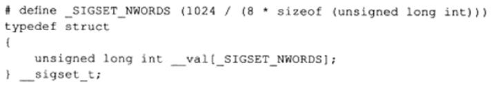

每个元素的每个位表示一个信号。

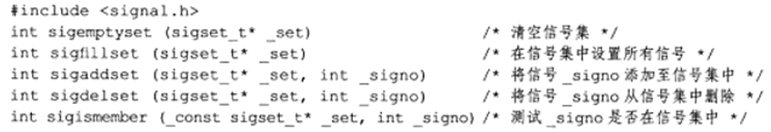

### 2.进程信号掩码

查看或者设置进程的信号掩码：

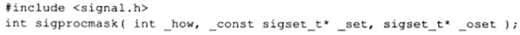

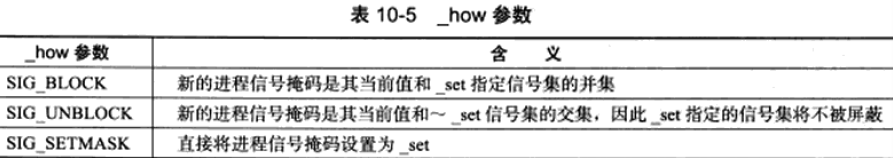

_set设置为NULL则进程信号掩码不变，但是可以返回\_oset.

### 3.被挂起的信号

如果给进程发送一个被屏蔽的信号，则操作系统将该信号设置为进程的一个被挂起的信号，如果取消屏蔽，进程就会立即接收到，如下函数获得进程当前被挂起的信号集：

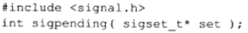

## 4.统一事件源

信号处理期间，系统不会再次出发它。主循环根据接收到的信号值执行目标信号对应的逻辑代码。

```c
//统一事件源
#include <sys/types.h>
#include <sys/socket.h>
#include <netinet/in.h>
#include <arpa/inet.h>
#include <assert.h>
#include <stdio.h>
#include <signal.h>
#include <unistd.h>
#include <errno.h>
#include <string.h>
#include <fcntl.h>
#include <stdlib.h>
#include <sys/epoll.h>
#include <pthread.h>

#define MAX_EVENT_NUMBER 1024
static int pipefd[2];

int setnonblocking( int fd )
{
    int old_option = fcntl( fd, F_GETFL );
    int new_option = old_option | O_NONBLOCK;
    fcntl( fd, F_SETFL, new_option );
    return old_option;
}

void addfd( int epollfd, int fd )
{
    epoll_event event;
    event.data.fd = fd;
    event.events = EPOLLIN | EPOLLET;
    epoll_ctl( epollfd, EPOLL_CTL_ADD, fd, &event );
    setnonblocking( fd );
}

void sig_handler( int sig )
{
	/*保留原来的errno，在函数最后恢复，以保证函数的可重入行*/
    int save_errno = errno;
    int msg = sig;
    send( pipefd[1], ( char* )&msg, 1, 0 );	//将信号值写入管道，通知主循环
    errno = save_errno;
}

/*设置信号的处理函数*/
void addsig( int sig )
{
    struct sigaction sa;
    memset( &sa, '\0', sizeof( sa ) );
    sa.sa_handler = sig_handler;	//设置sig信号对应handler
    sa.sa_flags |= SA_RESTART;		//重新调用被该信号终止的系统调用
    sigfillset( &sa.sa_mask );
    assert( sigaction( sig, &sa, NULL ) != -1 );
}

int main( int argc, char* argv[] )
{
    if( argc <= 2 )
    {
        printf( "usage: %s ip_address port_number\n", basename( argv[0] ) );
        return 1;
    }
    const char* ip = argv[1];
    int port = atoi( argv[2] );

    int ret = 0;
    struct sockaddr_in address;
    bzero( &address, sizeof( address ) );
    address.sin_family = AF_INET;
    inet_pton( AF_INET, ip, &address.sin_addr );
    address.sin_port = htons( port );

    int listenfd = socket( PF_INET, SOCK_STREAM, 0 );
    assert( listenfd >= 0 );

    //int nReuseAddr = 1;
    //setsockopt( listenfd, SOL_SOCKET, SO_REUSEADDR, &nReuseAddr, sizeof( nReuseAddr ) );
    ret = bind( listenfd, ( struct sockaddr* )&address, sizeof( address ) );
    if( ret == -1 )
    {
        printf( "errno is %d\n", errno );
        return 1;
    }
    //assert( ret != -1 );

    ret = listen( listenfd, 5 );
    assert( ret != -1 );

    epoll_event events[ MAX_EVENT_NUMBER ];
    int epollfd = epoll_create( 5 );
    assert( epollfd != -1 );
    addfd( epollfd, listenfd );

    ret = socketpair( PF_UNIX, SOCK_STREAM, 0, pipefd );
    assert( ret != -1 );
    setnonblocking( pipefd[1] );
    addfd( epollfd, pipefd[0] );

    // add all the interesting signals here
    addsig( SIGHUP );			//添加到信号处理集上
    addsig( SIGCHLD );
    addsig( SIGTERM );
    addsig( SIGINT );
    bool stop_server = false;

    while( !stop_server )
    {
        int number = epoll_wait( epollfd, events, MAX_EVENT_NUMBER, -1 );
        if ( ( number < 0 ) && ( errno != EINTR ) )
        {
            printf( "epoll failure\n" );
            break;
        }
    
        for ( int i = 0; i < number; i++ )
        {
            int sockfd = events[i].data.fd;
            if( sockfd == listenfd )
            {
                struct sockaddr_in client_address;
                socklen_t client_addrlength = sizeof( client_address );
                int connfd = accept( listenfd, ( struct sockaddr* )&client_address, &client_addrlength );
                addfd( epollfd, connfd );
            }
            else if( ( sockfd == pipefd[0] ) && ( events[i].events & EPOLLIN ) )
            {
                int sig;
                char signals[1024];
                ret = recv( pipefd[0], signals, sizeof( signals ), 0 );
                if( ret == -1 )
                {
                    continue;
                }
                else if( ret == 0 )
                {
                    continue;
                }
                else
                {
                    for( int i = 0; i < ret; ++i )
                    {
                        //printf( "I caugh the signal %d\n", signals[i] );
                        switch( signals[i] )
                        {
                            case SIGCHLD:
                            case SIGHUP:
                            {
                                continue;
                            }
                            case SIGTERM:
                            case SIGINT:
                            {
                                stop_server = true;
                            }
                        }
                    }
                }
            }
            else
            {
            }
        }
    }

    printf( "close fds\n" );
    close( listenfd );
    close( pipefd[1] );
    close( pipefd[0] );
    return 0;
}
```

## 5.网络编程相关信号

### 1.SIGHUP

当挂起进程的控制终端时，该函数会被触发。对于没有控制终端的后台程序而言，他们通常利用SIGHUP信号来强制服务器重读配置文件，比如xinetd服务程序。

具体的xinetd处理SIGHUP的流程见P189.

### 2.SIGPIPE

默认情况下，往一个读端关闭或socket连接中写数据都会引发SIGPIPE信号，SIGPIPE信号的默认行为是结束进程。

我们可以用send函数的MSG_NOSIGNAL标志来禁止写操作触发SIGPIPE信号，在这种情况下我们应该使用send函数反馈的errno值来判断管道或者socket连接的读端是否关闭。此外，也可以用IO复用，以poll为例，当管道读端关闭时，写端文件描述符上的POLLHUP事件会被触发。当socket连接被对方关闭时，socket上的POLLRDHUP事件会被触发。

### 3.SIGURG

内核通知应用程序带外数据的两种方法：1.IO复用技术。2.使用SIGURG信号

```c
#include <sys/socket.h>
#include <netinet/in.h>
#include <arpa/inet.h>
#include <assert.h>
#include <stdio.h>
#include <unistd.h>
#include <stdlib.h>
#include <errno.h>
#include <string.h>
#include <signal.h>
#include <fcntl.h>

#define BUF_SIZE 1024

static int connfd;

/*SIGURG信号处理函数*/
void sig_urg( int sig )
{
    int save_errno = errno;
    
    char buffer[ BUF_SIZE ];
    memset( buffer, '\0', BUF_SIZE );
    int ret = recv( connfd, buffer, BUF_SIZE-1, MSG_OOB );
    printf( "got %d bytes of oob data '%s'\n", ret, buffer );	//使用信号返回接收到的数据

    errno = save_errno;
}

void addsig( int sig, void ( *sig_handler )( int ) )
{
    struct sigaction sa;
    memset( &sa, '\0', sizeof( sa ) );
    sa.sa_handler = sig_handler;
    sa.sa_flags |= SA_RESTART;
    sigfillset( &sa.sa_mask );
    assert( sigaction( sig, &sa, NULL ) != -1 );
}

int main( int argc, char* argv[] )
{
    if( argc <= 2 )
    {
        printf( "usage: %s ip_address port_number\n", basename( argv[0] ) );
        return 1;
    }
    const char* ip = argv[1];
    int port = atoi( argv[2] );

    struct sockaddr_in address;
    bzero( &address, sizeof( address ) );
    address.sin_family = AF_INET;
    inet_pton( AF_INET, ip, &address.sin_addr );
    address.sin_port = htons( port );

    int sock = socket( PF_INET, SOCK_STREAM, 0 );
    assert( sock >= 0 );

    int ret = bind( sock, ( struct sockaddr* )&address, sizeof( address ) );
    assert( ret != -1 );

    ret = listen( sock, 5 );
    assert( ret != -1 );

    struct sockaddr_in client;
    socklen_t client_addrlength = sizeof( client );
    connfd = accept( sock, ( struct sockaddr* )&client, &client_addrlength );
    if ( connfd < 0 )
    {
        printf( "errno is: %d\n", errno );
    }
    else
    {
        addsig( SIGURG, sig_urg );		//socket连接上收到紧急数据
        fcntl( connfd, F_SETOWN, getpid() );	//设置socket的宿主进程或进程组

        char buffer[ BUF_SIZE ];
        while( 1 )
        {
            memset( buffer, '\0', BUF_SIZE );
            ret = recv( connfd, buffer, BUF_SIZE-1, 0 );
            if( ret <= 0 )
            {
                break;
            }
            printf( "got %d bytes of normal data '%s'\n", ret, buffer );
        }

        close( connfd );
    }

    close( sock );
    return 0;
}
```

# 十一、定时器

两种高效的管理定时器的容器：时间轮和时间堆。		Linux提供了三种定时方法：

- socket选项SO_RCVTIMEO和SO_SNDTIMEEO
- SIGALARM信号
- IO复用系统调用的超时参数

## 1.socket选项SO_RCVTIMEO和SO_SNDTIMEEO

这俩选项分别用来设置socket接收数据超时时间和发送数据超时时间。

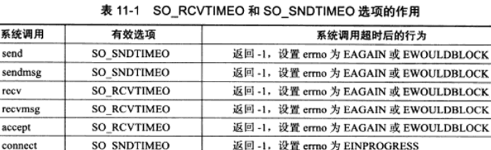

由上我们可以根据系统调用的返回值以及errno来判断超时时间是否已到进而决定是否开始处理定时任务。