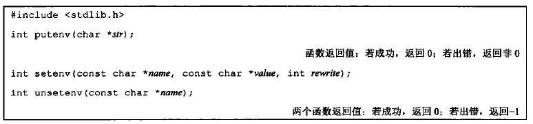
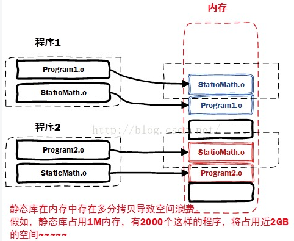
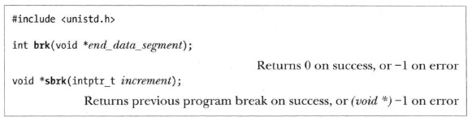
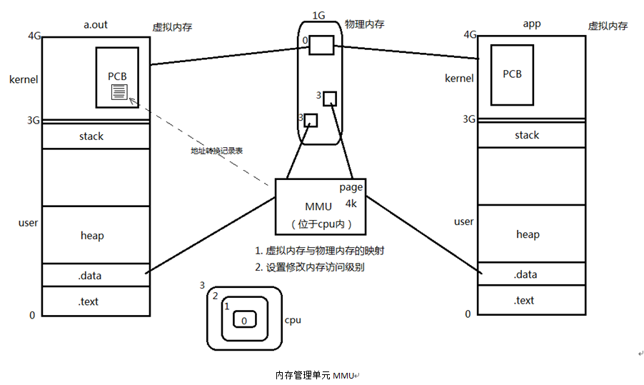
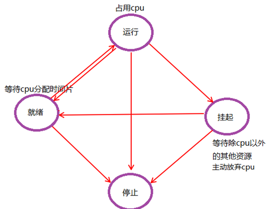
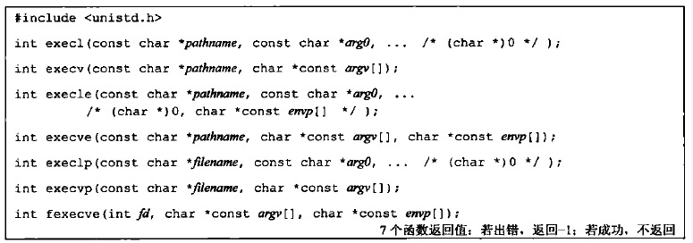
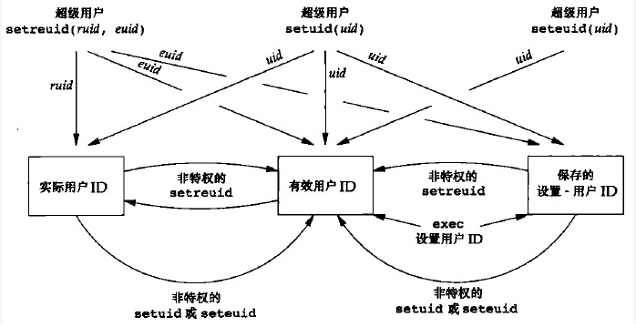
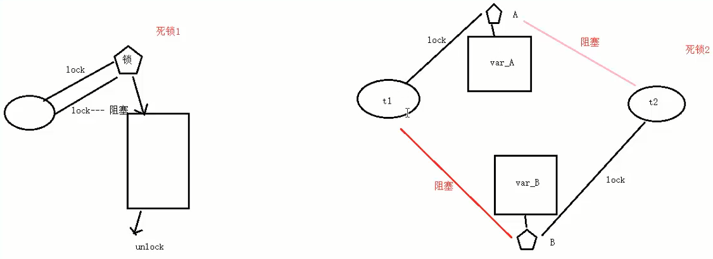
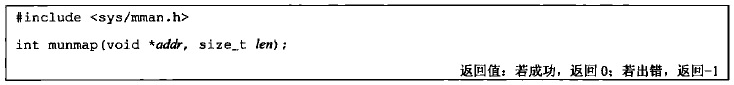
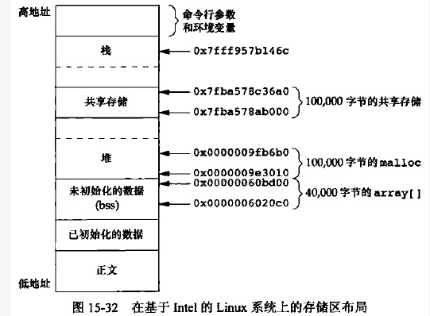

> 转自大神笔记有改动：https://github.com/arkingc/note


<br>
<br>

[TOC]
# 一.文件I/O

本章描述的函数经常被称为**不带缓冲的I/O**，不带缓冲值的是每个read和write都调用内核中的一个系统调用。这些不带缓冲的I/O函数不是ISO C的组成部分，它们是POSIX.1和Single UNIX Specification的组成部分

## 1.文件描述符

对于内核而言，所有打开的文件都通过文件描述符引用。文件描述符是一个非负数。范围是0~OPEN_MAX-1。当进程创建时，默认为它打开了3个文件描述符，它们都链接向终端：

* 0： 标准输入
* 1： 标准输出
* 2： 标准错误输出

通常使用`STDIN_FILENO`，`STDOUT_FILENO`和 `STDERR_FILENO`来替代这三个函数，从而提高可读性。这三个常量位于`<unistd.h>`中

### 复制文件描述符

**dup函数：**文件描述符的复制


* 对于`dup`函数
    - 返回的新的文件描述符一定是当前可用的文件描述符中最小的数字
* 对于`dup2`函数：
    - 如果 `fd2`已经是被打开的文件描述符且不等于`fd`，则先将其关闭，然后再打开（<font color='red'>注意关闭再打开是一个原子操作</font>）
    - 如果 `fd2`等于`fd`，则直接返回`fd2`（也等于`fd`），而不作任何操作

这些函数返回的新文件描述符与参数fd共享同一个文件表项：


<br>

## 2.相关调用

### 2.1 打开文件

**open：**


* 参数：
    * `path`:要打开或者创建文件的名字
    * `oflag`：用于指定函数的操作行为：
        * `O_RDONLY`常量：文件只读打开
        * `O_WRONLY`常量：文件只写打开
        * `O_RDWR`常量：文件读、写打开
        * `O_EXEC`常量：只执行打开
        * `O_SEARCH`常量：只搜索打开（应用于目录）。本书涉及的操作系统都没有支持该常量

        **以上五个常量必须且只能指定一个。下面的常量是可选的（进行或运算）**：
        * `O_APPEND`：每次写时都追加到文件的尾端
        * `O_CLOEXEC`：将`FD_CLOEXEC`常量设置为文件描述符标志
        * `O_CREAT`：若文件不存在则创建。使用此选项时，需要同时说明参数`mode`（指定该文件的访问权限）
        * `O_DIRECTORY`：若`path`引用的不是目录，则出错
        * `O_EXCL`：若同时指定了`O_CREAT`时，且文件已存在则出错。根据此可以测试一个文件是否存在。若不存在则创建此文件。这使得测试和创建两者成为一个原子操作
        * `O_NOCTTY`：若`path`引用的是终端设备，则不将该设备分配作为此进程的控制终端
        * `O_NOFOLLOW`：若`path`引用的是一个符号链接，则出错
        * `O_NONBLOCK`：如果`path`引用的是一个`FIFO`、一个块特殊文件或者一个字符特殊文件，则文件本次打开操作和后续的 I/O 操作设为非阻塞模式
        * `O_SYNC`：每次 `write` 等待物理 I/O 完成，包括由 `write` 操作引起的文件属性更新所需的 I/O 
        * `O_TRUNC`： 如果此文件存在，且为`O_WRONLY`或者`O_RDWR`成功打开，则将其长度截断为0
        * `O_RSYNC`：使每一个`read`操作等待，直到所有对文件同一部分挂起的写操作都完成
        * `O_DSYNC`：每次 `write` 等待物理 I/O 完成，但不包括由 `write` 操作引起的文件属性更新所需的 I/O 

    *  `mode`：文件访问权限。文件访问权限常量在 `<sys/stat.h>` 中定义，有下列九个：
        * `S_IRUSR`：用户读
        * `S_IWUSR`：用户写
        * `S_IXUSR`：用户执行
        * `S_IRGRP`：组读
        * `S_IWGRP`：组写          
        * `S_IXGRP`：组执行         
        * `S_IROTH`：其他读
        * `S_IWOTH`：其他写
        * `S_IXOTH`：其他执行 

对于`openat`函数，被打开的文件名由`fd`和`path`共同决定：

* 如果`path`指定的是绝对路径，此时`fd`被忽略。`openat`等价于`open`
* 如果`path`指定的是相对路径名，则`fd`是一个目录的文件描述符。被打开的文件的绝对路径由该`fd`描述符对应的目录加上`path`组合而成
* 如果`path`是一个相对路径名，而`fd`是常量`AT_FDCWD`，则`path`相对于当前工作目录。被打开文件在当前工作目录中查找。

由 `open/openat` 返回的文件描述符一定是**最小的未使用**的描述符数字

```
#includ e <sys/types.h>
#include <sys/stat.h>
#include <fcntl.h>

int main(){
    //打开已经存在的文件
    int fd=open("hello.c",O_RDWR);
    if(fd==-1){
        perror("open file");
        exit(1);
    }
    //创建新文件
    fd=open("myhello",O_RDWR | O_CREAT,0777);	//文件权限，本地有一个掩码，权限会和掩码取反有一个按位与的操作，跟本地掩码有关系，修改：$umask 022
    //判断文件是否已经存在
    fd=open("myhello",O_RDWR | O_CREAT | O_EXECL,0777);
    //将文件截断为0,文件大小为0
    fd=open("myhello",O_RDWR | O_TRUNC);
    if(fd==-1){
        perror("create file");
        exit(1);
    }
    printf("fd = %d\n",fd);
    //关闭文件
    int ret=close(fd);
    printf("ret = %d\n",ret);
}
```

### 2.2 创建文件

**create：**


* 参数：
    * `path`:要创建文件的名字
    * `mode`：指定该文件的访问权限。文件访问权限常量在 `<sys/stat.h>` 中定义，有下列九个：
        * `S_IRUSR`：用户读
        * `S_IWUSR`：用户写
        * `S_IXUSR`：用户执行
        * `S_IRGRP`：组读
        * `S_IWGRP`：组写          
        * `S_IXGRP`：组执行         
        * `S_IROTH`：其他读
        * `S_IWOTH`：其他写
        * `S_IXOTH`：其他执行

该函数等价于`open(path,O_WRONLY|O_CREAT|O_TRUNC,mode)`

`creat`的存在一个不足是：**它以只写方式打开创建的文件**。如果要创建一个临时文件，并要先写该文件，然后又读该文件，则必须先调用`create`、`close`，然后再调用`open`，新版本`open`出来后，可以以下列方式实现：

`open(path,O_RDWR|O_CREAT|O_TRUNC,mode)`

### 2.3 关闭文件

**close：**


注意：

- 进程关闭一个文件会释放它加在该文件上的所有记录锁
- 当一个进程终止时，内核会自动关闭它所有的打开的文件

### 2.4 定位读写位置

**lseek函数：**1.获取文件大小	2.移动文件指针	3.文件拓展


* 参数：
    * `fd`：打开的文件的文件描述符
    * `whence`：必须是 `SEEK_SET`、`SEEK_CUR`、`SEEK_END`三个常量之一
    * `offset`：
        * 如果 `whence`是`SEEK_SET`，则将该文件的偏移量设置为距离文件开始处`offset`个字节
        * 如果 `whence` 是 `SEEK_CUR`，则将该文件的偏移量设置为当前值加上`offset`个字节，`offset`可正，可负
        * 如果 `whence` 是 `SEEK_END`，则将该文件的偏移量设置为文件长度加上`offset`个字节，`offset`可正，可负

每个打开的文件都有一个与其关联的“当前文件偏移量”。它通常是个非负整数，用于度量从文件开始处计算的字节数。通常读、写操作都从当前文件偏移量处开始，并且使偏移量增加所读写的字节数。注意：

- 打开一个文件时，除非指定`O_APPEND`选项，否则系统默认将该偏移量设为0
- 如果文件描述符指定的是一个管道、FIFO、或者网络套接字，则无法设定当前文件偏移量，则`lseek`将返回 -1 ，并且将 `errno` 设置为 `ESPIPE`
- 对于普通文件，其当前文件偏移量必须是非负值。但是某些设备运行负的偏移量出现。因此比较`lseek`的结果时，不能根据它小于0 就认为出错。要根据是否等于 -1 来判断是否出错
- **`lseek` 并不会引起任何 I/O 操作，`lseek`仅仅将当前文件的偏移量记录在内核中**
- **当前文件偏移量可以大于文件的当前长度。此时对该文件的下一次写操作将家常该文件，并且在文件中构成一个空洞。空洞中的内容位于文件中但是没有被写过，其字节被读取时都被读为0（文件中的空洞并不要求在磁盘上占据存储区。具体处理方式与操作系统有关）**

```c
#includ e <sys/types.h>
#include <sys/stat.h>
#include <fcntl.h>

int main(){
    //打开已经存在的文件
    int fd=open("aa",O_RDWR);
    if(fd==-1){
        perror("open file");
        exit(1);
    }
    
    int ret=lseek(fd,0,SEEK_END);
    printf("file length=%d\n",ret);
    //文件拓展2000个字节
    ret=lseek(fd,2000,SEEK_END);
    printf("return value %d\n",ret);
    //实现文件拓展，需要在最后做一次写操作
    write(fd,"a",1);
    
    ret=close(fd);
    printf("ret = %d\n",ret);
}
```


### 2.5 文件读

**read函数：**


* 参数：
    * `fd`：打开的文件的文件描述符
    * `buf`：存放读取内容的缓冲区的地址（由程序员手动分配）
    * `nbytes`：期望读到的字节数

读操作从文件的当前偏移量开始，在成功返回之前，文件的当前偏移量会增加实际读到的字节数

有多种情况可能导致实际读到的字节数少于期望读到的字节数：

- 读普通文件时，在读到期望字节数之前到达了文件尾端
- 当从终端设备读时，通常一次最多读取一行（终端默认是行缓冲的）
- 当从网络读时，网络中的缓存机制可能造成返回值小于期望读到的字节数
- 当从管道或者`FIFO`读时，若管道包含的字节少于所需的数量，则 `read`只返回实际可用的字节数
- 当从某些面向记录的设备（如磁带）中读取时，一次最多返回一条记录
- 当一个信号造成中断，而已读了部分数据时

### 2.6 文件写

**write函数：**


* 参数：
    * `fd`：打开的文件的文件描述符
    * `buf`：存放待写的数据内容的缓冲区的地址（由程序员手动分配）
    * `nbytes`：期望写入文件的字节数

`write`的返回值通常都是与`nbytes`相同。否则表示出错（出错的一个常见原因是磁盘写满，或者超过了一个给定进行的文件长度限制）

对于普通文件，写操作从文件的当前偏移量处开始。如果打开文件时指定了`O_APPEND`选项，则每次写操作之前，都会将文件偏移量设置在文件的当前结尾处。在一次成功写之后，该文件偏移量增加实际写的字节数。

```c
//练习：将一个文件写到另一个文件
#include <stdio.h>
#include <stdlib.h>
#include <sys/types.h>
#include <sys/stat.h>
#include <fcntl.h>
#include <unistd.h>

int main(){
    int fdr=open("english.txt",O_RDONLY);
    if(fdr==-1){
        perror("open");
        exit(1);
    }
    int fdw=open("newfile",O_CREAT | OWDONLY,0664);
    if(fdw==-1){
        perror("create");
        exit(1);
    }
    //开始读
    char buf[2048];
    int count=read(fdr,buf,sizeof(buf));	//将sizeof(buf)字节的数据放入缓冲区
    if(count==-1){
        printf("read");
        exit(1);
    }
    while(count){
        //将读出的数据写到另一个文件中
        int ret=write(fdw,buf,count);
        printf("write bytes:%d\n",ret);
        count=read(fd,buf,sizeof(buf));
    }
    close(fdr);
    close(fdw);
}
```


### 2.7 fcntl函数

<u>fcntl可以改变已经打开文件的属性</u>，比如打开文件的时候是只读，我想向文件里追加一些内容就用到该函数


* 参数：
    * `fd`：已打开文件的描述符

    * `cmd`：有下列若干种：（作用）
      
        - **复制一个已有的描述符**（还可以使用`dup`或`dup2`）
            - `F_DUPFD`：复制文件描述符 `fd`。新文件描述符作为函数值返回。它是尚未打开的文件描述符中大于或等于`arg`中的最小值。新文件描述符与`fd`共享同一个文件表项，但是新描述符有自己的一套文件描述符标志，其中`FD_CLOEXEC`文件描述符标志被清除
            - `F_DUPFD_CLOEXEC`：复制文件描述符。新文件描述符作为函数值返回。它是尚未打开的个描述符中大于或等于`arg`中的最小值。新文件描述符与`fd`共享同一个文件表项，但是新描述符有自己的一套文件描述符标志，其中`FD_CLOEXEC`文件描述符标志被设置
        * **获取/设置文件描述符标志**
          
            - `F_GETFD`：对应于`fd`的文件描述符标志作为函数值返回。当前只定义了一个文件描述符标志`FD_CLOEXEC`
            - `F_SETFD`：设置`fd`的文件描述符标志为`arg`
        * **获取/设置文件状态标志**
            - `F_GETFL`：返回`fd`的文件状态标志。获得文件状态标志后，**必须首先用屏蔽字 `O_ACCMODE` 取得访问方式位，然后与`O_RDONLY`、`O_WRONLY`、`O_RDWR`、`O_EXEC`、`O_SEARCH`比较（这5个值互斥，且并不是各占1位）**。剩下的还有：`O_APPEND`、`O_NONBLOCK`、`O_SYNC`
            、`O_DSYNC`、`O_RSYNC`、`F_ASYNC`、`O_ASYNC`
          - `F_SETFL`：设置`fd`的文件状态标志为 `arg`。可以更改的标志是：
            `O_APPEND`、`O_NONBLOCK`（这俩是重点）、`O_SYNC`、`O_DSYNC`、`O_RSYNC`、`F_ASYNC`、`O_ASYNC`
        * **获取/设置异步I/O所有权**
            - `F_GETOWN`：获取当前接收 `SIGIO`和`SIGURG`信号的进程 `ID`或者进程组 `ID`
            - `F_SETOWN`：设置当前接收 `SIGIO`和`SIGURG`信号的进程 `ID`或者进程组 `ID`为`arg`。若 `arg`是个正值，则设定进程 `ID`；若 `arg`是个负值，则设定进程组`ID`
        * **获取/设置记录锁**
            - `F_GETLK`、`F_SETLK`、`F_SETLKW`
      
    * `arg`：依赖于具体的命令 

    ```c
    #include <stdio.h>
    #include <stdlib.h>
    #include <fcntl.h>
    #include <unistd.h>
    #include <string.h>
    
    int main(void)
    {
        int fd;
        int flag;
    
        // 测试字符串
        char *p = "我们是一个有中国特色的社会主义国家！！！！！！";
        char *q = "呵呵, 社会主义好哇。。。。。。";
        
        // 只写的方式打开文件
        fd = open("test.txt", O_WRONLY);
    	//判断fd略
        // 输入新的内容，该部分会覆盖原来旧的内容，覆盖写
        if(write(fd, p, strlen(p)) == -1)
        {
            perror("write");
            exit(1);
        }
    
        // 使用 F_GETFL 命令得到文件状态标志,最后一个参数为0
        flag = fcntl(fd, F_GETFL, 0);
    	////判断flag略
    
        // 将文件状态标志添加 ”追加写“ 选项
        flag |= O_APPEND;
        // 将文件状态修改为追加写
        if(fcntl(fd, F_SETFL, flag) == -1)
        {
            perror("fcntl -- append write");
            exit(1);
        }
    
        // 再次输入新内容，该内容会追加到旧内容的后面
        if(write(fd, q, strlen(q)) == -1)
        {
            perror("write again");
            exit(1);
        }
    
        // 关闭文件
        close(fd);
    
        return 0;
    }
    
    ```


<br>

## 3.进程间文件共享


UNIX系统支持在不同进程间共享打开文件。内核使用3种数据结构描述打开文件。它们之间的关系决定了在文件共享方面一个进程对另一个进程可能产生的影响

* 内核为每个进程分配一个**进程表项**（所有进程表项构成进程表），进程表中都有一个打开的文件描述符表。每个文件描述符占用一项，其内容为：
    * 文件描述符标志
    * 指向一个文件表项的指针
* 内核为每个打开的文件分配一个**文件表项**（所有的文件表项构成文件表）。每个文件表项的内容包括：
    * 文件状态标志（读、写、添写、同步和阻塞等）
    * 当前文件偏移量
    * 指向该文件 v 结点表项的指针
* 每个打开的文件或者设备都有一个 **v 结点结构**。 v 结点结构的内容包括： 
    * 文件类型和对此文件进行各种操作函数的指针
    * 对于大多数文件， v 结点还包含了该文件的 i 结点
    **这些信息都是在打开文件时从磁盘读入内存的**。如 i 结点包含了文件的所有者、文件长度、指向文件实际数据在磁盘上所在位置的指针等等。 v 结点结构和 i 结点结构实际上代表了文件的实体（**Linux没有使用v节点，而是使用了通用i节点结构。虽然两种实现有所不同，但在概念上，v节点与i节点是一样的，两者都指向文件系统特有的i节点结构**）


现在假设进程 A 打开文件 `file1`，返回文件描述符 3；进程 B 也打开文件 `file2`，返回文件描述符 4：


内核在文件表上新增两个表项：

- 这两个文件表项指向同一个 v 结点表项
- 进程 A 、B 各自的文件描述符表项分别指向这两个文件表项（因此每个进程都有自己的对该文件的当前偏移）

对文件的操作结果：

- 每次 `write` 之后，在文件表项中的当前文件偏移量即增加所写入的字节数
    - 若这导致当前文件偏移量超过当前文件长度，则修改 i 节点的当前文件长度，设为当前文件偏移量
- 如果用 `O_APPEND` 标志打开一个文件，则相应标志也设置到文件表项的文件状态标志中
    - 每次对具有追加写标志的文件执行写操作时，文件表项中的当前文件偏移量首先被置为 i 结点中的文件长度
- 若用 `lseek` 定位到文件当前的尾端，则文件表项中的当前文件偏移量设置为 i 结点中的文件长度
    - `lseek` 函数只是修改文件表项中的当前文件偏移量，不进行任何 I/O 操作

<br>

## 4.原子操作

> 多个进程写同一文件时，可能产生预想不到的结果。为了避免这种情况，需要理解原子操作

多个进程同时追加写一个文件时，如果通过 `lseek` 到末尾然后 `write` 可能出现问题：因为 “先定位到文件尾端，然后写” 并不是一个原子操作，如果先执行两个进程的 `lseek` ，然后执行 `write` ，就会出现问题

**UNIX提供了一种原子操作方法：通过 `O_APPEND`选项打开文件。这样做使得内核在每次调用 `write` 执行写操作之前，都将进程的当前偏移量设置到该文件的末尾，于是就不需要执行`lseek`定位操作**

### 定位读和定位写

**pread函数：**


* 参数：
    * `fd`：打开的文件描述符
    * `buf`：读出数据存放的缓冲区/ 写到文件的数据的缓冲区
    * `nbytes`：预期读出/写入文件的字节数
    * `offset`：从文件指定偏移量开始执行`read/write`

**调用`pread`相当于先调用`lseek`再调用`read**`.但是调用`pread`时，无法中断其定位和读操作，并且不更新当前文件偏移量

调用`pwrite`相当于先调用`lseek`再调用`write`.但是调用`pwrite`时，无法中断其定位和写操作，并且不更新当前文件偏移量

<br>

## 5.数据同步

UNIX操作系统在内核中设有**缓冲区高速缓存**或**页高速缓存**，大多数磁盘 I/O 都通过缓冲区进行。当我们想文件写入数据时，内核通常都先将数据复制到缓冲区中，然后排入队列，晚些时候再写入磁盘。这种方式称为**延迟写**

以下2种情况会将缓冲区中的数据写回到磁盘：

- 当内核需要重用缓冲区来存放其他数据时，它会把所有延迟写的数据库写入磁盘
- 可以调用`sync`、`fsync`或`fdatasync`来显式的将所有延迟写的数据块写回磁盘


* 参数（前两个函数）：
    * `fd`：指定写回的文件

3个函数的区别：

- `sync`（`update` 守护进程会周期性(一般每隔30s)的调用`sync`函数。命令`sync`也会调用`sync`函数）：
    + 将所有修改过的块缓冲区排入写队列，然后返回
    + 它并不等待实际写磁盘操作结束
- `fsync`：
    + 只对由`fd`指定的单个文件起作用
    + 等待写磁盘操作结束才返回
- `fdatasync`：
    + 只对由`fd`指定的单个文件起作用，但是它只影响文件的数据部分（`fsync`会同时更新文件的属性）
    + 等待写磁盘操作结束才返回

<br>
<br>

# 二.文件和目录

## 文件系统

可以把一个磁盘分成一个或多个分区。每个分区可用包含一个文件系统

**索引节点inode号：**保存的其实是实际的数据的一些信息，这些信息称为“元数据”(也就是对文件属性的描述)。
例如：文件大小，设备标识符，用户标识符，用户组标识符，文件模式，扩展属性，文件读取或修改的时间戳，
链接数量，指向存储该内容的磁盘区块的指针，文件分类等等。( 注意数据分成：元数据+数据本身 )

**注意inode怎样生成的**：每个inode节点的大小，一般是128字节或256字节。inode节点的总数，在格式化时就给定(现代OS可以动态变化)，一般每2KB就设置一个inode。一般文件系统中很少有文件小于2KB的，所以预定按照2KB分，一般inode是用不完的。所以inode在文件系统安装的时候会有一个默认数量，后期会根据实际的需要发生变化。

**注意inode号**：inode号是唯一的，表示不同的文件。其实在Linux内部的时候，访问文件都是通过inode号来进行的，所谓文件名仅仅是给用户容易使用的。当我们打开一个文件的时候，首先，系统找到这个文件名对应的inode号；然后，通过inode号，得到inode信息，最后，由inode找到文件数据所在的block，现在可以处理文件数据了。

**inode和文件的关系**：当创建一个文件的时候，就给文件分配了一个inode。一个inode只对应一个实际文件， 	 
一个文件也会只有一个inode。inodes最大数量就是文件的最大数量。

inode是固定长度的记录项，包含有关文件的大部分信息


可以进一步分析inode和数据块部分：


* 每个inode中有一个链接数，其值为指向该inode的目录项数（上图中有两个目录项指向同一个inode）。只有当链接数减为0时，才删除该文件。链接数包含在`stat`结构的`st_nlink`成员中（POSIX.1常量`LINK_MAX`指定了一个文件链接数的最大值）。**这种链接类型称为硬链接**
* 另外一种链接类型称为**符号链接**。符号链接文件的实际内容（在数据块中）包含了该符号链接所指向的文件的名字
* inode包含了文件有关的所有信息：文件类型、文件访问权限位、文件长度和指向文件数据块的指针等。`stat`结构中的大多数信息都取自inode。只有2项重要数据存放在目录项中：文件名和inode号
* 因为目录项中的inode编号指向同一文件系统中的相应inode，一个目录项不能指向另一个文件系统的inode
* 在不更换文件系统的情况下为一个文件重命名时，该文件的实际内容并未移动，只需构造一个指向现有inode的新目录项，并删除老的目录项。链接数不会改变

下图为在一个目录下创建一个目录testdir，注意testdir所在目录，以及新建目录testdir的inode链接数：


## 1.获取文件信息


* **stat**：获得与`pathname`文件**有关的信息结构**，存在`buf`中
* **fstat**：获得已在描述符`fd`上打开文件的有关信息，存在`buf`中
* **lstat**：类似于**stat**。但是当`pathname`为一个符号链接时，返回符号链接（而不是由该符号链接引用的文件）的有关信息，存在`buf`中
* **fstatat**：获取相对于打开目录`fd`的文件`pathname`的统计信息
    - 如果`fd`的值是`AT_FDCWD`，则会获取相对于当前目录的文件`pathname`的信息
    - 如果`pathname`是一个绝对路径，参数`fd`就会被忽略
    - `flag`
        + 设置了`AT_SYMLINK_NOFOLLOW`标志：如果文件是符号链接则直接获取符号链接的信息
        + `否则`：如果文件是符号链接，会顺着链接获取链接文件的信息

文件信息结构用一个结构体`stat`表示，实际定义可能随具体实现有所不同，但基本形式是：

```c
struct stat{
    mode_t              st_mode;    /*文件类型和存取的权限，见下面*/
    ino_t               st_ino;     /* inode号 */
    dev_t               st_dev;     /* 设备号（文件系统） */
    dev_t               st_rdev;    /* 特殊文件的设备号 */
    nlink_t             st_nlink;   /* 链接数 */
    uid_t               st_uid;     /* 所有者的用户ID */
    gid_t               st_gid;     /* 组所有者的ID */
    off_t               st_size;    /* 字节大小，用于一般文件，文件字节数 */
    struct timespec     st_atime;   /* 最后一次访问时间 */
    struct timespec     st_mtime;   /* 最后一次修改时间 */
    struct timespec     st_ctime;   /* 最后一个文件状态改变的时间 */
    blksize_t           st_blksize; /* 磁盘块(block)大小 */
    blkcnt_t            st_blocks;  /* 分配的磁盘块(block)数量 */
};
```

> POSIX.1未要求`st_rdev`、`st_blksize`和`st_blocks`字段。Single UNIX Specification XSI扩展定义了这些字段

**st_mode图解：**


```c
//通过stat函数实现ls -l的功能
#include <stdio.h>
#include <string.h>
#include <sys/types.h>
#include <sys/stat.h>
#include <stdlib.h>
#include <time.h>
#include <pwd.h>
#include <grp.h>

int main(int argc,char* argv[]){
    if(argc<2){
        printf("./a.out filename\n");
        eixt(1);
    }
    
    struct stat st;	//文件信息结构
    int ret=stat(argv[1],&st);	//将文件信息存放到st
    if(ret==-1){
        perror("stat");
        exit(1);
    }
    
    //存储文件类型和访问权限
    char perms[11]={0};
    //判断文件类型，掩码S_IFMT过滤掉除文件类型以外的信息
    switch(st.st_mode&S_IFMT){
        case S_IFLNK:
            perms[0]='l';
            break;
        case S_IFDIR:
            perms[0]='d';
        case S_IFREG:
            perms[0]='-';
            break;
        case S_IFBLK:
            perms[0] = 'b';
            break;
        case S_IFCHR:
            perms[0] = 'c';
            break;
        case S_IFSOCK:
            perms[0] = 's';
            break;
        case S_IFIFO:
            perms[0] = 'p';
            break;
        default:
            perms[0] = '?';
            break;
    }
    //判断文件的访问权限
    //文件所有者
    perms[1] = (st.st_mode & S_IRUSR) ? 'r' : '-';
    perms[2] = (st.st_mode & S_IWUSR) ? 'w' : '-';
    perms[3] = (st.st_mode & S_IXUSR) ? 'x' : '-';
    // 文件所属组
    perms[4] = (st.st_mode & S_IRGRP) ? 'r' : '-';
    perms[5] = (st.st_mode & S_IWGRP) ? 'w' : '-';
    perms[6] = (st.st_mode & S_IXGRP) ? 'x' : '-';
    // 其他人
    perms[7] = (st.st_mode & S_IROTH) ? 'r' : '-';
    perms[8] = (st.st_mode & S_IWOTH) ? 'w' : '-';
    perms[9] = (st.st_mode & S_IXOTH) ? 'x' : '-';
    // 硬链接计数
    int linkNum = st.st_nlink;
    // 文件所有者
    char* fileUser = getpwuid(st.st_uid)->pw_name;
    // 文件所属组
    char* fileGrp = getgrgid(st.st_gid)->gr_name;
    // 文件大小
    int fileSize = (int)st.st_size;
    //修改时间
    char *time=ctime(&st.st_mtime);
    char mtime[512]={0};
    strncpy(mtime, time, strlen(time)-1);	//mtime存放时间
    char buf[1024];
    sprintf(buf, "%s  %d  %s  %s  %d  %s  %s", perms, linkNum, fileUser, fileGrp, fileSize, mtime, argv[1]);	//将结果存放到buf中
    printf("%s\n", buf);

    return 0;
}
```

`timespec`结构类型按照**秒**和**纳秒**定义了时间，至少包括下面2个字段：

```c
time_t tv_sec;
long   tv_nsec;
```

> 使用`stat`函数最多的地方可能就是`ls -l`命令获得有关一个文件的所有信息

**ctime函数：**

> **char *ctime(const time_t *timep);**
> ctime()将参数timep所指的time_t结构中的信息转换成真实世界所使用的时间日期表示方法, 然后将结果以字符串形态返回。此函数已经由时区转换成当地时间, 字符串格式为"Wed Jun 30 21 :49 :08 1993\n"。若再调用相关的时间日期函数, 此字符串可能会被破坏。


## 2.文件类型

* **普通(一般)文件**
* **目录文件**
* **块特殊文件**：这种类型的文件提供对设备（如磁盘）带缓冲的访问，每次访问以固定长度为单位进行
* **字符特殊文件**：这种类型的文件提供对设备不带缓冲的访问，每次访问长度可变（系统中的所有设备要么是字符特殊文件，要么是块特殊文件）
* **FIFO**：这种类型的文件用于进程间通信，有时也称为命名管道
* **套接字**：这种类型的文件用于进程间的网络通信
* **符号链接**：这种类型的文件指向另一个文件

文件类型信息包含在`stat`结构的`st_mode`成员中。可以使用下图的宏判断文件类型（传入`st_mode`）：


POSIX.1允许实现将进程间通信(IPC)对象说明为文件。通过下图的宏可以确定IPC对象的类型（传入`stat`结构的指针）


<br>

## 3.用户ID和组ID

### 3.1 进程与文件的用户ID及组ID

与一个**进程**相关联的ID有6个或更多，下图是用户ID和组ID


* **实际用户ID和组ID**：标识我们究竟是谁。这两个字段在登录时取自口令文件中的登录项。通常在一个登录会话期间这些值并不改变，但是超级用户进程有办法改变它们
* **有效用户ID、有效组ID以及附属组ID**：决定了我们的**文件访问权限**
    - 通常情况下**有效用户ID**等于**实际用户ID**、**有效组ID**等于**实际组ID**
    - 每个文件有一个**所有者**（`stat`结构中的`st_uid`）和**组所有者**（`stat`结构中的`st_gid`），可以设置程序文件的**文件模式字**（`stat`结构中的`st_mode`）来改变执行该文件的进程的**有效用户ID**和**有效组ID**
        + 如果设置了文件模式字中的**设置用户ID位**，当执行此文件时，会将**进程的有效用户ID**设置为**文件所有者的用户ID**
        + 如果设置了文件模式字中的**设置组ID位**，”当执行此文件时，会将**进程的有效组ID**设置为**文件组所有者的ID**
        + 可以通过将文件`stat`结构的`st_mode`传入常量`S_ISUID`和`S_ISGID`来测试是否设置了**设置用户ID位**和**设置组ID位**（**因此，如果文件所有者是超级用户，而且设置了该文件的设置用户ID位，那么当该程序文件由一个进程执行时，该进程具有超级用户权限。不管执行此文件的进程的实际用户ID是什么，都会是这样**）
* **保存的设置用户ID和保存的设置组ID**：在执行一个程序时包含了有效用户ID和有效组ID的副本

### 3.2 修改文件的所有者和组所有者

如果`owner`或`group`中的任意一个是-1，则对应的ID不变：


* **chown函数**：更改pathname参数指向的文件的用户ID和组ID
* **fchown函数**：更改`fd`参数指向的打开文件的用户ID和组ID（既然在一个已打开的文件上操作，就不能用于改变符号链接的所有者）
* **fchownat函数**：更改相对于已打开目录`fd`的文件`pathname`的用户ID和组ID
    - 函数在下列2种情况下，与**chown**或**lchown**相同
        + `pathname`为绝对路径
        + `fd`参数为`AT_FDCWD`而`pathname`为相对路径
    - `flag`
        + 设置了`AT_SYMLINK_NOFOLLOW`标志：不会跟随符号链接，与**lchown**行为相同
        + 没有设置`AT_SYMLINK_NOFOLLOW`标志：与**chown**相同
* **lchown函数**：直接对符号链接进行更改

基于BSD的系统一直规定只有超级用户才能更改一个文件的所有者；System V则允许任一用户更改他们所拥有的文件的所有者

> 能否更改还与`_POSIX_CHOWN_RESTRICTED`常量是否对文件生效有关

<br>

## 4.文件访问权限

下图列出了文件访问权限的所有权限位，以及它们对普通文件和目录文件的作用：


最后9个常量还可以分成如下3组：

* `S_IRWXU = S_IRUSR | S_IWUSR | S_IXUSR`
* `S_IRWXG = S_IRGRP | S_IWGRP | S_IXGRP`
* `S_IRWXO = S_IROTH | S_IWOTH | S_IXOTH`

### 4.1 进程的文件访问权限

文件`stat`结构的`st_mode`成员除了包含**设置用户ID位**和**设置组ID位**用以修改进程的**有效用户ID**和**有效组ID**，还包含9个文件访问权限的位，**这些权限位指明了所有者、组和其他对于该文件的访问权限**，可分为3类：


任何文件类型都有访问权限

* **目录**
    - **执行权限**：决定了我们能否通过该目录（即如果某个文件的路径包含该目录，那么要打开这个文件，就需要对这个目录具有执行权限）
    - **读权限**：允许读目录，获得在目录中所有文件名的列表
* **文件**
    - **读权限**：决定了我们能否打开现有文件进行读操作
    - **写权限**：决定了我们能否打开现有文件进程写操作

**创建和删除文件**：必须对该文件所在的目录具有**写权限**和**执行权限**

**进程每次打开、创建或删除一个文件时，内核就进行文件访问权限测试**，内核进行的测试如下：

1. **若进程的有效用户ID是0**（超级用户），则允许访问。这给予了超级用户对整个文件系统进行处理的最充分自由
2. **若进程的有效用户ID等于文件的所有者ID**（也就是进程拥有此文件），那么如果所有者适当的访问权限位被设置，则允许访问，否则拒绝访问
3. **若进程的有效组ID或进程的附属组ID之一等于文件的组ID**，那么如果组适当的访问权限位被设置，则允许访问，否则拒绝访问
4. 若其他用户适当的访问权限位被设置，则允许访问，否则拒绝访问

**按顺序**执行这4步

* 若进程拥有此文件（第2步），则按用户访问权限批准或解决该进程对文件的访问——不查看组访问权限
* 若进程不拥有该文件。但进程属于某个适当的组，则按组访问权限批准或拒绝该进程对文件的访问——不查看其他用户的访问权限

如果进程希望按照其**实际用户ID**和**实际组ID**来测试其访问能力，那么可以使用下列函数（进程使用**实际用户ID**和**实际组ID**来测试其访问能力也分成4步，与上面相同）：

**access函数：测试文件具有的rwx权限**


* `mode`：欲测试的权限位标志（可以是下列值按位或）
    - `F_OK`：测试文件是否已经存在
    - `R_OK`：测试读权限
    - `W_OK`：测试写权限
    - `X_OK`：测试执行权限
* `flag`参数可以用于改变`faccessat`的行为，如果`flag`设置为`AT_EACCESS`，访问检查用的是调用进程的**有效用户ID和有效组ID**，而不是**实际用户ID和实际组ID**

这两个函数在下面2种情况下是相同的：

* `pathname`参数为绝对路径
* `fd`参数取值为`AT_FDCWD`，而`pathname`参数为相对路径

### 4.2 新文件的文件访问权限

可以使用`umask`函数为进程设置**文件模式创建屏蔽字**，并返回之前的值：

**umask函数：**


* `cmask`：同[open函数的mode参数](#21-打开文件)，是9个常量的若干个按位”或“的值

**在进程创建一个新文件或新目录时，一定会使用文件模式创建屏蔽字。在文件模式创建屏蔽字为1的位，在文件mode中的相应位一定被关闭。因此，使用`creat`创建文件时，指定的mode，屏蔽掉文件模式创建屏蔽字中为1的位，就是新创建文件的权限**

**子进程的文件模式创建屏蔽字不会影响父进程。因此，如果子进程修改了文件模式创建屏蔽字，父进程的文件模式创建屏蔽字不会改变（如shell在调用一个会修改文件创建屏蔽字的程序前后使用umask打印文件创建屏蔽字，不会发生改变）**

下图为八进制的屏蔽位和含义：


### 4.3 修改文件访问权限


* **chmod函数**：对文件`pathname`进行修改，指定八进制的数
* **fchmod函数**：对已打开的文件(`fd`指定)进行修改
* **fchmodat函数**：对已打开目录`fd`下的`pathname`文件进行修改
    - 下列情况下等同于**chmod函数**
        + `pathname`为绝对路径
        + `fd`参数为`AT_FDCWD`而`pathname`为相对路径
    - `flag`设置了`AT_SYMLINK_NOFOLLOW`标志时，不会跟随符号链接
* `mode`参数是下图常量（定义在`<sys/stat.h>`中）的按位或（图中进位的9个常量是open函数`mode`参数使用的9个常量）
  
    

**修改文件的权限位的前提是：进程的有效用户ID必须等于文件的所有者ID，或者进程必须具有超级用户权限**

> ls -l列出的是文件内容最后修改的时间，这里介绍的函数修改文件权限是在修改inode，所以ls -l列出的时间不会发生变化

<br>

## 5.新文件和目录的所有权

* 新文件或新目录的**用户ID**设置为**进程的有效用户ID**
* 关于**组ID**，POSIX.1允许实现选择下列之一作为新文件或新目录的组ID
    - 新文件或新目录的组ID可以是**进程的有效组ID**
    - 新文件或新目录的组ID可以是它**所在目录的组ID**（Linux的`/var/mail`目录中就使用了这种方法）

<br>

## 6.粘着位

即`S_ISVTX`

* 在UNIX尚未使用请求分页式技术的早期版本中，`S_ISVTX`位被称为**粘着位**
* 后来的UNIX版本称它为**保存正文位**

用途

* 以前，如果一个可执行文件设置了该位，当程序第一次被执行，在其终止时，程序正文部分的一个副本仍被保存在交换区。这使得下次执行该程序时能较快地将其装载入内存（原因是：通常的UNIX文件系统中，文件的各数据块很可能是随机存放的，相比较而言，交换区是被作为一个连续文件来处理的）
* 现在，系统**扩展了**粘着位的**使用范围**，Single UNIX Specification**允许针对目录设置粘着位**。**如果对一个目录设置了该位，只有满足下列2个情况，才能删除或重命名该目录下的文件**：
    - **对该目录具有写权限**
    - **满足下列条件之一**
        + 拥有此文件
        + 拥有此目录
        + 是超级用户

> 目录/tmp和/var/tmp就是设置粘着位的典型候选者

<br>

## 7.文件长度

`stat`结构的`st_size`成员表示以字节为单位的文件的长度。该字段只对**普通文件**、**目录文件**和**符号链接**有意义

* 对于**普通文件**，其文件长度可以是0，在读这种文件时，将得到文件结束指示
* 对于**目录**，文件长度通常是一个数（如16或512）的整倍数
* 对于**符号链接**，文件长度是文件名中的实际字节数（因为符号链接文件长度总是由`st_size`指示，所以它并不包含通常C语言用作名字结尾的null字节）

### 7.1 文件中的空洞

普通文件可以包含空洞。**空洞是由所设置的偏移量超过文件尾端，并写入了某些数据后造成的**

空洞并不占用实际磁盘空间，但是会参与文件大小的计算，在读文件时，读到空洞部分的内容是字节0

### 7.2 文件截断

可以在打开文件时使用`O_TRUNC`标志将文件截断为0

下列函数可以截断文件：

**truncate函数：**


* `length`
    - `<文件长度`：文件超过length以外的数据就不再能访问
    - `>文件长度`：文件长度将增加，在以前的文件尾端和新的文件尾端之间的数据将读作0（也就是可能在文件中创建了一个空洞）

<br>

## 8.硬链接

### 8.1 创建硬链接


* **link函数**：创建硬链接
    - `existingpath`：现有文件
    - `newpath`：创建的新目录项（如果已经存在，则返回出错）。只创建最后一个分量，路径中的其他部分应当已经存在
* **linkat函数**
    - 现有文件
        + `efd`：现有文件所在目录的文件描述符
        + `existingpath`：现有文件名
    - 新的路径名
        + `nfd`：新目录项所在目录的文件描述符
        + `newpath`：新目录项的文件名
    - `flag`
        + 设置了`AT_SYMLINK_NOFOLLOW`标志：创建指向符号链接目标的硬链接
        + 没设置`AT_SYMLINK_NOFOLLOW`标志：创建指向符号链接本身的硬链接

对于**linkat函数**：

* 如果两个路径名中的任一个是相对路径，那么需要通过相对于对应的文件描述符进行计算
    - 如果两个文件描述符中的任一个设置为`AT_FDCWD`，那么相应的路径名就通过当前目录进行计算
* 如果两个路径名中的任一个是绝对路径，那么相应的文件描述符参数就会被忽略

> 如果实现支持创建指向一个目录的硬链接，那么也仅限于超级用户才可以这样做

### 8.2 删除硬链接

要删除硬链接，必须对包含该目录项(硬链接)的目录具有**写和执行权限**

**unlink函数：**


* 如果`flag`参数设置了`AT_REMOVEDIR`标志位，那么**unlinkat**函数可以类似于**rmdir**一样删除目录；否则，函数**unlinkat**与**unlink**执行同样的操作
* **如果`pathname`是符号链接，那么unlink删除该符号链接，而不是删除由该链接所引用的文件**（即，不跟随符号链接）（给出符号链接名的情况下，没有一个函数能删除由该链接所引用的文件）
* 如果文件系统支持的话，超级用户可以调用**unlink**，其参数`pathname`指定一个目录，但是通常应当使用**rmdir**函数

这两个函数会删除目录项，并将由`pathname`所引用文件的链接计数减1

* 如果对该文件还有其它链接，则仍可通过其它链接访问该文件的数据
* 如果出错，则不对该文件做任何更改

**何时删除实际文件？**

* 当链接计数到达0时
* 并且没有进程打开该文件（如果有进程打开了该文件，那么会删除目录项，但是进程退出前不会删除实际文件）

关闭一个文件时，内核首先检查打开该文件的进程个数。如果这个数达到0，内核再去检查其链接数；如果链接数，如果也是0，那么就删除该文件的内容

**unlink的这种特性经常被程序用来确保即使是在程序崩溃时，它所创建的临时文件也不会遗留下来。进程用open或creat创建一个文件，然后立即调用unlink，因为该文件仍旧是打开的，所以不会将其内容删除。只有当进程关闭该文件或终止时，该文件的内容才被删除**

也可以用**remove函数**（c库函数）解除对一个文件或目录的链接：


* 对于文件，remove的功能与unlink相同
* 对于目录，remove的功能与rmdir相同

<br>

## 9.符号链接

符号链接是对一个文件的间接指针，也就是软连接。与硬链接直接指向文件的inode不同，符号链接是为了避开硬链接的一些限制：

* 硬链接通常要求链接和文件位于同一文件系统中
* 只有超级用户才能创建指向目录的硬链接（在底层文件系统支持的情况下）

**对于符号链接以及它指向何种对象并无任何文件系统限制**（符号链接一般用于将一个文件或整个目录结构移到系统中另一个位置）

下图指明当传入的文件名表示一个符号链接时，函数能否跟随符号链接处理其链接的目标文件：


上图没有mkdir、mkinfo、mknod和rmdir，因为当这些函数的路径名是符号链接时，函数出错返回

> 用open打开文件时，如果传递给open函数的路径名指定了一个符号链接，那么open跟随此符号链接到达所指定的文件。若此符号链接所指向的文件并不存在，则open返回出错，表示它不能打开该文件

### 9.1 创建符号链接


* **symlink函数**：创建一个指向`actualpath`的新目录项`sympath`。在创建此符号链接时，并不要求`actualpath`已经存在。并且，`actualpath`和`sympath`并不需要位于同一文件系统中
* **symlinkat函数**：类似。但`sympath`参数根据相对于打开文件描述符`fd`引用的目录进行计算。如果`sympath`参数指定的是绝对路径或者`fd`参数设置了`AT_FDCWD`值，那么该函数就等同于**symlink**

### 9.2 读取符号链接

因为open函数跟随符号链接，所以需要一种方法打开该链接本身，并读该链接中的名字。下列函数提供了这种功能：

**readlink函数：**只能读取软连接


* 当`pathname`参数指定的是绝对路径名或者`fd`参数的值为`AT_FDCWD`，**readlinkat**函数的行为与**readlink**相同。但是，如果`fd`参数是一个打开目录的有效文件描述符并且`pathname`参数是相对路径，则**readlinkat**计算相对于由`fd`代表的打开目录的路径名

两个函数组合了**open、read和close**的所有操作。如果函数成功执行，则返回读入`buf`的字节数。**在`buf`中返回的符号链接的内容不以null字节终止**

<br>

## 10.目录

### 10.1 创建目录

**mkdir函数：**


* **mkdirat函数**与**mkdir函数**类似，当`fd`参数具有特殊值`AT_FDCWD`或者`pathname`参数指定了绝对路径名时，两个函数完全一样。否则，`fd`参数是一个打开的目录，相对路径名根据此打开目录进行计算

对于目录通常至少要设置一个执行权限位，以允许访问该目录中的文件名

### 10.2 删除目录

**rmdir函数：**


* 如果调用此函数使目录的链接数成为0，并且也没有其它进程打开此目录，则释放由此目录占用的空间
* 如果在链接数到达0时，有1个或多个进程打开此目录，则在此函数返回前删除最后一个链接及`.`和`..`项。另外，在此目录中不能再创建新文件。但是在最后一个进程关闭它之前并不释放此目录

### 10.3 读目录

**readdir函数：**

对某个目录具有访问权限的任一用户都可以读该目录，但是，为了防止文件系统产生混乱，**只有内核才能写目录**


* **fdopendir函数**：打开`fd`表示的目录，得到相应的`DIR`结构
* **telldir函数**和**seekdir函数**不是基本POSIX.1标准的组成部分。它们是Single UNIX Specification中的XSI扩展。所以可以期望所有符合UNIX系统的实现都会提供这2个函数

结构`dirent`定义在`<dirent.h>`中，具体实现相关，至少包含下列2个成员：

```c
struct dirent
{
    ino_t d_ino;               // 此目录进入点的inode
    ff_t d_off;                // 目录文件开头至此目录进入点的位移，第几层目录
    signed short int d_reclen; // d_name 的长度, 不包含NULL 字符
    unsigned char d_type;      // d_name 所指的文件类型 
    char d_name[256];	       // 文件名
};
```

* `d_name`的大小并没有指定，但是必须保证至少包含`NAME_MAX`个字节（不包含终止null字节）

`DIR`结构是一个内部结构，用以保存当前正在被读的目录的有关信息。作用类似于`FILE`结构
**d_type类型:**


```c
//读取目录中文件的个数
#include <stdio.h>
#include <string.h>
#include <stdlib.h>
#include <dirent.h>

int get_file_count(char *root){
    DIR* dir;
    struct dirent* ptr=NULL;
    int total=0;
    char path[1024];
    
    dir=opendir(root);
    if(dir==NULL){
        perror("opendir");
        exit(1);
    }
    
    while((ptr=readdir(dir))!=NULL){
        //去掉.和..
        if(strcmp(ptr->d_name,".")==0||strcmp(ptr->d_name,".")==0){
            continue;
        }
        //是目录
        if(ptr->d_type==DT_DIR){
            sprintf(path,"%s/%s",root,ptr->d_name);
            total+=get_file_count(path);
        }
        //是文件
        if(ptr->d_type==DT_REG)
        	total++;
    }
    closedir(ptr);
    return total;
}

int main(int argc, char* argv[])
{
    if(argc < 2)
    {
        printf("a.out path\n");
        exit(1);
    }

    int total = get_file_count(argv[1]);
    printf("%s has %d files!\n", argv[1], total);

    return 0;
}
```

### 10.4 更改当前目录

**每个进程都有一个当前工作目录**，此目录是搜索所有相对路径名的起点（不以斜线开始的路径名为相对路径名）

用户登录到UNIX系统时，其当前工作目录通常是口令文件（`/etc/passwd`）中该用户登录项的第6个字段——用户的起始目录

* 当前工作目录是进程的一个属性（所以如果调用`chdir`修改当前目录，只影响调用函数的进程本身）
* 起始目录则是登录名的一个属性

下列2个函数可以更改当前工作目录：

**chdir函数：**


这两个函数分别用`pathname`或打开文件描述符`fd`来指定新的当前工作目录

### 10.5 获取当前目录的绝对路径

**getcwd函数：**


* `buf`：存放绝对路径的缓冲区地址
* `size`：缓冲区的长度（缓冲区必须有足够的长度以容纳绝对路径名再加上一个终止null字节）

```c
#include <stdio.h>
#include <fcntl.h>
#include <sys/types.h>
#include <sys/stat.h>
#include <stdlib.h>
#include <unistd.h>

int main(int argc, char* argv[])
{
    int ret = chdir(argv[1]);	//输入要修改的路径

    int fd = open("chdir.txt", O_CREAT | O_RDWR, 0777);
    close(fd);

    char buf[128];
    getcwd(buf, sizeof(buf));	//获取当前进程所在的路径
    printf("current dir: %s\n", buf);

    return 0;
}
```

<br>

## 11.重命名

**rename函数：**


* 如果`oldname`指的是一个文件(而不是目录)，并且`newname`已经存在，且不是一个目录
    - 先将该目录项删除，然后将`oldname`重命名为`newname`。对包含`oldname`的目录以及包含`newname`的目录，调用进程必须具有写权限
* 如果`oldname`指的是一个目录，并且`newname`已经存在，且是一个目录（而且应当是空目录）
    - 先将其删除，然后将`oldname`重命名为`newname`。另外，当为一个目录重命名时，`newname`不能包含`oldname`作为其路径前缀
* 如果`oldname`或`newname`是符号链接
    - 则处理的是符号链接本身，而不是它所引用的文件
* 不能对`.`和`..`重命名（更确切的说，`.`和`..`都不能出现在`oldname`和`newname`的最后部分）
* 如果`oldname`和`newname`引用同一文件，则函数不做任何更改而成功返回

**权限**：如果`newname`已经存在，则调用进程对它需要由写权限。另外，调用进程将删除`oldname`目录项，并可能要创建`newname`目录项，所以它需要对包含`oldname`及包含`newname`的目录具有写和执行权限

<br>

## 12.文件的时间

对每个文件维护3个时间字段，他们的意义如下图：


### 12.1 更改文件的访问和修改时间

**futimens函数：**

下列2个函数包含在POSIX.1中，可以指定**纳秒级精度**的时间戳：


* `times`：日历时间，自特定时间（1970年1月1日00:00:00）以来所经过的时间
    - `times[0]`：包含访问时间
    - `times[1]`：包含修改时间
* **utimensat函数**的`path`参数是相对于`fd`参数进行计算的，`fd`要么是打开目录的文件描述符，要么设置为特殊值`AT_FDCWD`（强制通过相对于调用进程的当前目录计算`path`）。如果`path`指定了绝对路径，那么`fd`参数被忽略。如果`flag`参数设置了`AT_SYMLINK_NOFOLLOW`标志，那么修改的是符号链接本身。默认的行为是会跟随符号链接

时间戳可以按下列4种方式之一进行指定：

1. 如果`times`参数是一个空指针，则访问时间和修改时间两者都设置为当前时间
2. 如果`times`数组任一元素的`tv_nsec`字段的值为`UTIME_NOW`，相应的时间戳就设置为当前时间，忽略相应的`tv_sec`字段
3. 如果`times`数组任一元素的`tv_nsec`字段的值为`UTIME_OMIT`，相应的时间戳就保持不变，忽略相应的`tv_sec`字段
4. 如果`times`数组任一元素的`tv_nsec`字段的值既不是`UTIME_NOW`也不是`UTIME_OMIT`，相应的时间戳设置为相应的`tv_sec`和`tv_nsec`字段的值

执行这些函数所要求的权限取决于`times`参数的值：

* 如果`times`是一个空指针，或者任一`tv_nsec`字段设为`UTIME_NOW`，则进程的有效用户ID必须等于该文件的所有者ID。进程对该文件必须具有写权限，或者进程是一个超级用户
* 如果`times`是非空指针
    - 并且任一`tv_nsec`字段的值既不是`UTIME_NOW`也不是`UTIME_OMIT`，则进程的有效用户ID必须等于该文件的所有者ID，或者进程必须是一个超级用户进程。对文件只有写权限是不够的
    - 并且2个`tv_nsec`字段的值都为`UTIME_OMIT`，就不执行任何的权限检查

下列**utimes函数**包含在Single UNIX Specification的XSI扩展选项中，时间戳是用**秒和微妙**表示的：


* `times`
    - `times[0]`：包含访问时间
    - `times[1]`：包含修改时间

<br>

## 13.设备特殊文件

`st_dev`和`st_rdev`两个字段的有关规则：

* 每个文件系统所在的存储设备都由其主、次设备号表示。设备号所用的数据类型是基本系统数据类型`dev_t`。主设备号标识设备驱动程序，有时编码为与其通信的外设板；次设备号标识特定的子设备。一个磁盘驱动器经常包含若干个文件系统。在同一磁盘驱动器上的各文件系统通常具有相同的主设备号，但是次设备号却不同
* 通常使用两个宏：**major**和**minor**来访问主、次设备号，大多数实现都定义这两个宏
* 系统中与每个文件名关联的`st_dev`值是文件系统的设备号，该文件系统包含了这一文件名以及与其对应的inode
* 只有字符特殊文件和块特殊文件才有`st_rdev`值。此值包含实际设备的设备号

可以使用```cat /proc/devices```查看系统上的字符设备和块设备号：

```bash
chenximing@chenximing-MS-7823:~$ cat /proc/devices
Character devices:
  1 mem
  4 /dev/vc/0
  4 tty
  4 ttyS
  5 /dev/tty
  5 /dev/console
  5 /dev/ptmx
  5 ttyprintk
  6 lp
  7 vcs
 10 misc
 13 input
 21 sg
 29 fb
 89 i2c
 99 ppdev
108 ppp
116 alsa
128 ptm
136 pts
180 usb
189 usb_device
216 rfcomm
226 drm
247 mei
248 hidraw
249 bsg
250 watchdog
251 rtc
252 dimmctl
253 ndctl
254 tpm

Block devices:
  1 ramdisk
259 blkext
  7 loop
  8 sd
  9 md
 11 sr
 65 sd
 66 sd
 67 sd
 68 sd
 69 sd
 70 sd
 71 sd
128 sd
129 sd
130 sd
131 sd
132 sd
133 sd
134 sd
135 sd
252 device-mapper
253 virtblk
254 mdp
```

我的环境中有一块磁盘划分了3个分区：

```bash
chenximing@chenximing-MS-7823:~$ df -h | grep 'sda'
/dev/sda2        46G   32G   12G   74% /
/dev/sda1       453M  433M     0  100% /boot
/dev/sda3       275G   30G  232G   12% /home

chenximing@chenximing-MS-7823:~$ ls -l /dev/sda1 /dev/sda2 /dev/sda3
brw-rw---- 1 root disk 8, 1  6月 19 10:11 /dev/sda1
brw-rw---- 1 root disk 8, 2  6月 19 10:11 /dev/sda2
brw-rw---- 1 root disk 8, 3  6月 19 10:11 /dev/sda3
```

对于下列程序：

```c
#include <sys/stat.h>
#include <stdio.h>
#include <stdlib.h>

int main()
{
    struct stat buf1,buf2,buf3;
    if(stat("/dev/sda1",&buf1) < 0)
        exit(1);
    if(stat("/dev/sda2",&buf2) < 0)
        exit(1);
    if(stat("/dev/sda3",&buf3) < 0)
        exit(1);

    printf("dev = %d/%d",major(buf1.st_dev),minor(buf1.st_dev));
    if(S_ISCHR(buf1.st_mode) || S_ISBLK(buf1.st_mode))
        printf("  (%s) rdev = %d/%d",
                (S_ISCHR(buf1.st_mode)) ? "character" : "block",
                major(buf1.st_rdev),minor(buf1.st_rdev));
    printf("\n");
    printf("dev = %d/%d",major(buf2.st_dev),minor(buf2.st_dev));
    if(S_ISCHR(buf2.st_mode) || S_ISBLK(buf2.st_mode))
        printf("  (%s) rdev = %d/%d",
                (S_ISCHR(buf2.st_mode)) ? "character" : "block",
                major(buf2.st_rdev),minor(buf2.st_rdev));
    printf("\n");
    printf("dev = %d/%d",major(buf3.st_dev),minor(buf3.st_dev));
    if(S_ISCHR(buf3.st_mode) || S_ISBLK(buf3.st_mode))
        printf("  (%s) rdev = %d/%d",
                (S_ISCHR(buf3.st_mode)) ? "character" : "block",
                major(buf3.st_rdev),minor(buf3.st_rdev));
    printf("\n");

    return 0;
}
```

输出结果为：

```
chenximing@chenximing-MS-7823:~$ ./a.out
dev = 0/6  (block) rdev = 8/1
dev = 0/6  (block) rdev = 8/2
dev = 0/6  (block) rdev = 8/3
```

将"/dev/sda1"，"/dev/sda2"、"/dev/sda3"分别替换成"/boot"、"/"和"/home"，输出结果为:

```
chenximing@chenximing-MS-7823:~$ ./a.out
dev = 8/1
dev = 8/2
dev = 8/3
```

<br>
<br>

# 三.标准I/O库

标准I/O库处理很多细节，如缓冲区分片、以优化的块长度执行I/O等。这些处理使用户不必担心如何选择使用正确的块长度。这使得它便于用户使用，但是如果不深入了解I/O库函数的操作，也会带来一些问题

## 1.流

标准I/O库与文件I/O区别：

- 标准I/O库处理很多细节，如缓冲区分片、以优化的块长度执行I/O等
- 文件I/O函数都是**围绕文件描述符**进行。首先打开一个文件，返回一个文件描述符；后续的文件I/O操作都使用该文件描述符
- 标准I/O库是**围绕流**进行的

**当用标准I/O库打开或者创建一个文件时，就有一个内建的流与之相关联**

### 1.1 流的定向

> 流的定向决定了所处理的字符是单字节还是多字节的

对于ASCII字符集，一个字符用一个字节表示；对于国际字符集，一个字符可以用多个字节表示。标准I/O文件流可用于单字节或者多字节字符集。**流的定向**决定了所处理的字符是单字节还是多字节的

- **当一个流最初被创建时，它并没有定向**
    - 若在未定向的流上使用一个多字节I/O函数，则将该流的定向设置为宽定向的（即处理多字节）
    - 若在未定向的流上使用一个单字节I/O函数，则将该流的定向设置为字节定向的（即处理单字节）
- 只有两个函数可以改变流的定向
    - [freopen](#41-打开流)：清除一个流的定向
    - `fwide`：设置流的定向（并不改变已定向流的定向）

<div align="center">  </div>
* 参数：
    * `fp`：`FILE`文件对象的指针
    * `mode`：流的定向模式。
        * 如果`mode`是**负数**，则函数试图使指定的流为**字节定向**（不保证成功，因为`fwide`不改变已定向流的定向）
        * 如果`mode`是**正数**，则函数试图使指定的流为**宽定向**的（不保证成功，因为`fwide`不改变已定向流的定向）
        * 如果`mode`为0，则函数不试图设置流的定向，而直接返回该流定向的值（可以用以获取流的定向）

注意：如果`fp`是无效流，由于`fwide`从返回值无法得知函数执行成功还是失败。那么我们必须采用这个方法：首先在调用`fwide`之前清除`errno`。然后在`fwide`之后检查`errno`的值。通过`errno`来检测`fwide`执行成功还是失败

### 1.2 3个标准流

操作系统对每个进程定义了3个流，并且这3个流可以自动地被进程使用，他们都是定义在`<stdio.h>`中：

- **标准输入**：预定义的文件指针(FILE对象)为`stdin`，它内部的文件描述符就是`STDIN_FILENO`
- **标准输出**：预定义的文件指针(FILE对象)为`stdout`，它内部的文件描述符就是`STDOUT_FILENO`
- **标准错误**：预定义的文件指针(FILE对象)为`stderr`，它内部的文件描述符就是`STDERR_FILENO`

<br>

## 2.FILE对象

当使用`fopen`函数打开一个流时，它返回一个指向`FILE`对象的指针（书中称作**文件指针**）。该对象通常是一个结构，包含了标准I/O库为管理该流所需要的所有信息，包括：

* 用于实际I/O的文件描述符
* 指向用于该流缓冲区的指针
* 该流缓冲区的长度
* 当前在缓冲区中的字符数
* 出错标志

应用程序没必要检验`FILE`对象，只需要将`FILE`指针作为参数传递给每个标准I/O函数

`FILE`对象包含有文件描述符，标准I/O函数可以看作是对fd直接操作的系统调用的封装，优点是带有I/O缓冲，从而减少系统调用的次数：

<div align="center">  </div>
<br>

## 3.缓冲

标准IO库提供缓冲的目的是：尽量减少使用`read`和`write`调用的次数。标准I/O库对每个I/O流自动地进行缓冲管理，从而避免了程序员需要手动管理这一点带来的麻烦

### 3.1 3种缓冲类型

标准I/O库提供了三种类型的缓冲：

- **全缓冲**：此时在标准I/O缓冲区被填满后，标准I/O库才进行实际的I/O操作
- **行缓冲**：此时当输入和输出中遇到换行符时，标准I/O库执行实际的I/O操作。但是注意：
    - 只要填满了缓冲区，即使还没有写一个换行符，也立即进行I/O操作
    - 任何时候只要通过标准I/O库，从一个不带缓冲的流或者一个行缓冲的流得到输入数据，则会冲洗所有行缓冲输出流。(<font color='red'>即要缓冲输入，先冲洗输出缓冲</font>)
- **不带缓冲**：标准I/O库不进行缓冲。此时任何I/O都立即执行实际的I/O操作

**在一个流上执行第一次I/O操作时，相关标准的I/O函数通常调用 malloc 获取使用的缓冲区**

下列函数可以**设置流的缓冲类型**：

<div align="center">  </div>
* 参数：
    * `fp`：被打开的文件对象的指针
    * `buf`：指向缓冲区的指针（如果是setbuf，长度就是BUFSIZ，定义在`<stdio.h>`中）
    * `mode`：指定缓冲类型。可以为：
        * `_IOFBF`：**全缓冲**
        * `_IOLBF`：**行缓冲**
        * `_IONBF`：**不带缓冲**。此时忽略`buf`和`size`参数
    * `size`：缓冲的长度

<div align="center">  </div>
注意：

- **如果在一个函数内分配一个自动变量类型的标准I/O缓冲区，为了防止内存泄露，从该函数返回之前，必须[关闭流](#42-关闭流)。因为自动变量是栈上分配，函数返回之后自动变量被销毁**
- 某些操作系统将缓冲区的一部分存放它自己的管理操作信息，因此可以存放在缓冲区中的实际数据字节数将少于`size`
- 通常推荐利用操作系统自动选择缓冲区长度并自动分配缓冲区。在**这种情况下若关闭此流，则标准I/O库会自动释放缓冲区**

### 3.2 缓冲区冲洗

* 缓冲区可以由标准的I/O操作自动地冲洗（如，当填满一个缓冲区时）
* 也可以手动调用fflush函数冲洗一个流

<div align="center">  </div>
* 参数：
    * `fp`：被打开的文件对象的指针（`fp`为`NULL`时，此函数将导致所有输出流被冲洗）

**冲洗是双向**的：1）输出流 ---> 内核 ---> 磁盘或者终端； 2）输入流---> 用户缓冲区

冲洗**并不是立即写到磁盘文件中。冲洗只是负责数据传到内核**

### 3.3 标准流与缓冲

- **标准输入与标准输出**
    + 默认情况下，1）若是指向终端设备的流，则是**行缓冲**的；2）否则是**全缓冲**的
- **标准错误**
    + 默认情况下，是**不带缓冲**的
    + 不会是全缓冲

<br>

## 4.相关调用

### 4.1 打开流

<div align="center">  </div>
- 参数：
    + `type`：指定对该I/O流的读写方式（具体见下图）
        * 其中`b`用于区分二进制文件和文本文件。但是由于`UNIX`内核并不区分这两种文件，所以在UNIX环境中指定`b`并没有什么用
        * 对于`fdopen`，`type`意义稍微有点区别。因为该描述符已经被打开，所以`fdopen`为写而打开并不截断该文件。另外该文件既然被打开并返回一个文件描述符，则它一定存在。因此标准I/O追加写方式也不能创建文件
    + `pathname`：待打开文件的路径名
    + `fp`：指定的流（若`fp`已经打开，则先关闭该流；若`fp`已经定向，则清除该定向）
    + `fd`：指定的文件描述符。获得的标准I/O流将与该描述符结合

<div align="center">  </div>
这**几个函数的常见用途**：

- `fopen`常用于打开一个指定的文件，返回一个文件指针
- `freopen`常用于在一个指定的流（标准输入、标准输出或者标准错误）上，打开一个指定的文件
- `fdopen`常用于将文件描述符包装成一个标准I/O流。因为**某些特殊类型的文件（如管道、`socket`文件）不能用`fopen`打开，必须先获取文件描述符，然后对文件描述符调用`fdopen`**

注意：**当以读和写类型打开一个文件时(`type`中带`+`号的类型)，有下列限制**：

- **如果写操作后面没有`fflush,fseek,fsetpos,rewind`操作之一，则写操作后面不能紧跟读操作**
- **如果读操作后面没有`fseek,fsetpos,rewind`操作之一，也没有到达文件末尾，则在读操作之后不能紧跟写操作**

**默认情况下，流被打开时是全缓冲的。但是如果流引用的是终端设备，则流被打开时是行缓冲的**

### 4.2 关闭流

<div align="center">  </div>
* 参数：
    * `fp`：待关闭的文件指针

* 在该文件被关闭之前：
    + `fclose`会自动冲洗缓冲中的输出数据，缓冲区中的任何输入数据被丢弃
    + 若该缓冲区是标准I/O库自动分配的，则释放此缓冲区
* 当一个进程正常终止时（直接调用`exit`函数，或者从`main`函数返回）：
    + 所有带未写缓存数据的标准I/O流都被冲洗
    + 所有打开的标准I/O流都被关闭

### 4.3 读写流

一旦打开了流，可以在3种不同类型的**非格式化I/O**中选择，对流进行读、写操作：

- **每次一个字符的I/O**。一次读、写一个字符。若流是带缓冲的，则标准I/O函数处理所有缓冲
    + [1）每次读一个字符](#1每次读一个字符)：`getc`、`fgetc`、`getchar`
    + [2）读取错误判断](#2读取错误判断)：`ferror`、`feof`、`clearerr`
    + [3）将读取字符压回流中](#3将读取字符压回流中)：`ungetc`
    + [4）每次写一个字符](#4每次写一个字符)：`putc`、`fputc`、`putchar`
- **每次一行的I/O**。一次读、写一行。每一行都以一个换行符终止
    + [5）每次读一行](#5每次读一行)
    + [6）每次写一行](#6每次写一行)
- **直接I/O(二进制I/O、一次一个对象I/O)**。每次I/O读、写某种数量的对象，每个对象具有指定的长度。常用于从二进制文件中每次读或写一个结构
    + [7）二进制I/O](#7二进制io)

> 格式化I/O由`printf`和`scanf`族函数完成

#### 1）每次读一个字符

<div align="center">  </div>
* 参数：
    * `fp`：文件对象指针

注意：

- `getchar()`等价于`getc(stdin)`。它从标准输入中读取一个字符
    - `getc`和`fgetc`的区别在于：`getc`可能通过宏定义来实现，而`fgetc`不能实现为宏。因此：
        - `getc`的参数不应该是具有副作用的表达式，因为它可能被计算多次
        - `fgetc`一定是个函数，因此可以得到其地址，这就允许将`fgetc`的地址作为参数传递。而`getc`不行
        - 调用`fgetc`所需的时间可能比调用`getc`长，因为函数调用所需时间通常比调用宏长
    - 这三个函数在返回下一个字符时，将`unsigned char`类型表示的字符转换成了`int`类型。（因为需要通过返回`EOF`来标记到达末尾或者出错。而`EOF`通常是常量 -1 。所以需要返回 `int`）

#### 2）读取错误判断

上述3个函数不管是出错还是到达文件尾端，都返回相同值，下面的函数可以进行区分

<div align="center">  </div>
* 参数：
    * `fp`：文件对象指针

大多数实现中，为每个流在FILE对象中维护了两个标志：**文件出错标志和文件结束标志**。`clearerr`函数用来清除这两个标志

#### 3）将读取字符压回流中

<div align="center">  </div>
* 参数：
    * `c`：待压入字符转换成的整数值
    * `fp`：打开的文件对象指针

注意：

* 若根据某个序列向流中压入一串字符，则再从该流中读取的字符序列是逆序的。即最后压入的字符最先读出
* 可以执行任意次数的压入单个字符，但是不支持一次压入多个字符
* 不能压入 `EOF`。但是当已经读到文件尾端时，支持压入一个字符。下次读将返回该字符，再读则返回EOF

`ungetc`通常用于这样的情形：正在读取一个输入流，然后需要根据某个字符串（标记字符串）来对输入进行切分。那么我们就需要先看一看下一个字符，来决定如何处理当前字符。此时需要方便的将刚查看的字符回送

> `ungetc`只是将字符压入流缓冲区中，并没有压入底层的磁盘文件或者操作系统内核中

#### 4）每次写一个字符

<div align="center">  </div>
* 参数：
    * `c`：待写字符转换成的整数值
    * `fp`：文件对象指针

注意：

- `putchar(c)`等价于`putc(c,stdout)`。它向标准输出中写一个字符
- `putc`和`fputc`的区别在于：`putc`可能通过宏定义来实现，而`fputc`不能实现为宏

#### 5）每次读一行

<div align="center">  </div>
* 参数：
    * `buf`：存放读取到的字符的缓冲区地址
    * `n`：缓冲区长度
    * `fp`：文件对象指针

注意：

- 对于`fgets`函数，必须指定缓冲区的长度`n`。该函数一直读到下一个换行符为止，但是不超过`n-1`个字符
    - 无论读到多少个字符，缓冲区一定以`null`字节结尾
    - 若某一行包括换行符超过 `n-1`个字节，则`fgets`只返回一个不完整的行；下次调用`fgets`会继续读该行
- 对于`gets`函数，从标准输入总读取字符。由于无法指定缓冲区的长度，因此很可能造成缓冲区溢出漏洞，故该函数不推荐使用。gets与fgets的另一个区别是：gets并不将换行符存入缓冲区中
- 对于发生错误和读到末尾，都是返回`NULL`

#### 6）每次写一行

<div align="center">  </div>
* 参数：
    * `str`：待写的字符串
    * `fp`：文件对象指针

注意：

- `fputs`和`puts`都是将一个以`null`字节终止的字符串写到流中，末尾的`null`字符不写出！<font color='red'>字符串不要求以换行符结尾！</font>
- `puts`将字符串写到标准输出，末尾的`null`字符不写出！<font color='red'>但是`puts`随后又将一个换行符写到标准输出中！</font>而`fputs`不会自动添加换行符（虽然`puts`不像`gets`那样不安全，但是我们也是要避免使用它，以免要记住它在最后是否添加了一个换行符）

#### 7）二进制I/O

<div align="center">  </div>
* 参数：
    * `ptr`:存放二进制数据对象的缓冲区地址
    * `size`：单个二进制数据对象的字节数（比如一个`struct`的大小）
    * `nobj`：二进制数据对象的数量
    * `fp`：打开的文件对象指针
* 返回值：
    * 成功或失败： 读/写的对象数
        * 对于读：如果出错或者到达文件尾端，则此数字可以少于`nobj`。此时应调用`ferror`或者`feof`来判断究竟是那种情况
        * 对于写：如果返回值少于`nobj`，则出错

使用二进制I/O的基本问题是：它只能用在读取同一个操作系统上已写的数据。如果跨操作系统读写，则很可能工作异常。因为：

* 同一个`struct`，可能在不同操作系统或者不同编译系统中，成员的偏移量不同
* 存储多字节整数和浮点数的二进制格式在不同的操作系统中可能不同

### 4.4 定位流

有3种方法定位标准I/O流：

1. `ftell`、`fseek`：它们都假定文件的位置可以存放在一个长整形中
2. `ftello`、`fseeko`：使文件偏移量可以不必一定使用长整型，使用off_t数据类型代替了长整型
3. `fgetpos`、`fsetpos`：由ISO C引入，使用一个抽象数据类型fpos_t记录文件位置。这种数据类型可以根据需要定义一个足够大的数，用以记录文件位置

> 需要移植到非UNIX系统上运行的应用程序应该使用`fgetpos`和`fsetpos`

#### 1）ftell与fseek

<div align="center">  </div>
* 对于二进制文件
    - 其文件位置指示器是从文件起始位置开始度量，并以字节为度量单位
    - `ftell`用于二进制文件时，返回这种字节位置
    - `fseek`可以定位位置，whence与[lseek中的whence相同](#24-定位读写位置)
* 对于文本文件
    - 它们的文件位置可能不以简单的字节偏移量来度量。因为在非Unix系统中，它们可能以不同的格式存放文本文件
    - 为了定位文本文件，whence一定要是SEEK_SET，而且offset只能是0或是对该文件的ftell所返回的值

rewind函数也可以将一个流设置到文件的起始位置

#### 2）ftello与fseeko

<div align="center">  </div>
除了偏移量的类型是off_t而非long，`ftello`函数与`ftell`相同，`fseeko`函数与`fseek`相同

#### 3）fgetpos与fsetpos

<div align="center">  </div>
`fgetpos`和`fsetpos`都是ISO C标准引入的

`fgetpos`将文件位置指示器的当前值存入由pos指向的对象中，在以后调用`fsetpos`时，可以使用此值将流重新定位至该位置

### 4.5 格式化I/O

#### 1）格式化输出

<div align="center">  </div>
* `printf` 将格式化数据写到标准输出
* `fprintf` 写至指定的流
* `dprintf` 写至指定的文件描述符。使用该函数不需要调用fdopen将文件描述符转换为文件指针（fprintf需要）
* `sprintf` 将格式化的字符送入数组buf中，并自动在该数组尾端加一个null字节，但该字符不包括在返回值中
* `snprintf` sprintf可能会造成buf指向的缓冲区溢出，snprintf的参数`n`指明了缓冲区长度，超过缓冲区尾端写的所有字符都被丢弃，因此可以解决缓冲区溢出问题

**格式说明的格式**：`%[flags][fldwidth][precision][lenmodifier]convtype`

* 标志(flags)

<div align="center">  </div>
* 最小字段宽(fldwidth)
    - 说明最小字段宽度
    - 转换后参数字符如果小于宽度，则多余字符位置用空格填充
    - 字段宽度是一个非负十进制数，或者是一个星号 `*`
* 精度(precision)
    - 说明整型转换后最少输出数字位数
    - 说明浮点数转换后小数点后的最少位数
    - 说明字符串转换后最大字节数
    - 精度是一个点`.`后跟随一个可选的非负十进制数或者一个星号`*`
* 参数长度(lenmodifier)

<div align="center">  </div>
* 转换类型(convtype)

<div align="center">  </div>
#### 2）格式化输入

<div align="center">  </div>
`scanf`族用于分析输入字符串，将字符序列转换成指定类型的变量。在格式之后的各参数中包含了变量的地址，用转换结果对这些变量赋值

除了转换说明和空白字符以外，格式字符串中的其他字符必须与输入匹配。如有一个字符不匹配，则停止后续处理，不再读输入的其余部分

**转换说明的格式**：`%[*][fldwidth][m][lenmodifier]convtype`

* `*`：用于抑制转换。按照转换说明的其余部分对输入进行转换，但是转换结果不存放在参数中
* `fldwidth`：说明最大宽度，即最大字符数
* `lenmodifier`：说明要转换结果赋值的参数大小。见前述说明
* `convtype`：类似于printf族的转换类型字段。但是稍有区别：输入中的带符号的数值可以赋给无符号类型的变量
* `m`：赋值分配符。用于强迫内存分配。当`%c,%s`时，如果指定了`m`，则会自动分配内存来容纳转换的字符串。同时该内存的地址会赋给指针类型的变量（即要求对应的参数必须是指针的地址）。同时要求程序员负责释放该缓冲区（通过`free`函数）

### 4.6 获取流相应的文件描述符

<div align="center">  </div>
如果要调用dup或fcntl等函数，则需要此函数

> `fileno`不是ISO C标准部分，而是POSIX.1支持的扩展

### 4.7 创建临时文件

ISO C标准I/O库提供了2个函数以帮助创建临时文件

<div align="center">  </div>
* `tmpnam` 产生一个与现有文件名不同的一个有效路径名字符串，每次调用都产生一个不同路径名。最多调用`TMP_MAX`次，定义在`<stdio.h>`中
    - `ptr`：指向存放临时文件名的缓冲区的指针
        + 若为NULL，则产生的路径名存放在一个静态区中，指向该静态区的指针作为函数值返回（下次再调用tmpnam时，会重写该静态区）
        + 如果为非NULL，则认为它指向长度至少为`L_tmpnam`个字符的数组，产生的路径名存放在该数组中，返回ptr。`L_tmpnam`常量定义在`<stdio.h>`头文件中
* `tmpfile` 创建一个临时二进制文件(类型`wb+`)，在关闭该文件或程序结束时将自动删除这种文件（注意，UNIX对二进制文件不进行区分） 

`tmpfile` 经常使用的标准UNIX技术是先调用`tmpnam`产生一个唯一的路径名，然后，用该路径名创建一个文件，并立即unlink它。对一个文件解除链接并不删除其内容，关闭该文件时才删除其内容。而关闭文件可以是显式的，也可以在程序终止时自动进行

<br>

Single UNIX Specification为处理临时文件定义了另外两个函数：`mkdtemp`和`mkstemp`，它们是XSI的扩展部分：

<div align="center">  </div>
* `mkdtemp` 创建一个目录，该目录有一个唯一的名字
    - `mkdtemp`函数创建的目录具有权限位集： `S_IRUSR|S_IWUSR|S_IXUSR`。调用进程的文件模式创建屏蔽字可以进一步限制这些权限
    - `mkstemp`函数返回的文件描述符以读写方式打开。它创建的文件用访问权限位：`S_IRUSR|S_IWUSR`
* `mkstemp` 创建一个文件，该文件有一个唯一的名字
    - 与`tmpfile`不同，`mkstemp`创建的临时文件并不会自动删除。如果希望从文件系统命名空间中删除该文件，必须自己对它解除链接

名字是通过template字符串进行选择的。这个字符串是后6位设置为XXXXXX的路径名。函数将这些占位符替换成不同的字符来构建一个唯一的路径名。如果成功的话，这两个函数将修改template字符串反映临时文件名

<br>

## 5.内存流

**内存流**：一种标准IO流，虽然它通过 `FILE`指针来访问，但是并没有底层的文件 。所有的IO都是通过在缓冲区和主存之间来回传送字节来完成。虽然它看起来像是文件流，但是更适用于字符串操作

<div align="center">  </div>
* 参数：
    + `buf`：内存流缓冲区的起始地址
    + `size`：内存流缓冲区的大小（字节数）
        + 若`buf`为`NULL`时，则函数负责分配`size`字节的缓冲区，并在流关闭时自动释放分配的缓冲区
    + `type`:控制如何使用流（即打开内存流的方式）

<div align="center">  </div>
注意：

- 无论何时以追`a`方式打开内存流时，当前文件位置设为缓冲区中第一个`null`字节处。
    - 若缓冲区中不存在`null`字节，则当前位置设为缓冲结尾的后一个字节
- 当内存流不是`a`方式打开时，当前位置设置为缓冲区的开始位置
- 如果`buf`是`null`，则打开流进行读或者写都没有任何意义。因为此时缓冲区是通过`fmemopen`分配的，没办法找到缓冲区的地址。
- 任何时候需要增加流缓冲区中数据流以及调用`fclose、fflush、fseek、fseeko、fsetpos`时都会在当前位置写入一个`null`字节

<br>

创建内存流的其他两个函数：

<div align="center">  </div>
* 参数：
    + `bufp`：指向缓冲区地址的指针（用于返回缓冲区地址）
    + `sizep`:指向缓冲区大小的指针（用于返回缓冲区大小）

`open_memstream` 创建的流是面向字节的，`open_wmemstream` 创建的流是面向宽字节的

这两个函数与`fmemopen`的不同在于：

- 创建的流只能写打开
- 缓冲区由函数自动创建，不能指定自己的缓冲区
- 关闭流后需要程序员释放缓冲区
- 对流添加字节会增加缓冲区大小

在缓冲区地址和大小使用上要遵守规则：

- 缓冲区地址和长度只有在调用`fclose`或者`fflush`后才有效
- 这些值只有在下一次写入或者调用`fclose`之前才有效。因为缓冲区可能增长，也可能需要重新分配

> 因为避免了缓冲区溢出，内存流非常适用于创建字符串。因为内存流只访问主存，不访问磁盘上的文件，所以对于把标准I/O流作为参数用于临时文件的函数来说，会有很大的性能提升

<br>
<br>

# 四.进程环境

## 1.进程的启动与终止


### 1.1 main函数

C程序总是从`main`函数开始执行的。`main`函数的原型是：

```
int main(int argc,char* argv[]);
```

* 参数：
    * `argc`：命令行参数的数目（ISO C和POSIX.1都要求argv\[argc\]是一个空指针）
    * `argv`：由指向各命令行参数的指针所组成的数组。`ISOC`和`POSIX`都要求`argv[argc]`是一个空指针

```c
#include <stdio.h>
#include <stdlib.h>

int main(int argc,char* argv[])
{
    printf("%d parameters: \n",argc);
    for(int i = 0;i < argc;i++){     //argv[argc]为NULL
        printf("  %s\n",argv[i]);
    }
    return 0;
}
```

上面的程序可以打印调用程序时的参数：

```bash
 chenximing@chenximingdeMacBook-Pro  ~  ./a.out hello ' ' world
4 parameters:
  ./a.out
  hello

  world
```

当内核通过`exec`函数执行 C 程序、在调用`main`之前先调用一个特殊的启动例程

* 可执行程序文件将此启动例程指定为程序的起始地址（这是由链接器设置的，而链接器由C编译器调用）
* 启动例程从内核取得命令行参数和环境变量值，为调用`main`函数做好安排

启动例程使得从main返回后立即调用exit函数。如果将启动例程以C代码形式表示（实际上该例程常常以汇编语言编写），则它调用main函数的形式可能是：

```c
exit(main(argc,argv));
```

### 1.2 进程终止的方式

有 8 种方式使得进程终止，其中 5 种为正常终止，3 种异常终止：

- **正常终止方式**：
    - 从`main`函数返回
    - 调用`exit`函数
    - 调用`_exit`函数或者`_Exit`函数
    - 多线程的程序中，最后一个线程从其启动例程返回
    - 多线程的程序中，从最后一个线程调用`pthread_exit`函数
- **异常终止方式**：
    - 调用`abort`函数
    - 接收到一个信号
    - 多线程的程序中，最后一个线程对取消请求作出响应

### 1.3 终止函数

下列3个函数正常终止一个程序,**exit函数：**


* 参数：
    * `status`：终止状态

三个终止函数的区别：

- `_exit`和`_Exit`函数：立即进入内核
- `exit`函数：先执行一些清理处理，然后进入内核

> `exit`和`_Exit`是由 ISO C 说明的， `_exit`是由 POSIX 说明的 ，因此头文件不同

### 1.4 终止状态

`exit`、`exit`、`_Exit` 都带有一个整型参数，称为终止状态（或称作退出状态）。大多数 UNIX 系统 shell 都提供检查进程终止状态的方法：

* 下列情况，进程的**终止状态是未定义**的：
    + 若调用`exit`、`exit`、`_Exit`时不带终止状态
    + 若`main`执行了一个无返回值的`return`语句
    + 若`main`没有声明返回类型为整型
* 下列情况，进程的**终止状态是0**： 
    + 若`main`声明返回类型为整型，并且`main`执行到最后一条语句时返回（隐式返回）

`main`函数返回一个整型值与用该值调用`exit`是等价的：

```
main 函数中: exit(100); 

等价于

return 100;
```

> 在LINUX中，退出状态码最高是255，一般自定义的代码值为0~255，如果超出255，则返回取模后的值

### 1.5 登记终止处理程序

**atexit函数：**


* 参数：
    * `func`：函数指针。它指向的函数的原型是：返回值为`void`，参数为`void`

按照ISO C的规定，一个进程可以登记最多32个函数（通常操作系统会提供多于32个的限制。可以用`sysconf`函数查询这个限制值），这些函数将由`exit`函数自动调用。这些函数称作**终止处理程序**

* `exit`调用这些终止处理程序的顺序与它们登记的时候顺序相反
* 如果同一个终止处理程序被登记多次，则它也会被调用多次

## 2.环境表

<u>每个程序都会接收一张**环境表</u>**

- 与参数表一样，环境表也是一个字符指针数组
    - 其中数组中的每个指针指向一个以`null`结束的 C 字符串，这些字符串称之为环境字符串
    - 数组的最后一项是`null`
- 全局变量`environ`包含了该指针数组的地址：`extern char **environ`。我们称`environ`为环境指针，它位于头文件`unistd.h`中
- 按照惯例，环境字符串由`name=value`这种格式的字符串组成


> 环境表和环境字符串通常存放在进程存储空间的顶部（栈的上方）

#### 环境变量：

环境变量，是指在操作系统中用来指定操作系统运行环境的一些参数。每个人爱好不同，通常具备以下特征：
**① 字符串(本质) ② 有统一的格式：名=值[:值] ③ 值用来描述进程环境信息。**
存储形式：与命令行参数类似。char *[]数组，数组名environ，内部存储字符串，NULL作为哨兵结尾。
使用形式：与命令行参数类似。
加载位置：与命令行参数类似。位于用户区，高于stack的起始位置。
**引入环境变量表：须声明环境变量。extern char ** environ;**		
练习：打印当前进程的所有环境变量。		

```c
#include <stdio.h>
#include <unistd.h>

extern char **environ;

int main(void)
{
    int i;

    for (i = 0; environ[i] != NULL; i++)
        printf("%s\n", environ[i]);
    
    return 0;
}
```

#### 常见的环境变量：

按照惯例，环境变量字符串都是name=value这样的形式，大多数name由大写字母加下划线组成，一般把name的部分叫做环境变量，value的部分则是环境变量的值。环境变量定义了进程的运行环境，一些比较重要的环境变量的含义如下：

- PATH
  可执行文件的搜索路径。ls命令也是一个程序，执行它不需要提供完整的路径名/bin/ls，然而通常我们执行当前目录下的程序a.out却需要提供完整的路径名./a.out，这是因为PATH环境变量的值里面包含了ls命令所在的目录/bin，却不包含a.out所在的目录。PATH环境变量的值可以包含多个目录，用:号隔开。在Shell中用echo命令可以查看这个环境变量的值：
  $ echo $PATH
- SHELL
  当前Shell，它的值通常是/bin/bash。
- TERM
  当前终端类型，在图形界面终端下它的值通常是xterm，终端类型决定了一些程序的输出显示方式，比如图形界面终端可以显示汉字，而字符终端一般不行。
- LANG
  语言和locale，决定了字符编码以及时间、货币等信息的显示格式。
- HOME
  当前用户主目录的路径，很多程序需要在主目录下保存配置文件，使得每个用户在运行该程序时都有自己的一套配置。

### 2.1 获取环境变量

`getenv`由`ISO C`定义，可以用其获取环境变量值，**getenv函数：**


下图为一些环境变量和在不同系统上的支持情况：


### 2.2 修改环境变量

并不是所有系统都支持修改环境变量，**getenv，putenv，setenv函数**：


中间3个函数的原型如下：



* `putenv` ：添加环境变量，将其放入环境表中。`str`为`name=value`形式的环境变量。如果已经存在，则先删除原有的定义
* `setenv` ：修改环境变量。如果环境变量已经存在，有下列2种可能：
    - 若`rewrite`非0，则先删除其现有定义，然后添加新定义
    - 若`rewrite`为0，则不删除其现有定义，并且不将`name`修改为新值`value`，而且也不出错
* `unsetenv` ：删除环境变量，即删除`name`的定义。即使不存在这种定义也不算出错

这些函数内部操作环境表非常复杂，下面是原理：

- **修改**：
    - 如果新的`value`长度少于或等于现有`value`的长度，则只需要将新字符串复制到原字符串所用的空间即可
    - 如果新的`value`长度大于现有`value`的长度，则必须调用`malloc`为新字符串分配空间，然后将新字符串复制到该空间，接着使环境表中对`name`的指针指向新分配区并释放旧分配区
- **增加**：
    - 如果这是第一次增加一个新的`name`：
        - 则必须调用`malloc`为新指针表分配空间
        - 然后将原来的环境表复制到新分配区
        - 并将新的`name=value`字符串的指针存放到该指针表的表尾，
        - 然后将一个空指针存放在其后
        - 然后使`environ`指向新指针表
        - 最后释放旧的指针表
    - 如果这不是第一次增加一个新的`name`，则可知以前已经调用了`malloc`：
        - 则只需要调用`realloc`，以分配比原空间多存放一个指针的空间
        - 并将新的`name=value`字符串的指针存放到该指针表的表尾，
        - 然后将一个空指针存放在其后
- **删除**：
    - 则只需要先在环境表中找到该指针，然后将所有的后续指针都向环境表的首部依次顺序移动一个位置即可

> 修改和增加复杂的原因在于：环境表和环境字符串通常占用的是进程地址空间的顶部，所以它不能再向高地址方向扩展；同时也不能移动在它之下的各栈帧，所以也不能向低地址方向扩展。两者组合使得该空间的长度不能再增加

```c
//练习
#include <stdio.h>
#include <stdlib.h>
#include <string.h>

int main(void)
{
	char *val;
	const char *name = "ABD";

	val = getenv(name);
	printf("1, %s = %s\n", name, val);

	setenv(name, "haha-day-and-night", 1);

	val = getenv(name);
	printf("2, %s = %s\n", name, val);

#if 1
	int ret = unsetenv("ABD=");		//错误写法
    printf("ret = %d\n", ret);

	val = getenv(name);
	printf("3, %s = %s\n", name, val);

#else
	int ret = unsetenv("ABD");  //name=value:value
	printf("ret = %d\n", ret);

	val = getenv(name);
	printf("3, %s = %s\n", name, val);

#endif

	return 0;
}

```

<br>

## 3.C程序的存储空间布局


* **正文段**（.text段）：**这是由CPU执行的机器指令部分**
    * 通常正文段是可以共享的。一个程序可以同时执行`N`次，但是该程序的正文段在内存中只需要有一份而不是`N`份
    * 通常正文段是只读的，以防止程序由于意外而修改其指令
* **初始化数据段**（.data段）：通常将它称作数据段（存放在磁盘可执行文件中，故而占磁盘空间）
    * 它包含了程序中明确地赋了初值的变量：包括**函数外的赋初值的全局变量**、**函数内的赋初值的静态变量**
* **未初始化数据段**（.bss段）：通常将它称作**bss段**。在程序开始执行之前，内核将此段中的数据初始化为0或者空指针
    * 它包含了程序中未赋初值的变量：包括**函数外的未赋初值的全局变量**、**函数内的未赋初值的静态变量**
* **栈**：临时变量以及每次函数调用时所需要保存的信息都存放在此段中
    * 每次函数调用时，函数返回地址以及调用者的环境信息（如某些CPU 寄存器的值）都存放在栈中
    * 最新的正被执行的函数，在栈上为其临时变量分配存储空间（通过这种方式使用栈，C 递归函数可以工作。递归函数每次调用自身时，就创建一个新的栈帧，因此某一次函数调用中的变量不影响下一次调用中的变量）
* **堆**：通常在堆中进行动态存储分配
    * 由于历史习惯，堆位于未初始化数据段和栈段之间

注意：

1. 栈从高地址向低地址增长。堆顶和栈顶之间未使用的虚拟地址空间很大
2. 未初始化数据段的内容并不存放在磁盘程序文件中。需要**存放在磁盘文件中**的段只有**正文段**和**初始化数据段**（`size a.out`令可以查看程序的正文段、数据段 和`bss`段长度）

下列程序打印不同段数据的位置：

```c
#include <stdio.h>
#include <stdlib.h>
#include <unistd.h>

extern char** environ;

int global1;
int global2 = 1;

int main()
{
    //1.环境变量
    char **env = environ;
    while(*env){
        printf("(%p) (%p) %s\n",env,*env,*env);
        env++;
    }
    printf("\n");
    //2.全局变量
    printf("%p\n",&global1);
    printf("%p\n\n",&global2);
    //3.栈
    int local;
    char *localc = (char*)malloc(10);
    printf("%p\n",&local);
    printf("%p\n\n",&localc);
    //4.堆
    printf("%p\n\n",localc);
    return 0;
}
```

我的环境下，输出如下：

```
chenximing@chenximing-MS-7823:~$ ./a.out
(0x7ffe4aa6f4c8) (0x7ffe4aa7078a) XDG_SESSION_ID=1
(0x7ffe4aa6f4d0) (0x7ffe4aa7079b) TERM=xterm-256color
(0x7ffe4aa6f4d8) (0x7ffe4aa707af) SHELL=/bin/bash
(0x7ffe4aa6f4e0) (0x7ffe4aa707bf) XDG_SESSION_COOKIE=526d72c400c09a742df8809a58e50d0e-1529375799.783462-1767108743
(0x7ffe4aa6f4e8) (0x7ffe4aa70810) SSH_CLIENT=192.168.2.1 53068 22
(0x7ffe4aa6f4f0) (0x7ffe4aa70830) SSH_TTY=/dev/pts/25
(0x7ffe4aa6f4f8) (0x7ffe4aa70844) USER=chenximing
...
(0x7ffe4aa6f508) (0x7ffe4aa70d75) MAIL=/var/mail/chenximing
(0x7ffe4aa6f510) (0x7ffe4aa70d8f) PATH=/home/chenximing/bin:/usr/local/go/bin:/usr/lib/jvm/jdk1.8.0_144/bin:/usr/local/sbin:/usr/local/bin:/usr/sbin:/usr/bin:/sbin:/bin:/usr/games:/usr/local/games:/home/chenximing/bin
(0x7ffe4aa6f518) (0x7ffe4aa70e47) QT_QPA_PLATFORMTHEME=appmenu-qt5
(0x7ffe4aa6f520) (0x7ffe4aa70e68) PWD=/home/chenximing
(0x7ffe4aa6f528) (0x7ffe4aa70e7d) JAVA_HOME=/usr/lib/jvm/jdk1.8.0_144
(0x7ffe4aa6f530) (0x7ffe4aa70ea1) LANG=zh_CN.UTF-8
(0x7ffe4aa6f538) (0x7ffe4aa70eb2) SHLVL=1
(0x7ffe4aa6f540) (0x7ffe4aa70eba) HOME=/home/chenximing
(0x7ffe4aa6f548) (0x7ffe4aa70ed0) GOROOT=/usr/local/go
(0x7ffe4aa6f550) (0x7ffe4aa70ee5) LANGUAGE=zh_CN:zh
(0x7ffe4aa6f558) (0x7ffe4aa70ef7) LOGNAME=chenximing
(0x7ffe4aa6f560) (0x7ffe4aa70f0a) CLASSPATH=.:/usr/lib/jvm/jdk1.8.0_144/lib
(0x7ffe4aa6f568) (0x7ffe4aa70f34) SSH_CONNECTION=192.168.2.1 53068 192.168.2.4 22
(0x7ffe4aa6f570) (0x7ffe4aa70f64) LC_CTYPE=zh_CN.UTF-8
(0x7ffe4aa6f578) (0x7ffe4aa70f79) GOPATH=~/go
(0x7ffe4aa6f580) (0x7ffe4aa70f85) LESSOPEN=| /usr/bin/lesspipe %s
(0x7ffe4aa6f588) (0x7ffe4aa70fa5) XDG_RUNTIME_DIR=/run/user/1000
(0x7ffe4aa6f590) (0x7ffe4aa70fc4) LESSCLOSE=/usr/bin/lesspipe %s %s
(0x7ffe4aa6f598) (0x7ffe4aa70fe6) _=./a.out

0x60106c
0x601050

0x7ffe4aa6f3bc
0x7ffe4aa6f3c0

0x1725010
```

画图表示：


<br>

## 4.共享库

大多数UNIX系统支持共享库

* 共享库的优点
    - 使得可执行文件中不再需要包含公用的库函数，而只需在所有进程都可引用的存储区中保存这种库例程的一个副本。程序第一次执行或者第一次调用某个库函数时，用动态链接方法将程序与共享库函数相链接，减少了每个可执行文件的长度
    - 可以用库函数的新版本代替老版本而无需对使用该库的程序重新链接编辑（假定参数的数目和类型都没有改变）
* 共享库的缺点
    - 动态链接增加了一些运行时开销。这种时间开销发生在该程序第一次被执行时，或者每个共享库函数第一次被调用时

不同系统中，程序可能使用不同的方法说明是否要使用共享库。比较典型的有`cc(1)`：

```c
//以下阻止使用共享库
gcc -static hello1.c
//以下，gcc默认使用共享库
gcc hello1.c
```

可以使用`size a.out`观察上面两种情况下可执行文件正文和数据段的长度变化

### 静态链接库与动态链接库

链接库按是否被编译到程序内部而分成动态与静态链接库

* **静态链接库**
    - 扩展名为`.a`，通常命名为`libxxx.a`
    - 整合到可执行文件中，因此会导致可执行文件体积增大
    - 可独立执行，而不需要再向外部要求读取链接库的内容
    - 链接库升级时，需要重新编译生成可执行文件
    



* **动态链接库**
    - 扩展名为`.so`，通常命名为`libxxx.so`
    - 动态链接库的内容并没有整合到可执行文件中，需要使用时才去读取链接库，因此可执行文件体积较小
    - 不能独立执行，链接库必须存在
    - 链接库升级时，通常不需要重新编译


为了加速动态链接库的访问效率，一般需要将动态链接库载入内存中，从而避免读取磁盘。加载到高速缓存中的动态链接库所在的目录在文件`/etc/ld.so.conf`中指定，可以使用命令`ldconfig`将该文件中指定目录下的动态库读入缓存中

如果在编译时指定了动态链接库及库的路径，但是`/etc/ld.so.conf`文件中没有包含该路径，即这个动态链接库没有载入内存，那么运行生成的可执行文件会报错

`ldd`命令可以查看某个可执行的二进制文件含有什么动态链接库，对于前面的问题，如果某个动态链接库没有载入内存，即动态链接库的路径没有包含在文件`/etc/ld.so.conf`中。使用ldd查看时，这个库会显示“not found”

[生成/加载静态链接库与动态链接库](../Linux/Linux常用命令.md#2编译器gcc和g)

[图片来源](https://blog.csdn.net/freestyle4568world/article/details/49817799)

<br>

## 5.进程堆空间的管理

> 堆上空间分配和释放核心都是通过调整**program break**来实现的，malloc和free维护空闲空间链表，以减少调整**program break**的系统调用的调用次数

### 1）调整program break来分配与释放

可以通过**brk**函数和**sbrk**函数改变进程的**program break**位置，从而分配或释放内存。**program break**与[进程的内存布局结构](#3c程序的存储空间布局)中`&end`位置相同

**program break的位置抬升后，程序可以访问新分配区域内的任何内存地址，而此时物理内存页尚未分配。内核会在进程首次试图访问这些虚拟内存地址时自动分配新的物理内存页**



* **brk**：将**program break**设置为参数指定的位置
    - 虚拟内存以页为单位进行分配，所以`end_data_segment`实际会四舍五入到下一个内存页的边界处
    - 当试图将`end_data_segment`设置为一个**低于**其初始值（&end）的位置时，可能导致无法预知的行为
* **sbrk**：将**program break**在原有地址上增加参数`increment`大小（`intptr_t`为整形类型），该函数成功时返回前一**program break**的地址

> **sbrk(0)**将返回**program break**的当前位置，可以用于跟踪堆的大小，或是监视内存分配函数的行为

### 2）使用C库函数进行分配释放

malloc相比brk和sbrk，具有以下优点：

* 属于C标准的一部分
* 更易于在多线程程序中使用
* 接口简单，允许分配小块内存
* 允许随意释放内存块，它们被维护于一张空闲内存列表内，在后续分配内存时循环使用


* `malloc` ：分配指定字节数的存储区。存储区中的初始值不确定
    - malloc返回内存所采用的字节对齐方式，总是适宜于高效访问任何类型的C语言数据结构。在大多数架构上，意味着malloc是基于8字节或16字节边界来分配内存的
    - malloc(0)要么返回NULL，要么是一块可（并且应该）被free释放的内存
* `calloc` ：为指定数量指定长度的对象分配存储空间。空间中的每一位都初始化为0
* `realloc` ：增加或减少以前分配区的长度
    - 当增加长度时，可能需将以前分配区的内容移到另外一个足够大的区域，以便在尾端提供增加的存储区，而新增区域内的初始值则不确定
    - 函数调用前后可能是不同的存储区，所以调用前不应该有指针指向这段存储区，不然修改后，可能该指针会非法访问
    - 应该使用另一个指针保存`realloc`的返回值，因为如果使用传入的实参保存返回值，那么一旦`realloc`失败，则会传回NULL，原来的动态内存区再也无法访问，从而发生内存泄露
* `free` ：上述3个函数都需通过free释放。一般情况下，free并不降低**program break**的位置，而是将这块内存增加到空闲内存列表中，供后续的malloc循环使用，原因是：
    - 被释放的内存块通常会位于堆的中间，而非堆的顶部，因为降低**program break**是不可能的
    - 它最大限度地减少了程序必须执行的`sbrk`调用次数
    - 在大多数情况下，降低**program break**不会对那些分配大量内存的程序有多少帮助，因为它们通常倾向于持有已分配内存或是反复释放和重新分配内存，而非释放所有内存后再持续运行一段时间

**这3个分配函数所返回的指针一定是适当对齐的，使其可用于任何数据对象**

**这些分配例程通常用`sbrk`系统调用实现**

* `sbrk`可以扩充或缩小进程的存储空间。但是大多数malloc和free的实现都不减小进程的存储空间：释放的空间可供以后再分配，将它们保持在malloc池中而不返回给内核
* 大多数实现所分配的存储空间要比所要求的稍大一些，额外的空间用来记录管理信息，比如分配块的长度、指向下一个分配块的指针等等（如果在一个动态分配区的尾部之后或者在起始位置之前进行写操作，会修改管理记录信息。这种类型的错误是灾难性的，但是由于这种错误不会立即暴露出来，因此很难被发现）
* `malloc`和`free`相关的致命性错误
    - 调用了`malloc`函数但是没有调用`free`函数：会发生内存泄漏，该进程占用的存储空间就会连续增加，直到不再有空闲空间。此时过度的换页开销会导致性能下降
    - free一个已经释放了的块
    - 调用free时所用的指针不是3个alloc函数的返回值

### 3）malloc和free的实现

**malloc的实现**

1. 首先会扫描（不同实现扫描策略可能不同）之前由free释放的空闲内存块列表，试图找到尺寸大小**大于或等于**要求的一块空闲内存
    * 如果一内存块的尺寸恰好符合要求，那么直接返回给调用者
    * 如果内存块较大，那么进行分割，将一块大小相当的内存返回给调用者，剩余内存块保留在空闲列表
2. 如果空闲内存列表中根本找不到足够大的空闲内存块（**如首次调用malloc时**），那么malloc会调用**sbrk**以分配更多的内存（为了减少对**sbrk**的调用次数，malloc并不是严格按所需字节数来分配内存，而是以更大幅度来增加**program break**，并将超出部分置于空闲内存列表）

当malloc分配内存块时，会额外分配几个字节来存放**记录这块内存大小的整数值**。该整数位于内存块的起始处，而实际返回给调用者的内存地址恰好位于 这一长度记录字节之后：


**free的实现**

1. free会使用内存块本身的空间来存放链表指针，将自身添加到列表中


2. 随着对内存不断地释放和重新分配，空闲列表中的空闲内存会和已分配的在用内存混杂在一起


> C语言允许程序创建指向堆中任意位置的指针，并修改其指向的数据，包括由free和malloc函数维护的内存长度、指向前一空闲块和后一空闲块的指针。如果发生这种缓冲区溢出的情况，会带来严重的后果

<br>

## 6.进程资源限制

每个进程都有一组资源限制，其中一些可以用**getrlimit和setrlimit函数**查询和更改：


> 进程的资源限制通常是在系统初始化时由0进程建立的，然后由后续进程继承。每种实现都可以用自己的方法对资源限制做出调整

* 参数
    - `resource`：相应的资源。可以设置为下列值（不同系统支持不同）：
        + `RLIMIT_AS`：进程总的可用存储空间的最大长度(字节)（这会影响到`sbrk`函数和`mmap`函数）
        + `RLIMIT_CORE`：`core`文件的最大字节数。如果为0，则阻止创建`core`文件
        + `RLIMIT_CPU`：CPU时间的最大量值（秒），如果超过此软限制时，向该进程发送`SIGXCPU`信号
        + `RLIMIT_DATA`：数据段的最大字节长度（包括初始化数据、非初始以及堆的总和）
        + `RLIMIT_FSIZE`：可以创建的文件的最大字节长度。当超过此软限制时，向该进程发送`SIGXFSX`信号
        + `RLIMIT_MEMLOCK`：一个进程使用`mlock`能够锁定在存储空间中的最大字节长度
        + `RLIMIT_MSGQUEUE`：进程为`POSIX`消息队列可分配的最大存储字节数
        + `RLIMIT_NICE`：为了影响进程的调度优先级，`nice`值可设置的最大限制
        + `RLIMIT_NOFILE`：每个进程能打开的最多文件数。更改此限制将影响到`sysconf`函数在参数`_SC_OPEN_MAX`中返回的值
        + `RLIMIT_NPROC`：每个实际用户`ID`可以拥有的最大子进程数。更改此限制将影响到`sysconf`函数在参数`_SC_CHILD_MAX`中返回的值
        + `RLIMIT_RSS`：最大驻内存集字节长度
        + `RLIMIT_SIGPENDING`：一个进程可排队的信号的最大数量。这个限制是`sigqueue`函数实施的
        + `RLIMIT_STACK`：栈的最大字节长度
    
    
    
    - `rlptr`：包含该资源软限制和硬限制的结构体
        + `getrlimit`调用后，这个指针指向的结构中包含了欲获取的相应资源的限制信息
        + `setrlimit`调用时，这个指针指向的结构中包含了欲设置的相应资源的现在信息
            * 任何进程都可将一个软限制值更改为小于或者等于其硬限制值
            * 任何进程都可以降低其硬限制值，但是它必须大于或者等于其软限制值（这种降低，对普通用户而言不可逆，因为普通用户不可提高其硬限制值）
            * 只有超级用户进程才能够提高其硬限制值

```c
struct rlimit{
    rlim_t rlim_cur;    /* soft limit: current limit */
    rlim_t rlim_max;    /* hard limit: maximum value for rlim_cur */
};
```

**资源限制影响到调用进程并由其子进程继承**

<br>

## 7.Core Dump

[内容参考](http://www.cnblogs.com/hazir/p/linxu_core_dump.html)

### 7.1 Core Dump的概念及用途

> Core Dump是一个文件，它记录了程序运行过程中异常终止或崩溃时的内存映像

**概念**：当程序运行的过程中**异常终止**或**崩溃**，操作系统会将程序当时的内存状态记录下来，保存在一个文件中，这种行为就叫做Core Dump（中文有的翻译成“核心转储”)。可以认为 core dump 是“内存快照”，但实际上，除了内存信息之外，还有些关键的程序运行状态也会同时 dump 下来，例如寄存器信息（包括程序指针、栈指针等）、内存管理信息、其他处理器和操作系统状态和信息

> **Dump**指的是拷贝一种存储介质中的部分内容到另一个存储介质，或者将内容打印、显示或者其它输出设备。dump 出来的内容是格式化的，可以使用一些工具来解析它

**用途**：core dump 对于编程人员诊断和调试程序是非常有帮助的，因为对于有些程序错误是很难重现的，例如指针异常，而 core dump 文件可以再现程序出错时的情景

### 7.2 产生Core Dump

> `ulimit -c`可以查看shell进程产生的core dump文件大小，默认情况下为0，即不产生core dump文件，若要产生，使用`ulimit -c unlimited`开启core dump功能（也可以改成为某一值，注意这种修改方式只会对当前终端环境生效）

常见的几种情况：调用abort()函数、访存错误、非法指令等

以下列出几种会产生Core Dump的信号（不仅限于这几种）：

|信号|动作|说明|
|:--:|:--:|:--:|
|SIGQUIT|终止+core|终端退出符(ctrl+\\)|
|SIGILL|终止+core|非法硬件指令|
|SIGABRT|终止+core|异常终止(abort)|
|SIGSEGV|终止+core|无效内存引用|
|SIGTRAP|终止+core|硬件故障|

* **修改core dump文件名**：通过修改 `/proc/sys/kernel/core_uses_pid` 文件可以让生成 core 文件名自动加上 pid 号。例如 `echo 1 > /proc/sys/kernel/core_uses_pid`，生成的 core 文件名将会变成 core.pid，其中 pid 表示该进程的 PID
* **修改core dump文件的保存位置及文件名格式**：例如可以用 `echo "/tmp/core-%e-%p-%t" > /proc/sys/kernel/core_pattern` 设置生成的 core 文件保存在 “/tmp/corefile” 目录下，文件名格式为 “core-命令名-pid-时间戳”

### 7.3 调试Core Dump

1. 首先，使用 `gcc` 编译源文件，加上 `-g` 以增加调试信息
2. 打开 core dump 以使程序异常终止时能生成 core 文件
3. 运行程序，当core dump 之后，使用命令 `gdb program core` 来查看 core 文件（`program`为可执行程序名，`core`为生成的 core 文件名）

#### 1）无效内存引用

```c
#include <stdio.h>

int main()
{
    int *p = NULL;
    int x = *p;
    return 0;
}
```

生成core dump：

```bash
root@068ca8da6d06:~# gcc -g test.c
root@068ca8da6d06:~# ls
a.out  test.c
root@068ca8da6d06:~# ./a.out
Segmentation fault (core dumped)
root@068ca8da6d06:~# ls
a.out  core  test.c
```

使用gdb调试：

```bash
root@068ca8da6d06:~# gdb a.out core
...
...
Core was generated by `./a.out'.
Program terminated with signal SIGSEGV, Segmentation fault.
#0  0x0000556146c2160a in main () at test.c:6
6       int x = *p;
(gdb) where
#0  0x0000556146c2160a in main () at test.c:6
(gdb) info frame
Stack level 0, frame at 0x7ffe5f70daa0:
 rip = 0x556146c2160a in main (test.c:6); saved rip = 0x7f65fcff1b97
 source language c.
 Arglist at 0x7ffe5f70da90, args:
 Locals at 0x7ffe5f70da90, Previous frame's sp is 0x7ffe5f70daa0
 Saved registers:
  rbp at 0x7ffe5f70da90, rip at 0x7ffe5f70da98
```

从上面可以看出,我们可以还原程序执行时的场景,并使用 where 可以查看当前程序调用函数栈帧, 还可以使用 gdb 中的命令查看寄存器,变量等信息

## 8.进程相关概念

### 8.1程序和进程

**程序**，是指编译好的二进制文件，在磁盘上，不占用系统资源(cpu、内存、打开的文件、设备、锁....)
**进程**，是一个抽象的概念，与操作系统原理联系紧密。进程是活跃的程序，占用系统资源。在内存中执行。(程序运行起来，产生一个进程)
程序 → 剧本(纸)		进程 → 戏(舞台、演员、灯光、道具...)
同一个剧本可以在多个舞台同时上演。同样，同一个程序也可以加载为不同的进程(彼此之间互不影响)
如：同时开两个终端。各自都有一个bash但彼此ID不同。

### 8.2并发

**并发**，在操作系统中，一个时间段中有多个进程都处于已启动运行到运行完毕之间的状态。但任一个时刻点上仍只有一个进程在运行。
例如，当下，我们使用计算机时可以边听音乐边聊天边上网。 若笼统的将他们均看做一个进程的话，为什么可以同时运行呢，因为并发。


### 8.3程序设计

#### 1)单道程序设计

所有进程一个一个排对执行。若A阻塞，B只能等待，即使CPU处于空闲状态。而在人机交互时阻塞的出现时必然的。所有这种模型在系统资源利用上及其不合理，在计算机发展历史上存在不久，大部分便被淘汰了。

#### 2)多道程序设计

在计算机内存中同时存放几道相互独立的程序，它们在管理程序控制之下，相互穿插的运行。多道程序设计必须有硬件基础作为保证。
**时钟中断**即为多道程序设计模型的理论基础。 并发时，任意进程在执行期间都不希望放弃cpu。因此系统需要一种强制让进程让出cpu资源的手段。时钟中断有硬件基础作为保障，对进程而言不可抗拒。 操作系统中的中断处理函数，来负责调度程序执行。
在多道程序设计模型中，**多个进程轮流使用CPU** (分时复用CPU资源)。而当下常见CPU为纳秒级，1秒可以执行大约10亿条指令。由于人眼的反应速度是毫秒级，所以看似同时在运行。
1s = 1000ms, 1ms = 1000us, 1us = 1000ns    1000000000 
**实质上，并发是宏观并行，微观串行！**			-----推动了计算机蓬勃发展，将人类引入了多媒体时代。

### 8.4CPU和MMU




### 8.5.PCB进程控制块

我们知道，**每个进程在内核中都有一个进程控制块（PCB）来维护进程相关的信息，Linux内核的进程控制块是task_struct结构体。**
/usr/src/linux-headers-3.16.0-30/include/linux/sched.h文件中可以查看`struct task_struct` 结构体定义。其内部成员有很多，我们重点掌握以下部分即可：

* 进程id。系统中每个进程有唯一的id，在C语言中用pid_t类型表示，其实就是一个非负整数。
* 进程的状态，有就绪、运行、挂起、停止等状态。
* 进程切换时需要保存和恢复的一些CPU寄存器。
* 描述虚拟地址空间的信息。
* 描述控制终端的信息。
* 当前工作目录（Current Working Directory）。
* umask掩码。
* 文件描述符表，包含很多指向file结构体的指针。
* 和信号相关的信息。
* 用户id和组id。
* 会话（Session）和进程组。
* 进程可以使用的资源上限（Resource Limit）。

##### 进程状态：

进程基本的状态有5种。分别为初始态，就绪态，运行态，挂起态与终止态。其中初始态为进程准备阶段，常与就绪态结合来看。



命令`ulimit -a`:查看一些配置上限

## 9.进程间同步

**进程间使用mutex来实现同步：**

```c++
#include <stdio.h>
#include <unistd.h>
#include <fcntl.h>
#include <stdlib.h>
#include <string.h>
#include <pthread.h>
#include <sys/mman.h>
#include <sys/wait.h>

struct mt {
    int num;
    pthread_mutex_t mutex;
    pthread_mutexattr_t mutexattr;
};

int main(void)
{
    int i;
    struct mt *mm;
    pid_t pid;
/*
    int fd = open("mt_test", O_CREAT | O_RDWR, 0777);
    ftruncate(fd, sizeof(*mm));
    mm = mmap(NULL, sizeof(*mm), PROT_READ|PROT_WRITE, MAP_SHARED, fd, 0);
    close(fd);
    unlink("mt_test");
*/	//匿名映射
    mm = mmap(NULL, sizeof(*mm), PROT_READ|PROT_WRITE, MAP_SHARED|MAP_ANON, -1, 0);
    memset(mm, 0, sizeof(*mm));

    pthread_mutexattr_init(&mm->mutexattr);               //初始化mutex属性对象
    pthread_mutexattr_setpshared(&mm->mutexattr, PTHREAD_PROCESS_SHARED);    //修改属性为进程间共享
    pthread_mutex_init(&mm->mutex, &mm->mutexattr);          //初始化一把mutex琐

    pid = fork();
    if (pid == 0) {
        for (i = 0; i < 10; i++) {
            pthread_mutex_lock(&mm->mutex);
            (mm->num)++;
            pthread_mutex_unlock(&mm->mutex);
            printf("-child----------num++   %d\n", mm->num);
        }
    } else if (pid > 0) {
        for ( i = 0; i < 10; i++) {
        //    sleep(1);
            pthread_mutex_lock(&mm->mutex);
            mm->num += 2;
            pthread_mutex_unlock(&mm->mutex);
            printf("-------parent---num+=2  %d\n", mm->num);
        }
        wait(NULL);
    }

    pthread_mutexattr_destroy(&mm->mutexattr);          //销毁mutex属性对象
    pthread_mutex_destroy(&mm->mutex);                  //销毁mutex
    munmap(mm,sizeof(*mm));                             //释放映射区

    return 0;
}
```

#### 进程间的文件锁：

借助 fcntl函数来实现锁机制。  操作文件的进程没有获得锁时，可以打开，但无法执行read、write操作。

**fcntl函数：**     获取、设置文件访问控制属性。

​         `int fcntl(int fd, int cmd, ... /* arg */ );`

​         参2：

​                   `F_SETLK (struct flock *)   设置文件锁（trylock）`

​                   `F_SETLKW (struct flock *) 设置文件锁（lock）W --> wait`

​                   `F_GETLK (struct flock *)  获取文件锁`

​         参3：

```c++
struct flock {
              ...
              short l_type;    	锁的类型：F_RDLCK 、F_WRLCK 、F_UNLCK
              short l_whence;  	偏移位置：SEEK_SET、SEEK_CUR、SEEK_END 
              off_t l_start;   		起始偏移：1000
              off_t l_len;     		长度：0表示整个文件加锁
              pid_t l_pid;     	持有该锁的进程ID：(F_GETLK only)
              ...
         };

```

**进程间文件锁示例：**

```c++
//多个进程对锁文件进行访问
#include <stdio.h>
#include <sys/types.h>
#include <sys/stat.h>
#include <fcntl.h>
#include <unistd.h>
#include <stdlib.h>

void sys_err(char *str)
{
    perror(str);
    exit(1);
}

int main(int argc, char *argv[])
{
    int fd;
    struct flock f_lock;		//文件锁

    if (argc < 2) {
        printf("./a.out filename\n");
        exit(1);
    }

    if ((fd = open(argv[1], O_RDWR)) < 0)
        sys_err("open");

    f_lock.l_type = F_WRLCK;        /*选用写琐*/
//    f_lock.l_type = F_RDLCK;      /*选用读琐*/ 

    f_lock.l_whence = SEEK_SET;
    f_lock.l_start = 0;
    f_lock.l_len = 0;               /* 0表示整个文件加锁 */

    fcntl(fd, F_SETLKW, &f_lock);	//加锁
    printf("get flock\n");

    sleep(10);

    f_lock.l_type = F_UNLCK;
    fcntl(fd, F_SETLKW, &f_lock);
    printf("un flock\n");

    close(fd);

    return 0;
}

```

依然遵循“读共享、写独占”特性。但！如若进程不加锁直接操作文件，依然可访问成功，但数据势必会出现混乱。

<br>
<br>

# 五.进程控制


## 1.进程标识

进程通过进程ID进行标识

进程ID可以复用。大多数UNIX系统实现延迟复用算法，使得赋予新建进程的ID不同于最近终止进程所使用的ID，从而防止新进程被认为是使用同一ID的某个已终止进程

### 1.1 2个特殊进程

* **0号进程：调度进程(也被称为系统进程或交换进程)**
    - **性质**：内核的一部分，并不执行任何磁盘上的程序
* **1号进程：init进程**
    - **性质**：普通进程，但以超级用户特权运行。程序文件在早期版本中是`/etc/init`，新版本中是`/sbin/init`
    - **启动时机**：在自举（自举是什么鬼？）过程结束时由内核调用
    - **职责**：
        + 读取与系统有关的初始化文件，并将系统引导到一个状态（如多用户）
        + 成为所有孤儿进程的父进程
        + ...

### 1.2 进程相关的ID获取函数

**getpid,getuid,getgid函数：**


这些函数都没有出错返回

<br>

## 2.进程的创建

下列函数可以用来创建进程：

* [fork](#21-fork)
* [vfork](#22-vfork)（fork 4种变体的一种，另外3种支持的平台不多）

### 2.1 fork


* 返回值：
    - **父进程返回子进程ID**：原因是，一个进程的子进程可以有多个，并且没有一个函数使一个进程可以获得其所有子进程的进程ID
    - **子进程返回0**：原因是，子进程总是可以调用`getppid`获得父进程的ID（0号进程总是由内核交换进程使用，所以一个子进程的进程ID不可能为0）

**子进程和父进程继续执行fork调用之后的指令**

```c
//创建一个子进程
#include <stdio.h>
#include <unistd.h>
#include <stdlib.h>

int var = 34;

int main(void)
{
    pid_t pid;

    pid = fork();
    if (pid == -1 ) {
        perror("fork");
        exit(1);
    } else if (pid > 0) {
        sleep(2);
        var = 55;
        printf("I'm parent pid = %d, parentID = %d, var = %d\n", getpid(), getppid(), var);
    } else if (pid == 0) {
        var = 100;
        printf("child  pid = %d, parentID=%d, var = %d\n", getpid(), getppid(), var);
    }
    printf("var = %d\n", var);

    return 0;
}
```

#### 1）执行顺序

一般来说，fork后父子进程谁先执行是不确定的，取决于内核所用的调度算法

#### 2）数据共享

因为fork之后经常跟随着`exec`，所以很多实现中，子进程的**数据段**、**堆**和**栈**指向相应的父进程版本，因此父子进程共享使用，如果子进程有修改，会执行**写时复制**(**COW**)（通常将修改所在的一”页“进行复制）。从而不会影响父进程

* 注意父子进程之间**I/O缓冲区**的复制：
    + 文件I/O中write不带缓冲
    + 标准I/O库带缓冲。因此要特别注意父子进程间缓冲区的复制
* 注意父子进程的**文件描述符**：
    - **在重定向父进程的标准输出时，子进程的标准输出也会被重定向**
    + `fork`的一个特性是父进程的所有打开文件描述符都被”复制“（就好像执行了dup函数）到子进程中，**父子进程每个相同的打开描述符共享一个文件表项**（故**父子进程共享同一个文件偏移量**
    ）
    
    

一个进程fork了一个子进程，然后等待子进程终止。假定，作为普通处理的一部分，父进程和子进程都向标准输出进行写操作。如果父进程的标准输出已重定向，那么子进程写到该标准输出时，它将更新与父进程共享的该文件的偏移量

除了打开的文件描述符之外，**子进程还继承了父进程的下列属性**：

+ 实际用户`ID`
+ 实际组`ID`
+ 有效用户`ID`
+ 有效组`ID`
+ 附属组`ID`
+ 进程组`ID`
+ 会话`ID`
+ 控制终端
+ 设置用户`ID`标志和设置组`ID`标志
+ 当前工作目录
+ 根目录
+ 文件模式创建屏蔽字
+ 信号屏蔽和信号处理
+ 对任一打开文件描述符的执行时关闭标志
+ 环境
+ 连接的共享存储段
+ 存储映像
+ 资源限制

**父子进程的区别**为：

- `fork`返回值不同
- 进程`ID`不同
- 进程父进程`ID`不同
- 子进程的`tms_utime,tms_stime,tms_cutime,tms_ustime`的值设置为0
- 子进程不继承父进程设置的文件锁
- 子进程的未处理闹钟被清除
- 子进程的未处理信号集设置为空集

#### 3）fork失败的主要原因

* 系统已经有了太多的进程
* 实际用户的进程总数超过了系统的限制（`CHILD_MAX`规定了每个实际用户在任一时刻拥有的最大进程数）

#### 4）fork的2种用法

1. 父进程希望复制自己，使父进程和子进程同时执行不同的代码段（在网络服务中很常见：父进程等待请求，然后调用`fork`并使子进程处理请求）
2. 父进程要执行一个不同的程序（在shell是很常见。此时子进程从`fork`返回之后立即调用`exec`）

```c
//父进程循环创建N个子进程
#include <stdio.h>
#include <stdlib.h>
#include <unistd.h>

int main(void)
{
    int i;
    pid_t pid;
    printf("xxxxxxxxxxx\n");

    for (i = 0; i < 5; i++) {
        pid = fork();	//父进程循环创建五个子进程
        if (pid == 0) {	//子进程跳出
            break;
        }
    }

    if (i < 5) {	//子进程
        sleep(i);
        printf("I'am %d child , pid = %u\n", i+1, getpid());

    } else  {
        sleep(i);
        printf("I'm parent\n");
    }

    return 0;
}
```

### 2.2 vfork

vfork用于创建一个新进程，该新进程的**目的是exec一个新程序**，因此子进程并不将父进程的地址空间完全复制到子进程中

在子进程调用exec或exit之前，它在父进程的空间中运行。这种优化在某些UNIX系统的实现中提高了效率，但如果子进程修改数据、进程函数调用、或者没有调用exec或exit就返回都可能会带来未知的结果

`vfork`和`fork`之间的另一个区别是：**`vfork`保证子进程先运行**，在它调用exec或exit之后父进程才可能被调度运行（如果在调用这两个函数之前子进程依赖于父进程的进一步动作，则会导致死锁）

```c++
int globval =6;

int main(int argc,char ** argv) {
    int val;
    pid_t pid;
    val = 88;
    printf("before vfork\n");
    if ((pid = vfork()) < 0) {
        exit(1);
    } else if (pid == 0) {
        globval++;
        val++;
        _exit(0); //_exit并不执行标准I/O缓冲区的冲洗操作，如果调用的是exit，输出是不确定的
    }
    printf("pid=%ld,glob=%d,val=%d\n", (long) getpid(), globval, val);
    exit(0);
}
```

上述程序子进程会修改父进程地址空间中的数据，子进程修改变量后即退出，以下为父进程的输出：

```
before vfork
pid=30595,glob=7,val=89
```

### 进程共享：

父子进程之间在fork后。有哪些相同，那些相异之处呢？
刚fork之后：
**父子相同处:**（各自独有） 全局变量、.data、.text、栈、堆、环境变量、用户ID、宿主目录、进程工作目录、信号处理方式...
**父子不同处:** 1.进程ID   2.fork返回值   3.父进程ID    4.进程运行时间    5.闹钟(定时器)   6.未决信号集
似乎，子进程复制了父进程0-3G用户空间内容，以及父进程的PCB，但pid不同。真的每fork一个子进程都要将父进程的0-3G地址空间完全拷贝一份，然后在映射至物理内存吗？
当然不是!父子进程间遵循**读时共享写时复制**的原则。这样设计，无论子进程执行父进程的逻辑还是执行自己的逻辑都能节省内存开销。   
练习：编写程序测试，父子进程是否共享全局变量。 		

```c
#include <stdio.h>
#include <stdlib.h>
#include <unistd.h>

int a = 100;            //.data 

int main(void)
{
	pid_t pid;
	pid = fork();

	if(pid == 0){	//son
		a = 2000;
		printf("child, a = %d\n", a);	//2000
	} else {
		sleep(1);	//保证son先运行
		printf("parent, a = %d\n", a);	//100
	}

	return 0;
}
```

重点注意！躲避父子进程共享全局变量的知识误区！
【重点】：父子进程共享：1. 文件描述符(打开文件的结构体)  2. mmap建立的映射区 (进程间通信详解)

**特别的，fork之后父进程先执行还是子进程先执行不确定。取决于内核所使用的调度算法。**

### gdb调试父子进程：

使用gdb调试的时候，gdb只能跟踪一个进程。可以在fork函数调用之前，通过指令设置gdb调试工具跟踪父进程或者是跟踪子进程。**默认跟踪父进程。**

`set follow-fork-mode child` 命令设置gdb在fork之后跟踪子进程。

`set follow-fork-mode parent` 设置跟踪父进程。

注意，一定要在fork函数调用之前设置才有效。              

<br>

## 3.进程的终止

[8种终止方式](#12-进程终止的方式)

不管进程如何终止，最后都会执行内核中的同一段代码。这段代码为相应进程关闭所有打开描述符，释放它所使用的存储器等

#### 回收子进程

- 孤儿进程

  父进程先于子进程结束，则子进程成为孤儿进程，子进程的父进程成为init进程，称为init进程领养孤儿进程。

- 僵尸进程

  进程终止，父进程尚未回收，子进程残留资源（PCB）存放于内核中，变成僵尸（Zombie）进程。kill命令不能杀死僵尸进程

### 3.1 子进程向父进程传递状态

* **子进程正常终止**：子进程将其退出状态作为参数传给`exit`、`_exit`、`_Exit`
* **子进程异常终止**：内核会产生一个指示子进程异常终止原因的终止状态

不管正常终止或异常终止，内核都向父进程发送`SIGCHLD`信号，父进程可以选择忽略该信号(**默认动作**)，或者提供一个信号处理函数

父进程能通过`wait`、`waitpid`获取子进程的终止状态，**wait，waitpid函数：**


**wait函数：**

* 参数
    - `statloc`：如果关心终止状态就传入一个int变量的地址，终止状态将存于其中；不关心终止状态可以设为NULL。该整形状态字是由实现定义的：
        + 某些位表示退出状态（正常返回）
        + 某些位指示信号编号（异常返回）
        + 有一位指示是否产生了core文件
    可以使用POSIX.1规定，终止状态用定义在`<sys/wait.h>`中的宏来查看，下图4个互斥的宏可用来取得进程终止的原因。基于这4个宏中哪一个值为真，就可选用其它宏来取得退出状态，信号编号等：
    
    
    
    ```c
    //wait函数测试子进程是否正常回收
    #include <unistd.h>
    #include <stdlib.h>
    #include <stdio.h>
    #include <sys/wait.h>
    
    int main(void)
    {
    	pid_t pid, wpid;
    	int status;
    
    	pid = fork();
    
    	if(pid == -1){
    		perror("fork error");
    		exit(1);
    	} else if(pid == 0){		//son
    		printf("I'm process child, pid = %d\n", getpid());
    #if 1
    		execl("./abnor", "abnor", NULL);	//运行一个异常程序
    		perror("execl error");
    		exit(1);
    #endif
    		sleep(1);				
    		exit(10);
    	} else {	//父进程，获取子进程回收的状态
    		//wpid = wait(NULL);	//传出参数
    		wpid = wait(&status);	//传出参数
    
    		if(WIFEXITED(status)){	//正常退出
    			printf("I'm parent, The child process "
    					"%d exit normally\n", wpid);
    			printf("return value:%d\n", WEXITSTATUS(status));
    
    		} else if (WIFSIGNALED(status)) {	//异常退出
    			printf("The child process exit abnormally, "
    					"killed by signal %d\n", WTERMSIG(status));
    										//获取使子进程异常终止的信号编号
    		} else {
    			printf("other...\n");
    		}
    	}
    
    	return 0;
    }
    ```

**waitpid函数：**作用同wait，但可指定pid进程清理，可以不阻塞。

- `pid`：`waitpid`可以指定等待哪个子进程终止，`wait`无法指定（`wait`和`waitpid`的区别）
  
        + `-1`：回收任一子进程，这种情况下与`wait`等效
        + `>0`：回收指定pid的子进程
        + `0`：回收和当前调用waitpid一个组的所有子进程
        + `<-1`：等待组ID等于pid绝对值的任一子进程（回收指定进程组内的任意子进程）。
    
    - `options`：`waitpid`可以通过该参数时调用不阻塞（`wait`和`waitpid`的区别）。可以为0阻塞，也可以是下图按位或运算的结果：
    
    

父进程调用`wait`、`waitpid`时可能出现几种情况：

- 如果所有子进程都还在运行，则阻塞
- 如果一个子进程已终止，正等待父进程获取其终止状态，则取得子进程的终止状态立即返回
- 如果没有任何子进程，则出错返回
- 对于`waitpid`，如果指定的进程或进程组不存在，或参数`pid`指定的进程不是调用进程的子进程，都可能出错

注意：**一次wait或waitpid**调用只能清理一个子进程，清理多个子进程应使用循环。

```c
//waitpid函数的WNOHANG常量使用
#include <unistd.h>
#include <stdlib.h>
#include <stdio.h>
#include <sys/wait.h>

int main(void)
{
	pid_t pid, pid2, wpid;
	int flg = 0;

	pid = fork();
	pid2 = fork();

	if(pid == -1){
		perror("fork error");
		exit(1);
	} else if(pid == 0){		//son
		printf("I'm process child, pid = %d\n", getpid());
		sleep(5);				
		exit(4);
	} else {					//parent
		do {
			wpid = waitpid(pid, NULL, WNOHANG);	//指定参数WNOHANG，如果子进程并不是立即可用，就立即返回
            //wpid = wait(NULL);
			printf("---wpid = %d--------%d\n", wpid, flg++);
			if(wpid == 0){
				printf("NO child exited\n");
				sleep(1);		
			}
		} while (wpid == 0);		//子进程不可回收，出错返回0

		if(wpid == pid){		//回收了指定子进程
			printf("I'm parent, I catched child process,"
					"pid = %d\n", wpid);
		} else {
			printf("other...\n");
		}
	}

	return 0;
}
```

**练习：**父进程fork 3 个子进程，三个子进程一个调用ps命令， 一个调用自定义程序1(正常)，一个调用自定义程序2(会出段错误)。父进程使用waitpid对其子进程进行回收。

```c
#include<unistd.h>
#include<stdlib.h>
#include<stdio.h>

int main()
{
    pid_t pid,wpid=0;
    int n=3,i=0;
    int status;

    for(i=0;i<n;i++)
    {
        pid = fork();
        if(pid==0)	//多余的子进程就退出，不让他再生孩子
            break;
    }

    if(i == n)	//父进程
    {
        sleep(n);
        printf("i am parent. pid = %ld \n",getpid());
        while(n>0)
        {
            wpid = waitpid(-1,&status,WNOHANG);//-1回收任意的子进程
            if(wpid>0)
            {
                if(WIFEXITED(status))
                    printf("child exit nomally:%d\n",WEXITSTATUS(status));
                else if(WIFSIGNALED(status))
                    printf("child exit unexpected:%d\n",WTERMSIG(status));

                n--;
            }
        }
    }
    else	//子进程
    {
        sleep(i);
        if(i == 0)	//第一个子进程
        {
            printf("i am %dth child\n",i+1);
            execl("ps","ps","-aux",NULL);	//正常
        }
        else if(i == 1)	//第二个子进程
        {
            printf("i am %dth child\n",i+1);
            execl("myapp","myapp",NULL);	//正常
        }
        else if(i == 2)	//第三个子进程
        {
            printf("i am %dth child\n",i+1);
            execl("myapp2","myapp2",NULL);	//异常
        }

    }

    return 0;
}
```


### 3.2 父子进程以不同顺序终止

* **父进程在子进程之前终止**：该进程的所有子进程会变成**孤儿进程**，这些孤儿进程会被init进程收养，作为新的父进程（过程大致是：在一个进程终止时，内核逐个检查所有活动进程，以判断它是否是正要终止进程的子进程，如果是，则该进程的父进程ID就更改为1）
* **子进程在父进程之前终止**：无法确保子进程终止时，父进程已经准备好了检查其终止状态。因此内核为每个终止子进程保存了一定量的信息。当父进程调用`wait`或`waitpid`时，可以得到这些信息。这些信息至少包括进程ID、进程的终止状态、进程使用的CPU时间总量。在父进程调用`wait`或`waitpid`之前，终止子进程被称为**僵死进程**（init的子进程终止时，init就会调用一个`wait`函数取得其终止状态）

<br>

## 4.竞争条件

**竞争条件是多个进程企图对共享数据进程某种处理，最终结果取决于进程运行的顺序**

如果fork之后的某种逻辑显示或隐式地依赖于在fork之后是父进程先运行还是子进程先运行，那么fork就会是竞争条件活跃的滋生地

防止竞争条件最简单的手段：

* 父进程可以通过`wait`等待子进程先运行完
* 子进程可以通过下列方式等待父进程先运行结束
    ```
    while(getppid() != 1)
        sleep(1);
    ```
    但是这种轮询方式会大量浪费CPU浪费

好的办法是使用信号进行通信，或者使用IPC

在父进程和子进程的关系中，常常出现下列情况：在fork之后，父进程和子进程都有一些事情要做。例如，，父进程可能要用子进程ID更新日志文件中的一个记录，而子进程则可能要为父进程创建一个文件。在本例中，要求每个进程在执行完它的一套初始化操作后要通知对方，并且在继续运行之前，要等待另一方完成其初始化操作：

```c
TELL_WAIT();    /* set things up for TELL_xxx & WAIT_xxx */
if ( (pid = fork()) < 0 ){
    err_sys("fork error");
} else if(pid == 0){        /* child */
    /* child does whatever is necessary ... */
    TELL_PARENT(getppid());    /* tell parent we're done */
    WAIT_PARENT();             /* and wait for parent */
    /* and the child continues on its way ... */
    exit(0);
}
/* parent does whatever is necessary ... */
TELL_CHILD(pid);    /* tell child we're done */
WAIT_CHILD();       /* and wait for child */
/* and the parent continues on its way ... */
exit(0);
```

<br>

## 5.exec函数

当进程调用一种`exec`函数时，该进程执行的程序完全替换成新程序，而新程序则从`main`函数开始执行。

fork创建子进程后执行的是和父进程相同的程序（但有可能执行不同的代码分支），子进程往往要调用一种exec函数以执行另一个程序。当进程调用一种exec函数时，该进程的用户空间代码和数据完全被新程序替换，从新程序的启动例程开始执行。调用exec并不创建新进程，所以调用exec前后该进程的id并未改变。
**将当前进程的.text、.data替换为所要加载的程序的.text、.data，然后让进程从新的.text第一条指令开始执行，但进程ID不变，换核不换壳。**

- 调用`exec`前后，进程`ID`并未改变。因为`exec`并不创建新进程
- `exec`只是用磁盘上的一个新程序替换了当前进程的**正文段**、**数据段**、**堆**和**栈**

有7种不同的`exec`函数可以供使用，它们被统称称作`exec`函数：

**execl(list)，execv(argv)，execlp(list path)函数：**



* **新程序指定方式**
    + **前四个**函数取**路径名**作为参数
    + **后两个**函数取**文件名**作为参数（**函数名中带`p`**）
        * 如果`filename`中包含`/`，则将其视为路径名
        * 否则，按`PATH`环境变量，在它所指定的各目录中搜寻可执行文件
    + **最后一个**取**文件描述符**做参数
* **新程序的命令行参数**
    - **函数名中的`l`**：表示列表。要求将新程序的每个命令行参数都说明为一个单独的参数，这种参数表以空指针结尾
    - **函数名中的`v`**：表示矢量。先构造一个指向各参数的指针数组，然后将该指针数组的地址作为参数
* **新程序的环境变量**
    - **函数名中的`e`**：可以传递一个指向环境字符串指针数组的指针，数组最后一个元素必须是空指针
    - **否则**：使用进程的`environ`变量为新程序复制现有环境


7个函数之间的关系如下图：


#### exec函数族的一般规律：

exec函数一旦调用成功即执行新的程序，不返回。只有失败才返回，错误值-1。所以通常我们直接在exec函数调用后直接调用perror()和exit()，无需if判断。
l (list)			命令行参数列表
p (path)			搜素file时使用path变量
v (vector)			使用命令行参数数组
e (environment)	使用环境变量数组,不使用进程原有的环境变量，设置新加载程序运行的环境变量

执行`exec`后，进程ID没有改变。新程序从调用进程继承了下列属性：

* 进程ID和父进程ID
* 实际用户ID和实际组ID
* 附属组ID
* 进程组ID
* 会话ID
* 控制终端
* 闹钟尚余留的时间
* 当前工作目录
* 根目录
* 文件模式创建屏蔽字
* 文件锁
* 进程信号屏蔽
* 未处理信号
* 资源限制
* nice值
* tms_utime、tms_stime、tms_cutime以及tms_cstime值

注意：

* 进程中每个打开的文件描述符都有一个执行时关闭标志。若设置了此标志，则执行`exec`时会关闭该文件描述符；否则该文件描述符仍然保持打开。**系统默认行为是不设置执行时关闭标志**
* 进程的 `实际用户ID` 和 `实际组ID` 不变，`有效用户ID` 和 `有效组ID` 是否改变取决于所执行程序文件的`设置用户ID位`和`设置组ID位`是否设置
    - 1）若新程序的`设置用户ID位`已设置，则`有效用户ID`变成`程序文件所有者的ID`；2）否则`有效用户ID`不变
    - 2）若新程序的`设置组ID位`已设置，则`有效组ID`变成`程序文件所有组的ID`；2）否则`有效组ID`不变
    - 3）execl函数的最后一个参数是NULL

```c
//练习：execl，execlp和execv函数实现ls命令，没有path环境变量参与
//execlp函数就有path环境变量参与
#include <stdlib.h>
#include <unistd.h>
#include <stdio.h>

int main(int argc, char *argv[])
{
    printf("========================\n");
	char *arr[] = {"ls", "-l", "-F", "R", "-a", NULL};
    pid_t pid = fork();
    if (pid == 0) {
        execl("/bin/ls", "ls", "-l", "-F", "-a", NULL);
        execlp("ls","ls","-l",NULL);
        execv("/bin/ls", arr);	//依托于arr数组
        perror("execlp");
        exit(1);
    } else if (pid > 0) {
        sleep(1);
        printf("parent\n");
    }
    return 0;
}
```

```c
//将当前系统进程信息写入文件,使用dup2函数
//命令行：ps aux > out
#include <unistd.h>
#include <fcntl.h>
#include <stdio.h>
#include <stdlib.h>

int main(void)
{
	int fd;

	fd = open("ps.out", O_WRONLY|O_CREAT|O_TRUNC, 0644);
	if(fd < 0){
		perror("open ps.out error");
		exit(1);
	}
	dup2(fd, STDOUT_FILENO);	//输出端的内容都进入了fd

	execlp("ps", "ps", "ax", NULL);	//只有函数调用失败才有返回值
	//close(fd);	因为函数会调用成功，会隐式关闭fd

	return 0;
}
```

<br>

## 6.更改用户ID和更改组ID

> 用以修改进程的**特权**及**访问控制**

UNIX中，特权及访问控制，是基于用户ID和组ID的

* 当程序需要增加特权，或需要访问当前并不允许访问的资源时，需要更换自己的用户ID或组ID，使得新ID具有合适的特权或访问权限
* 当程序需要降低特权，或阻止对某些资源的访问时，也需要更换用户ID或组ID，新ID不具有相应特权或访问这些资源的能力



### 6.1 setuid与setgid


* `setuid`：设置`实际用户ID`和`有效用户ID`
* `setgid`：设置`实际组ID`和`有效组ID`

谁能更改ID需要遵循若干规则，以`用户ID`为例（针对`setgid`的讨论类似`setuid`）：

1. 如果**进程具有超级用户特权**，则`setuid`函数将`实际用户ID`，`有效用户ID`以及`保存的设置用户ID`(saved set-user-ID) 全部设置为`uid`（此时`uid`没有限制）
2. 如果**进程没有超级用户特权**，但是`uid`等于`实际用户ID`或者`保存的设置用户ID`，则`setuid`只会将`有效用户ID`设置为`uid`，不改变`实际用户ID`和`保存的设置用户ID`
3. 如果上面两个条件都不满足，则`errno`设置为`EPERM`并返回 -1

上述讨论中，假设`_POSIX_SAVED_IDS`为真。如果未提供此功能，则对于`保存的设置用户ID`部分都无效

操作系统内核为每个进程维护3个`用户ID`：`实际用户ID`、`有效用户ID`、`保存的设置用户ID`：

- **只有超级用户进程可以更改`实际用户ID`**。通常，`实际用户ID`是在用户登录时，由`login(1)`程序设置的，而且绝不会改变它。因为`login`是一个超级用户进程，当它调用`setuid`时，设置所有3个`用户ID`
- **仅当对程序文件设置了`设置用户ID位`时，`exec`函数才设置`有效用户ID`**。如果`设置用户ID位`没有设置，则`exec`函数不会改变`有效用户ID`，而是维持其现有值
    - 任何时候都可以调用`setuid`将`有效用户ID`设置为`实际用户ID`或者`保存的设置用户ID`
    - 调用`setuid`时，`有效用户ID`不能随意取值，只能从`实际用户ID`或者`保存的设置用户ID`中取得
- **`保存的设置用户ID`是由`exec`复制`有效用户ID`而得到**。如果设置了文件的`设置用户ID位`，则`exec`根据文件的`用户ID`设置了进程的`有效用户ID`之后，这个副本就保存起来

下图总结了更改这3个`用户ID`的不同方法：


目前可以通过`getuid`获取进程的当前`实际用户ID`，可以通过`geteuid`获取进程的当前`有效用户ID`，但是没有函数获取进程当前的`保存的设置用户ID`

### 6.2 setreuid和setregid

历史上，BSD支持setreuid函数，其功能是交换`实际用户ID`和`有效用户ID`的值


若其中任一参数为-1，则表示相应的ID应当保持不变

**一个非特权用户总能交换`实际用户ID`和`有效用户ID`**（这就允许一个设置用户ID程序交换用户的普通权限，以后又再次交换回设置用户ID权限。POSIX.1引进了保存的设置用户ID特性后，其规则也相应加强，它允许一个非特权用户将其有效用户ID设置为保存的设置用户ID）

### 6.3 seteuid和setegid

POSIX.1提供下列2个函数，类似于`setuid`和`setgid`，但是他们只更改`有效ID`，不更改`实际ID`：


* 一个**非特权用户**可将其`有效用户ID`设置为其`实际用户ID`或其`保存的设置用户ID`
* 一个**特权用户**则可将`有效用户ID`设置为`uid`

<br>

## 7.system函数

`system`用于将一个字符串作为命令来执行

ISO C定义了system函数，但是其操作对系统的依赖性很强。POSIX.1包括了system接口，它扩展了ISO C定义，描述了system在POSIX.1环境中的运行行为


* 参数：
    * `cmdstring`：命令字符串（在`shell`中执行），如 `"ps -aux"`（如果`cmdstring`为空指针，则如果`system`返回 0 表示该操作系统不支持`system`函数；否则支持）
* 返回值：
    * **`system`等同于同时调用了`fork、exec、waitpid`**，有3种返回值：
        * `fork`失败或者`waitpid`返回除`EINTR`之外的错误，则`system`返回 -1，并且设置`errno`以指示错误类型
        * 如果`exec`失败(表示不能执行`shell`)，则其返回值如同`shell`执行了`exit(127)`一样
        * 如果三个函数都执行成功，则`system`返回值是`shell`的终止状态，其格式在`waitpid`中说明

`system` VS `fork + exec`：

* **优点**：`system`进行了所需的各种出错处理以及各种信号处理
* **缺点**：一旦调用`system`的进程具有超级用户权限，则`system`执行的命令也具有超级用户权限。因为`system`的实现过程中并没有更改`有效用户ID`和`实际用户ID`的操作
    - 因此如果一个进程以特殊的权限运行，而它又想生成另一个进程执行另外一个程序，则它应该直接使用`fork + exec`并且在`fork`之后，`exec`之前改回普通权限
    - 设置用户`ID`和设置组`ID`程序绝不应该调用`system`函数

<br>

## 8.用户标识


* 返回值：
    * 成功：返回指向登录名字符串的指针
    * 失败：返回`NULL`

通常失败的原因是：调用此函数的进程没有连接到用户登录时所用的终端。比如守护进程

<br>

## 9.进程调度

进程可以通过调整`nice`值选择以更低优先级运行，只有特权进程允许提高调度权限

* `nice`值的范围在`0~(2*NZERO)-1`之间，有些实现支持`0~2*NZERO`（`NZERO`是系统默认的`nice`值）
* `nice`值越低，优先级越高

进程可以通过`nice`函数**获取或更改**它的`nice`值，进程只能影响自己的`nice`值，不能影响任何其他进程的`nice`值：

**nice函数：**


* 参数
    * `incr`：`nice`值的增量。如果太小或太大，系统会修改到边界值（为0时，`nice`值不变，因此可以用以获取当前`nice`值）
* 返回值
    - `-1`：出错会返回-1，但是正常返回也可能是-1，所以调用前要清除errno

`getpriority`函数可以像`nice`函数那样用于获取进程的`nice`值，但是它还可以获取一组相关进程的`nice`值：

**getpriority函数：**


* 参数：
    * `which`：控制`who`参数是如何解释的。可以取三个值之一：
        * `PRIO_PROCESS`：表示进程
        * `PRIO_PGRP`:表示进程组
        * `PRIO_USER`表示用户`ID`
    * `who`：选择感兴趣的一个或者多个进程
        * 如果`who`为0，`which`为`PRIO_PROCESS`，返回当前进程的`nice`值
        * 如果`who`为0，`which`为`PRIO_PGRP`，则返回进程组中最小的`nice`值
        * 如果`who`为0，`which`为`PRIO_USER`，则返回调用进程的实际用户`ID`拥有的那些进程中最小的`nice`值
    * `value`：`nice`的增量

`setpriority`函数可用于为进程、进程组和属于特定用户ID的所有进程设置优先级

**setpriority函数：**


* 参数：
    - `which`和`who`与getpriority函数中相同
    - `value`：nice值的增量

> Single UNIX Specification没有对在fork之后子进程是否继承`nice`值制定规则。而是留给具体实现自行决定。但是遵循XSI的系统要求进程调用`exec`后保留`nice`值。在FreeBSD 8.0、Linux 3.2.0、MacOS x 10.6.8以及Solaris 10中，子进程从父进程中继承`nice`值

<br>

## 10.进程时间

任一进程可调用`times`函数获得它自己以及已终止子进程的**墙上时钟时间**、**用户CPU时间**、**系统CPU时间**

**times函数：**


该函数填写由`buf`指向的`tms`结构：

```c
struct tms{
    clock_t tms_utime;  /* 用户CPU时间 */
    clock_t tms_stime;  /* 系统CPU时间 */
    clock_t tms_cutime; /* 已终止子进程的用户CPU时间 */
    clock_t tms_cstime; /* 已终止子进程的系统CPU时间 */
};
```

结构中两个针对子进程的字段包含了此进程用`wait`函数族已等待到的各子进程的值

**墙上时钟时间**作为函数返回值返回。这个值是相对于过去的某一时刻度量的，所以不能用其绝对值而必须使用相对值。例如，调用`times`，保存其返回值。在以后某个时间再次调用`times`，从新返回的值中减去以前返回的值，此差值就是墙上时钟时间（一个长期运行的进程可能其墙上时钟时间会溢出，当然这种可能性极小）

所有由此函数返回的`clock_t`值都用`sysconf(_SC_CLK_TCK)`(每秒时钟滴答数)转换成秒数

## 11.守护进程


### 11.1终端

在UNIX系统中，用户通过终端登录系统后**得到一个Shell进程**，这个终端成为Shell进程的控制终端（Controlling Terminal），进程中，**控制终端是保存在PCB中的信息**，而fork会复制PCB中的信息，因此由Shell进程启动的其它进程的控制终端也是这个终端。默认情况下（没有重定向），每个进程的标准输入、标准输出和标准错误输出都指向控制终端，进程从标准输入读也就是读用户的键盘输入，进程往标准输出或标准错误输出写也就是输出到显示器上。信号中还讲过，在控制终端输入一些特殊的控制键可以给前台进程发信号，例如Ctrl-C表示SIGINT，Ctrl-\表示SIGQUIT。

​         Alt + Ctrl + F1、F2、F3、F4、F5、F6    字符终端   pts (pseudo terminal slave) 指伪终端。

​         Alt + F7              图形终端

​         SSH、Telnet...          网络终端

### 11.2终端的启动流程

文件与I/O中讲过，**每个进程都可以通过一个特殊的设备文件/dev/tty访问它的控制终端**。事实上每个终端设备都对应一个不同的设备文件，**/dev/tty提供了一个通用的接口，一个进程要访问它的控制终端既可以通过/dev/tty也可以通过该终端设备所对应的设备文件来访问**。ttyname函数可以由文件描述符查出对应的文件名，该文件描述符必须指向一个终端设备而不能是任意文件。

简单来说，一个Linux系统启动，大致经历如下的步骤：

​         init --> fork --> exec --> getty --> 用户输入帐号 --> login --> 输入密码 --> exec --> bash

硬件驱动程序负责读写实际的硬件设备，比如从键盘读入字符和把字符输出到显示器，**线路规程**像一个过滤器，对于某些特殊字符并不是让它直接通过，而是做特殊处理，比如在键盘上按下Ctrl-z，对应的字符并不会被用户程序的read读到，而是被线路规程截获，解释成SIGTSTP信号发给前台进程，通常会使该进程停止。线路规程应该过滤哪些字符和做哪些特殊处理是可以配置的。


line disciline: 线路规程，用来过滤键盘输入的内容。

### 11.3ttyname函数

由文件描述符查出对应的文件名

`char *ttyname(int fd);`     成功：终端名；失败：NULL，设置errno           

下面我们借助ttyname函数，通过实验看一下各种不同的终端所对应的设备文件名。

```c
#include <unistd.h>
#include <stdio.h>
int main(void)
{
    printf("fd 0: %s\n", ttyname(0));
    printf("fd 1: %s\n", ttyname(1));
    printf("fd 2: %s\n", ttyname(2));
    return 0;
}	
```

### 11.4网络终端

虚拟终端或串口终端的数目是有限的，**虚拟终端(字符控制终端)一般就是/dev/tty1∼/dev/tty6六个，串口终端的数目也不超过串口的数目。然而网络终端或图形终端窗口的数目却是不受限制的，这是通过伪终端（Pseudo TTY）实现的。**一套伪终端由一个**主设备**（PTY Master）和一个**从设备**（PTY Slave）组成。主设备在概念上相当于键盘和显示器，只不过它不是真正的硬件而是一个内核模块，操作它的也不是用户而是另外一个进程。从设备和上面介绍的/dev/tty1这样的终端设备模块类似，**只不过它的底层驱动程序不是访问硬件而是访问主设备**。网络终端或图形终端窗口的Shell进程以及它启动的其它进程都会认为自己的控制终端是伪终端从设备，例如/dev/pts/0、/dev/pts/1等。下面以telnet为例说明网络登录和使用伪终端的过程。                      


TCP/IP协议栈：在数据包上添加报头。

如果telnet客户端和服务器之间的网络延迟较大，我们会观察到按下一个键之后要过几秒钟才能回显到屏幕上。这说明我们每按一个键telnet客户端都会立刻把该字符发送给服务器，然后这个字符经过伪终端主设备和从设备之后被Shell进程读取，同时回显到伪终端从设备，回显的字符再经过伪终端主设备、telnetd服务器和网络发回给telnet客户端，显示给用户看。也许你会觉得吃惊，但真的是这样：每按一个键都要在网络上走个来回！

### 11.5进程组

- #### 概念和特性

  **进程组**，也称之为作业。BSD于1980年前后向Unix中增加的一个新特性。代表一个或多个进程的集合。每**个进程都属于一个进程组**。在waitpid函数和kill函数的参数中都曾使用到。操作系统设计的进程组的概念，是为了简化对多个进程的管理。

  当父进程，创建子进程的时候，**默认子进程与父进程属于同一进程组**。**进程组ID\==第一个进程ID(组长进程)**。所以，组长进程标识：其进程组ID==其进程ID 

  可以使用`kill -SIGKILL -进程组ID(负的)`来将整个进程组内的进程全部杀死。                           

  **组长进程可以创建一个进程组，创建该进程组中的进程，然后终止。只要进程组中有一个进程存在，进程组就存在，与组长进程是否终止无关。**

  进程组生存期：进程组创建到最后一个进程离开(终止或转移到另一个进程组)。

  **一个进程可以为自己或子进程设置进程组ID**

- #### 进程组操作函数

  - ##### getpgrp函数

    获取当前进程的进程组ID： `pid_t getpgrp(void);` 总是返回调用者的进程组ID

  - ##### getpgid函数

    获取指定进程的进程组ID：`pid_t getpgid(pid_t pid);`  成功：0；失败：-1，设置errno

    如果pid = 0，那么该函数作用和getpgrp一样。

  - ##### setpgid函数

    改变进程默认所属的进程组。**通常可用来加入一个现有的进程组或创建一个新进程组。**

    `int setpgid(pid_t pid, pid_t pgid);`   成功：0；失败：-1，设置errno

    将参1对应的进程，加入参2对应的进程组中。

    **注意**： 

    \1. 如改变子进程为新的组，应fork后，exec前。 

    \2. 权级问题。非root进程只能改变自己创建的子进程，或有权限操作的进程

### 11.6会话

- #### 创建会话

  创建一个会话需要注意以下6点注意事项：
  1.	调用进程不能是进程组组长，该进程变成新会话首进程(session header)
  2.	该进程成为一个新进程组的组长进程。
  3.	需有root权限(ubuntu不需要)
  4.	新会话丢弃原有的控制终端，该会话没有控制终端
  5.	该调用进程是组长进程，则出错返回
  6.	建立新会话时，先调用fork, 父进程终止，子进程调用setsid

- #### getsid函数

  获取进程所属的会话ID

  ​         `pid_t getsid(pid_t pid);` 成功：返回调用进程的会话ID；失败：-1，设置errno

  pid为0表示察看当前进程session ID

  ps ajx命令查看系统中的进程。参数a表示不仅列当前用户的进程，也列出所有其他用户的进程，参数x表示不仅列有控制终端的进程，也列出所有无控制终端的进程，参数j表示列出与作业控制相关的信息。

  **组长进程不能成为新会话首进程，新会话首进程必定会成为组长进程。**

- #### setsid函数

  创建一个会话，并以自己的ID设置进程组ID，同时也是新会话的ID。

  ​         `pid_t setsid(void);`  成功：返回调用进程的会话ID；失败：-1，设置errno

  ​         **调用了setsid函数的进程，既是新的会长，也是新的组长。**         

### 11.7守护进程

Daemon(精灵)进程，是Linux中的后台服务进程，通常独立于控制终端并且周期性地执行某种任务或等待处理某些发生的事件。一般采用以d结尾的名字。

Linux后台的一些系统服务进程，没有控制终端，不能直接和用户交互。**不受用户登录、注销的影响**，一直在运行着,但是关机就会有影响。他们都是守护进程。**如：预读入缓输出机制的实现；ftp服务器；nfs服务器等。**

创建守护进程，最关键的一步是调用setsid函数创建一个新的Session，并成为Session Leader。     

- ####  创建守护进程模型

  1.	创建子进程，父进程退出，所有工作在子进程中进行形式上脱离了控制终端
  2.	在子进程中创建新会话，setsid()函数使子进程完全独立出来，脱离控制
  3.	改变当前目录为根目录
  	　　	chdir()函数，防止占用可卸载的文件系统也可以换成其它路径
  4.	重设文件权限掩码
  	　　	umask()函数，防止继承的文件创建屏蔽字拒绝某些权限，增加守护进程灵活性
  5.	关闭文件描述符0/1/2
  	　　	继承的打开文件不会用到，浪费系统资源，无法卸载
  6.	开始执行守护进程核心工作
  7.	守护进程退出处理程序模型（基本不会用到)	

  **练习：**自己写一个守护进程

  ```c
  #include <stdlib.h>
  #include <stdio.h>
  #include <unistd.h>
  #include <fcntl.h>
  #include <sys/stat.h>
  
  void daemonize(void)
  {
      pid_t pid;
      /*
       * * 成为一个新会话的首进程，失去控制终端
       * */
      if ((pid = fork()) < 0) {
          perror("fork");
          exit(1);
      } else if (pid != 0) /* parent */
          exit(0);
      setsid();	//子进程创建一个会话
      /*
       * * 改变当前工作目录到/目录下.
       * */
      if (chdir("/") < 0) {
          perror("chdir");
          exit(1);
      }
      /* 设置umask为0 */
      umask(0);	//0002
      /*
       * * 重定向0，1，2文件描述符到 /dev/null，因为已经失去控制终端，再操作0，1，2没有意义.
       * */
      close(0);
      open("/dev/null", O_RDWR);
      dup2(0, 1);
      dup2(0, 2);
  }
  
  int main(void)
  {
      daemonize();
      while(1); /* 在此循环中可以实现守护进程的核心工作 */
  }			
  ```

<br>
<br>

# 六.线程


### 线程概念

- #### 什么是线程

  LWP：light weight process 轻量级的进程，本质仍是进程(在Linux环境下)

           

  ​		 进程：独立地址空间，拥有PCB

  ​         线程：也有PCB，但没有独立的地址空间(共享)

  ​         区别：在于是否共享地址空间。         独居(进程)；合租(线程)。

  ​         Linux下：          线程：最小的执行单位

  ​                                    进程：最小分配资源单位，可看成是只有一个线程的进程。

- #### Linux内核线程实现原理

  类Unix系统中，早期是没有“线程”概念的，80年代才引入，借助进程机制实现出了线程的概念。因此在这类系统中，进程和线程关系密切。

  \1. 轻量级进程(light-weight process)，也有PCB，创建线程使用的底层函数和进程一样，都是clone

  \2. 从内核里看进程和线程是一样的，都有各自不同的PCB，但是PCB中指向内存资源的三级页表是相同的

  \3. 进程可以蜕变成线程

  \4. 线程可看做寄存器和栈的集合

  \5. 在linux下，线程最是小的执行单位；进程是最小的分配资源单位

  察看LWP号：ps –Lf pid 查看指定**线程的lwp号。**
  **线程号的作用：**CPU分配时间轮片的依据
  **线程ID的作用：**进程内区分不同的线程

  

**三级映射：进程PCB --> 页目录(可看成数组，首地址位于PCB中) --> 页表 --> 物理页面 --> 内存单元**

​																									参考：《Linux内核源代码情景分析》 ----毛德操


​																							图：三级映射

对于进程来说，相同的地址(同一个虚拟地址)在不同的进程中，反复使用而不冲突。**原因是他们虽虚拟址一样，但页目录、页表、物理页面各不相同。相同的虚拟址，映射到不同的物理页面内存单元，最终访问不同的物理页面。**

但！线程不同！两个线程具有各自独立的PCB，**但共享同一个页目录，也就共享同一个页表和物理页面**。所以两个PCB共享一个地址空间。

​         实际上，无论是创建进程的fork，还是创建线程的pthread_create，底层实现都是调用同一个内核函数clone。

​         **如果复制对方的地址空间，那么就产出一个“进程”；如果共享对方的地址空间，就产生一个“线程”。**

​         **因此：Linux内核是不区分进程和线程的。只在用户层面上进行区分。所以，线程所有操作函数 pthread_* 是库函数，而非系统调用。**

- #### 线程的共享资源和优缺点

  **共享的：**

  ​	1.文件描述符表
  ​	2.每种信号的处理方式
  ​	3.当前工作目录
  ​	4.用户ID和组ID
  ​	5.内存地址空间 (.text/.data/.bss/heap/共享库)

  **不共享的：**

  ​	1.线程id
  ​	2.处理器现场和栈指针(内核栈)
  ​	3.独立的栈空间(用户空间栈)
  ​	4.errno变量
  ​	5.信号屏蔽字
  ​	6.调度优先级

  **优缺点：**

  ​	优点：	1. 提高程序并发性	2. 开销小	3. 数据通信、共享数据方便
  ​	缺点：	1. 库函数，不稳定	2. 调试、编写困难、gdb不支持	3. 对信号支持不好
  ​	优点相对突出，缺点均不是硬伤。Linux下由于实现方法导致进程、线程差别不是很大。

当一个进程需要另一个实体来完成某事时，Unix上大多数网络服务器通过fork一个子进程来处理。但是**fork调用存在一些问题**：

* **fork是昂贵的**。fork要把父进程的内存映像复制到子进程，并在子进程中复制所有描述符。尽管现在使用**写时拷贝**技术，避免在子进程切实需要自己的副本之前把父进程的数据空间拷贝到子进程。但是fork仍然是昂贵哦的
* **fork返回之后父子进程之间信息的传递需要进程间通信(IPC)机制**。调用fork之前，父进程向尚未存在的子进程传递信息相当容易，因为子进程将从父进程数据空间及所有描述符的一个副本开始运行。然而从子进程往父进程返回信息却比较费力

**线程有助于解决上述问题，它被称为“轻量级进程”，创建可能比进程的创建快10~100倍。但是，伴随这种简易性而来的是同步问题**

**线程之间的资源共享**：

* **同一进程内的线程共享**
    - 相同的全局内存
    - 进程指令
    - 大多数数据
    - 打开的文件（即描述符）
    - 信号处理函数和信号设置
    - 当前工作目录
    - 用户ID和组ID
* **线程之间不共享**
    - 线程ID
    - 寄存器集合（包括程序计数器和栈指针）
    - 栈（用于存放局部变量和返回地址）
    - errno
    - 信号掩码
    - 优先级

> 这一章介绍的是POSIX线程，也称为Pthread。POSIX线程作为POSIX.1c标准的一部分在1995年得到标准化，大多数UNIX版本将来会支持这类线程。所有Pthread函数都以pthread_打头

## 1.相关函数

### 1）pthread_create函数

该函数用于创建一个POSIX线程。**当一个程序由exec启动执行时，称为“初始线程”或“主线程”的单个线程就创建了。其余线程则由pthread_create函数创建**


pthread_t：当前Linux中可理解为：`typedef  unsigned long int  pthread_t;`

* **tid**：线程ID，数据类型为pthread_t，往往是unsigned int，如果线程成功创建，其ID就通过tid指针返回
* **attr**：线程属性，包括：优先级、初始栈大小、是否应该成为一个守护线程等。设置为空指针时表示采用默认设置
* **func**：该线程执行的函数
* **arg**：该线程执行函数的参数，参数为一个无类型指针，如果需要向函数传递的参数有一个以上，那么需要把这些参数放到一个结构中，然后把这个结构的地址作为参数传入

**如果发生错误，函数返回指示错误的某个正值，不会设置errno变量**

**创建的线程通过调用指定的函数开始执行，然后显示地（通过调用pthread_exit）或隐式地（通过让该函数返回）终止**

**线程创建时，并不能保证哪个线程会先运行**

在一个线程中调用pthread_create()创建新的线程后，当前线程从pthread_create()返回继续往下执行，而新的线程所执行的代码由我们传给pthread_create的函数指针start_routine决定。start_routine函数接收一个参数，是通过pthread_create的arg参数传递给它的，该参数的类型为void *，这个指针按什么类型解释由调用者自己定义。start_routine的返回值类型也是void *，这个指针的含义同样由调用者自己定义。**start_routine返回时，这个线程就退出了，其它线程可以调用pthread_join得到start_routine的返回值**，类似于父进程调用wait(2)得到子进程的退出状态，稍后详细介绍pthread_join。

pthread_create成功返回后，新创建的线程的id被填写到thread参数所指向的内存单元。我们知道进程id的类型是pid_t，每个进程的id在整个系统中是唯一的，调用getpid(2)可以获得当前进程的id，是一个正整数值。线程id的类型是thread_t，**它只在当前进程中保证是唯一的**，在不同的系统中thread_t这个类型有不同的实现，它可能是一个整数值，也可能是一个结构体，也可能是一个地址，所以不能简单地当成整数用printf打印，调用pthread_self(3)可以获得当前线程的id。

attr参数表示线程属性，本节不深入讨论线程属性，所有代码例子都传NULL给attr参数，表示线程属性取缺省值，感兴趣的读者可以参考APUE。

**【练习】**：创建一个新线程，打印线程ID。注意：链接线程库 -lpthread                                                             

```c
#include <stdio.h>
#include <pthread.h>
#include <unistd.h>

void *tfn(void *arg)
{
	printf("I'm thread, Thread_ID = %lu\n", pthread_self());
	return NULL;
}

int main(void)
{
	pthread_t tid;

	pthread_create(&tid, NULL, tfn, NULL);
	sleep(1);
	printf("I am main, my pid = %d\n", getpid());

	return 0;
}
```

由于pthread_create的错误码不保存在errno中，因此不能直接用perror(3)打印错误信息，**可以先用strerror(3)把错误码转换成错误信息再打印。**如果任意一个线程调用了exit或_exit，则整个进程的所有线程都终止，由于从main函数return也相当于调用exit，为了防止新创建的线程还没有得到执行就终止，我们在main函数return之前延时1秒，这只是一种权宜之计，即使主线程等待1秒，内核也不一定会调度新创建的线程执行，下一节我们会看到更好的办法。

**【练习】**：循环创建多个线程，每个线程打印自己是第几个被创建的线程。(类似于进程循环创建子进程)                                                                                                                                                                                                             

```c
#include <pthread.h>
#include <stdio.h>
#include <unistd.h>
#include <stdlib.h>

void *tfn(void *arg)
{
	int i;

	i = (int)arg;
	sleep(i);	 //通过i来区别每个线程
	printf("I'm %dth thread, Thread_ID = %lu\n", i+1, pthread_self());

	return NULL;
}

int main(int argc, char *argv[])
{
	int n = 5, i;
	pthread_t tid;

	if (argc == 2)
		n = atoi(argv[1]);

	for (i = 0; i < n; i++) {
		pthread_create(&tid, NULL, tfn, (void *)i);
		//将i转换为指针，在tfn中再强转回整形。
	}
	sleep(n);
	printf("I am main, and I am not a process, I'm a thread!\n" 
			"main_thread_ID = %lu\n", pthread_self());

	return 0;
}
```

展思考：将pthread_create函数参4修改为(void \*)&i, 将线程主函数内改为 i=*((int *)arg) 是否可以？    答：不行,通过地址读取i的值不确定。

- ##### 线程和共享

  **线程间共享全局变量！【牢记】：线程默认共享数据段、代码段等地址空间，常用的是全局变量。而进程不共享全局变量，只能借助mmap**。

### 2）pthread_join函数

pthread_join类似于进程中的waitpid，用于等待一个给定线程的终止，阻塞等待线程退出，获取线程退出状态


* **tid**：等待终止的线程ID。和进程不同的是，无法等待任意线程，所以不能通过指定ID参数为-1来企图等待任意线程终止
* **status**：如果该指针非空，来自所等待线程的返回值（一个指向某个对象的指针）将存入由status指向的位置

对比记忆：     

​                   进程中：main返回值、exit参数-->int；等待子进程结束 wait 函数参数-->int *

​                   线程中：线程主函数返回值、pthread_exit-->void *；等待线程结束 pthread_join 函数参数-->void **

**【练习】：**参数 retval 非空用法。

```c
#include <stdio.h>
#include <unistd.h>
#include <pthread.h>
#include <stdlib.h>

typedef struct {
	int a;
	int b;
} exit_t;

void *tfn(void *arg)
{
	exit_t *ret;
	ret = malloc(sizeof(exit_t)); 

	ret->a = 100;
	ret->b = 300;

	pthread_exit((void *)ret);
}

int main(void)
{
	pthread_t tid;
	exit_t *retval;

	pthread_create(&tid, NULL, tfn, NULL);

	/*调用pthread_join可以获取线程的退出状态*/
	pthread_join(tid, (void **)&retval);      //wait(&status);
	printf("a = %d, b = %d \n", retval->a, retval->b);

	return 0;
}

```

**对于一个非脱离状态的线程，如果没有其它线程调用pthread_join等待线程终止，那么线程终止后的资源无法回收，会造成资源浪费，进而影响同一进程创建的线程数量**

```c++
#include "apue.h"
#include <pthread.h>

void *
thr_fn1(void *arg)
{
    printf("thread 1 returning\n");
    return((void *)1);
}

void *
thr_fn2(void *arg)
{
    printf("thread 2 exiting\n");
    pthread_exit((void *)2);
}

int
main(void)
{
    int         err;
    pthread_t   tid1, tid2;
    void        *tret;

    err = pthread_create(&tid1, NULL, thr_fn1, NULL);
    if (err != 0)
        err_exit(err, "can't create thread 1");
    err = pthread_create(&tid2, NULL, thr_fn2, NULL);
    if (err != 0)
        err_exit(err, "can't create thread 2");
    err = pthread_join(tid1, &tret);
    if (err != 0)
        err_exit(err, "can't join with thread 1");
    printf("thread 1 exit code %ld\n", (long)tret);
    err = pthread_join(tid2, &tret);
    if (err != 0)
        err_exit(err, "can't join with thread 2");
    printf("thread 2 exit code %ld\n", (long)tret);
    exit(0);
}
```

上述程序输出如下：

```
thread 1 returning
thread 2 exiting
thread 1 exit code 1
thread 2 exit code 2
```

调用该函数的线程将挂起等待，直到id为thread的线程终止。thread线程以不同的方法终止，通过pthread_join得到的终止状态是不同的，总结如下：

\1.       如果thread线程通过return返回，retval所指向的单元里存放的是thread线程函数的返回值。

\2.       如果thread线程被别的线程调用pthread_cancel异常终止掉，retval所指向的单元里存放的是常数PTHREAD_CANCELED。

\3.       如果thread线程是自己调用pthread_exit终止的，retval所指向的单元存放的是传给pthread_exit的参数。

\4.       如果对thread线程的终止状态不感兴趣，可以传NULL给retval参数。

 【练习】：使用pthread_join函数将循环创建的多个子线程回收。

```c
#include <stdio.h>
#include <stdlib.h>
#include <unistd.h>
#include <pthread.h>

int var = 100;

void *tfn(void *arg)
{
    int i;
    i = (int)arg;
    
    sleep(i);
    if (i == 1) {
        var = 333;
        printf("var = %d\n", var);
        return (void *)var;

    } else  if (i == 3) {
        var = 777;
        printf("I'm %dth pthread, pthread_id = %lu\n var = %d\n", i+1, pthread_self(), var);
        pthread_exit((void *)var);

    } else  {
        printf("I'm %dth pthread, pthread_id = %lu\n var = %d\n", i+1, pthread_self(), var);
        pthread_exit((void *)var);
    }

    return NULL;
}

int main(void)
{
    pthread_t tid[5];
    int i;
    int *ret[5];  

    for (i = 0; i < 5; i++)
        pthread_create(&tid[i], NULL, tfn, (void *)i);

    for (i = 0; i < 5; i++) {
        pthread_join(tid[i], (void **)&ret[i]);
        printf("-------%d 's ret = %d\n", i, (int)ret[i]);
    }
        
    printf("I'm main pthread tid = %lu\t var = %d\n", pthread_self(), var);

    sleep(i);
    return 0;
}
```

### 3）pthread_self函数

线程可以使用pthread_self获取自身的线程ID，类似于进程中的getpid，失败不返回。


新线程不应该根据主线程调用`pthread_create`函数时传入的`tid`参数来获取自身ID，而是应该调用pthread_self，因为新线程可能在主线程调用`pthread_create`返回之前运行，如果读取`tid`，看到的是未经初始化的内容。

**线程ID**：pthread_t类型，本质：在Linux下为无符号整数(%lu)，其他系统中可能是结构体实现
线程ID是进程内部，识别标志。(两个进程间，线程ID允许相同)
注意：不应使用全局变量 pthread_t tid，在子线程中通过pthread_create传出参数来获取线程ID，而应使用pthread_self。

### 4）pthread_detach函数


实现线程分离，该函数把指定的线程转变为**脱离状态**，通常由想让自己脱离的线程调用：```pthread_detach(pthread_self());```

一个线程或者是**可汇合**的，或者是**脱离**的：

* **可汇合**：一个可汇合线程终止时，它的线程ID和退出状态将保存到另一个线程对它调用pthread_join。如果一个线程需要知道另一个线程什么时候终止，那就最好保持第二个线程的可汇合状态
* **脱离**：脱离的线程像守护进程，当它们终止时，所有相关资源都被释放，不能等待它们终止
    - 一般在不关心线程返回状态，希望系统在线程终止时自动清理并退出时调用`pthread_detach`
    - 其它线程调用了`exit`，或是主线程执行`return`时，即便是分离的线程也会终止。换而言之，**`pthread_detach`只是控制线程终止之后所发生的事情，而非何时或如何终止线程**
    - 线程分离状态：指定该状态，线程主动与主控线程断开关系。线程结束后，其退出状态不由其他线程获取，而直接自己自动释放。网络、多线程服务器常用。

​         进程若有该机制，将不会产生僵尸进程。僵尸进程的产生主要由于进程死后，大部分资源被释放，一点残留资源仍存于系统中，导致内核认为该进程仍存在。

​         也可使用 pthread_create函数参2(线程属性)来设置线程分离。

​			一般情况下，线程终止后，其终止状态一直保留到其它线程调用pthread_join获取它的状态为止。但是线程也可以被置为detach状态，**这样的线程一旦终止就立刻回收它占用的所有资源，而不保留终止状态。**不能对一个已经处于detach状态的线程调用pthread_join，这样的调用将返回EINVAL错误。也就是说，如果已经对一个线程调用了pthread_detach就不能再调用pthread_join了。

### 5）pthread_exit函数

将单个线程退出

​		思考：使用exit将指定线程退出，可以吗？                                                                                                  

​         结论：线程中，禁止使用exit函数，会导致进程内所有线程全部退出。

​         在不添加sleep控制输出顺序的情况下。pthread_create在循环中，几乎瞬间创建5个线程，但只有第1个线程有机会输出（或者第2个也有，也可能没有，取决于内核调度）如果第3个线程执行了exit，将整个进程退出了，所以全部线程退出了。

​         所以，多线程环境中，应尽量少用，或者不使用exit函数，取而代之使用pthread_exit函数，将单个线程退出。任何线程里exit导致进程退出，其他线程未工作结束，主控线程退出时不能return或exit。

另注意，pthread_exit或者return返回的指针所指向的内存单元必须是全局的或者是用malloc分配的，不能在线程函数的栈上分配，因为当其它线程得到这个返回指针时线程函数已经退出了。

​         return：返回到调用者那里去。

​         pthread_exit()：将调用该函数的线程                    

​         exit: 将进程退出。

线程终止的**一个方法**：


* **status**：指定了线程的返回值。不能指向一个局部于调用线程的对象，因为线程终止时这样的对象也消失

让一个线程终止的**其它**方法：

1. **线程执行的函数返回**，在`pthread_create`参数中，这个函数的返回值是一个void\*指针，它指向相应线程的终止状态
2. **被同一进程的其它线程调用`pthread_cancel`取消**（该函数只是发起一个请求，目标线程可以选择忽略取消或控制如何被取消）
3. **任何线程调用`return` `exit`、`_Exit`、`_exit`终止时，整个进程就终止了，其中包括它的任何线程**

> 如果主线程调用了`pthread_exit`，而非`exit`或`return`，那么其它线程将继续运行

下列程序status指向一个栈上的结构，这个栈上的对象被后来的线程覆盖：

```c
#include "apue.h"
#include <pthread.h>

struct foo {
    int a, b, c, d;
};

void
printfoo(const char *s, const struct foo *fp)
{
    printf("%s", s);
    printf("  structure at 0x%lx\n", (unsigned long)fp);
    printf("  foo.a = %d\n", fp->a);
    printf("  foo.b = %d\n", fp->b);
    printf("  foo.c = %d\n", fp->c);
    printf("  foo.d = %d\n", fp->d);
}

void *
thr_fn1(void *arg)
{
    struct foo  foo = {1, 2, 3, 4};

    printfoo("thread 1:\n", &foo);
    pthread_exit((void *)&foo);
}

void *
thr_fn2(void *arg)
{
    printf("thread 2: ID is %lu\n", (unsigned long)pthread_self());
    pthread_exit((void *)0);
}

int
main(void)
{
    int         err;
    pthread_t   tid1, tid2;
    struct foo  *fp;

    err = pthread_create(&tid1, NULL, thr_fn1, NULL);
    if (err != 0)
        err_exit(err, "can't create thread 1");
    err = pthread_join(tid1, (void *)&fp);
    if (err != 0)
        err_exit(err, "can't join with thread 1");
    sleep(1);
    printf("parent starting second thread\n");
    err = pthread_create(&tid2, NULL, thr_fn2, NULL);
    if (err != 0)
        err_exit(err, "can't create thread 2");
    sleep(1);
    printfoo("parent:\n", fp);
    exit(0);
}

```

mac上输出如下：

```
thread 1:
  structure at 0x700000080ed0
  foo.a = 1
  foo.b = 2
  foo.c = 3
  foo.d = 4
parent starting second thread
thread 2: ID is 123145302839296
parent:
  structure at 0x700000080ed0
[1]    34604 segmentation fault  ./badexit2
```

### 6）pthread_equal函数


线程ID是用`pthread_t`数据类型来表示的，实现的时候可以用一个结构来表示该数据类型，所以可移植的操作系统实现不能把它作为整数处理。因此必须使用一个函数来对两个线程ID进程比较

> Linux 3.2.0使用无符号长整型表示`pthread_t`数据类型。Solaris 10将其表示为无符号整形。FreeBSD 8.0和Mac OS X 10.6.8用一个指向`pthread`结构的指针来表示`pthread_t`数据类型

### 7）pthread_cancel函数


该函数可以被某一线程调用，用来请求取消同一进程中的其它线程

* 函数只是发起取消请求，目标线程可以忽略取消请求或控制如何被取消（即执行一些清理函数）

线程控制自身对pthread_cancel函数的响应行为：[取消选项](#22-取消选项)

### 8）pthread_cleanup_push和pthread_cleanup_pop函数

以下函数被线程调用时，可以添加或清除清理函数：


> 这2个函数可以被实现为宏，通常pthread_cleanup_push会带有一个`{`，而pthread_cleanup_pop会带有1个'}'。因此，在使用时，2个函数应该配对出现

**下列情况会调用清理函数**：

* 线程调用`pthread_exit`时
* 线程响应取消请求时
* 用非零`execute`参数调用`pthread_cleanup_pop`时

**以下情况不会调用清理函数**；

* 线程通过`return`或`exit`终止时
* `execute`参数为0时

不管`excute`参数是否为0，`pthread_cleanup_pop`函数都会将线程清理函数栈的栈顶函数删除

以下为一个测试程序：

```c
#include <stdio.h>
#include <pthread.h>

int exceptionFun()
{
    pthread_exit((void *)0);    //会调用clean
    //return 0;                 //会不会调用clean取决于exceptionFun外的pthread_cleanup_pop的参数
    //exit(0);                  //不会调用clean
    //_Exit(0);                 //不会调用clean
}

void clean(void *arg)
{
    printf("clean function\n");
}

void* thr1(void *arg)
{
    printf("thread 1 created\n");

    pthread_cleanup_push(clean,NULL);

        //pthread_exit((void *)0);  //会调用clean，第2个线程会启动
        //return 0;                 //不会调用clean，且第2个线程不会启动
        //exit(0);                  //不会调用clean，且第2个线程不会启动
        //_Exit(0);                 //不会调用clean，且第2个线程不会启动

    pthread_cleanup_pop(1);         //pthread_cleanup_pop(0)时，如果没有在push和pop之间退出，那么不会执行clean
                                    //否则，根据退出时调用的是pthread_exit，return...决定
}

void* thr2(void *arg)
{
    printf("thread 2 created\n");

    pthread_cleanup_push(clean,NULL);

        exceptionFun();

    pthread_cleanup_pop(1);
}

int main()
{
    pthread_t tid;
    pthread_create(&tid,NULL,thr1,NULL);
    pthread_join(tid,NULL);
    pthread_create(&tid,NULL,thr2,NULL);
    pthread_join(tid,NULL);
    return 0;
}
```

<br>

## 2.线程同步

### 同步概念

​		所谓同步，即同时起步，协调一致。不同的对象，对“同步”的理解方式略有不同。如，设备同步，是指在两个设备之间规定一个共同的时间参考；数据库同步，是指让两个或多个数据库内容保持一致，或者按需要部分保持一致；文件同步，是指让两个或多个文件夹里的文件保持一致。等等

​         而，编程中、通信中所说的同步与生活中大家印象中的同步概念略有差异。“同”字应是指协同、协助、互相配合。主旨在协同步调，按预定的先后次序运行。

### 线程同步


​		同步即协同步调，按预定的先后次序运行。

​         线程同步，指一个线程发出某一功能调用时，在没有得到结果之前，该调用不返回。同时其它线程为保证数据一致性，不能调用该功能。

举例1： 银行存款 5000。柜台，折：取3000；提款机，卡：取 3000。剩余：2000

举例2： 内存中100字节，线程T1欲填入全1， 线程T2欲填入全0。但如果T1执行了50个字节失去cpu，T2执行，会将T1写过的内容覆盖。当T1再次获得cpu继续  从失去cpu的位置向后写入1，当执行结束，内存中的100字节，既不是全1，也不是全0。

​         产生的现象叫做“与时间有关的错误”(time related)。为了避免这种数据混乱，线程需要同步。

​         **“同步”的目的，是为了避免数据混乱，解决与时间有关的错误。实际上，不仅线程间需要同步，进程间、信号间等等都需要同步机制。**

​         因此，**所有“多个控制流，共同操作一个共享资源”的情况，都需要同步。**

### 数据混乱原因

\1. 资源共享（独享资源则不会）        

\2. 调度随机（意味着数据访问会出现竞争）   

\3. 线程间缺乏必要的同步机制。

​         以上3点中，前两点不能改变，欲提高效率，传递数据，资源必须共享。只要共享资源，就一定会出现竞争。只要存在竞争关系，数据就很容易出现混乱。

​         所以只能从第三点着手解决。使多个线程在访问共享资源的时候，出现互斥。

* 1）**互斥锁**
    - [互斥锁的初始化与销毁](#1互斥锁的初始化与销毁)
    - [互斥锁的加锁与解锁](#2互斥锁的加锁与解锁)
    - [互斥锁的定时加锁](#3互斥锁的定时加锁)
* 2）**读写锁**
    - [读写锁的初始化与销毁](#1读写锁的初始化与销毁)
    - [读写锁的加锁与解锁](#2读写锁的加锁与解锁)
    - [读写锁的定时加锁](#3读写锁的定时加锁)
* 3）**条件变量**
    - [条件变量的初始化与销毁](#1条件变量的初始化与销毁)
    - [等待某个条件变量](#2等待某个条件变量)
    - [通知条件已经满足](#3通知条件已经满足)
* 4）**自旋锁**
    - [自旋锁的初始化与销毁](#1自旋锁的初始化与销毁)
    - [自旋锁的加锁与解锁](#2自旋锁的加锁与解锁)
* 5）**屏障**
    - [屏障的初始化与销毁](#1屏障的初始化与销毁)
    - [增加到达屏障点的线程](#2增加到达屏障点的线程)

### 互斥量mutex

Linux中提供一把互斥锁mutex（也称之为互斥量）。

每个线程在对资源操作前都尝试先加锁，成功加锁才能操作，操作结束解锁。

​         资源还是共享的，线程间也还是竞争的，                                                                 

​         但通过“锁”就将资源的访问变成互斥操作，而后与时间有关的错误也不会再产生了。


但，应注意：同一时刻，只能有一个线程持有该锁。

​         当A线程对某个全局变量加锁访问，B在访问前尝试加锁，拿不到锁，B阻塞。C线程不去加锁，而直接访问该全局变量，依然能够访问，但会出现数据混乱。

​         所以，互斥锁实质上是操作系统提供的一把“建议锁”（又称“协同锁”），建议程序中有多线程访问共享资源的时候使用该机制。但，并没有强制限定。

​         因此，即使有了mutex，如果有线程不按规则来访问数据，依然会造成数据混乱。

`pthread_mutex_t` 类型，其本质是一个结构体。为简化理解，应用时可忽略其实现细节，简单当成整数看待。

`pthread_mutex_t mutex;` 变量mutex只有两种取值1（锁没使用)、0(锁使用)。

### 2.1 互斥锁

> 也称为**互斥量**

多线程编程中，[多个线程可能修改相同的变量，导致错误发生](https://github.com/arkingc/unpv13e/blob/master/threads/example01.c)。互斥锁可以用于保护共享变量：访问共享变量的前提条件是持有该互斥锁，**按照Pthread，互斥锁的类型为pthread_mutex_t的变量**

### 1）互斥锁的初始化与销毁

* **如果某个互斥锁变量是静态分配的，必须把它初始化为常值PTHREAD_MUTEX_INITIALIZER**
* **如果在共享内存区中分配一个互斥锁，必须通过调用pthread_mutex_init函数在运行时初始化，此时在释放内存前需要调用pthread_mutex_destroy**


* `attr`：互斥锁的属性。为NULL时表示使用默认的属性来初始化

如果释放互斥锁时，有一个以上的线程阻塞，那么**所有该锁上的阻塞线程都会变成可运行状态**，第一个变为运行的线程就可以对互斥锁加锁，其它线程就会看到互斥锁依然是锁着的，只能回去再次等待它重新变为可用。这种方式下，每次只有一个线程可以向前执行

- **pthread_mutex_init函数**

初始化一个互斥锁(互斥量) ---> 初值可看作1

​         `int pthread_mutex_init(pthread_mutex_t *restrict mutex, const pthread_mutexattr_t *restrict attr);`

​         参1：传出参数，调用时应传 &mutex       

​         **restrict关键字**：只用于限制指针，告诉编译器，所有修改该指针指向内存中内容的操作，只能通过本指针完成。不能通过除本指针以外的其他变量或指针修改

​         参2：互斥量属性。是一个传入参数，通常传NULL，选用默认属性(线程间共享)。 参APUE.12.4同步属性

\1.       静态初始化：如果互斥锁 mutex 是静态分配的（定义在全局，或加了static关键字修饰），可以直接使用宏进行初始化。`e.g.  pthead_mutex_t muetx = PTHREAD_MUTEX_INITIALIZER;`

\2.       动态初始化：局部变量应采用动态初始化。`e.g.  pthread_mutex_init(&mutex, NULL)`

### 2）互斥锁的加锁与解锁

- **lock和unlock：**

  lock尝试加锁，如果加锁不成功，线程阻塞，阻塞到持有该互斥量的其他线程解锁为止。

  ​         unlock主动解锁函数，**同时将阻塞在该锁上的所有线程全部唤醒**，至于哪个线程先被唤醒，取决于优先级、调度。默认：先阻塞、先唤醒。

  ​         例如：T1 T2 T3 T4 使用一把mutex锁。T1加锁成功，其他线程均阻塞，直至T1解锁。T1解锁后，T2 T3 T4均被唤醒，并自动再次尝试加锁。

  ​         可假想mutex锁 init成功初值为1。 lock 功能是将mutex--。       unlock将mutex++

- **lock和trylock：**

  lock加锁失败会阻塞，等待锁释放。

  trylock加锁失败直接返回错误号（如：EBUSY），不阻塞。

**pthread_mutex_lock函数：**加锁。可理解为将mutex--（或-1）


* **mptr**
    - **pthread_mutex_lock**锁住mptr指向的互斥锁，如果已经上锁，调用线程将阻塞
    - **pthread_mutex_trylock**和前者类似，如果已经上锁，不会阻塞，直接返回`EBUSY`,尝试加锁
    - **pthread_mutex_unlock**将mptr指向的互斥锁解锁   ,解锁。可理解为将mutex ++（或+1）

[使用互斥锁解决修改相同变量的问题](https://github.com/arkingc/unpv13e/blob/master/threads/example02.c)（本书作者测试这个程序和前面有问题的版本运行的时间，差别是10%，说明互斥锁并不会带来太大的开销）

**使用互斥锁时避免死锁**：

* 如果线程试图对一个互斥锁加锁两次，那么它自身就会陷入死锁状态
* 如果使用多个互斥锁，并且每个线程取得其中一个，阻塞于对另一个的请求上，也会死锁
    - 1）可以通过控制加锁的顺序来防止
    - 2）如果尝试获取另一个锁时失败，那么释放自己占有的锁，过一段时间再试

**练习：**加锁步骤测试

```c++
#include <stdio.h>
#include <string.h>
#include <pthread.h>
#include <stdlib.h>
#include <unistd.h>

pthread_mutex_t mutex;

void err_thread(int ret, char *str)
{
    if (ret != 0) {
        fprintf(stderr, "%s:%s\n", str, strerror(ret));
        pthread_exit(NULL);
    }
}

void *tfn(void *arg)
{
    srand(time(NULL));

    while (1) {

        pthread_mutex_lock(&mutex);
        printf("hello ");
        sleep(rand() % 3);	/*模拟长时间操作共享资源，导致cpu易主，产生与时间有关的错误*/
        printf("world\n");
        pthread_mutex_unlock(&mutex);

        sleep(rand() % 3);

    }

    return NULL;
}

int main(void)
{
    int flag = 5;
    pthread_t tid;
    srand(time(NULL));

    pthread_mutex_init(&mutex, NULL);
    pthread_create(&tid, NULL, tfn, NULL);
    while (flag--) {

        pthread_mutex_lock(&mutex);

        printf("HELLO ");
        sleep(rand() % 3);
        printf("WORLD\n");
        pthread_mutex_unlock(&mutex);

        sleep(rand() % 3);

    }
    pthread_cancel(tid);                //  将子线程杀死,子线程中自带取消点
    pthread_join(tid, NULL);

    pthread_mutex_destroy(&mutex);		//销毁锁

    return 0;                           //main中的return可以将整个进程退出
}
/*线程之间共享资源stdout
线程在操作完共享资源后本应该立即解锁，但修改后，线程抱着锁睡眠。睡醒解锁后又立即加锁，这两个库函数本身不会阻塞。
所以在这两行代码之间失去cpu的概率很小。因此，另外一个线程很难得到加锁的机会。
*/
```

**结论：**

​         **在访问共享资源前加锁，访问结束后==立即解锁==。锁的“粒度”应越小越好。**

### 死锁：

​	

​		\1. 线程试图对同一个互斥量A加锁两次。（解决：加锁完成后立马解锁）

​         \2. 线程1拥有A锁，请求获得B锁；线程2拥有B锁，请求获得A锁。（解决：使用trylock())

**【作业】**：编写程序，实现上述两种死锁现象。

```c
#include <stdio.h>
#include <unistd.h>
#include <pthread.h>

#if 0

int var = 1, num = 5;
pthread_mutex_t m_var, m_num;	//两把锁

void *tfn(void *arg)
{
    int i = (int)arg;

    if (i == 1) {		//线程1

        pthread_mutex_lock(&m_var);
        var = 22;
        sleep(1);       //给另外一个线程加锁,创造机会.

        pthread_mutex_lock(&m_num);		//要去访问另一个变量，所以要加另一个锁
        num = 66; 

        pthread_mutex_unlock(&m_var);
        pthread_mutex_unlock(&m_num);

        printf("----thread %d finish\n", i);
        pthread_exit(NULL);

    } else if (i == 2) {	//线程2

        pthread_mutex_lock(&m_num);
        var = 33;
        sleep(1);

        pthread_mutex_lock(&m_var);
        num = 99; 

        pthread_mutex_unlock(&m_var);
        pthread_mutex_unlock(&m_num);

        printf("----thread %d finish\n", i);
        pthread_exit(NULL);
    }

    return NULL;
}

int main(void)
{
    pthread_t tid1, tid2;
    int ret1, ret2;

    pthread_mutex_init(&m_var, NULL);
    pthread_mutex_init(&m_num, NULL);

    pthread_create(&tid1, NULL, tfn, (void *)1);
    pthread_create(&tid2, NULL, tfn, (void *)2);

    sleep(3);
    printf("var = %d, num = %d\n", var, num);

    ret1 = pthread_mutex_destroy(&m_var);      //释放琐
    ret2 = pthread_mutex_destroy(&m_num);
    if (ret1 == 0 && ret2 == 0) 
        printf("------------destroy mutex finish\n");

    pthread_join(tid1, NULL);
    pthread_join(tid2, NULL);
    printf("------------join thread finish\n");

    return 0;
}
#else 

int a = 100;

int main(void)
{
    pthread_mutex_t mutex = PTHREAD_MUTEX_INITIALIZER;

    pthread_mutex_lock(&mutex);
    a = 777;
    pthread_mutex_lock(&mutex);

    pthread_mutex_unlock(&mutex);

    printf("-----------a = %d\n", a);
    pthread_mutex_destroy(&mutex);

    return 0;
}

#endif
```


### 3）互斥锁的定时加锁

**pthread_mutex_timelock函数：**


该函数试图对一个互斥锁进行加锁，如果互斥锁已经上锁，那么线程会阻塞到参数`tsptr`指定的时刻（这个时间是一个绝对时间，即某个时刻，而不是一个等待时间段）。如果仍为获得互斥锁，那么返回`ETIMEDOUT`

> Max OS X 10.6.8还没有支持该函数

### 2.2 读写锁

与互斥量类似，但读写锁允许更高的并行性。其特性为：写独占，读共享。写锁优先级高

> 也称作**共享互斥锁**：当读写锁是读模式锁住时，可以说成是共享模式锁住的；当它是写模式锁住时，可以说成是以互斥模式锁住的

**读写锁与互斥锁类似，不过读写锁允许更高的并行性**：

* 互斥锁要么是**锁住状态**，要么是**不加锁状态**，而且一次只有一个线程可以对其加锁
* 读写锁可以有3种状态
    - **读模式下加锁状态**：多个线程可以用时占有读模式的读写锁，此时任何试图以写模式对该读写锁加锁的线程都会阻塞，直到所有的线程释放它们的读锁为止（通常这种情况下会阻塞随后的读模式锁请求，从而避免读模式长期占用，而等待的写模式锁请求一直得不到满足）
    - **写模式下加锁状态**：一次只有一个线程可以占有写模式的读写锁
    - **不加锁状态**

**读写锁非常适合于对数据结构读的次数远大于写的情况**

#### 读写锁特性：

\1.       读写锁是“写模式加锁”时， 解锁前，所有对该锁加锁的线程都会被阻塞。

\2.       读写锁是“读模式加锁”时， 如果线程以读模式对其加锁会成功；如果线程以写模式加锁会阻塞。

\3.       读写锁是“读模式加锁”时， 既有试图以写模式加锁的线程，也有试图以读模式加锁的线程。那么读写锁会阻塞随后的读模式锁请求。优先满足写模式锁。**读锁、写锁并行阻塞，写锁优先级高**

​         读写锁也叫共享-独占锁。当读写锁以读模式锁住时，它是以共享模式锁住的；当它以写模式锁住时，它是以独占模式锁住的。**写独占、读共享。**

#### 主要应用函数：

​	pthread_rwlock_init函数
​	pthread_rwlock_destroy函数
​	pthread_rwlock_rdlock函数  
​	pthread_rwlock_wrlock函数
​	pthread_rwlock_tryrdlock函数
​	pthread_rwlock_trywrlock函数
​	pthread_rwlock_unlock函数
以上7 个函数的返回值都是：成功返回0， 失败直接返回错误号。	
​	pthread_rwlock_t类型	用于定义一个读写锁变量。
​	pthread_rwlock_t rwlock;

### 1）读写锁的初始化与销毁

读写锁在使用之前必须初始化，释放它们底层的内存之前必须销毁：

**pthread_rwlock_init函数和pthread_rwlock_destroy函数：**


* `attr`：锁的初始化属性，设为NULL时使用默认属性

Single UNIX Specification在XSI扩张中定义了**PTHREAD_RWLOCK_INITIALIZER**常量。如果默认属性就足够的话，可以用它对静态分配的读写锁进行初始化

### 2）读写锁的加锁与解锁

**pthread_rwlock_rdlock函数：**


Single UNIX Specification还提供了下列版本：


### 3）读写锁的定时加锁

与互斥锁一样，Single UNIX Specification提供了带有超时的读写锁加锁函数：

**pthread_rwlock_timedrdlock函数：**


该函数试图对一个读写锁进行加锁，如果读写锁已经上锁，那么线程会阻塞到参数`tsptr`指定的时刻（这个时间是一个绝对时间，即某个时刻，而不是一个等待时间段）。如果仍为获得读写锁，那么返回`ETIMEDOUT`

**读写锁示例：**同时有多个线程对同一全局数据读、写操作。

```c++
/* 3个线程不定时 "写" 全局资源，5个线程不定时 "读" 同一全局资源 */

#include <stdio.h>
#include <unistd.h>
#include <pthread.h>

int counter;                          //全局资源
pthread_rwlock_t rwlock;

void *th_write(void *arg)
{
    int t;
    int i = (int)arg;

    while (1) {
        t = counter;
        usleep(1000);

        pthread_rwlock_wrlock(&rwlock);
        printf("=======write %d: %lu: counter=%d ++counter=%d\n", i, pthread_self(), t, ++counter);
        pthread_rwlock_unlock(&rwlock);

        usleep(5000);
    }
    return NULL;
}

void *th_read(void *arg)
{
    int i = (int)arg;

    while (1) {
        pthread_rwlock_rdlock(&rwlock);
        printf("----------------------------read %d: %lu: %d\n", i, pthread_self(), counter);
        pthread_rwlock_unlock(&rwlock);

        usleep(900);
    }
    return NULL;
}

int main(void)
{
    int i;
    pthread_t tid[8];

    pthread_rwlock_init(&rwlock, NULL);

    for (i = 0; i < 3; i++)
        pthread_create(&tid[i], NULL, th_write, (void *)i);

    for (i = 0; i < 5; i++)
        pthread_create(&tid[i+3], NULL, th_read, (void *)i);

    for (i = 0; i < 8; i++)
        pthread_join(tid[i], NULL);

    pthread_rwlock_destroy(&rwlock);            //释放读写琐

    return 0;
}
```


### 2.3 条件变量

条件变量可以在某个条件发生之前，将线程投入睡眠。条件变量本身不是锁！但它也可以造成线程阻塞。通常与互斥锁配合使用。给多线程提供一个会合的场所。可以有效的减少线程间的竞争。如直接使用mutex，除了生产者、消费者之间要竞争互斥量以外，消费者之间也需要竞争互斥量，但如果汇聚（链表）中没有数据，消费者之间竞争互斥锁是无意义的。有了条件变量机制以后，只有生产者完成生产，才会引起消费者之间的竞争。提高了程序效率。

**按照Pthread，条件变量是类型为pthread_cond_t的变量**

### 1）条件变量的初始化与销毁

**pthread_cond_init函数：**


* `attr`：条件变量的初始化属性，设为NULL时使用默认属性

**如果条件变量是静态分配的，那么可以使用PTHREAD_COND_INITIALIZER初始化**

### 2）等待某个条件变量

**pthread_cond_wait函数：**

函数作用：
1.	阻塞等待条件变量cond（参1）满足	
2.	释放已掌握的互斥锁（解锁互斥量）相当于pthread_mutex_unlock(&mutex);
	 1.2.两步为一个原子操作。	
3.	当被唤醒，pthread_cond_wait函数返回时，解除阻塞并重新申请获取互斥锁pthread_mutex_lock(&mutex);


* **pthread_cond_wait**函数等待`cond`指向的条件变量，投入睡眠之前会释放`mutex`指向的互斥锁，唤醒后会重新获得`mutex`指向的互斥锁

* **pthread_cond_timewait:   在给定的时间内等待条件发生**，超时会重新获取`mutex`指向的互斥锁并返回一个错误码（这个时间仍然是一个绝对时间）

  参3：	参看man sem_timedwait函数，查看struct timespec结构体。
  		struct timespec {
  			time_t tv_sec;		/* seconds */ 秒
  			long   tv_nsec;	/* \*nanosecondes\*/ 纳秒
  		}								
  形参abstime：绝对时间。										
  如：time(NULL)返回的就是绝对时间。而alarm(1)是相对时间，相对当前时间定时1秒钟。	
  			struct timespec t = {1, 0};
  			pthread_cond_timedwait (&cond, &mutex, &t); 只能定时到 1970年1月1日 00:00:01秒(早已经过去) 
  		正确用法：
  			time_t cur = time(NULL); 获取当前时间。
  			struct timespec t;	定义timespec 结构体变量t
  			t.tv_sec = cur+1; 定时1秒
  			pthread_cond_timedwait (&cond, &mutex, &t); 传参				参APUE.11.6线程同步条件变量小节
  		在讲解setitimer函数时我们还提到另外一种时间类型：
          struct timeval {
               time_t      tv_sec;  /* seconds */ 秒
               suseconds_t tv_usec; 	/* microseconds */ 微秒
          };

两个函数成功返回时，线程需要重新计算条件，因为另一个线程可能已经在运行并改变了条件

为什么每个条件变量都要关联一个互斥锁呢？因为”条件“（这里不是指条件变量）通常是线程之间共享的某个变量的值。允许不同线程设置和测试该变量要求有一个与该变量关联的互斥锁

### 3）通知条件已经满足

**pthread_cond_signal函数：**


* **pthread_cond_signal**：至少能唤醒一个等待该条件的线程
* **pthread_cond_broadcast**：能唤醒所有等待该条件的线程

**练习：**利用条件变量实现生产者消费者问题

```c++
/*借助条件变量模拟 生产者-消费者 问题
程同步典型的案例即为生产者消费者模型，而借助条件变量来实现这一模型，是比较常见的一种方法。假定有两个线程，一个模拟生产者行为，一个模拟消费者行为。两个线程同时操作一个共享资源（一般称之为汇聚），生产向其中添加产品，消费者从中消费掉产品。*/
#include <stdlib.h>
#include <unistd.h>
#include <pthread.h>
#include <stdio.h>

/*链表作为公享数据,需被互斥量保护*/
struct msg {
    struct msg *next;
    int num;
};

struct msg *head;
struct msg *mp;

/* 静态初始化 一个条件变量 和 一个互斥量*/
pthread_cond_t has_product = PTHREAD_COND_INITIALIZER;
pthread_mutex_t lock = PTHREAD_MUTEX_INITIALIZER;

void *consumer(void *p)
{
    for (;;) {
        pthread_mutex_lock(&lock);		//我拿到锁了，说明我在吃，不让别人动
        while (head == NULL) {           //头指针为空,说明没有节点    可以为if吗，不可以
            pthread_cond_wait(&has_product, &lock);
        }
        mp = head;      
        head = mp->next;    //模拟消费掉一个产品，头插法
        pthread_mutex_unlock(&lock);

        printf("-Consume ---%d\n", mp->num);
        free(mp);
        mp = NULL;
        sleep(rand() % 5);
    }
}

void *producer(void *p)
{
    for (;;) {
        mp = malloc(sizeof(struct msg));
        mp->num = rand() % 1000 + 1;        //模拟生产一个产品
        printf("-Produce ---%d\n", mp->num);

        pthread_mutex_lock(&lock);			//开始生产
        mp->next = head;
        head = mp;							//头结点始终指向末尾；
        pthread_mutex_unlock(&lock);

        pthread_cond_signal(&has_product);  //将等待在该条件变量上的一个线程唤醒
        sleep(rand() % 3);
    }
}

int main(int argc, char *argv[])
{
    pthread_t pid, cid;
    srand(time(NULL));			//设置随机数种子

    pthread_create(&pid, NULL, producer, NULL);
    pthread_create(&cid, NULL, consumer, NULL);	//生产者和消费者线程，可以创建多个生产者和消费者

    pthread_join(pid, NULL);
    pthread_join(cid, NULL);

    return 0;
}
```


### 2.4 自旋锁

自旋锁与互斥锁类似，区别是：自旋锁在获取锁之前一直处于忙等（自选）阻塞状态。因为忙等会消耗大量CPU，因此适用于锁持有时间不长（即操作可以较快完成）的场景

> 事实上，有些互斥锁的实现在试图获取互斥锁的时候会自旋一小段时间，只有在自旋计数到达某一阈值的时候才会休眠

### 1）自旋锁的初始化与销毁

**pthread_spin_init函数：**


* `pshared`：进程共享属性，表明自旋锁是如何获取的
    - 如果设为`PTHREAD_PROCESS_SHARED`，则自旋锁能被可以访问锁底层内存的线程所获取，即便那些线程属于不同的进程
    - 否则设为`PTHREAD_PROCESS_PRIVATE`，则自旋锁只能被初始化该锁的进程内部的线程所访问

### 2）自旋锁的加锁与解锁

**pthread_spin_lock函数：**


* **pthread_spin_lock**：在获取锁之前一直自旋
* **pthread_spin_trylock**：如果不能获取锁，就立即返回`EBUSY`错误
* **pthread_spin_unlock**：对自旋锁解锁。如果试图对没有加锁的自旋锁进行解锁，结果是未定义的

**在持有自旋锁时，不要调用可能会进入休眠状态的函数。如果调用了这些函数，会浪费CPU资源，因为其他线程需要获取自旋锁需要等待的时间就延长了**

### 2.5 屏障

**屏障是用户协调多个线程并行工作的同步机制。屏障允许每个线程等待，直到所有的合作线程都到达某一点，然后从该点继续执行**

> `pthread_join`就是一种屏障，允许一个线程等待，直到另一个线程退出

### 1）屏障的初始化与销毁

**pthread_barrier_init函数：**


* `count`：在允许所有线程继续运行之前，必须到达屏障的线程数目
    - 假设主线程希望开启`n`个线程进行排序，每个线程排序数组的一部分，所有`n`个线程排好序后主线程进行归并，那么`count`应该为`n+1`
* `attr`：屏障对象的属性，设为NULL时使用默认属性初始化屏障

### 2）增加到达屏障点的线程

**pthread_barrie_wait函数：**


该函数用以表明，线程已完成工作，准备等待所有其他线程赶上来

* 如果线程不是(满足屏障要求数目的)最后一个线程：会进入休眠
* 如果线程是(满足屏障要求数目的)最后一个线程：唤醒所有因为屏障进入休眠的线程

**一旦到达屏障计数值，而且线程处于非阻塞状态，屏障就可以被重用**

**只有先调用`pthread_barrier_destroy`函数，接着又调用`pthread_barrier_init`并传入一个新的计数值，否则屏障计数无法改变**

### 哲学家用餐模型分析


#### 1.多线程版

选用互斥锁mutex，如创建5个， pthread_mutex_t m[5];

​         模型抽象：     

​                   5个哲学家 --> 5个线程；    5支筷子 --> 5把互斥锁                  int left(左手)， right(右手)

​                   5个哲学家使用相同的逻辑，可通用一个线程主函数，void *tfn(void *arg)，使用参数来表示线程编号：int i = (int)arg;

​                   哲学家线程根据编号知道自己是第几个哲学家，而后选定锁，锁住，吃饭。否则哲学家thinking。

​                                                                                A   B   C   D   E

​                   5支筷子，在逻辑上形成环： 0   1   2   3   4   分别对应5个哲学家：


所以有：

​                   if(i == 4)    
​							left = i, right = 0;
​					else 	
​							left = i, right = i+1;

​         振荡：如果每个人都攥着自己左手的锁，尝试去拿右手锁，拿不到则将锁释放。过会儿五个人又同时再攥着左手锁尝试拿右手锁，依然拿不到。如此往复形成另外一种极端死锁的现象——振荡。

​         避免振荡现象：只需5个人中，任意一个人，拿锁的方向与其他人相逆即可(如：E，原来：左：4，右：0 现在：左：0， 右：4)。

​         所以以上if else语句应改为：

​				if(i == 4)    
​						left =0, right = i;
​				else 	
​						left = i, right = i+1;

​         而后， 首先应让哲学家尝试加左手锁：  

​				while { 
​						pthread_mutex_lock(&m[left]);     如果加锁成功，函数返回再加右手锁，如果失败，应立即释放左手锁，等待。
​			若，左右手都加锁成功 --> 吃 --> 吃完 --> 释放锁（应先释放右手、再释放左手，是加锁顺序的逆序）
​				}

​         主线程(main)中，初始化5把锁，销毁5把锁，创建5个线程（并将i传递给线程主函数），回收5个线程。

**避免死锁的方法：**

​         **1.** **当得不到所有所需资源时，放弃已经获得的资源，等待。**

​         **2.** **保证资源的获取顺序，要求每个线程获取资源的顺序一致。**如：A获取顺序1、2、3；B顺序应也是1、2、3。若B为3、2、1则易出现死锁现象。

```c++
#include <stdio.h>
#include <unistd.h>
#include <pthread.h>
#include <stdlib.h>

pthread_mutex_t m[5];			//五把锁 

void *tfn(void *arg)
{
	int i, l, r;				//编号，左右手加锁 

	srand(time(NULL));
	i = (int)arg;

	if (i == 4)					//第四个哲学家有毛病，非得反着来 
		l = 0, r = i;
	else
		l = i; r = i+1;

	while (1) {
		pthread_mutex_lock(&m[l]);		//先加左手锁 
		if (pthread_mutex_trylock(&m[r]) == 0) {	//尝试加右手锁 
			printf("\t%c is eating \n", 'A'+i);
			pthread_mutex_unlock(&m[r]);
		}
		pthread_mutex_unlock(&m[l]);
		sleep(rand() % 5);				//释放cpu给其他线程 
	}

	return NULL;
}

int main(void)
{
	int i;
	pthread_t tid[5];			//五个线程 
	
	for (i = 0; i < 5; i++)
		pthread_mutex_init(&m[i], NULL);	//初始化五把锁 

	for (i = 0; i < 5; i++)
		pthread_create(&tid[i], NULL, tfn, (void *)i);	//创建五个线程并传入编号 

	for (i = 0; i < 5; i++)					//回收五个子线程 
		pthread_join(tid[i], NULL);
	
	for (i = 0; i < 5; i++)					//销毁五把锁 
		pthread_mutex_destroy(&m[i]);

	return 0;
}


```

**输出结果：**


#### 2.多进程版

相较于多线程需注意问题：

​         需注意如何共享信号量 (注意：坚决不能使用全局变量 sem_t s[5])，要用映射区，因为进程不共享全局变量

实现：

​         main函数中：        

​				   循环 sem_init(&s[i], 0, 1); 将信号量初值设为1，信号量变为互斥锁。

​                   循环 sem_destroy(&s[i]);

​                   循环 创建 5 个子进程。 if(i < 5) 中完成子进程的代码逻辑。

​                   循环 回收 5 个子进程。

​         子进程中：

​					if(i == 4)  
​							left = 0, right == 4;
​					else  left = i, 
​							right = i+1;   
​					while (1) {
​							使用 sem_wait(&s[left]) 锁左手，尝试锁右手，若成功 --> 吃； 若不成功 --> 将左手锁释放。
​							吃完后， 先释放右手锁，再释放左手锁。
 					}

【重点注意】：

直接将sem_t s[5]放在全局位置，试图用于子进程间共享是错误的！应将其定义放置与mmap共享映射区中。main中：

sem_t *s = mmap(NULL, sizeof(sem_t) * 5, PROT_READ|PROT_WRITE, MAP_SHARED|MAP_ANON， -1， 0);

​         使用方式：将当成数组首地址看待，与使用数组没有差异。

```c++
#include <stdio.h>
#include <unistd.h>
#include <pthread.h>
#include <stdlib.h>
#include <semaphore.h>
#include <sys/mman.h>
#include <sys/wait.h>

int main(void)
{
	int i;
	pid_t pid;

	sem_t *s;					//信号量数组，使用匿名映射区
	s = mmap(NULL, sizeof(sem_t)*5, PROT_READ|PROT_WRITE, 
			MAP_SHARED|MAP_ANON, -1, 0);
	if (s == MAP_FAILED) {
		perror("fail to mmap");
		exit(1);
	}

	for (i = 0; i < 5; i++)
		sem_init(&s[i], 0, 1);  //信号量初值制定为1，信号量，变成了互斥锁

	for (i = 0; i < 5; i++)
		if ((pid = fork()) == 0)
			break;

	if (i < 5) {				//子进程
		int l, r;
		srand(time(NULL));

		if (i == 4) 
			l = 0, r = 4;
		else
			l = i, r = i+1;
		while (1) {
			sem_wait(&s[l]);	//加左手锁，信号量--
			if (sem_trywait(&s[r]) == 0) {	//尝试加右手锁
				printf(" %c is eating\n", 'A'+i);
				sem_post(&s[r]);
			}
			sem_post(&s[l]);
			sleep(rand() % 5);
		}
		exit(0);				//子进程退出
	} 
	//父进程
	for (i = 0; i < 5; i++)
		wait(NULL);	

	for (i = 0; i < 5; i++)
		sem_destroy(&s[i]);

	munmap(s, sizeof(sem_t)*5);

	return 0;
}


```

<br>
<br>

# 七.线程控制

## 1.线程限制

Single UNIX Specification定义了与线程操作有关的一些限制，这些限制可以通过sysconf函数进程查询：


下图为apue描述的4种操作系统实现中的限制值：


> 这些限制的使用是为了增强应用程序在不同的操作系统实现之间的可移植性

我的环境(Max OS X 10.11.6)下：

```c
printf("%ld\n",sysconf(_SC_THREAD_STACK_MIN));      //8192
printf("%ld\n",sysconf(_SC_THREAD_THREADS_MAX));    //-1（正常值，因为没有设置errno）
```

<br>

## 2.线程属性

### 2.1 线程属性

**线程属性用以初始化线程，定义在结构体`pthread_attr_t`中**，一般包括：

* 分离状态属性
* 线程栈末尾的警戒缓冲区大小
* 线程栈的最低地址
* 线程栈的最小长度(字节)

下图为POSIX.1定义的线程属性在apue描述的4种操作系统实现中的支持情况：


> POSIX.1还为线程执行调度选项定义了额外的属性，用以支持实时应用，但这里不打算讨论这些属性

本节作为指引性介绍，linux下线程的属性是可以根据实际项目需要，进行设置，之前我们讨论的线程都是采用线程的默认属性，默认属性已经可以解决绝大多数开发时遇到的问题。如我们对程序的性能提出更高的要求那么需要设置线程属性，比如可以通过设置线程栈的大小来降低内存的使用，增加最大线程个数。

```c
typedef struct
{
	int 					etachstate; 	//线程的分离状态
	int 					schedpolicy; 	//线程调度策略
	struct sched_param	schedparam; 	//线程的调度参数
	int 					inheritsched; 	//线程的继承性
	int 					scope; 		//线程的作用域
	size_t 				guardsize; 	//线程栈末尾的警戒缓冲区大小
	int					stackaddr_set; //线程的栈设置
	void* 				stackaddr; 	//线程栈的位置
	size_t 				stacksize; 	//线程栈的大小
} pthread_attr_t; 

```

主要结构体成员：

​         \1. 线程分离状态

​         \2. 线程栈大小（默认平均分配）

​         \3. 线程栈警戒缓冲区大小（位于栈末尾）                                                      参 APUE.12.3 线程属性

属性值不能直接设置，须使用相关函数进行操作，初始化的函数为`pthread_attr_init`，这个函数必须在`pthread_create`函数之前调用。之后须用`pthread_attr_destroy`函数来释放资源。

线程属性主要包括如下属性：作用域（scope）、栈尺寸（stack size）、栈地址（stack address）、优先级（priority）、分离的状态（detached state）、调度策略和参数（scheduling policy and parameters）。默认的属性为非绑定、非分离、缺省的堆栈、与父进程同样级别的优先级。

在**MAC OS X 10.11.6**下的测试：

```c
pthread_attr_t attr;
pthread_attr_init(&attr);

pthread_attr_setdetachstate(&attr,PTHREAD_CREATE_DETACHED);

int state;
size_t stack_size;
size_t guardsize;

pthread_attr_getdetachstate(&attr,&state);
pthread_attr_getstacksize(&attr,&stack_size);
pthread_attr_getguardsize(&attr,&guardsize);

printf("state:");
if(state == PTHREAD_CREATE_DETACHED){
    printf("PTHREAD_CREATE_DETACHED\n");    //PTHREAD_CREATE_DETACHED
}
else if(state == PTHREAD_CREATE_JOINABLE){
    printf("PTHREAD_CREATE_JOINABLE\n");
}
printf("stack_size:%u\n",stack_size);       //524288(512*1024)bytes
printf("guardsize:%u\n",guardsize);         //4096

pthread_attr_destroy(&attr);
```

### 线程的分离状态：

线程的分离状态决定一个线程以什么样的方式来终止自己。

非分离状态：线程的默认属性是非分离状态，这种情况下，原有的线程等待创建的线程结束。只有当pthread_join()函数返回时，创建的线程才算终止，才能释放自己占用的系统资源。

分离状态：分离线程没有被其他的线程所等待，自己运行结束了，线程也就终止了，马上释放系统资源。应该根据自己的需要，选择适当的分离状态。

**线程分离状态的函数：**

设置线程属性，分离or非分离

`int pthread_attr_setdetachstate(pthread_attr_t *attr, int detachstate);` 

获取线程属性，分离or非分离

`int pthread_attr_getdetachstate(pthread_attr_t *attr, int *detachstate);` 

参数：     attr：已初始化的线程属性

`detachstate：`            PTHREAD_CREATE_DETACHED（分离线程）

​										PTHREAD _CREATE_JOINABLE（非分离线程）

这里要注意的一点是，如果设置一个线程为分离线程，而这个线程运行又非常快，它很可能在pthread_create函数返回之前就终止了，它终止以后就可能将线程号和系统资源移交给其他的线程使用，这样调用pthread_create的线程就得到了错误的线程号。要避免这种情况可以采取一定的同步措施，最简单的方法之一是可以在被创建的线程里调用`pthread_cond_timedwait`函数，让这个线程等待一会儿，留出足够的时间让函数pthread_create返回。设置一段等待时间，是在多线程编程里常用的方法。但是注意不要使用诸如wait()之类的函数，它们是使整个进程睡眠，并不能解决线程同步的问题。

### 1）线程属性的初始化和销毁

**pthread_attr_init函数：**


如果`pthread_attr_init`的实现对属性对象的内存空间是动态分配的，那么`pthread_attr_destroy`会释放该内存空间。除此之外，`pthread_attr_destroy`还会用无效的值初始化属性对象，因此，如果该属性对象被误用，将会导致`pthread_create`函数返回错误码

要注意`pthread_attr_destroy`的返回值，如果忽略其错误返回可能出现的最坏情况是，如果`pthread_attr_init`已经分配了内存空间，就会有少量的内存泄露。另一方面，如果`pthread_attr_init`成功地对线程属性进行了初始化，但之后的`pthread_attr_destroy`清理工作失败，那么将没有任何补救策略，因为线程属性结构对应用程序来说是不透明的，可以对线程属性结构进行清理的唯一接口是`pthread_attr_destroy`，但它失败了

### 2）分离属性的获取与设置

**pthread_attr_getdetachstate函数：**


* 函数`pthread_detach`是让已经存在的某个线程变为分离状态
* 如果想让线程从创建开始就处于分离，可以设置分离属性，然后使用该属性调用`pthread_create`
    - `PTHREAD_CREATE_DETACHED`：分离状态
    - `PTHREAD_CREATE_JOINABLE`：正常状态

### 3）栈属性的获取与设置

### 线程的栈地址

POSIX.1定义了两个常量`_POSIX_THREAD_ATTR_STACKADDR` 和`POSIX_THREAD_ATTR_STACKSIZE`检测系统是否支持栈属性。也可以给sysconf函数传递`_SC_THREAD_ATTR_STACKADDR`或 `_SC_THREAD_ATTR_STACKSIZE`来进行检测。

当进程栈地址空间不够用时，指定新建线程使用由malloc分配的空间作为自己的栈空间。通过`pthread_attr_setstack`和`pthread_attr_getstack`两个函数分别设置和获取线程的栈地址。

`int pthread_attr_setstack(pthread_attr_t *attr, void *stackaddr, size_t stacksize);` 
成功：0；失败：错误号

`int pthread_attr_getstack(pthread_attr_t *attr, void **stackaddr, size_t *stacksize);` 
成功：0；失败：错误号

参数：     attr：指向一个线程属性的指针

​				 stackaddr：返回获取的栈地址

​				 stacksize：返回获取的栈大小

对于进程来说，虚地址空间的大小是固定的。因为进程中只有一个栈，所以它的大小通常不是问题。但对于线程来说，同样大小的虚地址空间必须被所有的线程栈共享。如果应用程序使用了许多线程，以致这些线程栈的累计大小超过了可用的虚地址空间，就需要减小默认的线程栈大小。另一方面，如果线程调用的函数分配了大量的自动变量，或者调用的函数涉及许多很深的栈帧，那么需要的栈大小可能要比默认的大

如果线程栈的虚地址空间都用完了，那么可以使用malloc或mmap来为可替代的栈分配空间，并用下列函数设置或者获取线程栈的最低内存地址：

**pthread_attr_getstack函数：**


* `stackaddr`：线程栈的最低内存地址（不一定是栈的开始地址。对于一个给定的处理器结构来说，如果栈是从高地址向低地址方向增长的，那么stackaddr线程属性将是栈的结尾位置，而不是开始位置）

### 4）栈大小属性的获取与设置

**pthread_attr_getstacksize函数：**


* `stacksize`：栈大小，不能小于`PTHREAD_STACK_MIN`

如果希望改变默认的栈大小，但又不想自己处理线程栈的分配问题，使用`pthread_attr_setstacksize`非常有用

### 线程的栈大小

当系统中有很多线程时，可能需要减小每个线程栈的默认大小，防止进程的地址空间不够用，当线程调用的函数会分配很大的局部变量或者函数调用层次很深时，可能需要增大线程栈的默认大小。

函数pthread_attr_getstacksize和 pthread_attr_setstacksize提供设置。

`int pthread_attr_setstacksize(pthread_attr_t *attr, size_t stacksize);` 成功：0；失败：错误号

`int pthread_attr_getstacksize(pthread_attr_t *attr, size_t *stacksize);` 成功：0；失败：错误号

参数：     attr：指向一个线程属性的指针

​				stacksize：返回线程的堆栈大小

**线程属性控制案例：**

```c
//自定义栈大小查看能够创建线程的数量
#include <pthread.h>

#define SIZE 0x100000
void *th_fun(void *arg)
{
	while (1) 
		sleep(1);
}
int main(void)
{
	pthread_t tid;
	int err, detachstate, i = 1;
	pthread_attr_t attr;
	size_t stacksize;
	void *stackaddr;

	pthread_attr_init(&attr);		
	pthread_attr_getstack(&attr, &stackaddr, &stacksize);
	pthread_attr_getdetachstate(&attr, &detachstate);

	if (detachstate == PTHREAD_CREATE_DETACHED)
		printf("thread detached\n");
	else if (detachstate == PTHREAD_CREATE_JOINABLE)
		printf("thread join\n");
	else
		printf("thread unknown\n");

	pthread_attr_setdetachstate(&attr, PTHREAD_CREATE_DETACHED);

	while (1) {
		stackaddr = malloc(SIZE);
		if (stackaddr == NULL) {
			perror("malloc");
			exit(1);
		}
		stacksize = SIZE;
		pthread_attr_setstack(&attr, stackaddr, stacksize);
		err = pthread_create(&tid, &attr, th_fun, NULL);
		if (err != 0) {
			printf("%s\n", strerror(err));
			exit(1);
		}
		printf("%d\n", i++);
	}
	pthread_attr_destroy(&attr);
	return 0;
}
```

### NPTL

​	1.察看当前pthread库版本getconf GNU_LIBPTHREAD_VERSION

​	2.NPTL实现机制(POSIX)，Native POSIX Thread Library

​	3.使用线程库时gcc指定 –lpthread

### 线程使用注意事项

\1.       主线程退出其他线程不退出，主线程应调用pthread_exit

\2.       避免僵尸线程

​			pthread_join

​			pthread_detach

​			pthread_create指定分离属性

被join线程可能在join函数返回前就释放完自己的所有内存资源，所以不应当返回被回收线程栈中的值;

\3.       malloc和mmap申请的内存可以被其他线程释放 

\4.       应避免在多线程模型中调用fork除非，马上exec，子进程中只有调用fork的线程存在，其他线程在子进程中均pthread_exit

\5.       信号的复杂语义很难和多线程共存，应避免在多线程引入信号机制

**作业：**多线程拷贝文件并且显示进度

```c++
//多线程拷贝文件 ，出错判断未写 
#include <stdio.h>
#include <stdlib.h>
#include <fcntl.h>
#include <sys/stat.h>
#include <sys/mman.h>

#define T_NUM 5;
#define ITEMS 50 

void err_sys(void *str){
	perror(str);
	exit(1);
}

void err_usr(char *str){
	pfuts(str,stderr);
	exit(1);
}

typedef struct{
	int off,size,t_no;
}arg_t;

int n=T_NUM;		//指定创建的线程数 
char *s,*d;			//s指读文件的mmap映射 
int *done; 			//每个线程完成任务字节数 

//arg{off,size,t_no}，线程拷贝文件的函数 
void *tfn(void* arg){
	arg_t *arg_p ;int i;
	char *p,*q;
	
	arg_p=(arg_t*)arg;
	p=s+arg_p.off,q=d+arg_p.off;
	for(i=0;i<arg_p->size;i++){		//逐字节拷贝 
		*q++=*p++,done[arg_p->t_no]++;
		usleep(10);			//把对应的线程挂起一段时间，单位ms 
	}
	return NULL; 
}

void* display(void *arg){
	int size,interval,draw,sum,i,j;		
	
	size=(int)arg;						//文件总大小
	interval=size/(ITEMS-1); 			//interval:间隔
	draw=0;
	while(draw<ITEMS){
		for(i=0,sum=0;i<n;i++)
			sum+=done[i];
		j=sum/interval+1;				//当前总共需要画出的等号个数 
		for(;j>draw;draw++)
			putchar('=');
		fflush(stdout);
	}
	putchar('\n');
	return NULL;
}

int main(int argc,char* argv[]){
	int src,dst;
	struct stat statbuf;
	pthread_t *tid;				//多个线程的数组 
	arg_t *arr;					//每个线程的任务数组 
	if(argc!=3&&argc!=4)
		err_usr("usage:cp src dst [thread_no]\n");
	if(argc=4)
		n=atoi(argv[3]);
	
	src=open(argv[1],O_RDONLY);
	dst=open(argv[2],O_RDWR|O_CREAT|O_TRUNC,0644);
	fstat(src,&statbuf);	//获取文件的信息
	lseek(dst,statbuf.st_size-1,SEEK_SET);	//设置dst文件的大小 
	write(dst,"a",1);		//这一句必须加上
	
	s=(char*)mmap(NULL,statbuf.st_size,PROT_READ,MAP_PRIVATE,src,0);
	d=(char*)mmap(NULL,statbuf.st_size,PROT_WRITE,MAP_SHARED,dst,0);
	
	close(src);	close(dst);
	 
	tid=(pthread_t*)malloc(sizeof(pthread_t)*(n+1));
	
	done=(int*)calloc(sizeof(int),n);		//done[n]
	
	arr=(arg_t *)malloc(sizeof(arg_t)*n); 	//arr[n]
	
	len=statbuf.st_size/n,off=0;			//构建线程任务数组，分配任务
	for(int i=0;i<n;i++,off+=len)
		arr[i].off=off,arr[i].size=len,arr[i].t_no=i;
	arr[n-1].size+=(statbuf.st_size%n);
	
	for(i=0;i<n;i++)						//创建执行拷贝任务进程 
		pthread_create(&tid[i],NULL,tfn,(void*)&arr[i]); 
		
	pthread_create(&tid[n],NULL,display,(void*)statbuf.st_size);	//创建进度进程
	
	for(i=0;i<n+1;i++)						//回收线程 
		pthread_join(tid[i],NULL);	

#if 1
	munmap(s,statbuf.st_size);
	munmap(d,statbuf.st_size);
#endif
	free(tid);free(done);free(arr); 
}
```


### 5）境界缓存大小的获取与设置

**pthread_attr_getguardsize函数：**


* `guardsize`：控制着线程栈末尾之后用于避免栈溢出的扩展内存的大小
    - `默认值`：由具体实现决定，常用值是系统页大小
    - `0`：表示不允许属性的这种特征值行为发生：在在这种情况下，不会提供警戒缓冲区（如果修改了线程属性`stackaddr`，系统就会认为我们将自己管理栈，进而使栈警戒缓存区机制无效，等同于把该值设置为0）

* **如果`guardsize`线程属性被修改了，操作系统可能会把它取为页大小的整数倍**
* **如果线程的栈指针溢出到警戒区域，应用程序就可能通过信号接收到出错信息**

### 2.2 取消选项

有两个线程属性没有包含在`pthread_attr_t`结构中：

1. **可取消状态**属性（控制线程可否被取消）
2. **可取消类型**属性（控制线程何时可取消）

**这两个属性影响着线程在响应`pthread_cancel`函数调用时所呈现的行为**

### 1）可取消状态属性

**pthread_setcancelstate函数：**


* `state`：新的可取消状态
* `oldstate`：旧的可取消状态

新旧状态的设置是一个原子操作

`pthread_cancel`调用并不等待线程终止。**默认情况下，线程在取消请求发出后还是继续运行，直到线程到达某个取消点**。取消点是线程检查它是否被取消的一个位置，POSIX.1保证线程调用下列函数时，取消点都会出现：


可取消状态可以是下面的值：

* `PTHREAD_CANCEL_ENABLE`：默认值
* `PTHREAD_CANCEL_DISABLE`：对`pthread_cancel`的调用并不会杀死线程。相反，**取消请求对这个线程来说还处于挂起状态**，当取消状态再次变为`PTHREAD_CANCEL_ENABLE`时，线程将在下一个取消点上对所有挂起的取消请求进行处理

如果线程长时间不会调用前面所述函数进入一个取消点，可以通过**下列函数添加取消点**：

**pthread_testcancel函数：**


下列2个条件满足时，该函数会使线程被取消：

1. 存在处于挂起状态的取消请求
2. 取消状态为`PTHREAD_CANCEL_ENABLE`

否则，该函数没有效果

### 2）可取消类型属性

**pthread_setcanceltype函数：**


* `type`：新的可取消类型
* `oldtype`：旧的可取消类型
    - `PTHREAD_CANCEL_DEFERRED`：默认值。推迟取消，即遇到取消点才取消
    - `PTHREAD_CANCEL_ASYNCHRONOUS`：线程可在任意时间取消，不是非得遇到取消点才能被取消

<br>

## 3.同步属性

就像线程具有属性一样，线程的同步对象也有属性。**在使用某种线程同步机制时，同步属性用以初始化相应的同步机制。比如互斥锁属性用以初始化互斥锁、条件变量属性用以初始化条件变量...**

* [互斥锁](#31-互斥锁属性)
    - 进程共享属性
    - 健壮属性
    - 类型属性
* [读写锁](#32-读写锁属性)
    - 进程共享属性
* [条件变量](#33-条件变量属性)
    - 进程共享属性
    - 时钟属性
* [屏障](#34-屏障属性)
    - 进程共享属性

> **进程共享属性控制着同步对象是否可用于进程与进程之间**

### 3.1 互斥锁属性

**互斥锁属性用`pthread_mutexattr_t`结构表示**

3个值得注意的互斥锁属性：

1. **进程共享属性**
2. **健壮属性**
3. **类型属性**

### 1）互斥锁属性的初始化和销毁

* 获得默认互斥锁属性
    - 调用`pthread_mutex_init`时，传入**空指针**，即用默认互斥锁属性来初始化互斥锁
    - 使用**PTHREAD_MUTEX_INITIALIZER**常量
    - 调用`pthread_mutexattr_init`函数


### 2）进程共享属性的获取和设置

这个属性是可选的。可以通过2种方式检查是否支持该属性：

1）检查系统中是否定义了`_POSIX_THREAD_PROCESS_SHARED`符号判断这个平台是否支持进程共享这个属性；
2）可以在运行时把`_SC_THREAD_PROCESS_SHARED`参数传给`sysconf`函数进行检查）

**pthread_mutexattr_getpshared函数：**


* `pshared`
    - `PTHREAD_PROCESS_PRIVATE`：默认的行为。进程中的多个线程可以访问同一个同步对象。该值允许pthread线程库提供更有效的互斥锁实现。在多个进程共享多个互斥锁的情况下，pthread线程库可以限制开销较大的互斥锁实现
    - `PTHREAD_PROCESS_SHARED`：允许相互独立的多个进程把同一个内存数据块映射到它们各自独立的地址空间中。就像多个线程访问共享数据一样，多个进程访问共享数据通常也需要同步。如果设为该值，那么初始化得到的互斥锁（该锁从多个进程彼此之间共享的内存数据块中分配得到）就能用于这些进程的同步


### 3）健壮属性的获取和设置

互斥锁的健壮属性与在**多个进程间**共享的互斥锁有关。意味着，当持有互斥锁的进程终止时，需要解决互斥锁状态恢复的问题。这种情况发生时，互斥锁处于锁定状态，恢复起来很困难。其它阻塞在这个锁的进程将会一直阻塞下去

**pthread_mutexattr_getrobust函数：**


* `robust`
    - `PTHREAD_MUTEX_STALLED`：意味着持有互斥锁的进程终止时不需要采取特别的动作。这种情况下，使用互斥锁后的行为是未定义的，等待该互斥锁解锁的应用程序会被有效地”拖住“
    - `PTHREAD_MUTEX_ROBUST`：设为这个值时，当一个线程调用`pthread_mutex_lock`获取锁，但该锁被另一个进程持有，但它终止时并没有对该锁进行解释，此时线程会阻塞，从`pthread_mutex_lock`返回的值为`EOWNERDEAD`而不是0。应用程序可以通过这个特殊的返回值获悉这种情况，然后进行恢复

如果应用状态无法恢复，在线程对互斥锁解锁后，该互斥锁将处于永久不可用状态。为了避免这样的问题，线程可以通过调用`pthread_mutex_consistent`函数，指明该互斥锁相关的状态在互斥锁解锁以前是一致的

**pthread_mutex_consisitent函数:**


如果线程没有先调用`pthread_mutex_consistent`就对互斥锁进行了解锁，那么其它试图获取该互斥锁的阻塞线程就会得到错误码`ENOTRECOVERABLE`。如果发生这种情况，互斥锁将不再可用。线程通过提前调用`pthread_mutex_consistent`，就能让互斥锁正常工作，这样它就可以持续被使用

### 4）类型属性的获取和设置

类型属性控制着互斥锁的**锁定特性**。POSIX.1定义了4种类型：

* `PTHREAD_MUTEX_NORMAL`：标准类型，不做任何特殊的错误检查或死锁检测
* `PTHREAD_MUTEX_ERRORCHECK`：提供错误检查
* `PTHREAD_MUTEX_RECURSIVE`：允许同一线程在互斥锁解锁之前对该互斥锁进程多次加锁。递归互斥锁维护锁的计数，在解锁次数和加锁次数不相同的情况下不会释放锁
* `PTHREAD_MUTEX_DEFAULT`：该类型可以提供**默认特性和行为**。操作系统在实现的时候可以把这种类型自由地映射到其它互斥锁类型中的一种

下图为不同的类型属性和行为：


不占用时解锁：一个线程对被另一个线程加锁的互斥锁进行解锁

**pthread_mutexattr_gettype函数：**


### 3.2 读写锁属性

**读写锁属性用`pthread_rwlockattr_t`结构表示**

**进程共享属性**是读写锁的唯一属性

### 1）读写锁属性的初始化与销毁

**pthread_rwlockattr_init函数：**


### 2）进程共享属性的获取与设置

进程共享属性是读写锁的唯一属性，可以通过下列函数获取与设置

**pthread_rwlockattr_getpshared函数：**


> 虽然POSIX只定义了一个读写锁属性，但不同平台的实现可以自由地定义额外的、非标准的属性

### 3.3 条件变量属性

**条件变量属性用`pthread_condattr_t`结构表示**

Single UNIX Specification目前定义了条件变量的2个属性：

* **进程共享属性**
* **时钟属性**

### 1）条件变量属性的初始化与销毁

**pthread_condattr_init函数：**


### 2）进程共享属性的获取与设置

与其他的同步属性一样，条件变量支持进程共享属性。它控制着条件变量是可以被单进程的多个线程使用，还是可以被多进程的线程使用

**pthread_condattr_getpshared函数：**


### 3）时钟属性的获取与设置

时钟属性控制计算`pthread_cond_timedwait`函数的超时参数`tsptr`采用的是哪个时钟

**pthread_condattr_getclock函数：**


* **pthread_condattr_getclock**：获取可被用于`pthread_cond_timewait`函数的时钟ID
* **pthread_condattr_setclock**：对时钟ID进行修改

### 3.4 屏障属性

**条件变量属性用`pthread_barrierattr_t`结构表示**

**进程共享属性**是屏障的唯一属性

### 1）屏障属性的初始化与销毁

**pthread_barrierattr_init函数：**


### 2）进程共享属性的获取与设置

目前定义的屏障属性只有进程共享属性，它控制着屏障是可以被多进程的线程使用，还是只能被初始化屏障的进程内的多线程使用

**pthread_barrieattr_getpshared函数**


<br>

## 4.线程特定数据

线程特定数据也称为线程私有数据，是存储和查询某个线程相关数据的一种机制。它是每个线程私有的数据副本，因此不需要担心与其它线程的同步访问问题

* **无法简单的分配一个每线程数据数组**：因为无法通过线程ID去定位数组中的某个具体数据。因为线程ID并不能保证是小而连续的整数。即使是，我们可能还希望有一些额外保护，防止某个线程的数据与其他线程的数据相混淆（比如线程间的数据可能越界写？）
* **线程特定数据提供了让基于进程的接口适应多线程环境的机制**。比如errno，线程出现以前，errno定义为进程上下文中全局可访问的整数。为了让线程也能使用那些原本基于进程的系统调用和库例程，errno被重新定义为线程私有数据。这样线程之间不会相互影响

> 一个线程没有办法阻止另一个线程访问它的数据。线程特定数据也不例外。虽然底层的实现部分并不能阻止这种访问能力，但管理线程特定数据的函数可以提高线程间的数据独立性，使得线程不太容易访问到其它线程的线程特定数据

**每个系统支持有限数量的线程特定数据元素，POSIX要求这个限制不小于128(每个进程)**，**系统**为**每个进程**维护一个称之为Key结构的数组，如下图：


 * **标志**：指示这个数组元素是否正在使用（所有标志初始化为”不在使用“）

除了**进程范围**的Key结构数组外，**系统**还在**进程内**维护关于每个线程的多条信息，记录在Pthread结构（由系统维护）中：


pKey数组的所有元素都被初始化为空指针。这128个指针是和进程内的128个可能的索引（称为”键“）逐一关联的值

一般步骤如下：

* 定义了一个全局静态的`pthread_key_t`变量，表示键
* 其中一个线程调用pthread_key_create从进程的`key`数组创建一个未使用的键（为了防止被多次调用，可以使用pthread_once）
* 所有线程可以使用这个新键通过pthread_getspecific索引自己的`pkey`数组的相应位置
    - 如果返回一个空指针，说明相应的线程特定数据元素不存在，可以调用malloc分配，然后调用pthread_setspecific将这个新分配的线程特定数据的指针保存在`pkey`数组中
    - 如果返回一个非空指针，那么可以使用这个线程特定数据
* 调用pthread_key_create函数时指定的析构函数会释放保存在每个线程`pkey`数组中的线程特定数据

### 1）pthread_once和pthread_key_create函数


**pthread_key_create函数**：

* **keyptr**：创建一个新的线程特定数据元素时，系统搜索其Key结构数组找到第一个不在使用的元素，元素的索引（0~127）记录在keyptr成员中，**作为返回值**。随后，线程可以利用记录在keyptr中的索引，在Pthread结构pkey数组的对应索引位置处存储一个指针，这个指针指向malloc动态分配的内存
* **destructor**：指向析构函数的函数指针，当一个线程终止时，系统扫描该线程的pKey数组，为每个非空的pkey指针调用相应的析构函数，释放其指向的动态内存。如果为NULL，表明没有析构函数与该键关联

**下列情况会调用析构函数**：

* 当线程调用`pthread_exit`时
* 当线程执行返回，正常退出时
* 线程取消时，只有在最后的清理处理程序返回之后，析构函数才会被调用

**下列情况不会调用析构函数**：

* 线程调用了`exit`、`_exit`、`_Exit`或`abort`时
* 出现其他非正常的退出时

线程退出时，线程特定数据的析构函数将按照操作系统实现中定义的顺序被调用。当所有的析构函数都调用完成之后，系统会检查是否还有非空的线程特定数据值与键关联，如果有的话，再次调用析构函数。这个过程将会一直重复到线程所有的键都为空，或者已经做了`PTHREAD_DESTRUCTOR_ITERATIONS`中定义的最大次数的尝试

**pthread_once函数**：

* **onceptr**：onceptr参数指向的变量中的值，确保init参数所指的函数在进程范围内只被调用一次
* **init**：进程范围内，对于一个给定的键，pthread_key_create只能被调用一次。所以init可以指向一个pthread_key_create函数，通过onceptr参数确保只调用一次

### 2）pthread_getspecific和pthread_setspecific函数


* pthread_getspecific函数返回对应指定键的指针
* pthread_setspecific函数在Pthread结构中把对应指定键的指针设置为指向分配的内存

### 3）pthread_key_delete函数


该函数用来取消键与线程特定数据值之间的关联。它并不会激活与键关联的析构函数。要释放任何与键关联的线程特定数据值的内存，需要在应用程序中采取额外的步骤

<br>

## 5.线程和信号

每个线程都有自己的信号屏蔽字，但是信号的处理是进程中所有线程共享的。这意味着单个线程可以阻止某些信号，但当线程修改了与某个给定信号相关的处理行为以后，所有的线程都必须共享这个处理行为的改变。这样，如果一个线程选择忽略某个给定信号，那么另一个线程就可以通过以下两种方式撤销上述信号选择：恢复信号的默认处理行为，或者为信号设置一个新的信号处理程序

进程中的信号是递送到单个线程的：

* 如果一个信号与硬件故障相关，那么该信号一般会被发送到引起该事件的线程中去
* 其它的信号则被发送到任意一个线程

### 5.1 阻止信号发送

`sigprocmask`的行为在多线程的进程中没有定义，线程必须使用`pthread_sigmask`：


* `how`：set与线程信号屏蔽字的作用方式
    - `SIG_BLOCK`：把信号集`set`添加到线程信号屏蔽字中
    - `SIG_SETMASK`：用信号集`set`替换线程的信号屏蔽字
    - `SIG_UNBLOCK`：从线程信号屏蔽字中移除信号集`set`
* `set`：信号集
* `oset`：如果不为NULL，保存线程之前的信号屏蔽字

线程可以通过把`set`设为NULL，把`oset`参数设为`sigset_t`结构的地址，来获取当前的信号屏蔽字。这种情况下，`how`参数会被忽略

### 5.2 等待信号

线程调用下列函数**等待一个或多个信号出现**

**sigwait函数：**


* `set`：等待的信号集（**如果信号集中的某个信号在函数调用时处于等待挂起状态，那么函数将无阻塞地返回**）
* `signop`：指向的整数包含发送信号的数量

注意：

* 在返回之前，`sigwait`将从进程中移除那些处于挂起等待状态的信号。如果具体实现支持排队信号，并且信号的多个实例被挂起，那么`sigwait`将会移除该信号的一个实例，其他的实例还要继续排队
* 为了避免错误行为发生，线程在调用`sigwait`前，必须阻塞那些它正在等待的信号。`sigwait`会原子地取消信号集的阻塞状态，直到有新的信号被递送。在返回之前，`sigwait`将恢复线程的信号屏蔽字。如果信号在`sigwait`被调用的时候没有被阻塞，那么在线程完成对`sigwait`的调用之前会出现一个时间窗，在这个时间窗中，信号就可以被发送给线程
* 使用`sigwait`的好处在于它可以简化信号处理，允许把异步产生的信号用同步的方式处理。为了防止信号中断线程，可以把信号加到每个线程的信号屏蔽字中。然后可以安排专用线程处理信号。这些专用线程可以进行函数调用，不需要担心在信号处理程序中调用哪些函数是安全的，因为这些函数调用来自正常的线程上下文，而非会中断线程正常执行的传统信号处理程序
* 如果多个线程在`sigwait`的调用中因等待同一个信号而阻塞，那么在信号递送的时候，就只有一个线程可以从`sigwait`中返回。如果一个信号被捕获，而且一个线程正在`sigwait`调用中等待同一信号，那么这时将由操作系统来决定以何种方式递送信号。操作系统可以让`sigwait`返回，也可以激活信号处理程序，但这两种情况不会同时发生

要**把信号发送给进程**，可以调用`kill`。要**把信号发送给线程**，可以调用`pthread_kill`：


可以传一个`0`值的`signo`来检查线程是否存在。如果信号的默认处理动作是终止该进程，那么把信号传递给某个线程仍然会杀死整个进程

闹钟定时器是进程资源，并且所有的线程共享相同的闹钟。所以，进程中的多个线程不可能互不干扰地使用闹钟定时器

<br>

## 6.线程和fork

当线程调用fork时，就为子进程创建了整个进程地址空间的副本：

* 子进程通过继承整个地址空间的副本，还从父进程那儿继承了每个互斥量、读写锁和条件变量的状态
* 子进程内部只存在一个线程，它由父进程中调用fork的线程的副本构成。如果父进程中的线程占有锁，子进程将同样占有这些锁。问题是子进程并不包含占有锁的线程的副本，所以子进程没有办法知道它占有了哪些锁、需要释放哪些锁

如果fork后马上调用其中一个`exec`函数，就能避免这样的问题。这种情况下，旧的地址空间被丢弃，所以锁的状态无关紧要

在多线程的进程中，为了避免不一致状态的问题，POSIX.1声明，在fork返回和子进程调用其中一个`exec`之间，子进程只能调用**异步信号安全**的函数。这就限制了在调用`exec`之前子进程能做什么，但不涉及子进程中锁状态的问题

**要清除锁状态**，可以调用`pthread_atfork`**建立fork处理程序**：


**该函数可以安装清除锁的函数，最多3个**：

* `prepare`：
    - 由父进程在fork创建子进程前调用
    - 任务是获取父进程定义的所有锁
* `parent`：
    - fork创建子进程以后，返回之前在父进程上下文中调用
    - 任务是对`prepare` fork处理程序获取的所有锁进行解锁
* `child`：
    - fork返回之前在子进程上下文中调用
    - 与`prepare` fork处理程序一样，也必须释放`prepare` fork处理程序获取的所有锁

如果不需要使用其中某个处理程序，可以给特定的处理程序参数传入空指针，它就不会起任何作用了

可以多次调用`pthread_atfork`函数从而设置多套fork处理程序。使用多个fork处理程序时，处理程序的调用顺序并不相同

* `parent`和`child` fork处理程序是以它们注册时的顺序进行调用的
* 而`prepare` fork处理程序的调用顺序与它们注册时的顺序相反

这样可以允许多个模块注册它们自己的fork处理程序，而且可以保持锁的层次

<br>

## 7.线程和I/O

在多线程进程中，因为线程共享相同的文件描述符，所以应该使用`pread`和`pwrite`而不是`read`和`write`，使得偏移量的设定和数据的读取成为一个原子操作

<br>
<br>

# 八.高级I/O

下图为UNIX下5种I/O模型的比较

<div align="center">  </div>
* **同步I/O**：I/O操作过程中会导致请求进程阻塞，直到I/O操作完成
    - **1）阻塞式I/O**：进程会在整个调用开始到结束一直阻塞
    - **2）非阻塞式I/O**：非阻塞指I/O调用不导致进程睡眠。如果描述符未就绪，返回一个错误，因为需要轮询直到描述符就绪，因此会耗费大量CPU
    - **3）I/O复用**：I/O复用的优势在于可以等待多个描述符就绪
    - **4）信号驱动I/O**：内核在描述符就绪时发送`SIGIO`信号进行通知。优势在于等待数据报到达期间进程不被阻塞。主循环可以继续执行
* **异步I/O**：不导致请求进程阻塞
    - **5）异步I/O**：这种模型与信号驱动模型的主要区别在：信号驱动I/O是由内核通知我们何时启动一个I/O操作，而异步I/O模型是由内核通知我们I/O操作何时完成

## 2.记录锁

商用UNIX系统提供了记录锁机制

**记录锁的功能是：当第一个进程正在读或修改文件的某个部分时，使用记录锁可以阻止其他进程修改同一文件区**

POSIX.1通过[fcntl函数](#27-fcntl函数)提供记录锁功能

<div align="center">  </div>
此时`cmd`参数是下面3个：

* `F_GETLK`：判断由flockptr所描述的锁是否会被另外一把锁锁排斥（阻塞）。如果存在一把锁，它阻止创建由flockptr所描述的锁，则该现有锁的信息将重写flockptr指向的信息。如果不存在这种情况，则除了l_type设置为F_UNLCK之外，flockptr所指向结构中的其他信息保存不变
* `F_SETLK`：设置由flockptr所描述的锁，设置失败会出错返回。此命令也用来清除由flockptr指定的锁（l_type为F_UNLCK）
* `F_SETLKW`：该命令是F_SETLK的阻塞版本，命令中的`W`表示等待。如果所请求的读锁或写锁因另一个进程当前已经对所请求区域的某部分进行了加锁而不能被授予，那么调用进程会被置为休眠。如果所请求创建的锁已经可用，或者休眠由信号中断，则该进程被唤醒

第三个参数是一个指向`flock结构`的指针：

```c
struct flock{
    short l_type;    /* F_RDLCK,F_WRLCK,or F_UNLCK */
    short l_whence;  /* SEEK_SET,SEEK_CUR,or SEEK_END */
    off_t l_start;   /* offset in bytes,relative to l_whence */
    off_t l_len;     /* length, in bytes; 0 means lock to EOF */
    pid_t l_pid;     /* returned with F_GETLK */
};
```

* `l_type`
    - `F_RDLCK`：共享读锁
    - `F_WRLCK`：独占性写锁
    - `F_UNLCK`：解锁一个区域
* `lstart`及`l_whence`：要加锁或解锁区域的起始字节偏移量
* `l_len`：区域的字节长度
* `l_pid`：由 `F_GETLK` 返回，表示持有锁的进程的 ID

关于加锁或解锁区域的说明还要注意下列几项规则：

* 指定锁的范围起始偏移量的两个元素`l_whence,l_start`与[lseek函数](#24-定位读写位置)中最后两个参数类似
* 锁可以在当前文件尾端处开始，或者越过尾端处开始，但是不能在文件起始位置之前开始
* 如果`l_len`为 0 ，则表示锁的范围可以扩展到最大可能偏移量。这意味着不论向该文件中追加写了多少数据，它们都可以处于锁的范围内
* 为了对整个文件加锁，我们可以设置`l_whence,l_start`指向文件的起始位置，并指定`l_len`为 0 

### 1）读写锁的关系

有两种类型的锁：**共享性读锁**(`l_type=F_RDLCK`)，**独占性写锁**(`l_type=F_WRLCK`)。互斥规则为：

- **任意多个进程可以在一个给定的字节上有一把共享性读锁。如果在一个给定字节上已经有了一把或者多把读锁，则不能在该字节上添加写锁**（当进程A在文件的某个区间设置了一把读锁时，如果进程B试图在同一个区间设置一把写锁，则进程B会被阻塞。现在如果有另外进程C试图在同一个区间设置一把读锁，则进程C能不能顺利加读锁？POSIX.1并没有说明这一情况。如果进程C允许添加读锁，则很可能后续大量的读锁被添加从而导致进程B的写锁得不到设置从而进程B被饿死）
- **在一个给定字节上只能有一个进程有一把独占性写锁。如果在一个给定字节上已经有了一把写锁，则不能在该字节上添加任何读锁或者写锁**

<div align="center">  </div>
注意：该规则适用于不同进程提出的锁请求，不适合单个进程提出的多个锁请求。如果某个进程对一个文件区间已经有了一把锁，后来该进程又企图在同一个文件区间再加一把锁，则新锁将会替换旧锁

### 2）锁与文件描述符类型的关系

* 加读锁时，该文件描述符必须是读打开的
* 加写锁时，该文件描述符必须是写打开的

### 3）一般性步骤

通常使用`F_GETLK`命令来测试能否建立一把锁，然后用`F_SETLK`或者`F_SETLKW`试图建立那把锁。但是注意到：这二者不是一个原子操作！因此不能保证在这两次`fcntl`调用之间，可能另有一个进程插入并建立一把相同的锁从而导致本进程建立锁的过程失败

### 4）相邻区域的组合与分裂

第100\~199字节是加锁区：

<div align="center">  </div>
解锁第150字节，内核将维持2把锁：

<div align="center">  </div>
如果又对第150字节加锁，那么系统会把3个相邻的加锁区合并成一个：

<div align="center">  </div>
### 5）记录锁的隐含继承和释放

- 记录锁与进程和文件两者相关联
    - 当一个进程终止时，它所建立的所有记录锁全部被释放
    - 无论一个文件描述符何时关闭，该进程通过这个描述符所引用的文件上的任何一把锁都将被释放（这些锁都是该进程设置的）
- `fork`产生的子进程并不继承父进程所设置的记录锁。这是因为父进程与子进程是不同的进程，而记录锁是与进程和文件两者相关联（子进程想获得记录锁，可以在继承而来的文件描述符上调用`fcntl`函数来设置记录锁）
- 在执行`exec`后，新程序可以继承原程序的记录锁。但注意：如果对一个文件描述符设置了执行时关闭标志，则作为`exec`的一部分关闭该文件描述符时，将释放相应文件的所有锁

### 6）文件尾端加锁与解锁

- 当执行`fcntl(F_SETLK,flockptr)`，而`flockptr->l_type=F_WRLCK`，
`flockptr->l_whence=SEEK_END`，`flockptr->l_start=0`，`flockptr->l_len=0` 时，表示从当前文件尾端开始，包括以后所有可能追加写到该文件的任何字节都将加写锁
- 然后执行`write`一个字节时，该字节将被加锁
- 当执行 `fcntl(F_SETLK,flockptr)`，而`flockptr->l_type=F_UNLCK`，
`flockptr->l_whence=SEEK_END`，`flockptr->l_start=0`，`flockptr->l_len=0` 时，表示从当前文件尾端开始解锁，但是之前刚写入的一个字节仍然保持在加锁状态！！

如果你想解除的锁包括之前刚写入的一个字节，则应该`flockptr->l_len=-1` ， 负的长度值表示在指定偏移量之前的字节数

当对文件的一部分加锁时，内核将指定的偏移量变换成绝对文件偏移量。这是因为当前偏移量和文件尾端可能不断变化，但是这种变化不应该影响已经存在的锁的状态，所以内核必须独立于当前文件偏移量和文件尾端而记住锁的位置

### 7）建议性锁和强制性锁

* **建议性锁**：并不能阻止对文件有读写权限的任何其他进程不使用记录锁而访问文件
* **强制性锁**：内核会检查每一个`open,read,write`等操作，验证调用进程是否违背了正在访问的文件上的某一把锁

对于一个特定文件，打开其设置组`ID`位，同时关闭其组执行位，就开启了对该文件的强制性锁机制。

> 因为当组执行位关闭时，设置组`ID`位不再有意义（设置组`ID`位的目的就是为了那些需要特殊组执行权限）

如果一个进程试图`read/write`一个强制性锁起作用的文件，但是将要读/写的部分又由其他进程上了锁，则结果取决于三方面的因素：操作类型`read/write`，其他进程在该区域上持有的记录锁的类型（读锁/写锁），`read/write`文件描述符是阻塞的还是非阻塞的

<div align="center">  </div>
除了`read/write`函数外，`open`函数也会受到另一个进程持有的强制性锁的影响：

- 通常，即使正在打开的文件具有强制性记录锁，`open`也会成功，随后的`read/write`遵从上表中的规则
- 但是，如果`open`调用中的标志指定了`O_TRUNC`或者`O_CREAT`，且正在打开的文件具有强制性记录锁，则不论是否指定`O_NONBLOCK`，`open`都将出错返回，`errno`设置为`EAGAIN` 

> 一个恶意用户可以使用强制性记录锁，对大家都可读的文件加一把读锁，这样就能阻止任何人写该文件。

强制性锁是可以设法避开的：强制性锁机制对`unlink`函数没有影响，因此你可以先将内容写到一个临时文件中，然后删除 原文件，最后将临时文件改名为原文件名

<br>

## 4.异步I/O

> 这里主要介绍POSIX异步I/O

POSIX异步I/O接口为对不同类型的文件进程异步I/O提供了一套一致的方法。现在所有的平台都要求支持这些接口

### 4.1 AIO控制块

**这些异步I/O接口使用AIO控制块来描述I/O操作，`aiocb`结构定义了AIO控制块**，该结构至少包括下面这些字段：

```c
struct aiocb{
        int aio_fildes;                // 文件描述符
        off_t aio_offset;              // 文件偏移量
        volatile void *aio_buf;        // IO缓冲区
        size_t aio_nbytes;             // 传输的字节数
        int aio_reqprio;               // 优先级
        struct sigevent aio_sigevent;  // 信号信息
        int aio_lio_opcode;            // IO操作列表
    }
```

* `aio_fildes`：表示被打开用来读或者写的文件描述符
* `aio_offset`：读或者写操作从该字段指定的偏移量开始
* `aio_buf`：
    * 对于读操作，它指定了从文件中读取内容存放的缓冲区
    * 对于写操作，它指定了将要向文件写入的内容存放的缓冲区
* `aio_nbytes`：指定了要读或者写的字节数
* `aio_reqprio`：指定了异步`IO`的优先级，操作系统根据该优先级来安排执行顺序。但是操作系统对于该顺序只有 有限的控制能力，因此不一定能够遵循该提示
* `aio_lio_opcode`：参见`lio_listio`函数的说明。它指定了该`AIO`控制块是用于多操作、写操作、还是空操作
* `aio_sigevent`：指定`IO`事件完成后，如何通知应用程序
    ```c
    struct sigevent{
        int sigev_notify;         // 通知类型
        int sigev_signo;          // 信号编号
        union sigval sigev_value;                   // 通知的参数
        void (*sigev_notify_function)(union sigval);// 作为线程执行的函数
        pthread_attr_t *sigev_notify_attributes;    // 线程属性
    };
    ```
    + `sigev_notify`：指定了通知的类型，可以为下列三种之一
        * `SIGEV_NONE`：异步`IO`请求完成后，不通知进程
        * `SIGEV_SIGNAL`：异步`IO`请求完成后，产生由`sigev_signo`字段指定的信号。如果应用程序选择捕捉此信号，且在建立信号处理程序时，指定了`SA_SIGINFO`标志，则该信号将被入队列（如果实现支持排队信号）。信号处理程序将被传递一个`siginfo`结构，该结构的`si_value`字段将被设置成`sigev_value`
        * `SIGEV_THREAD`：当异步`IO`请求完成后，由`sigev_notify_function`字段指定的函数被调用成为一个子线程。`sigev_value`字段被传入作为其参数。如果`sigev_notify_attributes`为`NULL`，则该线程为分离状态；如果`sigev_notify_attributes`不是`NULL`，则该线程的属性由`sigev_notify_attributes`指定

### 4.2 异步读与异步写

在进行异步I/O前需要先初始化AIO控制块。调用`aio_read`函数来进行异步读操作，或调用`aio_write`函数来进行异步写操作

<div align="center">  </div>
当这些函数返回成功时，异步I/O请求就已经被操作系统放入等待处理的队列中了。这些返回值与实际I/O操作的结果没有任何关系。

注意：I/O操作在等待时，必须确保AIO控制块和数据缓冲区保持稳定。它们下面对应的内存必须始终是合法的，除非I/O操作完成，这些内存不应该被复用

如果想强制所有等待中的异步操作不等待而写入持久化的存储（如硬盘）中，可以设立一个AIO控制块并调用`aio_fsync`函数：

<div align="center">  </div>
* 参数：
    * `op`：指定模式：
        * `O_DSYNC`：操作执行起来就像是调用了`fdatasync`一样
        * `O_SYNC`：操作执行起来就像是调用了`fsync`一样
    * `aiocb`：指向`AIO`控制块

AIO控制块中的`aio_fildes`字段指定了其异步写操作不等待而写入持久化的存储的那个文件

就像`aio_read/aio_write`函数一样，在安排了同步时，`aio_fsync`操作立即返回。在异步的同步操作（指的是将数据修改同步到硬盘上的这个操作是异步执行的）完成之前，数据不会被持久化。AIO控制块控制我们如何被通知

### 4.3 获取异步I/O的状态

<div align="center">  </div>
* 返回值：
    * 成功：返回 0 。表示异步操作完成，此时需要调用`aio_return`函数获取操作返回值
    * 失败： 返回 -1。对`aio_error`的调用失败，此时`errno`会告诉我们发生了什么
    * `EINPROGRESS`：对异步读、写、同步操作仍在等待
    * 其他情况：其他任何返回值是相关的异步操作失败返回的错误码

### 4.4 获取异步I/O返回值

<div align="center">  </div>
* 返回值：
    * 失败： 返回 -1。对`aio_return`的调用失败，此时`errno`会告诉我们发生了什么
    * 其他情况：返回异步读、写、同步操作的结果。即会返回`read`、`write`或者`fsync`在被成功调用时可能返回的结果

直到异步操作完成之前，都要小心的不要调用`aio_return`函数。操作完成之前，该函数调用的结果是未定义的。

还需要小心地对每个异步操作只调用一次`aio_return`函数，一旦调用了该函数，操作系统就可以释放掉包含IO操作返回值的记录

### 4.5 阻塞进程到异步I/O完成

如果在完成了所有事务时，还有异步操作未完成，可以调用调用该函数来阻塞进程，直到操作完成：

<div align="center">  </div>
* 参数：
    * `list`：AIO控制块指针的数组。每个元素指向了要等待完成的异步操作
        * 如果数组元素为NULL，则跳过空指针
        * 如果数组元素非NULL，则它必须是已经初始化的异步I/O操作的AIO控制块
    * `nent`：该数组的长度
    * `timeout`：指定超时时间。如果想永不超时，则设定它为NULL

`aio_suspend`可能返回三种结果：

* 如果被一个信号中断，则返回-1 ，并将`errno`设置为`EINTR`
* 如果`list`指定的异步I/O中，没有任何I/O操作完成的情况下，超时时间到达，则返回-1 ，并将`errno`设置为`EAGAIN`
* 如果`list`指定的异步I/O中，有任何I/O操作完成，则返回 0

如果在调用该函数时，所有的异步I/O操作都已完成，那么函数将在不阻塞的情况下直接返回

### 4.6 取消异步I/O

当我们不想再完成等待中的异步I/O操作时，可以尝试使用`aio_cancel`函数来取消它们

<div align="center">  </div>
* 参数：
    * `fd`：指定了那个未完成异步`IO`操作的文件描述符
    * `aiocb`：指向`AIO`控制块
* 返回值：
    * 失败： 返回 -1。对`aio_cacel`的调用失败，此时`errno`会告诉我们发生了什么
    * `AIO_ALLDONE`：所有异步操作在尝试取消它们之前已经完成
    * `AIO_CANCELED`：所有要求的异步操作已经取消
    * `AIO_NOTCANCELED`：至少有一个异步操作没有被取消

如果`aiocb`为`NULL`，则系统将尝试取消所有在`fd`文件上未完成的异步I/O操作。其他情况下尝试取消由AIO控制块描述的单个异步I/O操作。之所以说尝试，是因为无法保证系统能够取消正在进程中的任何异步操作

如果异步I/O操作被成功取消，则对应的AIO控制块调用`aio_error`函数将会返回错误`ECANCELED`

如果异步I/O操作不能被取消，那么相应的AIO控制块不会被修改

### 4.7 批量提交异步I/O请求

AIO控制块列表描述了一系列I/O请求，可以由该函数提交

<div align="center">  </div>
* 参数：
    * `mode`：决定了`IO`是否同步的。其值可以为：
        * `LIO_WAIT`：`lio_listio`函数将在所有的由列表指定的`IO`操作完成后返回。此时`sigev`参数被忽略。这是同步操作
        * `LIO_NOWAIT`：`lio_listio`函数将在所有的由列表指定的`IO`操作请求入队立即返回（不等到完成）。进程将在所有`IO`操作完成后，根据`sigev`参数指定的方式，被异步的通知（如果不想被通知，则将`sigev`设置为`NULL`）
          
            > 每个`AIO`控制块本身也可能启动了在各自操作完成时的异步通知。`sigev`指定的异步通知是额外加的，并且只会在所有的`IO`操作完成后发送
    * `list`：`AIO`控制块指针的数组，该数组指定了要允许的`IO`操作。如果数组包含空指针，则跳过这些空指针
    * `nent`：数组的长度
    * `sigev`：指定了当所有`IO`操作完成后，发送的异步通知（如果不想被通知，则将`sigev`设置为`NULL`）。只有当`mode=LIO_NOWAIT`才有意义

### 4.8 异步I/O的数量限制

异步IO的数量有限制，这些限制都是运行时不变量

- 可以通过`sysconf`函数并把`name`设置为`_SC_IO_LISTIO_MAX`来设定`AIO_LISTIO_MAX`的值    
- 可以通过`sysconf`函数并把`name`设置为`_SC_AIO_MAX`来设定`AIO_MAX`的值
- 可以通过`sysconf`函数并把`name`设置为`_SC_AIO_PRIO_DELTA_MAX`来设定`AIO_PRIO_DELTA_MAX`的值

这些常量的意义为：

- `AIO_LISTIO_MAX`：单个列表`IO`调用中的最大`IO`操作数量
- `AIO_MAX`：未完成的异步`IO`操作的最大数量
- `_SC_AIO_PRIO_DELTA_MAX`：进程可以减少的其异步`IO`优先级的最大值

<br>

## 6.存储映射I/O

​	存储映射I/O (Memory-mapped I/O) 使一个磁盘文件与存储空间中的一个缓冲区相映射。于是当从缓冲区中取数据，就相当于读文件中的相应字节。于此类似，**将数据存入缓冲区，则相应的字节就自动写入文件**。这样，就可在不适用read和write函数的情况下，**使用地址（指针）完成I/O操作**。
​	使用这种方法，首先应通知内核，将一个指定文件映射到存储区域中。这个映射工作可以通过mmap函数来实现。


**存储映射I/O能将一个磁盘文件映射到存储空间中的一个缓冲区上**，于是：

* **当从缓冲区中取数据时，就相当于读文件中的相应字节**
* **将数据存入缓冲区时，相应字节就自动写入文件**

因此，就可以在不使用`read`和`write`的情况下执行I/O

**效率**：与**mmap**和**memcpy**相比，**read**和**write**执行了更多的系统调用，并做了更多的复制。**read**和**write**将数据从内核缓冲区中复制到应用缓冲区(**read**)，然后再把数据从应用缓冲区复制到内核缓冲区(**write**)。而**mmap**和**memcpy**则直接把数据从映射到地址空间的一个内核缓冲区复制到另一个内核缓冲区。当引用尚不存在的内存页时，这样的复制过程就会作为处理页错误的结果而出现（每次错页读发生一次错误，每次错页写发生一次错误）。如果系统调用和额外的复制操作的开销和页错误的开销不同，那么两者方法中就会有一种比另一种表现更好

**mmap的优劣**：

* 劣：
    - mmap不能用在某些设备（如网络设备或终端设备）之间进行复制
    - 在对被复制的文件进行映射后，也要注意该文件的长度是否改变
* 优
    - 某些应用程序能得益于存储映射I/O，因为它处理的是存储空间而不是读、写一个文件，所以常常可以简化算法

### 6.1 mmap建立映射

内核将一个给定的文件映射到一个存储区域中是由`mmap`实现的,**mmap函数：**：


* 参数：
    * `addr`：用于指定映射存储区的起始地址。如果为 0或者NULL，则表示由系统选择该映射区的起始地址
    * `len`：指定要映射的字节数，创建映射区的大小
    * `prot`：指定了映射存储区的保护要求，可以为下列之一（也可以为`PROT_READ`、`PROT_WRITE`、`PROT_EXEC`的按位或）：
        * `PROT_READ`：映射区可读
        * `PROT_WRITE`：映射区可写
        * `PROT_EXEC`：映射区可执行
        * `PROT_NONE`：映射区不可访问
    * `flag`：影响映射存储区的多种属性，标志位参数(常用于设定更新物理区域、设置共享、创建匿名映射区)：
        * `MAP_FIXED`：返回值必须等于`addr`。因为这不利于可移植性，所以不鼓励使用此标志（如果未指定此标志，且`addr`非 0，则内核只是将`addr`视为在何处设置映射区的一个建议，但是不保证会使用所要求的地址。将`addr`设为 0，可以获取最大可移植性）
        * `MAP_SHARED`：此标志指定存储操作将**修改底层的映射文件**（即存储操作相当于对底层的映射文件进行`write`），会将映射所做的操作反映到物理设备上
        * `MAP_PRIVATE`：此标志指定存储操作将**不会修改底层的映射文件**，而是创建该底层的映射文件的一个私有副本。所有后续的对该映射区的引用都是引用该副本（此标志的一个用途是用于调试程序，它将程序文件的正文部分映射到存储区，但允许用户修改其中的指令。任何修改只影响程序文件的副本，而不影响源文件）
    * `fd`：指定要被映射文件的描述符。在文件映射到地址空间之前，必须先打开该文件
    * `off`：要映射字节在文件中的起始偏移量（4k的整数倍）

注意：

- `prot`不能超过文件`open`模式访问权限。如：如果该文件是只读打开的，则对于映射存储区就不能指定`PROT_WRITE`
- `flag`的标志中，`MAP_SHARED`和`MAP_PRIVATE`必须指定一个，而且二者不能同时指定
- `flag`的标志中，每种实现可能会自定义一些`MAP_XXX`标志值，它们是那些实现特有的
- `off`的值和`addr`的值（如果指定了`MAP_FIXED`）通常被要求是系统虚拟存储页长（虚拟存储页长可以用带参数`_SC_PAGESIZE`或者`_SC_PAGE_SIZE`的`sysconf`函数得到
）的倍数。因为`off`和`addr`通常指定为 0 ，所以这种要求一般并不重要

下图是存储映射文件的基本情况。其中“起始地址”是`mmap`的返回值


假设文件长度为 12 字节，系统页长为 512 字节，则系统通常会提供 512 字节的映射区，其中后 500字节被设置为0 。可以修改后面的这 500 字节，但是任何变动都不会在文件中反映出来。因此，不能用`mmap`将数据添加到文件中（可以先加长该文件，使得能够将后面500字节的改动反映到文件中去）

与映射区相关的信号有：`SIGSEGV`和`SIGBUS`

- `SIGSEGV`：通常用于指示进程试图访问对它不可用的存储区。如果映射存储区被`mmap`指定成了只读的，则进程试图写这个映射存储区时，也产生此信号
- `SIGBUS`：如果映射区的某个部分在访问时不存在，则产生`SIGBUS`信号
  
    > 如：用文件长度映射了一个文件，但在引用该映射区之前，另一个进程已将该文件截断，此时如果进程试图访问被截断部分对应的映射区，则接收到`SIGBUS`信号

**子进程能够通过`fork`继承存储映射区（因为子进程复制了父进程地址空间，而存储映射区是该地址空间的组成部分）。但是一旦子进程调用了`exec`，则新程序不再拥有存储映射区了**

```c
//mmap函数简单使用
#include <stdio.h>
#include <string.h>
#include <sys/stat.h>
#include <fcntl.h>
#include <unistd.h>
#include <stdlib.h>
#include <sys/mman.h>

void sys_err(char *str)
{
    perror(str);
    exit(1);
}

int main(void)
{
    char *mem;
    int len = 0;

    int fd = open("hello244", O_RDWR|O_CREAT|O_TRUNC, 0644);
    //int fd = open("dict.txt", O_RDWR);
    if (fd < 0)
        sys_err("open error");
    ftruncate(fd, 20);	//截断文件大小
/*
    len = lseek(fd, 3, SEEK_SET);   //设置文件大小,根据文件大小创建映射区
    write(fd, "e", 1);              //实质性完成文件拓展
*/
    printf("The length of file = %d\n", len);

    mem = mmap(NULL, 20, PROT_WRITE, MAP_SHARED, fd, 0);
    if (mem == MAP_FAILED)            //出错判断
        sys_err("mmap err: ");
    close(fd);

    strcpy(mem, "xxx");
    printf("%s\n", mem);

    if (munmap(mem,  20) < 0)
        sys_err("munmap");

    return 0;
}

//思考：
/*0. 可以open的时候O_CREAT一个新文件来创建映射区吗?
	答：可以，也可以使得指定文件大小为0，类比malloc也可以创建0大小的空间，ftruncate(fd,0)正确。但是映射区的大小不能为0
1. 如果mem++，munmap可否成功？
	答：不可以这样做，映射区怎么可能只清理一半
2. 如果open时O_RDONLY, mmap时PROT参数指定PROT_READ|PROT_WRITE会怎样？
	答：总线错误，不可以设置文件的权限小于映射区的权限
	处理段错误：gdb进去直接run
3. 如果文件偏移量为1000会怎样？
	答：offset不能为1000，必须指定为4k的整数倍，因为映射区是MMU分配的空间，其就是4k为单位分配
4. 如果不检测mmap的返回值，会怎样？
5. mmap什么情况下会调用失败？
	答：注意：文件的大小必须大于映射区的大小，巧妇难为无米之炊
6. 对mem越界操作会怎样？
7. 文件描述符先关闭，对mmap映射有没有影响？	答：没有*/
```

**总结：使用mmap时务必注意以下事项：**

1.	创建映射区的过程中，隐含着一次对映射文件的读操作。
2.	当MAP_SHARED时，要求：映射区的权限应 <=文件打开的权限(出于对映射区的保护)。而MAP_PRIVATE则无所谓，因为mmap中的权限是对内存的限制。
3.	映射区的释放与文件关闭无关。只要映射建立成功，文件可以立即关闭。
4.	特别注意，当映射文件大小为0时，不能创建映射区。所以：用于映射的文件必须要有实际大小！！	mmap使用时常常会出现总线错误，通常是由于共享文件存储空间大小引起的。
5.	munmap传入的地址一定是mmap的返回地址。坚决杜绝指针++操作。
6.	文件偏移量必须为4K的整数倍
7.	mmap创建映射区出错概率非常高，一定要检查返回值，确保映射区建立成功再进行后续操作。

#### mmap实现父子间进程通信：

父子等有血缘关系的进程之间也可以通过mmap建立的映射区来完成数据通信。但相应的要在创建映射区的时候指定对应的标志位参数flags：
​	MAP_PRIVATE:  (私有映射)：  父子进程各自独占映射区；
​	MAP_SHARED:  (共享映射)：  父子进程共享映射区；
**练习**：父进程创建映射区，然后fork子进程，子进程修改映射区内容，而后，父进程读取映射区内容，查验是否共享。   																			  
结论：父子进程共享：**1. 打开的文件  2. mmap建立的映射区(但必须要使用MAP_SHARED)**

```c
#include <stdio.h>
#include <stdlib.h>
#include <unistd.h>
#include <fcntl.h>
#include <sys/mman.h>
#include <sys/wait.h>

int var = 100;

int main(void)
{
    int *p;
    pid_t pid;

    int fd;
    fd = open("temp", O_RDWR|O_CREAT|O_TRUNC, 0644);
    if(fd < 0){
        perror("open error");
        exit(1);
    }
    unlink("temp");				//删除临时文件目录项,使之具备被释放条件，鸡肋文件，跟炮友一样，用完就弃，所以就有一种方法不需要创建文件就可以映射----匿名文件
    ftruncate(fd, 4);

    //p = (int *)mmap(NULL, 4, PROT_READ|PROT_WRITE, MAP_SHARED, fd, 0);
    p = (int *)mmap(NULL, 4, PROT_READ|PROT_WRITE, MAP_PRIVATE, fd, 0);
    if(p == MAP_FAILED){		//注意:不是p == NULL
        perror("mmap error");
        exit(1);
    }
    close(fd);					//映射区建立完毕,即可关闭文件

    pid = fork();				//创建子进程
    if(pid == 0){
        *p = 2000;
        var = 1000;
        printf("child, *p = %d, var = %d\n", *p, var);	//父子进程数据互不影响
    } else {
        sleep(1);
        printf("parent, *p = %d, var = %d\n", *p, var);
        wait(NULL);

        int ret = munmap(p, 4);				//释放映射区
        if (ret == -1) {
            perror("munmap error");
            exit(1);
        }
    }

    return 0;
}
```

#### 匿名映射区：

通过使用我们发现，使用映射区来完成文件读写操作十分方便，父子进程间通信也较容易。但缺陷是，每次创建映射区一定要依赖一个文件才能实现。通常为了建立映射区要open一个temp文件，创建好了再unlink、close掉，比较麻烦。 可以直接使用匿名映射来代替。其实Linux系统给我们提供了创建匿名映射区的方法，无需依赖一个文件即可创建映射区。同样需要借助标志位参数flags来指定。
使用MAP_ANONYMOUS (或MAP_ANON)， 如: 
​	int *p = mmap(NULL, 4, PROT_READ|PROT_WRITE, MAP_SHARED|MAP_ANONYMOUS, -1, 0); 
​    "4"随意举例，该位置表大小，可依实际需要填写。
需注意的是，MAP_ANONYMOUS和MAP_ANON这两个宏是Linux操作系统特有的宏。在类Unix系统中如无该宏定义，可使用如下两步来完成匿名映射区的建立。
​	① fd = open("/dev/zero", O_RDWR);
​	② p = mmap(NULL, size, PROT_READ|PROT_WRITE, MMAP_SHARED, fd, 0);

#### mmap无血缘关系进程间通信：

**实质上mmap是内核借助文件帮我们创建了一个映射区**，多个进程之间利用该映射区完成数据传递。由于内核空间多进程共享，因此无血缘关系的进程间也可以使用mmap来完成通信。只要设置相应的标志位参数flags即可。若想实现共享，当然应该使用MAP_SHARED了。


### 6.2 mprotect修改映射区权限


* 参数：
    * `addr`：存储映射区的地址，必须是系统页长的整数倍
    * `len`：存储映射区的长度
    * `prot`：存储映射区的修改后的权限，与`mmap`中的`prot`一样

### 6.3 msync冲洗映射区

如果修改的页是通过`MAP_SHARED`标志映射到地址空间的，那么对内存映射区的修改并不会立即写回到底层文件中。何时写回脏页（即被修改的页）由内核的守护进程决定，决定的依据有两个：

- 系统负载
- 用来限制在系统失败事件中的数据损失的配置参数 

因此，如果只修改了一页中的一个字节，当修改被写回到文件中时，整个页都被写回

如果共享映射中的页已修改，则可以调用`msync`函数将该页冲洗到底层文件中。它类似于`fsync`，但作用于存储映射区：


* 参数：
    * `addr`：存储映射区的地址
    * `len`：存储映射区的长度
    * `flags`：用于控制如何冲洗存储区。下列两个常量二选一
        * `MS_ASYNC`：简单的调试要写的页
        * `MS_SYNC`：在返回之前等待写操作完成

如果存储映射是私有的，则不修改底层的文件

### 6.4 munmap解除映射

当进程终止时，会自动解除存储映射区的映射。也可以直接调用`munmap`函数来手动解除映射区



* 参数：
    * `addr`：存储映射区的地址
    * `len`：存储映射区的长度

`munmap`并不影响被映射的对象。即调用`munmap`并不会使映射区的内容写到磁盘文件上
​    
- 对于`MAP_SHARED`存储映射区的磁盘文件的更新，会在我们将数据写到存储映射区后的某个时刻，由内核虚拟存储算法自动运行
- 对于`MAP_PRIVATE`存储映射区：对其做出的修改会被丢弃

注意，对于创建存储映射区时使用的文件描述符，如果关闭该描述符，并不会解除映射区

### 使用mmap拷贝文件

```c
#include "apue.h"
#include <fcntl.h>
#include <sys/mman.h>

#define COPYINCR (1024*1024*1024)   /* 1 GB */

int
main(int argc, char *argv[])
{
    int         fdin, fdout;
    void        *src, *dst;
    size_t      copysz;
    struct stat sbuf;	//存放文件信息状态
    off_t       fsz = 0;

    if (argc != 3)
        err_quit("usage: %s <fromfile> <tofile>", argv[0]);

    if ((fdin = open(argv[1], O_RDONLY)) < 0)	//打开要复制的文件
        err_sys("can't open %s for reading", argv[1]);

    if ((fdout = open(argv[2], O_RDWR | O_CREAT | O_TRUNC,
      FILE_MODE)) < 0)	//打开要生成的文件
        err_sys("can't creat %s for writing", argv[2]);

    if (fstat(fdin, &sbuf) < 0)         /* need size of input file */
        err_sys("fstat error");

    if (ftruncate(fdout, sbuf.st_size) < 0) /* set output file size 设置一样的大小*/
        err_sys("ftruncate error");

    while (fsz < sbuf.st_size) {	//文件偏移位置<文件结尾
        if ((sbuf.st_size - fsz) > COPYINCR)
            copysz = COPYINCR;
        else
            copysz = sbuf.st_size - fsz;

        if ((src = mmap(0, copysz, PROT_READ, MAP_SHARED,
          fdin, fsz)) == MAP_FAILED)	//读文件的映射区
            err_sys("mmap error for input");
        if ((dst = mmap(0, copysz, PROT_READ | PROT_WRITE,
          MAP_SHARED, fdout, fsz)) == MAP_FAILED)	//写文件的映射区
            err_sys("mmap error for output");

        memcpy(dst, src, copysz);   /* does the file copy */
        munmap(src, copysz);
        munmap(dst, copysz);
        fsz += copysz;
    }
    exit(0);
}
```

#### 目录项的概念 ：


### 阶段练习题：

#### 一：

**实现文件多进程拷贝。**
​	假设有一个超大文件，需对其完成拷贝工作。为提高效率，可采用多进程并行拷贝的方法来实现。假设文件大小为len，共有n个进程对该文件进行拷贝。那每个进程拷贝的字节数应为len/n。但未必一定能整除，我们可以选择让最后一个进程负责剩余部分拷贝工作。可使用len % (len/n)将剩余部分大小求出。
为降低实现复杂度，可选用mmap来实现源、目标文件的映射，<u>通过指针操作内存地址</u>，设置每个进程拷贝的起始、结束位置。借助MAP_SHARED选项将内存中所做的修改反映到物理磁盘上。


```c
//具体步骤：    
	//1. 指定创建子进程的个数
    //2. 打开源文件
    //3. 打开目的文件, 不存在则创建
    //4. 获取文件大小
    //5. 根据文件大小拓展目标文件
    //6. 为源文件创建映射
    //7. 为目标文件创建映射
    //8. 求出每个子进程该拷贝的字节数
    //9. 创建N个子进程
    //10. 子进程完成分块拷贝(注意最后一个子进程拷贝起始位置)
    //11. 释放映射区

#include<stdio.h>
#include<unistd.h>
#include<sys/mman.h>
#include<fcntl.h>
#include<string.h>
 
int main(){
	int o_fd,f_fd,c_fd,len,ret,i;
 
	//read file
	if(!access("master_bitcoin.pdf",F_OK)){	//判断文件是否具有读权限 
		o_fd=open("master_bitcoin.pdf",O_RDWR);
		if(o_fd==-1){
			perror("open o_fd error");
		}
	}
	len=lseek(o_fd,0,SEEK_END);	//获取文件大小的方法，死记 
 
	void *ptr_r=mmap(NULL,len,PROT_READ|PROT_WRITE,MAP_SHARED,o_fd,0);//读文件的映射区 
	if(ptr_r==MAP_FAILED){
		perror("mmap ptr_r error");
	}
	//write file
	c_fd=open("copy.pdf",O_RDWR|O_CREAT,0777);
	if(c_fd==-1){
		perror("open o_fd error");
	}
 
	ret=ftruncate(c_fd,len);
	if(ret==-1){
		perror("ftruncate error");
	}
 
	void *ptr_w=mmap(NULL,len,PROT_READ|PROT_WRITE,MAP_SHARED,c_fd,0);
	if(ptr_w==MAP_FAILED){
		perror("mmap ptr_w error");
	}
 
	//multi-process copy
	for(i=0;i<4;i++){
		f_fd=fork();
		if(f_fd==0){//son
			break;
		}
		else if(f_fd==-1){
			perror("fork error");
		}
		else{
			continue;
		}
	}
	//操作映射区就跟操作文件一样 
	if(i==4){//parent process
		memcpy(ptr_w+4*len/5,ptr_r+4*len/5,len-4*len/5);
		printf("parent copy 5st distinct,over!\n");
	}
	if(i==0){//1st son 
		memcpy(ptr_w,ptr_r,len/5);
		printf("son_1 copy 1st distinct,over!\n");
	}
 
	if(i==1){//2st son 
		memcpy(ptr_w+len/5,ptr_r+len/5,len/5);
		printf("son_2 copy 2st distinct,over!\n");
	}
 
	if(i==2){//3st son 
		memcpy(ptr_w+2*len/5,ptr_r+2*len/5,len/5);
		printf("son_3 copy 3st distinct,over!\n");
	}
 
	if(i==3){//4st son 
		memcpy(ptr_w+3*len/5,ptr_r+3*len/5,len/5);
		printf("son_4 copy 4st distinct,over!\n");
	}
	close(o_fd);
	close(c_fd);
	munmap(ptr_r,len);
	munmap(ptr_w,len);
}

```

#### 二：

**实现简单的交互式shell。**
使用已学习的各种C函数实现一个简单的交互式Shell，要求：
​	1、给出提示符，让用户输入一行命令，识别程序名和参数并调用适当的exec函数执行程序，待执行完成后再次给出提示符。
​	2、该程序可识别和处理以下符号：
​		1) 简单的标准输入输出重定向：仿照例 “父子进程ls | wc -l”，先dup2然后exec。
​		2) 管道（|）：Shell进程先调用pipe创建管道，然后fork出两个子进程。一个子进程关闭读端，调用dup2将写端赋给标准输出，另一个子进程关闭写端，调用dup2把读端赋给标准输入，两个子进程分别调用exec执行程序，而Shell进程把管道的两端都关闭，调用wait等待两个子进程终止。类似于“兄弟进程间ls | wc –l”练习的实现。
你的程序应该可以处理以下命令：
○ls△-l△-R○>○file1○
○cat○<○file1○|○wc△-c○>○file1○
**注：○表示零个或多个空格，△表示一个或多个空格**

```c
/*实现步骤： 

1. 接收用户输入命令字符串，拆分命令及参数存储。（自行设计数据存储结构）
2. 实现普通命令加载功能 
3. 实现输入、输出重定向的功能 
4. 实现管道 
5. 支持多重管道*/
//实现简单的交互式shell
#include <stdio.h>
#include <string.h>
#include <unistd.h>
#include <stdlib.h>
#include <sys/types.h>
#include <sys/wait.h>
#include <fcntl.h>

#define BUF 512

int split(char input_str[],char *cmds[]);
void take_token(char cmd[],char *token[],char* file[]);
void exec(char cmd[]);

int main(){
	char input_str[BUF];	//输入的字符串
	char *cmds[10];			//分割后的指令字符串数组
	int fd[10][2];			//最多十条指令，就需要九个管道
	int i,pid,cmd_num;
	int save_stdin,save_stdout;
	
	save_stdin=dup(STDIN_FILENO);	//将标准输入复制一份
	save_stdout=dup(STDOUT_FILENO); 
	
	while(1){				//循环的不停的等待用户输入 
		printf("username:path$ ");
		fgets(input_str,BUF,stdin);	//stdin是标准输入的文件描述符
		cmd_num=split(input_str,cmds); 
		
		if(cmd_num>1){		//有一条以上的子命令，就要开始创建管道了 
			if(pipe(fd[0])<0){
				perror("pipe error.");
				exit(1);
			}
		}
		
		i=0;				//i表示的每一条子命令
		while(cmds[i]!=NULL){	
			//对于每一条子命令，都需要fork一个子进程来调用exec函数 	
			pid=fork();
			if(pid<0){
				perror("fork error.");
				exit(1);
			}
			//每个进程都是从上条管道读，给下条管道写
			else if(pid==0){//当前指令子进程 
				//若有上一条，读上一pipe并关闭它的写端
				if(i>0){
					close(fd[i-1][1]);
					dup2(fd[i-1][0],STDIN_FILENO);	//将标准输入定向给管道读端 
				} 
				//若有下一条，写当前pipe并关闭读端 
				if(cmds[i+1]!=NULL){
					close(fd[i][0]);
					dup2(fd[i][1],STDOUT_FILENO); 
				}
				//没有下一条指令，当前指令是最后一条，恢复标准输出 
				else{
					dup2(save_stdout,STDOUT_FILENO);
				}
				exec(cmds[i]); 		//自定义的exec函数命令解析功能 
			}
			//父进程
			else{
				if(cmds[i+1]!=NULL&&cmds[i+2]!=NULL){
					if(pipe(fd[i+1])<0){	//父进程开启下一个管道 
						perror("pipe error.");
						exit(1);
					}
				}
				waitpid(pid,NULL,0);	//父进程等待子进程执行完命令，然后继续下一个子进程
				//父进程关闭第n个管道的读写端，等在子进程执行完毕后我再关闭 
				if(i>0){
					close(fd[i-1][0]);
					close(fd[i-1][1]);
				}  
				i++;
			} 
		} 
	}
	return 0; 
} 

//拆分输入的字符串为各个子命令 
int split(char* input_str,char* cmds[]){
	int i=0;				//指令的个数
	char *str=NULL,*saveptr=NULL;
	char *enter=NULL;
	for(i=0,str=input_str;;i++,str=NULL){
		cmds[i]=strtok_r(str,"|",&saveptr);	//首次调用以后要把str设置为NULL 
		if(cmds[i]==NULL){
			enter=strrchr(cmds[i-1],'\n');
			*enter=' ';		//替换最末尾的换行符
			break; 
		}
	}
	return i;
}

void exec(char cmd[]) {
	char *tokens[100];
	char *str,*saveptr,*file;
	int i,mode;
	
	take_token(cmd,tokens,&file);
	
	execvp(tokens[0],tokens);
	perror(tokens[0]);
	return;
}

void take_token(char* cmd,char* token[],char **file){
	int i;
	char *op;
	char *str=NULL,*saveptr=NULL;
	int fd,std_fileno,file_mode;
	
	if((op=strrchr(cmd,'<'))!=NULL){
		std_fileno=STDIN_FILENO;
		file_mode=O_RDONLY;
	}
	else if((op=strrchr(cmd,'>'))!=NULL){
		std_fileno=STDOUT_FILENO;
		file_mode=O_WRONLY | O_CREAT | O_TRUNC;
	}
	
	//需要重定向文件 
	if(op){
		*op='\0';
		*file=strtok_r((op+1)," ",&saveptr);
		fd=open(*file,file_mode,0666);
		if(fd<0){
			perror("open file error.");
			exit(1);
		}
		dup2(fd,std_fileno);	//关键代码 
	}
	
	//往token数组里填充指令和参数 
	for(i=0,str=cmd,savestr=NULL;;i++,str=NULL) {
		token[i]=strtok_r(str," ",&saveptr);
		if(token[i]==NULL) break;
	}
	return ;	
}
```

#### 三：

**简易本地聊天室**
	借助IPC完成一个简易的本地聊天功能。设有服务器端和客户端两方。服务启动监听客户端请求，并负责记录处理客户端登录、聊天、退出等相关数据。客户端完成登录、发起聊天等操作。可以借助服务器转发向某个指定客户端完成数据包发送(聊天)。
	客户端向服务发送数据包，可采用如下协议格式来存储客户端数据，使用“协议号”区分客户端请求的各种状况。服务器依据包号处理客户端对应请求。


`server.c`

```c
/*1、服务器端要有一个公共的共享的管道，用来实现用户到服务器之间的通信，并创建一个链表，用于存储用户登录信息。 
2、服务器端要跟每一个用户建立一个管道用于服务器与用户之间的通信，并且进行用户数据转发，当用户退出之后，这条管道自动删除。 
3、数据包的格式，首先是协议号，源id，目标id，数据内容

服务端思路 
1.先创建一个公共管道，接收客户端的消息 
2.根据用户登陆后发出的第一个包来创建以用户名命名的管道文件 
3.用一个链表来存储用户的登录列表，随时增添 
4.根据用户发送数据包的id号来判定将要执行什么操作，1是登录，2是聊天，4.是退出登录 
5.转发数据包，是直接发以目标用户名命名的管道文件，但首先要确认登录列表里面有没有目标用户。 
6.随着用户发出退出登录的包，把用户的登陆信息，管道文件删掉

客户端思路 
1.登陆的时候输入用户名 
2.随着用户登录打开公共信道，向服务器发送登录消息， 
3.一边接受服务器发来的消息，一遍等待用户输入信息 
4.把用户的信息自动封装成数据包的格式发给服务器
*/

#include <stdio.h>
#include <stdlib.h>
#include <sys/stat.h>
#include <sys/types.h>
#include <fcntl.h>
#include <string.h>
#include <unistd.h>
#include <errno.h>
#include "list.h"

int main(void){
	int fdserver;
	int len;
	char buff[100]={0};
	struct list* im=creat_list();		//用于接收用户发过来的信息 
	im->next=NULL;
	struct list* login=creat_list();	//用于存储登录的用户的列表
	login->next=NULL;
	
	//以不阻塞的方式打开服务器共享管道 
	if((fdserver=open("server",O_RDONLY | O_NONBLOCK))<0)
		sys_err("open fdserver.");
	
	while(1){
		//读取用户发送到服务器端的数据，存放到im结构体中 
		if((len=read(fdserver,im,sizeof(struct list)))<0){	 
			if(errno!=EAGAIN)
				sys_err("read fdserver.");
		}
		else
			resolve(im->id,im,login); 	//解析这个数据报，根据协议号工作 
		sleep(1);
	} 
	close(fdserver);
	
	return 0;
}
```

`client.c`

```c
//客户端
#include <stdio.h>
#include <stdlib.h>
#include <sys/stat.h>
#include <sys/types.h>
#include <fcntl.h>
#include "list.h"
#include <errno.h>
#include <string.h>
#include <unistd.h>

//登录包：id=1，登陆者
//聊天包：id=2，src，dest，data
//客户不在线：id=3
//退出登录:id=4 

int main(int argc,char *argv[]){
	int fdserver;
	struct list* im=creat_list();
	im->next=NULL;
	char buff[100]={0};
	
	if(argc<2){
		printf("./client username\n");
		exit(1);
	}
	if(strlen(argv[1])>4){
		printf("username is to long,4 Bytes\n");
		exit(1);
	}
	
	//打开管道文件
	if((fdserver=open("server",O_WRONLY))<0)
		sys_err("open fdserver.");
	change_list(im,1,argv[1],"0","0"); 	//登录包,填写第一次发送给服务端的信息 
	
	if(write(fdserver,im,sizeof(struct list))<0)
		sys_err("write login information.");
		
	//把标准输入改为非阻塞属性
	be_noblock(STDIN_FILENO);
	
	while(1){
		//给服务端发送消息
		if(comm_client(im,fdserver)) 
			printf("invalid input\n");
		
		sleep(1);
		
		//退出 
		if(im->id==4){
			close(server);
			printf("see you\n");
			return 0;
		} 
		//接收服务端的信息 
		read_client(argv[1]);
	} 
	return 0;
} 
```

`list.h`

```c
#ifndef _LIST_H_
#define _LSIT_H_

#include <stdio.h>
#include <errno.h>
#include <sys/stat.h>
#include <sys/types.h>
#include <fcntl.h>
#include <stdlib.h>
#include <string.h>
#include <unistd.h>

struct list{
	int id;
	char scr[5];
	char dest[5];
	char data[100];
	struct list* next;
};

//创建节点链表 
struct list* creat_list(){
	return calloc(sizeof(struct list),1); 
} 

//添加链表元素 
int add_list(struct list* ls,int id,char *src,char* data){
	struct list* p=ls;
	while(p->next){
		p=p->next;
	}
	struct list* tmp=creat_list();
	
	tmp->next=p->next;
	p->next=tmp;
	tmp->id=id;
	strcpy(tmp->src,src);
	strcpy(tmp->data,data);
	
	return 0; 
}

//修改链表元素 
int change_list(struct list* ls,int id,char* src,char* dest,char *data){
	struct list* tmp=ls;
	tmp->id=id;
	strcpy(tmp->src,src);
	strcpy(tmp->dest,dest);
	strcpy(tmp->data,data);
	
	return 0;
}

//遍历链表，打印出来
void show_list(struct list* ls){
	struct list* p=ls;
	while(p){
		printf("id=%d,src=%s,dest=%s,data=%s\n",p->id,p->src,p->dest,p->data);
		p=p->next;
	}
}

//删除链表的元素 
int del_list(struct list* login,char *src){
	struct list* p=login;
	while(strcmp(p->next->src,src))
		p=p->next;
	struct list* tmp=p->next;
	if(p->next->next==NULL)
		p->next=NULL;
	else
		p->next=p->next->next;
	free(tmp);
	
	return 0; 
}

//分析id号来辨别用户的操作，解析服务器接收到的数据 
int resolve(int id,struct list* im,struct list* login){
	int fdclient;
	
	switch(id){
	case 1:	//登录信息
		add_list(login,im->id,im->src,im->data);
		if(mkfifo(im->src,0644)<0)	//创建服务器和用户之间通信的管道，然后利用文件交流 
			sys_err("mkfifo.");
		break;
	case 2://聊天包
		if(find_list(login, im->dest) <0) {     //聊天包首先是查找用户是否在线
			//不在线 
            printf("The user is not login\n");
        	if((fdclient = open(im->src, O_WRONLY)) < 0) //如果存在，就打开对方的管道文件
            	sys_err("open userfifo");
        	write(fdclient, "Don't have this user\n", 21);
        	close(fdclient);
            return -1;  //如果不在线就返回-1
        }
        char buff[105] = {0};
        if((fdclient = open(im->dest, O_WRONLY)) < 0) //如果存在，就打开对方的管道文件
            sys_err("open userfifo");
        sprintf(buff, "%s:%s\n", im->src, im->data);    //把要发给对方的数据写入buff内
        if((write(fdclient, buff, strlen(buff))) < 0)    //把buff写入对方的管道文件中，等待对方读取
            sys_err("write userfifo");
        close(fdclient);
        break;
    case 4: //退出
        unlink(im->src);    //退出，把用户的管道文件删除
        del_list(login, im->src);   //删除链表元素
        im->id = 0; //修改协议号，保证下次在没有用户输入的情况下也不会重复删除，导致段错误
        break;
    }
    return 0;		
} 

//接收用户的输入，判断用户的输入然后把输入转换到im结构体里面
int comm_client(struct list* im,int fdserver){
	char buff[100] = {0};
    char dest_tmp[100];
    char *dest_name;
    int flags;
    int len;

    if((len = read(STDIN_FILENO, buff, sizeof(buff))) < 0) { //读用户输入的数据
        if(errno != EAGAIN)
            sys_err("read user input");
    }
    else  {   //如果len不小于0，说明有数据，如果有数据就把数据封装到结构体中去
        if((strcmp(buff, "quit\n")) == 0||(strcmp(buff,"exit\n") == 0)) { //如果用户输入quit或exit就向服务器发送一个id为4的包，是退出登录信息
            im->id = 4; //把id改为4
            write(fdserver, im, sizeof(struct list)); //给服务器发送信息
            return 0;
        }
        len = strlen(buff);
        if((len < 4) && (len > 0))
            return -1;

        if(strlen((dest_name = strtok(buff, ":"))) > 4) //判断用户的用户名不超过四个字节
            return -1;
        //当用户输入的内容不是上述这几种，那就按照正常的用户数据包发出
        im->id = 2; //然后把id置为2，说明是正常的数据
        strcpy(im->dest, dest_name);    //把对方的用户名放到dest这个结构体元素中去
        dest_name = strtok(NULL, ":");  //冒号后面是内容，放到data这个元素里面去
        strcpy(im->data, dest_name);
        printf("im->src = %s, im->dest = %s, im->data = %s\n", im->src, im->dest, im->data);
        write(fdserver, im, sizeof(struct list)); //给服务器发送信息

    }
	return 0; 
} 

//查找登录的用户中是否有这个用户存在
int find_list(struct list* ls,char *name){
	show_list(ls);
	struct list* login=ls;
	while(login){
		if((strcmp(login->src,name))==0)
			return 0;	//存在返回0
		login=login->next; 
	}
	return -1;	//不存在返回-1 
}

//从用户自己的fifo文件读取服务器发送过来的数据
void read_client(char *client_fifo){
	int len;
    char buff[100] = {0};
    struct list *tmp = creat_list();
    int fdclient;

    if((fdclient = open(client_fifo,O_RDONLY|O_NONBLOCK)) < 0)   //打开以自己名字命名的管道文件
        sys_err("open userfifo");
    if((len = read(fdclient, buff, sizeof(buff))) < 0) {    //读管道中的
        if(errno != EAGAIN)
            sys_err("read data");
    }
    else
        write(STDIN_FILENO, buff, strlen(buff));    //打印到屏幕上
    return;
}

//把文件设置为非阻塞
void be_noblock(int fd){
	int flags;
    if((flags = fcntl(fd, F_GETFL)) < 0)
        sys_err("fcntl");
    flags |= O_NONBLOCK;
    if((fcntl(fd, F_SETFL, flags)) < 0)
        sys_err("fcntl");
}

void sys_err(const char* str){
	perror(str);
	exit(1);
}

#endif 
```

<br><br>

# 九.进程间通信


### 进程间通信（IPC：Interprosses communication）的方法

Linux环境下，**进程地址空间相互独立，每个进程各自有不同的用户地址空间**。任何一个进程的全局变量在另一个进程中都看不到，所以进程和进程之间不能相互访问，**要交换数据必须通过内核，在内核中开辟一块缓冲区，进程1把数据从用户空间拷到内核缓冲区，进程2再从内核缓冲区把数据读走**，内核提供的这种机制称为进程间通信（IPC，InterProcess Communication）。


在进程间完成数据传递需要借助操作系统提供特殊的方法，如：文件、管道、信号、共享内存、消息队列、套接字、命名管道等。随着计算机的蓬勃发展，一些方法由于自身设计缺陷被淘汰或者弃用。现今常用的进程间通信方式有：
​	① 管道 (使用最简单)
​	② 信号 (开销最小)
​    ③ 共享映射区 (无血缘关系)
​	④ 本地套接字 (最稳定)

IPC占用实际存盘的类型：-文件、d目录、l符号链接
伪文件：s套接字、b块设备、c字符设备、p管道

## 1.管道

**管道是UNIX系统IPC的最古老形式，所有UNIX系统都提供此种通信机制**

管道是一种最基本的IPC机制，作用于**有血缘关系**的进程之间，完成数据传递。调用pipe系统函数即可创建一个管道。有如下特质：

	1. 其本质是一个伪文件(实为内核缓冲区) 

2. 由两个文件描述符引用，一个表示读端，一个表示写端。
3. 规定数据从管道的写端流入管道，从读端流出。
  **管道的原理**: 管道实为内核使用环形队列机制，借助内核缓冲区(4k)实现。
  **管道的局限性**：
  ① 数据自己读不能自己写。
  ② 数据一旦被读走，便不在管道中存在，不可反复读取。
  ③ 由于管道采用半双工通信方式。因此，数据只能在一个方向上流动。
  ④ 只能在有公共祖先的进程间使用管道。
  常见的通信方式有，单工通信、半双工通信、全双工通信。

尽管有上述局限，半双工管道仍是最常用的IPC形式。每当在管道中键入一个命令序列，让shell执行时，shell都会为每一条命令单独创建一个进程，然后用管道将前一条命令进程的标准输出与后一条命令的标准输入相连接

### 1.1 创建管道

**pipe函数：**


* `fd`：函数调用返回后记录了管道的2个文件描述符
    - `fd[0]`：为读而打开
    - `fd[1]`：为写而打开

 > POSIX.1允许实现支持全双工管道。对于这些实现，fd\[0\]和fd\[1\]以读/写方式打开


一般创建管道后，会fork子进程，然后根据数据流向选择性的关闭父子进程中管道的读端或写端，从而建立父子进程之间通信的IPC：


函数调用成功返回r/w两个文件描述符。无需open，但需手动close。规定：**fd[0] → r； fd[1] → w**，就像0对应标准输入，1对应标准输出一样。向管道文件读写数据其实是在读写内核缓冲区。

管道创建成功以后，创建该管道的进程（父进程）同时掌握着管道的读端和写端。如何实现父子进程间通信呢？通常可以采用如下步骤：


1. 父进程调用pipe函数创建管道，得到两个文件描述符fd[0]、fd[1]指向管道的读端和写端。

2. 父进程调用fork创建子进程，那么子进程也有两个文件描述符指向同一管道。

3. 父进程关闭管道读端，子进程关闭管道写端。父进程可以向管道中写入数据，子进程将管道中的数据读出。由于管道是利用环形队列实现的，数据从写端流入管道，从读端流出，这样就实现了进程间通信。
    练习：父子进程使用管道通信，父写入字符串，子进程读出并，打印到屏幕。	
	
	```c
	#include <unistd.h>
	#include <string.h>
	#include <stdlib.h>
	#include <stdio.h>
	#include <sys/wait.h>
	
	void sys_err(const char *str)	//自定义错误函数
	{
	    perror(str);
	    exit(1);
	}
	
	int main(void)
	{
	    pid_t pid;
	    char buf[1024];
	    int fd[2];
	    char *p = "test for pipe\n";
	    
	   if (pipe(fd) == -1) 	//成功后得到fd[0],fd[1]
	       sys_err("pipe");
	
	   pid = fork();
	   if (pid < 0) {
	       sys_err("fork err");
	   } else if (pid == 0) {	//子进程读
	        close(fd[1]);		//所以要关闭写端
	        int len = read(fd[0], buf, sizeof(buf));	//将内容读到buf中
	        write(STDOUT_FILENO, buf, len);	//输出到屏幕
	        close(fd[0]);
	   } else {
	       close(fd[0]);
	       write(fd[1], p, strlen(p));
	       wait(NULL);
	       close(fd[1]);
	   }
	    
	    return 0;
	}
	```
	
	思考：为甚么，程序中没有使用sleep函数，但依然能保证子进程运行时一定会读到数据呢？
	答：我觉得应该是保存到缓冲区的数据在程序运行结束后被弹出来了。

#### 管道的读写行为：

使用管道需要注意以下4种特殊情况（假设都是阻塞I/O操作，没有设置O_NONBLOCK标志）：
1. 如果所有指向管道写端的文件描述符都关闭了（管道写端引用计数为0），而仍然有进程从管道的读端读数据，那么管道中剩余的数据都被读取后，再次read会返回0，就像读到文件末尾一样。

2. 如果有指向管道写端的文件描述符没关闭（管道写端引用计数大于0），而持有管道写端的进程也没有向管道中写数据，这时有进程从管道读端读数据，那么管道中剩余的数据都被读取后，再次read会阻塞，直到管道中有数据可读了才读取数据并返回。

3. 如果所有指向管道读端的文件描述符都关闭了（管道读端引用计数为0），这时有进程向管道的写端write，那么该进程会收到信号SIGPIPE，通常会导致进程异常终止。当然也可以对SIGPIPE信号实施捕捉，不终止进程。具体方法信号章节详细介绍。

4. 如果有指向管道读端的文件描述符没关闭（管道读端引用计数大于0），而持有管道读端的进程也没有从管道中读数据，这时有进程向管道写端写数据，那么在管道被写满时再次write会阻塞，直到管道中有空位置了才写入数据并返回。
  总结：
  ① 读管道：	

  1. 管道中有数据，read返回实际读到的字节数。
2. 管道中无数据：
      (1) 管道写端被全部关闭，read返回0 (好像读到文件结尾)
      (2) 写端没有全部被关闭，read阻塞等待(不久的将来可能有数据递达，此时会让出cpu)

② 写管道：	

1. 管道读端全部被关闭， 进程异常终止(也可使用捕捉SIGPIPE信号，使进程不终止)
  
5. 管道读端没有全部关闭： 
  (1) 管道已满，write阻塞。
  (2) 管道未满，write将数据写入，并返回实际写入的字节数。

​	**练习**：使用管道实现父子进程间通信，完成：ls | wc –l（统计当前目录下文件的个数)。假定父进程实现ls，子进程实现wc。
ls命令正常会将结果集写出到stdout，但现在会写入管道的写端；wc –l 正常应该从stdin读取数据，但此时会从管道的读端读。

```c
//统计当前目录下文件的个数
#include <stdio.h>
#include <unistd.h>
#include <sys/wait.h>

int main(void){
    pid_t pid;
    int fd[2];
    
    pipe(fd);
    pid=fork();
    
    if(pid==0){
        close(fd[1]);
        dup2(fd[0],STDIN_FILENO);	//让wc从管道中读取数据
        execlp("wc","wc","-l",NULL);
    }
    else{
        close(fd[0]);
        dup2(fd[1],STOUT_FILENO);	//标准输入输出是中介
        execlp("ls","ls",NULL);
    }
}
/*
 *  程序不时的会出现先打印$提示符，再出程序运行结果的现象。
 *  这是因为：父进程执行ls命令，将输出结果给通过管道传递给
 *  子进程去执行wc命令，这时父进程若先于子进程打印wc运行结果
 *  之前被shell使用wait函数成功回收，shell就会先于子进程打印
 *  wc运行结果之前打印$提示符。
 *  解决方法：让子进程执行ls,父进程执行wc命令。或者在兄弟进程间完成。
 */
```

**练习：**使用管道实现兄弟进程间通信。 兄：ls  弟： wc -l  父：等待回收子进程。要求，使用“循环创建N个子进程”模型创建兄弟进程，使用循环因子i标示。注意管道读写行为。

```c
#include <stdio.h>
#include <unistd.h>
#include <sys/wait.h>

int main(void){
	pid_t pid;
	int fd[2],i;
	
	pipe(fd);
	
	for(int i=0;i<2;i++){
		if((pid=fork)==0){
			break;	//停止让子进程继续生孩子
		}
	}
	
	if(i==0){	//兄
		close(fd[0]);				//写,关闭读端
		dup2(fd[1], STDOUT_FILENO);		
		execlp("ls", "ls", NULL);
	}
	else if(i==1){	//弟
		close(fd[1]);				//读，关闭写端
		dup2(fd[0], STDIN_FILENO);		
		execlp("wc", "wc", "-l", NULL);	
	}
	else{
		close(fd[0]);
        close(fd[1]);
		for(i = 0; i < 2; i++)		//两个儿子wait两次
			wait(NULL);
	}
	return 0;c
}
```

**测试**：是否允许，一个pipe有一个写端，多个读端呢？是否允许有一个读端多个写端呢？答：可以

```c
#include <stdio.h>
#include <unistd.h>
#include <sys/wait.h>
#include <string.h>
#include <stdlib.h>

int main(void)
{
	pid_t pid;
	int fd[2], i, n;
	char buf[1024];

	int ret = pipe(fd);
	if(ret == -1){
		perror("pipe error");
		exit(1);
	}

	for(i = 0; i < 2; i++){
		if((pid = fork()) == 0)
			break;
		else if(pid == -1){
			perror("pipe error");
			exit(1);
		}
	}

	if (i == 0) {			
		close(fd[0]);				
		write(fd[1], "1.hello\n", strlen("1.hello\n"));
	} else if(i == 1) {		//兄和弟都往管道中写
		close(fd[0]);				
		write(fd[1], "2.world\n", strlen("2.world\n"));
	} else {
		close(fd[1]);       //父进程关闭写端,留读端读取数据    
//		sleep(1);
		n = read(fd[0], buf, 1024);     //从管道中读数据
		write(STDOUT_FILENO, buf, n);

		for(i = 0; i < 2; i++)		//两个儿子wait两次
			wait(NULL);
	}

	return 0;
}
```

**课后作业**: 统计当前系统中进程ID大于10000的进程个数。ps：实在不会，哭了

```c
ps aux|awk '!/^USER/ {if($2>10000) {print $2}}'|wc -l
```

#### 管道缓冲区大小：

可以使用ulimit –a 命令来查看当前系统中创建管道文件所对应的内核缓冲区大小。通常为：
​		pipe size            (512 bytes, -p) 8
也可以使用fpathconf函数，借助参数选项来查看。使用该宏应引入头文件<unistd.h>
​		long fpathconf(int fd, int name);	成功：返回管道的大小	失败：-1，设置errno

### 1.2 管道的读写规则

* 当读一个写端已被关闭的管道时，在所有数据都被读取后，read返回0，表示文件结束。（从技术上讲，如果管道的写端还有进程，就不会产生文件的结束。可以复制一个管道的描述符，使得有多个进程对它具有写打开文件描述符。但是，通常一个管道只有一个读进程和一个写进程）
* 如果写一个读端已被关闭的管道，则产生信号`SIGPIPE`。如果忽略该信号或者捕捉该信号并从其处理程序返回，则write返回-1，`errno`设置为`EPIPE`
* 写管道时，常量`PIPE_BUF`规定了内核的管道缓冲区大小。如果对管道调用write。而且要求写的字节数小于等于`PIPE_BUG`，则此操作不会与其他进程对同一管道的write操作交叉进行。但是，若有多个进程同时写一个管道，而且我们要求写的字节数超过`PIPE_BUF`，那么所写的数据可能会与其他进程所写的数据相互交叉。用`pathconf`或`fpathconf`函数可以确定`PIPE_BUF`

### 1.3 标准I/O库管道函数

**popen，pclose函数**


* `popen`：先执行fork，然后调用exec执行cmdstring，并且返回一个标准I/O文件指针
    - `type`
        + `r`：返回的文件指针是可读的
        + `w`：返回的文件指针是可写的
    


​    
* `pclose`：关闭标准I/O流，等待命令终止，然后返回shell的终止状态

<br>

## 2.协同进程

UNIX系统过滤程序从标准输入读取数据，向标准输出写数据。几个过滤程序通常在shell管道中线性连接。**当一个过滤程序既产生某个过滤程序的输入，又读取该过滤程序的输出时，它就变成了协同进程**

`popen`只提供连接到另一个进程的标准输入或标准输出的一个单向管道，而协同进程则有连接到另一个进程的两个单向管道：一个连接到其标准输入，另一个则来自其标准输出。我们想将数据写到其标准输入，经其处理后，再从标准输出读取数据

> 协同进程的标准输入和标准输出连接到管道

<br>

## 3.FIFO

FIFO有时候被称为**命名管道**，和管道不同的是，它可以在不相关的进程间使用，**不必具有继承关系**

> `FIFO`是一种文件类型，通过`stat`结构的`st_mode`成员的编码可以知道文件是否是`FIFO`类型。可以用`S_ISFIFO`宏对此进行测试

FIFO有以下2个**用途**：

1. shell命令使用FIFO将数据从一条管道传送到另一条时，无需创建中间临时文件
2. 客户进程-服务器进程应用程序中，FIFO用作汇聚点（多个客户进程向服务器同一个众所周知的FIFO写），在客户进程和服务器进程二者之间传递数据

### 3.1 创建FIFO

创建FIFO类似于创建文件。FIFO的路径名存在于文件系统中。

**mkfifo，mkfifoat函数：**


* `mkfifo`
    - `mode`：与[open函数](#21-打开文件)中的mode相同
* `mkfifoat`：和`mkfifo`函数相似，但是该函数可以被用来在`fd`文件描述符表示的目录相关的位置创建一个FIFO
    - `path`
        + 如果指定的是绝对路径名，则`fd`参数会被忽略掉，并且`mkfifoat`函数的行为和`mkfifo`类似
        + 如果指定的是相对路径名，则`fd`参数是一个打开目录的有效文件描述符，路径名和路径有关
        + 如果指定的是相对路径名，并且`fd`参数有一个特殊值`AT_FDCWD`，则路径名以当前目录开始，`mkfifoat`和`mkfifo`类型

> 应用程序可以用`mknod`和`mknodat`函数创建FIFO。因为POSIX.1原先并没有包括`mknod`函数，所以`mkfifo`是专门为POSIX.1设计的。`mknod`和`mknodat`函数现在已包括在POSIX.1的XSI扩展中

### 3.2 打开FIFO

使用这两个函数创建FIFO时，要用`open`来打开它：

* 一般情况下，只读`open`要阻塞到某个其它进程为写而打开这个FIFO为止。类似地，只写`open`要阻塞到某个其它进程为读而打开它为止
* 如果指定了`O_NONBLOCK`，则只读`open`立即返回。但是，如果没有进程为读而打开一个FIFO，那么只写`open`将返回-1，并将`errno`设置成`ENXIO`

### 3.3 读写FIFO

* 若`write`一个尚无进程为读而打开的FIFO，则产生信号`SIGPIPE`
* 若某个FIFO的最后一个写进程关闭了该FIFO，则将为该FIFO的读进程产生一个文件结束标志

一个给定的FIFO有多个写进程是常见的。这意味着，如果不希望多个进程所写的数据交叉，则必须考虑原子写操作。和管道一样，常量`PIPE_BUF`说明了可被原子地写到FIFO的最大数据量

<br>

## 4.XSI IPC

有3种称作XSI IPC的IPC：**消息队列**、**信号量**、**共享存储**。它们之间有很多相似之处

### 4.1 标识符和键

#### 1）标识符

* 每个内核中的IPC结构（消息队列、信号量或共享内存）都用一个非负整数的**标识符**加以引用
* 与文件描述符不同，**IPC标识符**不是小的整数。当一个IPC结构被创建，然后又被删除时，与这种结构相关的标识符连续加1，直至到达一个整形数的最大正值，然后又回转到0

#### 2）键

**标识符是IPC对象的内部名**。为使多个合作进程能够在同一IPC对象上汇聚，需要提供一个外部命名方案。为此，**每个IPC对象都与一个键相关联，将这个键作为该对象的外部名**（创建IPC结构时，应指定一个键）。**键的类型是基本系统数据类型`key_t`**，通常在`<sys/types.h>`中被定义为长整形。这个键由内核变换成标识符

### 4.2 权限结构

每个IPC结构关联了一个`ipc_perm`结构（`<sys/ipc.h>`），规定了权限和所有者，至少包括以下成员：

```c
struct ipc_perm{
    uid_t uid;      /* 拥有者的有效用户ID */
    gid_t gid;      /* 拥有者的有效组ID */
    uid_t cuid;     /* 创建者的有效用户ID */
    gid_t cgid;     /* 创建者的有效组ID */
    mode_t mode;    /* 访问模式 */
    ...
};
```

* 创建IPC结构时，对所有字段都赋初值
* IPC结构的创建者或超级用户可以调用`msgctl`、`semctl`或`shmctl`修改`uid`、`gid`和`mode`字段。修改这些字段类似于对文件调用chown和chmod

**对于任何IPC结构都不存在执行权限**，消息队列和共享内存使用术语”读“和”写“，信号量则用”读“和”更改“。下图显示了每种IPC的6种权限：


### 4.3 结构限制

所有3种形式的XSI IPC都有内置限制。大多数限制可以通过**重新配置内核**来改变

### 4.4 优点和缺点

* 优点
    - 可靠
    - 流控制
    - 面向记录
    - 可以用非先进先出的顺序处理
* 缺点
    - **XSI IPC结构是在系统范围内起作用的，没有引用计数**
        + 即，不会因为最后一个使用IPC结构的进程终止而删除，它们会一直留在系统中直至一些删除事件发生（作为对比，最后一个引用管道的进程终止时，管道就被完全删除了；对FIFO而言，最后一个引用的进程终止时，虽然FIFO的名字仍保留在系统中，直至被显示删除，但是留在FIFO中的数据已被删除了）
    - **XSI IPC结构在文件系统中没有名字**
        + 因此，不能使用一些已有的系统调用访问或修改其属性，为了加以支持，内核中增加了十几个全新的系统调用。不能使用`ls`查看IPC对象，不能用`rm`删除
        + 因为这些形式的IPC不使用文件描述符，所以不支持I/O复用函数


”无连接“指无需先调用某种形式的打开函数就能发送消息的能力

<br>

## 5.消息队列

> 后文把消息队列简称为“队列”，把标识符简称为"队列ID"

消息队列是消息的链接表，存储在内核中，由消息队列标识符标识。

消息队列，**是消息的链接表，存放在内核中。一个消息队列由一个标识符（即队列ID）来标记**。 (消息队列克服了信号传递信息少，**管道只能承载无格式字节流以及缓冲区大小受限**等特点)具有写权限得进程可以按照一定得规则向消息队列中添加新信息；对消息队列有读权限得进程则可以从消息队列中读取信息；

特点：
1)消息队列是**面向记录**的，其中的消息具有特定的格式以及特定的优先级。
2)消息队列**独立**于发送与接收进程。进程终止时，消息队列及其内容并不会被删除。
3)消息队列可以实现消息的随机查询,消息不一定要以先进先出的次序读取,也可以按消息的类型读取。

### 5.1 与消息队列相关的结构

每个队列都有一个`msqid_ds`结构与其关联，这个结构定义了队列的当前状态：

```c
struct msqid_ds{
    struct ipc_perm    msg_perm;
    msgqnum_t          msg_qnum;    /* 队列中的消息数 */
    msglen_t           msg_qbytes;  /* 队列中消息的字节 */
    pid_t              msg_lspid;   /* 最后调用msgsnd()的进程ID */
    pid_t              msg_lrpid;   /* 最后调用msgrcv()的进程ID */
    time_t             msg_stime;   /* 最后调用msgsnd()的时间 */ 
    time_t             msg_rtime;   /* 最后调用msgrcv()的时间 */
    time_t             msg_ctime;   /* 最后一次修改队列的时间 */
    ...
};
```

下图为消息队列的系统限制：


“导出的”表示这种限制来源于其它限制

### 5.2 创建或打开消息队列

**msgget函数：**


* `msgget`：创建一个新队列或打开一个现有队列
    - `key_t`：创建IPC结构时需要指定一个键，作为IPC对象的外部名。键由内核转变成标识符
    - `返回值`：若成功，返回非负队列ID（标识符），该值可被用于其余几个消息队列函数

创建队列时，需要初始化`msqid_ds`结构的下列成员：

* `ipc_perm`：按[XSI IPC中的描述](#42-权限结构)初始化
* `msg_qnum`、`msg_lspid`、`msg_lrpid`、`msg_stime`和`msg_rtime`都设为0
* `msg_ctime`设置为当前时间
* `msg_qbytes`设置为系统限制值

### 5.3 操作消息队列

**msgctl函数：**


* `msqid`：队列ID（标识符），`msgget`的返回值
* `cmd`：
    - `IPC_STAT`：取此队列的msgid_qs结构，并存放在buf指向的结构中
    - `IPC_SET`：将字段msg_perm.uid、msg_perm.gid、msg_perm.mode和msg_qbytes从Buf指向的结构赋值到这个队列的msqid_ds结构中（此命令只能由下列2种进程执行：1）其有效ID等于msg_perm.cuid或msg_perm.uid；2）具有超级用户特权的进程；只有超级用户才能增加msg_qbytes的值）
    - `IPC_RMID`：从系统中删除消息队列以及仍在队列中的所有数据。这种删除立即生效。仍在使用这一消息队列的其它进程在他们下一次试图对此队列进行操作时，将得到`EIDRM`错误（此命令只能由下列2种进程执行：1）其有效ID等于msg_perm.cuid或msg_perm.uid；2）具有超级用户特权的进程）

上面3条命令也可用于**信号量**和**共享存储**

### 5.4 添加消息

`msgsnd`将新消息添加到队列尾端，**msgsnd函数：**


每个消息由3部分组成：一个正的长整型类型的字段、一个非负的长度、实际数据字节（对应于长度）

* `ptr`：指向一个长整型数，它包含了正的整型消息类型，其后紧接着消息数据（若`nbytes`为0则无消息数据）
    ```c
    struct mymesg{
        long mtype;         /* 正的长整型类型字段 */
        char mtext[512];    /*  */
    };
    ```
    因此，`ptr`可以是一个指向`mymesg`结构的指针
* `nbytes`：消息数据的长度
* `flag`
    - `ICP_NOWAIT`：类似于文件I/O的非阻塞I/O标准
        + 若消息队列已满（数量或字节总数达到限制）
            * 若指定`ICP_NOWAIT`，函数立即出错返回`EAGAIN`
            * 若没指定`ICP_NOWAIT`，进程会阻塞到：1）有空间可用；2）从系统中删除了此队列(会返回`EIDRM错误`)；3）捕捉到一个信号，并从信号处理程序返回(会返回`EINTR`错误)

当`msgsnd`返回成功时，消息队列相关的`msqid_ds`结构会随之更新

### 5.5 获取消息

**msgrcv函数：**


* `msgrcv`：从队列中取消息（并不一定要以先进先出的顺序取消息，也可以按类型字段取消息）
    - `ptr`：与msgsnd中一样
    - `nbytes`：指定数据缓冲区的长度
        + 若返回的长度大于`nbyte`
            * 在`flag`中设置了`MSG_NOERROR`，则消息被截断，但是不会有通知
            * 如果没有设置`MSG_NOERROR`，则出错返回`E2BIG`（消息仍留在队列中）
    - `type`：欲获取的消息类型
        + `0`：返回队列中的第一个消息
        + `>0`：返回队列中消息类型为`type`的第一个消息
        + `<0`：返回队列中消息类型小于等于`type`绝对值的消息，如果有若干个，则取类型值最小的消息
    - `flag`
        + `IPC_NOWAIT`：可使操作不阻塞
            * 当队列中无消息时
                - 若指定了该标志，函数会返回-1，`error`设置为`ENOMSG`
                - 若没有指定该标志，函数会一直阻塞直到：1）有了指定类型的消息可用；2）从系统中删除了此队列（会导致函数返回-1，`error`设置为`EIDRM`）；3）捕捉到一个信号并从信号处理程序返回（会导致函数返回-1，`error`设置为`EINTR`）

`msgrcv`成功执行时，内核会更新与该消息队列相关的`msgid_ds`结构

<br>

## 6.信号量

**进化版的互斥锁（1 --> N）**

​         由于互斥锁的粒度比较大，如果我们希望在多个线程间对某一对象的部分数据进行共享，使用互斥锁是没有办法实现的，只能将整个数据对象锁住。这样虽然达到了多线程操作共享数据时保证数据正确性的目的，却无形中导致线程的并发性下降。线程从并行执行，变成了串行执行。与直接使用单进程无异。

​         信号量，是相对折中的一种处理方式，既能保证同步，数据不混乱，又能提高线程并发。

信号量是一个**计数器**，用于为多个进程提供对**共享数据对象**的访问

为了正确实现信号量，信号量值的测试及减1操作应当是原子操作。为此，信号量通常是在内核中实现的

常用的信号量形式被称为二元信号量，它控制单个资源，其初始值为1。但是一般而言，信号量的初值可以是任意一个正值，该值表明有多少个共享资源单位可供共享应用

下面的特性使得XSI信号量更复杂：

* 信号量并非是单个非负值，而必须定义为含有一个或多个信号量值的集合。当创建信号量时，要指定集合中信号量值的数量
* 信号量的创建是独立于它的初始化的。这是一个致命缺点。因此不能原子地创建一个信号量集合，并且对该集合中的各个信号量赋初值
* 即使没有进程正在使用各种形式的XSI IPC，他们仍然是存在的。有的程序在终止时并没有释放已经分配给它的信号量，我们不得不为这种程序担心

#### 主要应用函数：

​	sem_init函数
​	sem_destroy函数
​	sem_wait函数
​	sem_trywait函数	
​	sem_timedwait函数	
​	sem_post函数
以上6 个函数的返回值都是：成功返回0， 失败返回-1，同时设置errno。(注意，它们没有pthread前缀)
​	sem_t类型，本质仍是结构体。但应用期间可简单看作为整数，忽略实现细节（类似于使用文件描述符）。 
sem_t sem; 规定信号量sem不能 < 0。头文件 <semaphore.h>

#### 信号量基本操作：

sem_wait:        1. 信号量大于0，则信号量--                （类比pthread_mutex_lock）

​        |                2. 信号量等于0，造成线程阻塞

​      对应

​        |

sem_post：     将信号量++，同时唤醒阻塞在信号量上的线程         （类比pthread_mutex_unlock）

但，由于sem_t的实现对用户隐藏，所以所谓的++、--操作只能通过函数来实现，而不能直接++、--符号。

**信号量的初值，决定了占用信号量的线程的个数。**

#### sem_init函数：

初始化一个信号量

​         `int sem_init(sem_t *sem, int pshared, unsigned int value);`

​        参1：sem信号量  

​		参2：pshared取0用于线程间；取非0（一般为1）用于进程间  

​		参3：value指定信号量初值

#### sem_destroy函数：

销毁一个信号量

​         `int sem_destroy(sem_t *sem);`

#### sem_wait函数：

给信号量加锁 -- 

​         `int sem_wait(sem_t *sem);`

#### sem_post函数：

给信号量解锁 ++

​          `int sem_post(sem_t *sem);`  

#### sem_trywait函数：

尝试对信号量加锁 --    (与sem_wait的区别类比lock和trylock)

​          `int sem_trywait(sem_t *sem);`      

#### sem_timedwait函数：

限时尝试对信号量加锁 --

​         `int sem_timedwait(sem_t *sem, const struct timespec *abs_timeout);`

​         参2：abs_timeout采用的是绝对时间。                       

​         定时1秒：

​                   time_t cur = time(NULL); 获取当前时间。

​				   struct timespec t;    定义timespec 结构体变量t

​                   t.tv_sec = cur+1; 定时1秒

​                   t.tv_nsec = t.tv_sec +100; 

​				   sem_timedwait(&sem, &t); 传参

### 生产者消费者信号量模型

**【练习】**：使用信号量完成线程间同步，模拟生产者，消费者问题。

```c++
/*信号量实现 生产者 消费者问题*/

#include <stdlib.h>
#include <unistd.h>
#include <pthread.h>
#include <stdio.h>
#include <semaphore.h>

#define NUM 5               

int queue[NUM];                                     //全局数组实现环形队列
sem_t blank_number, product_number;                 //空格子信号量, 产品信号量

void *producer(void *arg)
{
    int i = 0;

    while (1) {
        sem_wait(&blank_number);                    //生产者将空格子数--,为0则阻塞等待
        queue[i] = rand() % 1000 + 1;               //生产一个产品
        printf("----Produce---%d\n", queue[i]);        
        sem_post(&product_number);                  //将产品数++

        i = (i+1) % NUM;                            //借助下标实现环形
        sleep(rand()%3);
    }
}

void *consumer(void *arg)
{
    int i = 0;

    while (1) {
        sem_wait(&product_number);                  //消费者将产品数--,为0则阻塞等待
        printf("-Consume---%d\n", queue[i]);7
        queue[i] = 0;                               //消费一个产品 
        sem_post(&blank_number);                    //消费掉以后,将空格子数++

        i = (i+1) % NUM;
        sleep(rand()%3);
    }
}

int main(int argc, char *argv[])
{
    pthread_t pid, cid;

    sem_init(&blank_number, 0, NUM);                //初始化空格子信号量为5
    sem_init(&product_number, 0, 0);                //产品数为0

    pthread_create(&pid, NULL, producer, NULL);
    pthread_create(&cid, NULL, consumer, NULL);

    pthread_join(pid, NULL);
    pthread_join(cid, NULL);

    sem_destroy(&blank_number);
    sem_destroy(&product_number);

    return 0;
}
```

**分析：**

​         规定：     如果□中有数据，生产者不能生产，只能阻塞。

​                          如果□中没有数据，消费者不能消费，只能等待数据。

​         定义两个信号量：S满 = 0， S空 = 1（S满代表满格的信号量，S空表示空格的信号量，程序起始，格子一定为空）

​         所以有：         T生产者主函数 {                              T消费者主函数 {

​                                        sem_wait(S空);                               sem_wait(S满);

​                                         生产....                                             消费....

​                                        sem_post(S满);                               sem_post(S空);

​                                     }                                                                }

​         假设：     线程到达的顺序是:T生、T生、T消。

​         那么：     T生1 到达，将S空-1，生产，将S满+1

​                          T生2 到达，S空已经为0， 阻塞

​                          T消  到达，将S满-1，消费，将S空+1

​         三个线程到达的顺序是：T生1、T生2、T消。而执行的顺序是T生1、T消、T生2

​         这里，S空 表示空格子的总数，代表可占用信号量的线程总数-->1。其实这样的话，信号量就等同于互斥锁。

​         但，如果S空=2、3、4……就不一样了，该信号量同时可以由多个线程占用，不再是互斥的形式。因此我们说信号量是互斥锁的加强版。

**【推演练习】：**       理解上述模型，推演，如果是两个消费者，一个生产者，是怎么样的情况。              

**【作业】：**结合生产者消费者信号量模型，揣摩sem_timedwait函数作用。编程实现，一个线程读用户输入， 另一个线程打印“hello world”。如果用户无输入，则每隔5秒向屏幕打印一个“hello world”；如果用户有输入，立刻打印“hello world”到屏幕。        

```c++
#include <stdio.h>
#include <pthread.h>
#include <unistd.h>
#include <semaphore.h>

#define N 1024

sem_t s;

void *tfn(void *arg)
{
	char buf[N];

	while (1) {
		read(STDIN_FILENO, buf, N);
		sem_post(&s);
	}

	return NULL;
}

int main(void)
{
	pthread_t tid;
	struct timespec t = {0, 0};

	sem_init(&s, 0, 0);
	pthread_create(&tid, NULL, tfn, NULL);
	t.tv_sec = time(NULL) + 1;
	t.tv_nsec = 0;

	while (1) {
		sem_timedwait(&s, &t);	//如果用户无输入，每隔5秒打印，尝试对信号量加锁--，五秒到了，加锁加不上去就放弃等待了，放弃加锁了，但是如果post完成后就会立马加锁
		printf(" hello world\n");
		t.tv_sec = time(NULL) + 5;
		t.tv_nsec = 0;
	}

	pthread_join(tid, NULL);
	sem_destroy(&s);

	return 0;
}

```

​                                                                             

### 6.1 信号量的相关结构

内核为每个**信号量集合**维护着一个`semid_ds`结构

```c
struct semid_ds{
    struct ipc_perm sem_perm;   
    unsigned short  sem_nsems;  /* 集合中的信号量数目 */
    time_t          sem_otime;  /* 最后一次调用semop()的时间 */
    time_t          sem_ctime;  /* 最后一次改变的时间 */
    ...
};
```

**每个信号量**由一个无名结构表示，它至少包含下列成员：

```c
struct{
    unsigned short  semval;     /* 信号量的值，总是>=0 */
    pid_t           sempid;     /* 最后一个操作信号量的进程ID */
    unsigned short  semncnt;    /* 等待 semval>curval 的进程数 */
    unsigned short  semzcnt;    /* 等待 semval==0 的进程数 */
    ...
};
```

下图是影响信号量集合的系统限制；


### 6.2 获得信号量

**semget函数：**


* `key`：创建IPC结构时需要指定一个键，作为IPC对象的外部名。键由内核转变成标识符
* `nsems`：该信号量集合中的信号量数
    - 如果是创建新集合（一般在服务器进程中），则必须指定`nsems`
    - 如果是引用现有集合（一个客户进程），则将`nsems`指定为0
* `flag`：

创建队列时，需要初始化`semid_ds`结构的下列成员：

* `ipc_perm`结构按[XSI IPC中的描述](#42-权限结构)初始化。结构中的`mode`成员被设置为`flag`中的相应权限位
* `sem_otime`设置为0
* `sem_ctime`设置为当前时间
* `sem_nsems`设置为`nsems`

### 6.3 操作信号量

**semctl函数：**


* 参数
    - `semid`：信号量集合
    - `semnum`：信号量集合中的某一信号量
    - `cmd`：命令
        + `IPC_STAT`：获取信号量集合的`semid_ds`结构，存储在arg.buf指向的结构中
        + `IPC_SET`：按arg.buf指向的结构中的值设置集合`semid_ds`结构中的sem_perm.uid、sem_perm.gid和sem_perm.mode字段（此命令只能由下列2种进程执行：1）其有效ID等于sem_perm.cuid或sem_perm.uid；2）具有超级用户特权的进程；）
        + `IPC_RMID`：从系统中删除该信号量集合。这种删除是立即发生的。删除时仍在使用这一信号量集合的其它进程在他们下一次试图对此信号量集合进行操作时，将得到`EIDRM`错误（此命令只能由下列2种进程执行：1）其有效ID等于sem_perm.cuid或sem_perm.uid；2）具有超级用户特权的进程；）
        + `GETVAL`：返回`semnum`指定信号量的值
        + `SETVAL`：设置`semnum`指定信号量的值
        + `GETPID`：返回`semnum`指定信号量的`sempid`（最后一个操作信号量的进程ID）
        + `GETNCNT`：返回`semnum`指定信号量的`semncnt`
        + `GETZCNT`：返回`semnum`指定信号量的`semzcnt`
        + `GETALL`：取该集合中所有的信号量值。这些值存储在arg.array指向的数组中
        + `SETALL`：将该集合中所有的信号量值设置成arg.array指向的数组中的值
    - `semun`：可选参数，是否使用取决于命令`cmd`，如果使用则类型是联合结构`semun`
        ```c
        union semun{
            int             val;    /* for SETVAL */
            struct semid_ds *buf;   /* for ICP_STAT and IPC_SET */
            unsigned short  *array; /* for GETALL and SETALL */
        };
        ```

* 返回值：对于除`GETALL`以外的所有`GET`命令，函数都返回相应值。对于其他命令，若成功则返回值为0，若出错，则设置`errno`并返回-1

函数`semop`自动执行信号量集合上的操作数组，**semop函数：**：


* 指定信号量集合
* `semoparray`：一个指针，指向一个由`sembuf`结构表示的信号量操作数组
    ```c
    struct sembuf{
        unsigned short  sem_num;    /* 信号量集合中的某个信号量 */
        short           sem_op;     /* 操作 */
        short           sem_flg;    /* IPC_NOWAIT，SEM_UNDO */
    };
    ```
    * `sem_op`为正值：**这对应于进程释放的占用的资源数。sem_op值会加到该信号量的值上**
    * `sem_op`为负值：**则表示要获取由该信号量控制的资源**
        - 如果**信号量的值**大于等于`sem_op`的绝对值，则从信号值中减去`sem_op`的绝对值
        - 如果**信号量的值**小于`sem_op`的绝对值
            + 若指定了`IPC_NOWAIT`，则出错返回`EAGAIN`
            + 若未指定`IPC_NOWAIT`，则该信号量的`semncnt`增加1，然后调用进程被挂起直到下列事件之一发生
                * 该信号量的值变成大于等于`sem_op`的绝对值。此信号量的`semncnt`值减1，并且从信号量值中减去`sem_op`的绝对值
                * 从系统中删除了此信号量。在这种情况下，函数出错返回`EIDRM`
                * 进程捕捉到一个信号，并从信号处理程序返回，在这种情况下，此信号量的`semncnt`值减1，并且函数出错返回`EINTR`
    * `sem_op`为0：**则表示调用进程希望等待到信号量的值变为0**
        - 如果**信号量的值**是0，则表示函数立即返回
        - 如果**信号量的值**非0，则：
            + 若指定了`IPC_NOWAIT`，则`semop`出错返回`EAGAIN`
            + 若未指定`IPC_NOWAIT`，则该信号量的`semncnt`增加1，然后调用进程被挂起直到下列事件之一发生
                * 该信号量值变为0，此信号量的`semncnt`值减1
                * 从系统中删除了此信号量。在这种情况下，函数出错返回`EIDRM`
                * 进程捕捉到一个信号，并从信号处理程序返回，在这种情况下，此信号量的`semncnt`值减1，并且函数出错返回`EINTR`
* `nops`：数组的数量，即操作的数量

该函数具有原子性，它或者执行了数组中的所有操作，或者一个也不做

#### exit时的信号量调整

如果在进程终止时，它占用了经由信号量分配的资源，那么就会成为一个问题。无论何时只要为信号量操作指定了`SEM_UNDO`标志，然后分配资源(`sem_op`值小于0)，那么内核就会记住对于该特定信号量，分配给调用进程多少资源（`sem_op`的绝对值）。当该进程终止时，无论自愿或不自愿，内核都将检验该进程是否还有尚未处理的信号量调整值。如果有，则按调整值对相应信号量值进行处理

如果用带`SETVAL`或`SETALL`命令的`semctl`设置一个信号量的值，则在所有进程中，该信号量的调整值都将设置为0

<br>

## 7.共享存储

**共享存储允许2个或多个进程共享一个给定的存储区**

**因为数据不需要在客户进程和服务器进程之间复制，所以这是最快的一种IPC**

使用共享存储要注意的是：进程在往共享存储写完成之前，读进程不应该去取数据。通常，信号量用于同步共享存储访问

> mmap就是共享存储的一种形式，但是XSI共享存储与其区别在于，XSI共享存储没有相关文件。XSI共享存储段是内存的匿名段

### 7.1 共享存储的内核结构

内核为每个共享存储段维护着一个结构，至少包含以下成员：

```c
struct shmid_ds{
    struct ipc_perm     shm_perm;   
    size_t              shm_segsz;  /* 共享存储段的字节大小 */
    pid_t               shm_lpid;   /* 最后调用shmop()的进程ID */
    pid_t               shm_cpid;   /* 创建该共享存储段的进程ID */
    shmatt_t            shm_nattch; /* 当前访问计数 */
    time_t              shm_atime;  /* 最后一次attach的时间 */
    time_t              shm_dtime;  /* 最后一次detach的时间 */
    time_t              shm_ctime;  /* 最后一次change的时间 */
    ...
};
```

下图为影响共享存储的系统限制：


### 7.2 创建或获得共享存储

**shmget函数：**


* `key`：创建IPC结构时需要指定一个键，作为IPC对象的外部名。键由内核转变成标识符
* `size`：共享存储段的长度，单位是字节。实现通常将其向上取为系统页长的整倍数。但是，如果指定的值不是系统页长的整倍数，那么最后一页的余下部分是不可使用的
    - 如果正在创建一个新段，则必须指定`size`（段内的内容初始化为0）
    - 如果正在引用一个现存的段，则将`size`指定为0

创建一个新共享存储段时，初始化`shmid_ds`结构的下列成员：

* `ipc_perm`结构按[XSI IPC中的描述](#42-权限结构)初始化。结构中的`mode`成员被设置为`flag`中的相应权限位
* `shm_lpid`、`shm_nattach`、`shm_atime`和`shm_dtime`都设置为0
* `shm_ctime`设置为当前时间
* `sem_segsz`设置为`size`

### 7.3 操作共享存储

**shmctl函数：**


* `shmid`：共享存储标识符，由函数`shmget`得到
* `cmd`
    - `IPC_STAT`：获取段对应的`shmid_ds`结构，并将其存储在由`buf`指向的结构中
    - `IPC_SET`：按`buf`指向的结构中的值设置此共享存储段相关的`shmid_ds`结构中的下列3个字段：shm_perm.uid、shm_perm.gid和shm_perm.mode字段（此命令只能由下列2种进程执行：1）其有效ID等于shm_perm.cuid或shm_perm.uid；2）具有超级用户特权的进程；）
    - `IPC_RMID`：从系统中删除该共享存储段。因为每个共享存储段维护着一个连接计数(`shmid_ds`中的`shm_nattach`字段)，所以除非使用该段的最后一个进程终止或与该段分离，否则不会实际上删除该存储段。不管此段是否仍在使用，该段标识符都会被立即删除，所以不能再用`shmat`与该段连接（此命令只能由下列2种进程执行：1）其有效ID等于shm_perm.cuid或shm_perm.uid；2）具有超级用户特权的进程；）
    Linux和Solaris提供了另外两种命令，但它们并非Single UNIX Specification的组成部分

    - `SHM_LOCK`：在内存中对共享存储段加锁（该命令只能由超级用户执行）
    - `SHM_UNLOCK`：解锁共享存储段（该命令只能由超级用户执行）

### 7.4 与共享存储段连接

可以调用`shmat`将共享存储段连接到进程的地址空间中，**shmat函数：**


* `shmid`：共享存储段的标识符
* `addr`：共享存储段连接到进程的该地址
    - `0`：由内核选择（推荐的方式）
    - `非0`
        + `flag`指定了`SHM_RND`，则连接到`addr`所指的地址上
        + `flag`没指定`SHM_RND`，则此段连接到 `addr-(addr mod SHMLAB)` 所表示的地址上（`SHM_RND`意思是”取整“，`SHMLBA`的意思是”低边界地址倍数“）
* `flag`
    - `SHM_RDONLY`：以只读方式连接此段
    - `否则`：以读写方式连接此段

如果函数成功，内核会将与该共享存储段相关的`shmid_ds`结构中的`shm_nattch`计数器值加1

### 7.5 与共享存储段分离

下列函数可以与共享存储段分离。该调用并不从系统中删除其标识符以及其相关的数据结构。该标识符仍然存在，直到某个进程调用`shmctl`并使用`IPC_RMID`命令特地删除它为止，**shmdt函数：**


* `addr`：进程与共享存储段连接的地址

如果函数成功，共享存储段相关的`shmid_ds`结构中的`shm_nattch`计数器值减1

### 进程连接共享存储段的位置

内核将以地址0连接共享存储段放在什么位置上与系统密切相关，下列程序可以进行测试：

```c++
#include "apue.h"
#include <sys/shm.h>

#define ARRAY_SIZE  40000
#define MALLOC_SIZE 100000
#define SHM_SIZE    100000
#define SHM_MODE    0600    /* user read/write */

char    array[ARRAY_SIZE];  /* uninitialized data = bss */

int
main(void)
{
    int     shmid;
    char    *ptr, *shmptr;

    printf("array[] from %p to %p\n", (void *)&array[0],
      (void *)&array[ARRAY_SIZE]);
    printf("stack around %p\n", (void *)&shmid);

    if ((ptr = malloc(MALLOC_SIZE)) == NULL)
        err_sys("malloc error");
    printf("malloced from %p to %p\n", (void *)ptr,
      (void *)ptr+MALLOC_SIZE);

    if ((shmid = shmget(IPC_PRIVATE, SHM_SIZE, SHM_MODE)) < 0)
        err_sys("shmget error");
    if ((shmptr = shmat(shmid, 0, 0)) == (void *)-1)
        err_sys("shmat error");
    printf("shared memory attached from %p to %p\n", (void *)shmptr,
      (void *)shmptr+SHM_SIZE);

    if (shmctl(shmid, IPC_RMID, 0) < 0)
        err_sys("shmctl error");

    exit(0);
}
```



<br>

## 8.POSIX信号量

POSIX信号量接口意在解决[XSI信号量](#6信号量)接口的几个缺陷：

* 相比于XSI接口，POSIX信号量接口考虑到了**更高性能**的实现
* POSIX信号量接口**使用更简单**：没有信号量集，在熟悉的文件系统操作后一些接口被模式化了
* POSIX信号量在**删除时表现更完美**

**POSIX信号量有2种形式：命名的和未命名的**。差异在于创建和销毁的形式上

* **未命名信号量**只存在于内存中，并要求能使用信号量的进程必须可以访问内存。意味着它们只能用于同一进程的线程中，或者不同进程中已经映射相同内存内容到他们的地址空间中的线程
* **命名信号量**可以通过名字访问，因此可被任何已知它们名字的进程中的线程使用

### 8.1 创建或获取命名信号量

**sem_open函数：**


* 使用现有的命名信号量时，仅指定2个参数：
    - `name`：信号量的名字
    - `oflag`：设为0
* 创建新的命名信号量
    - `name`：信号量的名字
    - `oflag`：指定了`O_CREAT`标志。当该参数置为`O_CREAT|O_EXCL`并且信号量存在时，函数会失败
    - `mode`：谁可以访问信号量，值与[open函数](#21-打开文件)的权限位相同
    - `value`：信号量的初始值（`0~SEM_VALUE_MAX`）

**为了移植性，信号量的命名应该遵循下列规则**：

* 名字的第一个字符应该为斜杠(`/`)
* 名字不应该包含其他斜杠以此避免实现定义的行为
* 信号量名字的最大长度是实现定义的，不应该鲳鱼`_POSIX_NAME_MAX`个字符长度。因为这是文件系统的实现能允许的最大名字长度的限制

### 8.2 关闭释放信号量

**sem_close函数：**


如果进程没有首先调用`sem_close`而退出，那么内核将自动关闭任何打开的信号量

调用该函数，或者内核自动关闭都不会影响信号量值的状态

### 8.3 销毁命名信号量

**sem_unlink函数：**


该函数删除信号量的名字。如果没有打开的信号量引用，则该信号量会被销毁。否则，销毁将延迟到最后一个打开的引用关闭

### 8.4 调节信号量的值

#### 1）减1

不像XSI信号量，我们只能通过一个函数调用来调节POSIX信号量的值，**sem_wait,sem_trywait函数：**


* **sem_wait函数**：如果信号量计数是0就会发生阻塞。直到成功使信号量减1或者被信号中断时才返回
* **sem_trywait函数**：可以避免阻塞。当信号量是0时，会返回-1并且将`errno`置为`EAGAIN`

函数`sem_timewait`可以选择阻塞一段时间，**sem_timedwait函数：**


`tsptr`：绝对时间，超时是基于`CLOCK_REALTIME`时钟的

如果信号量可以立即减1，那么超时值就不重要了，此时即使指定的是过去的某个时间，操作依然会成功

如果超时将返回-1，并且将`errno`置为`ETIMEDOUT`

#### 2）增1

**sem_post函数：**


### 8.5 创建未命名信号量

**sem_init函数：**


* `pshared`：表明是否在多个进程中使用信号量
    - `非0`：在多个进程中使用信号量
    - `0`：不在多个进程中使用信号量
* `sem`：未命名信号量，传入其地址，当函数调用返回后，这个未命名信号量会被初始化（如果要在2个进程之间使用信号量，需要确保该参数指向个进程之间共享的内存范围）
* `value`：初始值

### 8.6 销毁未命名信号量

**sem_destroy函数：**


该函数调用后，不能再使用任何带有`sem`的信号量函数，除非通过调用`sem_init`重新初始化

### 8.7 检索未命名信号量的值

**sem_getvalue函数：**


* `valp`：包含了信号量的值

注意，我们试图要使用刚读出来的值时，信号量的值可能已经改变。除非使用额外的同步机制来避免这种竞争，否则该函数只能用于测试

> Mac OS X 10.6.8不支持该函数

<br>
<br>
<br>
<br>
<br>
<br>

# 十.信号


## 1.信号的基本概念和机制

### 1.1信号的概念

​	信号在我们的生活中随处可见， 如：古代战争中摔杯为号；现代战争中的信号弹；体育比赛中使用的信号枪......他们都有共性：1. 简单 2. 不能携带大量信息 3. 满足某个特设条件才发送。
​    **信号是信息的载体**，Linux/UNIX 环境下，古老、经典的通信方式， 现下依然是主要的通信手段。
​	Unix早期版本就提供了信号机制，但不可靠，信号可能丢失。Berkeley 和 AT&T都对信号模型做了更改，增加了可靠信号机制。但彼此不兼容。POSIX.1对可靠信号例程进行了标准化。

### 1.2信号的机制

​	A给B发送信号，B收到信号之前执行自己的代码，收到信号后，不管执行到程序的什么位置，都要暂停运行，去处理信号，处理完毕再继续执行。**与硬件中断类似——异步模式**。但信号是软件层面上实现的中断，早期常被称为“软中断”。

**信号的特质**：由于信号是通过软件方法实现，其实现手段导致信号有很强的延时性。但对于用户来说，这个延迟时间非常短，不易察觉。

**每个进程收到的所有信号，都是由内核负责发送的，内核处理。**

## 2.信号的屏蔽字和未决信号集

### 2.1与信号相关的事件和状态

**产生信号**: 

\1. 按键产生，如：Ctrl+c、Ctrl+z、Ctrl+\

\2. 系统调用产生，如：kill、raise、abort

\3. 软件条件产生，如：定时器alarm

\4. 硬件异常产生，如：非法访问内存(段错误)、除0(浮点数例外)、内存对齐出错(总线错误)

\5. 命令产生，如：kill命令

**递达**：递送并且到达进程。

**未决**：产生和递达之间的状态。主要由于阻塞(屏蔽)导致该状态。 

**信号的处理方式:** 

​			\1. 执行默认动作 

​			\2. 忽略(丢弃) 

​			\3. 捕捉(调用户处理函数)

​         Linux内核的进程控制块PCB是一个结构体，task_struct, 除了包含进程id，状态，工作目录，用户id，组id，文件描述符表，还包含了信号相关的信息，主要指阻塞信号集和未决信号集。

**阻塞信号集(信号屏蔽字)**： 将某些信号加入集合，对他们设置屏蔽，当屏蔽x信号后，再收到该信号，该信号的处理将推后(解除屏蔽后)

**未决信号集**: 

\1. 信号产生，未决信号集中描述该信号的位立刻翻转为1，表信号处于未决状态。当信号被处理对应位翻转回为0。这一时刻往往非常短暂。 

\2. 信号产生后由于某些原因(主要是阻塞)不能抵达。这类信号的集合称之为未决信号集。在屏蔽解除前，信号一直处于未决状态。

### 2.2信号的编号

  可以使用kill –l命令查看当前系统可使用的信号有哪些。
1) SIGHUP	 2) SIGINT	 3) SIGQUIT	 4) SIGILL	 	5) SIGTRAP
6) SIGABRT	 7) SIGBUS	 8) SIGFPE	 9) SIGKILL	10) SIGUSR1
11) SIGSEGV	12) SIGUSR2	13) SIGPIPE	14) SIGALRM	15) SIGTERM
16) SIGSTKFLT	17) SIGCHLD	18) SIGCONT	19) SIGSTOP	20) SIGTSTP
21) SIGTTIN	22) SIGTTOU	23) SIGURG	24) SIGXCPU	25) SIGXFSZ
26) SIGVTALRM	27) SIGPROF	28) SIGWINCH	29) SIGIO	30) SIGPWR
31) SIGSYS	34) SIGRTMIN	35) SIGRTMIN+1	36) SIGRTMIN+2	37) SIGRTMIN+3
38) SIGRTMIN+4	39) SIGRTMIN+5	40) SIGRTMIN+6	41) SIGRTMIN+7	42) SIGRTMIN+8
43) SIGRTMIN+9	44) SIGRTMIN+10	45) SIGRTMIN+11	46) SIGRTMIN+12	47) SIGRTMIN+13
48) SIGRTMIN+14	49) SIGRTMIN+15	50) SIGRTMAX-14	51) SIGRTMAX-13	52) SIGRTMAX-12
53) SIGRTMAX-11	54) SIGRTMAX-10	55) SIGRTMAX-9	56) SIGRTMAX-8	57) SIGRTMAX-7
58) SIGRTMAX-6	59) SIGRTMAX-5	60) SIGRTMAX-4	61) SIGRTMAX-3	62) SIGRTMAX-2
63) SIGRTMAX-1	64) SIGRTMAX
不存在编号为0的信号。其中1-31号信号称之为常规信号（也叫普通信号或标准信号），34-64称之为实时信号，驱动编程与硬件相关。名字上区别不大。而前32个名字各不相同。 

## 3.信号4要素

与变量三要素类似的，每个信号也有其必备4要素，分别是：

**1.编号 2. 名称 3. 事件 4. 默认处理动作** 
可通过man 7 signal查看帮助文档获取。也可查看/usr/src/linux-headers-3.16.0-30/arch/s390/include/uapi/asm/signal.h

```shell
Signal     	Value     Action   Comment
────────────────────────────────────────────
SIGHUP     	 1       Term    Hangup detected on controlling terminal or death of controlling process
SIGINT      	 2       Term    Interrupt from keyboard
SIGQUIT     	 3       Core    Quit from keyboard
SIGILL       	 4       Core    Illegal Instruction
SIGFPE      	 8       Core    Floating point exception
SIGKILL      	 9       Term    Kill signal
SIGSEGV    	 11      Core    Invalid memory reference
SIGPIPE  	 13      Term    Broken pipe: write to pipe with no readers
SIGALRM   	 14      Term    Timer signal from alarm(2)
SIGTERM    	 15      Term    Termination signal
SIGUSR1   30,10,16    Term    User-defined signal 1
SIGUSR2   31,12,17    Term    User-defined signal 2
SIGCHLD   20,17,18    Ign     Child stopped or terminated
SIGCONT   19,18,25    Cont    Continue if stopped
SIGSTOP   17,19,23    Stop    Stop process
SIGTSTP   18,20,24    Stop    Stop typed at terminal
SIGTTIN   21,21,26    Stop    Terminal input for background process
SIGTTOU   22,22,27   Stop    Terminal output for background process
The signals SIGKILL and SIGSTOP cannot be caught, blocked, or ignored.   	
```

在标准信号中，有一些信号是有三个“Value”，第一个值通常对alpha和sparc架构有效，中间值针对x86、arm和其他架构，最后一个应用于mips架构。一个‘-’表示在对应架构上尚未定义该信号。
不同的操作系统定义了不同的系统信号。因此有些信号出现在Unix系统内，也出现在Linux中，而有的信号出现在FreeBSD或Mac OS中却没有出现在Linux下。这里我们只研究Linux系统中的信号。
**默认动作：**
	Term：终止进程
	Ign： 忽略信号 (默认即时对该种信号忽略操作)
	Core：终止进程，生成Core文件。(查验进程死亡原因， 用于gdb调试)
	Stop：停止（暂停）进程
	Cont：继续运行进程
注意从man 7 signal帮助文档中可看到 : The signals SIGKILL and SIGSTOP cannot be caught, blocked, or ignored.
**这里特别强调了9) SIGKILL 和19) SIGSTOP信号，不允许忽略和捕捉，只能执行默认动作。甚至不能将其设置为阻塞。**
**另外需清楚，只有每个信号所对应的事件发生了，该信号才会被递送(但不一定递达)，不应乱发信号！！** 

### 3.1 Linux常规信号一览表

1) SIGHUP: 当用户退出shell时，由该shell启动的所有进程将收到这个信号，默认动作为终止进程
2) SIGINT：当用户按下了<Ctrl+C>组合键时，用户终端向正在运行中的由该终端启动的程序发出此信号。默认动
作为终止进程。
3) SIGQUIT：当用户按下<ctrl+\>组合键时产生该信号，用户终端向正在运行中的由该终端启动的程序发出些信
号。默认动作为终止进程。
4) SIGILL：CPU检测到某进程执行了非法指令。默认动作为终止进程并产生core文件
5) SIGTRAP：该信号由断点指令或其他 trap指令产生。默认动作为终止里程 并产生core文件。
6) SIGABRT: 调用abort函数时产生该信号。默认动作为终止进程并产生core文件。
7) SIGBUS：非法访问内存地址，包括内存对齐出错，默认动作为终止进程并产生core文件。
8) SIGFPE：在发生致命的运算错误时发出。不仅包括浮点运算错误，还包括溢出及除数为0等所有的算法错误。默认动作为终止进程并产生core文件。
9) SIGKILL：无条件终止进程。本信号不能被忽略，处理和阻塞。默认动作为终止进程。它向系统管理员提供了可以杀死任何进程的方法。
10) SIGUSE1：用户定义 的信号。即程序员可以在程序中定义并使用该信号。默认动作为终止进程。
11) SIGSEGV：指示进程进行了无效内存访问。默认动作为终止进程并产生core文件。
12) SIGUSR2：另外一个用户自定义信号，程序员可以在程序中定义并使用该信号。默认动作为终止进程。
13) SIGPIPE：Broken pipe向一个没有读端的管道写数据。默认动作为终止进程。
14) SIGALRM: 定时器超时，超时的时间 由系统调用alarm设置。默认动作为终止进程。
15) SIGTERM：程序结束信号，与SIGKILL不同的是，该信号可以被阻塞和终止。通常用来要示程序正常退出。执行shell命令Kill时，缺省产生这个信号。默认动作为终止进程。
16) SIGSTKFLT：Linux早期版本出现的信号，现仍保留向后兼容。默认动作为终止进程。
17) SIGCHLD：子进程结束时，父进程会收到这个信号。默认动作为忽略这个信号。
18) SIGCONT：如果进程已停止，则使其继续运行。默认动作为继续/忽略。
19) SIGSTOP：停止进程的执行。信号不能被忽略，处理和阻塞。默认动作为暂停进程。
20) SIGTSTP：停止终端交互进程的运行。按下<ctrl+z>组合键时发出这个信号。默认动作为暂停进程。
21) SIGTTIN：后台进程读终端控制台。默认动作为暂停进程。
22) SIGTTOU: 该信号类似于SIGTTIN，在后台进程要向终端输出数据时发生。默认动作为暂停进程。
23) SIGURG：套接字上有紧急数据时，向当前正在运行的进程发出些信号，报告有紧急数据到达。如网络带外数据到达，默认动作为忽略该信号。
24) SIGXCPU：进程执行时间超过了分配给该进程的CPU时间 ，系统产生该信号并发送给该进程。默认动作为终止进程。
25) SIGXFSZ：超过文件的最大长度设置。默认动作为终止进程。
26) SIGVTALRM：虚拟时钟超时时产生该信号。类似于SIGALRM，但是该信号只计算该进程占用CPU的使用时间。默认动作为终止进程。
27) SGIPROF：类似于SIGVTALRM，它不公包括该进程占用CPU时间还包括执行系统调用时间。默认动作为终止进程。
28) SIGWINCH：窗口变化大小时发出。默认动作为忽略该信号。
29) SIGIO：此信号向进程指示发出了一个异步IO事件。默认动作为忽略。
30) SIGPWR：关机。默认动作为终止进程。
31) SIGSYS：无效的系统调用。默认动作为终止进程并产生core文件。
34) SIGRTMIN ～ (64) SIGRTMAX：LINUX的实时信号，它们没有固定的含义（可以由用户自定义）。所有的实时信号的默认动作都为终止进程。

### 3.2信号的产生

- #### 终端按键产生信号

  Ctrl + c  → 2) SIGINT（终止/中断）   "INT" ----Interrupt

  Ctrl + z  → 20) SIGTSTP（暂停/停止）  "T" ----Terminal 终端。

  Ctrl + \  →（退出）

- #### 硬件异常产生信号

  ​	除0操作   → 8) SIGFPE (浮点数例外)       "F" -----float 浮点数。

  ​	非法访问内存  → 11) SIGSEGV (段错误)

  ​	总线错误→7) SIGBUS

## 4.基本函数

### 4.1 kill函数/命令产生信号

kill命令产生信号：`kill -SIGKILL pid`

**kill函数**：给指定进程发送指定信号(不一定杀死)

`int kill(pid_t pid, int sig);`   成功：0；失败：-1 (ID非法，信号非法，普通用户杀init进程等权级问题)，设置errno

​         `sig`：不推荐直接使用数字，应使用宏名，因为不同操作系统信号编号可能不同，但名称一致。

​    	 pid > 0:  发送信号给指定的进程。

​         pid = 0:  发送信号给 与调用kill函数进程属于同一进程组的所有进程。

​         pid < 0:  取|pid|发给对应进程组。

​         pid = -1：发送给进程有权限发送的系统中所有进程。

**进程组：**每个进程都属于一个进程组，进程组是一个或多个进程集合，他们相互关联，共同完成一个实体任务，**每个进程组都有一个进程组长，默认进程组ID与进程组长ID相同。**

**权限保护**：super用户(root)可以发送信号给任意用户，普通用户是不能向系统用户发送信号的。 k`ill -9 (root用户的pid)`  是不可以的。同样，普通用户也不能向其他普通用户发送信号，终止其进程。 只能向自己创建的进程发送信号。<u>普通用户基本规则是：发送者实际或有效用户ID == 接收者实际或有效用户ID</u>

**练习**：循环创建5个子进程，任一子进程用函数终止其父进程。

```c
#if 0
int main(void)
{
	int i;				//默认创建5个子进程

	for(i = 0; i < N; i++)	//出口1,父进程专用出口
		if(fork() == 0)
			break;			//出口2,子进程出口,i不自增

    if (i == 3) {
        sleep(1);
        printf("-----------child ---pid = %d, ppid = %d\n", getpid(), getppid());
        kill(getppid(), SIGKILL);

    } else if (i == N) {
        printf("I am parent, pid = %d\n", getpid());
        while(1);
    }

	return 0;
}
#endif 
```

### 4.2 raise和abort函数

**raise 函数：**给当前进程发送指定信号(自己给自己发)    `raise(signo) == kill(getpid(), signo);`

​             `int raise(int sig);` 成功：0，失败非0值

**abort 函数：**给自己发送异常终止信号 6) SIGABRT 信号，终止并产生core文件

​             `void abort(void);` 该函数无返回

### 4.3软件条件产生信号

- #### alarm函数

  设置定时器(闹钟)。在指定seconds后，**内核会给当前进程发送14）SIGALRM信号**。进程收到该信号，默认动作终止。

  **每个进程都有且只有唯一个定时器。**

  `unsigned int alarm(unsigned int seconds)`; 返回0或剩余的秒数，无失败。

  **常用：取消定时器alarm(0)，返回旧闹钟余下秒数。**

  例：alarm(5) → 3sec → alarm(4) → 5sec → alarm(5) → alarm(0)

  **定时，与进程状态无关(自然定时法)！就绪、运行、挂起(阻塞、暂停)、终止、僵尸...无论进程处于何种状态，alarm都计时。**

  **练习**：编写程序，测试你使用的计算机1秒钟能数多少个数。                                                             

  ​         **使用time命令查看程序执行的时间。        程序运行的瓶颈在于IO，优化程序，首选优化IO。**

  ​         **实际执行时间 = 系统时间 + 用户时间 + 等待时间**

  ```c
  #include <stdio.h>
  #include <unistd.h>
  
  int main(void)
  {
  	int i;
  	alarm(1);
  
  	for(i = 0; ; i++)
  		printf("%d\n", i);
  
  	return 0;
  }
  ```

- #### setitimer函数

  **设置定时器(闹钟)。 可代替alarm函数。精度微秒us，可以实现周期定时。**

  `int setitimer(int which, const struct itimerval *new_value, struct itimerval *old_value);`     成功：0；失败：-1，设置errno

  参数：which：指定定时方式

  ​                   ① 自然定时：ITIMER_REAL → 14）SIGLARM  -------------------------  计算自然时间

  ​                   ② 虚拟空间计时(用户空间)：ITIMER_VIRTUAL → 26）SIGVTALRM---只计算进程占用cpu的时间

  ​                   ③ 运行时计时(用户+内核)：ITIMER_PROF → 27）SIGPROF---计算占用cpu及执行系统调用的时间

  **练习**: 使用setitimer函数实现alarm函数，重复计算机1秒数数程序。                                           

  ```c
  #include <stdio.h>
  #include <stdlib.h>
  #include <sys/time.h>
  
  /*
   * struct itimerval  {
          struct timeval{
              it_value.tv_sec;
              it_value.tv_usec;
          } it_interval;			//next value
  
          struct timeval {
              it_value.tv_sec;		//seconds
              it_value.tv_usec;		//microseconds
          } it_value;				//current value
  
      } it, oldit;
  */
  unsigned int my_alarm(unsigned int sec)	//自定义函数，仿造alarm()
  {
  	struct itimerval it, oldit;
      int ret;
  
  	it.it_value.tv_sec = sec;
  	it.it_value.tv_usec = 0;
  	it.it_interval.tv_sec = 0;
  	it.it_interval.tv_usec = 0;
  
  	ret = setitimer(ITIMER_REAL, &it, &oldit);
      if (ret == -1) {
          perror("setitimer");
          exit(1);
      }
  	return oldit.it_value.tv_sec;	//返回上次定时剩余时间
  }
  
  int main(void)
  {
  	int i;
  	my_alarm(1);  //alarm(sec);
  
  	for(i = 0; ; i++)
  		printf("%d\n", i);
  
  	return 0;
  }
  ```

  拓展练习，结合man page编写程序，测试it_interval、it_value这两个参数的作用。                 

  **提示：     it_interval：用来设定两次定时任务之间间隔的时间。**

  ​                 **it_value：定时的时长**                                

  两个参数都设置为0，即清0操作。

  ```c
  #include <stdio.h>
  #include <sys/time.h>
  #include <signal.h>
  
  void myfunc(int signo)
  {
  	printf("hello world\n");
      raise(SIGALRM); 	//发送SIGALARM信号
  }
  
  int main(void)
  {
  	struct itimerval it, oldit;
  	signal(SIGALRM, myfunc);   //注册SIGALRM信号的捕捉处理函数。
  
  	it.it_value.tv_sec = 5;		//设置第一次定时的时长
  	it.it_value.tv_usec = 0;
  
  	it.it_interval.tv_sec = 3;	//设置定时闹钟之间的时间间隔
  	it.it_interval.tv_usec = 0;
  
  	if(setitimer(ITIMER_REAL, &it, &oldit) == -1){
  		perror("setitimer error");
  		return -1;
  	}
  
  	while(1);
  
  	return 0;
  }
  ```

## 5.信号集操作函数

### 5.1信号集和函数

- #### 信号集设定

  `sigset_t  set;`          // typedef unsigned long sigset_t; 

  `int sigemptyset(sigset_t *set);`                          将某个信号集清0                            成功：0；失败：-1

  `int sigfillset(sigset_t *set);`                                 将某个信号集置1                           成功：0；失败：-1

  `int sigaddset(sigset_t *set, int signum);`                  将某个信号加入信号集                成功：0；失败：-1

  `int sigdelset(sigset_t *set, int signum);`          将某个信号清出信号集              成功：0；失败：-1

  `int sigismember(const sigset_t *set, int signum);`判断某个信号是否在信号集中      返回值：在集合：1；不在：0；出错：-1  

  `sigset_t`类型的本质是位图。但不应该直接使用位操作，而应该使用上述函数，保证跨系统操作有效。

  对比认知select 函数。

- #### sigpromask函数

  用来屏蔽信号、解除屏蔽也使用该函数。其本质，读取或修改进程的信号屏蔽字(PCB中)

  **严格注意，屏蔽信号：只是将信号处理延后执行(延至解除屏蔽)；而忽略表示将信号丢处理。**

  `int sigprocmask(int how, const sigset_t *set, sigset_t *oldset);`   成功：0；失败：-1，设置errno

  **参数：**

  ​                  set：传入参数，是一个位图，set中哪位置1，就表示当前进程屏蔽哪个信号。

  ​                  oldset：传出参数，保存旧的信号屏蔽集。

  ​                  how参数取值：     假设当前的信号屏蔽字为mask

  \1.         SIG_BLOCK: 当how设置为此值，set表示需要屏蔽的信号。相当于 mask = mask|set

  \2.         SIG_UNBLOCK: 当how设置为此，set表示需要解除屏蔽的信号。相当于 mask = mask & ~set

  \3.         SIG_SETMASK: 当how设置为此，set表示用于替代原始屏蔽及的新屏蔽集。相当于 mask = set若，调用sigprocmask解除了对当前若干个信号的阻塞，则在sigprocmask返回前，至少将其中一个信号递达。

- #### sigpending函数

  读取当前进程的未决信号集

  `int sigpending(sigset_t *set);`	set传出参数。   返回值：成功：0；失败：-1，设置errno
  **练习**：编写程序。把所有常规信号的未决状态打印至屏幕。

  

  ```c
  #include <signal.h>
  #include <stdio.h>
  #include <stdlib.h>
  #include <unistd.h>
  
  void printset(sigset_t *ped)
  {
  	int i;
  	for(i = 1; i < 32; i++){
  		if((sigismember(ped, i) == 1)){
  			putchar('1');
  		} else {
  			putchar('0');
  		}
  	}
  	printf("\n");
  }
  
  int main(void)
  {
  	sigset_t set, ped;
  #if 0
  	sigemptyset(&set);			//1.清空自定义信号集
  	sigaddset(&set, SIGINT);	//2.添加需要屏蔽掉的信号，ctrl+c
  	sigaddset(&set, SIGQUIT);	//ctrl+\
  	sigaddset(&set, SIGKILL);	//9号信号不能被屏蔽
  	sigaddset(&set, SIGSEGV);	//11号信号
      sigaddset(&set,SIGTSTP);	//ctrl+z
  #endif
  	sigfillset(&set);			//设置自定义信号器全部为1
  	sigprocmask(SIG_BLOCK, &set, NULL);	//设置阻塞信号集，NULL表示不获取原屏蔽字
  
  	while(1){
  		sigpending(&ped);       //获取未决信号集，当信号产生了以后未决信号集的内容才改变
  		printset(&ped);
  		sleep(1);
  	}
  
  	return 0;
  }
  ```

### 5.2信号捕捉

- #### signal函数

  注册一个信号捕捉函数：

  `typedef void (*sighandler_t)(int);`

  `sighandler_t signal(int signum, sighandler_t handler);`

  ​         该函数由ANSI定义，由于历史原因在不同版本的Unix和不同版本的Linux中可能有不同的行为。因此应该尽量避免使用它，**取而代之使用sigaction函数。**

   `void (*signal(int signum, void (*sighandler_t)(int))) (int);`

  能看出这个函数代表什么意思吗？  注意多在复杂结构中使用typedef。

- #### sigaction函数

  **修改信号处理动作（通常在Linux用其来注册一个信号的捕捉函数）**

  `int sigaction(int signum, const struct sigaction *act, struct sigaction *oldact);` 

   成功：0；失败：-1，设置errno

  参数：

  ​				  act：传入参数，新的处理方式。

  ​                  oldact：传出参数，旧的处理方式。                                                                                                                  

  #### struct sigaction结构体

  ​    `struct sigaction {`

  ​        `void     (*sa_handler)(int);`

  ​        `void     (*sa_sigaction)(int, siginfo_t *, void *);`

  ​        `sigset_t   sa_mask;` 

  ​        `int       sa_flags;` 

  ​        `void     (*sa_restorer)(void);`

  ​    `};`

  ​         sa_restorer：该元素是过时的，不应该使用，POSIX.1标准将不指定该元素。(弃用)

  ​         sa_sigaction：当sa_flags被指定为SA_SIGINFO标志时，使用该信号处理程序。(很少使用)  

  重点掌握：

  ​         **① sa_handler：**指定信号捕捉后的处理函数名(即注册函数)。也可赋值为SIG_IGN表忽略 或 SIG_DFL表执行默认动作

  ​         **② sa_mask:** 调用信号处理函数时，所要屏蔽的信号集合(信号屏蔽字)。注意：仅在处理函数被调用期间屏蔽生效，是临时性设置。

  ​         **③ sa_flags：**通常设置为0，表使用默认属性。       

  #### 信号捕捉特性

  \1.       进程正常运行时，默认PCB中有一个信号屏蔽字，假定为☆，它决定了进程自动屏蔽哪些信号。当注册了某个信号捕捉函数，捕捉到该信号以后，要调用该函数。而该函数有可能执行很长时间，**在这期间所屏蔽的信号不由☆来指定。而是用sa_mask来指定。调用完信号处理函数，再恢复为☆。**

  \2.       XXX信号捕捉函数执行期间，XXX信号自动被屏蔽。

  \3.       阻塞的常规信号不支持排队，产生多次只记录一次。（后32个实时信号支持排队）

  **练习1：**为某个信号设置捕捉函数 

  ```c
  #include <stdio.h>
  #include <stdlib.h>
  #include <unistd.h>
  #include <signal.h>
  
  /*自定义的信号捕捉函数*/
  void sig_int(int signo)
  {
  	printf("catch signal SIGINT\n");//单次打印
      sleep(10);
      printf("----slept 10 s\n");
  }
  
  int main(void)
  {
  	struct sigaction act;		
  
  	act.sa_handler = sig_int;
  	act.sa_flags = 0;
  	sigemptyset(&act.sa_mask);		//不屏蔽任何信号
      sigaddset(&act.sa_mask, SIGQUIT);	//在信号捕捉函数执行期间才会屏蔽该信号
  
  	sigaction(SIGINT, &act, NULL);
  
      printf("------------main slept 10\n");
      sleep(10);
  
  	while(1);//该循环只是为了保证有足够的时间来测试函数特性
  
  	return 0;
  }
  ```

  **练习2：** 验证在信号处理函数执行期间，该信号多次递送，那么只在处理函数之行结束后，处理一次。

  **练习3**：验证sa_mask在捕捉函数执行期间的屏蔽作用。                                                                                            

### 内核实现信号捕捉过程


## 6.竞态条件

#### 6.1pause函数

调用该函数可以造成进程主动挂起，等待信号唤醒。调用该系统调用的进程将处于阻塞状态(主动放弃cpu) 直到有信号递达将其唤醒。

`int pause(void);`        返回值：-1 并设置errno为EINTR

返回值：

​	① 如果信号的默认处理动作是终止进程，则进程终止，pause函数么有机会返回。

​    ② 如果信号的默认处理动作是忽略，进程继续处于挂起状态，pause函数不返回。

​    ③ 如果信号的处理动作是捕捉，则【调用完信号处理函数之后，pause返回-1】

​         errno设置为EINTR，表示“被信号中断”。想想我们还有哪个函数只有出错返回值。

​    ④ pause收到的信号不能被屏蔽，如果被屏蔽，那么pause就不能被唤醒。
**练习**：使用pause和alarm来实现sleep函数。                                                                                                               【mysleep.c】

注意，unslept = alarm(0)的用法。

例如：睡觉，alarm(10)闹铃。     

正常： 10后闹铃将我唤醒，这时额外设置alarm(0)取消闹铃，不会出错。

​                   异常： 5分钟，被其他事物吵醒，alarm(0)取消闹铃防止打扰。但是会产生问题，由此引出竞态。

```c
#include <unistd.h>
#include <signal.h>
#include <stdio.h>

void sig_alrm(int signo)
{
    /* nothing to do */
}

unsigned int mysleep(unsigned int nsecs)
{
    struct sigaction newact, oldact;
    unsigned int unslept;

    newact.sa_handler = sig_alrm;
    sigemptyset(&newact.sa_mask);
    newact.sa_flags = 0;
    sigaction(SIGALRM, &newact, &oldact);

    alarm(nsecs); 
    pause();

    unslept = alarm(0);		//取消异常造成的打扰
    sigaction(SIGALRM, &oldact, NULL);	//恢复原来的状态

    return unslept;
}


int main(void)
{
    while(1){
        mysleep(2);
        printf("Two seconds passed\n");
    }

    return 0;
}
```

#### 6.2时序竞态

- ##### 前导例

  想如下场景：

  ​         欲睡觉，定闹钟10分钟，希望10分钟后闹铃将自己唤醒。

  ​         正常：定时，睡觉，10分钟后被闹钟唤醒。

  ​         异常：闹钟定好后，被唤走，外出劳动，20分钟后劳动结束。回来继续睡觉计划，但劳动期间闹钟已经响过，不会再将我唤醒。

- ##### 时序问题分析

  回顾，借助pause和alarm实现的mysleep函数。设想如下时序：

  ​         \1. 注册SIGALRM信号处理函数          （sigaction...)

  ​         \2. 调用alarm(1) 函数设定闹钟1秒。

  ​         \3. 函数调用刚结束，开始倒计时1秒。当前进程失去cpu，内核调度优先级高的进程(有多个)取代当前进程。当前进程无法获得cpu，进入就绪态等待cpu。

  ​         \4. 1秒后，闹钟超时，内核向当前进程发送SIGALRM信号(自然定时法，与进程状态无关)，高优先级进程尚未执行完，当前进程仍处于就绪态，信号无法处理(未决)

  ​         \5. 优先级高的进程执行完，当前进程获得cpu资源，内核调度回当前进程执行。SIGALRM信号递达，信号设置捕捉，执行处理函数sig_alarm。

  ​         \6. 信号处理函数执行结束，返回当前进程主控流程，pause()被调用挂起等待。（欲等待alarm函数发送的SIGALRM信号将自己唤醒）

  ​         \7. SIGALRM信号已经处理完毕，pause不会等到。

- ##### 解决时序问题

  可以通过设置屏蔽SIGALRM的方法来控制程序执行逻辑，但无论如何设置，程序都有可能**在“解除信号屏蔽”与“挂起等待信号”这个两个操作间隙失去cpu资源。除非将这两步骤合并成一个“原子操作”。**sigsuspend函数具备这个功能。**在对时序要求严格的场合下都应该使用sigsuspend替换pause。**          

  `int sigsuspend(const sigset_t *mask);`    挂起等待信号。

  sigsuspend函数调用期间，进程信号屏蔽字由其**参数mask**指定。

  ​         可将某个信号（如SIGALRM）从临时信号屏蔽字mask中删除，这样在调用sigsuspend时将解除对该信号的屏蔽，然后挂起等待，当sigsuspend返回时，进程的信号屏蔽字恢复为原来的值。如果原来对该信号是屏蔽态，sigsuspend函数返回后仍然屏蔽该信号。

  

  **改进版mysleep**          

  ```c
  #include <unistd.h>
  #include <signal.h>
  #include <stdio.h>
  
  void sig_alrm(int signo)
  {
      /* nothing to do */
  }
  
  unsigned int mysleep(unsigned int nsecs)
  {
      struct sigaction newact, oldact;
      sigset_t newmask, oldmask, suspmask;
      unsigned int unslept;
  
      //1.为SIGALRM设置捕捉函数，一个空函数
      newact.sa_handler = sig_alrm;
      sigemptyset(&newact.sa_mask);
      newact.sa_flags = 0;
      sigaction(SIGALRM, &newact, &oldact);
  
      //2.设置阻塞信号集，阻塞SIGALRM信号,mask的屏蔽字
      sigemptyset(&newmask);
      sigaddset(&newmask, SIGALRM);
     	sigprocmask(SIG_BLOCK, &newmask, &oldmask);   //信号屏蔽字 mask
  
      //3.定时n秒，到时后可以产生SIGALRM信号
      alarm(nsecs);
  
      /*4.构造一个调用sigsuspend临时有效的阻塞信号集，
       *  在临时阻塞信号集里解除SIGALRM的阻塞*/
      suspmask = oldmask;
      sigdelset(&suspmask, SIGALRM);	//双重保险
  
      /*5.sigsuspend调用期间，采用临时阻塞信号集suspmask替换原有阻塞信号集
       *  这个信号集中不包含SIGALRM信号,同时挂起等待，
       *  当sigsuspend被信号唤醒返回时，恢复原有的阻塞信号集*/
      sigsuspend(&suspmask); 
  
      unslept = alarm(0);
      //6.恢复SIGALRM原有的处理动作，呼应前面注释1
      sigaction(SIGALRM, &oldact, NULL);
  
      //7.解除对SIGALRM的阻塞，呼应前面注释2
      sigprocmask(SIG_SETMASK, &oldmask, NULL);
  
      return(unslept);
  }
  
  int main(void)
  {
      while(1){
          mysleep(2);
          printf("Two seconds passed\n");
      }
  
      return 0;
  }                                                                             
  ```

- ##### 总结

  竞态条件，跟系统负载有很紧密的关系，体现出信号的不可靠性。系统负载越严重，信号不可靠性越强。

  ​     不可靠由其实现原理所致。信号是通过软件方式实现(跟内核调度高度依赖，延时性强)，每次系统调用结束后，或中断处理处理结束后，需通过扫描PCB中的未决信号集，来判断是否应处理某个信号。当系统负载过重时，会出现时序混乱。

  ​         这种意外情况只能在编写程序过程中，提早预见，主动规避，而无法通过gdb程序调试等其他手段弥补。且由于该错误不具规律性，后期捕捉和重现十分困难。

#### 6.3全局变量异步I/O

分析如下父子进程交替数数程序。当捕捉函数里面的sleep取消，程序即会出现问题。请分析原因。

```c
#include <stdio.h>
#include <signal.h>
#include <unistd.h>
#include <stdlib.h>

int n = 0, flag = 0;		//flag标志位为0表示修改完成
void sys_err(char *str)
{
    perror(str);
    exit(1);
}
void do_sig_child(int num)		//子进程信号处理函数
{
    printf("I am child  %d\t%d\n", getpid(), n);
    n += 2;
    flag = 1;
    sleep(1);					//如果没有这个sleep还有父类捕捉函数的sleep会有问题
}
void do_sig_parent(int num)		//父进程信号处理函数
{
    printf("I am parent %d\t%d\n", getpid(), n);
    n += 2;
    flag = 1;
    sleep(1);
}
int main(void)
{
    pid_t pid;
	struct sigaction act;

    if ((pid = fork()) < 0)
        sys_err("fork");
    else if (pid > 0) {     //pid>0表示父进程里返回了子进程的id
        n = 1;
        sleep(1);		//等待子进程信号捕捉函数注册完
        act.sa_handler = do_sig_parent;
        sigemptyset(&act.sa_mask);
        act.sa_flags = 0;
        sigaction(SIGUSR2, &act, NULL);             //注册自己的信号捕捉函数  父使用SIGUSR2信号
        do_sig_parent(0);						  
        while (1) {
            /* wait for signal */;
           if (flag == 1) {                         //父进程数数完成
                kill(pid, SIGUSR1);				//向子进程发送SIGUSR1信号
                flag = 0;                        //标志已经给子进程发送完信号
            }
        }
    } else if (pid == 0) {       
        n = 2;
        act.sa_handler = do_sig_child;
        sigemptyset(&act.sa_mask);
        act.sa_flags = 0;
        sigaction(SIGUSR1, &act, NULL);

        while (1) {
            /* waiting for a signal */;
            if (flag == 1) {
                kill(getppid(), SIGUSR2);
                flag = 0;
            }
        }
    }
    return 0;
}
```

示例中，通过flag变量标记程序实行进度。flag置1表示数数完成。flag置0表示给对方发送信号完成。

​         问题出现的位置，在父子进程kill函数之后需要紧接着调用 flag，将其置0，标记信号已经发送。但，在这期间很有可能被kernel调度，失去执行权利，而对方获取了执行时间，通过发送信号回调捕捉函数，从而修改了全局的flag。

如何解决该问题呢？可以使用后续课程讲到的“**锁**”机制。当操作全局变量的时候，通过加锁、解锁来解决该问题。

现阶段，我们在编程期间如若使用全局变量，应在主观上注意**全局变量的异步****IO**可能造成的问题。

#### 6.4可/不可重入函数

一个函数在被调用执行期间(尚未调用结束)，由于某种时序又被重复调用，称之为“重入”。根据函数实现的方法可分为“可重入函数”和“不可重入函数”两种。看如下时序。


显然，insert函数是不可重入函数，重入调用，会导致意外结果呈现。**究其原因，是该函数内部实现使用了全局变量。**

- ##### 注意事项

  \1.         定义可重入函数，函数内不能含有全局变量及static变量，不能使用malloc、free

  \2.         信号捕捉函数应设计为可重入函数

  \3.         信号处理程序可以调用的可重入函数可参阅man 7 signal 

  \4.         没有包含在上述列表中的函数大多是不可重入的，其原因为：

  ​			a)         使用静态数据结构

  ​			b)         调用了malloc或free

  ​			c)         是标准I/O函数

## 7. SIGCHILD信号

### 7.1SIGCHILD的产生条件

​	子进程终止时

​	子进程接收到SIGSTOP信号停止时

​	子进程处在停止态，接受到SIGCONT后唤醒时

### 7.2借助SIGCHILD信号回收子进程

子进程结束运行，其父进程会收到SIGCHLD信号。该信号的默认处理动作是忽略。可以捕捉该信号，在捕捉函数中完成子进程状态的回收。

```c
#include <stdio.h>
#include <stdlib.h>
#include <unistd.h>
#include <sys/wait.h>
#include <signal.h>

void sys_err(char *str)
{
    perror(str);
    exit(1);
}
void do_sig_child(int signo)
{
    int status;    pid_t pid;
    while ((pid = waitpid(0, &status, WNOHANG)) > 0) {
        if (WIFEXITED(status))
            printf("child %d exit %d\n", pid, WEXITSTATUS(status));
        else if (WIFSIGNALED(status))
            printf("child %d cancel signal %d\n", pid, WTERMSIG(status));
    }
}
int main(void)
{
    pid_t pid;    int i;
    for (i = 0; i < 10; i++) {
        if ((pid = fork()) == 0)
            break;
        else if (pid < 0)
            sys_err("fork");
    }
    if (pid == 0) {    
        int n = 1;
        while (n--) {
            printf("child ID %d\n", getpid());
            sleep(1);
        }
        return i+1;
    } else if (pid > 0) {
        //阻塞SIGCHILD信号，因为可能在我捕捉函数注册完成之前子进程已经结束了
        struct sigaction act;
        act.sa_handler = do_sig_child;
        sigemptyset(&act.sa_mask);
        act.sa_flags = 0;
        sigaction(SIGCHLD, &act, NULL);
        //解除阻塞
        
        while (1) {
            printf("Parent ID %d\n", getpid());
            sleep(1);
        }
    }
    return 0;
}
```

​	分析该例子。结合 17)SIGCHLD 信号默认动作，掌握父使用捕捉函数回收子进程的方式。		
​	如果每创建一个子进程后不使用sleep可以吗？可不可以将程序中，捕捉函数内部的while替换为if？为什么？ 
 	if ((pid = waitpid(0, &status, WNOHANG)) > 0) { ... }
 	思考：信号不支持排队，当正在执行SIGCHLD捕捉函数时，再过来一个或多个SIGCHLD信号怎么办？

### 7.3子进程结束status处理方式

`pid_t waitpid(pid_t pid, int *status, int options)`

**options:**

WNOHANG：没有子进程结束，立即返回

WUNTRACED：如果子进程由于被停止产生的SIGCHLD，waitpid则立即返回

WCONTINUED：如果子进程由于被SIGCONT唤醒而产生的SIGCHLD，waitpid则立即返回

**获取status：**

WIFEXITED(status)：子进程正常exit终止，返回真

WEXITSTATUS(status)：返回子进程正常退出值

WIFSIGNALED(status)：子进程被信号终止，返回真

WTERMSIG(status)：返回终止子进程的信号值

WIFSTOPPED(status)：子进程被停止，返回真

WSTOPSIG(status)：返回停止子进程的信号值

WIFCONTINUED(status)：

### 7.4 SIGCHILD信号注意问题

\1.         子进程继承了父进程的信号屏蔽字和信号处理动作，但子进程没有继承未决信号集spending。

\2.         注意注册信号捕捉函数的位置。

\3.         应该在fork之前，阻塞SIGCHLD信号。注册完捕捉函数后解除阻塞。

## 8.信号传参

### 8.1发送信号传参

**sigqueue函数**对应kill函数，但可在向指定进程发送信号的同时携带参数。

`int sigqueue(pid_t pid, int sig, const union sigval value);`成功：0；失败：-1，设置errno

`union sigval {`

​               `int   sival_int;`		//发送数字

​              `void *sival_ptr;0`		//发送任意类型的数据

​           `};`

​         向指定进程发送指定信号的同时，携带数据。**但，如传地址，需注意，不同进程之间虚拟地址空间各自独立，将当前进程地址传递给另一进程没有实际意义。**

### 8.2捕捉函数传参

`int sigaction(int signum, const struct sigaction *act, struct sigaction *oldact);`

 `struct sigaction {`

​               `void     (*sa_handler)(int);`

​               `void     (*sa_sigaction)(int, siginfo_t *, void *);`

​               `sigset_t   sa_mask;`

​               `int       sa_flags;`

​               `void     (*sa_restorer)(void);`

​           `};`

​         当注册信号捕捉函数，希望获取更多信号相关信息，不应使用sa_handler而应该使用sa_sigaction。但此时的**sa_flags**必须指定为**SA_SIGINFO**，不能再指定为0。siginfo_t是一个成员十分丰富的结构体类型，可以携带各种与信号相关的数据，更多需要查看man文档。

## 9.中断系统调用

系统调用可分为两类：**慢速系统调用和其他系统调用。**

\1.       慢速系统调用：可能会使进程永远阻塞的一类。如果在阻塞期间收到一个信号，该系统调用就被中断,不再继续执行(早期)；也可以设定系统调用是否重启。如，read、write、pause、wait...

\2.       其他系统调用：getpid、getppid、fork...

结合pause，回顾慢速系统调用：

​         **慢速系统调用被中断的相关行为，实际上就是pause的行为：** 如，read

​                   ① 想中断pause，信号不能被屏蔽。

​                   ② 信号的处理方式必须是捕捉 (默认、忽略都不可以)

​                   ③ 中断后返回-1， 设置errno为EINTR(表“被信号中断”)

**可修改sa_flags参数来设置被信号中断后系统调用是否重启。**SA_INTERRURT不重启。 SA_RESTART重启。

扩展了解：                                                               

​         sa_flags还有很多可选参数，适用于不同情况。如：捕捉到信号后，在执行捕捉函数期间，不希望自动阻塞该信号，可将sa_flags设置为SA_NODEFER，除非sa_mask中包含该信号。