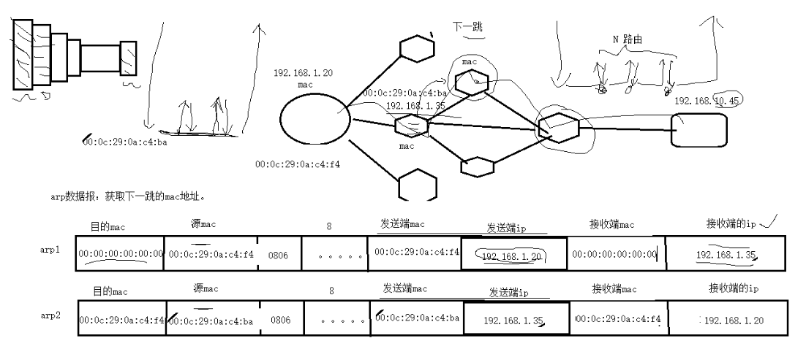

|基本套接字编程|高级套接字编程|附录|
|:--:|:--:|:--:|
|[一.套接字编程简介](#ch1)<br>[二.基本TCP套接字编程](#ch2)<br>[三.基本UDP套接字编程](#ch3)<br>[四.I/O复用](#ch4)<br>[五.套接字选项](#ch5)<br>[六.名字与数值转换](#ch6)|[七.高级I/O函数](#ch7)<br>[八.Unix域协议](#ch8)<br>[九.非阻塞式I/O](#ch9)<br>[十.线程](#ch10)<br>[十一.客户/服务器程序设计范式](#ch11)|[TCP回射服务器程序](#fl1)<br>[UDP回射服务器程序](#fl2)<br>[类型与头文件映射表](#fl3)<br>[函数与头文件映射表](#fl4)|

<br>
<br>

<h2 id="ch1"></h2>
* [一.套接字编程简介](#一套接字编程简介)
    * [1.端口号与套接字](#1端口号与套接字)
        * [1.1 端口号](#11-端口号)
        * [1.2 套接字](#12-套接字)
        * [1.3 TCP并发服务器中的套接字对](#13-tcp并发服务器中的套接字对)
    * [2.套接字地址结构](#2套接字地址结构)
        * [2.1 值-结果参数](#21-值-结果参数)
        * [2.2 字节操纵函数](#22-字节操纵函数)
        * [2.3 字节序](#23-字节序)
            - htons和htonl（主机字节序 -> 网络字节序）
            - ntohs和ntohl（网络字节序 -> 主机字节序）
        * [2.4 地址转换](#24-地址转换)
            - 只支持IPV4：
                + inet_aton和inet_addr（ASCII地址 -> 对应网络字节序）
                + inet_ntoa（网络字节序 -> 对应的ASCII地址）
            - 既支持IPV4也支持IPV6：
                + inet_pton（ASCII地址 -> 对应网络字节序）
                + inet_ntop（网络字节序 -> 对应的ASCII地址）

<h2 id="ch2"></h2>
* [二.基本TCP套接字编程](#二基本tcp套接字编程) 
    * [1.连接管理](#1连接管理)
    * [2.缓冲区](#2缓冲区)
    * [3.相关函数](#3相关函数)
        - 1）[socket](#1socket函数)
        - 2）[connect](#2connect函数)
        - 3）[bind](#3bind函数)
        - 4）[listen](#4listen函数)
        - 5）[accept](#5accept函数)
        - 6）[close](#6close函数)
        - 7）[shutdown](#7shutdown函数)
        - 8）[getsockname和getpeername](#8getsockname和getpeername函数)

<h2 id="ch3"></h2>
* [三.基本UDP套接字编程](#三基本udp套接字编程)
    * [1.缓冲区](#1缓冲区)
    * [2.相关函数](#2相关函数)
        - 1）[recvfrom和sendto](#1recvfrom与sendto函数)
        - 2）[connect](#2连接的udp套接字)

<h2 id="ch4"></h2>
* [四.I/O复用](#四io复用)
    * [1.select](#1select)
        * [1.1 描述符就绪条件](#11-描述符就绪条件) 
        * [1.2 select的优缺点](#12-select的优缺点)
        * [1.3 使用select实现TCP回射服务器](#13-使用select实现tcp回射服务器)
    * [2.pselect](#2pselect)
    * [3.poll](#3poll)
        * [3.1 事件](#31-事件) 
        * [3.2 poll的优缺点](#32-poll的优缺点) 
    * [4.epoll](#4epoll) 
        * [4.1 工作模式](#41-工作模式) 
        * [4.2 epoll的优缺点](#42-epoll的优缺点)

<h2 id="ch5"></h2>
* [五.套接字选项](#五套接字选项)
    * [1.获取及设置套接字选项的函数](#1获取及设置套接字选项的函数)
        - 1）[getsockopt和setsockopt](#1getsockopt和setsockopt函数)（设置或获取套接字选项）
        - 2）[fcntl](#2fcntl函数)（设置或获取影响套接字描述符的标志）
        - 3）ioctl
    * [2.套接字选项分类](#2套接字选项分类)
        * [2.1 通用套接字选项](#21-通用套接字选项)
            - 1）[SO_ERROR](#1so_error可以获取不能设置)
            - 2）[SO_KEEPALIVE](#2so_keepalive)
            - 3）[SO_LINGER](#3so_linger)
            - 4）[SO_RCVBUF和SO_SNDBUF](#4so_rcvbuf和so_sndbuf)
            - 5）[SO_RCVLOWAT和SO_SNDLOWAT](#5so_rcvlowat和so_sndlowat)
            - 6）[SO_REUSEADDR和SO_REUSEPORT](#6so_reuseaddr和so_reuseport)
        * [2.2 TCP套接字选项](#22-tcp套接字选项)
            - 1）[TCP_MAXSEG](#1tcp_maxseg)
            - 2）[TCP_NODELAY](#2tcp_nodelay)

<h2 id="ch6"></h2>
* [六.名字与数值转换](#六名字与数值转换)
    * [1.主机名字与IP地址之间的转换](#1主机名字与ip地址之间的转换)
        - 1）[gethostbyname](#1gethostbyname函数)（IPV4）
        - 2）[gethostbyaddr](#2gethostbyaddr函数)（IPV4）
    * [2.服务名字与端口号之间的转换](#2服务名字与端口号之间的转换)
        - 1）[getservbyname](#1getservbyname函数)
        - 2）[getservbyport](#2getservbyport函数)
    * [3.主机与服务名字转IP地址与端口号](#3主机与服务名字转ip地址与端口号)
        - 1）[getaddrinfo与freeaddrinfo](#1getaddrinfo函数)（协议无关）
        - getaddrinfo的封装函数：
            + 2）[host_serv](#2host_serv函数)
            + 3）[tcp_connect](#3tcp_connect函数)
            + 4）[tcp_listen](#4tcp_listen函数)
            + 5）[udp_client](#5udp_client函数)
            + 6）[udp_connect](#6udp_connect函数)
            + 7）[udp_server](#7udp_server函数)
    * [4.IP地址与端口号转主机与服务名字](#4ip地址与端口号转主机与服务名字)
        - 1）[getnameinfo](#getnameinfo函数)
    * [5.其它网络相关信息](#5其它网络相关信息)
        - 1）getXXXent
        - 2）setXXXent
        - 3）endXXXent

<h2 id="ch7"></h2>
* [七.高级I/O函数](#七高级io函数)
    * [1.套接字超时](#1套接字超时) 
    * [2.排队的数据量](#2排队的数据量)
    * [3.Unix I/O函数](#3unix-io函数)
        - 1）[recv和send](#1recv和send函数)
        - 2）[readv和writev](#2readv和writev函数)
        - 3）[recvmsg和sendmsg](#3recvmsg和sendmsg函数)
        - [5组I/O函数的对比](#5组io函数的对比)
    * [4.标准I/O函数](#4标准io函数)

<h2 id="ch8"></h2>
* [八.Unix域协议](#八unix域协议)
    * [1.Unix域套接字地址结构](#1unix域套接字地址结构)
    * [2.相关函数](#1socketpair函数)
        - 1）[socketpair](#1socketpair函数)
    * [3.描述符传递](#3描述符传递)

<h2 id="ch9"></h2>
* [九.非阻塞式I/O](#九非阻塞式io)
    * [1.非阻塞读和写](#1非阻塞读和写)
    * [2.非阻塞connect](#2非阻塞connect)
    * [3.非阻塞accept](#3非阻塞accept)

<h2 id="ch10"></h2>
* [十.线程](#十线程)
    * [1.相关函数](#1相关函数)
        - 1）[pthread_create函数](#1pthread_create函数)
        - 2）[pthread_join函数](#2pthread_join函数)
        - 3）[pthread_self函数](#3pthread_self函数)
        - 4）[pthread_detach函数](#4pthread_detach函数)
        - 5）[pthread_exit函数](#5pthread_exit函数)
        - 6）[pthread_equal函数](#6pthread_equal函数)
        - 7）[pthread_cancel函数](#7pthread_cancel函数)
        - 8）[pthread_cleanup_push和pthread_cleanup_pop函数](#8pthread_cleanup_push和pthread_cleanup_pop函数)
    * [2.线程安全的函数](#2线程安全的函数)
    * [3.线程特定数据](#3线程特定数据)
        - 1）[pthread_once和pthread_key_create函数](#1pthread_once和pthread_key_create函数)
        - 2）[pthread_getspecific和pthread_setspecific函数](#2pthread_getspecific和pthread_setspecific函数)
        - 3）[pthread_key_delete函数](#3pthread_key_delete函数)
    * [4.互斥锁](#4互斥锁)
    * [5.条件变量](#5条件变量)

<br>
<br>
<br>
<br>

# 网络基础

## 1.协议的概念

### 什么是协议

应用的角度出发，协议可理解为“规则”，是数据传输和数据的解释的规则。
假设，A、B双方欲传输文件。规定：
第一次，传输文件名，接收方接收到文件名，应答OK给传输方；
第二次，发送文件的尺寸，接收方接收到该数据再次应答一个OK；
第三次，传输文件内容。同样，接收方接收数据完成后应答OK表示文件内容接收成功。
由此，无论A、B之间传递何种文件，都是通过三次数据传输来完成。A、B之间形成了一个最简单的数据传输规则。双方都按此规则发送、接收数据。A、B之间达成的这个相互遵守的规则即为协议。
这种仅在A、B之间被遵守的协议称之为原始协议。当此协议被更多的人采用，不断的增加、改进、维护、完善。最终形成一个稳定的、完整的文件传输协议，被广泛应用于各种文件传输过程中。该协议就成为一个标准协议。**最早的ftp协议就是由此衍生而来。**

**TCP协议注重数据的传输。http协议着重于数据的解释。**

### 典型协议

**传输层** 常见协议有TCP/UDP协议。

**应用层** 常见的协议有HTTP协议，FTP协议。

**网络层** 常见协议有IP协议、ICMP协议、IGMP协议。

**网络接口层** 常见协议有ARP协议、RARP协议。

TCP[传输控制协议](http://baike.baidu.com/view/544903.htm)（Transmission Control Protocol）是一种面向连接的、可靠的、基于字节流的[传输层](http://baike.baidu.com/view/239605.htm)通信协议。

UDP用户数据报协议（User Datagram Protocol）是[OSI](http://baike.baidu.com/view/113948.htm)参考模型中一种无连接的[传输层](http://baike.baidu.com/view/239605.htm)协议，提供面向事务的简单不可靠信息传送服务。

HTTP[超文本传输协议](http://baike.baidu.com/view/468465.htm)（Hyper Text Transfer Protocol）是[互联网](http://baike.baidu.com/view/6825.htm)上应用最为广泛的一种[网络协议](http://baike.baidu.com/view/16603.htm)。

FTP文件传输协议（File Transfer Protocol）

IP协议是[因特网](http://baike.baidu.com/view/1706.htm)互联协议（Internet Protocol）

ICMP协议是Internet控制[报文](http://baike.baidu.com/view/175122.htm)协议（Internet Control Message Protocol）它是[TCP/IP协议族](http://baike.baidu.com/view/2221037.htm)的一个子协议，用于在IP[主机](http://baike.baidu.com/view/23880.htm)、[路由](http://baike.baidu.com/view/18655.htm)器之间传递控制消息。

IGMP协议是 Internet 组管理协议（Internet Group Management Protocol），是因特网协议家族中的一个组播协议。该协议运行在主机和组播路由器之间。

[ARP](http://baike.baidu.com/view/32698.htm)协议是正向[地址解析协议](http://baike.baidu.com/view/149421.htm)（Address Resolution Protocol），通过已知的IP，寻找对应主机的[MAC地址](http://baike.baidu.com/view/69334.htm)。

[RARP](http://baike.baidu.com/view/32772.htm)是反向地址转换协议，通过MAC地址确定IP地址。

## 2.网络应用程序设计模式

### C/S模式

​         传统的网络应用设计模式，客户机(client)/服务器(server)模式。需要在通讯两端各自部署客户机和服务器来完成数据通信。

### B/S模式

​		浏览器()/服务器(server)模式。只需在一端部署服务器，而另外一端使用每台PC都默认配置的浏览器即可完成数据的传输。

### 优缺点

​         对于C/S模式来说，其优点明显。客户端位于目标主机上可以保证性能，**将数据缓存至客户端本地，**从而**提高数据传输效率**。且，一般来说客户端和服务器程序由一个开发团队创作，所以他们之间**所采用的协议相对灵活**。可以在标准协议的基础上根据需求裁剪及定制。**例如，腾讯公司所采用的通信协议，即为ftp协议的修改剪裁版。**

​         因此，传统的网络应用程序及较大型的网络应用程序都首选C/S模式进行开发。如，知名的网络游戏魔兽世界。3D画面，数据量庞大，使用C/S模式可以提前在本地进行大量数据的缓存处理，从而提高观感。

​         C/S模式的缺点也较突出。由于客户端和服务器都需要有一个开发团队来完成开发。**工作量**将成倍提升，开发周期较长。另外，从用户角度出发，需要将客户端安插至用户主机上，对用户主机的**安全性构成威胁**。这也是很多用户不愿使用C/S模式应用程序的重要原因。

 

​         B/S模式相比C/S模式而言，由于它没有独立的客户端，使用标准浏览器作为客户端，其工作**开发量较小**。只需开发服务器端即可。另外由于其采用浏览器显示数据，因此移植性非常好，**不受平台限制**。如早期的偷菜游戏，在各个平台上都可以完美运行。

​         B/S模式的缺点也较明显。由于使用第三方浏览器，因此**网络应用支持受限**。另外，没有客户端放到对方主机上，**缓存数据不尽如人意**，从而传输数据量受到限制。应用的观感大打折扣。第三，必须与浏览器一样，采用标准http协议进行通信，**协议选择不灵活**。

​         因此在开发过程中，模式的选择由上述各自的特点决定。根据实际需求选择应用程序设计模式。

## 3.分层模型

### OSI七层模型


\1.       **物理层**：主要定义物理设备标准，如网线的接口类型、光纤的接口类型、各种传输介质的传输速率等。它的**主要作用是传输比特流**（**就是由1、0转化为电流强弱来进行传输，到达目的地后再转化为1、0，也就是我们常说的数模转换与模数转换**）。这一层的数据叫做比特。

\2.       **数据链路层**：**定义了如何让格式化数据以帧为单位进行传输，以及如何让控制对物理介质的访问**。这一层通常还提供错误检测和纠正，以确保数据的可靠传输。如：串口通信中使用到的115200、8、N、1

\3.       **网络层**：在位于不同地理位置的网络中的两个主机系统之间提供连接和路径选择。Internet的发展使得从世界各站点访问信息的用户数大大增加，而网络层正是管理这种连接的层。

\4.       **传输层**：**定义了一些传输数据的协议和端口号（WWW端口80等**），如：TCP（传输控制协议，传输效率低，可靠性强，用于传输可靠性要求高，数据量大的数据），UDP（用户数据报协议，与TCP特性恰恰相反，用于传输可靠性要求不高，数据量小的数据，如QQ聊天数据就是通过这种方式传输的）。 主要是将从下层接收的数据进行分段和传输，到达目的地址后再进行重组。常常把这一层数据叫做段。

\5.       **会话层**：通过传输层(端口号：传输端口与接收端口)建立数据传输的通路。主要在你的系统之间发起会话或者接受会话请求（设备之间需要互相认识可以是IP也可以是MAC或者是主机名）。

\6.       **表示层**：**可确保一个系统的应用层所发送的信息可以被另一个系统的应用层读取**。例如，PC程序与另一台计算机进行通信，其中一台计算机使用扩展二一十进制交换码(EBCDIC)，而另一台则使用美国信息交换标准码（ASCII）来表示相同的字符。如有必要，表示层会通过使用一种通格式来实现多种数据格式之间的转换。

\7.       **应用层**：是最靠近用户的OSI层。这一层为用户的应用程序（例如电子邮件、文件传输和终端仿真）提供网络服务。

### TCP/IP四层模型

TCP/IP网络协议栈分为应用层（Application）、传输层（Transport）、网络层（Network）和链路层（Link）四层。如下图所示：


一般在应用开发过程中，讨论最多的是TCP/IP模型。

## 4.通信过程

两台计算机通过TCP/IP协议通讯的过程如下所示：


封装：

上图对应两台计算机在**同一网段中**的情况，如果两台计算机在不同的网段中，那么数据从一台计算机到另一台计算机传输过程中要经过一个或多个路由器，如下图所示：


链路层有以太网、令牌环网等标准，链路层负责网卡设备的驱动、帧同步（即从网线上检测到什么信号算作新帧的开始）、冲突检测（如果检测到冲突就自动重发）、数据差错校验等工作。**交换机是工作在链路层的网络设备，可以在不同的链路层网络之间转发数据帧（比如十兆以太网和百兆以太网之间、以太网和令牌环网之间），由于不同链路层的帧格式不同，交换机要将进来的数据包拆掉链路层首部重新封装之后再转发。**

网络层的IP协议是构成Internet的基础。Internet上的主机通过IP地址来标识，Internet上有大量路由器负责根据IP地址选择合适的路径转发数据包，数据包从Internet上的源主机到目的主机往往要经过十多个路由器。**路由器是工作在第三层的网络设备，同时兼有交换机的功能，可以在不同的链路层接口之间转发数据包**，因此路由器需要将进来的数据包拆掉网络层和链路层两层首部并重新封装。IP协议不保证传输的可靠性，数据包在传输过程中可能丢失，可靠性可以在上层协议或应用程序中提供支持。

**网络层负责点到点（ptop，point-to-point）的传输（这里的“点”指主机或路由器），而传输层负责端到端（etoe，end-to-end）的传输（这里的“端”指源主机和目的主机）。传输层可选择TCP或UDP协议。**

TCP是一种面向连接的、可靠的协议，有点像打电话，双方拿起电话互通身份之后就建立了连接，然后说话就行了，这边说的话那边保证听得到，并且是按说话的顺序听到的，说完话挂机断开连接。也就是说TCP传输的双方需要首先建立连接，之后由TCP协议**保证数据收发的可靠性，丢失的数据包自动重发**，上层应用程序收到的总是可靠的数据流，通讯之后关闭连接。

UDP是无连接的传输协议，不保证可靠性，有点像寄信，信写好放到邮筒里，既不能保证信件在邮递过程中不会丢失，也不能保证信件寄送顺序。**使用UDP协议的应用程序需要自己完成丢包重发、消息排序等工作。**

目的主机收到数据包后，如何经过各层协议栈最后到达应用程序呢？其过程如下图所示：


以太网驱动程序首先根据以太网首部中的“上层协议”字段确定该数据帧的有效载荷（payload，指除去协议首部之外实际传输的数据）是IP、ARP还是RARP协议的数据报，然后交给相应的协议处理。假如是IP数据报，IP协议再根据IP首部中的“上层协议”字段确定该数据报的有效载荷是TCP、UDP、ICMP还是IGMP，然后交给相应的协议处理。假如是TCP段或UDP段，TCP或UDP协议再根据TCP首部或UDP首部的“端口号”字段确定应该将应用层数据交给哪个用户进程。IP地址是标识网络中不同主机的地址，而端口号就是同一台主机上标识不同进程的地址，IP地址和端口号合起来标识网络中唯一的进程。

虽然IP、ARP和RARP数据报都需要以太网驱动程序来封装成帧，但是从功能上划分，**ARP和RARP属于链路层，IP属于网络层。虽然ICMP、IGMP、TCP、UDP的数据都需要IP协议来封装成数据报，但是从功能上划分，ICMP、IGMP与IP同属于网络层，TCP和UDP属于传输层。**

**寻路：**


## 5.协议格式

### 数据包封装

**传输层及其以下的机制由内核提供，应用层由用户进程提供**（后面将介绍如何使用socket API编写应用程序），应用程序对通讯数据的含义进行解释，而传输层及其以下处理通讯的细节，将数据从一台计算机通过一定的路径发送到另一台计算机。应用层数据通过协议栈发到网络上时，每层协议都要加上一个数据首部（header），称为封装（Encapsulation），如下图所示：


不同的协议层对数据包有不同的称谓，在传输层叫做段（segment），在网络层叫做数据报（datagram），在链路层叫做帧（frame）。数据封装成帧后发到传输介质上，到达目的主机后每层协议再剥掉相应的首部，最后将应用层数据交给应用程序处理。

### 以太网帧格式

以太网的帧格式如下所示：（数据指的是不包括以太网的头部和尾部）


其中的源地址和目的地址是指网卡的硬件地址（也叫MAC地址），长度是48位，是在网卡出厂时固化的。可在shell中使用ifconfig命令查看，“HWaddr 00:15:F2:14:9E:3F”部分就是硬件地址。**协议字段有三种值，分别对应IP、ARP、RARP。帧尾是CRC校验码。**

**以太网帧中的数据长度规定最小46字节，最大1500字节**，ARP和RARP数据包的长度不够46字节，要在后面补填充位。**最大值1500称为以太网的最大传输单元（MTU）**，不同的网络类型有不同的MTU，如果一个数据包从以太网路由到拨号链路上，数据包长度大于拨号链路的MTU，则需要对数据包进行分片（fragmentation）。ifconfig命令输出中也有“MTU:1500”。注意，MTU这个概念指数据帧中有效载荷的最大长度，不包括帧头长度。

### ARP数据报格式

​		在网络通讯时，源主机的应用程序知道目的主机的IP地址和端口号，**却不知道目的主机的硬件地址**，而数据包首先是被网卡接收到再去处理上层协议的，如果接收到的数据包的硬件地址与本机不符，则直接丢弃。**因此在通讯前必须获得目的主机的硬件地址。ARP协议就起到这个作用**。源主机发出ARP请求，询问“IP地址是192.168.0.1的主机的硬件地址是多少”，并将这个请求广播到本地网段（以太网帧首部的硬件地址填FF:FF:FF:FF:FF:FF表示广播），目的主机接收到广播的ARP请求，发现其中的IP地址与本机相符，则发送一个ARP应答数据包给源主机，将自己的硬件地址填写在应答包中。

每台主机都维护一个ARP缓存表，可以用arp -a命令查看。缓存表中的表项有过期时间（一般为20分钟），如果20分钟内没有再次使用某个表项，则该表项失效，下次还要发ARP请求来获得目的主机的硬件地址。想一想，为什么表项要有过期时间而不是一直有效？

ARP数据报的格式如下所示：


源MAC地址、目的MAC地址在以太网首部和ARP请求中各出现一次，对于链路层为以太网的情况是多余的，但如果链路层是其它类型的网络则有可能是必要的。硬件类型指链路层网络类型，1为以太网，协议类型指要转换的地址类型，0x0800为IP地址，后面两个地址长度对于以太网地址和IP地址分别为6和4（字节），op字段为1表示ARP请求，op字段为2表示ARP应答。

看一个具体的例子。

**请求帧如下**（为了清晰在每行的前面加了字节计数，每行16个字节）：

**以太网首部（14字节）**

0000: ff ff ff ff ff ff 00 05 5d 61 58 a8 08 06

**ARP帧（28字节）**

0000: 00 01

0010: 08 00 06 04 00 01 00 05 5d 61 58 a8 c0 a8 00 37

0020: 00 00 00 00 00 00 c0 a8 00 02

**填充位（18字节）**

0020: 00 77 31 d2 50 10

0030: fd 78 41 d3 00 00 00 00 00 00 00 00

**以太网首部：**目的主机采用广播地址，源主机的MAC地址是00:05:5d:61:58:a8，上层协议类型0x0806表示ARP。

**ARP帧：**硬件类型0x0001表示以太网，协议类型0x0800表示IP协议，硬件地址（MAC地址）长度为6，协议地址（IP地址）长度为4，op为0x0001表示请求目的主机的MAC地址，源主机MAC地址为00:05:5d:61:58:a8，源主机IP地址为c0 a8 00 37（192.168.0.55），目的主机MAC地址全0待填写，目的主机IP地址为c0 a8 00 02（192.168.0.2）。

由于以太网规定最小数据长度为46字节，ARP帧长度只有28字节，因此有18字节填充位，填充位的内容没有定义，与具体实现相关。

**应答帧**如下：

以太网首部

0000: 00 05 5d 61 58 a8 00 05 5d a1 b8 40 08 06

ARP帧

0000: 00 01

0010: 08 00 06 04 00 02 00 05 5d a1 b8 40 c0 a8 00 02

0020: 00 05 5d 61 58 a8 c0 a8 00 37

填充位

0020: 00 77 31 d2 50 10

0030: fd 78 41 d3 00 00 00 00 00 00 00 00

以太网首部：目的主机的MAC地址是00:05:5d:61:58:a8，源主机的MAC地址是00:05:5d:a1:b8:40，上层协议类型0x0806表示ARP。

ARP帧：硬件类型0x0001表示以太网，协议类型0x0800表示IP协议，硬件地址（MAC地址）长度为6，协议地址（IP地址）长度为4，op为0x0002表示应答，源主机MAC地址为00:05:5d:a1:b8:40，源主机IP地址为c0 a8 00 02（192.168.0.2），目的主机MAC地址为00:05:5d:61:58:a8，目的主机IP地址为c0 a8 00 37（192.168.0.55）。

使用示意：



思考题：如果源主机和目的主机不在同一网段，ARP请求的广播帧无法穿过路由器，源主机如何与目的主机通信？

更详细版本：


真正的目的地址的ip是存放到网络层的ip协议里的，每个路由器会根据真正的目的的ip地址对照自己的路由表从而选择下一跳的位置。

### ip段格式


IP数据报的首部长度和数据长度都是可变长的，**但总是4字节的整数倍**。对于IPv4，4位版本字段是4。4位首部长度的数值是以4字节为单位的，**最小值为5**，也就是说首部长度最小是4x5=20字节，也就是不带任何选项的IP首部，4位能表示的最大值是15，也就是说**首部长度最大是60字节**。8位TOS字段有3个位用来指定IP数据报的优先级（目前已经废弃不用），还有4个位表示可选的服务类型（最小延迟、最大?吐量、最大可靠性、最小成本），还有一个位总是0。总长度是整个数据报（包括IP首部和IP层payload）的字节数。每传一个IP数据报，16位的标识加1，可用于分片和重新组装数据报。3位标志和13位片偏移用于分片。TTL（Time to live)是这样用的：源主机为数据包设定一个生存时间，比如64，每过一个路由器就把该值减1，如果减到0就表示路由已经太长了仍然找不到目的主机的网络，就丢弃该包，因此这个生存时间的单位不是秒，而是跳（hop）。协议字段指示上层协议是TCP、UDP、ICMP还是IGMP。然后是校验和，只校验IP首部，数据的校验由更高层协议负责。IPv4的IP地址长度为32位。

想一想，前面讲了以太网帧中的最小数据长度为46字节，不足46字节的要用填充字节补上，那么如何界定这46字节里前多少个字节是IP、ARP或RARP数据报而后面是填充字节？

### UDP数据报格式


下面分析一帧基于UDP的TFTP协议帧。

以太网首部

0000: 00 05 5d 67 d0 b1 00 05 5d 61 58 a8 08 00

IP首部

0000: 45 00

0010: 00 53 93 25 00 00 80 11 25 ec c0 a8 00 37 c0 a8

0020: 00 01

UDP首部

0020： 05 d4 00 45 00 3f ac 40

TFTP协议

0020: 00 01 'c'':''\''q'

0030: 'w''e''r''q''.''q''w''e'00 'n''e''t''a''s''c''i'

0040: 'i'00 'b''l''k''s''i''z''e'00 '5''1''2'00 't''i'

0050: 'm''e''o''u''t'00 '1''0'00 't''s''i''z''e'00 '0'

0060: 00以太网首部：源MAC地址是00:05:5d:61:58:a8，目的MAC地址是00:05:5d:67:d0:b1，上层协议类型0x0800表示IP。

IP首部：每一个字节0x45包含4位版本号和4位首部长度，版本号为4，即IPv4，首部长度为5，说明IP首部不带有选项字段。服务类型为0，没有使用服务。16位总长度字段（包括IP首部和IP层payload的长度）为0x0053，即83字节，加上以太网首部14字节可知整个帧长度是97字节。IP报标识是0x9325，标志字段和片偏移字段设置为0x0000，就是DF=0允许分片，MF=0此数据报没有更多分片，没有分片偏移。TTL是0x80，也就是128。上层协议0x11表示UDP协议。IP首部校验和为0x25ec，源主机IP是c0 a8 00 37（192.168.0.55），目的主机IP是c0 a8 00 01（192.168.0.1）。

**UDP首部**：源端口号0x05d4（1492）是客户端的端口号，目的端口号0x0045（69）是TFTP服务的well-known端口号。UDP报长度为0x003f，即63字节，包括UDP首部和UDP层pay-load的长度。UDP首部和UDP层payload的校验和为0xac40。

**TFTP是基于文本的协议，各字段之间用字节0分隔，开头的00 01表示请求读取一个文件**，接下来的各字段是：

c:\qwerq.qwe

netascii

blksize 512

timeout 10

tsize 0

一般的网络通信都是像TFTP协议这样，通信的双方分别是客户端和服务器，客户端主动发起请求（上面的例子就是客户端发起的请求帧），而服务器被动地等待、接收和应答请求。客户端的IP地址和端口号唯一标识了该主机上的TFTP客户端进程，服务器的IP地址和端口号唯一标识了该主机上的TFTP服务进程，由于客户端是主动发起请求的一方，它必须知道服务器的IP地址和TFTP服务进程的端口号，所以，一些常见的网络协议有默认的服务器端口，例如HTTP服务默认TCP协议的80端口，FTP服务默认TCP协议的21端口，TFTP服务默认UDP协议的69端口（如上例所示）。在使用客户端程序时，必须指定服务器的主机名或IP地址，如果不明确指定端口号则采用默认端口，请读者查阅ftp、tftp等程序的man page了解如何指定端口号。/etc/services中列出了所有well-known的服务端口和对应的传输层协议，这是由IANA（Internet Assigned Numbers Authority）规定的，其中有些服务既可以用TCP也可以用UDP，为了清晰，IANA规定这样的服务采用相同的TCP或UDP默认端口号，而另外一些TCP和UDP的相同端口号却对应不同的服务。

很多服务有well-known的端口号，然而客户端程序的端口号却不必是well-known的，往往是每次运行客户端程序时由系统自动分配一个空闲的端口号，用完就释放掉，称为ephemeral的端口号，想想这是为什么？

前面提过，UDP协议不面向连接，也不保证传输的可靠性，例如：

发送端的UDP协议层只管把应用层传来的数据封装成段交给IP协议层就算完成任务了，如果因为网络故障该段无法发到对方，UDP协议层也不会给应用层返回任何错误信息。

接收端的UDP协议层只管把收到的数据根据端口号交给相应的应用程序就算完成任务了，如果发送端发来多个数据包并且在网络上经过不同的路由，到达接收端时顺序已经错乱了，UDP协议层也不保证按发送时的顺序交给应用层。

通常接收端的UDP协议层将收到的数据放在一个固定大小的缓冲区中等待应用程序来提取和处理，如果应用程序提取和处理的速度很慢，而发送端发送的速度很快，就会丢失数据包，UDP协议层并不报告这种错误。

因此，使用UDP协议的应用程序必须考虑到这些可能的问题并实现适当的解决方案，例如等待应答、超时重发、为数据包编号、流量控制等。一般使用UDP协议的应用程序实现都比较简单，只是发送一些对可靠性要求不高的消息，而不发送大量的数据。例如，基于UDP的TFTP协议一般只用于传送小文件（所以才叫trivial的ftp），而基于TCP的FTP协议适用于     各种文件的传输。TCP协议又是如何用面向连接的服务来代替应用程序解决传输的可靠性问题呢。

### TCP数据报格式


与UDP协议一样也有源端口号和目的端口号，通讯的双方由IP地址和端口号标识。32位序号、32位确认序号、窗口大小稍后详细解释。4位首部长度和IP协议头类似，表示TCP协议头的长度，以4字节为单位，因此TCP协议头最长可以是4x15=60字节，如果没有选项字段，TCP协议头最短20字节。URG、ACK、PSH、RST、SYN、FIN是六个控制位，本节稍后将解释SYN、ACK、FIN、RST四个位，其它位的解释从略。16位检验和将TCP协议头和数据都计算在内。紧急指针和各种选项的解释从略。

## 6.NAT映射和打洞机制

NAT映射：


打洞机制：保证数据传输的效率和实时性


# 一.套接字编程简介

### 套接字概念

Socket本身有“插座”的意思，在Linux环境下，用于表示进程间网络通信的特殊文件类型。**本质为内核借助缓冲区形成的伪文件。**

既然是文件，那么理所当然的，我们可以使用文件描述符引用套接字。与管道类似的，Linux系统将其封装成文件的目的是为了统一接口，使得读写套接字和读写文件的操作一致。区别是管道主要应用于本地进程间通信，而套接字多应用于网络进程间数据的传递。

套接字的内核实现较为复杂，不宜在学习初期深入学习。

在TCP/IP协议中，“IP地址+TCP或UDP端口号”唯一标识网络通讯中的一个进程。“IP地址+端口号”就对应一个socket。欲建立连接的两个进程各自有一个socket来标识，那么这两个socket组成的socket pair就唯一标识一个连接。因此可以用Socket来描述网络连接的一对一关系。

套接字通信原理如下图所示：


**在网络通信中，套接字一定是成对出现的。**一端的发送缓冲区对应对端的接收缓冲区。我们使用同一个文件描述符索发送缓冲区和接收缓冲区。

TCP/IP协议最早在BSD UNIX上实现，为TCP/IP协议设计的应用层编程接口称为socket API。本章的主要内容是socket API，主要介绍TCP协议的函数接口，最后介绍UDP协议和UNIX Domain Socket的函数接口。


### 预备知识

#### 1.网络字节序

​		我们已经知道，内存中的多字节数据相对于内存地址有大端和小端之分，磁盘文件中的多字节数据相对于文件中的偏移地址也有大端小端之分。网络数据流同样有大端小端之分，那么如何定义网络数据流的地址呢？发送主机通常将发送缓冲区中的数据按内存地址从低到高的顺序发出，接收主机把从网络上接到的字节依次保存在接收缓冲区中，也是按内存地址从低到高的顺序保存，因此，**网络数据流的地址应这样规定：先发出的数据是低地址，后发出的数据是高地址。**

**TCP/IP协议规定，网络数据流应采用大端字节序，即低地址高字节**。例如上一节的UDP段格式，地址0-1是16位的源端口号，如果这个端口号是1000（0x3e8），则地址0是0x03，地址1是0xe8，也就是先发0x03，再发0xe8，这16位在发送主机的缓冲区中也应该是低地址存0x03，高地址存0xe8。但是，如果发送主机是小端字节序的，这16位被解释成0xe803，而不是1000。因此，发送主机把1000填到发送缓冲区之前需要做字节序的转换。同样地，接收主机如果是小端字节序的，接到16位的源端口号也要做字节序的转换。如果主机是大端字节序的，发送和接收都不需要做转换。同理，32位的IP地址也要考虑网络字节序和主机字节序的问题。

为使网络程序具有可移植性，使同样的C代码在大端和小端计算机上编译后都能正常运行，可以调用以下库函数做**网络字节序和主机字节序的转换**。

```c
#include <arpa/inet.h>

uint32_t htonl(uint32_t hostlong);
uint16_t htons(uint16_t hostshort);
uint32_t ntohl(uint32_t netlong);
uint16_t ntohs(uint16_t netshort);
```

h表示host，n表示network，l表示32位长整数，s表示16位短整数。

如果主机是小端字节序，这些函数将参数做相应的大小端转换然后返回，如果主机是大端字节序，这些函数不做转换，将参数原封不动地返回。这样转的太麻烦，所以有如下的函数可以直接转

#### 2.IP地址转换函数

早期：

```c
#include <sys/socket.h>
#include <netinet/in.h>
#include <arpa/inet.h>

int inet_aton(const char *cp, struct in_addr *inp);
in_addr_t inet_addr(const char *cp);
char *inet_ntoa(struct in_addr in);
```

只能处理IPv4的ip地址

不可重入函数

**注意参数是struct in_addr**

现在：

```c
#include <arpa/inet.h>

int inet_pton(int af, const char *src, void *dst);

const char *inet_ntop(int af, const void *src, char *dst, socklen_t size);
```

支持IPv4和IPv6

可重入函数

其中inet_pton和inet_ntop不仅可以转换IPv4的in_addr，还可以转换IPv6的in6_addr。

因此函数接口是void *addrptr。

#### 3.sockaddr数据结构

strcut	sockaddr 很多网络编程函数诞生早于IPv4协议，那时候都使用的是sockaddr结构体,为了向前兼容，现在sockaddr退化成了（void *）的作用，传递一个地址给函数，至于这个函数是sockaddr_in还是sockaddr_in6，由地址族确定，然后函数内部再强制类型转化为所需的地址类型。


```c
struct sockaddr {
	sa_family_t sa_family; 		/* address family, AF_xxx */
	char sa_data[14];			/* 14 bytes of protocol address */
};
```

使用 sudo grep -r  "struct sockaddr_in {"  /usr 命令可查看到struct	sockaddr_in结构体的定义。一般其默认的存储位置：/usr/include/linux/in.h 文件中。

```c
struct sockaddr_in {
	__kernel_sa_family_t sin_family; 			/* Address family */  	地址结构类型
	__be16 sin_port;					 		/* Port number */		端口号
	struct in_addr sin_addr;					/* Internet address */	IP地址
	/* Pad to size of `struct sockaddr'. */
	unsigned char __pad[__SOCK_SIZE__ - sizeof(short int) -
	sizeof(unsigned short int) - sizeof(struct in_addr)];
};
```

```c
struct in_addr {						/* Internet address. */
	__be32 s_addr;
};

struct sockaddr_in6 {
	unsigned short int sin6_family; 		/* AF_INET6 */
	__be16 sin6_port; 					/* Transport layer port # */
	__be32 sin6_flowinfo; 				/* IPv6 flow information */
	struct in6_addr sin6_addr;			/* IPv6 address */
	__u32 sin6_scope_id; 				/* scope id (new in RFC2553) */
};
```

```c
struct in6_addr {
	union {
		__u8 u6_addr8[16];
		__be16 u6_addr16[8];
		__be32 u6_addr32[4];
	} in6_u;
	#define s6_addr 		in6_u.u6_addr8
	#define s6_addr16 	in6_u.u6_addr16
	#define s6_addr32	 	in6_u.u6_addr32
};

#define UNIX_PATH_MAX 108
	struct sockaddr_un {
	__kernel_sa_family_t sun_family; 	/* AF_UNIX */
	char sun_path[UNIX_PATH_MAX]; 	/* pathname */
};
```

Pv4和IPv6的地址格式定义在netinet/in.h中，IPv4地址用sockaddr_in结构体表示，包括16位端口号和32位IP地址，IPv6地址用sockaddr_in6结构体表示，包括16位端口号、128位IP地址和一些控制字段。UNIX
Domain Socket的地址格式定义在sys/un.h中，用sock-addr_un结构体表示。各种socket地址结构体的开头都是相同的，前16位表示整个结构体的长度（并不是所有UNIX的实现都有长度字段，如Linux就没有），后16位表示地址类型。IPv4、IPv6和Unix Domain Socket的地址类型分别定义为常数AF_INET、AF_INET6、AF_UNIX。这样，只要取得某种sockaddr结构体的首地址，不需要知道具体是哪种类型的sockaddr结构体，就可以根据地址类型字段确定结构体中的内容。因此，socket API可以接受各种类型的sockaddr结构体指针做参数，例如bind、accept、connect等函数，这些函数的参数应该设计成void *类型以便接受各种类型的指针，但是sock API的实现早于ANSI C标准化，那时还没有void *类型，因此这些函数的参数都用struct sockaddr *类型表示，在传递参数之前要强制类型转换一下，例如：

```c
truct sockaddr_in servaddr;
bind(listen_fd, (struct sockaddr *)&servaddr, sizeof(servaddr));		/* initialize servaddr */
```