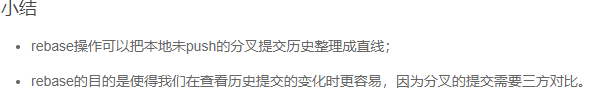

> 转自大神笔记微改：https://github.com/arkingc/note
>
> 内容源自[廖雪峰的Git教程](https://www.liaoxuefeng.com/wiki/0013739516305929606dd18361248578c67b8067c8c017b000)

[TOC]


	-u换为.


直接这三步搞定。

# 一.git配置

优先级：`--local > --global > --system`

> 用了`--global`这个参数，表示你这台机器上所有的Git仓库都会使用这个配置

### 1.配置git用户名和邮箱

```bash
git config --global user.name        # 查看
git config --global user.name 用户名  # 修改
git config --global user.email       # 查看
git config --global user.email 邮箱   # 修改
```


# 二.仓库

### 1.创建git仓库

```bash
git init 仓库名  #创建一个git仓库
git init        #将一个项目转化为使用git管理（创建.git目录）
```

示例：


目录结构：

```bash
project
   |------.git
            |--------branches
            |--------config        #仓库的配置文件
            |--------description
            |--------HEAD
            |--------hooks
            |--------info
            |--------objects
            |--------refs
```

> 隐藏目录`.git`不算工作区，而是Git的版本库

### 2.查看仓库状态

```bash
git status
```

### 3.远程仓库

> 最早，肯定只有一台机器有一个原始版本库，此后，别的机器可以“克隆”这个原始版本库，而且每台机器的版本库其实都是一样的，并没有主次之分
> 
> 实际情况往往是这样，找一台电脑充当服务器的角色，每天24小时开机，其他每个人都从这个“服务器”仓库克隆一份到自己的电脑上，并且各自把各自的提交推送到服务器仓库里，也从服务器仓库中拉取别人的提交
> 
> GitHub就是提供Git仓库托管服务的，所以，只要注册一个GitHub账号，就可以免费获得Git远程仓库，即Github为我们的git仓库提供了一个远程仓库，有了这个远程仓库，妈妈再也不用担心我的硬盘了

#### 1）为本地与GitHub的通信配置ssh

**本地git仓库和GitHub上的远程仓库之间的传输是通过SSH加密的，所以，需要一点设置**：

1. **创建ssh key**：
    ```bash
    ssh-keygen -t rsa -C "youremail@example.com"
    ```
2. **登录你的GitHub帐号，`Settings -> SSH and GPG keys -> new SSH key` ，将id_rsa.pub的内容复制进去**

> 为什么GitHub需要SSH Key呢？因为GitHub需要识别出你推送的提交确实是你推送的，而不是别人冒充的，而Git支持SSH协议，所以，GitHub只要知道了你的公钥，就可以确认只有你自己才能推送

#### 2）让本地git仓库和远程仓库同步

> 在有了本地git仓库后，还需创建对应的远程仓库

1. **在GitHub上创建远程仓库**（如果已有则省略）
2. **为本地仓库设置远程仓库信息**（如果同时需要为本地仓库添加多个远程仓库（如果github+码云），则可以将`origin`分别换成`github`和`gitee`，推送操作时也要修改`origin`。添加后，远程库的名字就是`origin`，这是Git默认的叫法，也可以改成别的，但是`origin`这个名字一看就知道是远程库）
    ```bash
    git remote add origin https://github.com/用户名/仓库名
    ```
    * **删除本地仓库的远程仓库信息**：`git remote remove origin`
    * **修改远端地址**：`git remote set-url 新地址`
    * **查看远程仓库信息**：`git remote -v`
3. **将本地git仓库push到远程仓库**
    ```bash
    # 由于远程库是空的，我们第一次推送master分支时，加上了-u参数,Git不但会把本地的
    # master分支内容推送的远程新的master分支，还会把本地的master分支和远程的master
    # 分支关联起来，在以后的推送或者拉取时就可以简化命令
    git push [-u] origin 分支名
    ```

并不是一定要把本地分支往远程推送。哪些分支需要推送、哪些不需要呢？

* `master`：主分支，要时刻与远程同步
* `dev`：开发分支，团队所有成员都需要在上面工作，所有也需要与远程同步
* `bug`：只用于在本地修复bug，就没必要推送到远程了，除非老板要看看你每周修复了几个bug

### 4.协同工作

拉取分支：

```bash
git pull
```

`git clone`时，默认情况下只能看到本地的`master`分支。如果要在`dev`分支上开发，就必须创建远程`origin`的`dev`分支到本地，可以使用如下命令创建本地`dev`分支：

```bash
git checkout -b dev
```

将本地`dev`分支与远程`origin/dev`分支关联起来：

```bash
git branch --set-upstream dev origin/dev
```

### 5.使用GitHub

Bootstrap的官方仓库twbs/bootstrap、你在GitHub上克隆的仓库my/bootstrap，以及你自己克隆到本地电脑的仓库，他们的关系就像下图显示的那样：


如果你想修复bootstrap的一个bug，或者新增一个功能，立刻就可以开始干活，干完后，往自己的仓库推送

**如果你希望bootstrap的官方库能接受你的修改，你就可以在GitHub上发起一个pull request。当然，对方是否接受你的pull request就不一定了**


# 三.版本控制

隐藏目录`.git`不算工作区，而是Git的版本库。版本库里存了很多东西，其中最重要的就是**称为stage（或者叫index）的暂存区**。还有Git为我们自动创建的第一个分支`master`，以及指向`master`的一个指针叫`HEAD`


### 1.添加或删除修改

将修改添加到暂存区：

```bash
git add 文件/目录
```

从暂存区删除修改：

```bash
git rm --cached 文件/目录
```

以下命令可以将暂存区的修改重置，暂存区的改变会被移除到工作区：

```bash
git rest HEAD [文件名]
```

以下命令可以丢弃工作区的修改：

```bash
git checkout -- [文件名]
```

如果刚对一个文件进行了编辑，可以撤销文件的改变，回到编辑开始。命令其实起到“一键恢复”的作用，还可用于“误删恢复”。可以在 `git reset HEAD [文件名]` 后使用

### 2.提交版本

如果修改了readme.txt，添加了文件LICENSE，并将2者添加到暂存区后，暂存区的状态就变成这样：


使用commit提交修改，实际上就是把暂存区的所有内容提交到当前分支：

```bash
git commit -m '信息'
```


> commit相当于游戏里面一次存档。对应一个版本

### 3.改动查询

```bash
git diff [选项]           # 查看工作区中的修改
git diff [选项] --staged   # 查看已添加到暂存区的修改
git diff [选项] HEAD       # 查看当前所有未提交的修改

选项：
    --color-words： 颜色
    --stat：        不显示具体修改，只显示修改了的文件
```

### 4.版本回退

```bash
git reset --hard 版本ID/HEAD形式的版本

git reset --hard HEAD      # 当前版本
git reset --hard HEAD^     # 上一个版本
git reset --hard HEAD^^    # 上上个版本
git reset --hard HEAD~n    # 前n个版本
```

如果回到过去的版本，想要回到原来新的版本：

* 如果终端未关，可以找到新版本的id，通过上述命令回去新版本
* 如果终端已关，`git reflog`查看版本，再通过上述命令回去新版本

### 5.查看历史提交

```bash
git log [选项]

选项：
    --online：只显示提交提示信息
    --stat：添加每次提交包含的文件信息
    --path：查看每次提交改变的内容
    --graph
```

**加文件名可以显示具体文件相关的所有提交信息**

# 四.分支管理

## 1.创建和合并分支

在[版本回退](https://www.liaoxuefeng.com/wiki/896043488029600/897013573512192)里，你已经知道，每次提交，Git都把它们串成一条时间线，这条时间线就是一个分支。截止到目前，只有一条时间线，在Git里，这个分支叫主分支，即`master`分支。`HEAD`严格来说不是指向提交，而是指向`master`，`master`才是指向提交的，所以，`HEAD`指向的就是当前分支。

一开始的时候，`master`分支是一条线，Git用`master`指向最新的提交，再用`HEAD`指向`master`，就能确定当前分支，以及当前分支的提交点：


每次提交，`master`分支都会向前移动一步，这样，随着你不断提交，`master`分支的线也越来越长。

当我们创建新的分支，例如`dev`时，Git新建了一个指针叫`dev`，指向`master`相同的提交，再把`HEAD`指向`dev`，就表示当前分支在`dev`上：


你看，Git创建一个分支很快，因为除了增加一个`dev`指针，改改`HEAD`的指向，工作区的文件都没有任何变化！

不过，从现在开始，对工作区的修改和提交就是针对`dev`分支了，比如新提交一次后，`dev`指针往前移动一步，而`master`指针不变：


假如我们在`dev`上的工作完成了，就可以把`dev`合并到`master`上。Git怎么合并呢？最简单的方法，就是直接把`master`指向`dev`的当前提交，就完成了合并：


所以Git合并分支也很快！就改改指针，工作区内容也不变！

合并完分支后，甚至可以删除`dev`分支。删除`dev`分支就是把`dev`指针给删掉，删掉后，我们就剩下了一条`master`分支：


下面开始实战。

首先，我们创建`dev`分支，然后切换到`dev`分支：

```bash
$ git checkout -b dev
Switched to a new branch 'dev'
```

`git checkout`命令加上`-b`参数表示创建并切换，相当于以下两条命令：

```bash
$ git branch dev
$ git checkout dev
Switched to branch 'dev'
```

然后，用`git branch`命令查看当前分支：

```bash
$ git branch
* dev
  master
```

`git branch`命令会列出所有分支，当前分支前面会标一个`*`号。

然后，我们就可以在`dev`分支上正常提交，比如对`readme.txt`做个修改，加上一行：

```bash
Creating a new branch is quick.
```

然后提交：

```bash
$ git add readme.txt 
$ git commit -m "branch test"
[dev b17d20e] branch test
 1 file changed, 1 insertion(+)
```

现在，`dev`分支的工作完成，我们就可以切换回`master`分支：

```bash
$ git checkout master
Switched to branch 'master'
```

切换回`master`分支后，再查看一个`readme.txt`文件，刚才添加的内容不见了！因为那个提交是在`dev`分支上，而`master`分支此刻的提交点并没有变：


现在，我们把`dev`分支的工作成果合并到`master`分支上：

```bash
$ git merge dev
Updating d46f35e..b17d20e
Fast-forward
 readme.txt | 1 +
 1 file changed, 1 insertion(+)
```

`git merge`命令用于合并指定分支到当前分支。合并后，再查看`readme.txt`的内容，就可以看到，和`dev`分支的最新提交是完全一样的。

注意到上面的`Fast-forward`信息，Git告诉我们，这次合并是“快进模式”，也就是直接把`master`指向`dev`的当前提交，所以合并速度非常快。

当然，也不是每次合并都能`Fast-forward`，我们后面会讲其他方式的合并。

合并完成后，就可以放心地删除`dev`分支了：

```bash
$ git branch -d dev
Deleted branch dev (was b17d20e).
```

删除后，查看`branch`，就只剩下`master`分支了：

```bash
$ git branch
* master
```

因为创建、合并和删除分支非常快，所以Git鼓励你使用分支完成某个任务，合并后再删掉分支，这和直接在`master`分支上工作效果是一样的，但过程更安全。


## 2.解决冲突

人生不如意之事十之八九，合并分支往往也不是一帆风顺的。

准备新的`feature1`分支，继续我们的新分支开发：

```bash
$ git checkout -b feature1
Switched to a new branch 'feature1'
```

修改`readme.txt`最后一行，改为：

```bash
Creating a new branch is quick AND simple.
```

在`feature1`分支上提交：

```bash
$ git add readme.txt

$ git commit -m "AND simple"
[feature1 14096d0] AND simple
 1 file changed, 1 insertion(+), 1 deletion(-)
```

切换到`master`分支：

```bash
$ git checkout master
Switched to branch 'master'
Your branch is ahead of 'origin/master' by 1 commit.
  (use "git push" to publish your local commits)
```

Git还会自动提示我们当前`master`分支比远程的`master`分支要超前1个提交。

在`master`分支上把`readme.txt`文件的最后一行改为：

```bash
Creating a new branch is quick & simple.
```

提交：

```bash
$ git add readme.txt 
$ git commit -m "& simple"
[master 5dc6824] & simple
 1 file changed, 1 insertion(+), 1 deletion(-)
```

现在，`master`分支和`feature1`分支各自都分别有新的提交，变成了这样：


这种情况下，Git无法执行“快速合并”，只能试图把各自的修改合并起来，但这种合并就可能会有冲突，我们试试看：

```bash
$ git merge feature1
Auto-merging readme.txt
CONFLICT (content): Merge conflict in readme.txt
Automatic merge failed; fix conflicts and then commit the result.
```

果然冲突了！Git告诉我们，`readme.txt`文件存在冲突，必须手动解决冲突后再提交。`git status`也可以告诉我们冲突的文件：

```bash
$ git status
On branch master
Your branch is ahead of 'origin/master' by 2 commits.
  (use "git push" to publish your local commits)

You have unmerged paths.
  (fix conflicts and run "git commit")
  (use "git merge --abort" to abort the merge)

Unmerged paths:
  (use "git add <file>..." to mark resolution)

	both modified:   readme.txt

no changes added to commit (use "git add" and/or "git commit -a")
```

我们可以直接查看readme.txt的内容：

```bash
Git is a distributed version control system.
Git is free software distributed under the GPL.
Git has a mutable index called stage.
Git tracks changes of files.
<<<<<<< HEAD
Creating a new branch is quick & simple.
=======
Creating a new branch is quick AND simple.
>>>>>>> feature1
```

Git用`<<<<<<<`，`=======`，`>>>>>>>`标记出不同分支的内容，我们修改如下后保存：

```bash
Creating a new branch is quick and simple.
```

再提交：

```bash
$ git add readme.txt 
$ git commit -m "conflict fixed"
[master cf810e4] conflict fixed
```

现在，`master`分支和`feature1`分支变成了下图所示：


用带参数的`git log`也可以看到分支的合并情况：

```bash
$ git log --graph --pretty=oneline --abbrev-commit
*   cf810e4 (HEAD -> master) conflict fixed
|\  
| * 14096d0 (feature1) AND simple
* | 5dc6824 & simple
|/  
* b17d20e branch test
* d46f35e (origin/master) remove test.txt
* b84166e add test.txt
* 519219b git tracks changes
* e43a48b understand how stage works
* 1094adb append GPL
* e475afc add distributed
* eaadf4e wrote a readme file
```

最后，删除`feature1`分支：

```bash
$ git branch -d feature1
Deleted branch feature1 (was 14096d0).
```

工作完成。


## 3.分支管理策略

通常，合并分支时，如果可能，Git会用`Fast forward`模式，但这种模式下，删除分支后，会丢掉分支信息。

如果要强制禁用`Fast forward`模式，Git就会在merge时生成一个新的commit，这样，从分支历史上就可以看出分支信息。

下面我们实战一下`--no-ff`方式的`git merge`：

首先，仍然创建并切换`dev`分支：

```bash
$ git checkout -b dev
Switched to a new branch 'dev'
```

修改readme.txt文件，并提交一个新的commit：

```bash
$ git add readme.txt 
$ git commit -m "add merge"
[dev f52c633] add merge
 1 file changed, 1 insertion(+)
```

现在，我们切换回`master`：

```bash
$ git checkout master
Switched to branch 'master'
```

准备合并`dev`分支，请注意`--no-ff`参数，表示禁用`Fast forward`：

```bash
$ git merge --no-ff -m "merge with no-ff" dev
Merge made by the 'recursive' strategy.
 readme.txt | 1 +
 1 file changed, 1 insertion(+)
```

因为本次合并要创建一个新的commit，所以加上`-m`参数，把commit描述写进去。

合并后，我们用`git log`看看分支历史：

```bash
$ git log --graph --pretty=oneline --abbrev-commit
*   e1e9c68 (HEAD -> master) merge with no-ff
|\  
| * f52c633 (dev) add merge
|/  
*   cf810e4 conflict fixed
...
```

可以看到，不使用`Fast forward`模式，merge后就像这样：


### 分支策略

在实际开发中，我们应该按照几个基本原则进行分支管理：

首先，`master`分支应该是非常稳定的，也就是仅用来发布新版本，平时不能在上面干活；

那在哪干活呢？干活都在`dev`分支上，也就是说，`dev`分支是不稳定的，到某个时候，比如1.0版本发布时，再把`dev`分支合并到`master`上，在`master`分支发布1.0版本；

你和你的小伙伴们每个人都在`dev`分支上干活，每个人都有自己的分支，时不时地往`dev`分支上合并就可以了。

所以，团队合作的分支看起来就像这样：


## 4.bug分支

软件开发中，bug就像家常便饭一样。有了bug就需要修复，在Git中，由于分支是如此的强大，所以，每个bug都可以通过一个新的临时分支来修复，修复后，合并分支，然后将临时分支删除。

当你接到一个修复一个代号101的bug的任务时，很自然地，你想创建一个分支`issue-101`来修复它，但是，等等，当前正在`dev`上进行的工作还没有提交：

```bash
$ git status
On branch dev
Changes to be committed:
  (use "git reset HEAD <file>..." to unstage)

	new file:   hello.py

Changes not staged for commit:
  (use "git add <file>..." to update what will be committed)
  (use "git checkout -- <file>..." to discard changes in working directory)

	modified:   readme.txt
```

并不是你不想提交，而是工作只进行到一半，还没法提交，预计完成还需1天时间。但是，必须在两个小时内修复该bug，怎么办？

幸好，Git还提供了一个`stash`功能，可以把当前工作现场“储藏”起来，等以后恢复现场后继续工作：

```bash
$ git stash
Saved working directory and index state WIP on dev: f52c633 add merge
```

现在，用`git status`查看工作区，就是干净的（除非有没有被Git管理的文件），因此可以放心地创建分支来修复bug。

首先确定要在哪个分支上修复bug，假定需要在`master`分支上修复，就从`master`创建临时分支：

```bash
$ git checkout master
Switched to branch 'master'
Your branch is ahead of 'origin/master' by 6 commits.
  (use "git push" to publish your local commits)

$ git checkout -b issue-101
Switched to a new branch 'issue-101'
```

现在修复bug，需要把“Git is free software ...”改为“Git is a free software ...”，然后提交：

```bash
$ git add readme.txt 
$ git commit -m "fix bug 101"
[issue-101 4c805e2] fix bug 101
 1 file changed, 1 insertion(+), 1 deletion(-)
```

修复完成后，切换到`master`分支，并完成合并，最后删除`issue-101`分支：

```bash
$ git checkout master
Switched to branch 'master'
Your branch is ahead of 'origin/master' by 6 commits.
  (use "git push" to publish your local commits)

$ git merge --no-ff -m "merged bug fix 101" issue-101
Merge made by the 'recursive' strategy.
 readme.txt | 2 +-
 1 file changed, 1 insertion(+), 1 deletion(-)
```

太棒了，原计划两个小时的bug修复只花了5分钟！现在，是时候接着回到`dev`分支干活了！

```bash
$ git checkout dev
Switched to branch 'dev'

$ git status
On branch dev
nothing to commit, working tree clean
```

工作区是干净的，刚才的工作现场存到哪去了？用`git stash list`命令看看：

```bash
$ git stash list
stash@{0}: WIP on dev: f52c633 add merge
```

工作现场还在，Git把stash内容存在某个地方了，但是需要恢复一下，有两个办法：

一是用`git stash apply`恢复，但是恢复后，stash内容并不删除，你需要用`git stash drop`来删除；

另一种方式是用`git stash pop`，恢复的同时把stash内容也删了：

```bash
$ git stash pop
On branch dev
Changes to be committed:
  (use "git reset HEAD <file>..." to unstage)

	new file:   hello.py

Changes not staged for commit:
  (use "git add <file>..." to update what will be committed)
  (use "git checkout -- <file>..." to discard changes in working directory)

	modified:   readme.txt

Dropped refs/stash@{0} (5d677e2ee266f39ea296182fb2354265b91b3b2a)
```

再用`git stash list`查看，就看不到任何stash内容了：

```bash
$ git stash list
```

你可以多次stash，恢复的时候，先用`git stash list`查看，然后恢复指定的stash，用命令：

```bash
$ git stash apply stash@{0}
```


## 5.Feature分支

软件开发中，总有无穷无尽的新的功能要不断添加进来。

添加一个新功能时，你肯定不希望因为一些实验性质的代码，把主分支搞乱了，所以，每添加一个新功能，最好新建一个feature分支，在上面开发，完成后，合并，最后，删除该feature分支。

现在，你终于接到了一个新任务：开发代号为Vulcan的新功能，该功能计划用于下一代星际飞船。

于是准备开发：

```
$ git checkout -b feature-vulcan
Switched to a new branch 'feature-vulcan'
```

5分钟后，开发完毕：

```bash
$ git add vulcan.py

$ git status
On branch feature-vulcan
Changes to be committed:
  (use "git reset HEAD <file>..." to unstage)

	new file:   vulcan.py

$ git commit -m "add feature vulcan"
[feature-vulcan 287773e] add feature vulcan
 1 file changed, 2 insertions(+)
 create mode 100644 vulcan.py
```

切回`dev`，准备合并：

```bash
$ git checkout dev
```

一切顺利的话，feature分支和bug分支是类似的，合并，然后删除。

但是！

就在此时，接到上级命令，因经费不足，新功能必须取消！

虽然白干了，但是这个包含机密资料的分支还是必须就地销毁：

```bash
$ git branch -d feature-vulcan
error: The branch 'feature-vulcan' is not fully merged.
If you are sure you want to delete it, run 'git branch -D feature-vulcan'.
```

销毁失败。Git友情提醒，`feature-vulcan`分支还没有被合并，如果删除，将丢失掉修改，如果要强行删除，需要使用大写的`-D`参数。。

现在我们强行删除：

```bash
$ git branch -D feature-vulcan
Deleted branch feature-vulcan (was 287773e).
```

终于删除成功！


## 6.多人协作

当你从远程仓库克隆时，实际上Git自动把本地的`master`分支和远程的`master`分支对应起来了，并且，远程仓库的默认名称是`origin`。

要查看远程库的信息，用`git remote`：

```
$ git remote
origin
```

或者，用`git remote -v`显示更详细的信息：

```
$ git remote -v
origin  git@github.com:michaelliao/learngit.git (fetch)
origin  git@github.com:michaelliao/learngit.git (push)
```

上面显示了可以抓取和推送的`origin`的地址。如果没有推送权限，就看不到push的地址。

### 推送分支

推送分支，就是把该分支上的所有本地提交推送到远程库。推送时，要指定本地分支，这样，Git就会把该分支推送到远程库对应的远程分支上：

```bash
$ git push origin master
```

如果要推送其他分支，比如`dev`，就改成：

```bash
$ git push origin dev
```

但是，并不是一定要把本地分支往远程推送，那么，哪些分支需要推送，哪些不需要呢？

- `master`分支是主分支，因此要时刻与远程同步；
- `dev`分支是开发分支，团队所有成员都需要在上面工作，所以也需要与远程同步；
- bug分支只用于在本地修复bug，就没必要推到远程了，除非老板要看看你每周到底修复了几个bug；
- feature分支是否推到远程，取决于你是否和你的小伙伴合作在上面开发。

总之，就是在Git中，分支完全可以在本地自己藏着玩，是否推送，视你的心情而定！

### 抓取分支

多人协作时，大家都会往`master`和`dev`分支上推送各自的修改。

现在，模拟一个你的小伙伴，可以在另一台电脑（注意要把SSH Key添加到GitHub）或者同一台电脑的另一个目录下克隆：

```bash
$ git clone git@github.com:michaelliao/learngit.git
Cloning into 'learngit'...
remote: Counting objects: 40, done.
remote: Compressing objects: 100% (21/21), done.
remote: Total 40 (delta 14), reused 40 (delta 14), pack-reused 0
Receiving objects: 100% (40/40), done.
Resolving deltas: 100% (14/14), done.
```

当你的小伙伴从远程库clone时，默认情况下，你的小伙伴只能看到本地的`master`分支。不信可以用`git branch`命令看看：

```bash
$ git branch
* master
```

现在，你的小伙伴要在`dev`分支上开发，就必须创建远程`origin`的`dev`分支到本地，于是他用这个命令创建本地`dev`分支：

```bash
$ git checkout -b dev origin/dev
```

现在，他就可以在`dev`上继续修改，然后，时不时地把`dev`分支`push`到远程：

```bash
$ git add env.txt

$ git commit -m "add env"
[dev 7a5e5dd] add env
 1 file changed, 1 insertion(+)
 create mode 100644 env.txt

$ git push origin dev
Counting objects: 3, done.
Delta compression using up to 4 threads.
Compressing objects: 100% (2/2), done.
Writing objects: 100% (3/3), 308 bytes | 308.00 KiB/s, done.
Total 3 (delta 0), reused 0 (delta 0)
To github.com:michaelliao/learngit.git
   f52c633..7a5e5dd  dev -> dev
```

你的小伙伴已经向`origin/dev`分支推送了他的提交，而碰巧你也对同样的文件作了修改，并试图推送：

```bash
$ cat env.txt
env

$ git add env.txt

$ git commit -m "add new env"
[dev 7bd91f1] add new env
 1 file changed, 1 insertion(+)
 create mode 100644 env.txt

$ git push origin dev
To github.com:michaelliao/learngit.git
 ! [rejected]        dev -> dev (non-fast-forward)
error: failed to push some refs to 'git@github.com:michaelliao/learngit.git'
hint: Updates were rejected because the tip of your current branch is behind
hint: its remote counterpart. Integrate the remote changes (e.g.
hint: 'git pull ...') before pushing again.
hint: See the 'Note about fast-forwards' in 'git push --help' for details.
```

推送失败，因为你的小伙伴的最新提交和你试图推送的提交有冲突，解决办法也很简单，Git已经提示我们，先用`git pull`把最新的提交从`origin/dev`抓下来，然后，在本地合并，解决冲突，再推送：

```bash
$ git pull
There is no tracking information for the current branch.
Please specify which branch you want to merge with.
See git-pull(1) for details.

    git pull <remote> <branch>

If you wish to set tracking information for this branch you can do so with:

    git branch --set-upstream-to=origin/<branch> dev
```

`git pull`也失败了，原因是没有指定本地`dev`分支与远程`origin/dev`分支的链接，根据提示，设置`dev`和`origin/dev`的链接：

```bash
$ git branch --set-upstream-to=origin/dev dev
Branch 'dev' set up to track remote branch 'dev' from 'origin'.
```

再pull：

```bash
$ git pull
Auto-merging env.txt
CONFLICT (add/add): Merge conflict in env.txt
Automatic merge failed; fix conflicts and then commit the result.
```

这回`git pull`成功，但是合并有冲突，需要手动解决，解决的方法和分支管理中的[解决冲突](http://www.liaoxuefeng.com/wiki/896043488029600/900004111093344)完全一样。解决后，提交，再push：

```bash
$ git commit -m "fix env conflict"
[dev 57c53ab] fix env conflict

$ git push origin dev
Counting objects: 6, done.
Delta compression using up to 4 threads.
Compressing objects: 100% (4/4), done.
Writing objects: 100% (6/6), 621 bytes | 621.00 KiB/s, done.
Total 6 (delta 0), reused 0 (delta 0)
To github.com:michaelliao/learngit.git
   7a5e5dd..57c53ab  dev -> dev
```

因此，多人协作的工作模式通常是这样：

1. 首先，可以试图用`git push origin <branch-name>`推送自己的修改；
2. 如果推送失败，则因为远程分支比你的本地更新，需要先用`git pull`试图合并；
3. 如果合并有冲突，则解决冲突，并在本地提交；
4. 没有冲突或者解决掉冲突后，再用`git push origin <branch-name>`推送就能成功！

如果`git pull`提示`no tracking information`，则说明本地分支和远程分支的链接关系没有创建，用命令`git branch --set-upstream-to <branch-name> origin/<branch-name>`。

这就是多人协作的工作模式，一旦熟悉了，就非常简单。


在上一节我们看到了，多人在同一个分支上协作时，很容易出现冲突。即使没有冲突，后push的童鞋不得不先pull，在本地合并，然后才能push成功。

每次合并再push后，分支变成了这样：

```
$ git log --graph --pretty=oneline --abbrev-commit
* d1be385 (HEAD -> master, origin/master) init hello
*   e5e69f1 Merge branch 'dev'
|\  
| *   57c53ab (origin/dev, dev) fix env conflict
| |\  
| | * 7a5e5dd add env
| * | 7bd91f1 add new env
| |/  
* |   12a631b merged bug fix 101
|\ \  
| * | 4c805e2 fix bug 101
|/ /  
* |   e1e9c68 merge with no-ff
|\ \  
| |/  
| * f52c633 add merge
|/  
*   cf810e4 conflict fixed
```

总之看上去很乱，有强迫症的童鞋会问：为什么Git的提交历史不能是一条干净的直线？

其实是可以做到的！

Git有一种称为rebase的操作，有人把它翻译成“变基”。


先不要随意展开想象。我们还是从实际问题出发，看看怎么把分叉的提交变成直线。

在和远程分支同步后，我们对`hello.py`这个文件做了两次提交。用`git log`命令看看：

```
$ git log --graph --pretty=oneline --abbrev-commit
* 582d922 (HEAD -> master) add author
* 8875536 add comment
* d1be385 (origin/master) init hello
*   e5e69f1 Merge branch 'dev'
|\  
| *   57c53ab (origin/dev, dev) fix env conflict
| |\  
| | * 7a5e5dd add env
| * | 7bd91f1 add new env
...
```

注意到Git用`(HEAD -> master)`和`(origin/master)`标识出当前分支的HEAD和远程origin的位置分别是`582d922 add author`和`d1be385 init hello`，本地分支比远程分支快两个提交。

现在我们尝试推送本地分支：

```
$ git push origin master
To github.com:michaelliao/learngit.git
 ! [rejected]        master -> master (fetch first)
error: failed to push some refs to 'git@github.com:michaelliao/learngit.git'
hint: Updates were rejected because the remote contains work that you do
hint: not have locally. This is usually caused by another repository pushing
hint: to the same ref. You may want to first integrate the remote changes
hint: (e.g., 'git pull ...') before pushing again.
hint: See the 'Note about fast-forwards' in 'git push --help' for details.
```

很不幸，失败了，这说明有人先于我们推送了远程分支。按照经验，先pull一下：

```
$ git pull
remote: Counting objects: 3, done.
remote: Compressing objects: 100% (1/1), done.
remote: Total 3 (delta 1), reused 3 (delta 1), pack-reused 0
Unpacking objects: 100% (3/3), done.
From github.com:michaelliao/learngit
   d1be385..f005ed4  master     -> origin/master
 * [new tag]         v1.0       -> v1.0
Auto-merging hello.py
Merge made by the 'recursive' strategy.
 hello.py | 1 +
 1 file changed, 1 insertion(+)
```

再用`git status`看看状态：

```
$ git status
On branch master
Your branch is ahead of 'origin/master' by 3 commits.
  (use "git push" to publish your local commits)

nothing to commit, working tree clean
```

加上刚才合并的提交，现在我们本地分支比远程分支超前3个提交。

用`git log`看看：

```
$ git log --graph --pretty=oneline --abbrev-commit
*   e0ea545 (HEAD -> master) Merge branch 'master' of github.com:michaelliao/learngit
|\  
| * f005ed4 (origin/master) set exit=1
* | 582d922 add author
* | 8875536 add comment
|/  
* d1be385 init hello
...
```

对强迫症童鞋来说，现在事情有点不对头，提交历史分叉了。如果现在把本地分支push到远程，有没有问题？

有！

什么问题？

不好看！

有没有解决方法？

有！

这个时候，rebase就派上了用场。我们输入命令`git rebase`试试：

```
$ git rebase
First, rewinding head to replay your work on top of it...
Applying: add comment
Using index info to reconstruct a base tree...
M	hello.py
Falling back to patching base and 3-way merge...
Auto-merging hello.py
Applying: add author
Using index info to reconstruct a base tree...
M	hello.py
Falling back to patching base and 3-way merge...
Auto-merging hello.py
```

输出了一大堆操作，到底是啥效果？再用`git log`看看：

```
$ git log --graph --pretty=oneline --abbrev-commit
* 7e61ed4 (HEAD -> master) add author
* 3611cfe add comment
* f005ed4 (origin/master) set exit=1
* d1be385 init hello
...
```

原本分叉的提交现在变成一条直线了！这种神奇的操作是怎么实现的？其实原理非常简单。我们注意观察，发现Git把我们本地的提交“挪动”了位置，放到了`f005ed4 (origin/master) set exit=1`之后，这样，整个提交历史就成了一条直线。rebase操作前后，最终的提交内容是一致的，但是，我们本地的commit修改内容已经变化了，它们的修改不再基于`d1be385 init hello`，而是基于`f005ed4 (origin/master) set exit=1`，但最后的提交`7e61ed4`内容是一致的。

这就是rebase操作的特点：把分叉的提交历史“整理”成一条直线，看上去更直观。缺点是本地的分叉提交已经被修改过了。

最后，通过push操作把本地分支推送到远程：

```
Mac:~/learngit michael$ git push origin master
Counting objects: 6, done.
Delta compression using up to 4 threads.
Compressing objects: 100% (5/5), done.
Writing objects: 100% (6/6), 576 bytes | 576.00 KiB/s, done.
Total 6 (delta 2), reused 0 (delta 0)
remote: Resolving deltas: 100% (2/2), completed with 1 local object.
To github.com:michaelliao/learngit.git
   f005ed4..7e61ed4  master -> master
```

再用`git log`看看效果：

```
$ git log --graph --pretty=oneline --abbrev-commit
* 7e61ed4 (HEAD -> master, origin/master) add author
* 3611cfe add comment
* f005ed4 set exit=1
* d1be385 init hello
...
```

远程分支的提交历史也是一条直线。



# 五.标签管理

发布一个版本时，我们通常先在版本库中打一个标签（tag），这样，就唯一确定了打标签时刻的版本。将来无论什么时候，取某个标签的版本，就是把那个打标签的时刻的历史版本取出来。所以，标签也是版本库的一个快照。

Git的标签虽然是版本库的快照，但其实它就是指向某个commit的指针（跟分支很像对不对？但是分支可以移动，标签不能移动），所以，创建和删除标签都是瞬间完成的。

Git有commit，为什么还要引入tag？

“请把上周一的那个版本打包发布，commit号是6a5819e...”

“一串乱七八糟的数字不好找！”

如果换一个办法：

“请把上周一的那个版本打包发布，版本号是v1.2”

“好的，按照tag v1.2查找commit就行！”

所以，tag就是一个让人容易记住的有意义的名字，它跟某个commit绑在一起。

## 1.创建标签

在Git中打标签非常简单，首先，切换到需要打标签的分支上：

```bash
$ git branch
* dev
  master
$ git checkout master
Switched to branch 'master'
```

然后，敲命令`git tag <name>`就可以打一个新标签：

```bash
$ git tag v1.0
```

可以用命令`git tag`查看所有标签：

```bash
$ git tag
v1.0
```

默认标签是打在最新提交的commit上的。有时候，如果忘了打标签，比如，现在已经是周五了，但应该在周一打的标签没有打，怎么办？

方法是找到历史提交的commit id，然后打上就可以了：

```bash
$ git log --pretty=oneline --abbrev-commit
12a631b (HEAD -> master, tag: v1.0, origin/master) merged bug fix 101
4c805e2 fix bug 101
e1e9c68 merge with no-ff
f52c633 add merge
cf810e4 conflict fixed
5dc6824 & simple
14096d0 AND simple
b17d20e branch test
d46f35e remove test.txt
b84166e add test.txt
519219b git tracks changes
e43a48b understand how stage works
1094adb append GPL
e475afc add distributed
eaadf4e wrote a readme file
```

比方说要对`add merge`这次提交打标签，它对应的commit id是`f52c633`，敲入命令：

```bash
$ git tag v0.9 f52c633
```

再用命令`git tag`查看标签：

```bash
$ git tag
v0.9
v1.0
```

注意，标签不是按时间顺序列出，而是按字母排序的。可以用`git show <tagname>`查看标签信息：

```bash
$ git show v0.9
commit f52c63349bc3c1593499807e5c8e972b82c8f286 (tag: v0.9)
Author: Michael Liao <askxuefeng@gmail.com>
Date:   Fri May 18 21:56:54 2018 +0800

    add merge

diff --git a/readme.txt b/readme.txt
...
```

可以看到，`v0.9`确实打在`add merge`这次提交上。

还可以创建带有说明的标签，用`-a`指定标签名，`-m`指定说明文字：

```bash
$ git tag -a v0.1 -m "version 0.1 released" 1094adb
```

用命令`git show <tagname>`可以看到说明文字：

```bash
$ git show v0.1
tag v0.1
Tagger: Michael Liao <askxuefeng@gmail.com>
Date:   Fri May 18 22:48:43 2018 +0800

version 0.1 released

commit 1094adb7b9b3807259d8cb349e7df1d4d6477073 (tag: v0.1)
Author: Michael Liao <askxuefeng@gmail.com>
Date:   Fri May 18 21:06:15 2018 +0800

    append GPL

diff --git a/readme.txt b/readme.txt
...
```

 注意：标签总是和某个commit挂钩。如果这个commit既出现在master分支，又出现在dev分支，那么在这两个分支上都可以看到这个标签。


## 2.操作标签

如果标签打错了，也可以删除：

```
$ git tag -d v0.1
Deleted tag 'v0.1' (was f15b0dd)
```

因为创建的标签都只存储在本地，不会自动推送到远程。所以，打错的标签可以在本地安全删除。

如果要推送某个标签到远程，使用命令`git push origin <tagname>`：

```
$ git push origin v1.0
Total 0 (delta 0), reused 0 (delta 0)
To github.com:michaelliao/learngit.git
 * [new tag]         v1.0 -> v1.0
```

或者，一次性推送全部尚未推送到远程的本地标签：

```
$ git push origin --tags
Total 0 (delta 0), reused 0 (delta 0)
To github.com:michaelliao/learngit.git
 * [new tag]         v0.9 -> v0.9
```

如果标签已经推送到远程，要删除远程标签就麻烦一点，先从本地删除：

```
$ git tag -d v0.9
Deleted tag 'v0.9' (was f52c633)
```

然后，从远程删除。删除命令也是push，但是格式如下：

```
$ git push origin :refs/tags/v0.9
To github.com:michaelliao/learngit.git
 - [deleted]         v0.9
```

要看看是否真的从远程库删除了标签，可以登陆GitHub查看。


# 六.自定义Git

见廖雪峰网站