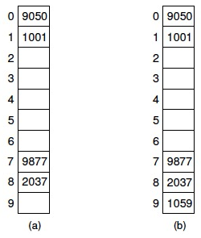

> 转自大神笔记微改：https://github.com/arkingc/note

<br>
<br>

## 引入

#### 哈希表：即散列存储结构。

散列法存储的基本思想：建立记录关键码字与其存储位置的对应关系，或者说，由关键码的值决定数据的存储地址。这样，不经过比较，一次存取就能得到所查元素的查找方法
**优点：查找速度极快（O(1)）,查找效率与元素个数n无关！**

#### 哈希方法(杂凑法)

 选取某个函数，依该函数按关键字计算元素的存储位置并按此存放；查找时也由同一个函数对给定值k计算地址，将k与地址中内容进行比较，确定查找是否成功。

#### 哈希函数(杂凑函数)

 哈希方法中使用的转换函数称为哈希函数(杂凑函数).在记录的关键码与记录的存储地址之间建立的一种对应关系

* **哈希**：把关键码值映射到表中的位置来访问记录的过程
* **哈希函数**：将关键码值映射到位置的函数
* **槽**：哈希表中的一个位置
* **冲突**：不同的关键码经过哈希函数哈希后，映射到相同槽的情况
* **探查序列**：冲突解决策略的闭哈希方法中，如果基位置冲突，需要根据探查函数查找下一个空槽，这个过程产生的序列加上基位置组成了某个关键码的探查序列
* **基本聚集**：在探查函数的设计中，如果不同基位置关键码产生的探查序列发生重合，会导致对剩余空槽的选择概率不均等
。产生的后果是会导致很长的探查序列。这种现象就是基本聚集
* **二次聚集**：基位置相同的关键码，产生的探查序列一样。如果哈希函数在某个基位置聚集，仍然会保持聚集

哈希方法不适用于下列场景：

* 不适用于范围检索
* 不能找到具有最大或最小关键码值的记录
* 不能按关键码值的顺序访问记录

>哈希方法既适合基于内存的检索，也适合基于磁盘的检索。是组织存储在磁盘上的大型数据库的主要方法之一（另一种是B树）

#### 可能导致的冲突：

通常关键码的集合比哈希地址集合大得多，因而经过哈希函数变换后，可能将不同的关键码映射到同一个哈希地址上，这种现象称为冲突。

##### 例.

有6个元素的关键码分别为：（14，23，39，9，25，11）。
选取关键码与元素位置间的函数为`H(k)=k mod 7`


根据哈希函数算出来发现同一个地址放了多个关键码，也就是冲突了。
 在哈希查找方法中，冲突是不可能避免的，只能尽可能减少。
 所以，哈希方法必须解决以下两个问题：

**1）构造好的哈希函数**
 （a）所选函数尽可能简单，以便提高转换速度；
 （b）所选函数对==关键码计算出的地址，应在哈希地址内集中并大致均匀分布==，以减少空间浪费。

**2）制定一个好的解决冲突的方案**
 查找时，如果从哈希函数计算出的地址中查不到关键码，则应当依据解决冲突的规则，有规律地查询其它相关单元。

**从上面两个例子可以得出如下结论：**
 哈希函数只是一种映象，所以哈希函数的设定很灵活，只要使任何关键码的哈希函数值都落在表长允许的范围之         内即可
 冲突：key1≠key2，但H(key1)=H(key2)
 同义词：具有相同函数值的两个关键码
 哈希函数冲突不可避免，只能尽量减少。

制定解决冲突基本要求：
 要求一：n个数据原仅占用n个地址，虽然散列查找是以空间换时间，但仍希望散列的地址空间尽量小。
 要求二：无论用什么方法存储，目的都是尽量均匀地存放元素，以避免冲突。

## 槽总数的选择

### 关键码范围较小

由于关键码范围比较小，可以使用一个槽总数大于关键码总数的表。直接使用槽的下标作为关键码值，此时，不需要将关键码值作为记录的一部分进行存储。哈希函数可以直接设计成```h(K)=K```，但是这种情况比较少见

### 关键码范围较大

**如果可能的关键码范围较大，而同一时间段内存储的记录总数较少时。如果槽数的设计和前者匹配通常意味着空间的浪费，而如果和后者匹配又容易导致冲突**

除此之外，如果对关键码值的分布特性不了解，也会使得哈希函数的设计更为困难。如果了解关键码值的分布特性，应对使用一个依赖于分布的哈希函数，避免把一组相关的关键码值映射到表的同一个槽中（例如，如果对英文单词进行哈希，就不应当对第一个字符的值哈希，因为这样很可能使分布不均）

## 简单的哈希函数

**关键码为数值**的哈希函数的设计：

* **取模**：哈希函数的返回值(槽的位置)只依赖于关键码的最低几位，由于这些位的分布可能很差，结果分布也就可能很差
* **平方取中**：一个很好的用于数值的哈希函数。对于长度为2^r的表，取出平方后结果的中间r位作为槽的位置。由于关键码值的大多数位或者所有位都对结果有所贡献，所有效果很好

**关键码为字符串**的哈希函数的设计：

* **所有字母ASCII值求和对M取模**

### 常用的哈希函数构造方法有：

- 直接定址法
- **除留余数法**
- 乘余取整法
- 数字分析法
- **平方取中法**
- 折叠法
- 随机数法

#### 1、直接定址法

`Hash(key) = a·key + b    (a、b为常数)`
 优点：以关键码key的某个线性函数值为哈希地址，不会产生冲突.
 缺点：要占用连续地址空间，空间效率低。

**例.**关键码集合为{100，300，500，700，800，900}，
 选取哈希函数为Hash(key)=key/100，
 则存储结构（哈希表）如下：


#### 2、除留余数法

`Hash(key)=key mod p (p是一个整数)`
特点：以关键码除以p的余数作为哈希地址。
==关键：如何选取合适的p？p选的不好，容易产生同义词==
==技巧：若设计的哈希表长为m，则一般取p≤m且为质数==
（也可以是合数，但不能包含小于20的质因子）。

#### 3、乘余取整法

`Hash(key)= ⎣ B*( A*key  mod  1 ) ⎦`
 (A、B均为常数，且0<A<1，B为整数)
 特点：以关键码key乘以A，取其小数部分，然后再放大B倍并取整，作为哈希地址。
 **例**：欲以学号最后两位作为地址，则哈希函数应为：
 `H(k)=100*(0.01*k % 1 )`
 其实也可以用法2实现： `H(k)=k % 100`

#### 4、数字分析法

特点：选用关键字的某几位组合成哈希地址。选用原则应当是：各种符号在该位上出现的频率大致相同。
**例**：有一组（例如80个）关键码，其样式如下：


讨论：
① 第1、2位均是“3和4”，第3位也只有“ 7、8、9”，因此，这几位不能用，余下四位分布较均匀，可作为哈希地址选用。

② 若哈希地址取两位（因元素仅80个），则可取这四位中的任意两位组合成哈希地址，也可以取其中两位与其它两位叠加求和后，取低两位作哈希地址。

#### 5、平方取中法

特点：对关键码平方后，按哈希表大小，==取中间的若干位作为哈希地址==。(适于不知道全部关键码情况)
理由：因为中间几位与数据的每一位都相关。
例：2589的平方值为6702921，可以取中间的029为地址。

#### 6、折叠法

特点：将关键码自左到右分成位数相等的几部分（最后一部分位数可以短些），然后将这几部分叠加求和，并按哈希表表长，取后几位作为哈希地址。
 ==适用于：关键码位数很多,且每一位上各符号出现概率大致相同的情况。==
 法1：移位法 ── 将各部分的最后一位对齐相加。
 法2：间界叠加法──从一端向另一端沿分割界来回折叠后，最后一位对齐相加。
 **例**：元素42751896,
 用法1： 427＋518＋96=1041
 用法2： 427 518 96—> 724+518+69 =1311

#### 7、随机数法

 `Hash(key) = random ( key )  (random为伪随机函数)`
 适用于：关键字长度不等的情况。造表和查找都很方便。

### 小结：构造哈希函数的原则：

 ① 执行速度（即计算哈希函数所需时间）；
 ② 关键字的长度；
 ③ 哈希表的大小；
 ④ 关键字的分布情况；
 ⑤ 查找频率。

## 冲突解决策略

尽管哈希函数的目标是使冲突最少，但实际上冲突是无法避免的。**冲突解决技术可以分为两类**：

1. **开哈希(单链表，拉链)法**
2. **闭哈希(开放地址)法**

### 开哈希法

**开哈希(单链表，拉链)法把冲突记录存储在表外**，一种简单的形式是把哈希表中的每个槽定义为一个链表的表头，哈希到一个槽的所有记录都放到该槽的链表内，每个链表可以按如下方式组织记录：


1. **按插入次序排序**：实现简单
2. **按关键码值次序排序**：一旦到达比要检索的关键码大的节点，说明不存在，就可以停止检索
3. **按访问频率次序排序**：访问较高的记录能快速检索到

>在磁盘中用一种很有效的方式存储一个开哈希表是很困难的，因为一个链表中的多个元素能存储在不同的磁盘块中。这就会导致检索一个关键码值需要多次磁盘访问，从而抵消了哈希方法的好处

### 闭哈希法

**闭哈希(开放地址)法把冲突记录存储在表中另一个槽内，设计思路：有冲突时就去寻找下一个空的哈希地址，只要哈希表足够大，空的哈希地址总能找到，并将数据元素存入。**。每条记录i有一个**基位置**，即由哈希函数计算出的槽。如果要插入一条记录R，而另一条记录已经占据了R的基位置，那么就把R存储在表中的其他槽内，由冲突解决策略决定应该是哪个槽。自然，检索时也要像插入一样，遵循同样的策略，以便重复进行冲突解决过程，找出在某位置没有找到的记录

#### 1）桶式哈希

* **插入**：将M个槽分成B（M>B)个桶，每个桶中包含M/B个槽。哈希函数把每条记录分配到某个桶的第一个槽中。==如果该槽被占用，就顺序地沿着桶查找，直到找到一个空槽。如果一个桶全部被占满，那么就把这条记录存储在表后具有无限容量的**溢出桶**中，所有桶共享一个溢出桶.==
* **检索**：确定桶，然后在桶中检索记录，如果没找到并且桶内有空槽，则检索结束。否则，检索溢出桶


>桶式哈希适用于实现基于磁盘的哈希表，因为可以把桶的大小设置为磁盘块的大小。当检索时，就把整个桶读入内存。处理插入或检索操作只需进行一次磁盘访问，除非桶已经满了。如果桶满，需要从磁盘中检索溢出桶，自然应该使溢出很小，以最小化不必要的磁盘访问

#### 2）线性探查

**探查序列**：通过哈希函数计算出关键码的基位置，如果基位置发生冲突，根据**探查函数**去寻找下一个槽，直到找到一个空槽，这个过程产生的一组槽序列，就是探查序列.

线性探测法的优点：只要哈希表未被填满，保证能找到一个空地址单元存放有冲突的元素；
线性探测法的缺点：可能使第i个哈希地址的同义词存入第i+1个哈希地址，这样本应存入第i+1个哈希地址的元素变成了第i+2个哈希地址的同义词，……，
因此，可能出现很多元素在相邻的哈希地址上“堆积”起来，大大降低了查找效率。
**解决方案：可采用二次探测法或伪随机探测法，以改善“堆积”问题。**

线性探查就是探查函数线性递增的冲突解决策略，如果基位置为30，整个探查序列会是30,31,32,33...



线性探查的问题在于，会产生**基本聚集**，基本聚集是指不同基位置的关键码产生的探查序列会发生重合，导致对剩余空槽的选择概率不均等。产生的后果是会导致很长的探查序列

在上图a）中，如果使用线性探查，基位置为0,1,2的关键码在探查后都会选择序号为2的槽，同样，基位置为7,8,9的关键码在探查后都会选择序号为9的槽，这就使得剩余槽被选择的概率不相等。在图b）中，这个问题会更明显，如果下一个记录插入了序号为9的槽，则序号为2的空槽被插入记录的概率将是6/10

**系数大于1的线性探查**(对线性探查函数添加**常数C**跳过一些槽)，即：`(h(K) + iC) mod M`

比如当C为2时，基位置为1和2产生的探查序列为1,3,5..和2,4,6..这个方法对于不同关键码，将关键码值分成了几个集合，每个集合中的关键码只会探查所有槽中的一个部分。同时，相同集合中的关键码还是可能聚集

**为了使探查序列走遍表中所有的槽，常数`C`必须与`M`互质（即`C`为质数或`M`为质数），如果`C`与`M`互质，那么任何关键码的探查序列都会走遍所有的槽**

#### 3）解决聚集的方法

* **二次探查**：探查函数为i的平方，即基位置为30的关键码，产生的探查序列为30,31,34,39..这种方法的缺陷在于并不是哈希表中所有的槽都在探查序列中

  仍举上例，改用二次探测法处理冲突，建表如下：
  Hi=(Hash(key)±di) mod m
  其中：Hash(key)为哈希函数
  m为哈希表长度，m要求是某个4k+3的质数；
  di为增量序列 1^2，-1 ^2，2 ^2，-2 ^2，…，q ^2

  

  注：只有空心三角下标标注的这3这个关键码的冲突处理与上例不同，
  Hash(3)=3，哈希地址上冲突，由
  H1=(Hash(3)+1 ^2) mod 11=4，仍然冲突；
  H2=(Hash(3)-1 ^2) mod 11=2，找到空的哈希地址，存入。

  **若di＝伪随机序列，就称为伪随机探测法**

  上述方法虽然能解决基本聚集，但是对于基位置相同的关键码，产生的探查序列还是一样。如果哈希函数在某个基位置聚集，那么上面的方法仍然会保持聚集。也就是所谓的**二次聚集**。解决二次聚集可以使用**双哈希**

* **双哈希（再哈希法）**：要使具有相同基位置的关键码产生不同的探查序列，那么探查函数也应该是基于关键码的函数。假设这个函数为h2(K)，一种方式是根据这个函数产生线性探查序列，即i\*h2(K)。例如，如果h2(K)=2，那么基位置为30的关键码产生的探查序列是：30，32，34...，由于h2是基于关键码值的函数，所以基位置相同的不同关键码会产生不同的探查序列，因此可以解决二次聚集。

  `Hi=RHi(key) i=1, 2, …，k`
  RHi均是不同的哈希函数，当产生冲突时就计算另一个哈希函数，直到冲突不再发生。
  优点：不易产生聚集；
  缺点：增加了计算时间。

* **建立一个公共溢出区**

  思路：除设立哈希基本表外，另设立一个溢出向量表。
  所有关键字和基本表中关键字为同义词的记录，不管它们由哈希函数得到的地址是什么，一旦发生冲突，都填入溢出表。

## 哈希表的查找和分析

明确：散列函数没有“万能”通式（杂凑法），要根据元素集合的特性而分别构造。
讨论：哈希查找的速度是否为真正的O（1）？
不是。由于冲突的产生，使得哈希表的查找过程仍然要进行比较，==仍然要以平均查找长度ASL来衡量。==
一般地，ASL依赖于哈希表的装填因子α,它标志着哈希表的装满程度。


0≤α≤1
α 越大，表中记录数越多，说明表装得越满，发生冲突的可能性就越大，查找时比较次数就越多。

#### 讨论：

1） 散列存储的查找效率到底是多少？
 答：ASL与装填因子α有关！既不是严格的O(1)，也不是O(n)
 2）“冲突”是不是特别讨厌？
 答：不一定！正因为有冲突，使得文件加密后无法破译！（单向散列函数不可逆，常用于数字签名和间接加密）。
 利用了哈希表性质：源文件稍稍改动，会导致哈希表变动很大。

**具体实现参考《STL源码剖析》hash_map（使用哈希表实现）章节。**