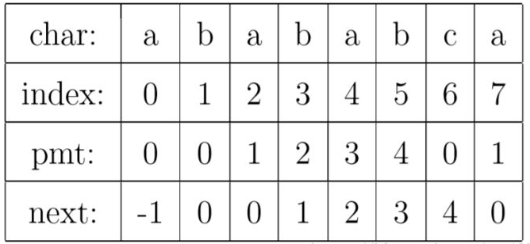
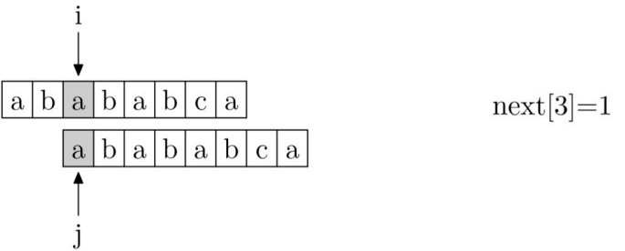
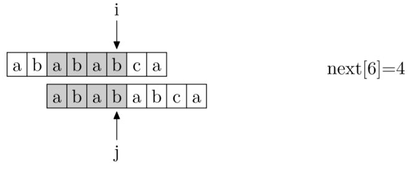
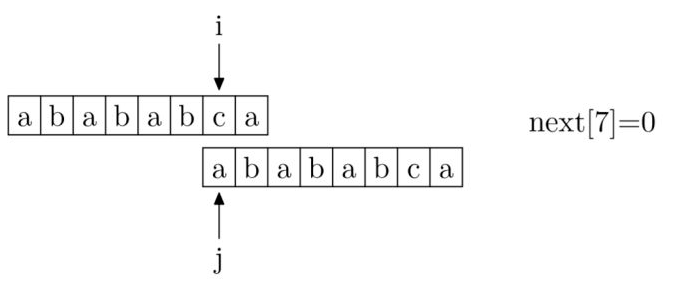

# 1.KMP算法



PMT:部分匹配表,表示当前位置左边字符串的前缀和后缀的最长公共子串的长度

NEXT:PMT表的各个元素位置向右移动一位，方便计算

时间复杂度：O(m+n)		m是主串的长度，n是子串的长度

核心思想：每一趟匹配过程中如果出现字符比较不等时，不需要回溯主串和子串，而是利用已经得到的部分匹配结果将子串向右滑动尽可能远的距离后继续进行比较。

主要算法：先从头挨个匹配字符，哪个位置字符不匹配，就看子串该位置对应next数组的值，将该值对应的下标位置的字符和主串当前不匹配的字符对应起来。图1->图2


​																		图1


​																		图2

KMP算法实现代码：

```c++
int kmp(const char* src,int slen,const char* patn,int plen,const int* next){
    int	i=0,j=0;
    while(i<slen&&j<plen){
        if(j==-1||src[i]==patn[j]){
            ++i;++j;
        }
        else
            j=next[j];	//j回溯了，但不会是从开头回溯
    }
    if(j>=plen) 
        return i-plen;	//返回起始的主串的位置
    else 
        return -1;
}
```

next数组的计算，其实，求next数组的过程完全可以看成字符串匹配的过程，即以模式字符串为主字符串，以模式字符串的前缀为目标字符串，一旦字符串匹配成功，那么当前的next值就是匹配成功的字符串的长度。
具体来说，就是从模式字符串的第一位(注意，不包括第0位)开始对自身进行匹配运算。 在任一位置，能匹配的最长长度就是当前位置的next值。如下图所示。









```c++
//未改进版本
void get_nextval(const char* ptrn,int plen,int *next){
    int i=0;
    next[0]=-1;
    int j=-1;
    while(i<plen){
        if(j==-1||ptrn[i]==ptrn[j]){
            ++i;++j;
            next[i]=j;
        }
        else
            	j=next[j];
    }
}
//改进版本
void get_nextval(const char* ptrn,int plen,int *next){
    int i=0;
    next[0]=-1;
    int j=-1;
    while(i<plen){
        if(j==-1||ptrn[i]==ptrn[j]){
            ++i;++j;
            if(ptrn[i]!=ptrn[j])
                next[i]=j;
            else
                next[i]=next[j];
        }
        else
            	j=next[j];
    }
}
```

