# 算法

## 1.字符串匹配

### 1.KMP


PMT:部分匹配表,表示当前位置左边字符串的前缀和后缀的最长公共子串的长度

NEXT:PMT表的各个元素位置向右移动一位，方便计算

时间复杂度：O(m+n)		m是主串的长度，n是子串的长度

核心思想：每一趟匹配过程中如果出现字符比较不等时，不需要回溯主串和子串，而是利用已经得到的部分匹配结果将子串向右滑动尽可能远的距离后继续进行比较。

主要算法：先从头挨个匹配字符，哪个位置字符不匹配，就看子串该位置对应next数组的值，将该值对应的下标位置的字符和主串当前不匹配的字符对应起来。图1->图2

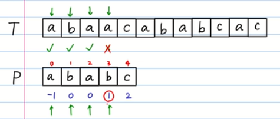

​																		图1

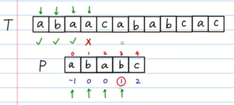

​																		图2

KMP算法实现代码：

```c++
int kmp(const char* src,int slen,const char* patn,int plen,const int* next){
    int	i=0,j=0;
    while(i<slen&&j<plen){
        if(j==-1||src[i]==patn[j]){
            ++i;++j;
        }
        else
            j=next[j];	//j回溯了，但不会是从开头回溯
    }
    if(j>=plen) 
        return i-plen;	//返回起始的主串的位置
    else 
        return -1;
}
```

next数组的计算，其实，求next数组的过程完全可以看成字符串匹配的过程，即以模式字符串为主字符串，以模式字符串的前缀为目标字符串，一旦字符串匹配成功，那么当前的next值就是匹配成功的字符串的长度。
具体来说，就是从模式字符串的第一位(注意，不包括第0位)开始对自身进行匹配运算。 在任一位置，能匹配的最长长度就是当前位置的next值。如下图所示。

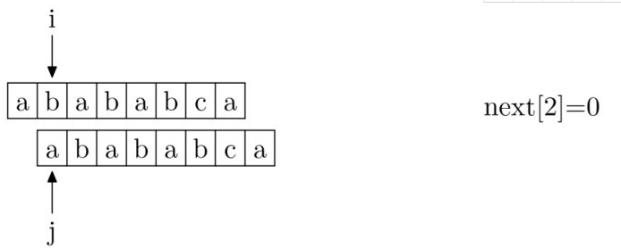

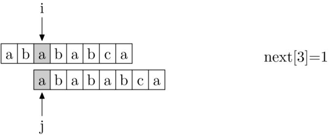

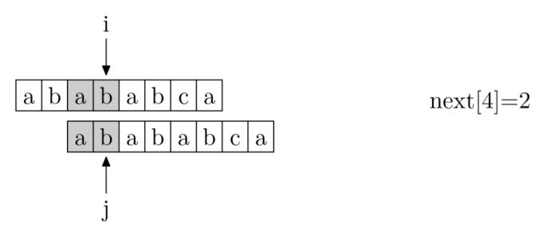

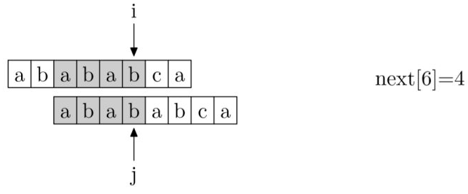

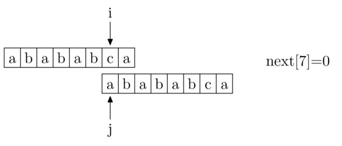

```c++
//未改进版本
void get_nextval(const char* ptrn,int plen,int *next){
    int i=0;
    next[0]=-1;
    int j=-1;
    while(i<plen){
        if(j==-1||ptrn[i]==ptrn[j]){
            ++i;++j;
            next[i]=j;			
        }
        else
            j=next[j];			//获取下一次匹配的位置
    }
}
//改进版本
void get_nextval(const char* ptrn,int plen,int *next){
    int i=0;
    next[0]=-1;
    int j=-1;
    while(i<plen){
        if(j==-1||ptrn[i]==ptrn[j]){
            ++i;++j;
            if(ptrn[i]!=ptrn[j])
                next[i]=j;
            else
                next[i]=next[j];
        }
        else
            	j=next[j];
    }
}
```

### 2.BM

### 3.Sunday

## 2.MST

### 1.Prim算法

基于贪心，类似Dijkstra算法，T是已经选好点的集合，将T中的点看成一个整体，从剩下的顶点中找到权值相对于T中任意一个顶点的最小的，然后加入到T中，适用于求解边稠密的图。时间复杂福O(|V|²)

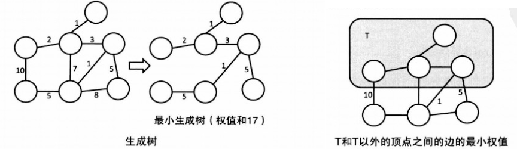

```c++
/*有一种向外扩大分支感觉*/
int cost[MAX_V][MAX_V];			//cost[u][v]表示边e={u,v}的权值
int mincost[MAX_V];				//从集合T出发到每个顶点的最小权值
bool used[MAX_V];				//顶点i是否包含在集合T中
int V;
int prim(){
    for(int i=0;i<V;i++){
        mincost[i]=INF;
        used[i]=false;
    }
    mincost[0]=0;				//T为空
    int res=0;					//最小距离
    while(true){
        int v=-1;
        //从不属于T集合的顶点中选取从T到其权值最小的顶点v
        for(int u=0;u<V;u++){
            ////v=-1是第一次循环，从T相邻顶点中找打权值最小的点
            if(!used[u]&&(v==-1||mincost[u]<mincost[v])) v=u;
        }
        if(v==-1) break;		//全部都更新完
        used[v]=true;			//把顶点v加入到集合x
        res+=mincost[v];		//更新最小距离
        for(int u=0;u<V;u++){
            mincost[u]=min(mincost[u],cost[v][u]);//更新v相邻顶点u的最小权值
        }
    }
    return res;
}
```

### 2.Kruskal算法

基于贪心，从小到大排序边，判断新加入集合的边的两个顶点是否构成连通分量，即形成圈，应用到并查集。采用堆来存放边的集合，每次选择最小的权值只要O(log|E|)的时间，总体时间复杂度为O(|E|log|E|)

```c++
struct edge{int u,v,cost};
bool comp(const edge& e1,const edge& e2){
    return e1.cost<e2.cost;
}
edge es[MAX_E];						//边集合
int V,E;
int kruskal(){
    sort(es,es+E,comp);
    init_union_find(V);				//初始化并查集
    int res=0;
    for(int i=0;i<E;i++){
        edge e=es[i];				//从小到大取边
        if(!same(e.u,e.v)){
            unite(e.u,e.v);
            res+=e.cost;
        }
    }
    return res;
}

/*并查集实现*/
int par[MAX_N];						//父亲
int rank[MAX_N];					//树的高度
//初始化n个元素
void init(int n){
    for(int i=0;i<n;i++){
        par[i]=i;					//独立成树
        rank[i]=0;
    }
}
//查询树的根
int find(int x){					//返回树根的值
    if(par[x]==x) return x;
    else return par[x]=find(par[x]);
}
//合并x，y所属的集合
void unite(int x,int y){
    x=find(x);						//找到各自的树根
    y=find(y);
    if(x==y) return;				//根相同无需合并
    if(rand[x]<rank[y]) par[x]=y;
    else {
        par[y]=x;
        if(rank[x]==rank[y]) rank[x]++;
    }
}
//判断x，y是否属于同一集合
bool same(int x,int y){
    return find(x)==find(y);
}
```

## 3.SPA

### 1.Bellman-Ford

可以求解含负权图，不停的松弛边，若n-1次松弛后还能更新，则说明图中有负环(即负权回路。Bellman-ford算法有一个小优化：每次松弛先设一个旗帜flag，初值为FALSE，若有边更新则赋值为TRUE，最终如果还是FALSE则直接成功退出。Bellman-ford算法浪费了许多时间做无必要的松弛，所以SPFA算法用队列进行了优化，效果十分显著，高效难以想象。SPFA还有SLF，LLL，滚动数组等优化。

**适用条件&范围**　1.单源最短路径(从源点s到其它所有顶点v);　2.有向图&无向图(无向图可以看作(u,v),(v,u)同属于边集E的有向图);　3.边权可正可负(如有负权回路输出错误提示);    4.差分约束系统;

**算法描述：**　　1,.初始化：将除源点外的所有顶点的最短距离估计值 d[v] ←+∞, d[s] ←0;　　2.迭代求解：反复对边集E中的每条边进行松弛操作，使得顶点集V中的每个顶点v的最短距离估计值逐步逼近其最短距离；（运行|v|-1次）　　3.检验负权回路：判断边集E中的每一条边的两个端点是否收敛。如果存在未收敛的顶点，则算法返回false，表明问题无解；否则算法返回true，并且从源点可达的顶点v的最短距离保存在 d[v]中。

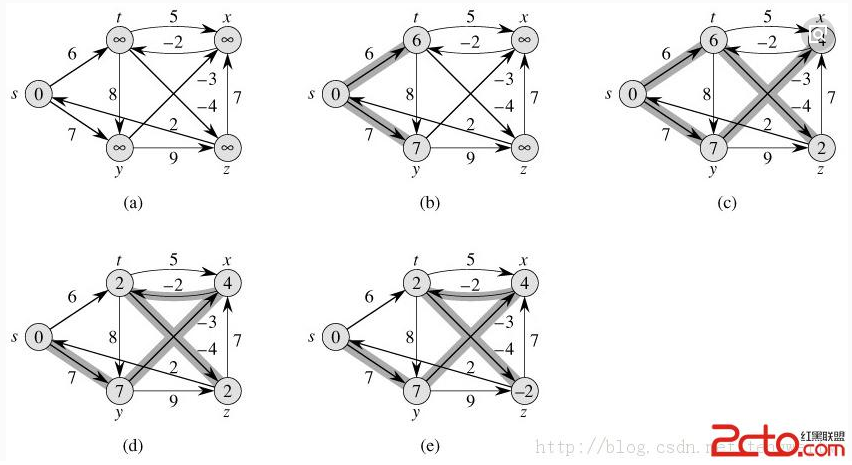

没有负环：

```c++
struct edge{int from,to,cost;} 				//边的起点，终点，权值
edge es[MAX_E];								//边数组
int d[MAX_V];								//最短距离
int V,E;									//顶点数，边数
void shortest_path(int s){					//s为起点
    for(int i=0;i<V;i++) d[i]=INF;			//初始化
        d[s]=0;
        while(true){
            bool update=false;				//优化
            for(int i=0;i<E;i++){
                edge e=es[i];				//遍历每条边
                if(d[e.from]!=INF&&d[e.to]>d[e.from]+e.cost){
                    d[e.to]=d[e.from]+e.cost;
                    update=true;
                }
            }
            if(!update) break;				//全部的点都更新完了
        }
}
```

判断负环是否存在：

```c++
bool find_negative_loop(){				//存在负环返回true
    memset(d,0,sizeof(d));				//初始化到每个顶点的最短路径
    for(int i=0;i<V;i++){				//从每个顶点开始遍历所有边
        for(int j=0;j<E;j++){			
            edge e=es[j];//边
            if(d[e.to]>d[e.from]+e.cost){
                d[e.to]=d[e.from]+e.cost;
                            //如果第n次更新了，则存在负环,判断标准
                if(i==V-1) return true;
            }
        }
    }
    return false;
}
```

### 2.SPFA

### 3.Dijkstra

**思想：**找到最短距离已经确定的点，从他出发更新相邻顶点的最短距离，此后不再关心最短距离已经确定的顶点。**即每次找到最小距离的点，从而不停的松弛。**

邻接矩阵实现：O(|V|²）

```c++
int cost[MAX_V][MAX_V];				//const[u][v]表示边e={u,v}的权值（不存在时这条边为INF）
int d[MAX_V];						//顶点s出发的最短距离
bool used[MAX_V];					//已经使用过的点
int V;								//顶点数
//求从顶点s到各个顶点的最短距离
void dijkstra(int s){
    fill(d,d+V,INF);				//初始化最大
    fill(used,used+V,false);
    d[s]=0;
    while(true){
        int v=-1;					//跳出循环变量
        //从尚未使用过的顶点中选出一个距离最小的点
        for(int u=0;u<V;u++){//遍历所有顶点
            if(!used[u]&&(v==-1||d[u]<d[v])) v=u;//v保存最小距离的点,如果v=-1表示第一次上个点就是最短距离的点
        }
        if(v==-1) break; 			//结束
        used[v]=true;				//v已经确定
        for(int u=0;u<V;u++){		//再次遍历所有的点
            d[u]=min(d[u],d[v]+cost[v][u]);//更新
        }
    }
}
```

邻接表实现：优先队列O(|E|log|V|)

```c
struct edge{int to,cost;};    	//边的终点，权重
typedef pair<int,int> P;		//first是最短距离，second是顶点的编号，P是一个键值对
int V;//顶点数
vector<edge> G[MAX_V];			//邻接表 ，一个顶点连着好几条边,邻接表就是二维数组
ind d[MAX_V];					//保存最短距离
void dijkstra(int s){
    //greator<p>参数：堆按照P.first从小到大排序
    priority_queue<P,vector<P>,greator<P> > que;    //优先队列默认是大根堆
    fill(d,d+V,INF);			//初始化
    d[s]=0;
    que.push(P(0,s));			//将键值对存入queue
    while(!que.empty()) {		//队列不为空
        P p=que.top();que.pop();//取出队首元素
        int v=p.second;			//获取当前顶点
        if(d[v]<p.first) continue;//?表示队列中有重复顶点，但是此时d[v]已经更新了，p.first却没有更改,淘汰重复的点
        for(int i=0;i<G[v].size();i++){//遍历v的边
            edge e=G[v][i];		//边
            if(d[e.to]>d[v]+e.cost) {
                d[e.to]=d[v]+e.cost;//更新
                que.push(P(d[e.to],e.to));//将最短路径放入队列
            }
        }
    }
}
```

### 4.Floyed-Warshall

使用DP来求解，只使用顶点0~k和i,j的情况下，记i到j的最短路径长度为d[k+1]\[i]\[j],k=-1时，认为只使用i和j，所以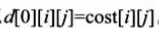

经过顶点k和不经过顶点k两种情况来讨论：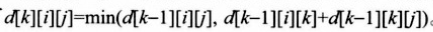

时间复杂度：O(|V|^3)

```c++
int d[MAX_V][MAX_V];//d[u][v]表示边e={u,v}的权值(不存在为INF，d[i][i]=0;),也表示i到j的最短距离
int V;								//顶点数
void warshall_floyd(){
    for(int k=0;k<V;k++){			//k表示i，j中间的点
        for(int i=0;i<V;i++){
            for(int j=0;j<V;j++){
                d[i][j]=min(d[i][j],d[i][k]+d[k][j]);
            }
        }
    }
}
```

## 4.二分查找

标准写法，二分查找nums中[left，right)部分，right值取不到，如果查到的话，返回所在地，如果查不到则返回最后一个小于target值得后一个位置。

```c++
//右值点不能取到的情况
int binary_search(vector<int>& nums,int left,int right, int target) { 
    //坑点（1）right究竟能不能取到的问题，这里是不能取到的情况
    int i = left;
    int j= right;
    while(i<j){
        int mid = i+(j-i)/2;	//坑点（2）这里尽量这么写，因为如果写成(i+j)/2则有溢出的风险
        if(nums[mid]>=target)   //坑点（3）这个地方大于还是大于等于要依据情况而定
            j = mid;            //坑点（4）因为右值点反正不能取到，所以j就可以等于mid
        else
            i = mid+1;           //坑点（5）
    }
    return i;
}

//右值点能取到的情况，我习惯这么写
int searchInsert(vector<int>& nums,int left,int right, int target) {
    int i = left;
    int j= right;
    while(i<=j ){
        int mid = i+(j-i)/2;
        if(nums[mid]>=target)
            j = mid-1;
        else
            i = mid+1;
    }
    return i;
}
```

一般来说写的二分查找的标准程序应该是右边right值取不到的情况，所以while循环中要加一步判断i是否小于等于nums.size();

**后面都是按照左闭右闭区间来写：**

**变种1：**查找第一个等于key的元素的位置

```c++
// 查找第一个与key相等的元素 
int findFirstEqual(int arr[], int len, int key){
    int left = 0;
    int right = len - 1;
    int mid;

    while (left <= right) {		//如果是左闭右闭区间，就都这么写
        mid = left+(right-left) 
        if (key <= arr[mid]) {	//要一直往左边推过去
            right = mid - 1;
        } else {			//arr[mid] < key
            left = mid + 1;
        }
    }
    //arr[right] < key <= arr[left]
    //right是最后一个小于key的
    //left是第一个大于等于key的
    if (left < len && arr[left] == key) {
        return left;
    }
    return -1;
}
```

**变种2**：查找最后一个和key相等元素的位置

```c++
int findLastEqual(int arr[],int len,int key){
    int left=0;
    int right=len-1;
    int mid;
    while(left<=right){
        mid=left+（right-left)/2;
        if(key<arr[mid])	right=mid-1;
        else	left=mid+1;		//往右推
    }
    if (right>=0 && arr[right] == key) {
        return right;
    }
    return -1;
}
```

**变种3：**查找最后一个小于key的元素

```c++
int findLastEqual(int arr[],int len,int key){
    int left=0;
    int right=len-1;
    int mid;
    while(left<=right){
        mid=left+（right-mid)/2;
        if(key<=arr[mid])	right=mid-1;
        else	left=mid+1;		
    }
	return right;
}
```

**变种4**：查找第一个大于等于key的元素

```c++
int findLastEqual(int arr[],int len,int key){
    int left=0;
    int right=len-1;
    int mid;
    while(left<=right){
        mid=left+（right-mid)/2;
        if(key<=arr[mid])	right=mid-1;
        else	left=mid+1;		
    }
	return left;
}
```

**变种5**：查找最后一个小于等于key的元素

```c++
int findLastLessEqual(int arr[],int len,int key){
    int left=0;
    int right=len-1;
    int mid;
    while(left<=right){
        mid=left+（right-mid)/2;
        if(key<arr[mid])	right=mid-1;
        else	left=mid+1;		
    }
	return right;
}
```

**变种6**：查找第一个大于key的元素

```c++
int findFirstGreater(int arr[],int len,int key){
    int left=0;
    int right=len-1;
    int mid;
    while(left<=right){
        mid=left+（right-mid)/2;
        if(key<arr[mid])	right=mid-1;
        else	left=mid+1;		
    }
	return left;
}
```

**图片理解：**

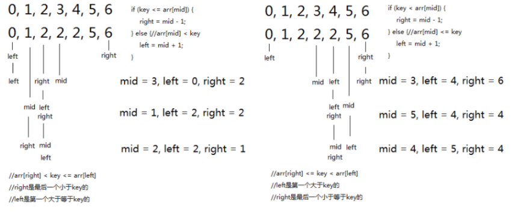

**综上所述：**

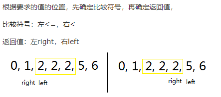

## 5.搜索

**图的表示：**

V：顶点数	E：边数

1.邻接矩阵：用g\[i][j]表示顶点i和顶点j之间的关系，有边为1，无边为0，有向无向自己看着半；如果是带权图，则
g\[i][j]表示顶点i到顶点j的权值。

  邻接矩阵好处：在常数时间判断两点之间是否有边，但是需要花费O(|V|²)空间复杂度，适用于顶点少边很多情况

2.邻接表：适用稀疏图，需要O(|V|+|E|)空间复杂度

   邻接表的两种实现方式：

```c++
vector<int> G[MAX_V];
/*边上有属性的情况
struct edge{int to,cost;};
vector<edge> G[MAX_N];*/
int main(){
    int V,E;
    cin>>V>>E;
    for(int i=0;i<E;i++){
        int s,t;	//s到t
        cin>>s>>t;
        G[s].push_back(t);
    }
    return 0;
}
```

```c++
struct vertex{
  vector<vertex*> edge;
  /*顶点的属性*/
};
vertex G[MAX_N];
int main(){
    int V,E;
    cin>>V>>E;
    for(int i=0;i<E;i++){
        int s,t;
        cin>>s>>t;
        G[s].edge.push_back(&G[t]);
        //G[t].edge.push_back(&G[s]);
    }
    return 0;
}
```

### 1.DFS

基本实现思想：
（1）访问顶点v；
（2）从v的未被访问的邻接点中选取一个顶点w，从w出发进行深度优先遍历
（3）重复上述两步，直至图中所有和v有路径相通的顶点都被访问到。

```c++

```

**递归实现**

### 2.BFS

## 6.全排列

**1.递归实现**

```c++
void permutation(char* a,int k,int m)//k起始位置，m终止位置
{
    int i,j;
    if(k == m)
    {
        for(i=0;i<=m;i++)
            cout<<a[i];
        cout<<endl;
        return;
    }
    for(j=k;j<=m;j++)
    {
        swap(a[j],a[k]);//依次当开头字母
        permutation(a,k+1,m);//k+1到m的全排列
        swap(a[j],a[k]);//还原回去
    }
}
```

**2.算法实现**

```
void permutation(char* str,int length)
{
    sort(str,str+length);//排好序
    do
    {
        for(int i=0;i<length;i++)
            cout<<str[i];
        cout<<endl;
    }while(next_permutation(str,str+length));
}
```

### 康拓展开

把一个整数X展开成如下形式:	X=a[n]*(n-1)!+a[n-1]*(n-2)!+...+a[i]*(i-1)!+...+a[2]*1!+a[1]*0!

其中a[i]为''当前元素''在''所有未出现的元素''中排在第i个(从0开始)，并且0<=a[i]<i(1<=i<=n)

例如有3个数（1，2，3），则其排列组合及其相应的康托展开值如下：

排列组合	名次	康托展开
123				1	0 * 2! + 0 * 1! + 0 * 0!
132				2	0 * 2! + 1 * 1! + 0 * 0!
213				3	1 * 2! + 0 * 1! + 0 * 0!
231				4	1 * 2! + 1 * 1! + 0 * 0!
312				5	2 * 2! + 0 * 1! + 0 * 0!
321				6	2 * 2! + 1 * 1! + 0 * 0!
比如其中的 231：

​		想要计算排在它前面的排列组合数目（123，132，213），则可以转化为计算比首位小即小于2的所有排列「1 * 2！」，首位相等为2并且第二位小于3的所有排列「1 * 1！」，前两位相等为23并且第三位小于1的所有排列（0 * 0！）的和即可，康托展开为：1 * 2！+1 * 1+0 * 0=3。
所以小于231的组合有3个，所以231的名次是4。

具体代码实现如下：（假设排列数小于10个）

```c++
static const int FAC[] = {1, 1, 2, 6, 24, 120, 720, 5040, 40320, 362880};	// 阶乘
int cantor(int *a, int n)	//n是数组的大小
{
	int x = 0;
	for (int i = 0; i < n; ++i) {
		int smaller = 0;  // 在当前位之后小于其的个数
		for (int j = i + 1; j < n; ++j) {
			if (a[j] < a[i])
				smaller++;
		}
		x += smaller* FAC[n - 1 - i] ; // 康托展开累加
	}
	return x;  // 康托展开值
}
```

### 逆康拓展开

即对于上述例子，在（1，2，3，4，5）给出61可以算出起排列组合为 34152。由上述的计算过程可以容易的逆推回来，具体过程如下：

用 61 / 4! = 2余13，说明a[5]=2,说明比首位小的数有2个，所以首位为3。
用 13 / 3! = 2余1，说明a[4]=2，说明在第二位之后小于第二位的数有2个，所以第二位为4。
用 1 / 2! = 0余1，说明a[3]=0，说明在第三位之后没有小于第三位的数，所以第三位为1。
用 1 / 1! = 1余0，说明a[2]=1，说明在第二位之后小于第四位的数有1个，所以第四位为5。
最后一位自然就是剩下的数2啦。
通过以上分析，所求排列组合为 34152。
具体代码实现如下：（假设排列数小于10个）

```c++
static const int FAC[] = {1, 1, 2, 6, 24, 120, 720, 5040, 40320, 362880};	// 阶乘

//康托展开逆运算
void decantor(int x, int n)
{
    vector<int> v;  // 存放当前可选数
    vector<int> a;  // 所求排列组合
    for(int i=1;i<=n;i++)
        v.push_back(i);
    for(int i=m;i>=1;i--)
    {
        int r = x % FAC[i-1];
        int t = x / FAC[i-1];
        x = r;
        sort(v.begin(),v.end());// 从小到大排序 
        a.push_back(v[t]);      // 剩余数里第t+1个数为当前位
        v.erase(v.begin()+t);   // 移除选做当前位的数
    }
}
```

## 7.DP

## 8.N皇后

**1.全排列思想：**n列皇后所在的行号依次写出，那么就会是一个1~n的全排列。只需要枚举1-n的所有排列，统计其中的合法方案即可。

```c++
int sum=0;						//排列的个数 
int P[MAX_N];					//P[i]表示第i列皇后所在的行号
int n;							//n皇后
int hasTable[MAX_N];			//hasTable[i]表示第i行是否被访问过
//产生index-n的全排列
void generateP1(int index){
    if(index==n+1){				//递归边界，产生一个排列
        bool flag=true;			//假设当前排列是一个合法方案
        for(int i=1;i<=n;i++){
            for(int j=i+1;j<=n;j++){
                //检查遍历任意俩皇后，如果在同一对角线则不合法
                if(abs(i-j)==abs(P[i]-P[j]))	flag=false;
            }
        }
        if(flag) sum++;
        return;
    }
    for(int x=1;x<=n;x++){		//遍历每行
        if(hasTable[x]==false){	//如果当前行没有被用 
            P[index]=x;			//在index列放置对应的行，试探所有的行		
            hasTable[x]=true;
            generateP(index+1);
            hasTable[x]=false;
        }
    }
}
int main(){
	memset(P,0,sizeof(P));
	memset(hasTable,false,sizeof(hasTable));
	cin>>n; 
	generateP(1);
	cout<<sum<<endl;
	return 0;
} 
```

**2.回溯优化：**

```c++
void generateP2(int index){
	if(index==n+1){
		sum++;
		return;
	}
	for(int x=1;x<=n;x++){			//遍历每行 
		if(hasTable[x]==false){
			//在这做个判断，判断第x行能否放置皇后
			bool flag=true;			//假设先可以放置，index是当前皇后所在的列 
			for(int pre=1;pre<index;pre++){	//遍历之前放置好的皇后（遍历每列），检测是否有冲突 
				if(abs(index-pre)==abs(x-P[pre])){
					flag=false;
					break;
				}
			} 
			if(flag){
				P[index]=x;
				hasTable[x]=true;
				generateP2(index+1);
				hasTable[x]=false;
			}
		}
	}
} 
```

**DFS实现：**

```c++
int ans=0;
int a[8];								//a[i]表示i行所在的列 
bool attack(int x0,int y0,int x1,int y1){//表示两个位置是否可以攻击，是返回true
    if(x0==x1||y0==y1) return true;
    if(x0+y0==x1+y1||x0-y0==x1-y1) return true;
    return false;
}
void dfs(int x){						//从第x行开始
    if(x==n){
        ans++;
        return;
    }
    for(int i=0;i<n;i++){				//逐列试探
        bool ok=true;					//假设符合 
        for(int j=0;j<x;j++){			//检查之前的行
            if(attack(j,a[j],x,i)){
                ok=false;
                break;					//这一列不符合,找下一列
            }
        }
        if(ok){
            a[x]=i;						//这一列符合，就放置皇后 
            dfs(x+1);					//递归深搜
        }
    }
} 
```

## 9.字符串分割

```c++
//代码1:使用string的成员函数实现
vector<string> split1(const string &str, const string &pattern)
{
    vector<string> res;
    if(str == "")
        return res;
    //在字符串末尾也加入分隔符，方便截取最后一段
    string strs = str + pattern;
    size_t pos = strs.find(pattern);

    while(pos != strs.npos)
    {
        string temp = strs.substr(0, pos);
        res.push_back(temp);
        //去掉已分割的字符串,在剩下的字符串中进行分割
        strs = strs.substr(pos+1, strs.size());
        pos = strs.find(pattern);
    }
    return res;
}
```

```c++
//代码2：通过strtok函数实现
vector<string> split2(const string &str, const string &pattern)
{
    char * strc = new char[strlen(str.c_str())+1];
    strcpy(strc, str.c_str());   //string转换成C-string
    vector<string> res;
    char* temp = strtok(strc, pattern.c_str());
    while(temp != NULL)
    {
        res.push_back(string(temp));
        temp = strtok(NULL, pattern.c_str());
    }
    delete[] strc;
    return res;
}
```

```c++
//代码3：通过stringstream实现
vector<string> split3(const string &str, const char pattern)
{
    vector<string> res;
    stringstream input(str);   //读取str到字符串流中
    string temp;
    //使用getline函数从字符串流中读取,遇到分隔符时停止,和从cin中读取类似
    //注意,getline默认是可以读取空格的
    while(getline(input, temp, pattern))
        res.push_back(temp);
    return res;
}
```

# 数据结构

## 1.红黑树

## 2.2-3树

## 3.B树

只支持随机搜索，可用于文件的索引结构，是平衡的多分树。

https://www.cnblogs.com/vincently/p/4526560.html

## 4.B+树

支持随机和顺序搜索，可用于文件的索引结构，是平衡的多分树。

## 5.Trie树

### 5.1判定树

 		二分查找是一种效率比较高的查找算法，但是它依赖于数组有序的存储，二分查找的过程可以用二叉树来形容描述：把当前查找区间的中间位置上的结点作为根，左子表和右子表中的结点分别作为根节点的左子树和右子树。由此得到的二叉树，称为描述二分查找树的判定树（Decision Tree）或比较树（Comprision Tree）。时间复杂度为O(logN)。

**判定树的形态只与表结点个数N有关，与具体的数值无关。**10个结点的判定树如下：

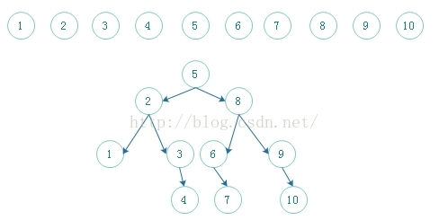

对于此图，我么可以得出：
      查找成功的最少次数：1
      查找成功最多的次数：4
      查找成功的平均次数：（1\*1+2\*2+3\*4+4\*3）/（1+2+4+3）=2.9=3次；
      查找不成功的最少次数：3
      查找不成功的最多次数：4
      查找不成功的平均次数：（3\*5+4\*6）/（5+6）=39/11=4次；

二分查找就是将给定值K与二分查找判定树的根节点的关键字进行比较。若相等，成功；小于根节点则在根节点的左边查找；大于根节点，则在根节点的右边查找。它是一颗序列号N的有序二叉树。
**二分查找的优点和缺点**
        虽然二分查找的效率很高，但是要将表按关键字排序。而排序本身就是一种很费时的运算。即使使用高效率的排序算法也要花费O（NlgN）的时间。二分查找只适用于顺序存储的存储结构。为保持表的有序性，在顺序结构里插入和删除都必须移动大量的结点。
         因此，二分查找特别适用于那种一经建立就很少改动、而又经常需要查找的线性表。对于那些查找少而又经常需要改动的线性表，可采用链表作存储结构，进行顺序查找。但是链表无法是实现二分查找。

### 5.2键树

键树又称为数字查找树，它是一颗度大于等于2的树，树中的每个结点中不是包含一个或几个关键字，而是只含有组成关键字的符号。例如，若关键字为数值，则结点中只包含一个数位；若关键字为单词，则结点中只包含一个字母字符。这种树会给某种类型关键字的表的查找带来方便。可以对此集合作如下的分割，首先按照首字母分割成不同的子集，然后再在子集中按照第二个字符分割...，直到每个小子集中只包含一个关键字为止

我们来举一个例子吧，下面有一个集合：

{CAI,CAO,LI,LAN,CHA,CHANG,WEN,CHAO,YUN,YANG,LONG,WANG,ZHAO,LIU,WU,CHEN}

我们先针对首字母将其分配：

{CAI,CAO,CHA,CHANG,CHAO,CHEN}

{WEN,WANG,WU}

{ZHAO}

{LI,LAN,LONG,LIU}

{YUN,YANG}

然后对其中4个关键字大于1的子集再按照第二个字符不同进行分割，直到分割到每个子集包含一个关键字为止。如下图所示：

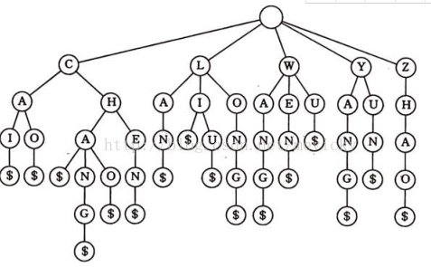

这种键数的查找速度和HashTable基本相当，但是内存用量却只有HashTable的一半不到。这个对于大容量的数据查找还是一种可行的方法。比如计费系统中的用户资料在计费过程中使用非常频繁，如果id作为关键字的键树的话，会大大提高查询速度。

**存储方式有两种：**

**1.用树的的孩子-兄弟链来表示键树（成为双链树）**

每个Node有三个域：
	1.symbol域：存储关键字的一个字符
	2.son域：存储指向第一棵子树的根的指针
	3.brother域：存储指向右兄弟的指针

如图：

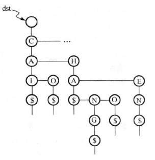

**2.用多重链表表示（又称为Tire树，字典树）**