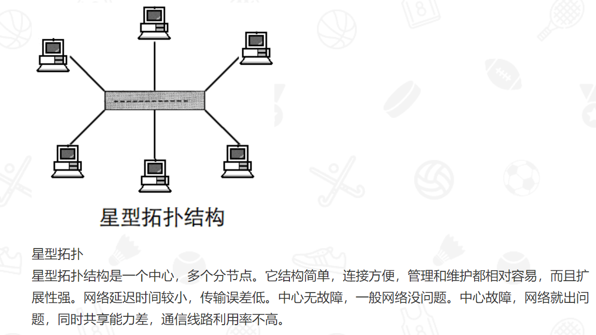
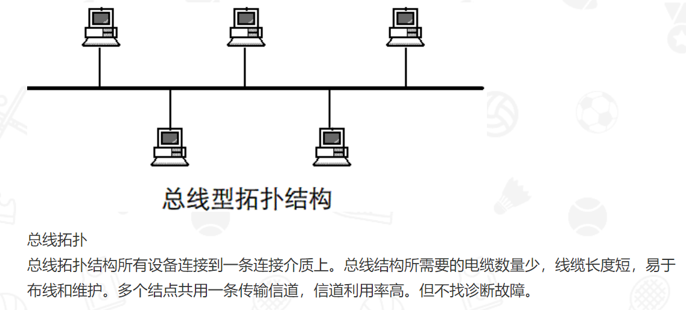

# 1.计算机网络

#### IEEE802.4标准定义的网络，其物理拓扑结构为（总线 ）。

​		IEEE802.3是采用CSMA/CD的方式，叫带有冲突检测的载波侦听多路访问控制协议；IEEE802.4采用TOKEN BUS的方式，叫令牌总线协议；IEEE802.5采用TOKEN RING的方式，叫令牌环协议。

拓扑结构不同。IEEE802.3拓扑结构：星，网，环，总线，网，树形。

IEEE802.4和IEEE802.5拓扑结构：环。

#### 以太网卡的工作模式有哪几种？

​	多播广播直接混杂

#### 出于安全的考试，管理员希望阻止由外网进入的PING嗅探，那么管理员需要阻止哪一类协议?

​	ICMP

**中继器**：局域网环境下用来**延长网络距离**的最简单的互联设备，工作在OSI的物理层，作用是对传输介质上传输的信号接收后经过放大和整形再发送到其他传输介质上。

**集线器**：物理层，集线器是局域网中使用的连接设备，具有多个端口，可连接多台计算机。在局域网中通常以集线器为中心，将所有分散的工作站和服务器连接在一起，形成星状拓扑结构。当一个结点的线路故障时不会影响到别的结点。

**网桥**：数据链路层，局域网中的连接设备。**拓展网络的距离**，减轻网络的负载。对于较大的局域网可以采用网桥将负担过重的网络分成多个网络段，从而减轻负担。即它将两个以上的LAN互连为一个逻辑LAN，使LAN上的所有用户都可以访问服务器。

**路由器**：工作在网络层，具有**判断网络地址和选择IP路径的功能**。

**网关**：传输层，起到高层协议转换的作用。

**交换机**：数据链路层，**将传统的共享带宽方式转为独占方式**，每个节点都能拥有和上个节点相同的带宽。

#### 交换机和路由器

交换机隔离冲突域

路由器隔离广播域

交换机的每个端口都是一个冲突域 因此每个站独占10Mbit/s

集线器的所有端口构成一个冲突域，因此因此每个站共享10Mbit/s

#### 计算机自动拨号建立线路连接的过程属于OSI/RM的（ 数据链路层）功能。

在内存管理中，内部碎片是已经被分配出去的的内存空间大于请求所需的内存空间。

外部碎片是指还没有分配出去，但是由于大小太小而无法分配给申请空间的新进程的内存空间空闲块。

固定分区存在内部碎片，可变式分区分配会存在外部碎片；

**页式虚拟存储系统存在内部碎片；段式虚拟存储系统，存在外部碎片**

为了有效的利用内存，使内存产生更少的碎片，要对内存分页，内存以页为单位来使用，最后一页往往装不满，于是形成了内部碎片。

分页式存储管理旨在提高内存利用率，满足系统管理的需要，分段式存储管理则旨在满足用户 (程序员)的需要，在实现共享和保护方面优于分页式存储管理。

**可变分区和分段都会有很多外部碎片，但是分段管理方式，不必连续装入，所以小的段有时候也可以利用。**
**可变分区要求一次装入，所以……外部碎片很严重！**

#### 小米max３的屏幕分辨率是2160*1080，长按电源键+音量下键截图，假设每个像素点占用空间24位bit，预计这张图片在无损保存的情况下，占用多大存储空间（）

图像文件的字节数=图像分辨率*颜色深度/8

不知道你的深度是多少，一般是24
680X750X24/8=1530000字节

1530000/1024=1494KB
1494/1024=1.46MB
以上只是基本原理算法	2160*1080*（24/8）/1024*1024=6.67419
格式不同文件压缩品质也就是不同的。 

**1.网桥是第二层的设备，而路由器是第三层的设备；**

**2.网桥只能连接两个相同的网络，而路由器可以连接不同网络；**

**3.网桥不隔离广播，而路由器可以隔离广播。**

**由第三点可知，用网桥互连的网段仍然是一个局域网，一个局域网有一个网络号。**

**由第二点可知，** **路由器要连接不同的网络** **，它至少有二个接口，用来连接不同的网络，且每个接口应正确配置有IP地址，通过在路由器上配置相应的路由策略后，就可以实现不同网络的正常通讯。**

**路由器的每一个接口都有一个不同网络号的 IP 地址。 两个路由器直接相连的接口处，可指明也可不指明 IP 地址。 **

#### 在OSI中，为实现有效. 可靠数据传输，必须对传输操作进行严格的控制和管理，完成这项工作的层次是（ 数据链路层）。

传输层和数据链路层都有检错功能，但可靠传输由传输层完成

#### **IP 地址到物理地址的映射是什么协议完成的(  ARP  )。**

#### 网络拓扑结构：

# 2.操作系统

#### Windows NT为管理用户帐号提供的使用程序叫做（域用户管理器）

#### 在虚拟存储系统中，若进程在内存中占三块(开始时为空)，采用先进先出页面淘汰算法，当执行访问页号序列为1、2、3、4、1、2、5、1、2、3、4、5、6时，将产生（）次缺页中断。

在就命中，不在就缺页

#### 外部碎片( External Fragmentation )最严重的存储管理方式是（可变分区）

在内存管理中，内部碎片是已经被分配出去的的内存空间大于请求所需的内存空间。

外部碎片是指还没有分配出去，但是由于大小太小而无法分配给申请空间的新进程的内存空间空闲块。

固定分区存在内部碎片，可变式分区分配会存在外部碎片；

页式虚拟存储系统存在内部碎片；段式虚拟存储系统，存在外部碎片

为了有效的利用内存，使内存产生更少的碎片，要对内存分页，内存以页为单位来使用，最后一页往往装不满，于是形成了内部碎片。
分页式存储管理旨在提高内存利用率，满足系统管理的需要，分段式存储管理则旨在满足用户 (程序员)的需要，在实现共享和保护方面优于分页式存储管理。

#### 进程调度算法：

FCFS：先来先服务(First Come First Service)。顾名思义就是按照进程被添加到等待队列的先后顺序来进行调用的。

SPF，SJF：短进程优先(Short Process First)。意思也很清楚，就是让短的运行时间少的进程先运行

RR：轮转，以一个周期性间隔产生时钟中断，此时当前正在运行的进程被置于就绪队列，基于FCFS选择下一个就绪进程运行。

#### 通过文件名存取文件内部的操作过程是：

1）UNIX文件系统包括引导块、超级块、i节点区、文件存储区、进程对换区等几部分。

（2）引导块占用第0号物理块，不属于文件系统管辖，如果系统中有多个文件系统，只有根文件系统才有引导程序放在引导块中，其余文件系统都不使用引导块；

超级块占用第1号物理块，是文件系统的控制块，超级块包括：文件系统的大小、空闲块数目、空闲块索引表、空闲i节点数目、空闲i节点索引表、封锁标记等。超级块是系统为文件分配存储空间、回收存储空间的依据。i节点区存放i节点，i节点是对文件进行控制和管理的一种数据结构。文件存储区是存放文件内容的区域，文件存储区中各数据块的使用情况在超级块中由记录，系统利用超级块中的记录完成对数据块的分配和回收。i节点保存了文件的属性和类型、存放文件内容的物理块地址、最近一次的存取时间、最近一次的修改时间、创建此文件的时间。

（3）inode本身并不记录文件名，而是记录文件的相关的属性（在上文提到过的那些属性），文件名则记录在目录所属的块区域。正因为这个原因，使得如果Linux读取一个文件的内容，就要先由根目录/获取该文件的上层目录所在的inode，再由该目录所记录的的文件关联性获取该文件的inode，最后通过inode内提供的块指针来获取最终的文件内容。

# 3.数据库

#### “年龄在15至30岁之间”，这种约束属于数据库系统的（完整性措施）

在sql中，我们有如下约束：
	NOT NULL - 指示某列不能存储 NULL 值。
	UNIQUE - 保证某列的每行必须有唯一的值。
	PRIMARY KEY - NOT NULL 和 UNIQUE 的结合。确保某列（或两个列多个列的结合）有唯一标识，有助于更容易更快速地找到表中的一个特定的记录。
	FOREIGN KEY - 保证一个表中的数据匹配另一个表中的值的参照完整性。
	CHECK - 保证列中的值符合指定的条件。
	DEFAULT - 规定没有给列赋值时的默认值

#### 在数据库系统中，通常用三级模式来描述数据库，其中(外模式  )是用户与数据库的接口，是应用程序可见到的数据描述。

**外模式**

**外模式又称子模式或用户模式**，**对应于用户级**。它是某个或某几个用户所看到的数据库的数据视图，是与某一应用有关的数据的逻辑表示。外模式是从模式导出的一个子集，包含模式中允许特定用户使用的那部分数据。用户可以通过外模式描述语言来描述、定义对应于用户的数据记录(外模式)，也可以利用数据操纵语言(Data Manipulation Language，DML)对这些数据记录进行。外模式反映了数据库的用户观。

**概念模式**

**模式又称概念模式或逻辑模式，对应于概念级**。它是由数据库设计者综合所有用户的数据，按照统一的观点构造的全局逻辑结构，是对数据库中全部数据的逻辑结构和特征的总体描述，是所有用户的公共数据视图(全局视图)。它是由数据库管理系统提供的数据模式描述语言(Data Description Language，DDL)来描述、定义的，体现、反映了数据库系统的整体观。

**内模式**

**内模式又称存储模式，对应于物理级**，它是数据库中全体数据的内部表示或底层描述，是数据库最低一级的逻辑描述，它描述了数据在存储介质上的存储方式和物理结构，对应着实际存储在外存储介质上的数据库。内模式由内模式描述语言来描述、定义，它是数据库的存储观。

#### 数据库管理系统的功能

DBMS功能： 1.数据定义：提供DDL数据定义语言，提供用户定义，修改数据库的三级模式结构，两级映射，约束的操作。 2.数据操作：DML数据操作语言，提供增删改查的操作。 3.数据库的运行管理：安全性检查等功能，保证数据库系统的正常运行。 4.数据分类组织，存储，管理：提供数据字典等。 5.数据库的保护：提供数据库恢复，并发控制等功能。 6.数据库的维护：数据转储，性能监控等功能。 7.通信：DBMS与操作系统的联机处理，与其他软件系统或者数据库的通信。

