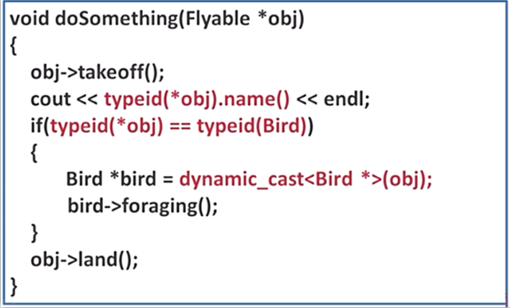
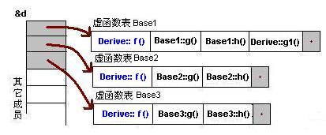
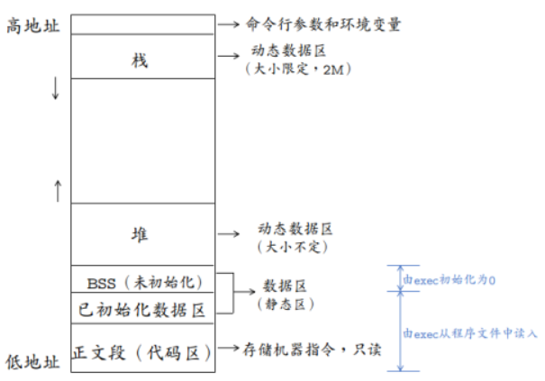
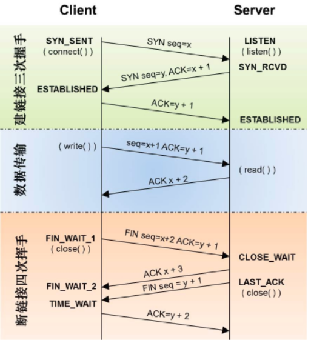
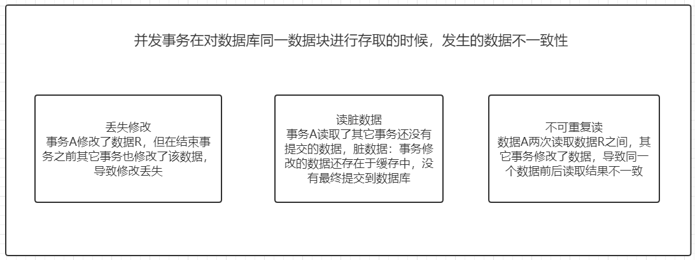
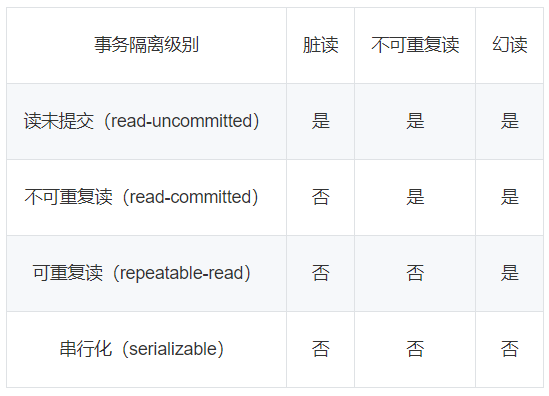

# 基础知识

## 1.基本语言（1）

### 1.1说一下static关键字的作用

**\1. 全局静态变量**

在全局变量前加上关键字static，全局变量就定义成一个全局静态变量.

内存中的位置：静态存储区，在整个程序运行期间一直存在。

初始化：未经初始化的全局静态变量会被自动初始化为0（自动对象的值是任意的，除非他被显式初始化）；

作用域：全局静态变量在声明他的文件之外是不可见的，准确地说是从定义之处开始，到文件结尾。

**\2.  局部静态变量**

在局部变量之前加上关键字static，局部变量就成为一个局部静态变量。

内存中的位置：静态存储区

初始化：未经初始化的局部静态变量会被自动初始化为0（自动对象的值是任意的，除非他被显式初始化）；

作用域：作用域仍为局部作用域，当定义它的函数或者语句块结束的时候，作用域结束。==但是当局部静态变量离开作用域后，并没有销毁，而是仍然驻留在内存当中，只不过我们不能再对它进行访问，直到该函数再次被调用，并且值不变；==

**\3. 静态函数**

在函数返回类型前加static，函数就定义为静态函数。函数的定义和声明在默认情况下都是extern的，**但静态函数只是在声明他的文件当中可见，不能被其他文件所用。**

==函数的实现使用static修饰，那么这个函数只可在本cpp内使用，不会同其他cpp中的同名函数引起冲突；==

**warning：**不要在头文件中声明static的全局函数，不要在cpp内声明非static的全局函数，如果你要在多个cpp中复用该函数，就把它的声明提到头文件里去，否则cpp内部声明需加上static修饰；

**\4. 类的静态成员**

在类中，**静态成员可以实现多个对象之间的数据共享**，并且使用静态数据成员还不会破坏隐藏的原则，即保证了安全性。因此，静态成员是类的所有对象中共享的成员，而不是某个对象的成员。对多个对象来说，静态数据成员只存储一处，供所有对象共用

**\5. 类的静态函数**

静态成员函数和静态数据成员一样，它们都属于类的静态成员，它们都不是对象成员。因此，对静态成员的引用不需要用对象名。

**在静态成员函数的实现中不能直接引用类中说明的非静态成员，可以引用类中说明的静态成员（这点非常重要）**。如果静态成员函数中要引用非静态成员时，可通过对象来引用。从中可看出，调用静态成员函数使用如下格式：<类名>::<静态成员函数名>(<参数表>);

### 1.2说一下C和C++的区别

**设计思想上：**

C++是面向对象的语言，而C是面向过程的结构化编程语言

**语法上：**

C++具有封装、继承和多态三种特性

C++相比C，增加多许多**类型安全**的功能，比如强制类型转换、

C++支持**范式编程**，比如模板类、函数模板等

### 1.3说一下C++中static关键字的作用

对于**函数定义和代码块之外的变量声明（全局）**，**static修改标识符的链接属性**，由默认的external变为internal([示例详解](https://blog.csdn.net/ljz2009y/article/details/8142653)），作用域和存储类型不改变，这些符号只能在声明它们的源文件中访问。

对于**代码块内部的变量声明（局部）**，static修改标识符的存储类型，由自动变量改为静态变量，作用域和链接属性不变。==这种变量在程序执行之前就创建，在程序执行的整个周期都存在。==

对于被static修饰的普通函数，其只能在定义它的源文件中使用，不能在其他源文件中被引用

对于被static修饰的类成员变量和成员函数，它们是属于类的，而不是某个对象，所有对象共享一个静态成员。静态成员通过<类名>::<静态成员>来使用。

1.加了static关键字的全局变量只能在本文件中使用。例如在a.c中定义了static int a=10;那么在b.c中用extern int a是拿不到a的值得，a的作用域只在a.c中。
 2.static定义的静态局部变量分配在数据段上，普通的局部变量分配在栈上，会因为函数栈帧的释放而被释放掉。3.对一个类中成员变量和成员函数来说，加了static关键字，则此变量/函数就没有了this指针了，必须通过类名才能访问

### 1.4说一次c++四种cast转换

**C++中四种类型转换是：static_cast, dynamic_cast, const_cast, reinterpret_cast**

**1、const_cast**：

用于将const变量转为非const

**2、static_cast：**

用于各种**隐式转换**，比如非const转const，void*转指针等, static_cast能用于多态向上（小范围->大范围)转化，如果向下转能成功但是不安全，结果未知；

**3、dynamic_cast**:

用于动态类型转换。**只能用于含有虚函数的类，用于类层次间的向上和向下转化。只能转指针或引用**。向下转化时，如果是非法的对于指针返回NULL，对于引用抛异常。要深入了解内部转换的原理。

向上转换：指的是子类向基类的转换

向下转换：指的是基类向子类的转换

它通过判断在执行到该语句的时候变量的运行时类型和要转换的类型是否相同来判断是否能够进行向下转换。

**4、reinterpret_cast**

几乎什么都可以转，比如将**int转指针**，可能会出问题，尽量少用；

**5、为什么不使用C的强制转换？**

C的强制转换表面上看起来功能强大什么都能转，但是**转化不够明确，不能进行错误检查，容易出错。**

### 1.5请说一下C/C++ 中指针和引用的区别？

**定义：**

**1、引用**

C++是C语言的继承，它可进行过程化程序设计，又可以进行以抽象数据类型为特点的基于对象的程序设计，还可以进行以继承和多态为特点的面向对象的程序设计。引用就是C++对C语言的重要扩充。引用就是某一变量的一个别名，对引用的操作与对变量直接操作完全一样。引用的声明方法：`类型标识符 &引用名=目标变量名；`引用引入了对象的一个同义词。定义引用的表示方法与定义[指针](https://baike.baidu.com/item/指针/2878304)相似，只是用&代替了*。

**2、指针**

指针利用地址，它的值直接指向存在电脑存储器中另一个地方的值。由于通过地址能找到所需的变量单元，可以说，地址指向该变量单元。因此，将地址形象化的称为“指针”。意思是通过它能找到以它为地址的内存单元。

**区别：**

1.指针有自己的一块空间，而引用只是一个别名；

2.使用sizeof看一个指针的大小是4，而引用则是被引用对象的大小；

3.指针可以被初始化为NULL，而引用必须被初始化且必须是一个已有对象 的引用；

4.作为参数传递时，指针需要被解引用才可以对对象进行操作，而直接对引 用的修改都会改变引用所指向的对象；

5.可以有const指针，但是没有const引用；

6.指针在使用中可以指向其它对象，但是引用只能是一个对象的引用，不能 被改变；

7.指针可以有多级指针（\**p），**而引用只有一级；**

8.指针和引用使用++运算符的意义不一样；

9.如果返回动态内存分配的对象或者内存，必须使用指针，**引用可能引起内存泄露**。

### 1.6给定三角形ABC和一点P(x,y,z)，判断点P是否在ABC内，给出思路并手写代码

```c++
/*根据面积法，如果P在三角形ABC内，那么三角形ABP的面积+三角形BCP的面积+三角形ACP的面积应该等于三角形ABC的面积。算法如下：*/
#include <iostream>
#include <math.h>
using namespace std;
#define ABS_FLOAT_0 0.0001
struct point_float
{
	float x;
	float y;
};

/**
* 计算三角形面积
*/
float GetTriangleSquar(const point_float pt0, const point_float pt1, const point_float pt2)
{
	point_float AB,   BC;
	AB.x = pt1.x - pt0.x;
	AB.y = pt1.y - pt0.y;
	BC.x = pt2.x - pt1.x;
	BC.y = pt2.y - pt1.y;
	return fabs((AB.x * BC.y - AB.y * BC.x)) / 2.0f;	//fabs(x):返回x的绝对值
    /*他求三角形的两个点不够严谨，但是结果一样，三角形A(x1,y1) B(x2,y2) C(x3,y3) ，从A点发的两条边 AC=(x3-x1,y3-y1)；AB=(x2-x1,y2-y1)，三角形的面积 S=1/2( AC x AB) (利用向量 的叉乘)
    海伦公式求：
    		double a,b,c,p,Area;
			cin>>a>>b>>c;
			p=(a+b+c)/2;
			Area=sqrt(p*(p-a)*(p-b)*(p-c));*/
}

/**
* @brief 判断给定一点是否在三角形内或边上
*/
bool IsInTriangle(const point_float A, const point_float B, const point_float C, const point_float D)
{
	float SABC, SADB, SBDC, SADC;
	SABC = GetTriangleSquar(A, B, C);
	SADB = GetTriangleSquar(A, D, B);
	SBDC = GetTriangleSquar(B, D, C);
	SADC = GetTriangleSquar(A, D, C);
	float SumSuqar = SADB + SBDC + SADC;
	if ((-ABS_FLOAT_0 < (SABC - SumSuqar)) && ((SABC - SumSuqar) < ABS_FLOAT_0))
	{
		return true;
	}
	else
	{
		return false;
	}
}
```

### 1.7请你说一下你理解的c++中的smart pointer四个智能指针： shared_ptr,unique_ptr,weak_ptr,auto_ptr

C++里面的四个智能指针: `auto_ptr, shared_ptr, weak_ptr, unique_ptr` 其中后三个是c++11支持，**并且第一个已经被11弃用。**

为什么要使用智能指针：

智能指针的作用是管理一个指针，因为存在以下这种情况：申请的空间在函数结束时忘记释放，造成内存泄漏。使用智能指针可以很大程度上的避免这个问题，==因为智能指针就是一个类，当超出了类的作用域是，类会自动调用析构函数，析构函数会自动释放资源==。所以智能指针的**作用原理就是在函数结束时自动释放内存空间，不需要手动释放内存空间。**

- **1. auto_ptr（c++98的方案，cpp11已经抛弃）**

采用所有权模式，把指针该有的所有权全部都拿过来 。

```c++
auto_ptr<string> p1 (new string ("I reigned lonely as a cloud.”));
auto_ptr<string> p2;
p2 = p1; //auto_ptr不会报错.
```

此时不会报错，p2剥夺了p1的所有权，但是当程序运行时访问p1将会报错。所以auto_ptr的缺点是：存在潜在的内存崩溃问题！

- **2. unique_ptr（替换auto_ptr）**

unique_ptr实现独占式拥有或**严格拥有概念**，保证同一时间内只有一个智能指针可以指向该对象**。它对于避免资源泄露(例如“以new创建对象后因为发生异常而忘记调用delete”)特别有用。

采用所有权模式，还是上面那个例子

```c++
unique_ptr<string> p3 (new string ("auto"));   //#4
unique_ptr<string> p4；                       //#5
p4 = p3;//此时会报错！！
```

**编译器认为p4=p3非法，**避免了p3不再指向有效数据的问题。因此，unique_ptr比auto_ptr更安全。

另外unique_ptr还有更聪明的地方：**当程序试图将一个 unique_ptr 赋值给另一个时，如果源 unique_ptr 是个临时右值，编译器允许这么做；如果源 unique_ptr 将存在一段时间，编译器将禁止这么做**，比如：

```c++
unique_ptr<string> pu1(new string ("hello world"));
unique_ptr<string> pu2;
pu2 = pu1;                                      // #1 not allowed
unique_ptr<string> pu3;
pu3 = unique_ptr<string>(new string ("You"));   // #2 allowed，临时右值允许
```

其中#1留下悬挂的unique_ptr(pu1)，这可能导致危害。而#2不会留下悬挂的unique_ptr，因为它调用 unique_ptr 的构造函数，该构造函数创建的临时对象在其所有权让给 pu3 后就会被销毁。这种随情况而已的行为表明，**unique_ptr 优于允许两种赋值的auto_ptr** 。

注：如果确实想执行类似与#1的操作，**要安全的重用这种指针，可给它赋新值。C++有一个标准库函数std::move()，让你能够将一个unique_ptr赋给另一个。**例如：

```c++
unique_ptr<string> ps1, ps2;
ps1 = demo("hello");
ps2 = move(ps1);	//在赋值之后，ps1的值是不确定的
ps1 = demo("alexia");
cout << *ps2 << *ps1 << endl;
```

通常情况下，static_cast 只能用于其他合法的类型转换。但是有一条针对右值的特许规则：虽然不能隐式的将一个左值转换成右值引用，但我们可以用static_cast显示的将一个左值转换为一个右值。

- **3. shared_ptr**

**shared_ptr实现共享式拥有概念。多个智能指针可以指向相同对象，该对象和其相关资源会在“最后一个引用被销毁”时候释放，当然这需要额外的开销。**从名字share就可以看出了资源可以被多个指针共享，它使用计数机制来表明资源被几个指针共享。可以通过成员函数`use_count()`来查看资源的所有者个数。除了可以通过new来构造，还可以通过传入auto_ptr, unique_ptr,weak_ptr来构造。当我们调用`release()`时，当前指针会释放资源所有权，计数减一。当计数等于0时，资源会被释放。

shared_ptr 是为了解决 auto_ptr 在对象所有权上的局限性(auto_ptr 是独占的), 在使用引用计数的机制上提供了可以共享所有权的智能指针。使用方法：

```c++
//最安全的分配和使用动态内存的方法
std::shared_ptr<int> sp1=std::make_shared<int>(11);
std::shared_ptr<std::string> sp2 = std::make_shared<std::string>("Hello c++");
auto sp3 = std::make_shared<int>(11);
printf("sp3=%d\n", *sp3);
auto sp4 = std::make_shared<std::string>("C++11");
printf("sp4=%s\n", (*sp4).c_str());
```

**成员函数：**

use_count （）：返回引用计数的个数

unique （）：返回是否是独占所有权( use_count 为 1)

swap （）：交换两个 shared_ptr 对象(即交换所拥有的对象)

reset（）： 放弃内部对象的所有权或拥有对象的变更, 会引起原有对象的引用计数的减少

get（） ：返回内部对象(指针), 由于已经重载了()方法, 因此和直接使用对象是一样的.如 ：
`shared_ptr<int> sp(new int(1));` sp 与 sp.get()是等价的。et用来将指针的访问权限传递给代码，只有在确定代码不会delete指针的情况下，才能使用get。特别是，永远不要用get初始化另一个智能指针或者为另一个智能指针赋值！

- **weak_ptr**

weak_ptr 是一种不控制对象生命周期的智能指针, **它指向一个 shared_ptr 管理的对象**. 进行该对象的内存管理的是那个强引用的 shared_ptr. weak_ptr只是提供了对管理对象的一个访问手段。weak_ptr 设计的目的是为配合 shared_ptr 而引入的一种智能指针来协助 shared_ptr 工作, 它只可以从一个 shared_ptr 或另一个 weak_ptr 对象构造, 它的构造和析构不会引起引用记数的增加或减少。weak_ptr是用来解决shared_ptr相互引用时的死锁问题,如果说两个shared_ptr相互引用,那么这两个指针的引用计数永远不可能下降为0,资源永远不会释放。**它是对对象的一种弱引用，不会增加对象的引用计数，和shared_ptr之间可以相互转化，shared_ptr可以直接赋值给它，它可以通过调用lock函数来获得shared_ptr。**

```c++
class B;
class A
{
public:
	shared_ptr<B> pb_;
	~A()
	{
		cout<<"A delete\n";
	}
};
class B
{
public:
	shared_ptr<A> pa_;
	~B()
	{
		cout<<"B delete\n";
	}
};
void fun()
{
	shared_ptr<B> pb(new B());
	shared_ptr<A> pa(new A());
	pb->pa_ = pa;
	pa->pb_ = pb;
	cout<<pb.use_count()<<endl;
	cout<<pa.use_count()<<endl;
}
int main()
{
	fun();
	return 0;
}
```

**可以看到fun函数中pa ，pb之间互相引用，两个资源的引用计数为2，当要跳出函数时，智能指针pa，pb析构时两个资源引用计数会减一，但是两者引用计数还是为1，导致跳出函数时资源没有被释放（A B的析构函数没有被调用）**，如果把其中一个改为weak_ptr就可以了，我们把类A里面的shared_ptr pb_; 改为weak_ptr pb_; 运行结果如下，这样的话，资源B的引用开始就只有1，当pb析构时，B的计数变为0，B得到释放，B释放的同时也会使A的计数减一，同时pa析构时使A的计数减一，那么A的计数为0，A得到释放。

**注意的是我们不能通过weak_ptr直接访问对象的方法**，比如B对象中有一个方法print(),我们不能这样访问，pa->pb_->print(); 英文pb_是一个weak_ptr，应该先把它转化为shared_ptr,如：
`shared_ptr p = pa->pb_.lock(); p->print();`

### 1.8怎么判断一个数是二的倍数，怎么求一个数中有几个1，说一下你的思路并手写代码

**1、判断一个数是不是二的倍数，即判断该数二进制末位是不是0：**

```c++
a % 2 == 0 或者a & 0x0001 == 0。
```

**2、求一个数中1的位数，可以直接逐位除十取余判断：（要考虑吧负数)**

**3、求二进制中1的位数：**

- 常规解法：把1左移和该数挨个与
- 牛逼解法：把一个整数-1，再和原整数做与运算，会把该整数最右边的1变成0，那么一个整数的二进制里有多少个1就可以进行多少次这样的操作。

### 1.9请回答一下数组和指针的区别


### 1.10请你回答一下野指针是什么？

野指针就是指向一个已删除的对象或者未申请访问受限内存区域的指针。

### 1.11请你介绍一下C++中的智能指针

智能指针主要用于管理在堆上分配的内存，**它将普通的指针封装为一个栈对象**。当栈对象的生存周期结束后，会在析构函数中释放掉申请的内存，从而防止内存泄漏。C++ 11中最常用的智能指针类型为shared_ptr,它采用引用计数的方法，记录当前内存资源被多少个智能指针引用。该引用计数的内存在堆上分配。当新增一个时引用计数加1，当过期时引用计数减一。只有引用计数为0时，智能指针才会自动释放引用的内存资源。对shared_ptr进行初始化时不能将一个普通指针直接赋值给智能指针，因为一个是指针，一个是类。可以通过make_shared函数或者通过构造函数传入普通指针。并可以通过get函数获得普通指针。

### 1.12请你回答一下智能指针有没有内存泄露的情况

当两个对象相互使用一个shared_ptr成员变量指向对方，会造成循环引用，使引用计数失效，从而导致内存泄漏。例如：

```c++
#include <memory>
#include <iostream>
using namespace std;
class Child;
class Parent{
private:
	shared_ptr<Child> childPtr;
public:
	void setChild(shared_ptr<Child> child){
		this->childPtr=child;
	}
	void doSomething(){
		if(this->childPtr.use_count()){
			
		}
	}
	~Parent(){
		cout<<"parent delete."<<endl;
	}
};
class Child{
private:
	shared_ptr<Parent> parentPtr;
public:
	void setParent(shared_ptr<Parent> parent){
		this->parentPtr=parent;
	}
	void doSomething(){
		if(this->parentPtr.use_count()){
			
		}
	}
	~Child(){
		cout<<"child delete."<<endl;
	}
};
int main(){
	weak_ptr<Parent> pp;
	weak_ptr<Child> cc; 
	{
		shared_ptr<Parent> p(new Parent);
		shared_ptr<Child> c(new Child);
		p->setChild(c);
		c->setParent(p);
		pp=p;
		cc=c;
		cout<<"Parent的引用指针个数："<<pp.use_count()<<endl; 
		cout<<"Child的引用指针个数："<<cc.use_count()<<endl; 
	}	//正常来说到这一步两个智能指针对象会被析构，引用计数-1结果为1！所以Parent和Child对象并没有被析构 
	cout<<"Parent的引用指针个数："<<pp.use_count()<<endl; 
	cout<<"Child的引用指针个数："<<cc.use_count()<<endl; 
} 
```

上述代码中，parent有一个shared_ptr类型的成员指向孩子，而child也有一个shared_ptr类型的成员指向父亲。然后在创建孩子和父亲对象时也使用了智能指针c和p，随后将c和p分别又赋值给child的智能指针成员parent和parent的智能指针成员child。从而形成了一个循环引用

### 1.13请你来说一下智能指针的内存泄漏如何解决

为了解决循环引用导致的内存泄漏，引入了weak_ptr弱指针，weak_ptr的构造函数不会修改引用计数的值，从而不会对对象的内存进行管理，**其类似一个普通指针，但不指向引用计数的共享内存，但是其可以检测到所管理的对象是否已经被释放，从而避免非法访问。**

## 2.基本语言（2）

### 2.1请你回答一下为什么析构函数必须是虚函数？为什么C++默认的析构函数不是虚函数

将可能会被继承的父类的析构函数设置为虚函数，可以保证当我们new一个子类，然后使用基类指针指向该子类对象，释放基类指针时可以释放掉子类的空间，防止内存泄漏。

**C++默认的析构函数不是虚函数是因为虚函数需要额外的虚函数表和虚表指针，占用额外的内存。而对于不会被继承的类来说，其析构函数如果是虚函数，就会浪费内存。**因此C++默认的析构函数不是虚函数，而是只有当需要当作父类时，设置为虚函数。

### 2.2请你来说一下函数指针

**1、定义**：函数指针是指向函数的指针变量。

函数指针本身首先是一个指针变量，该指针变量指向一个具体的函数。这正如用指针变量可指向整型变量、字符型、数组一样，这里是指向函数。

C在编译时，**每一个函数都有一个入口地址**，该入口地址就是函数指针所指向的地址。有了指向函数的指针变量后，可用该指针变量调用函数，就如同用指针变量可引用其他类型变量一样，在这些概念上是大体一致的。

**2、用途：**调用函数和做函数的参数，比如回调函数。

**3、示例：**

```c++
char * fun(char * p)  {…}       	// 函数fun
char * (*pf)(char * p);             // 函数指针pf，参数和返回值要保持一致
pf = fun;                        // 函数指针pf指向函数fun
pf(p);                        	 // 通过函数指针pf调用函数fun
```

### 2.3 请你来说一下fork函数

Fork：创建一个和当前进程映像一样的进程可以通过fork( )系统调用：

```c++
#include <sys/types.h>
#include <unistd.h>

pid_t fork(void);
```

成功调用fork( )会创建一个新的进程，它几乎与调用fork( )的进程一模一样，这两个进程都会继续运行。在子进程中，成功的fork( )调用会返回0。在父进程中fork( )返回子进程的pid。如果出现错误，fork( )返回一个负值。

最常见的fork( )用法是创建一个新的进程，**然后使用exec( )载入二进制映像，替换当前进程的映像**。这种情况下，派生（fork）了新的进程，而这个子进程会执行一个新的二进制可执行文件的映像。这种“派生加执行”的方式是很常见的。

在早期的Unix系统中，创建进程比较原始。当调用fork时，内核会把所有的内部数据结构复制一份，复制进程的页表项，然后把父进程的地址空间中的内容逐页的复制到子进程的地址空间中。但从内核角度来说，逐页的复制方式是十分耗时的。现代的Unix系统采取了更多的优化，**例如Linux，采用了写时复制的方法，而不是对父进程空间进程整体复制。**

**fork之后父子进程的差异：**

- 父子相同处：（各自独有） 全局变量、.data、.text、栈、堆、环境变量、用户ID、宿主目录、进程工作目录、信号处理方式...
- 父子不同处： 1.进程ID   2.fork返回值   3.父进程ID    4.进程运行时间    5.闹钟(定时器)   6.未决信号集
  似乎，子进程复制了父进程0-3G用户空间内容，以及父进程的PCB，但pid不同。真的每fork一个子进程都要将父进程的0-3G地址空间完全拷贝一份，然后在映射至物理内存吗？
  当然不是!父子进程间遵循**读时共享写时复制**的原则。这样设计，无论子进程执行父进程的逻辑还是执行自己的逻辑都能节省内存开销。   

### 2.4请你来说一下C++中析构函数的作用

析构函数与构造函数对应，当对象结束其生命周期，如对象所在的函数已调用完毕时，系统会自动执行析构函数。

析构函数名也应与类名相同，只是在函数名前面加一个位取反符~，例如~stud( )，以区别于构造函数。它不能带任何参数，也没有返回值（包括void类型）。只能有一个析构函数，不能重载。

如果用户没有编写析构函数，编译系统会自动生成一个缺省的析构函数（==即使自定义了析构函数，编译器也总是会为我们合成一个析构函数==，并且**如果自定义了析构函数，编译器在执行时会先调用自定义的析构函数再调用合成的析构函数**），它也不进行任何操作。所以许多简单的类中没有用显式的析构函数。

如果一个类中有指针，且在使用的过程中动态的申请了内存，那么最好显示构造析构函数在销毁类之前，释放掉申请的内存空间，避免内存泄漏。

类析构顺序：1）派生类本身的析构函数；2）对象成员析构函数；3）基类析构函数。（与构造相反）

### 2.5请你来说一下静态函数和虚函数的区别

静态函数在**编译**的时候就已经确定运行时机，虚函数在**运行**的时候动态绑定。**虚函数因为用了虚函数表机制，调用的时候会增加一次内存开销。**

### 2.6介绍一下编译和运行

一个典型的程序的运行步骤大概是这个样子：

​	1、操作系统创建进程后把控制权交给这个神秘的入口函数.
​	2、入口函数对运行库和程序运行环境进行初始化，包括堆分配，I/O资源的分配，线程，全局变量构造等。
​	3、入口函数调用main函数，执行程序主体。
​	4、main返回之后，回到入口函数，清理堆，关闭I/O,析构全局变量，然后结束进程。

**编译时：**就是编译器帮你把源代码翻译成机器能识别的代码，这个过程中做的啥类型检查也就叫编译时类型检查,或静态类型检查(所谓静态嘛就是没真把代码放内存中运行起来,而只是把代码当作文本来扫描下).所以有时一些人说编译时还分配内存啥的肯定是错误的说法.

**运行时：**所谓运行时就是代码跑起来了.被装载到内存中去了.(你的代码保存在磁盘上没装入内存之前是个死家伙.只有跑到内存中才变成活的).而运行时类型检查就与前面讲的编译时类型检查(或者静态类型检查)不一样.不是简单的扫描代码.而是在内存中做些操作,做些判断.

**编译（静态）初始化：**静态初始化指的是用常量来对变量进行初始化,主要包括 zero initialization 和 const initialization，静态初始化在程序加载的过程中完成，对简单类型(内建类型，POD等)来说，从具体实现上看，zero initialization 的变量会被保存在 bss 段（全局未初始化区），const initialization 的变量则放在 data 段（全局初始化区）内，程序加载即可完成初始化，这和 c 语言里的全局变量初始化基本是一致的。

**运行（动态）初始化：**动态初始化主要是指需要经过函数调用才能完成的初始化，比如说：`const int i = get_size()`，或者是复杂类型（类）的初始化（需要调用构造函数）等。这些变量的初始化会在 main 函数执行前由运行时调用相应的代码从而得以进行(函数内的 static 变量除外)。

### 2.7请你说一说重载和覆盖

重载：两个函数名相同，但是参数列表不同（个数，类型），返回值类型没有要求，在同一作用域中
重写：子类继承了父类，**父类中的函数是虚函数**，在子类中重新定义了这个虚函数，这种情况是重写

### 2.8请你说一说strcpy和strlen

**strcpy**是字符串拷贝函数，原型：

`char *strcpy(char* dest, const char *src);`

从src逐字节拷贝到dest，直到遇到'\0'结束，因为没有指定长度，可能会导致拷贝越界，造成缓冲区溢出漏洞,**安全版本是strncpy函数。**
**strlen**函数是计算字符串长度的函数，返回从开始到'\0'之间的字符个数。

### 2.9请你说一说你理解的虚函数和多态

多态的实现主要分为静态多态和动态多态，**静态多态主要是重载，在编译的时候就已经确定；动态多态是用虚函数机制实现的，在运行期间动态绑定。**举个例子：一个父类类型的指针指向一个子类对象时候，使用父类的指针去调用子类中重写了的父类中的虚函数的时候，会调用子类重写过后的函数，在父类中声明为加了virtual关键字的函数，在子类中重写时候不需要加virtual也是虚函数。
虚函数的实现：在有虚函数的类中，类的最开始部分是一个虚函数表的指针，这个指针指向一个虚函数表，表中放了虚函数的地址，**实际的虚函数在代码段(.text)中**。当子类继承了父类的时候也会继承其虚函数表，当子类重写父类中虚函数时候，会将其继承到的虚函数表中的地址替换为重新写的函数地址。使用了虚函数，会增加访问内存开销，降低效率。

### 2.10请你来说一说++i和i++的实现

**++i:(可以做左值)**

```c++
int&  int::operator++（）
{
	*this +=1；
	return *this；
}
```

**i++:(不可以做左值)**

```c++
const int  int::operator（int）
{
	int oldValue = *this；
	++（*this）；
	return oldValue；
}
```

### 2.11说明C++中static,const以及static const成员变量的初始化

在C++中，static静态成员变量不能在类的内部直接初始化。在类的内部只是声明，定义必须在类定义体的外部，通常在类的实现文件中初始化，static关键字只能用于类定义内部的声明中，定义时不能标示为static。

在C++中，const的成员变量也不能在类定义出初始化，只能通过构造函数初始化列表进行，并且必须有构造函数，const数据成员只在某个对象生存期内是常量，而对整个类而言却是可变的。因为类可以创建多个对象，不同的对象没被创建时，编译器不知道cosnt数据成员的值是什么。如下例：

```c++
class Test{
public:
    Test():a(0){}
    enum{size=100,size2=200};
private:
    const int a;	//只能在构造函数初始化列表初始化
    static int b;	//只能在类的外边定义并初始化
    const static int c;	//与static const int相同，c为整形，所以可以在此处初始化，但仍要在类定义体外进行定义(先定义再初始化嘛)，注意c为非整形时，不能在此处初始化
};
int Test:b=0;	//static不能写
const int Test::c=0;
```

### 2.12如何用宏求结构体的内存偏移地址

### 2.17请你来说一下C++里是怎么定义常量的？常量存放在内存的哪个位置？

常量在C++里的定义就是一个top-level const加上对象类型，**常量定义必须初始化**。对于局部对象，常量存放在栈区，对于全局对象，常量存放在全局/静态存储区。**对于字面值常量，常量存放在常量存储区。**

### 2.18请你来回答一下const修饰成员函数的目的是什么？

const修饰的成员函数表明函数调用不会对对象做出任何更改，事实上，如果确认不会对对象做更改，就应该为函数加上const限定，这样无论const对象还是普通对象都可以调用该函数。

## 3.基本语言（3）

### 3.1如果同时定义了两个函数，一个带const，一个不带，会有问题吗？

不会，这相当于函数的重载。

### 3.2请你来说一说隐式类型转换

首先，对于内置类型，低精度的变量给高精度变量赋值会发生隐式类型转换，其次，对于只存在单个参数的构造函数的对象构造来说，函数调用可以直接使用该参数传入，编译器会自动调用其构造函数生成临时对象。
`A *aa=new B;	//若B不是public继承，则指针不能隐式转`	

### 3.3说说你了解的类型转换

**reinterpret_cast：**可以用于任意类型的指针之间的转换，**对转换的结果不做任何保证**，不安全
**dynamic_cast：**这种其实也是不被推荐使用的，更多使用static_cast，**dynamic本身只能用于存在虚函数的父子关系的强制类型转换，对于指针，转换失败则返回nullptr，对于引用，转换失败会抛出异常**
**const_cast：**对于未定义const版本的成员函数，我们通常需要使用const_cast来去除const引用对象的const，完成函数调用。另外一种使用方式，结合static_cast，可以在非const版本的成员函数内添加const，调用完const版本的成员函数后，再使用const_cast去除const限定。
**static_cast：**完成基础数据类型；同一个继承体系中类型的转换；任意类型与空指针类型void* 之间的转换。用的最多最广泛

### 3.4请你来说一说C++函数栈空间的最大值

默认是1M，不过可以调整

### 3.5请你来说一说extern“C”

C++调用C函数需要extern C，因为C语言没有函数重载。是为了支持重载机制，在编译生成的汇编码中，要对函数的名字进行一些处理，加入比如函数的返回类型等信息。而在c语言中，只是简单的函数名字而已，不会加入其它的信息，也就是说:c++和c语言对产生的函数名字的处理是不一样的。

extern “C"告诉编译器该函数是用C编译器编译的，请用C的方式来链接他们，用法在声明函数时，前面加上这句话

### 3.6请你回答一下new/delete与malloc/free的区别是什么

1、malloc和free是C/C++语言的标准库函数，new和delete是C++的运算符
2、new自动计算需要分配的空间，而malloc需要手工计算字节数
3、new是类型安全的（编译时可以指出错误），而malloc不是
4、new调用operator new 分配足够的空间，并且调用相关对象的构造函数，而malloc不能调用构造函数；
5、malloc/free需要库文件支持，new/delete则不需要

### 3.7请你说说你了解的RTTI

RTTI， Run-Time Type Identification，称为 运行时类型识别 ，旨在为程序在运行阶段确定对象的类型提供一种标准方式。

运行时类型检查，在C++层面主要体现在dynamic_cast和typeid,VS中虚函数表的-1位置存放了指向type_info的指针**。对于存在虚函数的类型，typeid和dynamic_cast都会去查询type_info**

举例：

typeid(*obj).name() 可以获得当前 obj 指针指向的实际的对象类型，用cout 可以将其打印出来，再通过 if 语句进行比对，比对完成后，就可以将obj 通过 dynamic_cast 的方式将其转化成为 bird 的指针 。

转化时要注意：dynamic_cast 后面跟两个尖括号，中间写上要转化的目标类型。

**关于 dynamic_cast 的注意事项：**

​	1、只能应用与指针和引用的转换，即只能转化为某一个类型的指针或某一个类型的引用，而不能是某类型本身
​	2、要转化的类型中必须包含虚函数，如果没有虚函数，转换就会失败
​	3、如果转换成功，返回子类的地址，如果转换失败，返回NULL

**关于 typeid 的注意事项：**

​	1、**typeid 返回一个 type_info 的对象引用**
​	2、如果想通过基类的指针指向派生类的数据类型，基类就必须要带有虚函数，否则，在使用typeid 时，就只能返回定义时所使用的数据类型
​	3、typeid 只能获取对象的实际类型，即便这个类含有虚函数，也只能判断当前对象是基类还是派生类，而不能判断当前指针是基类还是派生类

### 3.8请你说说虚函数表具体是怎样实现运行时多态的?

包含虚函数的类才会有虚函数表， 同属于一个类的对象**共享虚函数表**， 但是有各自的_vptr。虚函数表实质是一个指针数组，里面存的是虚函数的函数指针。

结构示意：有几个父类就会有几个虚函数表，子类会重写继承来的虚函数表。父类虚函数表中的f()的位置被替换成了子类的函数指针。这样，我们就可以任一静态类型的父类来指向子类，并调用子类的f()了。


子类若重写父类虚函数，虚函数表中，该函数的地址会被替换，对于存在虚函数的类的对象，在VS中，对象的对象模型的头部存放指向虚函数表的指针，通过该机制实现多态。

### 3.9请你说说C语言是怎么进行函数调用的？

每一个函数调用都会分配函数栈，在栈内进行函数执行过程。调用前，先把返回地址压栈，然后把当前函数的esp（栈指针）指针压栈。

### 3.10请你说说C语言参数压栈顺序？

从右到左

### 3.11请你回答一下C++中拷贝赋值函数的形参能否进行值传递？

不能。如果是这种情况下，调用拷贝构造函数的时候，首先要将实参传递给形参，这个传递的时候又要调用拷贝构造函数。。如此循环，无法完成拷贝，栈也会满。

### 3.12请你说一说select

select用在多路I/O转接模型，调用select交由Linux内核去处理客户端的请求和发送的数据，select能监听到的文件描述符个数受限于1024，并且还采用的是轮询模型当超过1024会大大降低服务器响应效率。select在使用前，先将需要监控的描述符对应的bit位置1，然后将其传给select,当有任何一个事件发生时，select将会返回所有的描述符，需要在应用程序自己遍历去检查哪个描述符上有事件发生，效率很低，并且其不断在内核态和用户态进行描述符的拷贝，开销很大。

### 3.13 请你说说fork,wait,exec函数

父进程产生子进程使用fork拷贝出来一个父进程的副本，此时只拷贝了父进程的页表，两个进程都读同一块内存，当有进程写的时候使用写实拷贝机制分配内存，**exec函数可以加载一个elf文件去替换父进程**，从此父进程和子进程就可以运行不同的程序了。fork从父进程返回子进程的pid，从子进程返回0.调用了wait的父进程将会发生阻塞，直到有子进程状态改变,执行成功返回0，错误返回-1。exec执行成功则子进程从新的程序开始运行，无返回值，执行失败返回-1

如果想通过基类的指针指向派生类的数据类型，基类就必须要带有虚函数，否则，在使用typeid 时，就只能返回定义时所使用的数据类型

3、typeid 只能获取对象的实际类型，即便这个类含有虚函数，也只能判断当前对象是基类还是派生类，而不能判断当前指针是基类还是派生类

## 4.容器和算法

### 4.1请你来说一下map和set有什么区别，分别又是怎么实现的？

map和set都是C++的关联容器，其底层实现都是红黑树（RB-Tree）。由于 map 和set所开放的各种操作接口，RB-tree 也都提供了，所以几乎所有的 map 和set的操作行为，都只是转调 RB-tree 的操作行为。

map和set区别在于：

（1）map中的元素是key-value（关键字—值）对：关键字起到索引的作用，值则表示与索引相关联的数据；Set与之相对就是关键字的简单集合，set中每个元素只包含一个关键字。

（2）set的迭代器是const的，不允许修改元素的值；map允许修改value，但不允许修改key。**其原因是因为map和set是根据关键字排序来保证其有序性的**，如果允许修改key的话，那么首先需要删除该键，然后调节平衡，再插入修改后的键值，调节平衡，如此一来，严重破坏了map和set的结构，导致iterator失效，不知道应该指向改变前的位置，还是指向改变后的位置。所以STL中将set的迭代器设置成const，不允许修改迭代器的值；而map的迭代器则不允许修改key值，允许修改value值。

（3）map支持下标操作，set不支持下标操作。map可以用key做下标，map的下标运算符[ ]将关键码作为下标去执行查找，如果关键码不存在，则插入一个具有该关键码和mapped_type类型默认值的元素至map中，因此下标运算符[ ]在map应用中需要慎用，const_map不能用，只希望确定某一个关键值是否存在而不希望插入元素时也不应该使用，**mapped_type类型没有默认值也不应该使用**。如果find能解决需要，尽可能用find。

### 4.2请你来介绍一下STL的allocator

STL的分配器用于**封装STL容器在内存管理上的底层细节**。在C++中，其内存配置和释放如下：

new操作符(new operator)运算分两个阶段：(1)调用::operator new配置内存;(2)调用对象构造函数构造对象内容

delete运算分两个阶段：(1)调用对象析构函数；(2)调用::operator delete释放内存

为了精密分工，**STL allocator将两个阶段操作区分开来**：内存配置有alloc::allocate()负责，内存释放由alloc::deallocate()负责；对象构造由::construct()负责，对象析构由::destroy()负责。

同时为了提升内存管理的效率，减少申请小内存造成的内存碎片问题，SGI STL采用了两级配置器，当分配的空间大小超过128B时，会使用第一级空间配置器；当分配的空间大小小于128B时，将使用第二级空间配置器。第一级空间配置器直接使用malloc()、realloc()、free()函数进行内存空间的分配和释放，而第二级空间配置器采用了内存池技术，通过空闲链表来管理内存。

### 4.3operator new 和 new operator:

## 5.类和数据抽象

### 5.1请你来说一下C++中类成员的访问权限

C++通过 public、protected、private 三个关键字来控制成员变量和成员函数的访问权限，它们分别表示公有的、受保护的、私有的，被称为成员访问限定符。在类的内部（定义类的代码内部），无论成员被声明为 public、protected 还是 private，都是可以互相访问的，没有访问权限的限制。在类的外部（定义类的代码之外），只能通过对象访问成员，并且通过对象只能访问 public 属性的成员，不能访问 private、protected 属性的成员

### 5.2请你来说一下C++中struct和class的区别

在C++中，可以用struct和class定义类，都可以继承。区别在于：struct的默认继承权限和默认访问权限是public，而class的默认继承权限和默认访问权限是private。

另外，class还可以定义模板类形参，比如template <class T, int i>。

### 5.3 请你回答一下C++类内可以定义引用数据成员吗？

可以，必须通过成员函数初始化列表初始化。

## 6.面向对象与泛型编程

### 6.1请你回答一下什么是右值引用，跟左值又有什么区别？

右值引用是C++11中引入的新特性 , 它实现了**转移语义和精确传递**。它的主要目的有两个方面：

\1. 消除两个对象交互时不必要的对象拷贝，节省运算存储资源，提高效率。

\2. 能够更简洁明确地定义泛型函数。

**左值和右值的概念**：

左值：能对表达式取地址、或具名对象/变量。一般指表达式结束后依然存在的持久对象。

右值：不能对表达式取地址，或匿名对象。一般指表达式结束就不再存在的临时对象。

**右值引用和左值引用的区别：**

\1. 左值可以寻址，而右值不可以。

\2. 左值可以被赋值，右值不可以被赋值，可以用来给左值赋值。

\3. 左值可变,右值不可变（仅对基础类型适用，用户自定义类型右值引用可以通过成员函数改变）。

## 7.编译与底层


# 操作系统

## 1.操作系统（1）

### 1.1请你说一下进程与线程的概念，以及为什么要有进程线程，其中有什么区别，他们各自又是怎么同步的。

**基本概念：**

进程：是对运行时程序的封装，是系统进行**资源调度和分配的的基本单位**，实现了**操作系统的并发；**

线程：是进程的子任务，**是CPU调度和分派的基本单位**，用于保证程序的实时性，实现**进程内部的并发**；线程是操作系统**可识别的最小执行和调度单位**。每个线程都独自占用一个虚拟处理器：独自的寄存器组，指令计数器和处理器状态。每个线程完成不同的任务，但是共享同一地址空间（也就是同样的动态内存，映射文件，目标代码等等），共享打开的文件队列和其他内核资源。

**区别：**

1.一个线程只能属于一个进程，而一个进程可以有多个线程，但**至少有一个线程**。线程依赖于进程而存在。

2.进程在执行过程中拥有独立的内存单元，而多个线程共享进程的内存。（资源分配给进程，同一进程的所有线程共享该进程的所有资源。同一进程中的多个线程共享代码段（代码和常量），数据段（全局变量和静态变量），扩展段（堆存储）。但是每个线程拥有自己的栈段，栈段又叫运行时段，用来存放所有局部变量和临时变量。）

3.**进程是资源分配的最小单位，线程是CPU调度的最小单位；**

4.系统开销： 由于在创建或撤消进程时，系统都要为之分配或回收资源，如内存空间、I／O设备等。因此，操作系统所付出的开销将显著地大于在创建或撤消线程时的开销。类似地，**在进行进程切换时，涉及到整个当前进程CPU环境的保存以及新被调度运行的进程的CPU环境的设置**。而线程切换只须保存和设置**少量寄存器**的内容，并不涉及存储器管理方面的操作。可见，进程切换的开销也远大于线程切换的开销。

5.通信：由于同一进程中的**多个线程具有相同的地址空间**，致使它们之间的同步和通信的实现，也变得比较容易。进程间通信IPC，需要进程同步和互斥手段的辅助，以保证数据的一致性。线程间可以直接读写进程数据段（如全局变量）来进行通信。在有的系统中，线程的切换、同步和通信都无须操作系统内核的干预

6.进程编程调试简单可靠性高，但是创建销毁开销大；线程正相反，开销小，切换速度快，但是编程调试相对复杂。

7.**进程间不会相互影响 ；线程一个线程挂掉将导致整个进程挂掉**

8.进程适应于多核、多机分布；线程适用于多核。

#### **进程间通信的方式：**

进程间通信主要包括**管道、系统IPC（包括消息队列、信号量、信号、共享内存等）、以及套接字socket。**

- **1.管道：**

管道主要包括无名管道和命名管道:管道可用于具有亲缘关系的父子进程间的通信，有名管道除了具有管道所具有的功能外，它还允许无亲缘关系进程间的通信

​		1.1 普通管道PIPE：
​		1)它是半双工的（即数据只能在一个方向上流动），具有固定的读端和写端
​		2)它只能用于**具有亲缘关系**的进程之间的通信（也是父子进程或者兄弟进程之间）
​		3)它可以看成是一种特殊的文件，对于它的读写也可以使用普通的read、write等函数。但是它不是普通的文件，并不属于其他任何文件系统，并且只存在于内存中。

​		1.2 命名管道**FIFO**：
​		1)FIFO可以在**无关的进程之间**交换数据
​		2)FIFO有路径名与之相关联，它以一种特殊设备文件形式存在于文件系统中。

- **2.系统IPC（Interprosses communication）**：

  **2.1 消息队列**

  消息队列，**是消息的链接表，存放在内核中。一个消息队列由一个标识符（即队列ID）来标记**。 (消息队列克服了信号传递信息少，**管道只能承载无格式字节流以及缓冲区大小受限**等特点)具有写权限得进程可以按照一定得规则向消息队列中添加新信息；对消息队列有读权限得进程则可以从消息队列中读取信息；

  特点：
  1)消息队列是**面向记录**的，其中的消息具有特定的格式以及特定的优先级。
  2)消息队列**独立**于发送与接收进程。进程终止时，消息队列及其内容并不会被删除。
  3)消息队列**可以实现消息的随机查询**,消息不一定要以先进先出的次序读取,也可以按消息的类型读取。

​		**2.2 信号量semaphore**

​		信号量（semaphore）与已经介绍过的 IPC 结构不同，它是一个**计数器**，可以用来控制多个进程对共享资源的访问。**信号量用于实现进程间的互斥与同步，而不是用于存储进程间通信数据。**

​		特点：
​		1)信号量用于进程间同步，若要在进程间传递数据需要结合共享内存。		
​		2)信号量基于操作系统的 PV 操作，程序对信号量的操作都是原子操作。		
​		3)每次对信号量的 PV 操作不仅限于对信号量值加 1 或减 1，而且可以加减任意正整数。		
​		4)支持信号量组。

注：pv操作：就是来解决互斥与同步的问题的。

P操作：
	1.信号量有效（值>0）
	2.信号量值减1
	3.任务继续运行
	4.信号量值=0
	5.等待信号量的进程被列入等待信号量进程列表。
V操作：
	1.没有进程等待信号量
	2.信号量的值加1
	3.有进程等待信号量
	4.信号量的值加1
	5.等待的其中一个进程进入就绪状态

​	**2.3 信号signal**

​	信号是一种比较复杂的通信方式，用于通知接收进程某个事件已经发生。

​	**2.4 共享内存（Shared Memory）**

​		它使得多个进程可以访问同一块内存空间，不同进程可以及时看到对方进程中对共享内存中数据得更新。这种方式需要依靠某种同步操作，如互斥锁和信号量等

​		特点：
​			1)共享内存是最快的一种IPC，因为进程是直接对内存进行存取
​			2)因为多个进程可以同时操作，所以需要进行同步
​			3)信号量+共享内存通常结合在一起使用，信号量用来同步对共享内存的访问

- **3.套接字SOCKET：**

socket也是一种进程间通信机制，与其他通信机制不同的是，它可用于不同主机之间的进程通信。

#### 线程间通信的方式:

**临界区：**通过多线程的串行化来访问公共资源或一段代码，速度快，适合控制数据访问；

**互斥量Synchronized/Lock：**采用互斥对象机制，只有拥有互斥对象的线程才有访问公共资源的权限。因为互斥对象只有一个，所以可以保证公共资源不会被多个线程同时访问

**信号量Semphare：**为控制具有有限数量的用户资源而设计的，**它允许多个线程在同一时刻去访问同一个资源**，但一般需要限制同一时刻访问此资源的最大线程数目。

**事件(信号)，Wait/Notify**：通过通知操作的方式来保持多线程同步，还可以方便的实现多线程优先级的比较操作

### 1.2请你说一说Linux虚拟地址空间

**为了防止不同进程同一时刻在物理内存中运行而对物理内存的争夺和践踏，采用了虚拟内存。**

虚拟内存技术使得不同进程在运行过程中，它所看到的是自己独自占有了当前系统的4G内存。**所有进程共享同一物理内存**，每个进程只把自己目前需要的虚拟内存空间映射并存储到物理内存上。 事实上，在每个进程创建加载时，内核只是为进程“创建”了虚拟内存的布局，具体就是初始化进程控制表中内存相关的链表，实际上并不立即就把虚拟内存对应位置的程序数据和代码（比如.text .data段）拷贝到物理内存中，只是建立好虚拟内存和磁盘文件之间的映射就好（叫做**存储器映射**），等到运行到对应的程序时，才会通过缺页异常，来拷贝数据。还有进程运行过程中，要动态分配内存，比如malloc时，也只是分配了虚拟内存，即为这块虚拟内存对应的页表项做相应设置，当进程真正访问到此数据时，才引发缺页异常。

**请求分页系统、请求分段系统和请求段页式系统都是针对虚拟内存的**，通过请求实现内存与外存的信息置换。

**虚拟内存的好处：**

1.扩大地址空间；

2.内存保护：每个进程运行在各自的虚拟内存地址空间，互相不能干扰对方。虚存还对特定的内存地址提供写保护，可以防止代码或数据被恶意篡改。

3.公平内存分配。采用了虚存之后，每个进程都相当于有同样大小的虚存空间。

4.当进程通信时，可采用虚存共享的方式实现。

5.当不同的进程使用同样的代码时，比如库文件中的代码，物理内存中可以只存储一份这样的代码，不同的进程只需要把自己的虚拟内存映射过去就可以了，节省内存

6.虚拟内存很适合在多道程序设计系统中使用，许多程序的片段同时保存在内存中。当一个程序等待它的一部分读入内存时，可以把CPU交给另一个进程使用。在内存中可以保留多个进程，系统并发度提高

7.在程序需要分配连续的内存空间的时候，只需要在虚拟内存空间分配连续空间，而不需要实际物理内存的连续空间，可以利用碎片

**虚拟内存的代价：**

1.虚存的管理需要建立很多数据结构，这些数据结构要占用额外的内存

2.虚拟地址到物理地址的转换，增加了指令的执行时间。

3.页面的换入换出需要磁盘I/O，这是很耗时的

4.如果一页中只有一部分数据，会浪费内存。

### 1.3请你说一说操作系统中的程序的内存结构



一个程序本质上都是由BSS段、data段、text段三个组成的。可以看到一个可执行程序在存储（没有调入内存）时分为代码段、数据区和未初始化数据区三部分。

**bss段（未初始化）**：通常用来存放程序中未初始化的全局变量和静态变量的一块内存区域。BSS段属于静态分配，程序结束后静态变量资源由系统自动释放。bss段（未进行初始化的数据）的内容并不存放在磁盘上的程序文件中。其原因是内核在程序开始运行前将它们设置为0。需要存放在程序文件中的只有正文段和初始化数据段。

**text段（已初始化）**：存放程序中**已初始化的全局变量**的一块内存区域。数据段也属于静态内存分配

**data段**：存放**程序执行代码**的一块内存区域。这部分区域的大小在程序运行前就已经确定，并且内存区域属于只读。在代码段中，也有可能包含一些只读的常数变量。为数据分配空间，数据保存到目标文件中。

text段和data段在编译时已经分配了空间，而bss段并不占用可执行文件的大小，它是由链接器来获取内存的。

可执行程序**在运行时又多出两个区域**：栈区和堆区。

**栈区**：由编译器自动释放，存放函数的参数值、局部变量等。每当一个函数被调用时，该函数的返回类型和一些调用的信息被存放到栈中。然后这个被调用的函数再为他的自动变量和临时变量在栈上分配空间。每调用一个函数一个新的栈就会被使用。栈区是从高地址位向低地址位增长的，是一块连续的内存区域，最大容量是由系统预先定义好的，申请的栈空间超过这个界限时会提示溢出，用户能从栈中获取的空间较小。

**堆区**：用于动态分配内存，位于BSS和栈中间的地址区域。由程序员申请分配和释放。堆是从低地址位向高地址位增长，采用链式存储结构。频繁的malloc/free造成内存空间的不连续，产生碎片。当申请堆空间时库函数是按照一定的算法搜索可用的足够大的空间。因此堆的效率比栈要低的多。

### 1.4请你说一说操作系统中的缺页中断

malloc()和mmap()等内存分配函数，在分配时**只是建立了进程虚拟地址空间**，并没有分配虚拟内存对应的物理内存。**当进程访问这些没有建立映射关系的虚拟内存时，处理器自动触发一个缺页异常**。

缺页中断：在请求分页系统中，可以通过查询页表中的状态位来确定所要访问的页面是否存在于内存中。**每当所要访问的页面不在内存时，会产生一次缺页中断，此时操作系统会根据页表中的外存地址在外存中找到所缺的一页，将其调入内存。**

缺页本身是一种中断，与一般的中断一样，需要经过4个处理步骤：

1、保护CPU现场

2、分析中断原因

3、转入缺页中断处理程序进行处理

4、恢复CPU现场，继续执行

但是缺页中断是由于所要访问的页面不存在于内存时，由硬件所产生的一种特殊的中断，因此，与一般的中断存在区别：

1、在指令执行期间产生和处理缺页中断信号

2、一条指令在执行期间，可能产生多次缺页中断

3、缺页中断返回是，执行产生中断的一条指令，而一般的中断返回是，执行下一条指令。

### 1.5请你回答一下fork和vfork的区别

**fork的基础知识：**

fork:创建一个和当前进程映像一样的进程可以通过fork( )系统调用：

\#include <sys/types.h>

\#include <unistd.h>

pid_t fork(void);

成功调用fork( )会创建一个新的进程，它几乎与调用fork( )的进程一模一样，这两个进程都会继续运行。在子进程中，成功的fork( )调用会返回0。在父进程中fork( )返回子进程的pid。如果出现错误，fork( )返回一个负值。

最常见的fork( )用法是创建一个新的进程，然后使用exec( )载入二进制映像，替换当前进程的映像。这种情况下，派生（fork）了新的进程，而这个子进程会执行一个新的二进制可执行文件的映像。这种“派生加执行”的方式是很常见的。

在早期的Unix系统中，创建进程比较原始。当调用fork时，内核会把所有的内部数据结构复制一份，复制进程的页表项，然后把父进程的地址空间中的内容逐页的复制到子进程的地址空间中。但从内核角度来说，逐页的复制方式是十分耗时的。现代的Unix系统采取了更多的优化，例如Linux，**采用了写时复制的方法**，而不是对父进程空间进程整体复制。

**vfork的基础知识：**

在实现写时复制之前，Unix的设计者们就一直很关注在fork后立刻执行exec所造成的地址空间的浪费。BSD的开发者们在3.0的BSD系统中引入了vfork( )系统调用。

\#include <sys/types.h>

\#include <unistd.h>

pid_t vfork(void);

除了子进程必须要立刻执行一次对exec的系统调用，或者调用_exit( )退出，对vfork( )的成功调用所产生的结果和fork( )是一样的。**vfork( )会挂起父进程直到子进程终止或者运行了一个新的可执行文件的映像**。通过这样的方式，**vfork( )避免了地址空间的按页复制**。在这个过程中，父进程和子进程共享相同的地址空间和页表项。实际上vfork( )只完成了一件事：复制内部的内核数据结构。因此，子进程也就不能修改地址空间中的任何内存。

vfork( )是一个历史遗留产物，Linux本不应该实现它。需要注意的是，即使增加了写时复制，vfork( )也要比fork( )快，**因为它没有进行页表项的复制**。然而，写时复制的出现减少了对于替换fork( )争论。实际上，直到2.2.0内核，vfork( )只是一个封装过的fork( )。因为对vfork( )的需求要小于fork( )，所以vfork( )的这种实现方式是可行的。

**补充知识点：写时复制**

Linux采用了写时复制的方法，以减少fork时对父进程空间进程整体复制带来的开销。

写时复制是一种采取了惰性优化方法来避免复制时的系统开销。它的前提很简单：如果有多个进程要读取它们自己的那部门资源的副本，那么复制是不必要的。每个进程只要保存一个指向这个资源的指针就可以了。只要没有进程要去修改自己的“副本”，就存在着这样的幻觉：每个进程好像独占那个资源。从而就避免了复制带来的负担。如果一个进程要修改自己的那份资源“副本”，那么就会复制那份资源，并把复制的那份提供给进程。不过其中的复制对进程来说是透明的。这个进程就可以修改复制后的资源了，同时其他的进程仍然共享那份没有修改过的资源。所以这就是名称的由来：在写入时进行复制。

写时复制的主要好处在于：如果进程从来就不需要修改资源，则不需要进行复制。惰性算法的好处就在于它们尽量推迟代价高昂的操作，直到必要的时刻才会去执行。

在使用虚拟内存的情况下，写时复制（Copy-On-Write）是以页为基础进行的。所以，只要进程不修改它全部的地址空间，那么就不必复制整个地址空间。在fork( )调用结束后，父进程和子进程都相信它们有一个自己的地址空间，但实际上它们共享父进程的原始页，接下来这些页又可以被其他的父进程或子进程共享。

写时复制在内核中的实现非常简单。与内核页相关的数据结构可以被标记为只读和写时复制。如果有进程试图修改一个页，就会产生一个缺页中断。内核处理缺页中断的方式就是对该页进行一次透明复制。这时会清除页面的COW属性，表示着它不再被共享。

现代的计算机系统结构中都在内存管理单元（MMU）提供了硬件级别的写时复制支持，所以实现是很容易的。

在调用fork( )时，写时复制是有很大优势的。因为大量的fork之后都会跟着执行exec，那么复制整个父进程地址空间中的内容到子进程的地址空间完全是在浪费时间：如果子进程立刻执行一个新的二进制可执行文件的映像，它先前的地址空间就会被交换出去。写时复制可以对这种情况进行优化。

**fork和vfork的区别：**

1. fork( )的子进程拷贝父进程的数据段和代码段；vfork( )的子进程与父进程共享数据段

2. fork( )的父子进程的执行次序不确定；**vfork( )保证子进程先运行**，在调用exec或exit之前与父进程数据是共享的，在它调用exec或exit之后父进程才可能被调度运行。

3. vfork( )保证子进程先运行，在它调用exec或exit之后父进程才可能被调度运行。如果在调用这两个函数之前子进程依赖于父进程的进一步动作，则会导致死锁。

   4.当需要改变共享数据段中变量的值，则拷贝父进程。

### 1.6请问如何修改文件最大句柄数

inux默认最大文件句柄数是1024个，在linux服务器文件并发量比较大的情况下，系统会报"too many open files"的错误。故在linux服务器高并发调优时，往往需要预先调优Linux参数，修改Linux最大文件句柄数。

有两种方法：

\1. ulimit -n <可以同时打开的文件数>，将当前进程的最大句柄数修改为指定的参数（注：该方法**只针对当前进程有效**，重新打开一个shell或者重新开启一个进程，参数还是之前的值）

首先用ulimit -a查询Linux相关的参数，如下所示：

```shell
core file size          (blocks, -c) 0
data seg size           (kbytes, -d) unlimited
scheduling priority             (-e) 0
file size               (blocks, -f) unlimited
pending signals                 (-i) 94739
max locked memory       (kbytes, -l) 64
max memory size         (kbytes, -m) unlimited
open files                      (-n) 1024
pipe size            (512 bytes, -p) 8
POSIX message queues     (bytes, -q) 819200
real-time priority              (-r) 0
stack size              (kbytes, -s) 8192
cpu time               (seconds, -t) unlimited
max user processes              (-u) 94739
virtual memory          (kbytes, -v) unlimited
file locks                      (-x) unlimited
```

其中，open files就是最大文件句柄数，默认是1024个。
修改Linux最大文件句柄数：  ulimit -n 2048， 将最大句柄数修改为 2048个。

\2. 对所有进程都有效的方法，修改Linux系统参数

`vi /etc/security/limits.conf` 添加

*　　soft　　nofile　　65536

*　　hard　　nofile　　65536

将最大句柄数改为65536

修改以后保存，注销当前用户，重新登录，修改后的参数就生效了

### 1.7请你说一说并发(concurrency)和并行(parallelism)

**并发**（concurrency）：指宏观上看起来两个程序在同时运行，比如说在单核cpu上的多任务。但是从微观上看两个程序的指令是交织着运行的，你的指令之间穿插着我的指令，我的指令之间穿插着你的，在单个周期内只运行了一个指令。**这种并发并不能提高计算机的性能，只能提高效率。**

**并行**（parallelism）：指严格物理意义上的同时运行，比如**多核cpu**，两个程序分别运行在两个核上，两者之间互不影响，单个周期内每个程序都运行了自己的指令，也就是运行了两条指令。这样说来并行的确提高了计算机的效率。所以现在的cpu都是往多核方面发展。

### 1.8请问MySQL的端口号是多少，如何修改这个端口号

**查看端口号：**

使用命令`show global variables like 'port';`查看端口号 ，**mysql的默认端口是3306**。（补充：sqlserver默认端口号为：1433；oracle默认端口号为：1521；DB2默认端口号为：5000；PostgreSQL默认端口号为：5432）

**修改端口号：**

修改端口号：编辑/etc/my.cnf文件，早期版本有可能是my.conf文件名，增加端口参数，并且设定端口，注意该端口未被使用，保存退出。

### 1.9请你说一说操作系统中的页表寻址

页式内存管理，内存分成固定长度的一个个页片。操作系统为**每一个进程维护**了一个从虚拟地址到物理地址的映射关系的数据结构，叫**页表**，页表的**内容就是该进程的虚拟地址到物理地址的一个映射**。**页表**中的每一项都**记录**了这个**页的基地址**。通过页表，由逻辑地址的高位部分先找到逻辑地址对应的页基地址，再由**页基地址偏移一定长度就得到最后的物理地址**，偏移的长度由逻辑地址的低位部分决定。一般情况下，这个过程都可以由硬件完成，所以效率还是比较高的。页式内存管理的优点就是比较灵活，内存管理以较小的页为单位，方便内存换入换出和扩充地址空间。

**Linux最初的两级页表机制：**

两级分页机制将32位的虚拟空间分成三段，低十二位表示页内偏移，高20分成两段分别表示两级页表的偏移。

\* PGD(Page Global Directory): 最高10位，全局页目录表索引

\* PTE(Page Table Entry)：中间10位，页表入口索引

当在进行地址转换时，结合在CR3寄存器中存放的页目录(page directory, PGD)的这一页的物理地址，再加上从虚拟地址中抽出高10位叫做页目录表项(内核也称这为pgd)的部分作为偏移, 即定位到可以描述该地址的pgd；从该pgd中可以获取可以描述该地址的页表的物理地址，再加上从虚拟地址中抽取中间10位作为偏移, 即定位到可以描述该地址的pte；在这个pte中即可获取该地址对应的页的物理地址, 加上从虚拟地址中抽取的最后12位，即形成该页的页内偏移, 即可最终完成从虚拟地址到物理地址的转换。从上述过程中，可以看出，对虚拟地址的分级解析过程，实际上就是不断深入页表层次，逐渐定位到最终地址的过程，所以这一过程被叫做page talbe walk。

**Linux的三级页表机制：**

当X86引入物理地址扩展(Pisycal Addrress Extension, PAE)后，可以支持大于4G的物理内存(36位），但虚拟地址依然是32位，原先的页表项不适用，它实际多4 bytes被扩充到8 bytes，这意味着，每一页现在能存放的pte数目从1024变成512了(4k/8)。相应地，页表层级发生了变化，Linus新增加了一个层级，叫做页中间目录(page middle directory, PMD), 变成：

字段            描述                        位数

cr3            指向一个PDPT            crs寄存器存储

PGD        指向PDPT中4个项中的一个    位31~30

PMD        指向页目录中512项中的一个    位29~21

PTE            指向页表中512项中的一个    位20~12

page offset    4KB页中的偏移            位11~0

现在就同时存在2级页表和3级页表，在代码管理上肯定不方便。巧妙的是，Linux采取了一种抽象方法：所有架构全部使用3级页表: 即PGD -> PMD -> PTE。那只使用2级页表(如非PAE的X86)怎么办？

办法是针对使用2级页表的架构，把PMD抽象掉，即虚设一个PMD表项。这样在page table walk过程中，PGD本直接指向PTE的，现在不了，指向一个虚拟的PMD，然后再由PMD指向PTE。这种抽象保持了代码结构的统一。

**Linux的四级页表机制：**

硬件在发展，3级页表很快又捉襟见肘了，原因是64位CPU出现了, 比如X86_64， 它的硬件是实实在在支持4级页表的。它支持48位的虚拟地址空间1。如下：

字段            描述                        位数

PML4        指向一个PDPT            位47~39

PGD        指向PDPT中4个项中的一个    位38~30

PMD        指向页目录中512项中的一个    位29~21

PTE            指向页表中512项中的一个    位20~12

page offset    4KB页中的偏移            位11~0

Linux内核针为使用原来的3级列表(PGD->PMD->PTE)，做了折衷。即采用一个唯一的，共享的顶级层次，叫PML4。这个PML4没有编码在地址中，这样就能套用原来的3级列表方案了。不过代价就是，由于只有唯一的PML4, 寻址空间被局限在(239=)512G, 而本来PML4段有9位, 可以支持512个PML4表项的。现在为了使用3级列表方案，只能限制使用一个， 512G的空间很快就又不够用了，解决方案呼之欲出。

在2004年10月，当时的X86_64架构代码的维护者Andi Kleen提交了一个叫做4level page tables for Linux的PATCH系列，为Linux内核带来了4级页表的支持。在他的解决方案中，不出意料地，按照X86_64规范，新增了一个PML4的层级, 在这种解决方案中，X86_64拥一个有512条目的PML4, 512条目的PGD, 512条目的PMD, 512条目的PTE。对于仍使用3级目录的架构来说，它们依然拥有一个虚拟的PML4,相关的代码会在编译时被优化掉。 这样，就把Linux内核的3级列表扩充为4级列表。这系列PATCH工作得不错，不久被纳入Andrew Morton的-mm树接受测试。不出意外的话，它将在v2.6.11版本中释出。但是，另一个知名开发者Nick Piggin提出了一些看法，他认为Andi的Patch很不错，不过他认为最好还是把PGD作为第一级目录，把新增加的层次放在中间，并给出了他自己的Patch:alternate 4-level page tables patches。Andi更想保持自己的PATCH, 他认为Nick不过是玩了改名的游戏，而且他的PATCH经过测试很稳定，快被合并到主线了，不宜再折腾。不过Linus却表达了对Nick Piggin的支持，理由是Nick的做法conceptually least intrusive。毕竟作为Linux的扛把子，稳定对于Linus来说意义重大。最终，不意外地，最后Nick Piggin的PATCH在v2.6.11版本中被合并入主线。在这种方案中，4级页表分别是：PGD -> PUD -> PMD -> PTE。

### 1.10请你说一说有了进程，为什么还要有线程

**线程产生的原因：**

进程可以使多个程序能并发执行，以提高资源的利用率和系统的吞吐量；但是其具有一些缺点：

进程在同一时间只能干一件事；

进程在执行的过程中如果阻塞，整个进程就会挂起，即使进程中有些工作不依赖于等待的资源，仍然不会执行。


因此，操作系统引入了比进程粒度更小的线程，作为**并发执行的基本单位**，从而减少程序在并发执行时所付出的时空开销，提高并发性。和进程相比，线程的优势如下：

从资源上来讲，线程是一种非常"**节俭**"的多任务操作方式。在linux系统下，启动一个新的进程必须分配给它独立的地址空间，建立众多的数据表来维护它的代码段、堆栈段和数据段，这是一种"昂贵"的多任务工作方式。

从切换效率上来讲，运行于一个进程中的多个线程，**它们之间使用相同的地址空间**，而且线程间彼此切换所需时间也远远小于进程间切换所需要的时间。据统计，一个进程的开销大约是一个线程开销的30倍左右。

从通信机制上来讲，**线程间方便的通信机制**。对不同进程来说，它们具有独立的数据空间，要进行数据的传递只能通过进程间通信的方式进行，这种方式不仅费时，而且很不方便。线程则不然，由于同一进城下的线程之间贡献数据空间，所以一个线程的数据可以直接为其他线程所用，这不仅快捷，而且方便。

除以上优点外，多线程程序作为一种多任务、并发的工作方式，还有如下优点：

1、使多CPU系统更加有效。操作系统会保证当线程数不大于CPU数目时，不同的线程运行于不同的CPU上。

2、改善程序结构。一个既长又复杂的进程可以考虑分为多个线程，成为几个独立或半独立的运行部分，这样的程序才会利于理解和修改。

### 1.11请问单核机器上写多线程程序，是否需要考虑加锁，为什么？

在单核机器上写多线程程序，仍然需要线程锁。因为线程锁通常用来实现线程的同步和通信。在单核机器上的多线程程序，仍然存在线程同步的问题。因为在抢占式操作系统中，通常为每个线程分配一个时间片，当某个线程时间片耗尽时，操作系统会将其挂起，然后运行另一个线程。如果这两个线程共享某些数据，不使用线程锁的前提下，可能会导致共享数据修改引起冲突。

### 1.12请问线程需要保存哪些上下文，SP、PC、EAX这些寄存器是干嘛用的

线程在切换的过程中需要保存**当前线程Id、线程状态、堆栈、寄存器状态**等信息。其中寄存器主要包括SP PC EAX等寄存器，其主要功能如下：

SP:堆栈指针，指向当前栈的栈顶地址

PC:程序计数器，存储下一条将要执行的指令

EAX:累加寄存器，用于加法乘法的缺省寄存器

### 1.13请你说一说线程间的同步方式，最好说出具体的系统调用

**1.信号量**：

信号量是一种特殊的变量，可用于线程同步。它只取自然数值，并且只支持两种操作：

**P(SV)**:如果信号量SV大于0，将它减一；如果SV值为0，则挂起该线程。

**V(SV)**：如果有其他进程因为等待SV而挂起，则唤醒，然后将SV+1；否则直接将SV+1。

其系统调用为：

`sem_wait（sem_t *sem）`：以原子操作的方式将信号量减1，如果信号量值为0，则sem_wait将被阻塞，直到这个信号量具有非0值。

`sem_post（sem_t *sem)`：以原子操作将信号量值+1。当信号量大于0时，其他正在调用sem_wait等待信号量的线程将被唤醒。

**2.互斥量**：

互斥量又称互斥锁，主要用于线程互斥，不能保证按序访问，可以和条件锁一起实现同步。当进入临界区      时，需要获得互斥锁并且加锁；当离开临界区时，需要对互斥锁解锁，以唤醒其他等待该互斥锁的线程。其主要的系统调用如下：

`pthread_mutex_init`:初始化互斥锁

`pthread_mutex_destroy`：销毁互斥锁

`pthread_mutex_lock`：以原子操作的方式给一个互斥锁加锁，如果互斥锁已经被上锁，pthread_mutex_lock调用将阻塞，直到该互斥锁的占有者将其解锁。

`pthread_mutex_unlock`:以一个原子操作的方式给一个互斥锁解锁。

**条件变量**：

条件变量，又称条件锁，用于在线程之间同步共享数据的值。条件变量提供一种线程间通信机制：**当某个共享数据达到某个值时，唤醒等待这个共享数据的一个/多个线程。即，当某个共享变量等于某个值时，调用** `signal/broadcast`。此时操作共享变量时需要加锁。其主要的系统调用如下：

`pthread_cond_init`:初始化条件变量

`pthread_cond_destroy`：销毁条件变量

`pthread_cond_signal`：唤醒一个等待目标条件变量的线程。哪个线程被唤醒取决于调度策略和优先级。

`pthread_cond_wait`：等待目标条件变量。需要一个加锁的互斥锁确保操作的原子性。该函数中在进入wait状态前首先进行解锁，然后接收到信号后会再加锁，保证该线程对共享资源正确访问。

### 1.14请你说一下多线程和多进程的不同

进程是资源分配的最小单位，而线程时CPU调度的最小单位。多线程之间共享同一个进程的地址空间，线程间通信简单，同步复杂，线程创建、销毁和切换简单，速度快，占用内存少，适用于多核分布式系统，但是线程间会相互影响，一个线程意外终止会导致同一个进程的其他线程也终止，程序可靠性弱。而多进程间拥有各自独立的运行地址空间，进程间不会相互影响，程序可靠性强，但是进程创建、销毁和切换复杂，速度慢，占用内存多，进程间通信复杂，但是同步简单，适用于多核、多机分布。

### 1.15游戏服务器应该为每个用户开辟一个线程还是一个进程，为什么？

游戏服务器应该为每个用户开辟一个进程。因为同一进程间的线程会相互影响，一个线程死掉会影响其他线程，从而导致进程崩溃。因此为了保证不同用户之间不会相互影响，应该为每个用户开辟一个进程

### 1.16请你说一说OS缺页置换算法

当访问一个内存中不存在的页，并且内存已满，**则需要从内存中调出一个页或将数据送至磁盘对换区**，替换一个页，这种现象叫做缺页置换。当前操作系统最常采用的缺页置换算法如下：

**先进先出(FIFO)算法：**置换最先调入内存的页面，即置换在内存中驻留时间最久的页面。按照进入内存的先后次序排列成队列，从队尾进入，从队首删除。

**最近最少使用（LRU）算法:** 置换最近一段时间以来最长时间未访问过的页面。根据程序局部性原理，刚被访问的页面，可能马上又要被访问；而较长时间内没有被访问的页面，可能最近不会被访问。

### 1.17请你说一下多进程和多线程的使用场景

**多进程模型的优势是CPU**

多线程模型主要优势为**线程间切换代价较小**，因此适用于**I/O密集型**的工作场景，因此I/O密集型的工作场景**经常会由于I/O阻塞导致频繁的切换线程**。同时，多线程模型也适用于单机多核分布式场景。

多进程模型，适用于**CPU密集型**。同时，多进程模型也适用于**多机分布式场景中**，易于多机扩展。

**当前最常采用的就是LRU算法。**

### 1.18请你说一说死锁发生的条件以及如何解决死锁

**死锁是指两个或两个以上进程在执行过程中，因争夺资源而造成的相互等待的现象。**
死锁发生的四个必要条件如下：

**互斥条件**：进程对所分配到的资源不允许其他进程访问，若其他进程访问该资源，只能等待，直至占有该资源的进程使用完成后释放该资源；

**请求和保持条件**：进程获得一定的资源后，又对其他资源发出请求，但是该资源可能被其他进程占有，此时请求阻塞，但该进程不会释放自己已经占有的资源

**不可剥夺条件**：进程已获得的资源，在未完成使用之前，不可被剥夺，只能在使用后自己释放

**环路等待条件**：进程发生死锁后，必然存在一个进程-资源之间的环形链

解决死锁的方法即破坏上述四个条件之一，主要方法如下：

1.资源一次性分配，从而剥夺请求和保持条件

2.可剥夺资源：即当进程新的资源未得到满足时，释放已占有的资源，从而破坏不可剥夺的条件

3.资源有序分配法：系统给每类资源赋予一个序号，每个进程按编号递增的请求资源，释放则相反，从而破坏环路等待的条件

### 1.19请问虚拟内存和物理内存怎么对应

### 1.20请介绍一下操作系统中的中断

​		中断是指CPU对系统发生的某个事件做出的一种反应，**CPU暂停正在执行的程序**，保存现场后自动去执行相应的处理程序，处理完该事件后再返回中断处继续执行原来的程序。中断一般三类，一种是由CPU外部引起的，如**I/O中断、时钟中断，一种是来自CPU内部事件或程序执行中引起的中断，例如程序非法操作，地址越界、浮点溢出）**，最后一种是在程序中使用了**系统调用**引起的。而中断处理一般分为中断响应和中断处理两个步骤，中断响应由硬件实施，中断处理主要由软件实施。

# 计算机网络

## 1.各种协议

DNS：DNS是基于UDP协议的不需要建立连接，这样比较快速查询
			1.域名解析过程是通过UDP协议进行传输的
			2.域名解析的过程是域名指向IP，而不是IP指向域名

## 2.重要问题

### 2.1HTTP会话的四个过程

1. 建立tcp连接
2. 发出请求文档
3. 发出响应文档
4. 释放tcp连接

### 2.2搜索baidu，会用到计算机网络中的什么层？每层是干什么的

浏览器中输入URL

浏览器要将URL解析为IP地址，解析域名就要用到DNS协议，**首先主机会查询DNS的缓存，如果没有就给本地DNS发送查询请求**。DNS查询分为两种方式，一种是递归查询，一种是迭代查询。如果是迭代查询，本地的DNS服务器，向根域名服务器发送查询请求，根域名服务器告知该域名的一级域名服务器，然后本地服务器给该一级域名服务器发送查询请求，然后依次类推直到查询到该域名的IP地址。DNS服务器是基于UDP的，因此会用到UDP协议。

**得到IP地址后**，浏览器就要与服务器**建立一个http连接**。因此要用到http协议，http协议报文格式上面已经提到。http生成一个get请求报文，将该报文传给TCP层处理，所以还会用到TCP协议。如果采用https还会使用https协议先对http数据进行加密。**TCP层**如果有需要先将HTTP数据包**分片**，分片依据路径MTU和MSS。**TCP的数据包然后会发送给IP层**，用到IP协议。IP层通过路由选路，一跳一跳发送到目的地址。当然在一个网段内的寻址是通过以太网协议实现(也可以是其他物理层协议，比如PPP，SLIP)，以太网协议需要直到目的IP地址的物理地址，有需要ARP协议。

其中：

1、DNS协议，http协议，https协议属于应用层

应用层是体系结构中的最高层。应用层确定进程之间通信的性质以满足用户的需要。这里的进程就是指正在运行的程序。应用层不仅要提供应用进程所需要的信息交换和远地操作，而且还要作为互相作用的应用进程的用户代理，来完成一些为进行语义上有意义的信息交换所必须的功能。应用层直接为用户的应用进程提供服务。

2、TCP/UDP属于传输层

传输层的任务就是负责主机中两个进程之间的通信。因特网的传输层可使用两种不同协议：即面向连接的传输控制协议[TCP](https://www.baidu.com/s?wd=TCP&tn=SE_PcZhidaonwhc_ngpagmjz&rsv_dl=gh_pc_zhidao)，和无连接的用户数据报协议[UDP](https://www.baidu.com/s?wd=UDP&tn=SE_PcZhidaonwhc_ngpagmjz&rsv_dl=gh_pc_zhidao)。面向连接的服务能够提供可靠的交付，但无连接服务则不保证提供可靠的交付，它只是“尽最大努力交付”。这两种服务方式都很有用，备有其优缺点。在分组交换网内的各个交换结点机都没有传输层。

3、IP协议，ARP协议属于网络层

网络层负责为分组交换网上的不同主机提供通信。在发送数据时，网络层将运输层产生的报文段或用户数据报封装成分组或包进行传送。在[TCP](https://www.baidu.com/s?wd=TCP&tn=SE_PcZhidaonwhc_ngpagmjz&rsv_dl=gh_pc_zhidao)/IP体系中，分组也叫作IP数据报，或简称为数据报。网络层的另一个任务就是要选择合适的路由，使源主机运输层所传下来的分组能够交付到目的主机。
4、数据链路层

当发送数据时，数据链路层的任务是将在网络层交下来的IP数据报组装成帧，在两个相邻结点间的链路上传送以帧为单位的数据。每一帧包括数据和必要的控制信息（如同步信息、地址信息、差错控制、以及[流量控制](https://www.baidu.com/s?wd=流量控制&tn=SE_PcZhidaonwhc_ngpagmjz&rsv_dl=gh_pc_zhidao)信息等）。控制信息使接收端能够知道—个帧从哪个比特开始和到哪个比特结束。控制信息还使接收端能够检测到所收到的帧中有无差错。
5、物理层

物理层的任务就是透明地传送比特流。在物理层上所传数据的单位是比特。传递信息所利用的一些物理媒体，如[双绞线](https://www.baidu.com/s?wd=双绞线&tn=SE_PcZhidaonwhc_ngpagmjz&rsv_dl=gh_pc_zhidao)、同轴电缆、光缆等，并不在物理层之内而是在物理层的下面。因此也有人把物理媒体当做第0层。

### 2.3四个协议

MAC协议在数据链路层（2层）MAC地址表，MAC地址与交换机接口的对应关系。

ARP协议是工作在网络层的协议，ARP表：IP和MAC的对应关系；

RIB 就是路由表存储所有的路由信息。它与具体的路由协议无关。所有的路由协议都在这里保存它们的路由。只要路由器上运行的路由协议学到了新路由，就都会放到路由表中。FIB转发表 用于判断基于 IP 包的网络前缀，如何进行转发。

### 2.4请你说一下TCP怎么保证可靠性，并且简述一下TCP建立连接和断开连接的过程

TCP保证可靠性：

（**1）序列号、确认应答、超时重传**

数据到达接收方，接收方需要发出一个确认应答，表示已经收到该数据段，并且确认序号会说明了它下一次需要接收的数据序列号。如果发送发迟迟未收到确认应答，那么可能是发送的数据丢失，也可能是确认应答丢失，这时发送方在等待一定时间后会进行重传。这个时间一般是2*RTT(报文段往返时间）+一个偏差值。

**（2）窗口控制与高速重发控制/快速重传（重复确认应答）**

TCP会利用窗口控制来提高传输速度，意思是在一个窗口大小内，不用一定要等到应答才能发送下一段数据，窗口大小就是无需等待确认而可以继续发送数据的最大值。如果不使用窗口控制，每一个没收到确认应答的数据都要重发。

使用窗口控制，如果数据段1001-2000丢失，后面数据每次传输，确认应答都会不停地发送序号为1001的应答，表示我要接收1001开始的数据，发送端如果收到3次相同应答，就会立刻进行重发；但还有种情况有可能是数据都收到了，但是有的应答丢失了，这种情况不会进行重发，因为发送端知道，如果是数据段丢失，接收端不会放过它的，会疯狂向它提醒......

**（3）拥塞控制**

如果把窗口定的很大，发送端连续发送大量的数据，可能会造成网络的拥堵（大家都在用网，你在这狂发，吞吐量就那么大，当然会堵），甚至造成网络的瘫痪。所以TCP在为了防止这种情况而进行了拥塞控制。

慢启动：**定义拥塞窗口**，一开始将该窗口大小设为1，之后每次收到确认应答（经过一个rtt），将拥塞窗口大小*2。

拥塞避免：设置慢启动阈值，一般开始都设为65536。拥塞避免是指当拥塞窗口大小达到这个阈值，拥塞窗口的值不再指数上升，而是加法增加（每次确认应答/每个rtt，拥塞窗口大小+1），以此来避免拥塞。

将报文段的超时重传看做拥塞，则一旦发生超时重传，我们需要先将阈值设为当前窗口大小的一半，并且将窗口大小设为初值1，然后重新进入慢启动过程。

快速重传：在遇到3次重复确认应答（高速重发控制）时，代表收到了3个报文段，但是这之前的1个段丢失了，便对它进行立即重传。

然后，先将阈值设为当前窗口大小的一半，然后将拥塞窗口大小设为慢启动阈值+3的大小。

这样可以达到：在TCP通信时，网络吞吐量呈现逐渐的上升，并且随着拥堵来降低吞吐量，再进入慢慢上升的过程，网络不会轻易的发生瘫痪。


**TCP建立连接和断开连接的过程：**



**三次握手：**

1. Client将标志位SYN置为1，随机产生一个值seq=J，并将该数据包发送给Server，Client进入SYN_SENT状态，等待Server确认。

2. Server收到数据包后由标志位SYN=1知道Client请求建立连接，Server将标志位SYN和ACK都置为1，ack=J+1，随机产生一个值seq=K，并将该数据包发送给Client以确认连接请求，Server进入SYN_RCVD状态。

3. Client收到确认后，检查ack是否为J+1，ACK是否为1，如果正确则将标志位ACK置为1，ack=K+1，并将该数据包发送给Server，Server检查ack是否为K+1，ACK是否为1，如果正确则连接建立成功，Client和Server进入ESTABLISHED状态，完成三次握手，随后Client与Server之间可以开始传输数据了。


**四次挥手：**

​		由于TCP连接时全双工的，因此，每个方向都必须要单独进行关闭，这一原则是当一方完成数据发送任务后，发送一个FIN来终止这一方向的连接，收到一个FIN只是意味着这一方向上没有数据流动了，即不会再收到数据了，但是在这个TCP连接上仍然能够发送数据，直到这一方向也发送了FIN。首先进行关闭的一方将执行主动关闭，而另一方则执行被动关闭。

​	1.数据传输结束后，客户端的应用进程发出连接释放报文段，并停止发送数据，客户端进入FIN_WAIT_1状态，	此时客户端依然可以接收服务器发送来的数据。

​	2.服务器接收到FIN后，发送一个ACK给客户端，确认序号为收到的序号+1，服务器进入CLOSE_WAIT状态。客	户端收到后进入FIN_WAIT_2状态。

​	3.当服务器没有数据要发送时，服务器发送一个FIN报文，此时服务器进入LAST_ACK状态，等待客户端的确认

​	4.客户端收到服务器的FIN报文后，给服务器发送一个ACK报文，确认序列号为收到的序号+1。此时客户端进入	TIME_WAIT状态，等待2MSL（MSL：报文段最大生存时间），然后关闭连接。

### 2.5请回答一下HTTP和HTTPS的区别，以及HTTPS有什么缺点？

HTTP协议和HTTPS协议区别如下：

1）HTTP协议是以明文的方式在网络中传输数据，而HTTPS协议传输的数据则是经过**TLS**加密后的，HTTPS具有更高的安全性

2）HTTPS在TCP三次握手阶段之后，还需要进行SSL 的handshake，协商加密使用的对称加密密钥

3）HTTPS协议需要服务端申请证书，浏览器端安装对应的根证书

4）**HTTP协议端口是80，HTTPS协议端口是443**

HTTPS优点：

HTTPS传输数据过程中使用密钥进行加密，所以安全性更高

HTTPS协议可以认证用户和服务器，确保数据发送到正确的用户和服务器

HTTPS缺点：

HTTPS握手阶段**延时较高**：由于在进行HTTP会话之前还需要进行SSL握手，因此HTTPS协议握手阶段延时增加

HTTPS部署成本高：一方面HTTPS协议需要使用证书来验证自身的安全性，所以需要购买CA证书；另一方面由于采用HTTPS协议需要进行加解密的计算，占用CPU资源较多，需要的服务器配置或数目高。

### 2.6请你说一说HTTP返回码

HTTP协议的响应报文由状态行、响应头部和响应包体组成，其响应状态码总体描述如下：

1xx：指示信息--表示请求已接收，继续处理。

2xx：成功--表示请求已被成功接收、理解、接受。

3xx：重定向--要完成请求必须进行更进一步的操作。

4xx：客户端错误--请求有语法错误或请求无法实现。

5xx：服务器端错误--服务器未能实现合法的请求。

常见状态代码、状态描述的详细说明如下。

200 ：OK：客户端请求成功。

206： partial content服务器已经正确处理部分GET请求，实现断点续传或同时分片下载，该请求必须包含Range请求头来指示客户端期望得到的范围

300 ：multiple choices（可选重定向）:被请求的资源有一系列可供选择的反馈信息，由浏览器/用户自行选择其中一个。

301  ：moved permanently（永久重定向）：该资源已被永久移动到新位置，将来任何对该资源的访问都要使用本响应返回的若干个URI之一。

302： move temporarily(临时重定向)：请求的资源现在临时从不同的URI中获得，

304  ：not modified :如果客户端发送一个待条件的GET请求并且该请求以经被允许，而文档内容未被改变，则返回304,该响应不包含包体（即可直接使用缓存）。

403 ：Forbidden：服务器收到请求，但是拒绝提供服务。

404 ：not Found：请求资源不存在，举个例子：输入了错误的URL。

### 2.7请你说一说IP地址作用，以及MAC地址作用

MAC地址是一个硬件地址，用来定义网络设备的位置，主要由数据链路层负责。而IP地址是IP协议提供的一种统一的地址格式，为互联网上的每一个网络和每一台主机分配一个逻辑地址，以此来屏蔽物理地址的差异。

### 2.8请回答OSI七层模型和TCP/IP四层模型，每层列举2个协议

# 数据库

## 1.数据库基础

### 1.1三级封锁协议

**并发事务在读写数据时容易发生数据读写错误，通过锁的方式确保并发事务的正确性**



三级封锁协议：

​    在运用X锁（排它锁）和S锁（共享锁）对数据对象加锁时，还需要约定一些规则 ，例如何时申请X锁或S锁、持锁时间、何时释放等。称这些规则为封锁协议（Locking Protocol）。对封锁方式规定不同的规则，就形成了各种不同的封锁协议。所谓X锁,是事务T对数据A加上X锁时,只允许事务T读取和修改数据A,...所谓S锁,是事务T对数据A加上S锁时,其他事务只能再对数据A加S锁,而不能加X锁,直到T释放A上的S锁。若事务T对数据对象A加了S锁,则T就可以对A进行读取,但不能进行更新(S锁因此又称为读锁),在T释放A上的S锁以前,其他事务可以再对A加S锁,但不能加X锁,从而可以读取A,但不能更新A.


—— 一级封锁协议

一级封锁协议是：事务T在修改数据R之前必须先对其加X锁，直到事务结束才释放。事务结束包括正常结束（COMMIT）和非正常结束（ROLLBACK）。

一级封锁协议可以防止丢失修改(因为事务结束前都禁止其它事务进行数据修改)，并保证事务T是可恢复的。使用一级封锁协议可以解决丢失修改问题。

在一级封锁协议中，如果仅仅是读数据不对其进行修改，是不需要加锁的，它不能保证可重复读和不读“脏”数据。

—— 二级封锁协议

二级封锁协议是：一级封锁协议加上事务T在读取数据R之前必须先对其加S锁，读完后方可释放S锁。

二级封锁协议除防止了丢失修改，还可以进一步防止读“脏”数据（确保在数据读取期间没有其它事务修改）。但在二级封锁协议中，由于读完数据后即可释放S锁，所以它不能保证可重复读。

—— 三级封锁协议 

三级封锁协议是：一级封锁协议加上事务T在读取数据R之前必须先对其加S锁，直到事务结束才释放。

三级封锁协议除防止了丢失修改和不读“脏”数据外，==还进一步防止了不可重复读==。（因为直到事务结束前，由于加了S锁，始终不会有其它事务对其进行修改）

### 1.2聚集索引

​		是指数据库表行中数据的物理顺序与键值的逻辑(索引)顺序相同。一个表只能有一个聚集索引，因为一个表的物理顺序只有一种情况，所以，对应的聚集索引只能有一个。如果某索引不是聚集索引，则表中的行物理顺序与索引顺序不匹配，与非聚集索引相比，聚集索引有着更快的检索速度。

### 1.3请你说一说数据库索引

索引是对数据库表中一列或多列的值进行排序的一种结构，使用索引可快速访问数据库表中的特定信息。如果想按特定职员的姓来查找他或她，则与在表中搜索所有的行相比，索引有助于更快地获取信息。

索引的一个主要目的就是加快检索表中数据的方法，亦即能协助信息搜索者尽快的找到符合限制条件的记录ID的辅助数据结构。

### 1.4请你说一说数据库事务

数据库中一组原子性的SQL操作，彼此状态一致。具有ACID特性。

数据库事务(Database Transaction) ，**是指作为单个逻辑工作单元执行的一系列操作，要么完全地执行，要么完全地不执行**。 事务处理可以确保除非事务性单元内的所有操作都成功完成，否则不会永久更新面向数据的资源。通过将一组相关操作组合为一个要么全部成功要么全部失败的单元，可以简化错误恢复并使应用程序更加可靠。一个逻辑工作单元要成为事务，**必须满足所谓的ACID**（原子性、一致性、隔离性和持久性）属性。事务是数据库运行中的**逻辑工作单位，由DBMS中的事务管理子系统负责事务的处理**。

### 1.5请你说一说数据库事务隔离

同一时间，只允许一个事务请求同一数据，不同的事务之间彼此没有任何干扰。比如A正在从一张银行卡中取钱，在A取钱的过程结束前，B不能向这张卡转账。

### 1.6请你说一说inner join和left join

left join(左联接) 返回包括左表中的所有记录和右表中联结字段相等的记录 right join(右联接) 返回包括右表中的所有记录和左表中联结字段相等的记录
inner join(等值连接) 只返回两个表中联结字段相等的行

### 1.7请你聊一聊数据库事物的一致性

**事务（Transaction）是由一系列对系统中数据进行访问与更新的操作所组成的一个程序执行逻辑单元。事务是DBMS中最基础的单位，事务不可分割。**

事务具有4个基本特征，分别是：原子性（Atomicity）、一致性（Consistency）、隔离性（Isolation）、持久性（Duration），简称ACID。

1）原子性（Atomicity）

原子性是指事务包含的所有操作要么全部成功，要么全部失败回滚，[删删删]因此事务的操作如果成功就必须要完全应用到数据库，如果操作失败则不能对数据库有任何影响。

2）一致性（Consistency）

一致性是指事务必须使数据库从一个一致性状态变换到另一个一致性状态，也就是说一个事务执行之前和执行之后都必须处于一致性状态。

拿转账来说，假设用户A和用户B两者的钱加起来一共是5000，那么不管A和B之间如何转账，转几次账，事务结束后两个用户的钱相加起来应该还得是5000，这就是事务的一致性。

3）隔离性（Isolation）

隔离性是当多个用户并发访问数据库时，比如操作同一张表时，数据库为每一个用户开启的事务，不能被其他事务的操作所干扰，多个并发事务之间要相互隔离。

即要达到这么一种效果：对于任意两个并发的事务T1和T2，在事务T1看来，T2要么在T1开始之前就已经结束，要么在T1结束之后才开始，这样每个事务都感觉不到有其他事务在并发地执行。

多个事务并发访问时，事务之间是隔离的，一个事务不应该影响其它事务运行效果。这指的是在并发环境中，当不同的事务同时操纵相同的数据时，每个事务都有各自的完整数据空间。由并发事务所做的修改必须与任何其他并发事务所做的修改隔离。

不同的隔离级别：

Read Uncommitted（读取未提交[添加中文释义]内容）：最低的隔离级别，什么都不需要做，一个事务可以读到另一个事务未提交的结果。所有的并发事务问题都会发生。

Read Committed（读取提交内容）：只有在事务提交后，其更新结果才会被其他事务看见。可以解决脏读问题。

Repeated Read（可重复读）：在一个事务中，对于同一份数据的读取结果总是相同的，无论是否有其他事务对这份数据进行操作，以及这个事务是否提交。可以解决脏读、不可重复读。

Serialization（可串行化）：事务串行化执行，隔离级别最高，牺牲了系统的并发性。可以解决并发事务的所有问题。

4）持久性（Durability）

持久性是指一个事务一旦被提交了，那么对数据库中的数据的改变就是永久性的，即便是在数据库系统遇到故障的情况下也不会丢失提交事务的操作。

例如我们在使用JDBC操作数据库时，在提交事务方法后，提示用户事务操作完成，当我们程序执行完成直到看到提示后，就可以认定事务以及正确提交，即使这时候数据库出现了问题，也必须要将我们的事务完全执行完成，否则就会造成我们看到提示事务处理完毕，但是数据库因为故障而没有执行事务的重大错误。

### 1.8请你说说索引是什么，多加索引一定会好吗

**1、索引**

数据库索引是为了增加查询速度而**对表字段附加的一种标识**，是对数据库表中一列或多列的值进行排序的一种结构。

DB在执行一条Sql语句的时候，默认的方式是根据搜索条件进行全表扫描，遇到匹配条件的就加入搜索结果集合。**如果我们对某一字段增加索引，查询时就会先去索引列表中一次定位到特定值的行数**，大大减少遍历匹配的行数，所以能明显增加查询的速度。

**优点**：

通过创建唯一性索引，可以保证数据库表中每一行数据的唯一性。

可以大大加快数据的检索速度，这也是创建索引的最主要的原因。

可以加速表和表之间的连接，特别是在实现数据的参考完整性方面特别有意义。

在使用分组和排序子句进行数据检索时，同样可以显著减少查询中分组和排序的时间。

通过使用索引，可以在查询的过程中，使用优化隐藏器，提高系统的性能。

**缺点：**

创建索引和维护索引要耗费时间，这种时间随着数据量的增加而增加。

索引需要占物理空间，除了数据表占数据空间之外，每一个索引还要占一定的物理空间，如果要建立聚簇索引，那么需要的空间就会更大。

当对表中的数据进行增加、删除和修改的时候，**索引也要动态的维护**，这样就降低了数据的维护速度。

**2、添加索引原则**

在查询中很少使用或者参考的列不应该创建索引。这是因为，既然这些列很少使用到，因此有索引或者无索引，并不能提高查询速度。相反，由于增加了索引，反而降低了系统的维护速度和增大了空间需求。

只有很少数据值的列也不应该增加索引。这是因为，由于这些列的取值很少，例如人事表的性别列，在查询的结果中，结果集的数据行占了表中数据行的很大比例，即需要在表中搜索的数据行的比例很大。增加索引，并不能明显加快检索速度。

定义为text、image和bit数据类型的列不应该增加索引。这是因为，这些列的数据量要么相当大，要么取值很少。

**当修改性能远远大于检索性能时，不应该创建索引**。这是因为，修改性能和检索性能是互相矛盾的。当增加索引时，会提高检索性能，但是会降低修改性能。当减少索引时，会提高修改性能，降低检索性能。因此，当修改性能远远大于检索性能时，不应该创建索引。

### 1.9请你说一说数据库的三大范式

**第一范式**：当关系模式R的所有属性都不能再分解为更基本的数据单位时，称R是满足第一范式，即属性不可分

> 例如(学生信息表)：
> 学生编号 姓名 性别 联系方式
> 20080901 张三 男 email:zs@126.com,phone:88886666
> 20080902 李四 女 email:ls@126.com,phone:66668888
>
> 以上的表就不符合，第一范式：联系方式字段可以再分，所以变更为正确的是：
>
> 学生编号 姓名 性别 电子邮件 电话
> 20080901 张三 男 zs@126.com 88886666
> 20080902 李四 女 ls@126.com 66668888

**第二范式**：如果关系模式R满足第一范式，并且R得所有**非主属性都完全依赖于R的每一个候选关键属性**，称R满足第二范式。第二范式要满足以下的条件：首先要满足第一范式，其次每个非主属性要完全函数依赖与候选键，或者是主键。也就是说，每个非主属性是由整个主键函数决定的，而不能由主键的一部分来决定。

> 例如(学生选课表):
> 学生 课程 教师 教师职称 教材 教室 上课时间
> 李四 Spring 张老师 java讲师 《Spring深入浅出》 ３０１ 08:00
> 张三 Struts 杨老师 java讲师 《Struts in Action》 ３０２ 13:30
>
> 这里通过（学生，课程）可以确定教师、教师职称，教材，教室和上课时间，所以可以把（学生，课程）作为主键。但是，教材并不完全依赖于（学生，课程），只拿出课程就可以确定教材，因为一个课程，一定指定了某个教材。这就叫不完全依赖，或者部分依赖。出现这种情况，就不满足第二范式。
>
> 修改后，选课表：
> 学生 课程 教师 教师职称 教室 上课时间
> 李四 Spring 张老师 java讲师 ３０１ 08:00
> 张三 Struts 杨老师 java讲师 ３０２ 13:30
>
> 课程表：
> 课程 教材 
> Spring 《Spring深入浅出》 
> Struts 《Struts in Action》
>
> 所以，第二范式可以说是消除部分依赖。第二范式可以减少插入异常，删除异常和修改异常。

第三范式：设R是一个满足第一范式条件的关系模式，X是R的任意属性集，如果X非传递依赖于R的任意一个候选关键字，称R满足第三范式，即非主属性不传递依赖于键码。如果关系模式R是2NF，且关系模式R（U，F）中的所有非主属性对任何候选关键字都不存在传递依赖，则称关系R是属于第三范式。  
		简单的说，第三范式要满足以下的条件：首先要满足第二范式，其次非主属性之间不存在函数依赖。由于满足了第二范式，表示每个非主属性都函数依赖于主键。如果非主属性之间存在了函数依赖，就会存在传递依赖，这样就不满足第三范式。

上例中修改后的选课表中，一个教师能确定一个教师职称。这样，教师依赖于（学生，课程），而教师职称又依赖于教师，这叫传递依赖。**第三范式就是要消除传递依赖。**

> 修改后，选课表：
>
> 学生 课程 教师 教室 上课时间
> 李四 Spring 张老师 ３０１ 08:00
> 张三 Struts 杨老师 ３０２ 13:30
>
> 教师表：
> 教师 教师职称
> 张老师 java讲师
> 杨老师 java讲师
>
> 这样，新教师的职称在没被选课的时候也有地方存了，没人选这个教师的课的时候教师的职称也不至于被删除，修改教师职称时只修改教师表就可以了。

简单的说，
第一范式就是原子性，字段不可再分割；
第二范式就是完全依赖，没有部分依赖；
第三范式就是没有传递依赖。

## 2.MYSQL

### 2.1MySQL 4 种隔离级别

- 未提交读`READ UNCOMMITTED`：一个事务在提交之前，对其他事务是**可见**的，即事务可以读取未提交的数据。存在“脏读”（读到了脏数据）问题；
- 提交读`READ COMMITTED`：事务在提交之前，对其它事务是**不可见**的。存在“不可重复读”（两次查询的得到的结果可能不同，即可能在查询的间隙，有事务提交了修改）问题。解决了“脏读”问题。
- 可重复读`REPEATABLE READ`：在同一事务中多次读取的数据是一致的。解决了脏读和不可重复读问题，存在“幻读”（在事务两次查询间隙，有其他事务又插入或删除了新的记录）。**--- MySQL默认隔离级别。**
- 可串行化`SERIALIZABLE`：强制事务串行化执行。即一个事物一个事物挨个来执行，可以解决上述所有问题。



### 2.2锁及粒度

- 共享锁/读锁：互不阻塞，优先级低
- 排他锁/写锁：阻塞其他锁，优先级高，即确保在一个事务写入时不受其他事务的影响。
- 锁粒度：锁定的数据量越少（粒度越小），并发程度越高，但相应的加锁、检测锁、释放锁用的系统开销也随之增大。
- 锁策略：锁开销与数据安全性之间的平衡
  - 表锁：锁住整张表，读锁互不阻塞，写锁阻塞其他所有读写锁（同一张表）。开销最小。
  - 行级锁：对每一行数据（记录）加锁，开销大，并发程度高。

### 2.3InnoDB对死锁的处理

此处死锁与OS死锁类似，多个事务互相持有对方所有要申请资源的锁不释放，造成环路死锁。MySQL InnoDB引擎检测到死锁循环依赖后，回滚持有最少行级锁的事务。

### 2.4索引及其作用和实现方法

- 概念：对数据库表列进行增加恰当索引，可以快速的找到匹配的记录行数，相比于默认的全表扫描，可以大大加快查找的速度。
- 作用：加快查找速度；
- 实现方法：一般分为B+树索引和哈希索引。
  - B+树索引：在B-tree上改进得到，其非叶子节点均为key值，叶子节点是key-data键值对。叶子节点前后相连且有序。
  - 哈希索引：通过对key进行hash(crc/MD5/sha1/sha256...)而将记录存储在不同的bucket种，可以做到常数时间的查找，但要注意哈希冲突的避免（链表法、线性探测、二次探测、公共溢出区的方法）。其中MD5 128位，和sha1/256码都较长不太适合作为hash函数。默认无序。
  - 为什么有了B+树索引还要hash索引？
    1. B+树默认有序，hash默认无序，所以哈希索引无法用于排序；
    2. 哈希索引O(1)在速度上毋庸置疑要快于B+树近似O(logn);
    3. 哈希索引只能进行等值查询（因为他要计算hash(key)再去匹配）而B+树索引可以进行等值、部分前缀、范围查询；
    4. 底层实现结构不同：B+树是非线性结构，hash桶是线性结构。
    5. 对于某些场景如热点页/活跃查询页，需要借助哈希索引来实现快速查询。
- 索引越多越快？
  此言差矣，索引并非是虚无缥缈的，是实实在在的一种数据结构（B+树/hash桶）要占内存、维护它要系统开销，一般的插入删除都要进行结构的调整，这要消耗时间，所以索引太多反而拖慢查找时间。有时候，见数据量不多时，建立索引还不如全表查询。索引加快了检索的速度，但是插入删除修改都需要DBMS动态更新内部索引结构，要耗费开销。

### 2.5InnoDB MVCC

多版本并发控制机制，是为了避免加锁而实现的。一般的实现方法是存储快照来实现的。InnoDB实现方式是在记录后添加两个隐藏列（表项），分别是事务创建时间、过期时间，存储的实际上是系统版本号（系统版本号随着事务的创建而递增）。
这样一来，INSERT 时加上开始版本号，UPDATE/DELETE时加上过期版本号，这样一来在SELETE时，就只访问开始系统版本号小于当前的事务的版本号、过期时间要么未定义要么在当前版本号之后的记录，这样就可以保证：访问的记录是在本事务开始前就存在而且在本事务期间没有过期（被删除或被修改过的）。可以避免脏读、不可重复读、幻读的问题。（个人觉得）

​		MVCC是一种多版本并发控制机制，是MySQL的InnoDB存储引擎实现隔离级别的一种具体方式，用于实现提交读和可重复读这两种隔离级别。MVCC是通过保存数据在某个时间点的快照来实现该机制，其在每行记录后面保存两个隐藏的列，分别保存这个行的创建版本号和删除版本号，然后Innodb的MVCC使用到的快照存储在Undo日志中，该日志通过回滚指针把一个数据行所有快照连接起来。

### 2.6MySQL存储引擎简介

- InnoDB,最为通用/推荐的一种引擎，支持事务、行级锁、甚至间隙锁（避免幻读）、支持热备份，MVCC，在并发上占优势，系统资源占用多。

- MyISAM,默认的存储引擎，不支持事务和行级锁，只支持表锁，某些场景性能很好：占用存储上优，查询速度上完胜（大概是InnoDB的3倍）系统资源占用少。

- InnoDB支持事务, MyISAM不支持；

- InnoDB支持行级锁、表锁；MyISAM只支持表锁；

- InnoDB支持MVCC，MyISAM不支持；

- InnoDB不支持全文索引，MyISAM支持；

- InnoDB支持外键，MyISAM不支持外键；

- InnoDB和MyISAM都支持B+树索引，InnoDB还支持自适应哈希索引

- MyISAM实现了前缀压缩技术，占用存储空间更小（但会影响查找），InnoDB是原始数据存储，占用存储更大。

  PS：大部分情况下，InnoDB都是正确的选择。---《高性能MySQL》

### 2.7SQL优化

- 在经常性的检索列上，建立必要索引，以加快搜索速率，避免全表扫描（索引覆盖扫描）；
- 多次查询同样的数据，可以考虑缓存该组数据；
- 审视select * form tables, 你需要所有列数据吗？
- 切分查询（大查询切分成为小查询，避免一次性锁住大量数据）
- 分解关联查询（单表查询，结果在应用程序中进行关联，可以减少处理过程中的锁争用）
- 尽量先做单表查询；
- ...

### 2.8MySQL查询的步骤

- 客户端发送查询到服务器；
- 服务器检查查询缓存query cache（大小写敏感的哈希查找，常数时间）。如果命中，返回缓存中的结果，否则下一步；
- 解析语句，生成执行计划；（SQL解析，预处理，优化器生成执行计划）；
- 根据执行计划，根据存储引擎的不同调用API，执行查询（一棵指令树）；
- 结果返回客户端。

### 2.9请问SQL优化方法有哪些

通过建立索引对查询进行优化

对查询进行优化，应尽量避免全表扫描

### 2.10请你说一下MySQL引擎和区别

1、MySQL引擎

MySQL中的数据用各种不同的技术存储在文件（或者内存）中。这些技术中的每一种技术都使用不同的存储机制、索引技巧、锁定水平并且最终提供广泛的不同的功能和能力。通过选择不同的技术，你能够获得额外的速度或者功能，从而改善你的应用的整体功能。

数据库引擎是用于存储、处理和保护数据的核心服务。利用数据库引擎可控制访问权限并快速处理事务，从而满足企业内大多数需要处理大量数据的应用程序的要求。使用数据库引擎创建用于联机事务处理或联机分析处理数据的关系数据库。这包括创建用于存储数据的表和用于查看、管理和保护数据安全的数据库对象（如索引、视图和存储过程）。

MySQL存储引擎主要有： MyIsam、InnoDB、Memory、Blackhole、CSV、Performance_Schema、Archive、Federated、Mrg_Myisam。

但是最常用的是InnoDB和Mylsam。

2、InnoDB

InnoDB是一个事务型的存储引擎，有行级锁定和外键约束。

Innodb引擎提供了对数据库ACID事务的支持，并且实现了SQL标准的四种隔离级别，关于数据库事务与其隔离级别的内容请见数据库事务与其隔离级别这类型的文章。该引擎还提供了行级锁和外键约束，它的设计目标是处理大容量数据库系统，它本身其实就是基于MySQL后台的完整数据库系统，MySQL运行时Innodb会在内存中建立缓冲池，用于缓冲数据和索引。但是该引擎不支持FULLTEXT类型的索引，而且它没有保存表的行数，当SELECT COUNT(*) FROM TABLE时需要扫描全表。当需要使用数据库事务时，该引擎当然是首选。由于锁的粒度更小，写操作不会锁定全表，所以在并发较高时，使用Innodb引擎会提升效率。但是使用行级锁也不是绝对的，如果在执行一个SQL语句时MySQL不能确定要扫描的范围，InnoDB表同样会锁全表。

适用场景：

经常更新的表，适合处理多重并发的更新请求。

支持事务。

可以从灾难中恢复（通过bin-log日志等）。

外键约束。只有他支持外键。

支持自动增加列属性auto_increment。

索引结构：

InnoDB也是B+Treee索引结构。Innodb的索引文件本身就是数据文件，即B+Tree的数据域存储的就是实际的数据，这种索引就是聚集索引。这个索引的key就是数据表的主键，因此InnoDB表数据文件本身就是主索引。

InnoDB的辅助索引数据域存储的也是相应记录主键的值而不是地址，所以当以辅助索引查找时，会先根据辅助索引找到主键，再根据主键索引找到实际的数据。所以Innodb不建议使用过长的主键，否则会使辅助索引变得过大。建议使用自增的字段作为主键，这样B+Tree的每一个结点都会被顺序的填满，而不会频繁的分裂调整，会有效的提升插入数据的效率。

3、Mylsam

MyIASM是MySQL默认的引擎，但是它没有提供对数据库事务的支持，也不支持行级锁和外键，因此当INSERT或UPDATE数据时即写操作需要锁定整个表，效率便会低一些。MyIsam 存储引擎独立于操作系统，也就是可以在windows上使用，也可以比较简单的将数据转移到linux操作系统上去。

适用场景：

不支持事务的设计，但是并不代表着有事务操作的项目不能用MyIsam存储引擎，可以在service层进行根据自己的业务需求进行相应的控制。

不支持外键的表设计。

查询速度很快，如果数据库insert和update的操作比较多的话比较适用。

整天对表进行加锁的场景。

MyISAM极度强调快速读取操作。

MyIASM中存储了表的行数，于是SELECT COUNT(*) FROM TABLE时只需要直接读取已经保存好的值而不需要进行全表扫描。如果表的读操作远远多于写操作且不需要数据库事务的支持，那么MyIASM也是很好的选择。

缺点：就是不能在表损坏后主动恢复数据。

索引结构：

MyISAM索引结构：MyISAM索引用的B+ tree来储存数据，MyISAM索引的指针指向的是键值的地址，地址存储的是数据。B+Tree的数据域存储的内容为实际数据的地址，也就是说它的索引和实际的数据是分开的，只不过是用索引指向了实际的数据，这种索引就是所谓的非聚集索引。

3、InnoDB和Mylsam的区别：

1）事务：MyISAM类型不支持事务处理等高级处理，而InnoDB类型支持，提供事务支持已经外部键等高级数据库功能。

2）性能：MyISAM类型的表强调的是性能，其执行数度比InnoDB类型更快。

3）行数保存：InnoDB 中不保存表的具体行数，也就是说，执行select count() fromtable时，InnoDB要扫描一遍整个表来计算有多少行，但是MyISAM只要简单的读出保存好的行数即可。注意的是，当count()语句包含where条件时，两种表的操作是一样的。

4）索引存储：对于AUTO_INCREMENT类型的字段，InnoDB中必须包含只有该字段的索引，但是在MyISAM表中，可以和其他字段一起建立联合索引。MyISAM支持全文索引（FULLTEXT）、压缩索引，InnoDB不支持。

MyISAM的索引和数据是分开的，并且索引是有压缩的，内存使用率就对应提高了不少。能加载更多索引，而Innodb是索引和数据是紧密捆绑的，没有使用压缩从而会造成Innodb比MyISAM体积庞大不小。

InnoDB存储引擎被完全与MySQL服务器整合，InnoDB存储引擎为在主内存中缓存数据和索引而维持它自己的缓冲池。InnoDB存储它的表＆索引在一个表空间中，表空间可以包含数个文件（或原始磁盘分区）。这与MyISAM表不同，比如在MyISAM表中每个表被存在分离的文件中。InnoDB 表可以是任何尺寸，即使在文件尺寸被限制为2GB的操作系统上。

5）服务器数据备份：InnoDB必须导出SQL来备份，LOAD TABLE FROM MASTER操作对InnoDB是不起作用的，解决方法是首先把InnoDB表改成MyISAM表，导入数据后再改成InnoDB表，但是对于使用的额外的InnoDB特性(例如外键)的表不适用。

MyISAM应对错误编码导致的数据恢复速度快。MyISAM的数据是以文件的形式存储，所以在跨平台的数据转移中会很方便。在备份和恢复时可单独针对某个表进行操作。

InnoDB是拷贝数据文件、备份 binlog，或者用 mysqldump，在数据量达到几十G的时候就相对痛苦了。

6）锁的支持：MyISAM只支持表锁。InnoDB支持表锁、行锁 行锁大幅度提高了多用户并发操作的新能。但是InnoDB的行锁，只是在WHERE的主键是有效的，非主键的WHERE都会锁全表的。

# 算法和数据结构

## 1.数据结构

### 1.1链表

**首先，关于单链表中的环，一般涉及到一下问题：**

#### 1.给一个单链表，判断其中是否有环的存在；

​	对于这个问题我们可以采用“快慢指针”的方法。就是有两个指针fast和slow，开始的时候两个指针都指向链表头head，然后在每一步操作中slow向前走一步即：slow = slow->next，而fast每一步向前两步即：
fast = fast->next->next。由于fast要比slow移动的快，如果有环，fast一定会先进入环，而slow后进入环。当两个指针都进入环之后，经过一定步的操作之后二者一定能够在环上相遇，并且此时slow还没有绕环一圈，也就是说一定是在slow走完第一圈之前相遇。

```c++
typedef struct node{  
    char data ;  
    node * next ;  
}Node;  
bool exitLoop(Node *head)  
{  
    Node *fast, *slow ;  
    slow = fast = head ;  
  
    while (slow != NULL && fast -> next != NULL)  
    {  
        slow = slow -> next ;  
        fast = fast -> next -> next ;  
        if (slow == fast)  
            return true ;  
    }  
    return false ;  
} 
```

#### 2.如果存在环，找出环的入口点；

在问题一中两指针相遇后，让一个指针从头结点开始，另一个从相遇结点开始，并以相同速度向后指，再次相遇时就是环的入口结点。

证明：https://blog.csdn.net/liushall/article/details/80444753

```c++
Node* findLoopStart(Node *head)  
{  
    Node *fast, *slow ;  
    slow = fast = head ;  
  
    while (slow != NULL && fast -> next != NULL)  
    {  
        slow = slow -> next ;  
        fast = fast -> next -> next ;  
        if (slow == fast) break ;  
    }  
    if (slow == NULL || fast -> next == NULL) return NULL ; //没有环，返回NULL值  
  
    Node * ptr1 = head ; //链表开始点  
    Node * ptr2 = slow ; //相遇点  
    while (ptr1 != ptr2)   
    {  
        ptr1 = ptr1 -> next ;  
        ptr2 = ptr2 -> next ;  
    }  
    return ptr1 ; //找到入口点  
} 
```


#### 3.如果存在环，求出环上节点的个数；

思路1：记录下相遇节点存入临时变量tempPtr，然后让slow(或者fast，都一样)继续向前走slow = slow -> next；一直到slow == tempPtr; 此时经过的步数就是环上节点的个数；

思路2： 从相遇点开始slow和fast继续按照原来的方式向前走slow = slow -> next; fast = fast -> next -> next；直到二者再次项目，此时经过的步数就是环上节点的个数 。

#### 4.如果存在环，求出链表的长度；

到这里，问题已经简单的多了，因为我们在问题1、2、3中已经做得足够的”准备工作“。

我们可以这样求出整个链表的长度：

**链表长度L = 起点到入口点的距离 + 环的长度r;**

已经知道了起点和入口点的位置，那么两者之间的距离很好求了吧！环的长度也已经知道了，因此该问题也就迎刃而解了！

#### 5.如果存在环，求出环上距离任意一个节点最远的点（对面节点）；

思路1：快慢指针，让快指针=起始点，慢指针此时的位置就是

思路2：取环的一半，开始走一半的长度

#### 6.（扩展）如何判断两个无环链表是否相交；

对于问题6（扩展）如何判断两个无环链表是否相交，和7（扩展）如果相交，求出第一个相交的节点，其实就是做一个问题的转化：

假设有连个链表listA和listB，如果两个链表都无环，并且有交点，那么我们可以让其中一个链表（不妨设是listA）的为节点连接到其头部，这样在listB中就一定会出现一个环。

因此我们将问题6和7分别转化成了问题1和2.

#### 7.（扩展）如果相交，求出第一个相交的节点；

## 2.算法

### 2.1查找

#### 1.从n个数中找出最小的k个数(n >> k)，最优平均时间复杂度是？

1.先直接排序，再取排序后数据的前k个数。排序算法用最快的堆排序，复杂度也会达到O(N*logN)。当k接近于N时，可以用这种算法。

2.先排序前k个数，对于后面N-k个数，依次进行插入。时间复杂度为O(k*n)。当k很小时，可以用这种算法。

3.对前k个数，建立最大堆，对于后面N-k个数，依次和最大堆的最大数比较，如果小于最大数，则替换最大数，并重新建立最大堆。时间复杂度为O(N*logk)。当k和N都很大时，这种算法比前两种算法要快很多。

# 项目相关

# 设计模式

https://www.runoob.com/design-pattern/design-pattern-intro.html

# 软件工程

## 1.开发模型

### 1.增量模型

​		增量模型是把待开发的软件系统模块化，将每个模块作为一个增量组件，从而分批次地分析、设计、编码和测试这些增量组件。运用增量模型的软件开发过程是递增式的过程。相对于瀑布模型而言，采用增量模型进行开发，开发人员不需要一次性地把整个软件产品提交给用户，而是可以分批次进行提交。  

​        采用增量模型时，具有最高优先权的核心增量构件将会被最先交付，而随着后续构件不断被集成进系统，这个核心构件将会受到最多次数的测试。这意味着软件系统最重要的心脏部分将具有最高的可靠性，这将使得整个软件系统更具健壮性。

**增量模型 【渐增模型】 （分构件开发）**

  ~ 过程 ： 需求分析 --> 规格说明 --> 设计 --> 【】 <==> 维护
              【】:针对每个构件完成详细设计、编码和集成，经测试后交付给用户
  ~ 特点 ： 分批把软件交给客户，(风险)最后合在一起未必成功
              较短时间向用户提交可完成有用工作产品
              用户有充裕时间学习适应产品
              软件结构必须开放、方便向现有产品加入新构件 (此优点实现较困难)