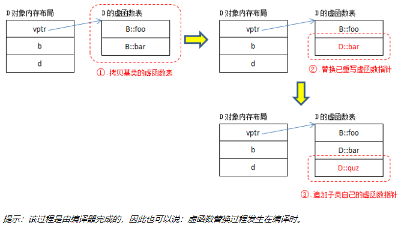

一、变量

## 1.全局变量和static变量

​		全局变量（外部变量）再冠以satatic就成了静态的全局变量。全局变量本身就是静态存储方式，存放在静态存储区（全局存储区），静态全局变量当然也是静态存储方式，存储方式并无异同。区别在于非静态全局变量作用域是整个源程序，当一个源程序有多个源文件组成时，非静态全局变量在各个源文件中都是有效的。而静态全局变量限制了其作用域只在该源文件内，同一个源程序的其他源文件不能使用他。
​		static全局变量和普通的全局变量的区别在于static全局变量只能初始化一次，防止在其他文件单元被引用。
​		局部变量存放在栈区，只有在函数或者代码块中存在，静态局部变量则改变了他的存储方式，也即改变了生存期。

PS：
		静态存储：是指在程序运行期间分配固定的存储空间的方式，在变量定义时就分定存储单元并一直保持不变，直至整个程序结束。
		动态存储：是在程序执行过程中，使用它时才分配存储单元，使用完毕立即释放，典型例子是形参。

## 2.static函数和普通函数

​		static函数与普通函数的作用域不同，static函数仅在本文件中，只有在源文件中使用的函数应该声明为static的，内部（static函数）应该在当前源文件中说明和定义。普通函数可以在别的文件中使用，默认是extern的，使用的时候需要用头文件说明。

​		static函数在内存中只有一份，普通函数在每个被调用中（栈）维持一份拷贝。函数存放在代码段（正文段）中，每个函数都有它的地址，函数名和函数地址会有映射，映射存在符号表中，这些地址都是偏移地址，在编译期间就确定。		

## 3.全局数组，静态数组，局部数组初始化

静态全局数组和全局数组定义后，虽未初始化，但编译器默认用数值0填充，也就是初始化；
静态局部数组定义后，未初始化，结果也是自动填充0，也就是初始化；
局部数组就不一样，定义后不初始化，数组各元素值将用随机数值填充。但是如果初始化了最开始的几个数组元素，那么剩下的所有元素编译器将初始化为0。

## 4.指针和引用

本质：指针是地址，通过地址找到所需的变量单元，引用是别名

具体：指针可以在运行时改变其指向的值，引用和某个对象绑定后就不可以更改
			内存：指针会分配内存，引用不会（只是别名）
			在参数传递时，引用会做类型检查（安全），而指针不会（不安全）
			引用不能为空，指针可以为空
			指针可以有多级，引用只能有一级

## 5.强制类型转换

**static_cast**:完成基础数据类型；同一个继承体系中类型的转换；任意类型与空指针类型void* 之间的转换。用的最多最广泛。只要不包含底层const，都可以使用。适合将较大算术类型转换成较小算术类型。

**reinterpret_cast**:可以用于任意类型的指针之间的转换，**对转换的结果不做任何保证**，不安全。通常为算术对象的位模式提供较低层次上的重新解释。如将int\*转换成char*。很危险！

**dynamic_cast**：这种其实也是不被推荐使用的，更多使用static_cast，一种动态类型识别。转换的目标类型，即type，是指针或者左右值引用，主要用于基类指针转换成派生类类型的指针(或引用)，通常需要知道转换源和转换目标的类型。如果转换失败，返回0（转换目标类型为指针类型时）或抛出bad_cast异常（转换目标类型为引用类型时）

**const_cast**：只能改变底层const，例如指向const的指针(指向的对象不一定是常量，但是无法通过指针修改)，如果指向的对象是常量，则这种转换在修改对象时，结果未定义。PS：const成员函数不能调用普通成员函数
另外一种使用方式，结合static_cast，可以在非const版本的成员函数内添加const，调用完const版本的成员函数后，再使用const_cast去除const限定。

## 6.修改const变量，const和volatile关键字

首先，c和c++的const是不同的。在c语言中用const修饰的变量还是一个变量，限定一个变量是可读的，必须在声明的时候初始化，const变量可以通过指针修改；

而在C++中用const修饰过后的变量，就变成常量了。声明可以不用初始化，因为const修饰后就变成常量了。不可以通过指针修改，但是可以用关键字volatile修改。

**不建议修改const变量的值，即使修改也要熟悉当前使用的编译器对于该 未定义行为 是如何解释的**。

**常量折叠**：指const变量（即常量）值**放在编译器的符号表中**，计算时编译器直接从表中取值，省去了访问内存的时间，从而达到了优化。而在此基础上加上volatile修改符，即告诉编译器该变量属于易变的，不要对此句进行优化，每次计算时要去内存中取数取数，而不是从上次读到的数据。volatile可以保证对特殊地址的稳定访问。

## 7.静态类型获取和动态类型获取

typeid、dynamic_cast:转换目标类型必须是引用类型

由于继承导致对象的指针和引用具有两种不同的类型： **静态类型** 和 **动态类型** 。

静态类型：由指针和引用声明时的类型，编译时就知道变量的类型

动态类型：由他实际指向的类型确定，运行时才知道变量的类型

**不允许隐式转换的是强类型，允许隐式转换的是弱类型**

#### 如何获取呢？

通过RTTI（运行时类型识别），能够通过基类的指针或引用来检索其所指对象的实际类型。c++通过下面两个操作符提供RTTI。

（1）typeid：返回指针或引用所指对象的实际类型。如果操作数不是类类型或者是没有虚函数的类，则获取其静态类型；如果操作数是定义了虚函数的类类型，则计算运行时类型。

（2）dynamic_cast：将基类类型的指针或引用安全的转换为派生类型的指针或引用。

对于带虚函数的类，在运行时执行RTTI操作符，返回动态类型信息；对于其他类型，在编译时执行RTTI，返回静态类型信息。

typeid操作符的返回类型就是typeinfo，因为typeinfo提供了各种操作符，所以可以用==判断，type_info的默认构造函数、拷贝构造函数、赋值操作符都定义为private，创建type_info对象的唯一方法就是使用typeid操作符。

详见：https://www.cnblogs.com/zhuyf87/archive/2013/03/15/2960899.html

## 8.如何比较浮点数数大小

为什么不能用等号？

1.浮点精度不同	2.寄存器和内存表示浮点数精度不同	3.内存中精度的误差

对于两个浮点数比较只能通过相减并与预先设定的精度比较，记得要取绝对值！

```c
if( fabs(f1-f2) < 预先指定的精度）		//fabs浮点数的绝对值，abs针对整数
{
      ...
}
```

# 二、函数

## 1.重载覆盖隐藏

重载（参数必须不同（const修饰形参）、重载和作用域、继承中的重载（using）、重载和const成员函数）

**重载**：同一个类内，函数名相同，参数不同；

**覆盖**：即实现多态，基类中函数是virtual，子类中同名同参数；

**隐藏**：

1. 基类中函数virtual，子类中有**同名但不同参数**的函数，则所有基类同名函数被隐藏；

2. 基类中函数非virtual，子类中存在同名函数（参数可以相同或不同），所有基类同名函数被隐藏；

**隐藏时可以利用using base::fun;来调用基类函数，但被子类中同名同参数的函数只能调用子类的**

底层const重载：
		1）底层const即不能改变所指对象，所以传入常量和非常量都没有问题。
   故如果传入非常量或者指向非常量的指针，重载的函数都能调用，但是对于编译器优先选择非const版本
   传入常量或指向常量的指针时，只能选择const版本
  	 2）如果没有重载非const版本，但是当传入一个非常量实参时希望返回一个非常量引用，则需对调用
      结果进行const_cast转换。const_cast能转换底层const，但是如果传入的实参是一个常量，
      转换后修改的话结果未定义。同时这种方式也会加重调用者的负担

重载和作用域：函数里有同名的函数，外部重载的函数会被隐藏。

继承中的重载（隐藏）：父类的函数会被子类重载隐藏。

# 三、类

## 1.面向对象的三大特性（封装、继承、多态）

**封装：**是指利用抽象数据类型将数据和基于数据的操作封装在一起，使其构成一个不可分割的独立实体，数据被保护在抽象数据类型的内部，尽可能地隐藏内部的细节，只保留一些对外接口使之与外部发生联系。系统的其他对象只能通过包裹在数据外面的已经授权的操作来与这个封装的对象进行交流和交互。也就是说用户是无需知道对象内部的细节，但可以通过该对象对外的提供的接口来访问该对象。
**好处**：1、良好的封装能够减少耦合。2、类内部的结构可以自由修改。3、可以对成员进行更精确的控制。4、隐藏信息，实现细节。

**继承：**继承是使用已存在的类的定义作为基础建立新类的技术，新类的定义可以增加新的数据或新的功能，也可以用父类的功能，但不能选择性地继承父类。通过使用继承我们能够非常方便地复用以前的代码，能够大大的提高开发的效率。

**多态：**前提有继承，虚函数子类实现，向上转型

## 2.struct和class的区别

1.默认继承权限：struct公有继承，class私有继承

2.默认访问权限：class私有，struct公有

3.大括号初始化：c语言的struct可以直接用大括号初始化，在C++中对struct的功能进行了扩展，struct可以被继承，可以包含成员函数，也可以实现多态，当用大括号对其进行初始化需要注意：
1）当struct和class中都定义了构造函数，就不能使用大括号对其进行初始化。
2）若没有定义构造函数，struct可以使用{ }进行初始化，而只有当class的所有数据成员及函数为public时，可以使用{ }进行初始化。
3）所以struct更适合看成是一个数据结构的实现体，class更适合看成是一个对象的实现体

4.模板：class可以做类型模板

## 3.访问权限说明符

目的：加强类的封装性

1. **类的成员的访问控制说明符**用于控制**类的使用者**对类中成员的访问权限
2. **派生列表中的访问控制说明符**用于控制**派生类的使用者**对**派生类从基类继承的成员**的访问权限


## 4.类的静态成员

（所属？静态成员函数不能声明成const、类类型的成员、定义时不能重复使用static、具有类内初始值的静态成员定义时不可再设初值）

**1.所属**：静态成员是属于整个类的而不是某个对象，静态成员变量只存储一份供所有对象共用。所以在所有对象中都可以共享它。使用静态成员变量实现多个对象之间的数据共享不会破坏隐藏的原则，保证了安全性还可以节省内存。静态成员的定义或声明要加个关键static。静态成员可以通过双冒号来使用即<类名>::<静态成员名>

**2.不可以调用非静态成员**：因为静态成员函数属于整个类，在类实例化对象之前就已经分配空间了，而类的非静态成员必须在类实例化对象后才有内存空间，所以这个调用就出错了，就好比没有声明一个变量却提前使用它一样。

**3.类的静态成员变量在使用前必须先初始化（必须先定义比较准确）。**

**4.静态成员函数不能声明成const：**因为成员函数的 const 修饰的是 this 指针，而静态成员函数没有 this 指针。

**5.具有类内初始值的静态成员定义时不可再设初值，static的成员变量一定要在类外初始化，因为静态成员属于整个类，不可能在每个对象都初始化一遍。**

**6.能在类内初始化的只有一种，就是静态常量成员！**

## 5.构造函数

### 1.有哪些构造函数（默认、委托、拷贝、移动）

**默认：**创建一个类自己没有写任何构造函数，系统会默认生成一个无参构造函数，函数为空，什么也不做。**默认构造函数会在==需要的==时候自动生成（被编译器），自己定义的参数为空的构造函数也是默认构造函数！一个类只有一个默认构造函数。**

所以：**任何class如果没有定义default constructor（也就是不带参数的那个啦），编译器就会自动帮你合成一个**，**这句话是错的！！！**

- **平凡的无关紧要的构造函数（trival）**：用户并没有显示地定义默认构造函数，编译器会为它自动生成一个无关紧要（trivial）的默认构造函数，生成的默认构造函数什么也不错，既不会讲其成员变量置零，也不会做其他的任何事情，只是为了保证程序能够正确运行而已，这就是所谓的“需要”，如果还需要给初始化成员变量，这件事情还是交给程序员做吧！

- **不平凡的构造函数（non-trival)**

  - **1.含有包含默认构造函数的成员类对象**：如果该类包含一个成员类对象，<u>它有默认的构造函数</u>，那么这个类的隐式构造函数是<u>非平凡的</u>，并且<u>编译器需要为包含的这个成员类对象生成一个默认构造函数</u>。然后，这个编译器生成的默认构造函数只有在实际上被调用时才会被真正的生成。

  - **2.基类包含默认构造函数的基类：**类似的，要是一个继承的基类包含默认构造函数而该类本身没有默认的构造函数，那么编译器会生成一个默认构造函数，目的是初始化它的基类。

    当程序员为该类定义了多个构造函数，就是没定义默认构造函数呢？

    在这种情况下，编译器会在每一个构造函数中增加（augment）有关调用基类的默认构造函数部分代码。

  - **3.含有虚函数：**生成的默认构造函数是必须的当另外两个额外条件（满足其一）才是不平凡的：

      1.该类定义了（或继承了）虚函数。

      2.在该类的继承关系中，有一个或更多的虚基类。

    在编译时，在默认构造函数中会发生下面的两个类扩充（augmentation）：

      1.虚表会被产生，其内容被这个类的活动（active）虚函数填充。

      2.编译器为每个类对象生成一个虚指针（vtbl）。

  - **4.带有虚基类的类**：编译器会为该类添加一个类似虚指针的东西——“_vbcX”

**委托（c++11）：**一个委托构造函数使用它所属类的其他构造函数执行它自己的初始化过程，或者说他把自己的一些（或全部）职责委托给了其他构造函数。使用方法类似调用基类的构造函数。

**拷贝：**拷贝构造函数是一种特殊的构造函数，其形参为本类对象的引用。
			作用：用一个已经存在的对象去初始化同类型的新对象。

**移动（c++11）：**拷贝构造函数时拷贝一个对象，而移动构造函数是直接直接把该对象的内存赋值给另一个对象初始化。<u>拷贝构造函数中，对于指针，我们一定要采用深层复制，而移动构造函数中，对于指针，我们采用浅层复制。</u>

使用方法：类 `T` 的移动构造函数是非模板[构造函数](https://zh.cppreference.com/w/cpp/language/initializer_list)，其首个形参是 T&&、const T&&、volatile T&& 或 const volatile T&&，且无其他形参，或剩余形参均有默认值。调用移动构造函数，情况包括

- 初始化：`T a = std::move(b);` 或 `T a(std::move(b));`，其中 b 类型为 `T` ；

- 函数实参传递：`f(std::move(a));`，其中 `a` 类型为 `T` 而 `f` 为 Ret f(T t) ；

- 函数返回：在如 T f() 的函数中的 return a;，其中 `a` 类型为 `T`，它有移动构造函数。

  move函数作用：将左值转换成右值

**构造函数和赋值运算符的区别：**口诀，构造函数与赋值运算符的区别是，构造函数在创建或初始化对象的时候调用，而赋值运算符在更新一个对象的值时调用。

### 2.合成的默认构造函数

（默认行为？什么情况下不会合成？怎么解决？**如果成员包含类内初始值，合成默认构造函数会使用该成员的类内初始值初始化该成员**）

**对于C++默认构造函数，我曾经有两点==误解==：**

- **类如果没有定义任何的构造函数，那么编译器（一定会!）将为类定义一个合成的默认构造函数。**
- **合成默认构造函数会初始化类中所有的数据成员。**

**总结：**

1. 　　**合成默认构造函数总是不会初始化类的内置类型及复合类型的数据成员。**
2.   　**分清楚默认构造函数被程序需要与被编译器需要，只有被编译器需要的默认构造函数，编译器才会合成它。**

正文：

**默认行为**：什么都不做，只是为了让程序正确执行，不会初始化

**什么情况下不会合成：**类内只含有复合类型和内置类型的时候

**怎么解决：**四种情况见上一题，被需要会合成

### 3.拷贝构造函数

并不是所有未定义有拷贝构造函数的类编译器都会为其合成拷贝构造函数，编译器只有在必要的时候才会为其合成拷贝构造函数。

（调用时机、合成版的行为、explict？、为何参数必须是引用类型）

**调用时机**：4种（A a1=a2，A a1(a2)，传参，返回值）

**合成版的行为：**默认浅拷贝，合成复制构造函数会对成员逐个进行初始化，将新对象初始化为原对象的副本。
						   合成时机：有需要的时候被合成

**explicit**：explicit关键字用来修饰类的构造函数，被修饰的构造函数的类，不能发生相应的隐式类型转换，只能以显示的方式进行类型转换。

**参数必须是引用类型**：不用引用参数值传递的时候就会无限递归地调用拷贝构造函数。

### 4.移动构造函数

（非拷贝而是窃取资源、与noexcept?、何时合成）

```c++
Test(Test&& t)noexcept;
Test& operator=(Test&& t)noexcept;		//参数为右值
```

**noexcept**：为了避免潜在的问题，除非vector知道元素类型的移动构造函数不会抛出异常，否则在重新分配内存的过程中，他就必须使用拷贝构造函数而不是移动构造函数，我们在进行自定义类型的对象移动而不是拷贝的时候，必须显示的告诉标准库我们的移动构造函数可以被安全的使用,将移动构造函数标记位noexcept来做到这一点。

在使用vector时建议配上noexcept全共同使用。

**何时合成**：当我们定义了自己的拷贝操作和析构函数时，编译器是不会帮我们合成默认移动构造函数的。

C++的默认析构函数不会释放指针所指的资源。
所以默认移动构造函数配合默认析构函数不会产生新对象资源没了的问题。

## 6.初始值列表

（顺序、效率(内置类型不进行隐式初始化故无所谓,但..)、无默认构造函数的成员,const成员,引用成员必须通过初始值列表初始化）

**顺序**：不是按照列表的顺序，而是按照内存模型中变量（声明时的定义）的顺序进行的，从而避免出现依赖。

**效率**：初始化列表效率>=在函数体里赋值。因为自定义类型在构造函数里面初始化会调用构造函数和拷贝运算符。

构造函数中，**成员变量一定要通过初始化列表来初始化的是**：
	1、const常量成员，因为常量只能在初始化，不能赋值，所以必须放在初始化列表中；
	2、引用类型，引用必须在定义的时候初始化，并且不能重新赋值，所以也要写在初始化列表中；
	3、没有默认构造函数的类类型，因为使用初始化列表可以不必调用默认构造函数来初始化，**而是直接调用拷贝构造函数。**

## 7.赋值运算符相关

### 1.拷贝赋值运算符

（合成版的行为？、与delete？、自定义时**要注意自赋值**，参数与返回类型、大部分组合了拷贝构造函数与析构函数的工作）

**合成版的行为**：对于某些类，合成拷贝赋值运算符用来禁止该类型对象的赋值。如果拷贝赋值运算符并非出于此目的，它会将右侧运算对象的每个非static成员赋予左侧运算对象的对应成员，这一工作是通过成员类型的拷贝赋值运算符来完成的。

**delete**：C++11 中，可在想要 “禁止使用” 的特殊成员函数声明后加 “= delete”，就会禁止使用拷贝赋值运算符或者拷贝构造函数。

```c++
class Uncopyable  
{  
    Uncopyable(const Uncopyable &) =delete; // 阻止copying  
    Uncopyable &operator=(const Uncopyable &)=delete;  
};  
```

**参数const**：
		①我们不希望在这个函数中对用来进行赋值的“原版”做任何修改。
		②加上const，对于const的和非const的实参，函数就能接受；如果不加，就只能接受非const的实参。

**参数用引用**：这样可以避免在函数调用时对实参的一次拷贝，提高了效率。

**返回值：**一般地，返回值是被赋值者的引用，即*this
			①这样在函数返回时避免一次拷贝，提高了效率。		
			②更重要的，这样可以**实现连续赋值**，即类似a=b=c这样。如果不是返回引用而是返回值类型，那么，执行a=b时，调用赋值运算符重载函数，在函数返回时，由于返回的是值类型，所以要对return后边的“东西”进行一次拷贝，得到一个未命名的副本（有些资料上称之为“匿名对象”），然后将这个副本返回，而这个副本是右值，所以，执行a=b后，得到的是一个右值，再执行=c就会出错。

**提供默认拷贝赋值运算符的时机：**所谓默认，就是“以本类或本类的引用为参数”的意思，显示提供了就不会有默认

当用一个非类A的值（如int型值）为类A的对象赋值时

​		①如果匹配的构造函数和赋值运算符重载函数同时存在，会调用赋值运算符重载函数。

​		②如果只有匹配的构造函数存在，就会调用这个构造函数。

**不能友元**：编译器也要提供一个，二义性

**不能被继承**

### 2.阻止拷贝

（某些对象应该独一无二(比方说人)、C++11前:private并且不定义(试图拷贝会报链接错误)，C++11:=delete ）

《Effective C++:条款6》：若不想使用编译器自动生成的函数，就该明确拒绝

### 3.移动赋值运算符

（与noexcept？何时合成）

如果一个类定义了自己的拷贝构造函数，拷贝赋值运算符或析构函数，编译器就不会为它合成移动构造函数和移动赋值运算符。

当一个类没有定义任何自己版本的拷贝构造函数，拷贝赋值运算符，析构函数，且类的每个非静态数据成员都可以移动时，编译器才会为它合成移动构造函数或移动赋值运算符。

noexcept:不抛出异常的移动构造函数和移动赋值运算符必须标记为noexcept。因为某些标准库容器除非知道移动操作是无异常的，否则就会进行拷贝。

### 4.可以定义为成员或非成员函数

定义成成员函数时第一个操作数隐式绑定到this指针

### 5.不可重载的操作符有哪些？

（?:，::）

## 8.析构函数相关

### 1.销毁过程的理解

（delete会执行哪些操作？逆序析构成员）

析构函数则是释放对象使用的资源，并销毁对象的非static数据成员。成员按照初始化顺序的逆序销毁，析构函数体自身并不直接销毁成员，成员是在析构函数体之后隐含的析构阶段中被销毁的。内置类型没有析构函数，因此，销毁内置类型成员什么也不需要做。所以销毁一个内置指针类型的成员需要我们手动delete

**delete的操作**：1.调用析构函数，释放对象中的成员资源

​        					2.归还对象空间（free）

### 2.为什么析构函数中不能抛出异常？

（不能是指“不应该”，C++本身并不禁止《Effective C++:条款8》）

如果析构函数吐出异常，程序可能过早结束（比如某个函数调用发生异常，在回溯寻找catch过程中，每离开一个函数，这个函数内的局部对象会被析构，如果此时析构函数又抛出异常，前一个异常还没得到处理又来一个，因此一般会引起程序过早结束）。异常从析构函数中传播出去，可能会导致不明确的行为。

比如杀猪杀了一半发现自己杀错了，然后抛个异常不杀了，那么猪是死是活不确定。

### 3.如果析构函数中包含可能抛出异常的代码怎么办？

（Effective C++:条款8》）

1. **在析构函数中catch异常**，然后调用**abort终止**程序。通过abort抢先置“不明确行为”于死地
2. **在析构函数中catch异常**，然后记录该失败，即**吞掉异常**（通常是个坏主意，因为这样压制了“某些动作失败”的重要信息。但是也比负担“草率结束程序”或”不明确行为带来的风险“好）
3. **重新设计接口，让客户能够在析构前主动调用可能引起异常的函数**，然后析构函数中使用一个bool变量，根据用户是否主动调用来决定析构函数中是否应该调用可能引起异常的函数，**让客户拥有主动权**（如果客户没有主动调用，那么当发生异常时也不应该抱怨，因为已经给出了客户自己处理异常的机会）

### 4.可否通过对象或者对象的引用（指针）来调用？（显式调用）

不是不可以，但是会有三条后果：

1）显式调用的时候，析构函数相当于的一个**普通的成员函数**；

2）编译器隐式调用析构函数，如分配了对内存，显式调用析构的话引起重复**释放堆内存的异常**；

3）把一个对象看作占用了部分栈内存，占用了部分堆内存（如果申请了的话），这样便于理解这个问题，系统隐式调用析构函数的时候，会加入释放栈内存的动作（而堆内存则由用户手工的释放）；用户显式调用析构函数的时候，只是单纯执行析构函数内的语句，**不会释放栈内存，也不会摧毁对象**。

*所以，如果我们在析构函数中有清除堆数据的语句，调用两次意味着第二次会试图清理已经被清理过了的，根本不再存在的数据！这是件会导致运行时错误的问题，并且在编译的时候不会告诉你！*

### 5.为什么将继承体系中基类的析构函数声明为虚函数？

当派生类对象经由一个基类指针被删除，而该基类带有一个non-virtual析构函数，结果未定义——实际执行时通常发生的是对象的derived成分没有销毁，即“局部销毁”，造成资源泄露（因为存在这个问题，所以不要继承一个不被用作基类的类）
class不用作基类时，不要将析构函数声明为virtual：virtual会引入虚函数指针，这会增加空间开销，使得类无法被C函数使用，从而不再具有移植性

### 6.c++11的继承控制final和override

final阻止类的进一步派生和虚函数的进一步重写。
override确保在派生类中声明的函数跟基类的虚函数有相同的签名，表示表示我要重写。

```c++
struct B1 final { };
struct D1 : B1 { }; // 错误！不能从 final 类继承！
```

```c++
struct B2
{
    virtual void f() final {} // final 函数
};

struct D2 : B2
{
    virtual void f() {}//这段代码又会出错，因为D2::f重写了B2::f，但是B2::f却被声明为 final 的！
};
```

### 7.防止继承的方式

1.私有化构造函数
2.使用虚继承+私有（或者受保护的）基类构造函数---https://blog.twofei.com/672/
3.使用final修饰类

## 9.删除的合成函数

（一般函数而言不想调用的话不定义就好）

**下列情况合成析构函数是删除的**：
如果类的某个成员的析构函数是删除的或不可访问的(如private)；
**下列情况合成拷贝函数是删除的**：
如果类的某个成员的拷贝构造函数是删除的或不可访问的
如果类的某个成员的析构函数是删除的或不可访问的
如果类定义了移动操作(移动构造或移动赋值)
**下列情况合成赋值运算符是删除的：**
如果类的某个成员的拷贝赋值运算符是删除的或不可访问的
类有一个const或引用成员
如果类定义了移动操作(移动构造或移动赋值)
		虽然可以将一个新值赋予一个引用成员，但这样做改变的是引用指向的对象的值，而不是引用本身。如果为这样的类合成拷贝赋值运算符，则赋值后，左侧运算对象仍然指向与赋值前一样的对象，而不会与右侧运算对象指向相同的对象。由于这种行为看起来并不是我们所期望的，因此对于有引用成员的类，合成拷贝赋值运算符被定义为删除的。

**下列情况移动操作(移动拷贝与移动赋值)是删除的**：
总的来说，移动操作永远不会隐式定义为删除的函数，除非 显示地要求编译器生成=default的移动构造函数，但编译器又不能移动所有成员时。下列情况，无法移动成员：

类成员定义了自己的拷贝构造函数且未定义移动构造函数(不会合成)。或类成员没定义自己的拷贝构造函数但编译器无法合成
类成员的移动构造函数或移动赋值运算符被定义为删除的或是不可访问的
析构函数被定义为删除的或不可访问的
类似拷贝赋值运算符，如果有类成员是const或引用，则移动赋值运算符被定义为删除的
如果没有=default声明（编译器将为显式声明的defaulted函数自动生成函数体），或者编译器忽略了，在这种情况下，如果移动操作可能被定义为删除的函数，编译器就不会合成它们。

**下列情况合成默认构造函数是删除的**：
如果类的某个成员的析构函数是删除的或不可访问的
类有一个没有类内初始值(类内初始化器)的引用成员
类有一个没有类内初始值的const成员，且其类型未显示定义默认构造函数

#### 继承中的删除：

如果基类中的默认构造函数，拷贝构造函数，拷贝赋值运算符或析构函数是删除的或不可访问，则派生类中对应的成员将是被删除的（因为编译器不能使用基类成员来执行派生类对基类部分的构造，赋值或销毁操作）
如果在基类中有一个不可访问或删除的析构函数，则派生类中合成的默认和拷贝构造函数将是删除的。
编译器不会合成一个删除的移动操作。当使用=default请求一个移动操作时，如果基类中的对应操作是删除的或不可访问，那么派生类中该函数将是删除的（因为派生类对象的基类部分不可移动）。同样，如果基类的析构函数是删除的或不可访问，则派生类的移动构造函数也将是删除的。

## 10.继承相关

### 1.继承体系中的构造、拷贝、析构顺序？

（派生类只负责自己成员的拷贝控制，可以(换而言之非必须，如果不显示调用，会调用父类合成的默认版本)在初始值列表或函数体中调用基类相应函数）

构造的顺序：基类成员构造函数->基类构造函数->子类成员构造函数->子类构造函数
析构的顺序：相反
拷贝的顺序：拷贝构造函数如果没有显式调用父类的一个构造函数，会调用直接父类的默认构造函数。

在虚继承中，**虚基类**的初始化 **早于非虚基类**，并且**子类**来初始化虚基类（注意：虚基类不一定是子类的直接父类）。

**总结：**

1. 整体顺序：虚基类  -->  直接父类  -->自己
2. 在任何**显式定义的构造函数**中，如果没有显式调用父类的构造函数，那么就会调用父类的默认构造函数。
3. **合成的**复制构造函数、合成的赋值操作符，（当没有显式定义时，编译器自动提供），会自动调用的是虚基类和直接父类的复制构造函数和赋值操作符，**而不是默认构造函数**；
4. 自己**显式定义的复制构造函数**，除非在初始化列表中显示调用，否则只会调用虚基类和父类的默认构造函数。
5. 自己显式定义的赋值操作符，除非显式调用，否则只执行自己的代码。
6. 析构函数的执行顺序与 构造函数 相反。

### 2.继承中的名字查找

（作用域嵌套、从子类到父类查找；成员名字的处理）

**注意：名字查找发生在编译期(即使是虚函数调用)，而且与参数检查是不同阶段。**

### 3.成员函数体内、成员函数的参数列表的名字解析时机

- **成员函数体内的名字解析直到类的声明都出现了才开始**
- **成员函数的参数列表不符合上一条规则，名字解析从参数第一次出现开始**

（因此，务必将“内嵌的类型声明”放在class起始处）

### 4.同名名字隐藏

（如何解决？(域作用符，从指示的类开始查找)、不同作用域无法重载、using的作用？除此之外呢？）

内层隐藏外层，可以使用using将一个作用域的名字引入到另一个作用域。

**假若没有隐藏机制,改变基类实现将有可能影响到子类已经正常工作的代码出现未预料的行为,这不是我们希望看到的.** 

### 5.虚继承

（解决什么问题？(多继承中的子对象冗余)）

菱形继承：其原理是，间接派生类（C）穿透了其父类（上面例子中的A与B），实质上直接继承了虚基类X。

## 11.多态的实现？

C++的多态性用一句话概括就是：在基类的函数前加上virtual关键字，在派生类中重写该函数，运行时将会根据对象的实际类型来调用相应的函数。如果对象类型是派生类，就调用派生类的函数；如果对象类型是基类，就调用基类的函数。

  1：用virtual关键字申明的函数叫做虚函数，虚函数肯定是类的成员函数。  

  2：存在虚函数的类都有一个一维的虚函数表叫做虚表，类的对象有一个指向虚表开始的虚指针。**虚表是和类对应的，虚表指针是和对象对应的。**  

  3：多态性是一个接口多种实现，是面向对象的核心，分为类的多态性和函数的多态性。  

  4：多态用虚函数来实现，结合动态绑定.  

  5:纯虚函数是虚函数再加上 = 0；  

  6：抽象类是指包括至少一个纯虚函数的类。

纯虚函数:virtual void fun()=0;**即抽象类！**必须在子类实现这个函数，即先有名称，没有内容，在派生类实现内容。

## 12.虚函数的实现原理？对类大小的影响？

（vtbl是一个由函数指针组成的数组，无论pb指向哪种类型的对象，只要能够确定被调函数在虚函数中的偏移值，待运行时，能够确定具体类型，并能找到相应vptr，进一步能找出真正应该调用的函数）


**虚函数表的构造过程：**



**虚函数的调用过程：**


但对于“pb->bar()”，编译时能够确定的是：此处operator->的另一个参数是B::bar（因为pb是B*类型的，编译器认为bar是B::bar），而B::bar和D::bar在各自虚函数表中的偏移位置是相等的。

无论pb指向哪种类型的对象，只要能够确定被调函数在虚函数中的偏移值，待运行时，能够确定具体类型，并能找到相应vptr了，就能找出真正应该调用的函数。

**多重继承的虚函数表：**


## 13.为什么不要在构造、析构函数中调用虚函数？

（子对象的base class构造期间，对象的类型是base class 《Effective C++:条款9》，设置虚函数指针的时机）

虽然可以对虚函数进行实调用，但程序员编写虚函数的本意应该是实现动态联编。在构造函数中调用虚函数，函数的入口地址是在编译时静态确定的，并未实现虚调用。

**构造函数不能调用的原因：**

第一个原因，在概念上，构造函数的工作是为对象进行初始化。在构造函数完成之前，被构造的对象被认为“未完全生成”。当创建某个派生类的对象时，**如果在它的基类的构造函数中调用虚函数**，那么此时派生类的构造函数并未执行，所调用的函数可能操作还没有被初始化的成员，将导致灾难的发生。

第二个原因，**即使想在构造函数中实现动态联编，在实现上也会遇到困难**。这涉及到对象虚指针（vptr）的建立问题。在Visual C++中，包含虚函数的类对象的虚指针被安排在对象的起始地址处，并且虚函数表（vtable）的地址是由构造函数写入虚指针的。**所以，一个类的构造函数在执行时，并不能保证该函数所能访问到的虚指针就是当前被构造对象最后所拥有的虚指针**，因为后面派生类的构造函数会对当前被构造对象的虚指针进行重写，因此无法完成动态联编。

**析构函数不能调用的原因：**

在析构函数中调用虚函数，函数的入口地址也是在编译时静态决定的。也就是说，实现的是实调用而非虚调用。

在构造和析构函数中不要用虚函数，因为这类函数调用不会下降至派生类。也就是避免使用初期未成熟的派生类对象的未初始化成员变量。

**vptr会在构造函数中进行初始化，关键是vptr应该在构造函数中何时执行初始化。考虑这个问题是因为：如果在构造函数中调用虚拟函数，那么vptr的初始化时机可能会给使得程序产生不一致的表现**。

## 14.虚函数被覆盖？

子类重写覆盖父类的虚函数，虽然没有明写virtual，但其实是virtual

## 15.virtual函数动态绑定，缺省参数值静态绑定

条款37：绝不重新定义继承而来的缺省参数值，这里继承来要定义的函数肯定是virtual的。

**原因就在于，virtual函数是动态绑定，而缺省参数值却是静态绑定**。所以你可能调用了一个派生类的virtual函数，但是使用到的缺省参数，却是基类的。

```c++
class Shape{
public:
    enum ShapeColor {Red,Green,Blue};
    virtual void draw(ShapeColor color = Red) const = 0;
    ...
};
class Rectangle : public Shape {
public:
    virtual void draw(ShapeColor color = Green) const;
    ...
};
class Circle : public Shape {
public:
    virtual void draw(ShapeColor color) const;
    ...
};
Rectangle r;
Circle c;

r.draw();           //调用Rectangle::draw，静态类型为Rectangle，所以缺省参数为Shape::Green
//c.draw();         //调用Circle::draw，静态类型为Circle，没有缺省参数，因此错误，必须显式指定！
Shape *pr = &r;
Shape *pc = &c;

//以下为容易引起困惑的地方，函数与参数不一致
pr->draw();         //调用Rectangle::draw，但是静态类型为Shape，所以缺省参数Shape::Red
pc->draw();         //调用Shape::draw，但是静态类型为Shape，所以缺省参数Shape::Red
```

但是，即使派生类严格遵循基类的缺省参数，也存在问题：当基类的缺省参数发生变化时，派生类的所有缺省参数也需要跟着修改。因此，**本质在于，不应该在virtual函数中使用缺省参数**，如果有这样的需求，那么这种场景就适合使用[条款35](https://github.com/arkingc/note/blob/master/C++/EffectiveC++.md#)中，public virtual函数的几种替代方案，比如NVI手法：

```c++
class Shape{
public:
    enum ShapeColor {Red,Green,Blue};
    //此时，带缺省参数的已经不是virtual函数
    void draw(ShapeColor color = Red) const
    {
        doDraw(color);  //调用一个virtual
    }
    ...
private:
    //而完成真正工作的virtual函数已经不带缺省参数
    virtual void doDraw(ShapeColor color) const = 0;  //完成真正的工作
};

class Rectangle : public Shape {
public:
    ...
private:
    //而完成真正工作的virtual函数已经不带缺省参数
    virtual void doDraw(ShapeColor color) const;
    ...
};

class Circle : public Shape {
public:
    ...
private:
    //而完成真正工作的virtual函数已经不带缺省参数
    virtual void doDraw(ShapeColor color) const;
    ...
};
```

## 16.纯虚函数与抽象基类

（纯虚函数与虚函数、一般成员函数的选择）

**条款34：区分接口继承和实现继承**

> 纯虚函数一般作为接口，基类一般不提供定义，但是基类可以为纯虚函数提供定义。派生类必须声明纯虚函数，如果想要使用纯虚函数，派生类必须提供一份定义，即使基类已经为该纯虚函数提供了定义。如果派生类不提供定义，仍然是一个抽象基类

1. **声明一个pure virtual函数的目的是为了让derived classes只继承函数接口**
2. **声明(非纯)impure virtual函数的目的，是让derived classes继承该函数的接口和缺省实现**
3. **声明non-virtual函数的目的是为了令derived classes继承函数的接口及一份强制性实现**

**1）pure virtual函数**

如果某个操作不同派生类应该表现出不同行为，并且没有相同的缺省实现，那么应该使用pure virtual函数，此时派生类只继承接口

**2）impure virtual函数**

如果某个操作不同派生类应该表现出不同行为，并且具有相同的缺省实现，那么应该使用impure virtual函数，此时派生类继承接口和缺省实现

**但是，允许impure virtual函数同时指定函数声明和缺省行为，却可能造成危险：假设引入了一个新的派生类，但是缺省行为并不适用于新的派生类，而新的派生类忘记重新定义新的行为，那么调用该操作将表现出缺省行为，这是不合理的**。

## 17.静态类型与动态类型

（引用是否可实现动态绑定）

1、对象的静态类型：对象在声明时采用的类型。**是在编译期确定的**。 
2、对象的动态类型：目前所指对象的类型。**是在运行期决定的**。
3、静态绑定：绑定的是对象的静态类型，某特性（比如函数）依赖于对象的静态类型，发生在编译期。
4、动态绑定：绑定的是对象的动态类型，某特性（比如函数）依赖于对象的动态类型，发生在运行期。

引用可以实现动态绑定，因为对象的类型是确定，在编译期就确定了，指针或引用是在运行期根据他们绑定的具体对象确定

## 18.浅拷贝与深拷贝

（安全性、行为像值的类与行为像指针的类）

浅拷贝：默认的拷贝构造函数只是会复制指针，使两个指针指向同一个内存

深拷贝：不但对指针进行拷贝，而且对指针指向的内容进行拷贝，经深拷贝后的指针是指向两个不同地址的指针。

## 19.如何定义类内常量？

（enum而不是static const 《Effective C++:条款2》）

错误：const int size=100;			//const常量必须在初始化列表中初始化，每个对象可能包含不同的值

正确：enum { size = 100};			//使用enum不会占用对象中的存储空间，枚举在编译的时候被全部赋值

正确：static const int size;			//只适合integral类型

## 20.三五法则

当我们需要决定一个类是否要定义它自己版本的拷贝控制成员的时候，一个基本原则就是首先确定这个类是否需要我们自己手动定义一个析构函数，通常，对析构函数的需求要比对拷贝构造函数或赋值运算符的需求更加的明显。简单来说**需要手动构造析构函数是需要手动构造拷贝构造函数和重载赋值运算符的充分条件。**

三五法则规定了什么时候需要拷贝构造函数、拷贝赋值函数、析构函数等

1. 需要析构函数的类也需要拷贝构造函数和拷贝赋值函数。
2. 需要拷贝操作的类也需要赋值操作，反之亦然。
3. 析构函数不能是删除的
4. 如果一个类有删除的或不可访问的析构函数，那么其默认和拷贝构造函数会被定义为删除的。
5. 如果一个类有const或引用成员，则不能使用合成的拷贝赋值操作。

## 21.继承与组合(复合)之间如何选择？

（《Effective C++:条款38》）

复合：复合意味着has-a(有一个)或is-implemented-in-terms-of(根据某物实现出)

- has-a：

  ```c++
  class Address {...};
  class PhoneNumber {...};
  class Person{
  public:
      ...
  private:
      std::string name;
      Address address;
      PhoneNumber voiceNumber;
      PhoneNumber faxNumber;
  };
  ```

- 根据某物实现出：

  ```c++
  template <class T, class Sequence = deque<T> >
  class stack {
  ...
  protected:
    Sequence c;   //底层容器
  ...
  };
  ```

上面两者情况都应该使用复合，而不是public继承。在has-a中，每个人肯定不是一个地址，或者电话。显然不能是is-a的关系。而对于后者，由于每个栈只能从栈顶压入弹出元素，而队列不同，**is-a的性质是所有对基类为true的操作，对派生类也应该为true**。所以stack也不应该通过public继承deque来实现，因此使用复合

## 22.private继承？

**[条款39]：明智而审慎地使用private继承**

**private继承和public继承的不同之处**：

- **编译器不会把子类对象转换为父类对象**

  ```c++
  class Person { ... };
  class Student: private Person { ... };     // private继承，默认就是private继承
  void eat(const Person& p);                 // 任何人都会吃
  Person p;                                  // p是人
  Student s;                                 // s是学生
  eat(p);                                    // 没问题，p是人，会吃
  eat(s);                                    // 错误！难道学生不是人？！
  ```

  如果使用public继承，编译器在必要的时候可以将Student隐式转换成Person，但是private继承时不会，所以eat(s)调用失败。从这个例子中表达了，**private继承并不表现出is-a的关系**。实际上

  **private表现出的是"is-implemented-in-terms-of"的关系**

- **父类成员（即使是public、protected）都变成了private**

[条款38]提到，复合也是可以表现出"is-implemented-in-terms-of"的关系，那么两者有什么区别？

### 1）private继承

假设Widget类需要执行周期性任务，于是希望**继承Timer的实现**。 因为Widget不是一个Timer，所以选择了private继承：

```c++
class Timer {
public:
   explicit Timer(int tickFrequency);
   virtual void onTick() const;          // 每滴答一次，该函数就被自动调用一次
};
class Widget: private Timer {
private:
  virtual void onTick() const;           // 查看Widget的数据...等等
};
```

在Widget中重写虚函数onTick，使得Widget可以周期性地执行某个任务

通过private继承来表现"is-implemented-in-terms-of"关系实现非常简单，而且下列情况也只能使用这种方式：

- 当Widget**需要访问Timer的protected成员**时。因为对象组合后只能访问public成员，而private继承后可以访问protected成员。
- 当Widget**需要重写Timer的虚函数**时。比如上面的例子中，需要重写onTick。单纯的复合是做不到的

### 2）复合

如果使用复合，上面的例子可以这样实现：

```c++
class Widget {
private:
    class WidgetTimer: public Timer {
    public:
        virtual void onTick() const;
    };
    WidgetTimer timer;
};
```

通过复合来表现"is-implemented-in-terms-of"关系，实现较为复杂，但是具有下列优点：

- 如果**希望禁止Widget的子类重定义onTick**。因为派生类无法访问**私有**的WidgetTimer类
- 可以减小Widget和Timer的编译依赖。如果是private继承，在定义Widget的文件中势必需要引入#include"timer.h"。 但如果采用复合的方式，可以把WidgetTimer放到另一个文件中，在Widget中使用WidgetTimer*并声明WidgetTimer即可

总的来说，在需要表现"is-implemented-in-terms-of"关系时。如果一个类需要访问基类的protected成员，或需要重新定义其一个或多个virtual函数，那么使用private继承。否则，在考虑过所有其它方案后，仍然认为private继承是最佳办法，才使用它。**复合优于继承**

## 23.如何定义一个只能在堆上（栈上）生成对象的类？

 在C++中，类的对象建立分为两种，一种是静态建立，如`A a；`另一种是动态建立，如`A* ptr=new A；`这两种方式是有区别的。

​    静态建立一个类对象，是由编译器为对象在栈空间中分配内存，是通过直接移动栈顶指针，挪出适当的空间，然后在这片内存空间上调用构造函数形成一个栈对象。使用这种方法，直接调用类的构造函数。

​    动态建立类对象，是使用new运算符将对象建立在堆空间中。这个过程分为两步，**第一步是执行operator new()**函数，在堆空间中搜索合适的内存并进行分配；**第二步是调用构造函数**构造对象，初始化这片内存空间。这种方法，间接调用类的构造函数。

**那么如何限制类对象只能在堆或者栈上建立呢？下面分别进行讨论。**

#### **1、只能建立在堆上**

​    **类对象只能建立在堆上，就是不能静态建立类对象，即不能直接调用类的构造函数。**

​    容易想到**将构造函数设为私有**。在构造函数私有之后，无法在类外部调用构造函数来构造类对象，只能使用new运算符来建立对象。然而，前面已经说过，new运算符的执行过程分为两步，C++提供new运算符的重载，其实是只允许重载operator new()函数，而operator()函数用于分配内存，无法提供构造功能。**因此，这种方法不可以。**

​    当对象建立在栈上面时，是由编译器分配内存空间的，调用构造函数来构造栈对象。当对象使用完后，编译器会调用析构函数来释放栈对象所占的空间。编译器管理了对象的整个生命周期。如果编译器无法调用类的析构函数，情况会是怎样的呢？比如，类的析构函数是私有的，编译器无法调用析构函数来释放内存。所以，编译器在为类对象分配栈空间时，会先检查类的析构函数的访问性，其实不光是析构函数，只要是非静态的函数，编译器都会进行检查。**如果类的析构函数是私有的，则编译器不会在栈空间上为类对象分配内存。**

==因此，将析构函数设为私有，类对象就无法建立在栈上了。==代码如下：

```
class  A  
{  
public :  
    A(){}  
    void  destory(){ delete   this ;}  
private :  
    ~A(){}  
};  
```

​        试着使用A a;来建立对象，编译报错，<u>提示析构函数无法访问</u>。这样就只能使用new操作符来建立对象，构造函数是公有的，可以直接调用。类中必须提供一个destory函数，来进行内存空间的释放。类对象使用完成后，必须调用destory函数。
​        **上述方法的一个缺点就是，无法解决继承问题。如果A作为其它类的基类，则析构函数通常要设为virtual，然后在子类重写，以实现多态。因此析构函数不能设为private**。<u>还好C++提供了第三种访问控制，protected。将析构函数设为protected可以有效解决这个问题，类外无法访问protected成员，子类则可以访问。</u>

​    	另一个问题是，类的使用很不方便，使用new建立对象，却使用destory函数释放对象，而不是使用delete（使用delete会报错，因为delete对象的指针，会调用对象的析构函数，而析构函数类外不可访问）这种使用方式比较怪异。为了统一，可以将构造函数设为protected，然后提供一个public的static函数来完成构造，这样不使用new，而是使用一个函数来构造，使用一个函数来析构。代码如下，类似于单例模式：

```c++
class  A  
{  
protected :  
    A(){}  
    ~A(){}  
public :  
    static  A* create()  
    {  
        return   new  A();  
    }  
    void  destory()  
    {  
        delete   this ;  
    }  
};  
```

​        这样，调用create()函数在堆上创建类A对象，调用destory()函数释放内存。

​        这样，调用create()函数在堆上创建类A对象，调用destory()函数释放内存。

#### 2、只能建立在栈上

​    只有使用new运算符，对象才会建立在堆上，因此，只要禁用new运算符就可以实现类对象只能建立在栈上。**将operator new()设为私有即可。**代码如下：

```c++
class  A  
{  
private :  
    void * operator  new ( size_t  t){}      // 注意函数的第一个参数和返回值都是固定的   
    void  operator  delete ( void * ptr){}  // 重载了new就需要重载delete   
public :  
    A(){}  
    ~A(){}  
}; 
```

## 24.内联函数、构造函数、静态成员函数可以是虚函数吗？

都不可以。
**内联函数**需要在编译阶段展开，而虚函数是运行时动态绑定的，编译时无法展开； 
**构造函数**在进行调用时还不存在父类和子类的概念，父类只会调用父类的构造函数，子类调用子类 的，因此不存在动态绑定的概念；
**静态成员函数**是以类为单位的函数，与具体对象无关，虚函数是与对象动态绑定的，因此是两个不冲突的概念；

# 四、内存

## 1.c++内存分区

c++编译器将计算机内存分为 **代码区和数据区**；
**数据区又分为静态数据区、动态数据区以及常量区**，动态数据区包括堆区和栈区。

**解释：**
**栈**:存放函数参数以及局部变量,在出作用域时,将自动被释放.栈内存分配运算内置于处理器的指令集中,效率很高,但分配的内存容量有限.

**自由存储区**:new分配的内存块(包括数组,类实例等),需delete手动释放.如果未释放,在整个程序结束后,OS会帮你回收掉.

**堆**:malloc分配的内存块,需free手动释放.它和堆有些相似.

**全局/静态区**:全局变量(global)和静态变量(static)存于此处.(在以前的C语言中,全局变量又分为初始化的和未初始化的,C++不分)

**常量存储区**:常量(const)存于此处,此存储区不可修改.

## 2.new和malloc的区别？

（函数，运算符、类型安全、计算空间、步骤，operator new的实现）

**0.属性：**new/delete是C++关键字，需要编译器支持。malloc/free是库函数，需要头文件支持。

**1.申请内存所在的位置：**new是自由存储区，malloc是在堆上，自由存储区可以是堆，也可以是静态存储区，取决于operator new的实现细节，new甚至不为对象分配内存！

**2.返回类型安全性：**new操作符内存分配成功时，返回的是对象类型的指针，类型严格与对象匹配，无须进行类型转换，故new是符合类型安全性的操作符。而malloc内存分配成功则是返回void * ，需要通过强制类型转换将void*指针转换成我们需要的类型。

**3.内存分配失败时的返回值：**new内存分配失败时，会抛出**bac_alloc异常**，它**不会返回NULL**；malloc分配内存失败时返回NULL。

**4.是否需要制定内存大小：**使用new操作符申请内存分配时无须指定内存块的大小，编译器会根据类型信息自行计算，而malloc则需要显式地指出所需内存的尺寸。

**5.是否调用构造/析构函数：**使用new操作符来分配对象内存时会经历三个步骤：
		第一步：调用operator new 函数（对于数组是operator new[]）**分配一块足够大的**，原始的，未命名的内存空间以便存储特定类型的对象。
		第二步：编译器运行相应的构造函数以构造对象，并为其传入初值。
		第三步：对象构造完成后，**返回**一个指向该对象的**指针**。
使用delete操作符来释放对象内存时会经历两个步骤：
		第一步：调用对象的析构函数。
		第二步：编译器调用operator delete(或operator delete[])函数释放内存空间。
总之来说，new/delete会调用对象的构造函数/析构函数以完成对象的构造/析构。而malloc则不会。

**6.对数组的处理：**C++提供了new[]与delete[]来专门处理数组类型，至于malloc，如果要动态分配一个数组的内存，还需要我们手动自定数组的大小：

**operator new的实现**：

```c++
extern void* operator new(size_t size)
{
    if(size == 0)
        size = 1;

    void *last_alloc;
    while(!(last_alloc = malloc(size))){
        if(_new_handler)
            (*_new_handler)();
        else
            return 0;
    }
    return last_alloc;
}
```

**[operator new和new operator](https://www.cnblogs.com/jamesmile/archive/2010/04/17/1714311.html)**的区别。

**placement new**主要适用于：在缓冲区上分配一个对象，在对时间要求非常高的应用程序中，因为这些程序分配的时间是确定的；长时间运行而不被打断的程序；以及执行一个垃圾收集器 (garbage collector)。

placement new只是operator new重载的一个版本。它并不分配内存，只是返回指向已经分配好的某段内存的一个指针。因此不能删除它，但需要调用对象的析构函数。如果你想在已经分配的内存中创建一个对象，使用new时行不通的。也就是说placement new允许你在一个已经分配好的内存中（栈或者堆中）构造一个新的对象。原型中void* p实际上就是指向一个已经分配好的内存缓冲区的的首地址。

## 3.new[]与delete[]？

（步骤：如何分配内存，构建对象、如何析构与释放内存？构造与析构）

**operator new和operator delete都是C++的标准库函数。**

`delete [] pAa;`：**我们如何知道 psa 指向对象的数组的大小？怎么知道调用几次析构函数？**
这个问题直接导致我们需要在 new [] 一个对象数组时，需要保存数组的维度，C++ 的做法是在分配数组空间时多分配了 4 个字节的大小，专门保存数组的大小，在 delete [] 时就可以取出这个保存的数，就知道了需要调用析构函数多少次了。

- **调用析构函数的次数是从数组对象指针前面的 4 个字节中取出；**
- **传入 `operator delete[]` 函数的参数不是数组对象的指针 pAa，而是 pAa 的值减 4。**

**其他：**

**避免以一个base class指针指向一个derived class objects所组成的数组；**

`Point *ptr = new Point3d[10];`**错误原因**：实施于数组上的destructor，是根据交给vec_delete()函数的”被删除的指针类型的destructor“——在本例中就是Point destructor，与我们的期望不符。此外，每一个元素的大小也一并被传递过去（本例中是Point class object的大小）。这就是vec_delete()如何迭代走过每一个数组元素的方式。因此整个过程失败了，不只是因为执行了错误的destructor，而且自从第一个元素之后，该destructor即被施行于不正确的内存区块中。

## 4.new带括号和不带的区别？

（无自定义构造函数且没有虚函数时，不带括号的new只分配内存，带括号的new会初始化为0）

**对于自定义类类型**：

​        如果该类没有定义构造函数（由编译器合成默认构造函数）也没有虚函数，那么class c = new class;将不调用合成的默认构造函数，而class c = new class();则会调用默认构造函数。
​		如果该类没有定义构造函数（由编译器合成默认构造函数）但有虚函数，那么class c = new class;和class c = new class();一样，都会调用默认构造函数。
​		如果该类定义了默认构造函数，那么class c = new class;和class c = new class();一样，都会调用默认构造函数。

**对于内置类型**：

​       int *a = new int;不会将申请到的int空间初始化，而int *a = new int();则会将申请到的int空间初始化为0。

 以下两个语句的区别是：第一个动态申请的空间里面的值是随机值，第二个进行了初始化，里面的值为0：

1. int *p1 = new int[10];  
2. int *p2 = new int[10();  

结论：别使用不带括号的new。

## 5.new时内存不足？

（《Effective C++:条款49》）(new-handler)

operator new抛出异常以反映一个未获满足的内存需求之前，会先调用一个客户指定的错误处理函数-------------**new-handler**，可以通过调用`std::set_new_handler()`来设置，`std::set_new_handler()`定义在<new>中：

```
namespace std{
    typedef void (*new_handler)();
    new_handler set_new_handler(new_handler p) throw(); 
    //以上，throw()是一个异常声明，括号内无任何内容，表示不抛任何异常
}
```

当operator new无法满足内存申请时，它会不断调用new-handler函数，直到找到足够内存。一个设计良好的new-handler函数必须做以下事情；

- **让更多内存可被使用**：一个做法是程序一开始执行就分配一大块内存，而后当new-handler第一次被调用，将它们还给程序使用。这便造成operator new内的下一次内存分配动作可能成功
- **安装另一个new-handler**：如果当前new-handler无法取得更多可用内存，可用安装另一个，下次operator new时会调用新的new-handler
- **卸除new-handler**：将null指针传给set_new_handler
- **抛出bad_alloc(或派生自bad_alloc)的异常**：这样的异常不会被operator new捕获，因此会被传播到内存索求处
- **不返回**：通常调用abort或exit（abort会设置程序非正常退出，exit会设置程序正常退出，当存在未处理异常时C++会调用terminate， 它会回调由std::set_terminate设置的处理函数，默认会调用abort）

## 6.malloc、calloc、realloc、alloca以及malloc的实现？

” calloc()”是”分配内存给多个对象”，” malloc()”是”分配内存给一个对象”，”realloc()”是”重新分配内存”之意。”free()”就比较简单了，”释放”的意思，就是把之前所分配的内存空间给释放出来。

**malloc：**`void *malloc(size_t size);`
	分配足够的内存给大小为size的对象, 并返回指向所分配区域的第一个字节的指针;
	若内存不够,则返回NULL. 不对分配的空间进行初始化.`char *p = (char *)malloc(sizeof(char));`

**calloc：**`void *calloc(size_t nobj, size_t size);`
	分配足够的内存给nobj个大小为size的对象组成的数组, 并返回指向所分配区域的第一个字节的指针;
	若内存不够,则返回NULL. 该空间的初始化大小为0字节. `char *p = (char *) calloc(100,sizeof(char));`

**realloc：**`void *realloc(void *p, size_t size);`
	将p所指向的对象的大小改为size个字节.
	如果新分配的内存比原内存大, 那么原内存的内容保持不变, 增加的空间不进行初始化.
	如果新分配的内存比原内存小, 那么新内存保持原内存的内容, 增加的空间不进行初始化.
	返回指向新分配空间的指针; 若内存不够,则返回NULL, 原p指向的内存区不变.
	``char *p = (char *)malloc(sizeof(char));`
	`p= (char *)realloc(p, 256);`

**alloca：**其调用序列与malloc相同，但是它是在当前函数的栈帧上分配存储空间，而不是在堆中。其优点是：当 函数返回时，自动释放它所使用的栈帧，所以不必再为释放空间而费心。其缺点是：某些系统在函数已被调用后不能增加栈帧长度，于是也就不能支持alloca 函数。尽管如此，很多软件包还是使用alloca函数，也有很多系统支持它。

**总结：应用时候需要记得，只有calloc可以指定个数和大小，而且能够对分配内存进行初始化，其余函数均不会对内存进行初始化工作，需要自行调用memset（）函数.**

#### malloc的实现：

https://blog.csdn.net/mmshixing/article/details/51679571
https://blog.csdn.net/wz1226864411/article/details/77934941

## 7.调用malloc函数之后，OS会马上分配内存空间吗？

（不会，只会返回一个虚拟地址，待用户要使用内存时，OS会发出一个缺页中断，此时，内存管理模块才会为程序分配真正内存）

## 8.delete

（步骤、delete与析构、可以delete空指针、可以delete动态const对象）

步骤：先调用析构函数，然后释放内存

delete pi时，如果pi是0，C++要求delete运算符不要有操作。因此”编译器“必须为此调用构造一层保护：

```c++
if(pi != 0)
    __delete(pi);   //（__delete即下面会说到的operator delete）释放内存，但是pi并不会设为为0
```

operator delete也总是以标准的C free()完成：

```c++
extern void operator delete(void *ptr)
{
    if(ptr)
        free((char*)ptr);
}
```

与其他常量一样，动态创建的 `const` 对象必须在创建时初始化，并且一经初始化，其值就不能再修改。

`const int *pci = new const int(1024);`		可以用`delete pci;`来删除指针

## 9.为什么要内存对齐？

(性能原因、平台原因)

1. **性能原因**：内存对齐可以**提高存取效率**（例如，有些平台每次读都是从偶地址开始，如果一个int型存放在偶地址开始的地方，那么一个读周期就可以读出这32bit，而如果存放在奇地址开始的地方，就需要2个读周期，并且要对两次读出的结果的高低字节进行拼凑才能得到这32bit的数据）
2. **平台原因**：各个硬件平台对存储空间的处理有很大的不同，一些平台对某些特定类型的数据只能从某些特定地址开始存取，例如，有些架构的CPU在访问一个没有对齐的变量时会发生错误，那么这时候编程必须保证字节对齐

## 10.struct的内存对齐方式

C++结构体大小根据以下条件进行计算:

 *    a. 结构体的大小等于结构体内最大成员大小的整数倍
 *    b. 结构体内的成员的首地址相对于结构体首地址的偏移量是其类型大小的整数倍(比如说double型成员相对于结构体的首地址的地址偏移量应该是8的倍数)
 *    c. 为了满足规则1和2编译器会在结构体成员之后进行字节填充
 *    d. 64位系统遵循8字节对齐，32位遵循4字节对齐

**总结：**

​       从“struct/class以及union内存对齐原则”可以得出：在struct/class/union中定义变量时，长度小的变量先定义，长度大的变量后定义，可以节省内存。

## 11.如何取消内存对齐？

添加预处理指令 #pragma pack(1) 或者 _\_attribute__ ((packed))

**paragma pack(1)预处理指令的作用是结构体在分配内存时俺一个字节对齐。**如果只想对其中某个或某几个结构其关闭呢，这是就要用到第二种方法了。

```c++
struct _A{
int a;
int b;
char c;
}__attribute__ ((packed))A;		//只会对A结构体有影响，不会对其他结构体有影响
```

## 12.什么是内存泄露？如何检测与避免？

（Mtrace，[valgrind](https://github.com/biglovelyduck/note-1/blob/master/interview/temp/C++.md/#2valgrind)）

## 13.智能指针相关

**内存管理**：编译器自动创建销毁（静态，栈），程序控制（堆）

**何时需要动态内存管理？**
		1.程序不知道自己需要使用多少对象(容器)
		2.程序不知道自己所需对象的准确类型
		3.程序需要在多个对象间共享数据

**注意事项：**

- 动态分配const对象必须初始化且不能更改指向的对象
- 动态分配数组的类必须定义自己版本的拷贝，复制，销毁对象的操作
- 不能创建大小为0的静态数组

### 1.种类、区别、原理、能否管理动态数组

auto_ptr（废弃）：因为auto_ptr复制构造函数中把真是引用的内存指针进行的转移

### 2.shared_ptr（使用、计数的变化，get()函数要注意什么）

允许多个指针指向同一个对象！

原理：
1）可以认为每个shared_ptr都有一个引用计数器，表示目前有多少个shared_ptr指向同一个对象；
2）拷贝时，等号左边的shared_ptr所指的对象引用计数减1，右边shared_ptr所指对象引用计数加1；
3）当一个shared_ptr的计数器减为0时，这个对象会被shared_ptr使用delete释放掉；

```c++
shared_ptr<int> p1;						//被初始化成为一个空指针 
shared_ptr<int> p2 (new int(4));		//指向一个值是4的int类型数据 
shared_ptr<int> p3 = new int(4);		//错误，必须直接初始化


shared_ptr<int> Fun(int p) 
{
    return new int(p); 					//error
    return shared_ptr<int>(new int(p)); //right
}
```

#### 不能使用get()函数对智能指针赋值或初始化

原因：get()函数得到的是共享对象的地址，**是内置指针**，指向智能指针管理的对象，而智能指针不仅仅包含地址，两个东西不是一个类型的，也不能彼此包含，因此不能这样做。 
同样，把get()返回值 绑定到智能指针上也是错误的 

```c++
shared_ptr<int> p (new int(22));
int *q = p.get();			//语义没问题
{
shared_ptr<int> (q);		//意味着q被绑定，！！！！引用计数器还是1！！！！必须这样才能连接这俩
//如果这个被执行，程序块结束以后q和q所指的内容被销毁，则代表着以后执行(*p)的解引用操作，就成了未定义的了。
}
int r = *p;
//已经不对了，因为p指向的内存已经在刚才那个代码块里被q释放了
```

**一些操作：**

```c++
shared_ptr<T> p;					//空智能指针，可指向类型是T的对象
 
if(p)								//如果p指向一个对象,则是true
 
(*p)								//解引用获取指针所指向的对象
 
p -> number == (*p).number;
 
p.get();							//返回p中保存的指针
 
swap(p,q);							//交换p q两个智能指针
 
p.swap(q);							//交换p,q指针
 
make_shared<T>(args) 
//返回一个shared_ptr的对象，指向一个动态类型分配为T的对象，用args初始化这个T对象
 
shared_ptr<T> p(q)			//p是q的拷贝，q的计数器++，这个的使用前提是q的类型能够转化成是T*
 
shared_pts<T> p(q,d) 				//p是q的拷贝,p将用可调用对象d代替delete
//上面这个我其实没懂，也没有查出来这个的意思
 
p =q;								//p的引用计数-1，q的+1,p为零释放所管理的内存
 
p.unique();							//判断引用计数是否是1，是，返回true
 
p.use_count();						//返回和p共享对象的智能指针数量
 
p.reset();
p.reset(q);
p.reset(q,d);
//reset()没懂，这个以后再来补充吧
```

### 3.unique_ptr(如何转移控制权)

“独占”所指对象；某一时刻，只能有一个unique_ptr指向一个给定的对象，**即不能拷贝和赋值**。因此，当unique_ptr被销毁,它所指的对象也会被销毁。

```c++
std::unique_ptr<int> p (new int);
std::unique_ptr<int> q = p; //error
```

但是unique_ptr允许通过函数返回给其他的unique_ptr，还可以通过std::move来转移到其他的unique_ptr，注意，这时它本身就不再拥有原来指针的所有权了。

```c++
unique_ptr<string> p(new string("China"));	//没问题
 
unique_ptr<string> p (q);					//错误，不支持拷贝
 
unique_ptr<string> q;
 
q = p;										//错误,不支持赋值
 
//unique_ptr的一些操作:
unique_ptr<T> p;							//空智能指针，可指向类型是T的对象
 
if(p) 										//如果p指向一个对象,则是true
 
(*p)										//解引用获取指针所指向的对象
 
p -> number == (*p).number;
 
p.get();									//返回p中保存的指针
 
swap(p,q);									//交换p q指针
 
p.swap(q);									//交换p,q指针
 
unique_ptr<T,D>p;							//p使用D类型的可调用对象释放它的指针
 
p = nullptr;								//释放对象，将p置空
 
p.release();								//p放弃对指针的控制，返回指针，p置数空
 
p.reset();									//释放p指向的对象
 
p.reset(q);									//让u指向内置指针q
```

unique_ptr作为参数传递和返回值,是可以拷贝或者赋值的。unique_ptr的不能拷贝有一个例外：

```c++
unique_ptr<int> Fun(int p) 
{
    return unique_ptr<int>(new int(p));
}
//返回一个局部对象的拷贝
unique_ptr<int> Fun(int p) 
{
    unique_ptr<int> ret(new int(p));
    //...
    return ret;
}
```

编译器知道要返回的对象将要被销毁，**执行了一种特殊而“拷贝”（移动操作）** 

auto_ptr和shared_ptr可以和new一起使用，但不可以和new[]一起使用，但是unique_ptr可以和new[]一起使用

```c++
unique_ptr<double[]> pda(new double(5));
pda.release();				//自动用delete[]销毁其指针释放内
```

### 4.weak_ptr

(特点、用途：可以解决shared_ptr的循环引用问题)

伴随类，是一种弱引用，指向shared_ptr所管理的对象；
它不会控制所指对象的生存期，将其绑定到shared_ptr时，不会改变shared_ptr的引用计数；

weak_ptr是一种不控制所指向对象生存期的智能指针，指向shared_ptr管理的对象，但是不影响shared_ptr的引用计数。它像shared_ptr的助手，一旦最后一个shared_ptr被销毁,对象就被释放，weak_ptr不影响这个过程。

weak_ptr是为配合shared_ptr而引入的一种智能指针来协助shared_ptr工作，它可以从一个shared_ptr或另一个weak_ptr对象构造，它的构造和析构不会引起引用计数的增加或减少。没有重载 * 和 -> 但我们可以通过lock来获得一个shared_ptr对象来对资源进行使用，如果引用的资源已经释放，lock()函数将返回一个存储空指针的shared_ptr。 expired函数用来判断资源是否失效。
weak_ptr的使用更为复杂一点，它可以指向shared_ptr指针指向的对象内存，却并不拥有该内存，而使用weak_ptr成员lock，则可返回其指向内存的一个share_ptr对象，且在所指对象内存已经无效时，返回指针空值nullptr。
注意：weak_ptr并不拥有资源的所有权，所以不能直接使用资源。
可以从一个weak_ptr构造一个shared_ptr以取得共享资源的所有权。

**总结:**

​		1.当多个对象指向同一个对象的指针时，应选择shared_ptr 
​		2.用new申请的内存，返回指向这块内存的指针时，选择unique_ptr就不错 
​		3.在满足unique_ptr要求的条件时，前提是没有不明确的赋值，也可以使用auto_ptr 
​		4.如上述代码所示，unique_ptr为右值(不准确的说类似无法寻址)时，可以赋给shared_ptr 
​		5.尽量使用unique_ptr而不要使用auto_ptr
​		6.一般来说shared_ptr能够满足我们大部分的需求
​		7.weak_ptr可以避免递归的依赖关系

### 5.手写实现智能指针

```c++
#include <iostream>
using namespace std;

template<class T>
class SmartPtr
{
public:
    SmartPtr(T *p);
    ~SmartPtr();
    SmartPtr(const SmartPtr<T> &orig);                 // 浅拷贝
    SmartPtr<T>& operator=(const SmartPtr<T> &rhs);    // 浅拷贝
private:
    T *ptr;
    int *use_count;		// 将use_count声明成指针是为了方便对其的递增或递减操作
};

template<class T>
SmartPtr<T>::SmartPtr(T *p) : ptr(p)	//构造函数
{
    try
    {
        use_count = new int(1);
    }
    catch (...)
    {
        delete ptr;
        ptr = nullptr;
        use_count = nullptr;
        cout << "Allocate memory for use_count fails." << endl;
        exit(1);
    }
    cout << "Constructor is called!" << endl;
}

template<class T>
SmartPtr<T>::~SmartPtr()				//析构函数
{
    if (--(*use_count) == 0)			// 只在最后一个对象引用ptr时才释放内存
    {
        delete ptr;
        delete use_count;
        ptr = nullptr;
        use_count = nullptr;
        cout << "Destructor is called!" << endl;
    }
}

template<class T>
SmartPtr<T>::SmartPtr(const SmartPtr<T> &orig)	//浅拷贝
{
    ptr = orig.ptr;
    use_count = orig.use_count;
    ++(*use_count);
    cout << "Copy constructor is called!" << endl;
}

// 重载等号函数不同于复制构造函数，即等号左边的对象可能已经指向某块内存。
// 这样，我们就得先判断左边对象指向的内存已经被引用的次数。如果次数为1，
// 表明我们可以释放这块内存；反之则不释放，由其他对象来释放。
template<class T>
SmartPtr<T>& SmartPtr<T>::operator=(const SmartPtr<T> &rhs)
{
    // 《C++ primer》：“这个赋值操作符在减少左操作数的使用计数之前使rhs的使用计数加1，
    // 从而防止自身赋值”而导致的提早释放内存
    ++(*rhs.use_count);

    // 将左操作数对象的使用计数减1，若该对象的使用计数减至0，则删除该对象
    if (--(*use_count) == 0)
    {
        delete ptr;
        delete use_count;
        cout << "Left side object is deleted!" << endl;
    }

    ptr = rhs.ptr;
    use_count = rhs.use_count;
    
    cout << "Assignment operator overloaded is called!" << endl;
    return *this;
}
```

## 14.实现memcpy

> 实现的实际上是memmove，实际的memcpy是不考虑重叠的

重点在于处理重叠的情况：

```c++
void* memcpy(void *dst,const void *src,size_t size)
{
    if(dst == NULL || src == NULL){
        return NULL;
    }

    char *pdst = (char*)dst;
    char *psrc = (char*)src;

    //有重叠，从高地址开始复制
    if(pdst > psrc && pdst < psrc + size){
        pdst = pdst + size - 1;
        psrc = psrc + size - 1;
        while(size--){
            *pdst-- == *psrc--;
        }
    }
    //没有重叠，从低地址开始复制
    else{
        while(size--){
            *pdst++ = *psrc++;
        }
    }

    return dst;
}
```

## 15.memcpy与memmove的区别

（前者不处理重叠，后者处理重叠）

如果复制的两个区域存在重叠时使用memcpy，其结果是不可预知的，有可能成功也有可能失败的，所以如果使用了memcpy,程序员自身必须确保两块内存没有重叠部分。

## 16.能否使用memcmp比较两个结构体对象？

不能。

非静态成员不会初始化，它的值是不确定的必须先赋值再使用。**结构体内变量中补齐的内容不确定。**

## 17.实现strlen、strcmp、strcat、strcpy

### 1）实现strlen

#### 迭代

```
#include <cassert>

//字符串长度计算
int strlen(const char *str)
{
    assert(str);

    int len = 0;
    while(*str++)   len++;
    return  len;
}
```

#### 递归

> 如果要求不使用额外变量就需要用递归版

```
#include <cassert>

//字符串长度计算
int strlen(const char *str)
{
    assert(str);

    return (*str == 0) ? 0 : 1 + strlen(str + 1);  
}
```

### 2）实现strcmp

```
#include <cassert>

//字符串比较
int strcmp(const char *str1,const char *str2)
{
    assert(str1 && str2);

    //在判断是否相等时不一定要转换为unsigned char
    while((*str1 == *str2) && *str1){
        str1++;
        str2++;
    }

    if(*str1 == *str2)//说明上面循环退出时*str等于0
        return 0;

    //128种扩展ascii码使用最高位来标识，
    //所以在判断返回大于0还是小于0是，要转换为unsigned char，否则结果相反

    return *(unsigned char*)str1 > *(unsigned char*)str2 ? 1 : -1;
}
```

### 3）实现strcat

```
#include <cassert>

//字符串拼接
char* strcat(char *strDest,const char *strSrc)
{
    assert(strDest && strSrc);

    char *p = strDest;
    while(*p) p++;

    while(*p++ = *strSrc++);
    return strDest;
}
```

### 4）实现strcpy

```
#include <cassert>

//字符串拷贝
char* strcpy(char *strDest,const char *strSrc)
{
    assert(strDest && strSrc);

    char *p = strDest;
    while(*p++ = *strSrc++);
    return strDest;
}
```

# 五、STL

## 1.顺序容器和关联容器

容器定义：在数据存储上，有一种对象类型，它可以持有其它对象或指向其它对象的指针，这种对象类型就叫做容器。容器就是保存其他对象的对象，还包含了一系列处理其他对象的方法，另一个特点是自行扩展。

通用容器分三类：**顺序性容器、关联式容器和容器适配器。**

顺序容器：各元素之间有顺序关系的线性表，是一种线性结构的可序群集，每个元素都有固定的位置，除非插入删除改变这个位置。

关联容器：是非线性的树结构，更准确的说是二叉树结构，各元素之间没有严格的物理上的顺序关系，也就是说元素在容器中并没有保存元素置入容器时的逻辑顺序。另一个显著的特点是它是以键值的方式来保存数据，就是说它能把关键字和值关联起来保存。

容器适配器：是一个比较抽象的概念， C++的解释是：适配器是使一事物的行为类似于另一事物的行为的一种机制。容器适配器是让一种已存在的容器类型采用另一种不同的抽象类型的工作方式来实现的一种机制。其实仅是发生了接口转换。那么你可以把它理解为容器的容器，它实质还是一个容器，只是他不依赖于具体的标准容器类型，可以理解是容器的模版。或者把它理解为容器的接口，而适配器具体采用哪种容器类型去实现，在定义适配器的时候可以由你决定。

**序列容器：**

双端deque：它允许较为快速地随机访问，但它不像vector 把所有的对象保存在一块连续的内存块，而是采用多个连续的存储块，并且在一个映射结构中保存对这些块及其顺序的跟踪，deque 是对vector 和list 优缺点的结合，它是处于两者之间的一种容器。

**关联容器：**map和set底层实现都是红黑树，所有的键值都是自动排序，不能通过迭代器来改变键的值。

**容器适配器：**

STL 中包含三种适配器：栈stack 、队列queue 和优先级priority_queue 。适配器是容器的接口，它本身不能直接保存元素，它保存元素的机制是调用另一种顺序容器去实现，即可以把适配器看作“它保存一个容器，这个容器再保存所有元素”。默认下stack 和queue 基于deque 容器实现，priority_queue 则基于vector 容器实现。

## 2.为什么要有迭代器

1.可以避免许多错误，同时还能隐藏容器的具体实现。
2.迭代器可以保证对所有容器的基本遍历方式，都是一样的，实现算法时若需要遍历，则使用迭代器，则可以不用关注容器的具体类型，实现数据结构和算法的分离。
3.迭代器模式?

## 3.vector底层实现

((迭代器类型为**随机迭代器**）？insert具体做了哪些事？resize()调用的是什么？)

底层用**数组实现**，超过当前的容量，容量就会自己扩充两倍，容量扩张步骤：重新配置，元素移动，释放原空间。
**元素连续存放**,在中间或者开始处添加或者删除元素会移动内存，如果元素时类或者结构体还会调用构造析构函数，性能不高，最好是将对象指针放入vector里

**插入和删除操作可能造成vector的3个指针重新配置，导致原有的迭代器全部失效**

**resize调用的是什么？**

```c++
void resize(size_type new_size, const T& x) {
    if (new_size < size()) 
      erase(begin() + new_size, end());
    else
      insert(end(), new_size - size(), x);
  }
void resize(size_type new_size) { resize(new_size, T()); }
```

## 4.vector的push_back要注意什么

（大量调用会伴随大量的拷贝构造与析构，内存分配与释放）

## 5.vector的resize()与reserve()

resize：上面讲过

reverse：预分配n个元素的存储空间。要和capacity和size分清楚，reserve只能增大不能减小？

```c++
  void reserve(size_type n) {
    if (capacity() < n) {
      const size_type old_size = size();
      iterator tmp = allocate_and_copy(n, start, finish);
      destroy(start, finish);
      deallocate();
      start = tmp;
      finish = tmp + old_size;
      end_of_storage = start + n;
    }
  }
```

## 6.如何释放vector的空间？容器的元素类型为指针？

**如何释放？**swap技法

vector的内存占用空间只会增大不会减小，比如你首先分配了10,000个字节，然后erase掉后面9,999个，则虽然有效元素只有一个，但是内存占用仍为10,000个，所有空间在vector析构时回收。用clear()无法保证内存回收。但是**swap技法**可以。

```c++
vector<int> nums;
nums.push_back(1);nums.push_back(1);nums.push_back(2);nums.push_back(2);
vector<int>().swap(nums);//或者nums.swap(vector<int>())；

//或者如下所示 加一对大括号都可以，意思一样的：  
{
	std::vector<int> tmp =   nums;   
	nums.swap(tmp);
} 
```

加一对大括号是可以让tmp退出{}的时候自动析构

**swap技法就是通过交换函数swap（），使得vector离开其自身的作用域，从而强制释放vector所占的内存空间**

**当元素类型为指针？**（会有内存泄露，指针是trivial_destructor；也可以使用智能指针来管理）

```c++
//在程序退出时或其它你认为适当的时候，执行如下代码：
for (vector<void *>::iterator it = g_vPtrManager.begin(); it != g_vPtrManager.end(); it ++)
{
	if (NULL != *it)
	{
			delete *it;
	*it = NULL;
	}
}
v.clear();

//remark:若你的程序是多线程的，注意一下线程安全问题，必要时加个临界区控制一下。
```

如果是trivial_destructor， 那么什么都不做。否则一一析构。

## 7.vector的clear()和deque的clear()

（vector的erase和clear**只会析构不会释放内存**，deque的erase和clear不但会析构，还可能会释放缓冲区)
deque的头尾都有缓冲区

## 8.list的底层实现

（迭代器类型为双向迭代器）

list只需要一个指针就可以完整的实现整个链表。


#### 操作的实现

- 节点操作

  - 分配一个节点：[get_node](https://github.com/arkingc/note/blob/master/C%2B%2B/tass-sgi-stl-2.91.57-source/stl_list.h#L156)

  - 释放一个节点：[put_node](https://github.com/arkingc/note/blob/master/C%2B%2B/tass-sgi-stl-2.91.57-source/stl_list.h#L157)

  - 生成（分配并构造）一个节点：[create_node](https://github.com/arkingc/note/blob/master/C%2B%2B/tass-sgi-stl-2.91.57-source/stl_list.h#L159)

  - 销毁（析构并释放）一个节点：[destroy_node](https://github.com/arkingc/note/blob/master/C%2B%2B/tass-sgi-stl-2.91.57-source/stl_list.h#L167)

  - 节点插入：

    push_back和push_front

    - [insert](https://github.com/arkingc/note/blob/master/C%2B%2B/tass-sgi-stl-2.91.57-source/stl_list.h#L243)

  - 节点移除：[erase](https://github.com/arkingc/note/blob/master/C%2B%2B/tass-sgi-stl-2.91.57-source/stl_list.h#L270),[pop_front](https://github.com/arkingc/note/blob/master/C%2B%2B/tass-sgi-stl-2.91.57-source/stl_list.h#L283)和[pop_back](https://github.com/arkingc/note/blob/master/C%2B%2B/tass-sgi-stl-2.91.57-source/stl_list.h#L284)

  - 移除某一数值的所有节点：[remove](https://github.com/arkingc/note/blob/master/C%2B%2B/tass-sgi-stl-2.91.57-source/stl_list.h#L468)

  - 移除数值相同的连续节点：[unique](https://github.com/arkingc/note/blob/master/C%2B%2B/tass-sgi-stl-2.91.57-source/stl_list.h#L480)

- 链表操作

  - 创建一个空链表：

    list()

    - [empty_initialize](https://github.com/arkingc/note/blob/master/C%2B%2B/tass-sgi-stl-2.91.57-source/stl_list.h#L173)

  - 链表清空：[clear](https://github.com/arkingc/note/blob/master/C%2B%2B/tass-sgi-stl-2.91.57-source/stl_list.h#L438)

- 链表拼接：[splice](https://github.com/arkingc/note/blob/master/C%2B%2B/tass-sgi-stl-2.91.57-source/stl_list.h#L328)

  - 将[first,last)内的元素移动到position之前：[transfer](https://github.com/arkingc/note/blob/master/C%2B%2B/tass-sgi-stl-2.91.57-source/stl_list.h#L315)（[first,last)区间可以在同一个list之中，transfer并非公开接口，公开的是splice）


## 9.deque底层实现

（迭代器为随机迭代器）

deque是一种双向开口的连续线性空间

deque和vector最大的差异：

1. deque允许于常数时间内对起头端进行元素的插入或移除操作
2. deque没有所谓容量观念，因为它是**动态地以分段连续空间组合而成**，随时可以增加一段新的空间并链接起来（deque没有必要提供所谓的空间保留功能）

#### 1.deque的数据结构

deque采用一块所谓的map作为**主控(中控器)**。这里所谓的map是指一小块连续空间，其中每个元素都是一个指针，指向另一段（较大的）连续线性空间，称为缓冲区。缓冲区才是deque的存储空间主体。SGI STL允许我们指定缓冲区大小，默认值0表示使用512bytes缓冲区


deque除了维护一个指向map的指针外，也维护start，finish两个迭代器。分别指向第一缓冲区的第一个元素和最后缓冲区的最后一个元素（的下一位置）。此外，也必须记住目前的map大小。因为一旦map所提供的节点不足，就必须重新配置更大的一块map

```c++
temlate <class T,class Alloc = alloc,size_t BufSiz = 0>
class deque{
public:     //Basic types
    typedef T value_type;
    typedef value_type* pointer;
    typedef size_t size_type;
    ...

public:
    typedef __deque_iterator<T,T&.T*,BufSiz> iterator;  //迭代器类型

protected:  //Internal typedefs
    //元素的指针的指针
    typedef pointer* map_pointer;

protected:  //Data members
    iterator start;         //第一个节点的迭代器
    iterator finish;        //最后一个节点的迭代器

    map_pointer map;        //指向map，map是块连续空间
                            //其每个元素都是个指针，指向一个节点(缓冲区)
    size_type map_size;     //map的大小，即内有多少个指针
...
};
```


#### 2.deque操作的实现

- deque构造与初始化：deque
  - 元素初始化fill_initialize
    - 空间分配与成员设定[create_map_and_nodes](https://github.com/arkingc/note/blob/master/C%2B%2B/tass-sgi-stl-2.91.57-source/stl_deque.h#L797)
- 插入操作：
  - 在队列末尾插入：push_back
    - 最后缓冲区只有1个可用空间时：push_back_aux
      - map不足时：reserve_map_at_back
        - [reallocate_map](https://github.com/arkingc/note/blob/master/C%2B%2B/tass-sgi-stl-2.91.57-source/stl_deque.h#L1289)
  - 在队列首部插入：push_front
    - 第一个缓冲区没有可用空间时：push_front_aux
      - map不足时：reserve_map_at_front
        - [reallocate_map](https://github.com/arkingc/note/blob/master/C%2B%2B/tass-sgi-stl-2.91.57-source/stl_deque.h#L1289)
  - 指定位置插入一个元素：insert
    - 在首部插入：push_front
    - 在尾部插入：push_back
    - 在中间插入：[insert_aux](https://github.com/arkingc/note/blob/master/C%2B%2B/tass-sgi-stl-2.91.57-source/stl_deque.h#L994)
- 弹出操作：
  - 弹出队列末尾元素：pop_back
    - 最后缓冲区没有元素时：[pop_back_aux](https://github.com/arkingc/note/blob/master/C%2B%2B/tass-sgi-stl-2.91.57-source/stl_deque.h#L933)
  - 弹出队列首部元素：pop_front
    - 第一个缓冲区仅有一个元素时：[pop_front_aux](https://github.com/arkingc/note/blob/master/C%2B%2B/tass-sgi-stl-2.91.57-source/stl_deque.h#L945)
- 清除所有元素：[clear](https://github.com/arkingc/note/blob/master/C%2B%2B/tass-sgi-stl-2.91.57-source/stl_deque.h#L774)
- 清除某个区间的元素：[erase](https://github.com/arkingc/note/blob/master/C%2B%2B/tass-sgi-stl-2.91.57-source/stl_deque.h#L743)

## 9.vector与deque的区别？

（deque能以常数时间在首尾插入元素；deque没有capacity的概念）

1.vector不可以收缩，deque可以自动收缩。
2.deque与vector组织内存的方式不一样。在底层，deque按“页”（page）或“块”（chunk）来分配存储器，每页包含固定数目的元素。而vector只分配一块连续的内存。
3.deque迭代器需要在不同区块间跳转，所以它非一般指针。

## 10.map、set的实现原理

（红黑树、对于set来说key和value合一，value就是key，map的元素是一个pair，包括key和value、set不支持[]，map(不包括multimap)支持[]）

1.map的所有元素会根据元素的键值自动被排序。所有元素都是pair，同时拥有键值和实值，第一个元素被视为键值，第二个元素被视为实值。map不允许两个元素拥有相同的键值

```c++
template <class Key, class T, class Compare = less<Key>, class Alloc = alloc>
class map {
public:
  typedef Key key_type;     //键值类型
  typedef T data_type;      //实值类型
  typedef T mapped_type;    
  typedef pair<const Key, T> value_type;    //键值对，RB-tree节点中的value类型
  typedef Compare key_compare;  //键值比较函数

  ...

private:
  typedef rb_tree<key_type, value_type, 
                  select1st<value_type>, key_compare, Alloc> rep_type;
  rep_type t;  // 内含一棵RB-tree，使用RB-tree来表现map
public:
  ...
  //迭代器和set不同，允许修改实值
  typedef typename rep_type::iterator iterator;
  ...

  //下标操作
  T& operator[](const key_type& k) {
    return (*((insert(value_type(k, T()))).first)).second;
  }

  //插入操作
  pair<iterator,bool> insert(const value_type& x) { return t.insert_unique(x); }

  ...
};
```

可以通过map的迭代器修改元素的实值，不能修改元素的键值

map所开放的各种操作接口，RB-tree也都提供了，所以几乎所有的map操作行为，都只是转调用RB-tree的操作行为而已。

2.set的所有元素都会根据元素的键值自动被排序。元素的键值就是实值，实值就是键值、set不允许两个元素具有相同的键值

```c++
template <class Key, class Compare = less<Key>, class Alloc = alloc>
class set {
public:
    ...
    //键值和实值类型相同，比较函数也是同一个
    typedef Key key_type;
    typedef Key value_type;
    typedef Compare key_compare;
    typedef Compare value_compare;
private:
    ...
    typedef rb_tree<key_type, value_type, 
                  identity<value_type>, key_compare, Alloc> rep_type;
    rep_type t;  // 内含一棵RB-tree，使用RB-tree来表现set
public:
    ...
    //iterator定义为RB-tree的const_iterator，表示set的迭代器无法执行写操作
    typedef typename rep_type::const_iterator iterator;
    ...
};
```

set的元素值就是键值，关系到set元素的排列规则。因此不能通过set的迭代器改变set的元素值。set将其迭代器定义为RB-tree的const_iterator以防止修改

set所开放的各种操作接口，RB-tree也提供了，所以几乎所有的set操作行为，都只是转调用RB-tree的操作行为而已

## 11.set(map)和multiset(multimap)的区别？

（set不允许key重复,其insert操作调用rb_tree的insert_unique函数，multiset允许key重复,其insert操作调用rb_tree的insert_equal函数）

## 12.set(multiset)和map(multimap)的迭代器

（由于set(multiset)key和value合一，迭代器不允许修改key、map(multimap)除了key有data，迭代器允许修改data不允许修改key）

## 13.五种迭代器

迭代器操作                      说明
**(1)所有迭代器**
p++                              后置自增迭代器
++p                              前置自增迭代器
**(2)输入迭代器**
*p                                 复引用迭代器，作为右值
p=p1                             将一个迭代器赋给另一个迭代器
p==p1                           比较迭代器的相等性
p!=p1                            比较迭代器的不等性
**(3)输出迭代器**
*p                                 复引用迭代器，作为左值
p=p1                             将一个迭代器赋给另一个迭代器
**(4)正向迭代器**
提供输入输出迭代器的所有功能
**(5)双向迭代器**
--p                                前置自减迭代器
p--                                后置自减迭代器
**(6)随机迭代器**
p+=i                              将迭代器递增i位
p-=i                               将迭代器递减i位
p+i                                在p位加i位后的迭代器
p-i                                 在p位减i位后的迭代器
p[i]                                返回p位元素偏离i位的元素引用
p<p1                             如果迭代器p的位置在p1前，返回true，否则返回false
p<=p1                           p的位置在p1的前面或同一位置时返回true，否则返回false
p>p1                             如果迭代器p的位置在p1后，返回true，否则返回false
p>=p1                           p的位置在p1的后面或同一位置时返回true，否则返回false

只有顺序容器和关联容器支持迭代器遍历，各容器支持的迭代器的类别如下：
容器                 支持的迭代器类别            容器               支持的迭代器类别            容器                 支持的迭代器类别
vector               随机访问                        deque                 随机访问                       list                         双向
set                      双向                             multiset               双向                               map                      双向
multimap          双向                               stack                  不支持                           queue                  不支持
priority_queue   不支持

## 14.set(multiset)和map(multimap)的迭代器++操作、--操作的时间复杂度？

RB-tree迭代器属于双向迭代器，但不具备随机定位能力。前进操作operator++()调用了基类迭代器的increment()，后退操作operator--()调用了基类迭代器的decrement()。前进或后退的举止行为完全依据二叉搜索树的节点排列法则

```c++
//迭代器基类
struct __rb_tree_base_iterator
{
  typedef __rb_tree_node_base::base_ptr base_ptr;
  typedef bidirectional_iterator_tag iterator_category;
  typedef ptrdiff_t difference_type;

  base_ptr node;    //节点基类类型的指针，将迭代器连接到RB-tree的节点

  void increment()
  {
    if (node->right != 0) {//如果node右子树不为空，则找到右子树的最左子节点
      node = node->right;
      while (node->left != 0)
        node = node->left;
    }
    else {//如果node右子树为空，则找到第一个“该节点位于其左子树”的节点
      base_ptr y = node->parent;
      while (node == y->right) {
        node = y;
        y = y->parent;
      }
      if (node->right != y)
        node = y;
    }
  }

  void decrement()
  {
    if (node->color == __rb_tree_red &&
        node->parent->parent == node)//这种情况发生于node为header时（亦即node为
      node = node->right;            //end()时）header右子节点即mostright，指向max节点
    else if (node->left != 0) {//如果左子树不为空，则找到左子树的最右子节点
      base_ptr y = node->left;
      while (y->right != 0)
        y = y->right;
      node = y;
    }
    else {//如果左子树为空，则找到第一个“该节点位于其右子树”的节点
      base_ptr y = node->parent;
      while (node == y->left) {
        node = y;
        y = y->parent;
      }
      node = y;
    }
  }
};

//迭代器类
template <class Value, class Ref, class Ptr>
struct __rb_tree_iterator : public __rb_tree_base_iterator
{
  typedef Value value_type;
  typedef Ref reference;
  typedef Ptr pointer;
  typedef __rb_tree_iterator<Value, Value&, Value*>             iterator;
  typedef __rb_tree_iterator<Value, const Value&, const Value*> const_iterator;
  typedef __rb_tree_iterator<Value, Ref, Ptr>                   self;
  typedef __rb_tree_node<Value>* link_type; //指向RB-tree节点的指针类型

  __rb_tree_iterator() {}
  __rb_tree_iterator(link_type x) { node = x; }
  __rb_tree_iterator(const iterator& it) { node = it.node; }

  //解引用操作为获取所指RB-tree节点的value
  reference operator*() const { return link_type(node)->value_field; }
#ifndef __SGI_STL_NO_ARROW_OPERATOR
  pointer operator->() const { return &(operator*()); }
#endif /* __SGI_STL_NO_ARROW_OPERATOR */

  //调用父类的increment()，函数会修改node成员，使其指向后一个RB-tree节点
  self& operator++() { increment(); return *this; }
  self operator++(int) {
    self tmp = *this;
    increment();
    return tmp;
  }
    
  //调用父类的decrement()，函数会修改node成员，使其指向前一个RB-tree节点
  self& operator--() { decrement(); return *this; }
  self operator--(int) {
    self tmp = *this;
    decrement();
    return tmp;
  }
};
```

## 15.空间分配器allocator

### 1.将new和delete的2阶段操作分离

（construct和destroy负责内存分配，allocate和deallocate负责对象构造析构）

根据**STL的规范**，以下是allocator的必要接口：

```c++
allocator::value_type
allocator::pointer
allocator::const_pointer
allocator::reference
allocator::const_reference
allocator::size_type
allocator::difference_type

//一个嵌套的class template，class rebind<U> 拥有唯一成员other,是一个typedef，代表allocator<U> 
allocator::rebind

//构造函数
allocator::allocator()
//拷贝构造函数
allocator::allocator(const allocator&)  
template <class U> allocator::allocator(const allocator<U>&)
//析构函数
allocator::~allocator

//返回某个对象的地址，等同于&x
pointer allocator::address(reference x) const   
const_pointer allocator::address(const_reference x) const

//分配空间，足以容纳n个元素
pointer allocator::allocate(size_type n,const void* = 0)
//归还之前分配的空间
void allocator::deallocate(pointer p,size_type n)
//可分配的最大空间
size_type allocator::max_size() const

//通过x，在p指向的地址构造一个对象。相当于new((void*)p) T(x)
void allocator::construct(pointer p,const T& x)
//析构地址p的对象
void allocator::destroy(pointer p)
```

### 2.SGI符合部分标准的空间分配器——std::allocator

效率不加，不建议使用，只把C++的::operator new和::operator delete做一层薄薄的包装而已

### 3.SGI特殊的空间分配器——std::alloc

（对象构造与析构、内存分配与释放——两级分配器）

STL标准规定分配器定义于```<memory>```中，SGI```<memory>```内含两个文件，负责分离的2阶段操作


> 真正在SGI STL中大显身手的分配器（即SGI特殊的空间分配器std::alloc）或为第一级分配器，或为第二级分配器

SGI对内存分配与释放的设计哲学如下：

- 向system heap申请空间
- 考虑多线程状态
- 考虑内存不足时的应变措施
- 考虑过多“小型区块”可能造成的内存碎片问题（**SGI设计了双层级分配器**）

**C++的内存分配基本操作是::operator new(),内存释放基本操作是::operator delete()。这两个全局函数相当于C的malloc()和free()函数。SGI正是以malloc和free()完成内存的分配与释放**


- **第一级分配器**：（如何仿真new-handler机制？不能直接用C++ new-handler，因为没有使用::operator new）---------------见STL源码剖析.md
  - 直接使用malloc()和free()

- **第二级分配器**：（为什么要二级分配器？内存池与16个free-list？空间分配和释放的步骤？）
  - 当分配区块超过128bytes时，视为“足够大”，调用第一级分配器
  - 当分配区块小于128bytes时，视为“过小”，为了降低额外负担，采用复杂的memory pool整理方式，不再求助于第一级分配器