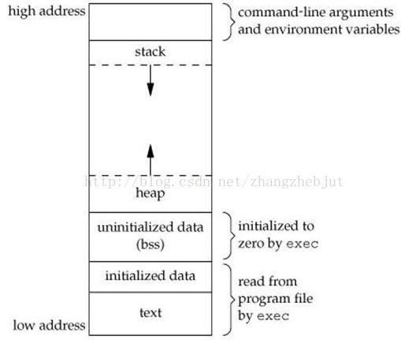
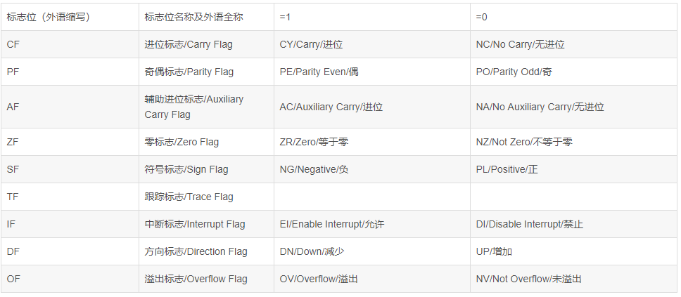
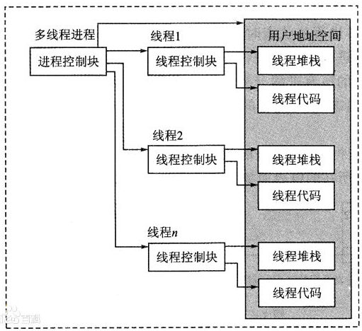

# 一、理论

## 1.进程和线程

### 1.进程间通信的方式

#### 1）管道

管道是一个环形缓冲区，允许两个进程以生产者/消费者的模型进程通信

- 写管道：当一个进程试图写管道时，如果有足够的空间，则写请求被立即执行，否则进程被阻塞
- 读管道：当一个进程试图读管道时，如果读取字节数多于当前管道中的字节数，进程被阻塞

操作系统强制实施互斥，即一次只能有一个进程可以访问管道

**特点：**

1. 它是半双工的（即数据只能在一个方向上流动），具有固定的读端和写端。
2. 它只能用于具有亲缘关系的进程之间的通信（也是父子进程或者兄弟进程之间）。
3. 它可以看成是一种特殊的文件，对于它的读写也可以使用普通的read、write 等函数。但是它不是普通的文件，并不属于其他任何文件系统，并且**只存在于内存**中。

**两类管道**

- 命名管道：共享的进程可以不相关
- 匿名管道：只有父子关系的进程才能共享

#### 2）FIFO（命名管道，是一种文件类型）

**特点：**

1. FIFO可以在无关的进程之间交换数据，与无名管道不同。
2. FIFO有路径名与之相关联，它以一种特殊设备文件形式存在于文件系统中。

```c
#include <sys/stat.h>
// 返回值：成功返回0，出错返回-1
int mkfifo(const char *pathname, mode_t mode);
```

其中的 mode 参数与`open`函数中的 mode 相同。一旦创建了一个 FIFO，就可以用一般的文件I/O函数操作它。

当 open 一个FIFO时，是否设置非阻塞标志（`O_NONBLOCK`）的区别：

- 若没有指定`O_NONBLOCK`（默认），只读 open 要阻塞到某个其他进程为写而打开此 FIFO。类似的，只写 open 要阻塞到某个其他进程为读而打开它。
- 若指定了`O_NONBLOCK`，则只读 open 立即返回。而只写 open 将出错返回 -1 如果没有进程已经为读而打开该 FIFO，其errno置ENXIO。

#### 3）消息队列

消息队列是消息的链接表，存放在内核中，一个消息队列由一个标识符（队列ID）来标识。

每个进程都有一个关联的消息队列，功能类似于信箱

- 发送消息：发送者指定发送消息的类型。试图给一个满队列发送时进程会被阻塞
- 接收消息：接收者可以按先进先出的顺序接收信息；也可以按类型接收；试图从空队列读消息时，进程会被阻塞，试图读取某一类型消息，但是该类型消息不存在时，不会阻塞进程

**特点：**

1. 消息队列是面向记录的，其中的消息具有特定的格式以及特定的优先级。
2. 消息队列独立于发送与接收进程。进程终止时，消息队列及其内容并不会被删除。
3. 消息队列可以实现消息的随机查询,消息不一定要以先进先出的次序读取,也可以按消息的类型读取。

#### 4）共享内存

共享内存是UNIX提供的进程间通信手段中速度最快的一种。共享内存是**虚存**中由多个进程共享的一个公共内存块。互斥约束不属于共享内存机制的一部分，但必须由使用共享内存的进程提供。

**特点：**

1. 共享内存是最快的一种 IPC，因为进程是直接对内存进行存取。
2. 因为多个进程可以同时操作，所以需要进行同步。
3. 信号量+共享内存通常结合在一起使用，信号量用来同步对共享内存的访问。

#### 5）信号量

UNIX System V中的信号量**系统调用**是对semWait和semSignal原语的推广。

**特点：**

1. 信号量用于进程间同步，若要在进程间**传递数据需要结合共享内存。**
2. 信号量基于操作系统的 PV 操作，程序对信号量的操作都是原子操作。
3. 每次对信号量的 PV 操作不仅限于对信号量值加 1 或减 1，而且可以加减任意正整数。
4. 支持信号量组。

#### 6）信号

信号是用于向一个进程通知发生异步事件的机制。类似于硬件中断，但没有优先级，即内核平等地对待所有的信号。对于同时发送的信号，一次只给进程一个信号，而没有特定的次序

#### 7）套接字

#### 五种通讯方式总结：

1.管道：速度慢，容量有限，只有父子进程能通讯    

2.FIFO：任何进程间都能通讯，但速度慢    

3.消息队列：容量受到系统限制，且要注意第一次读的时候，要考虑上一次没有读完数据的问题    

4.信号量：不能传递复杂消息，只能用来同步    

5.共享内存区：能够很容易控制容量，速度快，但要保持同步，比如一个进程在写的时候，另一个进程要注意读写的问题，相当于线程中的线程安全，当然，共享内存区同样可以用作线程间通讯，不过没这个必要，线程间本来就已经共享了同一进程内的一块内存

### 2.进程和线程的区别联系？

（组成，效率，通信，安全性）

**进程概念**：进程是表示**资源分配的基本单位**，又是**调度运行**的基本单位。例如，用户运行自己的程序，系统就创建一个进程，并为它分配资源，包括各种表格、内存空间、磁盘空间、I/O设备等。然后，把该进程放人进程的就绪队列。进程调度程序选中它，为它分配CPU以及其它有关资源，该进程才真正运行。所以，进程是系统中的并发执行的单位。

**线程概念：**线程是**进程中执行运算的最小单位**，亦即**执行处理机调度的基本单位**。如果把进程理解为在逻辑上操作系统所完成的任务，那么线程表示完成该任务的许多可能的子任务之一。线程可以在处理器上独立调度执行，这样，在多处理器环境下就允许几个线程各自在单独处理器上进行。操作系统提供线程就是为了方便而有效地实现这种并发性。

引入线程的好处：

（1）易于调度。

（2）提高并发性。通过线程可方便有效地实现并发性。进程可创建多个线程来执行同一程序的不同部分。

（3）开销少。创建线程比创建进程要快，所需开销很少。。

（4）利于充分发挥多处理器的功能。通过创建多线程进程（即一个进程可具有两个或更多个线程），每个线程在一个处理器上运行，从而实现应用程序的并发性，使每个处理器都得到充分运行。

**进程和线程的关系**

（1）一个线程只能属于一个进程，而一个进程可以有多个线程，但至少有一个线程。线程是操作系统可识别的最小执行和调度单位。

（2）资源分配给进程，同一进程的所有线程共享该进程的所有资源。 同一进程中的多个线程共享代码段(代码和常量)，数据段(全局变量和静态变量)，扩展段(堆存储)。但是每个线程拥有自己的栈段，栈段又叫运行时段，用来存放所有局部变量和临时变量。

（3）处理机分给线程，即真正在处理机上运行的是线程。

（4）线程在执行过程中，需要协作同步。不同进程的线程间要利用消息通信的办法实现同步。

简言之，由于进程是一个资源拥有者，因而在进程的创建、撤消和切换中，系统必须为之付出较大的时空开销。也正因为如此，在系统中所设置的进程数目不宜过多，进程切换的频率也不宜太高，但这也就限制了并发程度的进一步提高。

如何能使多个程序更好地并发执行，同时又尽量减少系统的开销，已成为近年来设计操作系统时所追求的重要目标。于是，有不少操作系统的学者们想到，可否将进 程的上述属性分开，由操作系统分开来进行处理。即对作为调度和分派的基本单位，不同时作为独立分配资源的单位，以使之轻装运行；而对拥有资源的基本单位， 又不频繁地对之进行切换。正是在这种思想的指导下，产生了线程概念。同一进程中的多个线程 之间可以并发执行

#### **比较：**

1．调度

在传统的操作系统中，拥有资源的基本单位和独立调度、分派的基本单位都是进程。而在引入线程的操作系统中，则把线程作为调度和分派的基本单位。而把进程作 为资源拥有的基本单位，使传统进程的两个属性分开，线程便能轻装运行，从而可显著地提高系统的并发程度。在同一进程中，线程的切换不会引起进程的切换，在 由一个进程中的线程切换到另一个进程中的线程时，将会引起进程的切换。

2．并发性

在引入线程的操作系统中，不仅进程之间可以并发执行，而且在一个进程中的多个线程之间，亦可并发执行，因而使操作系统具有更好的并发性，从而能更有效地使 用系统资源和提高系统吞吐量。例如，在一个未引入线程的单CPU操作系统中，若仅设置一个文件服务进程，当它由于某种原因而被阻塞时，便没有其它的文件服 务进程来提供服务。在引入了线程的操作系统中，可以在一个文件服务进程中，设置多个服务线程，当第一个线程等待时，文件服务进程中的第二个线程可以继续运 行；当第二个线程阻塞时，第三个线程可以继续执行，从而显著地提高了文件服务的质量以及系统吞吐量。

3．拥有资源

不论是传统的操作系统，还是设有线程的操作系统，进程都是拥有资源的一个独立单位，它可以拥有自己的资源。一般地说，线程自己不拥有系统资源(也有一点必 不可少的资源)，但它可以访问其隶属进程的资源。亦即，一个进程的代码段、数据段以及系统资源，如已打开的文件、I/O设备等，可供问一进程的其它所有线 程共享。

4．系统开销

由于在创建或撤消进程时，系统都要为之分配或回收资源，如内存空间、I／o设备等。因此，操作系统所付出的开销将显著地大于在创建或撤消线程时的开销。类似地，在进行进程切换时，涉及到整个当前进程CPU环境的保存以及新被调度运行的进程的CPU环境的设置。而线程切换只须保存和设置少量寄存器的内容，并 不涉及存储器管理方面的操作。可见，进程切换的开销也远大于线程切换的开销。此外，由于同一进程中的多个线程具有相同的地址空间，致使它们之间的同步和通信的实现，也变得比较容易。在有的系统中，线程的切换、同步和通信都无须

**引入协程：**是一种比线程更加轻量级的存在，协程不是被操作系统内核所管理，而完全是由程序所控制（也就是在用户态执行）。这样带来的好处就是性能得到了很大的提升，不会像线程切换那样消耗资源。
和多线程比的优势：极高的执行效率：因为子程序切换不是线程切换，而是由程序自身控制，因此，没有线程切换的开销，和多线程比，线程数量越多，协程的性能优势就越明显；不需要多线程的锁机制：因为只有一个线程，也不存在同时写变量冲突，在协程中控制共享资源不加锁，只需要判断状态就好了，所以执行效率比多线程高很多

### 3.进程的地址空间布局



程序段text：程序代码在内存中的映射，存放函数体的二进制代码。

初始化的数据段data：在程序运行初已经对变量进行初始化的数据。

未初始化的数据段bss：在程序运行初未对变量进行初始化的数据。

堆 heap：  存储动态内存分配,需要程序员手工分配,手工释放。向上增长

内存映射段mms：内核将文件的内容映射到内存

栈stack：存储局部、临时变量，函数调用时，存储函数的返回指针，用于控制函数的调用和返回。在程序块开始时自动分配内存,结束时自动释放内存，其操作方式类似于数据结构中的栈。

注：

- 0-3G是用户空间：供各个进程使用，因为每个进程可以通过系统调用进入内核，因此，Linux内核由系统内的所有进程共享。于是，从具体进程的角度来看，每个进程可以拥有4G字节的虚拟空间。

- 不管是内核空间还是用户空间，它们都处于虚拟空间中。 虽然内核空间占据了每个虚拟空间中的最高1GB字节，但映射到物理内存却总是从最低地址（0x00000000），另外，使用虚拟地址可以很好的保护内核空间被用户空间破坏，虚拟地址到物理地址转换过程有操作系统和CPU共同完成(操作系统为CPU设置好页表，CPU通过MMU单元进行地址转换)。

### 4.程序状态字

程序状态字（Program Status Word, PSW）又称状态寄存器，主要用于反映处理器的状态及某些计算结果以及控制指令的执行。



### 5.进程创建的步骤

1. 给新进程分配一个唯一的进程标识符
2. 给新进程分配空间（包括进程映像中的所有元素）
3. 初始化进程控制块
4. 设置正确的连接（保存到相应队列），将新进程插入到就绪队列

### 6.进程切换的步骤

1. 正向模式切换并押压入PSW/PC，
2. 保存处理器上下文环境（包括程序计数器和其它寄存器），保存被中断进程的现场信息。
3. 更新当前处于运行态进程的进程控制块（状态和其它信息）
4. 将中断的进程控制块移到相应队列
5. 选择另一个占用cpu的进程执行
6. 更新所选择进程的进程控制块（包括将状态变为运行态）
7. 更新内存管理的数据结构，设计被选中进程的地址空间
8. 恢复处理器在被选择的进程最近一次切换出运行状态时的上下文环境
9. 逆向模式转换并弹出PSW/PC

> **进程切换一定有模式切换；模式切换不一定有进程切换**（中断会发生模式切换，但是在大多数操作系统中，中断的发生并不是必须伴随着进程的切换的。可能是中断处理器执行之后，当前正在运行的程序继续执行）；

### 7.一个程序从开始运行到结束的完整过程

1.预处理：主要处理源代码中的预处理指令，引入头文件，去除注释，处理所有的条件编译指令，宏的替换，添加行号，保留所有的编译器指令

2.编译：对预处理后的文件进行语法分析，词法分析，语义分析，符号汇总，然后生成汇编代码

3.汇编：将汇编代码转成二进制文件，二进制文件就可以让机器来读取。每一条汇编语句都会产生一句机器语言。

4.链接：分为静态链接和动态链接：

​		静态链接：后缀是.a，主要在编译的时候将库文件里面代码搬迁到可执行的文件中；

​		动态链接：后缀是.so, 主要在执行的时候需要转换到库文件代码执行；

两种链接的优缺点：

（1）静态的链接产生的可执行的文件体积比较的大；而动态链接的可执行文件的体积比较小；

（2）动态的链接的编译的效率比较的高；

（3）静态链接的可执行的文件执行的效率高

（4）静态链接的可执行的文件的“布局”比较好一点；

在linux中，静态库为lib\*.a，动态库为lib\*.so。

静态链接库在编译时链接。动态链接库在运行时加载。静态链接将库位烘焙到您的可执行文件中。动态链接仅烘焙对库的引用; 动态库的位存在于别处，可以在以后换出。

### 8.线程分配什么？TCB(线程控制块)?

进程中所有线程共享该进程的状态和资源。线程状态：运行，就绪，阻塞。线程分类：用户，内核

新派生的线程拥有自己的寄存器上下文和栈空间，且放置在就绪队列中。

**线程的共享资源**：进程代码段、进程的公有数据(利用这些共享的数据，线程很容易的实现相互之间的通讯)、进程打开的文件描述符、信号的处理器、进程的当前目录和进程用户ID与进程组ID

**线程的私有资源**：
		1.线程ID：每个线程都有自己的线程ID，这个ID在本进程中是唯一的。进程用此来标识线程。   
		2.寄存器组的值：由于线程间是并发运行的，每个线程有自己不同的运行线索，当从一个线程切换到另一个线程上时，必须将原有的线程的寄存器集合的状态保存，以便将来该线程在被重新切换到时能得以恢复。   
		3.线程的堆栈：堆栈是保证线程独立运行所必须的。线程函数可以调用函数，而被调用函数中又是可以层层嵌套的，所以线程必须拥有自己的函数堆栈，使得函数调用可以正常执行，不受其他线程的影响。
		4.错误返回码：由于同一个进程中有很多个线程在同时运行，可能某个线程进行系统调用后设置了errno值，而在该线程还没有处理这个错误，另外一个线程就在此时被调度器投入运行，这样错误值就有可能被修改。所以，不同的线程应该拥有自己的错误返回码变量。
		5.线程的信号屏蔽码：由于每个线程所感兴趣的信号不同，所以线程的信号屏蔽码应该由线程自   己管理。但所有的线程都共享同样的信号处理器。
		6.线程的优先级由于线程需要像进程那样能够被调度，那么就必须要有可供调度使用的参   数，这个参数就是线程的优先级。



### 9.线程共享进程的什么？不共享什么？cpu共享吗？

共享：堆，全局变量，静态变量，文件等公共资源，地址空间，代码段

不共享：栈，寄存器，id

n核cpu支持最多同时运行的线程数为n,多少个线程都ok，一个核心只能同时执行一个线程。

**对于线程来说只有CPU里的东西是自己独享的**

### 10.怎样保证一个CPU只有一个线程运行？

时间分片轮转，同一时刻在只能执行一个线程。

（CPU核数与多线程）

多线程实际上是计算机多种资源的并行运用，跟CPU有几个核心是没什么关系的。

### 11.线程有什么状态？

和进程一样，线程的关键状态有**运行态、就绪态和阻塞态**。一般来说，挂起态对线程没有什么意义。这是由于此类状态是一个进程级的概念。特别地，如果一个进程被换出，由于它的所有线程都共享该进程的地址空间，因此它们必须都被换出

有4种与线程相关的基本操作：

**派生**：在典型情况下，当派生一个新进程时，同时也为该进程派生了一个线程。随后，进程中的线程可以在同一进程中派生另一个线程，并为新线程提供指令指针和参数；新线程拥有自己的寄存器上下文和栈空间，且被放置在就绪队列中
**阻塞**：当线程需要等待一个事件时，它将被阻塞（保存它的用户寄存器、程序计数器和栈指针），此时处理器转而执行另一个处于同一进程中或不同进程中的就绪线程
**解除阻塞**：当阻塞一个线程的事件发生时，该线程被转移到就绪队列中
**结束**：当一个线程完成时，其寄存器上下文和栈都被释放

### 12.线程池的了解、优点、调度处理方式和保护任务队列的方式？

**线程池**：线程池采用预创建的技术，在应用程序启动之后，将立即创建一定数量的线程(N1)，放入空闲队列中。这些线程都是处于阻塞（Suspended）状态，不消耗CPU，但占用较小的内存空间。当任务到来后，缓冲池选择一个空闲线程，把任务传入此线程中运行。当N1个线程都在处理任务后，缓冲池自动创建一定数量的新线程，用于处理更多的任务。在任务执行完毕后线程也不退出，而是继续保持在池中等待下一次的任务。当系统比较空闲时，大部分线程都一直处于暂停状态，线程池自动销毁一部分线程，回收系统资源

**优点**：减少多个线程不停创建销毁的开销，动态地扩充和减小，基于这种预创建技术，线程池将线程创建和销毁本身所带来的开销分摊到了各个具体的任务上，执行次数越多，每个任务所分担到的线程本身开销则越小，不过我们另外可能需要考虑进去线程之间同步所带来的开销。**可以有效控制最大并发线程数，提高系统资源的利用率，同时可以避免过多资源竞争，提供定时执行，定期执行**

**适合场景：**前提必须是线程本身的开销相对于线程任务执行开销是很大的。
		(1)单位时间内处理任务频繁而且任务处理时间短
		(2)对实时性要求较高。如果接受到任务后在创建线程，可能满足不了实时要求，因此必须采用线程池进行预创建。

**调度处理方式**：主线程往任务队列尾部添加任务，线程池中的服务线程不断从任务队列头部取出任务

**保护任务队列的方式**：任务队列是临界资源，需要加锁进行保护。主线程往任务队列添加任务时需要加锁，服务线程从任务队列取任务也许加锁，当服务线程发现任务队列空时需等待（主线程往任务队列中加任务时唤醒等待的服务线程），同时当队列满时，主线程需等待，当服务线程取走一个任务时唤醒主线程，为简化问题，假设任务队列是无限大的即主线程不需要等待。